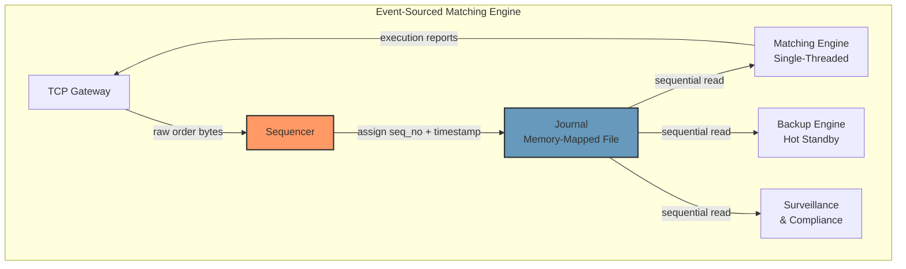
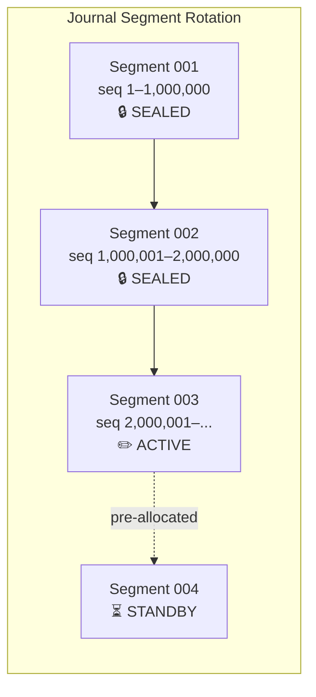
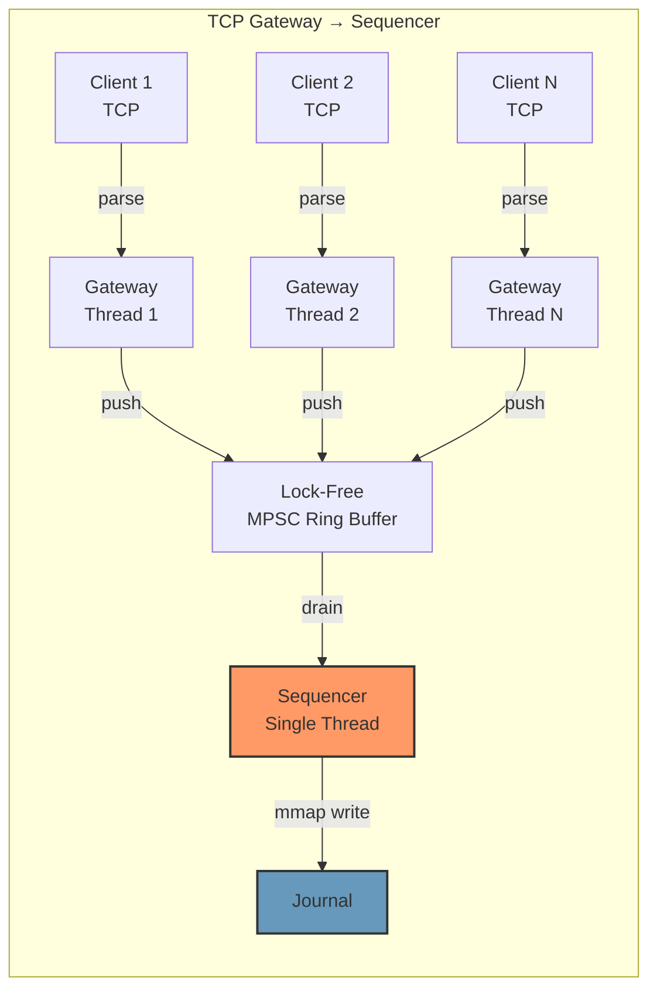

# Chapter 1: The Ingress Sequencer & Event Sourcing 🟢

> **The Problem:** You are designing the front door of an exchange matching engine. Orders arrive over TCP from thousands of clients at rates exceeding 500,000/second. Every order must be assigned a globally unique, monotonically increasing sequence number, durably persisted, and forwarded to the matching engine — all in under 5 microseconds. You cannot use a database. You cannot use a message broker. You cannot lose a single order. How do you build it?

---

## Why the Matching Engine Never Talks to a Database

Let us begin with the architecture that every junior engineer proposes, and systematically destroy it.

### The Naive Architecture

```
Client → TCP Gateway → PostgreSQL (INSERT INTO orders ...) → Matching Engine (SELECT ... FOR UPDATE)
```

| Operation | Typical Latency |
|---|---|
| TCP receive + parse | 2–5 µs |
| PostgreSQL INSERT (WAL flush) | 200–2,000 µs |
| SELECT + row lock | 100–500 µs |
| **Total** | **300–2,500 µs** |

This is **100–500× too slow**. A competing exchange matching at 5µs will steal every market maker — and with them, all liquidity.

But latency is not even the real problem. The real problems are:

1. **Non-determinism.** Database transactions can deadlock, retry, reorder. Two replicas querying the same database will not produce identical state.
2. **No replay.** If the engine crashes, you cannot replay the exact sequence of events to reconstruct state. The database state is the *result* of processing, not the *input*.
3. **Coupling.** The matching engine's throughput is now gated by the database's throughput. You have made the fastest component (pure CPU compute) dependent on the slowest (disk I/O).

### The Event-Sourced Architecture

The fundamental insight is: **the matching engine's input is a sequence of events, not a mutable database.** We separate *ingress* (receiving and sequencing orders) from *processing* (matching) from *storage* (the journal).



The **Sequencer** is the single gateway. It:

1. Receives raw order bytes from the TCP gateway.
2. Assigns a **monotonically increasing 64-bit sequence number**.
3. Stamps a **nanosecond-precision timestamp** (from `CLOCK_REALTIME` or a GPS/PTP-synchronized clock).
4. **Appends** the sequenced message to a memory-mapped journal file.
5. Passes the message to the matching engine (via shared memory or a lock-free ring buffer).

The **Journal** is the single source of truth. It is an append-only, immutable log. Every downstream consumer — the primary engine, the backup engine, compliance, market data — reads the same journal in the same order.

> **Key Takeaway:** The journal is the database. The matching engine is a *derived view* — a pure function from journal to state. If the engine crashes, you replay the journal from the beginning and arrive at the exact same state.

---

## Designing the Sequencer

### The Message Format

Every message in the journal has a fixed-size header followed by a variable-length payload:

```rust
/// Journal message header — 32 bytes, naturally aligned.
/// All integer fields are little-endian.
#[repr(C, packed)]
#[derive(Clone, Copy)]
pub struct JournalHeader {
    /// Monotonically increasing sequence number (1-based).
    pub seq_no: u64,
    /// Nanosecond-precision wall-clock timestamp.
    pub timestamp_ns: u64,
    /// Length of the payload in bytes (excludes header).
    pub payload_len: u32,
    /// Message type tag (NewOrder, Cancel, Amend, etc.).
    pub msg_type: u16,
    /// CRC-32C checksum of the payload (for corruption detection).
    pub checksum: u16,
    /// Reserved for future use — keeps header at 32 bytes.
    pub _reserved: u32,
}

/// The order payload for a NewOrder message.
/// Fixed-point price: actual_price = price / 10_000 (4 decimal places).
#[repr(C)]
#[derive(Clone, Copy)]
pub struct NewOrderPayload {
    /// Unique client-assigned order ID.
    pub client_order_id: u64,
    /// Instrument identifier (internal numeric symbol ID).
    pub instrument_id: u32,
    /// Side: 1 = Buy, 2 = Sell.
    pub side: u8,
    /// Order type: 1 = Limit, 2 = Market.
    pub order_type: u8,
    /// Padding for alignment.
    pub _pad: [u8; 2],
    /// Price in fixed-point (e.g., 1_500_100 = $150.0100).
    pub price: i64,
    /// Quantity in whole shares.
    pub quantity: u64,
    /// Account/trader ID for risk attribution.
    pub account_id: u32,
    /// Time-in-force: 0 = Day, 1 = IOC, 2 = FOK.
    pub time_in_force: u8,
    pub _pad2: [u8; 3],
}
```

**Why fixed-size header?** The journal reader can seek to any message by computing `offset = header_size * N + Σ(payload_len[0..N])`. In practice, we use a secondary index (an array of offsets) for O(1) random access.

**Why `#[repr(C)]`?** The struct layout must be identical across compilations, platforms, and engine replicas. Rust's default representation is non-deterministic across compiler versions.

### Memory-Mapped Journal

The journal is a pre-allocated file mapped into the process's virtual address space via `mmap`. Writing to the journal is a memory copy — no system call per write.

#### The Naive Way: Write Syscalls

```rust
// ❌ SLOW: Every write is a syscall
fn append_naive(file: &mut File, header: &JournalHeader, payload: &[u8]) {
    file.write_all(bytemuck::bytes_of(header)).unwrap();
    file.write_all(payload).unwrap();
    file.sync_data().unwrap(); // fsync — 50-200µs!
}
```

| Step | Latency |
|---|---|
| `write_all` (header) | ~1 µs (syscall overhead) |
| `write_all` (payload) | ~1 µs |
| `sync_data` (fsync) | 50–200 µs |
| **Total** | **52–202 µs** |

#### The Production Way: Memory-Mapped + Battery-Backed Write Cache

```rust
use std::ptr;

/// A memory-mapped journal backed by a pre-allocated file.
pub struct Journal {
    /// Pointer to the start of the memory-mapped region.
    base: *mut u8,
    /// Current write offset (always at the end of the last message).
    write_offset: usize,
    /// Total capacity of the mapped region in bytes.
    capacity: usize,
    /// Current sequence number.
    next_seq_no: u64,
}

impl Journal {
    /// Append a message to the journal. Returns the assigned sequence number.
    ///
    /// # Safety
    /// - `base` must point to a valid mmap'd region of at least `capacity` bytes.
    /// - Only one thread may call `append` (single-writer invariant).
    pub unsafe fn append(&mut self, msg_type: u16, payload: &[u8]) -> u64 {
        let header = JournalHeader {
            seq_no: self.next_seq_no,
            timestamp_ns: current_time_ns(),
            payload_len: payload.len() as u32,
            msg_type,
            checksum: crc32c(payload),
            _reserved: 0,
        };

        let header_bytes = bytemuck::bytes_of(&header);
        let total_len = header_bytes.len() + payload.len();

        // Bounds check
        assert!(
            self.write_offset + total_len <= self.capacity,
            "journal full — rotate to next segment"
        );

        // Copy header + payload into mmap'd memory (no syscall!)
        let dst = self.base.add(self.write_offset);
        ptr::copy_nonoverlapping(header_bytes.as_ptr(), dst, header_bytes.len());
        ptr::copy_nonoverlapping(
            payload.as_ptr(),
            dst.add(header_bytes.len()),
            payload.len(),
        );

        // Memory fence: ensure writes are visible to readers
        // (backup engine reading the same mmap on this machine)
        std::sync::atomic::fence(std::sync::atomic::Ordering::Release);

        self.write_offset += total_len;
        let assigned = self.next_seq_no;
        self.next_seq_no += 1;
        assigned
    }
}
```

| Step | Latency |
|---|---|
| Timestamp read (`clock_gettime`) | ~20 ns |
| CRC-32C (hardware-accelerated, 64-byte payload) | ~5 ns |
| `memcpy` header + payload into mmap | ~10 ns |
| Atomic fence | ~5 ns |
| **Total** | **~40 ns** |

**Where's the durability?** The memory-mapped pages are backed by the page cache. The kernel flushes dirty pages to disk asynchronously. For true durability, exchange-grade systems use one of:

| Strategy | Durability Guarantee | Latency Impact |
|---|---|---|
| Battery-Backed Write Cache (BBWC) | Survives power loss — the RAID controller's battery flushes to disk | ~0 ns (write hits controller DRAM) |
| `msync(MS_ASYNC)` periodic flush | Survives process crash, not power loss | ~0 ns hot path, background flush |
| `msync(MS_SYNC)` every N messages | Survives power loss (batched) | ~50 µs amortized over N |
| NVMe + `fdatasync` per message | Survives power loss | ~10–20 µs per message |

Production exchanges use **BBWC RAID controllers** (e.g., MegaRAID with CacheVault). The write hits battery-backed DRAM and is treated as durable immediately. The controller flushes to SSD independently.

---

## Journal File Management

### Pre-Allocation with `fallocate`

We never let the operating system grow the file on demand — that would trigger metadata updates (extent allocation) on the hot path.

```rust
use std::os::unix::io::AsRawFd;

/// Pre-allocate a journal segment of `size` bytes.
fn preallocate_journal(path: &str, size: usize) -> std::io::Result<std::fs::File> {
    let file = std::fs::OpenOptions::new()
        .read(true)
        .write(true)
        .create(true)
        .truncate(true)
        .open(path)?;

    // Pre-allocate disk blocks without zeroing
    // (FALLOC_FL_KEEP_SIZE is NOT set — we want the file to report full size)
    unsafe {
        let ret = libc::fallocate(file.as_raw_fd(), 0, 0, size as libc::off_t);
        if ret != 0 {
            return Err(std::io::Error::last_os_error());
        }
    }

    Ok(file)
}
```

### Segment Rotation

When a journal segment fills up, the sequencer:

1. Opens and pre-allocates the *next* segment (done in advance by a background thread).
2. Atomically switches the write pointer to the new segment.
3. The old segment becomes immutable — available for archival, compliance, or replay.



---

## The Single-Writer Invariant

The sequencer is a **single writer**. Only one thread, on one machine, ever appends to the journal. This is not a limitation — it is an architectural requirement.

### Why Single-Writer?

| Concern | Multi-Writer Consequence | Single-Writer Solution |
|---|---|---|
| **Ordering** | Requires distributed consensus (Paxos/Raft) — adds 100s of µs | One writer = total order by definition |
| **Sequence gaps** | CAS retries can create gaps in sequence numbers | Monotonic increment — no gaps, ever |
| **Durability** | Coordinating fsync across writers adds complexity | One writer, one file, one flush policy |
| **Determinism** | Concurrent writers produce non-deterministic interleaving | Sequential append = deterministic replay |

### How Do We Handle 500K Orders/Second with One Thread?

Because the sequencer does *almost nothing*. It does not match. It does not validate. It does not compute. It:

1. Reads a pre-parsed message from a ring buffer (fed by the TCP gateway threads).
2. Assigns `seq_no` (an integer increment).
3. Stamps a timestamp (a single `clock_gettime` call).
4. Computes CRC-32C (hardware-accelerated, ~5ns for 64 bytes).
5. Copies ~96 bytes into mmap'd memory.

Total: **~40–60 ns per message**. That supports **16–25 million messages/second** on a single core. The bottleneck is never the sequencer.

---

## TCP Gateway: Feeding the Sequencer

The TCP gateway is a multi-threaded component that:

1. Accepts TCP connections from clients (one connection per session).
2. Parses the binary protocol (or FIX, if you must).
3. Pushes parsed messages onto a **lock-free MPSC ring buffer** shared with the sequencer.



### The Ring Buffer

The ring buffer between the gateway threads and the sequencer is the critical hand-off point. It must be:

- **Lock-free** — no mutex contention on the hot path.
- **Bounded** — back-pressure if the sequencer falls behind.
- **Cache-friendly** — entries are cache-line sized (64 bytes) to avoid false sharing.

```rust
use std::sync::atomic::{AtomicU64, Ordering};

/// A fixed-size, cache-line-padded MPSC ring buffer.
/// Producers (gateway threads) CAS on `write_head`.
/// Consumer (sequencer) reads from `read_tail`.
pub struct MpscRingBuffer<T> {
    buffer: Box<[MaybeUninit<T>]>,
    capacity: usize,
    /// Shared write cursor — producers CAS to claim a slot.
    write_head: CachePadded<AtomicU64>,
    /// Private read cursor — only the sequencer reads this.
    read_tail: CachePadded<AtomicU64>,
}

/// Prevent false sharing by padding to 128 bytes (two cache lines).
#[repr(align(128))]
struct CachePadded<T>(T);

impl<T: Copy> MpscRingBuffer<T> {
    /// Producer: claim a slot and write a message.
    pub fn push(&self, item: T) -> Result<(), T> {
        loop {
            let head = self.write_head.0.load(Ordering::Relaxed);
            let tail = self.read_tail.0.load(Ordering::Acquire);

            // Buffer full?
            if head - tail >= self.capacity as u64 {
                return Err(item); // back-pressure
            }

            // CAS to claim the slot
            if self
                .write_head
                .0
                .compare_exchange_weak(head, head + 1, Ordering::AcqRel, Ordering::Relaxed)
                .is_ok()
            {
                let idx = (head % self.capacity as u64) as usize;
                unsafe {
                    let slot = &self.buffer[idx] as *const _ as *mut T;
                    slot.write(item);
                }
                return Ok(());
            }
            // CAS failed — another producer won. Retry.
        }
    }

    /// Consumer (sequencer): drain all available messages.
    pub fn drain(&self, out: &mut Vec<T>) {
        let tail = self.read_tail.0.load(Ordering::Relaxed);
        let head = self.write_head.0.load(Ordering::Acquire);

        for seq in tail..head {
            let idx = (seq % self.capacity as u64) as usize;
            let item = unsafe { self.buffer[idx].assume_init() };
            out.push(item);
        }

        if head > tail {
            self.read_tail.0.store(head, Ordering::Release);
        }
    }
}
```

> **Note:** This simplified ring buffer illustrates the pattern. Production implementations (e.g., the [LMAX Disruptor](https://lmax-exchange.github.io/disruptor/) pattern) add per-slot publish flags to avoid reading partially-written entries.

---

## Event Sourcing: The Journal as the Source of Truth

The journal is not a "log for debugging." It is the **authoritative, immutable record of everything that happened**. Every other piece of state — the order book, account balances, position totals — is a **derived projection** that can be recomputed from the journal at any time.

### Database-Backed vs Event-Sourced: Side by Side

<table>
<tr><th>Database-Backed Engine</th><th>Event-Sourced Engine</th></tr>
<tr>
<td>

```
// On order arrival:
BEGIN TRANSACTION;
INSERT INTO orders (...) VALUES (...);
UPDATE accounts SET balance = balance - hold;
-- match logic --
UPDATE orders SET status = 'FILLED';
INSERT INTO trades (...) VALUES (...);
COMMIT;
```

</td>
<td>

```
// On order arrival:
let seq = journal.append(NewOrder, &payload);

// Engine reads journal entry, updates in-memory state:
book.insert(order);
let trades = book.match_at_price(order.price);
for trade in &trades {
    journal.append(TradeExecution, trade);
}
```

</td>
</tr>
<tr>
<td>

**Disaster recovery:** Restore from database backup (hours). State may be inconsistent if mid-transaction.

</td>
<td>

**Disaster recovery:** Replay journal from seq 0 (seconds to minutes). State is *guaranteed* identical.

</td>
</tr>
<tr>
<td>

**Auditing:** Hope your SQL audit triggers caught everything.

</td>
<td>

**Auditing:** The journal *is* the audit trail. Every input and output is recorded, in order, forever.

</td>
</tr>
</table>

### The Replay Guarantee

The most powerful property of event sourcing is **deterministic replay**:

```
f(journal[0..N]) → State_N
```

If you replay the first N messages of the journal through the matching engine (starting from empty state), you *always* get the same `State_N`. This enables:

| Capability | How |
|---|---|
| **Crash recovery** | Replay from last snapshot + journal tail |
| **Hot standby** | Backup engine replays the journal in real-time, stays 1 message behind primary |
| **Regulatory replay** | Auditors can replay any trading day and verify every match |
| **Bug investigation** | Replay up to the exact message that triggered abnormal behavior |
| **Performance testing** | Replay production traffic through a new engine version |

We explore deterministic replay in depth in Chapter 3.

---

## Putting It All Together: The Sequencer Hot Path

```rust
/// The sequencer's main loop — single-threaded, pinned to a dedicated CPU core.
fn sequencer_main(
    ring: &MpscRingBuffer<RawOrder>,
    journal: &mut Journal,
    engine_mailbox: &spsc::Sender<JournalEntry>,
) {
    let mut batch = Vec::with_capacity(256);

    loop {
        // Drain all available messages from gateway threads
        ring.drain(&mut batch);

        if batch.is_empty() {
            // Busy-wait (spin) — we never sleep on the hot path.
            // Yielding to the OS scheduler adds 1-15µs jitter.
            std::hint::spin_loop();
            continue;
        }

        for raw_order in batch.drain(..) {
            // 1. Assign sequence number + timestamp
            // 2. Compute checksum
            // 3. Append to mmap'd journal
            let seq_no = unsafe {
                journal.append(raw_order.msg_type, &raw_order.payload)
            };

            // 4. Forward to matching engine via SPSC ring buffer
            let entry = JournalEntry {
                seq_no,
                msg_type: raw_order.msg_type,
                payload: raw_order.payload,
            };
            engine_mailbox.send(entry);
        }
    }
}
```

### Latency Budget

| Step | Latency |
|---|---|
| `ring.drain()` — read from MPSC buffer | ~10 ns |
| `clock_gettime(CLOCK_REALTIME)` | ~20 ns |
| CRC-32C (64-byte payload, SSE 4.2) | ~5 ns |
| `memcpy` to mmap | ~10 ns |
| Atomic fence | ~5 ns |
| SPSC send to engine | ~10 ns |
| **Total per message** | **~60 ns** |

At 60ns per message, the sequencer can handle **~16.6 million messages/second** — far beyond any exchange's peak rate.

---

## Exercises

### Exercise 1: Journal Corruption Detection

The journal header contains a CRC-32C checksum. Write a `verify_journal` function that reads a journal file sequentially and reports any messages with checksum mismatches.

<details>
<summary>Solution</summary>

```rust
fn verify_journal(path: &str) -> Vec<u64> {
    let data = std::fs::read(path).expect("failed to read journal");
    let mut offset = 0;
    let mut corrupted = Vec::new();

    while offset + std::mem::size_of::<JournalHeader>() <= data.len() {
        let header: JournalHeader =
            unsafe { std::ptr::read_unaligned(data.as_ptr().add(offset) as *const _) };

        let payload_start = offset + std::mem::size_of::<JournalHeader>();
        let payload_end = payload_start + header.payload_len as usize;

        if payload_end > data.len() {
            break; // truncated message
        }

        let actual_crc = crc32c(&data[payload_start..payload_end]);
        if actual_crc != header.checksum {
            corrupted.push(header.seq_no);
        }

        offset = payload_end;
    }

    corrupted
}
```

</details>

### Exercise 2: Snapshot + Replay

Design a scheme where the matching engine periodically writes a **snapshot** of its in-memory state to disk, so that replay after a crash doesn't need to start from sequence number 1. What information must the snapshot contain? How do you guarantee the snapshot is consistent?

<details>
<summary>Solution</summary>

The snapshot must contain:

1. **The sequence number of the last processed message** — so replay starts from `snapshot_seq + 1`.
2. **The full order book state** — all resting orders at every price level, preserving FIFO order within each level.
3. **Account states** — balances, positions, and any pending holds (for risk).

Consistency guarantee: The matching engine writes the snapshot *synchronously* during a pause in processing (between journal messages). Since the engine is single-threaded, the snapshot is trivially consistent — no concurrent mutations can occur during the serialization.

```rust
fn take_snapshot(engine: &MatchingEngine, journal_seq: u64) {
    let snap = Snapshot {
        seq_no: journal_seq,
        book: engine.book.serialize(),
        accounts: engine.accounts.serialize(),
    };
    let bytes = snap.to_bytes(); // deterministic serialization
    let path = format!("snapshots/snap_{:016}.bin", journal_seq);
    std::fs::write(&path, &bytes).expect("snapshot write failed");
    // fsync the file and the directory entry
    let f = std::fs::File::open(&path).unwrap();
    f.sync_all().unwrap();
}
```

On startup, the engine loads the latest snapshot and replays only the journal entries *after* the snapshot's sequence number. This reduces recovery time from minutes to milliseconds.

</details>

---

> **Key Takeaways**
>
> 1. The matching engine **never touches a database** on the hot path. The journal is the database.
> 2. The **Sequencer** is a single-threaded process that assigns monotonic sequence numbers and appends to a memory-mapped file. Total cost: ~60ns per message.
> 3. **Event sourcing** means every piece of state is a derived projection of the journal. Crash recovery = replay. Auditing = replay. Testing = replay.
> 4. The journal uses **`mmap` + `fallocate` pre-allocation** to eliminate syscalls from the write path. Durability comes from battery-backed write cache, not per-message `fsync`.
> 5. The **MPSC ring buffer** between TCP gateway threads and the sequencer is the only synchronization point. It is lock-free and cache-line padded.
> 6. The **single-writer invariant** is not a compromise — it is the design. One writer means total order, no consensus, no gaps, deterministic replay.
