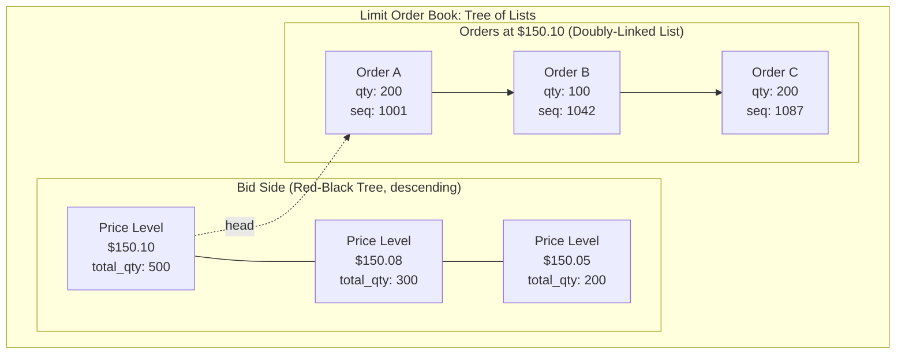
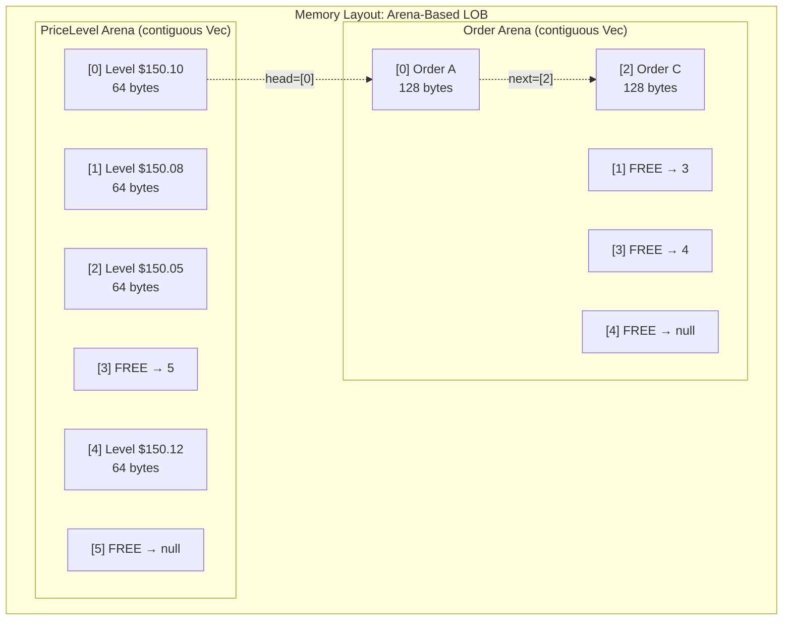

# Chapter 2: The Limit Order Book (LOB) 🟡

> **The Problem:** You must design the central data structure of the matching engine — the Limit Order Book. It must support 500,000+ insertions and cancellations per second, match incoming aggressive orders against resting passive orders in price-time priority, and allow the market data publisher to read the top N price levels at any time. All operations must be $O(1)$ or $O(\log P)$ where $P$ is the number of distinct price levels (typically < 1,000). You cannot allocate heap memory on the hot path. How do you structure it?

---

## The Anatomy of an Order Book

Every tradable instrument (AAPL, BTC-USD, ES futures) has its own order book. The book has two sides:

| Side | Sort Order | Best Price |
|---|---|---|
| **Bids** (buy orders) | Descending by price — highest bid first | `max(bid_prices)` |
| **Asks** (sell orders) | Ascending by price — lowest ask first | `min(ask_prices)` |

Within each side, orders at the same price level are queued in **FIFO order** (time priority). The first order to arrive at a given price is the first to be filled.

### The Three Hot-Path Operations

| Operation | Description | Frequency |
|---|---|---|
| **Insert** | Add a new limit order to the book at its price level | ~60% of all messages |
| **Cancel** | Remove an existing order by ID | ~35% of all messages |
| **Match** | Execute an incoming aggressive order against resting orders | ~5% of all messages |

These three operations account for >99% of the engine's work. They must all be **sub-microsecond**.

---

## Data Structure: The Naive Approach

### The Database Approach

```sql
-- ❌ The approach that will bankrupt your exchange
CREATE TABLE orders (
    order_id    BIGINT PRIMARY KEY,
    instrument  VARCHAR(16),
    side        CHAR(1),    -- 'B' or 'S'
    price       DECIMAL(18,8),
    quantity    BIGINT,
    created_at  TIMESTAMP
);

-- Insert: ~200µs (WAL flush)
INSERT INTO orders VALUES (...);

-- Best bid: ~50µs (index scan)
SELECT * FROM orders
WHERE instrument = 'AAPL' AND side = 'B'
ORDER BY price DESC, created_at ASC
LIMIT 1;

-- Cancel: ~100µs (index lookup + delete)
DELETE FROM orders WHERE order_id = ?;
```

Total latency for a single match cycle: **300–500µs**. A matching engine operating at this speed would be arbitraged into oblivion.

### The Sorted Vec Approach

```rust
// ❌ Slightly better, still too slow
struct NaiveBook {
    bids: Vec<Order>, // sorted by price DESC, time ASC
    asks: Vec<Order>, // sorted by price ASC, time ASC
}

impl NaiveBook {
    fn insert(&mut self, order: Order) {
        // Binary search: O(log N) — fast
        let pos = self.bids.binary_search_by(|o| order.cmp_priority(o)).unwrap_or_else(|e| e);
        // Vec insert at position: O(N) — memcpy of all subsequent elements!
        self.bids.insert(pos, order);
    }
}
```

The `Vec::insert` is $O(N)$ due to element shifting. With 100,000 resting orders, that's ~100µs of `memcpy`. Unacceptable.

---

## The Production Data Structure: Tree of Lists

The key insight is to decompose the problem into two dimensions:

1. **Price levels** — sorted set of distinct prices (typically 200–1,000 active levels per instrument). Navigate with a balanced tree.
2. **Orders at each level** — FIFO queue of orders at the same price. Navigate with a doubly-linked list.



### Complexity Analysis

| Operation | Tree (price levels) | List (orders at level) | Total |
|---|---|---|---|
| **Insert order** | Find/create level: $O(\log P)$ | Append to tail: $O(1)$ | $O(\log P)$ |
| **Cancel order** | — (order has pointer to its level) | Unlink from list: $O(1)$ | $O(1)$ |
| **Match (per fill)** | Find best level: $O(1)$* | Pop from head: $O(1)$ | $O(1)$ |
| **Remove empty level** | Delete from tree: $O(\log P)$ | — | $O(\log P)$ |

*\*The best bid/ask is cached. We only traverse the tree when the best level is exhausted.*

Since $P$ (number of distinct price levels with orders) is typically $< 1{,}000$, $\log_2(1000) \approx 10$ comparisons — well under 100ns on modern hardware.

---

## Designing the Data Structures

### The Price Level

```rust
/// A single price level in the order book.
/// Contains a doubly-linked list of orders at this price.
pub struct PriceLevel {
    /// The price (fixed-point integer, 4 decimal places).
    pub price: i64,
    /// Total quantity across all orders at this level.
    pub total_quantity: u64,
    /// Number of orders at this level.
    pub order_count: u32,
    /// Head of the order queue (first to fill — oldest order).
    pub head: Option<OrderIdx>,
    /// Tail of the order queue (last to fill — newest order).
    pub tail: Option<OrderIdx>,
}
```

### The Order

```rust
/// An order resting on the book.
/// Part of a doubly-linked list within its price level.
pub struct Order {
    /// Unique order ID (from the sequencer's sequence number).
    pub order_id: u64,
    /// Client-assigned order ID (for execution reports).
    pub client_order_id: u64,
    /// Account ID (for risk attribution).
    pub account_id: u32,
    /// Side: Buy or Sell.
    pub side: Side,
    /// Price (fixed-point).
    pub price: i64,
    /// Remaining quantity (decremented on partial fills).
    pub remaining_qty: u64,
    /// Pointer to the price level this order belongs to.
    pub level_idx: LevelIdx,
    /// Previous order in the FIFO queue at this price level.
    pub prev: Option<OrderIdx>,
    /// Next order in the FIFO queue at this price level.
    pub next: Option<OrderIdx>,
}

#[derive(Clone, Copy, PartialEq, Eq)]
pub enum Side {
    Buy,
    Sell,
}
```

### Arena Allocation: Zero Heap Allocation on the Hot Path

We do **not** use `Box`, `Rc`, or any heap allocator for orders and price levels. Instead, we use a **pre-allocated arena** — a flat `Vec` of slots, indexed by dense integer handles.

```rust
/// A typed index into an arena. Prevents accidentally indexing into the wrong arena.
#[derive(Clone, Copy, PartialEq, Eq, Hash)]
pub struct Idx<T> {
    index: u32,
    _marker: std::marker::PhantomData<T>,
}

pub type OrderIdx = Idx<Order>;
pub type LevelIdx = Idx<PriceLevel>;

/// A fixed-capacity arena allocator with O(1) alloc and free.
pub struct Arena<T> {
    /// Pre-allocated storage.
    slots: Vec<Slot<T>>,
    /// Head of the free list (singly-linked through free slots).
    free_head: Option<u32>,
    /// Number of live entries.
    len: u32,
}

enum Slot<T> {
    Occupied(T),
    Free { next_free: Option<u32> },
}

impl<T> Arena<T> {
    /// Allocate a new slot, returning its index. O(1).
    pub fn alloc(&mut self, value: T) -> Idx<T> {
        let index = self.free_head.expect("arena full — increase capacity");
        let slot = &mut self.slots[index as usize];
        let next_free = match slot {
            Slot::Free { next_free } => *next_free,
            Slot::Occupied(_) => unreachable!(),
        };
        *slot = Slot::Occupied(value);
        self.free_head = next_free;
        self.len += 1;
        Idx {
            index,
            _marker: std::marker::PhantomData,
        }
    }

    /// Free a slot, returning it to the free list. O(1).
    pub fn free(&mut self, idx: Idx<T>) -> T {
        let slot = &mut self.slots[idx.index as usize];
        let value = match std::mem::replace(slot, Slot::Free { next_free: self.free_head }) {
            Slot::Occupied(v) => v,
            Slot::Free { .. } => panic!("double free"),
        };
        self.free_head = Some(idx.index);
        self.len -= 1;
        value
    }

    /// Access a slot by index. O(1).
    pub fn get(&self, idx: Idx<T>) -> &T {
        match &self.slots[idx.index as usize] {
            Slot::Occupied(v) => v,
            Slot::Free { .. } => panic!("accessing freed slot"),
        }
    }

    pub fn get_mut(&mut self, idx: Idx<T>) -> &mut T {
        match &mut self.slots[idx.index as usize] {
            Slot::Occupied(v) => v,
            Slot::Free { .. } => panic!("accessing freed slot"),
        }
    }
}
```

**Why arenas?**

| Allocator | Alloc Latency | Free Latency | Cache Behavior |
|---|---|---|---|
| System `malloc`/`jemalloc` | 50–500 ns (may trigger `mmap`/`brk`) | 30–200 ns | Scattered — poor locality |
| Arena (free-list) | ~5 ns (pointer chase + write) | ~5 ns (prepend to free list) | Dense — excellent locality |

---

## The Order Book: Bringing It Together

### Using a BTreeMap as the Price-Level Tree

Rust's `BTreeMap` provides $O(\log N)$ insert, remove, and lookup. For our use case — where $N < 1{,}000$ price levels — it is an excellent choice, offering better cache performance than a Red-Black Tree due to its node fan-out.

```rust
use std::collections::BTreeMap;

pub struct OrderBook {
    /// Instrument identifier.
    pub instrument_id: u32,
    /// Bid price levels, keyed by *negated* price so BTreeMap's ascending
    /// order gives us descending price order.
    /// Key: Reverse(price), Value: LevelIdx
    bids: BTreeMap<std::cmp::Reverse<i64>, LevelIdx>,
    /// Ask price levels, keyed by price (ascending order).
    asks: BTreeMap<i64, LevelIdx>,
    /// Arena for price levels.
    levels: Arena<PriceLevel>,
    /// Arena for orders.
    orders: Arena<Order>,
    /// Order ID → OrderIdx lookup (for O(1) cancellations).
    order_map: HashMap<u64, OrderIdx>,
    /// Cached best bid price (avoids tree traversal).
    best_bid: Option<i64>,
    /// Cached best ask price.
    best_ask: Option<i64>,
}

use std::collections::HashMap;
```

### Insert Operation

```rust
impl OrderBook {
    /// Insert a new limit order into the book. Returns any immediate fills.
    pub fn insert_limit_order(&mut self, order_id: u64, client_order_id: u64,
                               account_id: u32, side: Side, price: i64,
                               quantity: u64) -> Vec<Fill> {
        // Step 1: Try to match against the opposite side first
        let fills = self.try_match(side, price, quantity);
        let remaining = quantity - fills.iter().map(|f| f.quantity).sum::<u64>();

        if remaining == 0 {
            return fills; // Fully filled — nothing rests on the book
        }

        // Step 2: Rest the remaining quantity on the book
        let level_idx = self.get_or_create_level(side, price);

        let order = Order {
            order_id,
            client_order_id,
            account_id,
            side,
            price,
            remaining_qty: remaining,
            level_idx,
            prev: None,
            next: None,
        };

        let order_idx = self.orders.alloc(order);

        // Append to the tail of the price level's order queue
        let level = self.levels.get_mut(level_idx);
        if let Some(tail_idx) = level.tail {
            self.orders.get_mut(tail_idx).next = Some(order_idx);
            self.orders.get_mut(order_idx).prev = Some(tail_idx);
        } else {
            level.head = Some(order_idx);
        }
        level.tail = Some(order_idx);
        level.total_quantity += remaining;
        level.order_count += 1;

        // Update order lookup map
        self.order_map.insert(order_id, order_idx);

        // Update cached best price
        self.update_best_price(side, price);

        fills
    }
}
```

### Cancel Operation — $O(1)$

Cancellation is the most frequent operation after inserts. It must be fast.

```rust
impl OrderBook {
    /// Cancel an order by ID. Returns the cancelled order's details, or None.
    pub fn cancel_order(&mut self, order_id: u64) -> Option<CancelledOrder> {
        // Step 1: Lookup order by ID — O(1) via HashMap
        let order_idx = self.order_map.remove(&order_id)?;
        let order = self.orders.free(order_idx);

        // Step 2: Unlink from doubly-linked list — O(1)
        let level = self.levels.get_mut(order.level_idx);

        match (order.prev, order.next) {
            (Some(prev), Some(next)) => {
                // Middle of the list
                self.orders.get_mut(prev).next = Some(next);
                self.orders.get_mut(next).prev = Some(prev);
            }
            (Some(prev), None) => {
                // Tail of the list
                self.orders.get_mut(prev).next = None;
                level.tail = Some(prev);
            }
            (None, Some(next)) => {
                // Head of the list
                self.orders.get_mut(next).prev = None;
                level.head = Some(next);
            }
            (None, None) => {
                // Only order at this level
                level.head = None;
                level.tail = None;
            }
        }

        level.total_quantity -= order.remaining_qty;
        level.order_count -= 1;

        // Step 3: Remove empty price level — O(log P)
        if level.order_count == 0 {
            self.remove_level(order.side, order.price, order.level_idx);
        }

        Some(CancelledOrder {
            order_id,
            client_order_id: order.client_order_id,
            remaining_qty: order.remaining_qty,
        })
    }
}
```

**Why the cancel path matters:** On most exchanges, **cancellations outnumber fills by 20:1 to 100:1.** Market makers continuously cancel and re-insert orders as prices move. The cancel path is the true hot path.

### Match Operation — Price-Time Priority

```rust
/// A single fill (execution).
pub struct Fill {
    pub maker_order_id: u64,
    pub taker_order_id: u64,
    pub price: i64,
    pub quantity: u64,
}

impl OrderBook {
    /// Try to match an incoming aggressive order against resting passive orders.
    fn try_match(&mut self, aggressor_side: Side, limit_price: i64,
                  mut remaining: u64) -> Vec<Fill> {
        let mut fills = Vec::new();

        loop {
            if remaining == 0 {
                break;
            }

            // Find the best opposing price level
            let best_level_idx = match aggressor_side {
                Side::Buy => {
                    // Buyer matches against the lowest ask
                    let (&price, &level_idx) = self.asks.iter().next()?;
                    if price > limit_price {
                        break; // Best ask is above our limit
                    }
                    level_idx
                }
                Side::Sell => {
                    // Seller matches against the highest bid
                    let (&std::cmp::Reverse(price), &level_idx) =
                        self.bids.iter().next()?;
                    if price < limit_price {
                        break; // Best bid is below our limit
                    }
                    level_idx
                }
            };

            let level = self.levels.get_mut(best_level_idx);
            let level_price = level.price;

            // Walk the FIFO queue at this price level
            while remaining > 0 {
                let head_idx = match level.head {
                    Some(idx) => idx,
                    None => break, // Level exhausted
                };

                let head = self.orders.get_mut(head_idx);
                let fill_qty = remaining.min(head.remaining_qty);

                fills.push(Fill {
                    maker_order_id: head.order_id,
                    taker_order_id: 0, // set by caller
                    price: level_price,
                    quantity: fill_qty,
                });

                head.remaining_qty -= fill_qty;
                remaining -= fill_qty;
                level.total_quantity -= fill_qty;

                if head.remaining_qty == 0 {
                    // Fully filled — remove from queue
                    let next = head.next;
                    self.order_map.remove(&head.order_id);
                    self.orders.free(head_idx);

                    level.head = next;
                    if let Some(next_idx) = next {
                        self.orders.get_mut(next_idx).prev = None;
                    } else {
                        level.tail = None; // Level now empty
                    }
                    level.order_count -= 1;
                }
            }

            // Remove the price level if empty
            let level = self.levels.get(best_level_idx);
            if level.order_count == 0 {
                let side = match aggressor_side {
                    Side::Buy => Side::Sell,  // matched against asks
                    Side::Sell => Side::Buy,  // matched against bids
                };
                self.remove_level(side, level_price, best_level_idx);
            }
        }

        // Update cached best prices
        self.refresh_best_prices();

        fills
    }

    // Note: return type uses Option implicitly via the ? operator above.
    // In the actual implementation, try_match would use a different
    // control flow; this is simplified for clarity.
}
```

---

## The Order-ID Lookup: Why a HashMap Is Acceptable

You might object: "A `HashMap` on the hot path? Doesn't that allocate?"

The trick is **pre-allocation**. We initialize the `HashMap` with capacity for the maximum expected number of resting orders (e.g., 1,000,000) *before* the market opens. After that:

- `insert` does not allocate (the table has spare capacity).
- `remove` does not allocate.
- `get` is $O(1)$ amortized.

```rust
let order_map: HashMap<u64, OrderIdx> = HashMap::with_capacity(1_000_000);
```

We use `u64` keys (the order ID) which have a trivial hash function. With `FxHashMap` from the `rustc-hash` crate, the hash is a single multiply-shift — ~2ns per lookup.

### Alternative: Slab with Dense IDs

If order IDs are dense (e.g., assigned by the sequencer monotonically), we can use a flat array indexed by `order_id % capacity` — turning the lookup into a single array access ($O(1)$ worst case, zero hashing).

---

## Cache-Aware Layout: Why It Matters

On modern CPUs, a cache-line miss costs ~100ns (L2 → main memory). With 500,000 operations per second, every unnecessary cache miss adds up.

### The Problem with Pointer-Heavy Structures

A traditional Red-Black Tree using pointers:

```
Node { key, value, *left, *right, *parent, color }
```

Each pointer dereference is a potential cache miss. Traversing from root to a leaf in a tree of 1,000 nodes requires ~10 pointer chases = ~1µs in the worst case.

### Our Solution: Arena-Based Layout

Because our `Arena<PriceLevel>` is a flat `Vec<Slot<PriceLevel>>`, adjacent levels are stored in contiguous memory. The CPU prefetcher can anticipate sequential access patterns, and the entire working set (1,000 levels × ~64 bytes each = ~64KB) fits comfortably in the L1/L2 cache.

| Structure | Working Set Size | Cache Fit |
|---|---|---|
| 1,000 price levels × 64B | 64 KB | L1 cache (32–48 KB) or L2 (256–512 KB) ✅ |
| 100,000 orders × 128B | 12.8 MB | L3 cache (typically 16–32 MB) ✅ |
| Order map (1M entries × 16B) | 16 MB | L3 cache ✅ |

The entire book state for one instrument fits in L3 cache. No main memory accesses on the hot path.



---

## Red-Black Tree vs Skip List vs BTreeMap

Which balanced data structure should we use for the price-level tree?

| Structure | Insert | Remove | Find Min/Max | Cache Behavior | Implementation Complexity |
|---|---|---|---|---|---|
| **Red-Black Tree** | $O(\log N)$ | $O(\log N)$ | $O(1)$* | Poor — pointer-heavy | High |
| **Skip List** | $O(\log N)$ avg | $O(\log N)$ avg | $O(1)$ | Moderate — sequential at bottom level | Medium |
| **BTreeMap** (Rust stdlib) | $O(\log N)$ | $O(\log N)$ | $O(\log N)$** | **Excellent** — high fan-out, fewer indirections | Zero (stdlib) |
| **Sorted Array** | $O(N)$ shift | $O(N)$ shift | $O(1)$ | Excellent — contiguous | Low |

\* *With a cached pointer to the min/max node.*
\** *BTreeMap iteration to first/last is $O(\log N)$, but we cache the best price separately.*

**Our choice: `BTreeMap` + cached best prices.**

- Rust's `BTreeMap` uses B-Tree nodes with fan-out of ~11, meaning a tree of 1,000 levels has only ~3 levels of indirection (vs ~10 for a Red-Black Tree).
- We cache the best bid and best ask prices, so the `O(\log N)` first/last lookup occurs only when the best level is exhausted (~5% of operations).
- The implementation is zero-cost — no external dependencies.

For exchanges processing >1M orders/sec on a single instrument, a custom **intrusive skip list** or **van Emde Boas tree** may be warranted. For the vast majority of matching engines, `BTreeMap` is the correct choice.

---

## Exercises

### Exercise 1: Implement Level Removal

Write the `remove_level` and `get_or_create_level` helper methods for the `OrderBook`.

<details>
<summary>Solution</summary>

```rust
impl OrderBook {
    fn get_or_create_level(&mut self, side: Side, price: i64) -> LevelIdx {
        let tree = match side {
            Side::Buy => &self.bids,
            Side::Sell => &self.asks,
        };

        // Check if level already exists
        let existing = match side {
            Side::Buy => tree.get(&std::cmp::Reverse(price)).copied(),
            Side::Sell => {
                let asks = &self.asks;
                asks.get(&price).copied()
            }
        };

        if let Some(idx) = existing {
            return idx;
        }

        // Create a new level
        let level = PriceLevel {
            price,
            total_quantity: 0,
            order_count: 0,
            head: None,
            tail: None,
        };
        let idx = self.levels.alloc(level);

        match side {
            Side::Buy => { self.bids.insert(std::cmp::Reverse(price), idx); }
            Side::Sell => { self.asks.insert(price, idx); }
        }

        idx
    }

    fn remove_level(&mut self, side: Side, price: i64, level_idx: LevelIdx) {
        self.levels.free(level_idx);

        match side {
            Side::Buy => { self.bids.remove(&std::cmp::Reverse(price)); }
            Side::Sell => { self.asks.remove(&price); }
        }
    }

    fn update_best_price(&mut self, side: Side, price: i64) {
        match side {
            Side::Buy => {
                if self.best_bid.map_or(true, |b| price > b) {
                    self.best_bid = Some(price);
                }
            }
            Side::Sell => {
                if self.best_ask.map_or(true, |a| price < a) {
                    self.best_ask = Some(price);
                }
            }
        }
    }

    fn refresh_best_prices(&mut self) {
        self.best_bid = self.bids.iter().next().map(|(&std::cmp::Reverse(p), _)| p);
        self.best_ask = self.asks.iter().next().map(|(&p, _)| p);
    }
}
```

</details>

### Exercise 2: Benchmark Insert + Cancel

Write a benchmark that:

1. Pre-populates the book with 10,000 resting orders spread across 100 price levels.
2. Measures the time to insert a new order and then immediately cancel it (round-trip).
3. Reports p50, p99, and p99.9 latencies.

<details>
<summary>Hint</summary>

Use `std::time::Instant` for timing. Pre-warm the CPU cache by running 10,000 warm-up iterations before measuring. Collect latencies in a `Vec<u64>`, sort, and index into the percentiles.

```rust
let mut latencies: Vec<u64> = Vec::with_capacity(100_000);

for i in 0..100_000 {
    let start = std::time::Instant::now();
    let fills = book.insert_limit_order(/* ... */);
    book.cancel_order(/* ... */);
    latencies.push(start.elapsed().as_nanos() as u64);
}

latencies.sort_unstable();
let p50 = latencies[latencies.len() / 2];
let p99 = latencies[latencies.len() * 99 / 100];
let p999 = latencies[latencies.len() * 999 / 1000];
println!("p50: {}ns, p99: {}ns, p99.9: {}ns", p50, p99, p999);
```

Target: p50 < 200ns, p99 < 500ns, p99.9 < 1µs on a modern x86-64 processor.

</details>

---

> **Key Takeaways**
>
> 1. The Limit Order Book is a **tree of doubly-linked lists**: a balanced tree (BTreeMap) indexes price levels, and each level contains a FIFO-ordered doubly-linked list of orders.
> 2. **Cancel is $O(1)$** — a HashMap lookup by order ID, followed by an $O(1)$ doubly-linked list unlink. This matters because cancellations dominate real exchange traffic 20:1 over fills.
> 3. **Arena allocation** eliminates heap allocation from the hot path. Orders and levels are stored in pre-allocated flat arrays indexed by integer handles.
> 4. **Cache locality** is paramount. The entire book working set (~13 MB for 100K orders) fits in L3 cache. Arena-based layout keeps related data contiguous.
> 5. **Rust's `BTreeMap`** is the pragmatic choice for the price-level tree. Its high fan-out (~11) gives better cache performance than Red-Black Trees, and it's zero-dependency.
> 6. The order book is a **pure in-memory data structure** — no I/O, no locks, no allocations. It is a deterministic function: given the same sequence of operations, it produces the same state.
