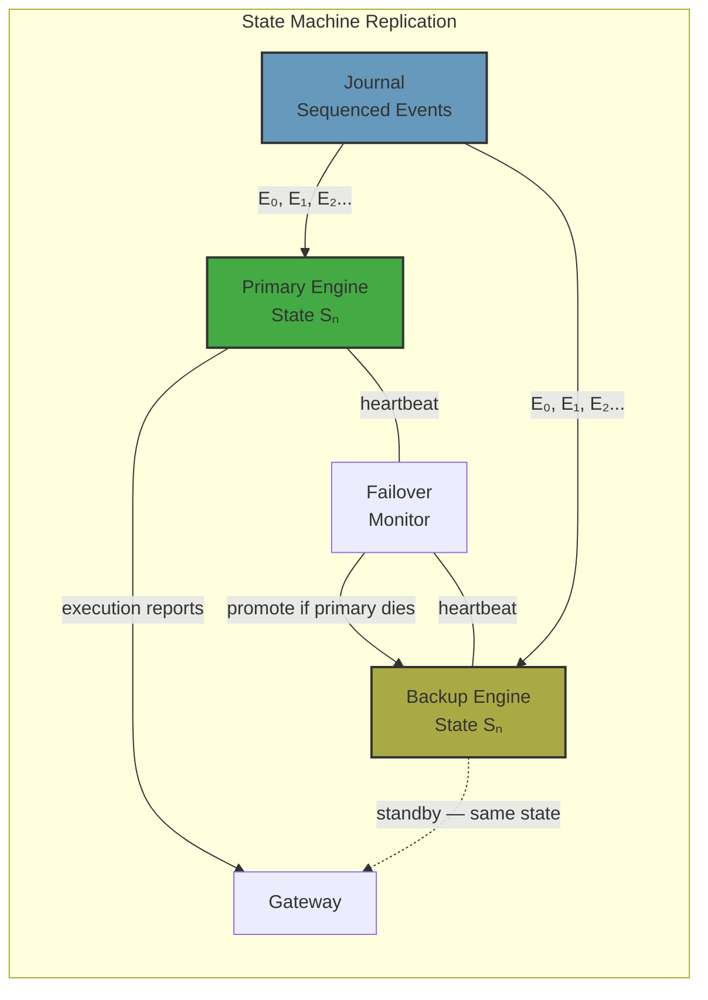
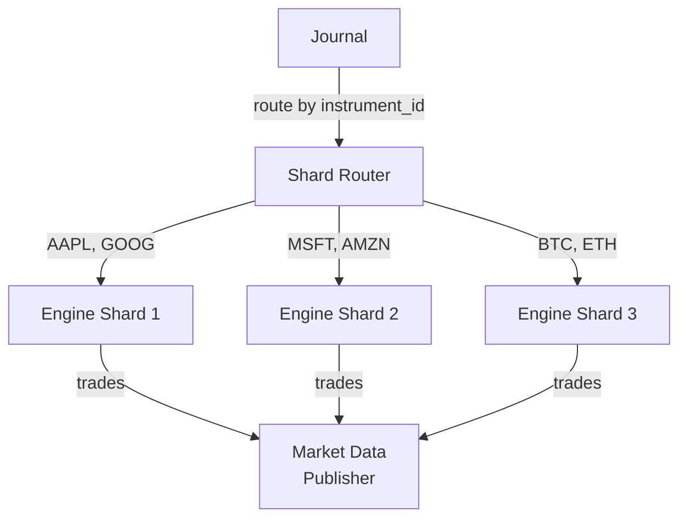
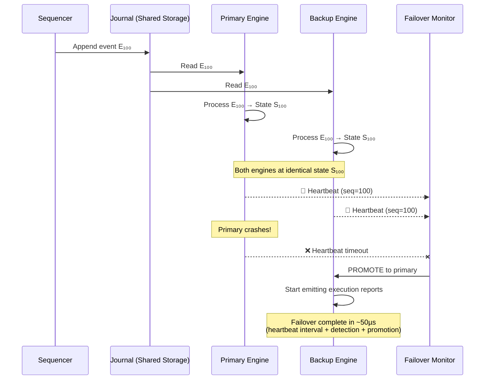
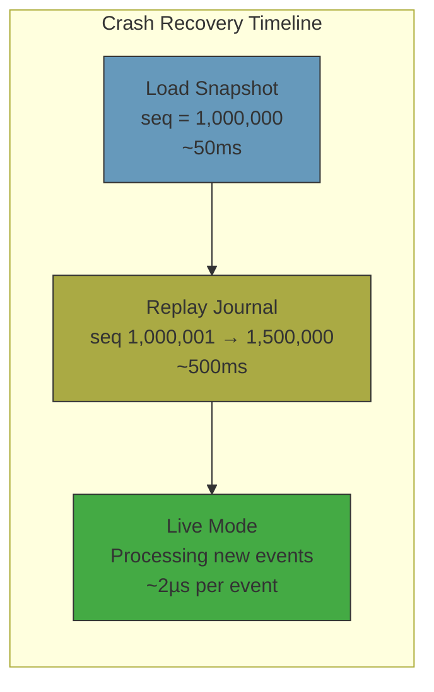

# Chapter 3: Determinism and State Machine Replication 🔴

> **The Problem:** Your matching engine processes 500,000 orders per second. If it crashes, the exchange halts. You need a backup engine that can take over within microseconds — not minutes, not seconds — microseconds. Both engines must agree on every order, every fill, every balance change, down to the last bit. One floating-point rounding difference between primary and backup means split-brain: two engines disagree on who owns what. How do you ensure bit-identical state across replicas?

---

## Why the Matching Engine Must Be a Deterministic State Machine

A **deterministic state machine** is a function:

$$S_{n+1} = f(S_n, E_n)$$

Where:
- $S_n$ is the engine state after processing $n$ events (order book, balances, positions).
- $E_n$ is the $n$-th event from the journal (an order, cancel, or amend).
- $f$ is the matching logic — purely deterministic, no randomness, no I/O, no time-dependent branching.

If two engines start from the same initial state $S_0$ and process the same sequence of events $E_0, E_1, \ldots, E_n$, they **must** arrive at the same state $S_{n+1}$.

This is the foundation of **state machine replication** — the technique that gives us zero-downtime failover.



### What Breaks Determinism?

| Source of Non-Determinism | How It Breaks Replication | Solution |
|---|---|---|
| **Floating-point arithmetic** | Different CPUs/compilers produce different results for the same expression due to 80-bit extended precision, FMA, etc. | Use fixed-point integer arithmetic |
| **HashMap iteration order** | Rust's `HashMap` uses randomized hashing — iteration order differs between processes | Use deterministic hashing (e.g., `FxHashMap`) or never iterate |
| **System time** | `Instant::now()` returns different values on different machines | Timestamps come from the journal, not the engine |
| **Thread scheduling** | Multi-threaded code produces non-deterministic interleaving | Single-threaded engine — no threads, no locks |
| **Uninitialized memory** | Padding bytes in structs contain garbage | Initialize all memory, use `#[repr(C)]` with explicit padding |
| **Heap allocator non-determinism** | `malloc` returns different addresses, affecting hash maps and pointer comparisons | Arena allocation, no heap allocation on hot path |

Let us address each one.

---

## Fixed-Point Arithmetic: Zero Floating-Point Math

### The Floating-Point Trap

Consider a simple calculation: splitting a trade's total cost between two accounts.

```rust
// ❌ DANGER: Floating-point on the matching engine hot path
fn split_cost_float(total: f64) -> (f64, f64) {
    let half = total / 2.0;
    let remainder = total - half;
    (half, remainder)
}

// On x86-64 with SSE2: split_cost_float(0.1 + 0.2)
// Primary engine (compiled with -O2):   (0.15000000000000002, 0.15000000000000002)
// Backup engine  (compiled with -O3):   (0.15000000000000002, 0.14999999999999999)
//                                         ^^^^^^^^^^^^^^^^^^^^^^^^^^^^^^^^^^^^^ DIVERGENCE
```

This is not a theoretical risk. **The Intel x87 FPU uses 80-bit extended precision internally**, while SSE uses 64-bit. If one engine's compiler emits x87 instructions for a particular operation (due to register spilling) and the other uses SSE, the results diverge. On ARM, the intermediate precision rules are different again.

### The Fixed-Point Solution

We represent all monetary values as integers with an implied decimal point:

```rust
/// Fixed-point price with 4 decimal places.
/// $150.0100 is stored as 1_500_100.
/// $0.0001 is the minimum price increment (tick size).
///
/// Range: ±922,337,203,685,477.5807 (i64 with 4 decimals) — sufficient
/// for any real-world financial instrument.
#[derive(Clone, Copy, PartialEq, Eq, PartialOrd, Ord, Hash)]
pub struct Price(pub i64);

impl Price {
    pub const SCALE: i64 = 10_000; // 4 decimal places

    /// Create a price from a human-readable value.
    /// e.g., Price::from_decimal(150, 100) = $150.0100
    pub const fn from_decimal(integer: i64, fraction: i64) -> Self {
        Price(integer * Self::SCALE + fraction)
    }

    /// Multiply price × quantity, with exact integer arithmetic.
    /// Returns the total cost in the smallest currency unit.
    pub const fn cost(self, quantity: u64) -> i64 {
        self.0 * quantity as i64
    }
}

/// Fixed-point quantity with 0 decimal places (whole shares).
/// For fractional shares (crypto), use 8 decimal places.
#[derive(Clone, Copy, PartialEq, Eq, PartialOrd, Ord)]
pub struct Quantity(pub u64);
```

### Comparison: Float vs Fixed-Point

<table>
<tr><th>Floating-Point</th><th>Fixed-Point Integer</th></tr>
<tr>
<td>

```rust
// Compute trade value
let value = price * quantity as f64;
// $150.01 × 100 = 15001.000000000002
//                       ^^^^^^^^^^^^
//                       rounding error!

// Fee calculation
let fee = value * 0.001; // 0.1% fee
// 15.001000000000002
```

</td>
<td>

```rust
// Compute trade value
let value = price.cost(quantity);
// 1_500_100 × 100 = 150_010_000
// Exact. Always.

// Fee: 0.1% = multiply by 1, divide by 1000
let fee = value / 1000;
// 150_010 — exact integer division
// Remainder: value % 1000 = 0
```

</td>
</tr>
<tr>
<td>

**Deterministic?** No. Depends on CPU, compiler flags, instruction selection.

</td>
<td>

**Deterministic?** Yes. Integer arithmetic is bit-identical on all platforms.

</td>
</tr>
</table>

### Handling Division Remainders

When splitting fees or pro-rating partial fills, integer division has a remainder. The engine must have a **deterministic rounding rule**:

```rust
/// Divide `amount` evenly across `n` parties.
/// Remainder is assigned to the first party (deterministic).
fn split_evenly(amount: i64, n: u32) -> Vec<i64> {
    let base = amount / n as i64;
    let remainder = amount % n as i64;

    let mut result = vec![base; n as usize];
    // First `remainder` parties get +1 each
    for i in 0..remainder as usize {
        result[i] += 1;
    }
    result
}

// split_evenly(100, 3) = [34, 33, 33]  (sum = 100 ✓)
// Always the same result, on every machine, every time.
```

---

## Why Single-Threaded?

The matching engine is **deliberately single-threaded**. This is the most counterintuitive architectural decision for engineers coming from web-scale backends, where concurrency is assumed.

### The Multi-Threaded Trap

```
// ❌ Multi-threaded matching engine
Thread 1 (AAPL):  Insert Buy 100 @ $150.10  → locks AAPL book
Thread 2 (AAPL):  Cancel Order #42          → blocks on AAPL lock
Thread 3 (GOOG):  Insert Sell 50 @ $140.00  → locks GOOG book
Thread 4 (AAPL):  Insert Sell 200 @ $150.10 → blocks on AAPL lock
```

Problems:

| Issue | Consequence |
|---|---|
| **Lock contention** | Threads waiting on the same instrument's lock — adds 100ns–1µs per contention event |
| **Priority inversion** | A low-priority thread holding a lock blocks a high-priority order |
| **Non-deterministic ordering** | Two threads releasing a lock in different order across replicas → divergent state |
| **Debugging** | Race conditions and heisenbugs are nearly impossible to reproduce |
| **Profiling** | Contention-related latency spikes are invisible to CPU profilers |

### The Single-Threaded Solution

```
// ✅ Single-threaded matching engine
Main loop:
  1. Read next message from journal
  2. Dispatch to the correct instrument's order book
  3. Execute matching logic (no locks needed — only one thread!)
  4. Emit execution reports and book updates
  5. Repeat
```

**"But doesn't that mean only one CPU core?"** Yes. And that core processes ~500,000 orders/second (at ~2µs per order including matching). A single-threaded engine on a modern 4GHz core is fast enough for every exchange on earth except possibly the very busiest (CME, NASDAQ at peak).

**"What about multiple instruments?"** All instruments are processed on the same thread, in journal order. This preserves **global ordering** — critical for cross-instrument orders, portfolio-level risk, and regulatory audit trails.

### When to Shard

If one thread is genuinely insufficient (>2M orders/sec sustained), you shard by instrument:



Each shard is still **single-threaded** and processes a deterministic subset of the journal. Sharding introduces complexity (cross-shard orders, global sequence coordination), so it is a last resort.

---

## State Machine Replication: Hot Standby Failover

With the journal and a deterministic engine, replication is straightforward:

1. The **primary engine** reads from the journal and processes events.
2. The **backup engine** reads from the *same journal* (or a replicated copy) and processes the same events.
3. Both engines arrive at the same state after processing the same sequence.
4. If the primary fails, the backup is already at the correct state — it simply starts emitting execution reports.

### Replication Architecture



### Journal Replication Strategies

| Strategy | Latency | Durability | Complexity |
|---|---|---|---|
| **Shared storage (SAN/NFS)** | ~0µs (both read same file) | Depends on storage | Low |
| **Network replication (TCP)** | ~10–50µs per message | As good as network | Medium |
| **RDMA replication** | ~1–5µs per message | Excellent | High |
| **Kernel page cache + NFS** | ~0µs (mmap on same NFS mount) | NFS-dependent | Low |

The simplest approach: the journal file lives on a shared SAN (Storage Area Network) or NFS mount. Both primary and backup `mmap` the same file. The primary writes; the backup reads. Zero network overhead.

For lower latency, the sequencer replicates journal entries to the backup machine via **RDMA** (Remote Direct Memory Access) — writing directly into the backup's memory without involving its CPU. The backup engine polls its local memory for new entries.

### Heartbeat and Failure Detection

The primary engine emits a heartbeat every $T$ microseconds (e.g., $T = 100µs$). The failover monitor watches for missed heartbeats:

```rust
/// Failure detection via heartbeat gap.
struct FailoverMonitor {
    last_heartbeat: std::time::Instant,
    timeout: std::time::Duration,
}

impl FailoverMonitor {
    fn check(&mut self) -> FailoverAction {
        if self.last_heartbeat.elapsed() > self.timeout {
            FailoverAction::PromoteBackup
        } else {
            FailoverAction::None
        }
    }
}
```

**Failover budget:**

| Phase | Latency |
|---|---|
| Heartbeat interval (worst case) | 100 µs |
| Detection (monitor poll interval) | 10 µs |
| Promotion (atomic flag flip) | ~1 µs |
| **Total (worst case)** | **~111 µs** |

Compare this to a database-backed system where failover involves starting a new process, connecting to the database, loading state, and resuming processing — **minutes**, not microseconds.

---

## Verifying Determinism: The Checksum Audit

How do you *prove* that the primary and backup engines are in the same state? You compute a rolling **state checksum**:

```rust
use std::hash::{Hash, Hasher};
use std::collections::hash_map::DefaultHasher;

/// A rolling checksum of the engine's state.
/// Computed after every N messages (e.g., every 10,000).
pub struct StateChecksum {
    hasher: u64,
}

impl StateChecksum {
    pub fn new() -> Self {
        Self { hasher: 0 }
    }

    /// Feed an execution result into the checksum.
    pub fn update(&mut self, seq_no: u64, fills: &[Fill], book_best_bid: i64,
                   book_best_ask: i64) {
        // XOR-based rolling hash for deterministic combining
        let mut h = DefaultHasher::new();
        seq_no.hash(&mut h);
        for fill in fills {
            fill.maker_order_id.hash(&mut h);
            fill.taker_order_id.hash(&mut h);
            fill.price.hash(&mut h);
            fill.quantity.hash(&mut h);
        }
        book_best_bid.hash(&mut h);
        book_best_ask.hash(&mut h);
        self.hasher ^= h.finish();
    }

    pub fn digest(&self) -> u64 {
        self.hasher
    }
}
```

Both engines compute the checksum after every N events and compare. If the checksums diverge, you have a **determinism bug** — stop the backup, investigate, and fix before it can be promoted.

### Common Determinism Bugs

| Bug | Symptom | Root Cause |
|---|---|---|
| Checksum diverges after 1,000 events | Float rounding in fee calc | `f64` used for fee computation — replace with integer |
| Diverges only on Tuesdays | HashMap iteration in weekly report | Report iterates HashMap — use BTreeMap for deterministic order |
| Diverges under high load | Thread pool completes tasks in different order | Background task writes to shared state — make engine pure |
| Diverges on different hardware | Different SIMD instruction selection | Compiler emitting FMA on one machine, not the other — use `#[cfg(target_feature)]` to force consistency |

---

## The Engine Main Loop

Putting it all together, here is the matching engine's main loop — single-threaded, deterministic, and minimal:

```rust
/// The matching engine's main loop.
/// Runs on a single CPU core, pinned via `taskset` or `sched_setaffinity`.
fn engine_main(
    journal_reader: &JournalReader,
    books: &mut HashMap<u32, OrderBook>,
    state_checksum: &mut StateChecksum,
    output: &mut OutputBuffer,
) {
    let mut seq_no = 0u64;

    loop {
        // Read the next event from the journal (blocking spin-wait)
        let event = journal_reader.next_event(seq_no + 1);

        seq_no = event.seq_no;

        // Dispatch based on message type
        match event.msg_type {
            MsgType::NewOrder => {
                let payload: NewOrderPayload =
                    unsafe { std::ptr::read_unaligned(event.payload.as_ptr() as *const _) };

                let book = books
                    .entry(payload.instrument_id)
                    .or_insert_with(|| OrderBook::new(payload.instrument_id));

                let fills = book.insert_limit_order(
                    event.seq_no,
                    payload.client_order_id,
                    payload.account_id,
                    if payload.side == 1 { Side::Buy } else { Side::Sell },
                    payload.price,
                    payload.quantity,
                );

                // Emit execution reports
                for fill in &fills {
                    output.emit_fill(fill);
                }

                if fills.is_empty() {
                    output.emit_ack(event.seq_no, payload.client_order_id);
                }

                // Update rolling checksum
                state_checksum.update(
                    seq_no,
                    &fills,
                    book.best_bid.unwrap_or(0),
                    book.best_ask.unwrap_or(0),
                );
            }

            MsgType::Cancel => {
                let payload: CancelPayload =
                    unsafe { std::ptr::read_unaligned(event.payload.as_ptr() as *const _) };

                if let Some(book) = books.get_mut(&payload.instrument_id) {
                    if let Some(cancelled) = book.cancel_order(payload.order_id) {
                        output.emit_cancel_ack(&cancelled);
                    } else {
                        output.emit_cancel_reject(payload.order_id, "unknown order");
                    }
                }
            }

            _ => {
                // Unknown message type — log and skip
                output.emit_error(seq_no, "unknown message type");
            }
        }
    }
}
```

### What the Engine Does NOT Do

| Non-Responsibility | Why |
|---|---|
| **Parse TCP** | The TCP gateway handles protocol parsing |
| **Assign sequence numbers** | The sequencer handles this |
| **Read wall-clock time** | Timestamps come from the journal |
| **Write to disk** | The journal is the only persistent store |
| **Communicate over the network** | Output goes to a ring buffer; the gateway sends it |
| **Lock anything** | Single-threaded — no locks required |
| **Allocate memory** | Arenas pre-allocated at startup |

The engine is a **pure function** from events to state transitions. This purity is what makes it deterministic, testable, and replayable.

---

## Crash Recovery: Replay in Practice

When the engine starts (or restarts after a crash), it:

1. **Loads the latest snapshot** (if available) — the full book state at sequence number $N$.
2. **Opens the journal** and seeks to sequence number $N + 1$.
3. **Replays** events $N+1, N+2, \ldots$ through the matching logic (the same code as the live hot path).
4. Once caught up to the journal's tail, transitions to **live mode** and starts emitting execution reports.



**Replay speed:** Since replay skips all I/O (no network reads, no output emission during replay), the engine replays at ~5M events/second. A 500,000-event journal gap recovers in ~100ms.

### Snapshot Strategy

| Approach | Recovery Time | Snapshot Overhead |
|---|---|---|
| **No snapshots** | Replay from seq 0 (~minutes for a full trading day) | None |
| **Periodic snapshots (every 1M events)** | Replay at most 1M events (~200ms) | ~10ms pause every ~2 seconds |
| **Incremental snapshots** | Replay at most 100K events (~20ms) | More complex serialization |

Most production engines use **periodic full snapshots** — serializing the entire book state to a file every 1–10 million events. The engine pauses for ~10ms during snapshot, which is acceptable between trading sessions or during quiet periods.

---

## Exercises

### Exercise 1: Floating-Point Divergence Detector

Write a test that demonstrates floating-point non-determinism. Compute the same arithmetic expression using `f64` and compare the results when compiled with different optimization levels.

<details>
<summary>Solution</summary>

```rust
#[test]
fn float_determinism_test() {
    // This expression is particularly sensitive to intermediate precision
    let a: f64 = 0.1 + 0.2;
    let b: f64 = 0.3;

    // This assertion may or may not fail depending on compiler flags!
    // On x86-64 with SSE2: a != b (a = 0.30000000000000004)
    assert_ne!(a, b, "floats are not exact");

    // Fixed-point equivalent — ALWAYS exact:
    let a_fixed: i64 = 1000 + 2000; // 0.1000 + 0.2000, scale = 10_000
    let b_fixed: i64 = 3000;        // 0.3000
    assert_eq!(a_fixed, b_fixed, "integers are always exact");
}
```

To demonstrate cross-compilation divergence, compile the same binary with:
```bash
RUSTFLAGS="-C target-feature=-sse2" cargo test    # forces x87 FPU
RUSTFLAGS="-C target-feature=+fma"  cargo test    # enables fused multiply-add
```

The x87 version may produce different results due to 80-bit intermediate precision.

</details>

### Exercise 2: Deterministic Replay Test

Write an integration test that:

1. Creates an engine and processes a sequence of 1,000 orders (inserts, cancels, matches).
2. Serializes the final state (book checksums, balances).
3. Creates a *second* engine and replays the *same* 1,000 events.
4. Asserts that the two engines' final states are bit-identical.

<details>
<summary>Solution</summary>

```rust
#[test]
fn deterministic_replay() {
    let events = generate_test_events(1000); // deterministic seed

    // Run 1
    let mut engine1 = MatchingEngine::new();
    let mut checksum1 = StateChecksum::new();
    for event in &events {
        engine1.process(event, &mut checksum1);
    }

    // Run 2 — same events, fresh engine
    let mut engine2 = MatchingEngine::new();
    let mut checksum2 = StateChecksum::new();
    for event in &events {
        engine2.process(event, &mut checksum2);
    }

    // Must be identical
    assert_eq!(
        checksum1.digest(),
        checksum2.digest(),
        "Replay produced different state! Determinism violation."
    );
}
```

</details>

---

> **Key Takeaways**
>
> 1. The matching engine is a **deterministic state machine**: $S_{n+1} = f(S_n, E_n)$. Same inputs → same outputs, always.
> 2. **Zero floating-point math.** All monetary values use fixed-point integers (e.g., `i64` with 4 decimal places). Floating-point is the #1 source of determinism bugs in financial systems.
> 3. **Single-threaded by design.** No locks, no races, no non-deterministic interleavings. One core is sufficient for 500K orders/second.
> 4. **State machine replication** gives microsecond failover: the backup engine processes the same journal and maintains the same state. Promotion = flipping a flag.
> 5. **Rolling checksums** verify that primary and backup agree. Divergence = a bug that must be found and fixed before the backup can be trusted.
> 6. **Crash recovery = replay.** Load the latest snapshot, replay the journal tail, and the engine is back to the exact state it was in before the crash.
