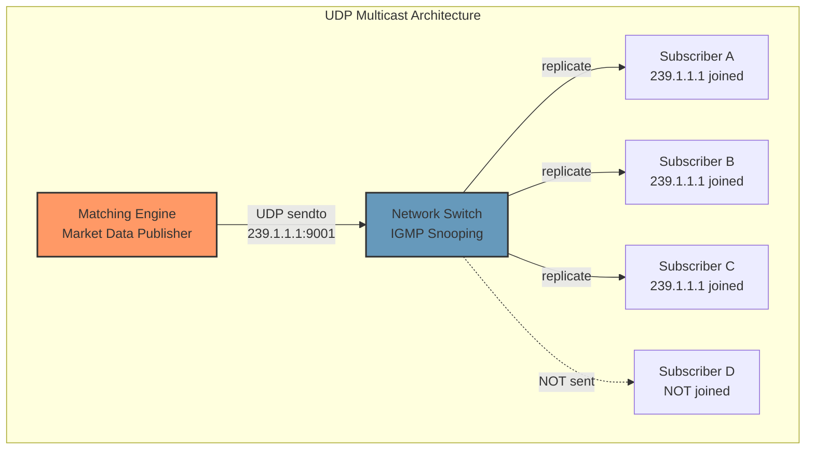
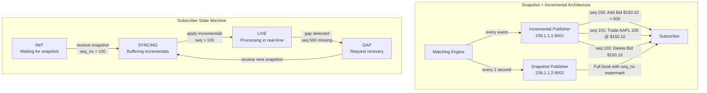
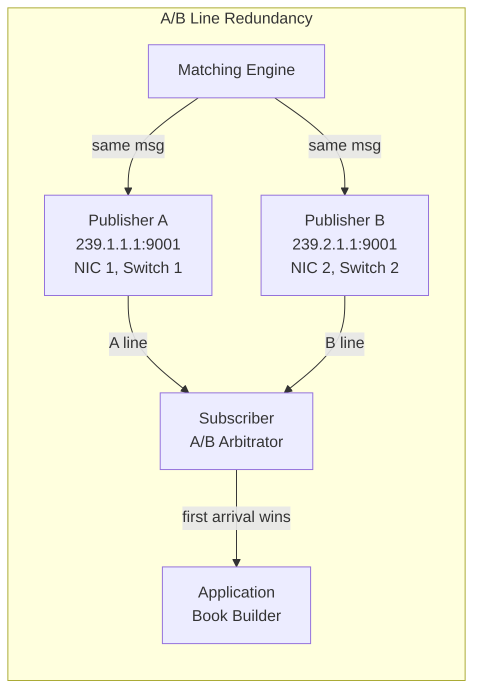
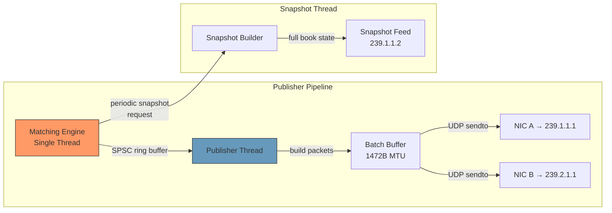

# Chapter 4: UDP Multicast Market Data 🔴

> **The Problem:** Your matching engine produces a stream of events — new orders, cancellations, trades, book updates — at rates of up to 1 million messages per second. This data must be broadcast to 10,000+ subscribers (market makers, hedge funds, retail brokers, surveillance systems) simultaneously. You cannot use TCP: establishing and maintaining 10,000 TCP connections, each with its own send buffer, flow control, and retransmission, would consume more CPU than the matching engine itself. You need a protocol where **one send reaches all subscribers** with zero per-client overhead. How do you architect it?

---

## Why TCP Is Too Slow for Market Data

### TCP: One Connection Per Client

```
Matching Engine → TCP connection → Client A
Matching Engine → TCP connection → Client B
Matching Engine → TCP connection → Client C
...
Matching Engine → TCP connection → Client 10,000
```

| Problem | Impact |
|---|---|
| **10,000 send buffers** | Each TCP socket has a ~128KB send buffer → 1.28 GB of kernel memory |
| **10,000 `write()` syscalls per message** | 1M messages/sec × 10,000 clients = 10B syscalls/sec — impossible |
| **Slow receivers block fast receivers** | One client with a full TCP window stalls the send queue for everyone |
| **Retransmission storms** | A dropped packet triggers retransmit for one client, delaying all others |
| **CPU overhead** | TCP checksumming, window management, ACK processing — per connection, per packet |

Even with `epoll` and non-blocking I/O, you cannot `write()` the same market data message to 10,000 sockets without spending all your CPU budget on syscalls.

### UDP Multicast: One Send, All Receive

```
Matching Engine → UDP sendto(multicast_group) → Network Switch → All Subscribers
```

With **UDP multicast**, the engine sends each message **once**. The network switch replicates the packet to all subscribers that have joined the multicast group (via IGMP). The engine is completely unaware of how many subscribers exist.

| Property | TCP (unicast) | UDP Multicast |
|---|---|---|
| **Sends per message** | $N$ (one per client) | $1$ |
| **Kernel memory** | $O(N)$ send buffers | $O(1)$ — single socket |
| **CPU per message** | $O(N)$ | $O(1)$ |
| **Slow receiver impact** | Blocks sender (TCP flow control) | None — subscriber's problem |
| **Reliability** | Guaranteed (TCP retransmit) | **None** — packets can be lost |
| **Ordering** | Guaranteed (TCP sequence numbers) | **None** — packets can arrive out of order |

The fundamental trade-off: **UDP multicast trades reliability for scalability.** We get $O(1)$ send cost, but we must handle packet loss at the application layer.

---

## UDP Multicast Architecture

### IGMP and Multicast Groups

**Internet Group Management Protocol (IGMP)** allows hosts to join multicast groups. A multicast group is identified by a Class-D IP address (224.0.0.0–239.255.255.255).



The switch uses **IGMP snooping** to learn which ports have subscribers and only forwards multicast traffic to those ports — avoiding flooding the entire network.

### Setting Up the Publisher

```rust
use std::net::{UdpSocket, Ipv4Addr};

/// Create a UDP multicast publisher socket.
fn create_multicast_publisher(
    multicast_addr: Ipv4Addr,
    port: u16,
    interface: Ipv4Addr,
) -> std::io::Result<UdpSocket> {
    let socket = UdpSocket::bind(("0.0.0.0", 0))?;

    // Set the outgoing multicast interface
    socket.set_multicast_if_v4(&interface)?;

    // Set TTL (1 = same subnet only — typical for exchange co-location)
    socket.set_multicast_ttl_v4(1)?;

    // Disable loopback (we don't want to receive our own packets)
    socket.set_multicast_loop_v4(false)?;

    Ok(socket)
}

/// Send a market data message to all subscribers.
fn publish_message(
    socket: &UdpSocket,
    multicast_addr: Ipv4Addr,
    port: u16,
    message: &[u8],
) -> std::io::Result<()> {
    socket.send_to(message, (multicast_addr, port))?;
    Ok(())
}
```

### Setting Up the Subscriber

```rust
/// Create a UDP multicast subscriber socket.
fn create_multicast_subscriber(
    multicast_addr: Ipv4Addr,
    port: u16,
    interface: Ipv4Addr,
) -> std::io::Result<UdpSocket> {
    let socket = UdpSocket::bind(("0.0.0.0", port))?;

    // Join the multicast group on the specified interface
    socket.join_multicast_v4(&multicast_addr, &interface)?;

    // Increase receive buffer to handle bursts
    // (default is often 128KB — too small for 1M msgs/sec)
    set_recv_buffer(&socket, 16 * 1024 * 1024)?; // 16 MB

    Ok(socket)
}

fn set_recv_buffer(socket: &UdpSocket, size: usize) -> std::io::Result<()> {
    use std::os::unix::io::AsRawFd;
    let size = size as libc::c_int;
    unsafe {
        let ret = libc::setsockopt(
            socket.as_raw_fd(),
            libc::SOL_SOCKET,
            libc::SO_RCVBUF,
            &size as *const _ as *const libc::c_void,
            std::mem::size_of::<libc::c_int>() as libc::socklen_t,
        );
        if ret != 0 {
            return Err(std::io::Error::last_os_error());
        }
    }
    Ok(())
}
```

---

## The Market Data Protocol

Since UDP provides no reliability guarantees, the market data protocol must handle:

1. **Packet loss detection** — via sequence numbers.
2. **State recovery after gaps** — via periodic snapshots.
3. **Ordering** — via sequence numbers (packets may arrive out of order).

### Message Format

```rust
/// Market data packet header.
/// Every UDP packet starts with this header.
#[repr(C)]
#[derive(Clone, Copy)]
pub struct MdPacketHeader {
    /// Monotonically increasing sequence number for this multicast stream.
    pub seq_no: u64,
    /// Number of messages in this packet (batching).
    pub msg_count: u16,
    /// Packet type: 0 = Incremental, 1 = Snapshot.
    pub packet_type: u8,
    /// Reserved.
    pub _reserved: [u8; 5],
}

/// An incremental update to the order book.
#[repr(C)]
#[derive(Clone, Copy)]
pub struct BookUpdate {
    /// Instrument ID.
    pub instrument_id: u32,
    /// Update type: 0 = Add, 1 = Modify, 2 = Delete.
    pub update_type: u8,
    /// Side: 1 = Bid, 2 = Ask.
    pub side: u8,
    pub _pad: [u8; 2],
    /// Price level (fixed-point).
    pub price: i64,
    /// New total quantity at this price level (after the update).
    pub quantity: u64,
    /// Number of orders at this level.
    pub order_count: u32,
    pub _pad2: [u8; 4],
}

/// A trade execution report.
#[repr(C)]
#[derive(Clone, Copy)]
pub struct TradeReport {
    pub instrument_id: u32,
    pub _pad: [u8; 4],
    pub price: i64,
    pub quantity: u64,
    pub aggressor_side: u8,
    pub _pad2: [u8; 7],
}
```

### Snapshot + Incremental Model

The market data publisher sends two types of messages:

1. **Incremental updates** — real-time changes to the book (order add, modify, delete, trade). Sent on the **incremental feed** (e.g., `239.1.1.1:9001`).
2. **Snapshots** — a complete picture of the book at a point in time. Sent periodically (e.g., every 1 second) on the **snapshot feed** (e.g., `239.1.1.2:9002`).



### The Subscriber State Machine

A subscriber goes through a well-defined state machine to synchronize with the market data stream:

```rust
enum SubscriberState {
    /// Waiting for the first snapshot.
    Init,
    /// Received a snapshot; buffering incremental updates with seq > snapshot_seq.
    Syncing {
        snapshot_seq: u64,
        buffer: Vec<IncrementalMessage>,
    },
    /// Fully synchronized; processing incrementals in real-time.
    Live {
        expected_seq: u64,
    },
    /// Gap detected; waiting for next snapshot to re-sync.
    GapRecovery {
        last_good_seq: u64,
    },
}

impl SubscriberState {
    fn on_incremental(&mut self, msg: IncrementalMessage, books: &mut Books) {
        match self {
            Self::Init => {
                // Discard — we don't have a baseline yet.
            }

            Self::Syncing { snapshot_seq, buffer } => {
                if msg.seq_no > *snapshot_seq {
                    buffer.push(msg);
                }
                // Don't apply yet — wait for all buffered messages
                // to be applied in order after snapshot is loaded.
            }

            Self::Live { expected_seq } => {
                if msg.seq_no == *expected_seq {
                    apply_incremental(books, &msg);
                    *expected_seq += 1;
                } else if msg.seq_no > *expected_seq {
                    // GAP DETECTED — we missed one or more messages
                    *self = Self::GapRecovery {
                        last_good_seq: *expected_seq - 1,
                    };
                }
                // seq < expected: duplicate — ignore.
            }

            Self::GapRecovery { .. } => {
                // Discard incrementals until we re-sync from a snapshot.
            }
        }
    }

    fn on_snapshot(&mut self, snapshot: Snapshot, books: &mut Books) {
        match self {
            Self::Init | Self::GapRecovery { .. } => {
                // Load the snapshot into the book state
                load_snapshot(books, &snapshot);

                // Transition to Syncing — incrementals after this seq_no
                // will be applied.
                *self = Self::Syncing {
                    snapshot_seq: snapshot.seq_no,
                    buffer: Vec::new(),
                };
            }

            Self::Syncing { snapshot_seq, buffer } => {
                // Apply buffered incrementals that are after the snapshot
                buffer.sort_by_key(|m| m.seq_no);
                let start_seq = *snapshot_seq + 1;
                let mut next_expected = start_seq;

                for msg in buffer.drain(..) {
                    if msg.seq_no == next_expected {
                        apply_incremental(books, &msg);
                        next_expected += 1;
                    }
                }

                *self = Self::Live {
                    expected_seq: next_expected,
                };
            }

            Self::Live { .. } => {
                // Already live — ignore snapshot (or use to verify state).
            }
        }
    }
}
```

---

## A/B Line Redundancy

Real exchanges send every multicast packet on **two independent network paths** (A line and B line). Subscribers read from both and use the one that arrives first, ignoring the duplicate.



### A/B Arbitration Logic

```rust
/// A/B line arbitrator: deduplicates and selects the first-arriving copy.
struct AbArbitrator {
    /// The next expected sequence number.
    next_seq: u64,
    /// Bitset tracking which sequence numbers we've already seen
    /// (sliding window of last 1024 messages).
    seen: [u64; 16], // 1024-bit bitset
}

impl AbArbitrator {
    /// Process a message from either the A or B line.
    /// Returns Some(msg) if this is the first copy, None if duplicate.
    fn arbitrate(&mut self, msg: &MdPacketHeader) -> Option<&MdPacketHeader> {
        if msg.seq_no < self.next_seq {
            return None; // Old message — already processed
        }

        let offset = (msg.seq_no - self.next_seq) as usize;
        if offset >= 1024 {
            return Some(msg); // Very far ahead — accept and re-sync
        }

        let word = offset / 64;
        let bit = offset % 64;

        if self.seen[word] & (1 << bit) != 0 {
            return None; // Duplicate — already seen from the other line
        }

        self.seen[word] |= 1 << bit;

        // Advance window if this is the next expected
        if msg.seq_no == self.next_seq {
            while self.seen[0] & 1 != 0 {
                self.next_seq += 1;
                // Shift the bitset window forward by 1
                self.shift_window();
            }
        }

        Some(msg)
    }

    fn shift_window(&mut self) {
        // Shift the 1024-bit bitset by 1 position
        for i in 0..15 {
            self.seen[i] = (self.seen[i] >> 1) | (self.seen[i + 1] << 63);
        }
        self.seen[15] >>= 1;
    }
}
```

---

## Batching and Packet Efficiency

The publisher batches multiple book updates into a single UDP packet to reduce syscall overhead and improve network efficiency.

### Why Batch?

| Approach | Syscalls/sec (at 1M updates/sec) | Network overhead |
|---|---|---|
| One update per packet | 1,000,000 `sendto()` | 42 bytes UDP/IP header per update |
| 10 updates per packet | 100,000 `sendto()` | 4.2 bytes amortized header per update |
| 100 updates per packet | 10,000 `sendto()` | 0.42 bytes amortized header per update |

```rust
/// A batching market data publisher.
pub struct MdPublisher {
    socket: UdpSocket,
    multicast_addr: std::net::SocketAddr,
    /// Pre-allocated send buffer (MTU-sized: 1472 bytes for standard Ethernet).
    buffer: [u8; 1472],
    /// Current write position in the buffer.
    offset: usize,
    /// Number of messages in the current batch.
    msg_count: u16,
    /// Current sequence number.
    next_seq: u64,
}

impl MdPublisher {
    /// Add a book update to the current batch.
    pub fn add_update(&mut self, update: &BookUpdate) {
        let update_bytes = bytemuck::bytes_of(update);
        let space_for_header = std::mem::size_of::<MdPacketHeader>();

        if self.offset + update_bytes.len() > self.buffer.len() {
            // Buffer full — flush the current batch first.
            self.flush();
        }

        self.buffer[self.offset..self.offset + update_bytes.len()]
            .copy_from_slice(update_bytes);
        self.offset += update_bytes.len();
        self.msg_count += 1;
    }

    /// Send the current batch.
    pub fn flush(&mut self) {
        if self.msg_count == 0 {
            return;
        }

        // Write the packet header at the front
        let header = MdPacketHeader {
            seq_no: self.next_seq,
            msg_count: self.msg_count,
            packet_type: 0, // Incremental
            _reserved: [0; 5],
        };

        let header_bytes = bytemuck::bytes_of(&header);
        let header_len = header_bytes.len();

        // Shift payload to make room for header (or reserve space upfront)
        // In production, we'd reserve header space at the start of the buffer.
        // Simplified here for clarity.

        let total_len = self.offset;
        let _ = self.socket.send_to(&self.buffer[..total_len], self.multicast_addr);

        self.next_seq += self.msg_count as u64;
        self.offset = header_len; // Reset after header space
        self.msg_count = 0;
    }
}
```

---

## Gap Detection and Recovery

UDP packets can be lost, duplicated, or reordered. The subscriber must detect and recover from gaps.

### Gap Detection

The subscriber tracks the next expected sequence number. If a message arrives with a higher sequence number, a gap is detected:

```
Expected: seq 500
Received: seq 502
→ GAP: missed seq 500, 501
```

### Recovery Options

| Method | Latency | Complexity | Used By |
|---|---|---|---|
| **Wait for snapshot** | Up to 1 second (snapshot interval) | Low | Most subscribers |
| **Request retransmit (TCP)** | 10–100 µs | Medium | Premium clients |
| **Gap-fill from B line** | ~0 µs (if B has it) | Low | All subscribers with A/B |

The typical recovery path:

1. **Check the B line** — if the missing message was lost on the A line but received on the B line, no recovery needed.
2. **Buffer subsequent messages** — don't discard messages after the gap; buffer them for later application.
3. **Wait for the next snapshot** — the snapshot provides a complete baseline from which to resume processing incrementals.
4. **Optional: TCP retransmit request** — for latency-sensitive subscribers, a TCP sideband allows requesting specific sequence ranges.

---

## The Publisher: From Engine to Wire

The market data publisher sits between the matching engine and the multicast network. It transforms engine-internal events into the market data protocol.



### The Publisher's Responsibilities

1. **Transform** engine events (fills, inserts, cancels) into market data messages (book updates, trades).
2. **Assign sequence numbers** to the market data stream (separate from the journal sequence).
3. **Batch** messages into MTU-sized UDP packets.
4. **Send** each packet on both the A and B lines.
5. **Periodically publish snapshots** of the full book state.

### Snapshot Generation

```rust
/// Generate a snapshot of the order book for a single instrument.
fn generate_snapshot(book: &OrderBook) -> Vec<BookUpdate> {
    let mut updates = Vec::new();

    // Emit all bid levels
    for (&std::cmp::Reverse(price), &level_idx) in &book.bids {
        let level = book.levels.get(level_idx);
        updates.push(BookUpdate {
            instrument_id: book.instrument_id,
            update_type: 0, // Add
            side: 1,        // Bid
            _pad: [0; 2],
            price,
            quantity: level.total_quantity,
            order_count: level.order_count,
            _pad2: [0; 4],
        });
    }

    // Emit all ask levels
    for (&price, &level_idx) in &book.asks {
        let level = book.levels.get(level_idx);
        updates.push(BookUpdate {
            instrument_id: book.instrument_id,
            update_type: 0, // Add
            side: 2,        // Ask
            _pad: [0; 2],
            price,
            quantity: level.total_quantity,
            order_count: level.order_count,
            _pad2: [0; 4],
        });
    }

    updates
}
```

---

## Exercises

### Exercise 1: Gap Detector

Implement a `GapDetector` struct that tracks a stream of sequence numbers and reports gaps:

```rust
let mut detector = GapDetector::new(1); // expect seq 1 first
assert_eq!(detector.feed(1), GapResult::Ok);
assert_eq!(detector.feed(2), GapResult::Ok);
assert_eq!(detector.feed(5), GapResult::Gap { from: 3, to: 4 });
assert_eq!(detector.feed(3), GapResult::Duplicate); // late arrival
```

<details>
<summary>Solution</summary>

```rust
#[derive(Debug, PartialEq)]
enum GapResult {
    Ok,
    Gap { from: u64, to: u64 },
    Duplicate,
}

struct GapDetector {
    next_expected: u64,
}

impl GapDetector {
    fn new(start: u64) -> Self {
        Self { next_expected: start }
    }

    fn feed(&mut self, seq: u64) -> GapResult {
        if seq == self.next_expected {
            self.next_expected += 1;
            GapResult::Ok
        } else if seq > self.next_expected {
            let gap = GapResult::Gap {
                from: self.next_expected,
                to: seq - 1,
            };
            self.next_expected = seq + 1;
            gap
        } else {
            GapResult::Duplicate
        }
    }
}
```

</details>

### Exercise 2: Multicast Throughput Calculator

You are sending market data updates of 64 bytes each, with a 16-byte packet header, over standard Ethernet (MTU = 1500 bytes, minus 28 bytes for IP + UDP headers = 1472 usable bytes).

1. How many updates fit in one UDP packet?
2. At 1 million updates/second, how many packets/second?
3. What is the bandwidth in Mbps?

<details>
<summary>Solution</summary>

1. Usable payload per packet: $1472 - 16 = 1456$ bytes for updates.
   Updates per packet: $\lfloor 1456 / 64 \rfloor = 22$ updates.

2. Packets per second: $\lceil 1{,}000{,}000 / 22 \rceil = 45{,}455$ packets/sec.

3. Bytes per second: $45{,}455 \times 1500 = 68{,}182{,}500$ bytes/sec = **545 Mbps**.
   On a 10Gbps NIC, this is ~5.5% utilization — easily sustainable.

</details>

---

> **Key Takeaways**
>
> 1. **UDP Multicast** enables $O(1)$ publish cost regardless of subscriber count. The engine sends once; the network switch replicates.
> 2. **TCP is unusable for market data fans** — 10,000 connections × 1M messages/sec = 10 billion syscalls/sec and unbounded memory for send buffers.
> 3. The protocol uses **snapshot + incremental** updates. Snapshots provide a baseline; incrementals provide real-time deltas. Subscribers sync by loading a snapshot and then applying incrementals with sequence numbers greater than the snapshot watermark.
> 4. **A/B line redundancy** provides fault tolerance: every packet is sent on two independent network paths. Subscribers arbitrate using sequence numbers and a sliding-window deduplication bitset.
> 5. **Gap detection** is sequence-number-based. When a gap is detected, the subscriber falls back to the next snapshot for recovery. No TCP-style retransmission is needed for the common case.
> 6. **Batching** amortizes UDP/IP header overhead and syscall cost. At 22 updates per packet, the publisher sends ~45K packets/sec for 1M updates/sec — well within NIC capacity.
