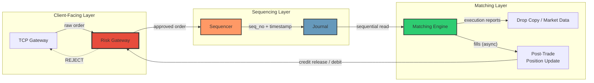
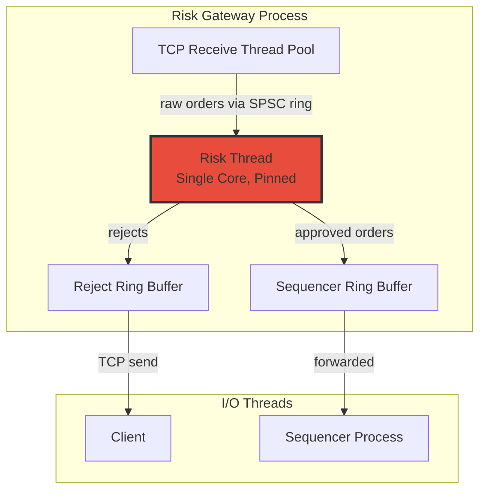
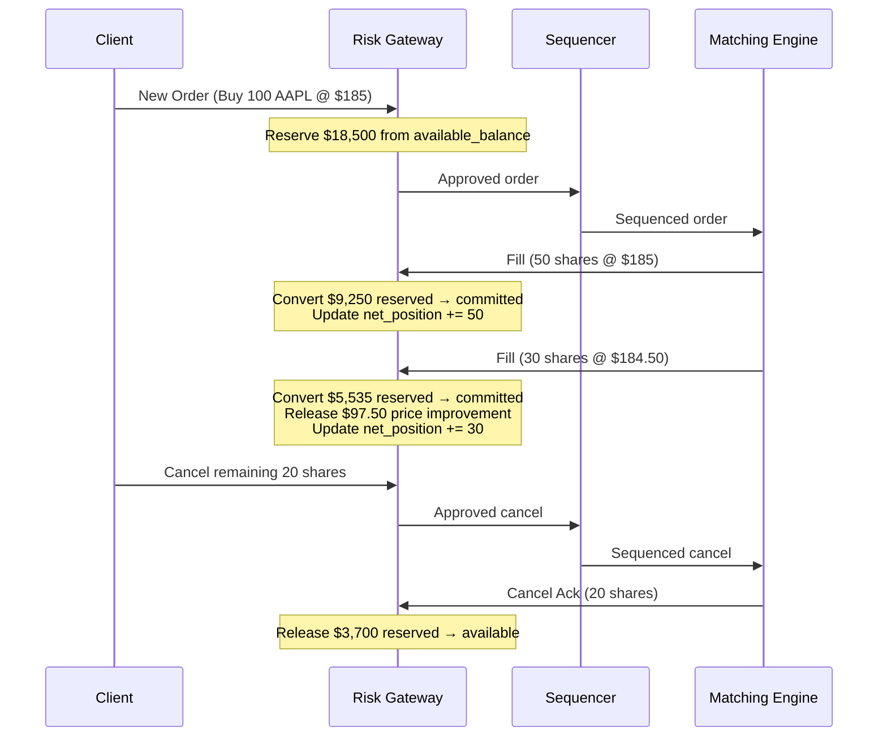
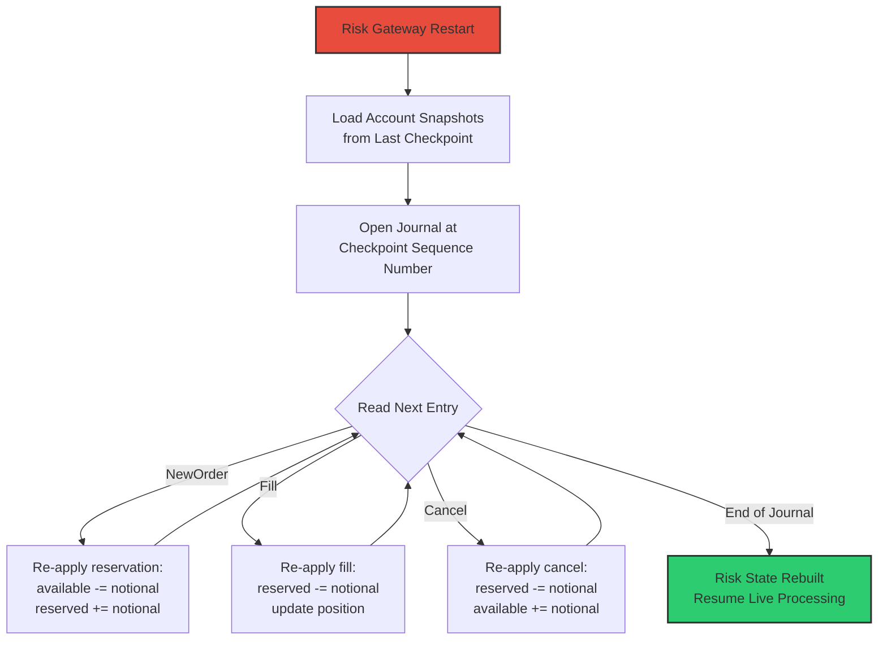

# Chapter 5: The Risk Gateway 🟡

> **The Problem:** A participant with $100 in their account submits a buy order for 10,000 shares of AAPL at $185. If the matching engine fills that order, you have just extended $1.85 million of unsecured credit — in microseconds, with no human in the loop. Multiply by thousands of participants and millisecond-frequency trading, and a single rogue algorithm can bankrupt a clearing house before anyone notices. You must build an ultra-fast, in-memory risk check gateway that sits *before* the Sequencer (Chapter 1), validates margin limits, enforces position and notional caps, and holds locks on user balances — all in under **2 microseconds**, without ever touching a database. How do you build it?

---

## Why Risk Cannot Live Inside the Matching Engine

The instinctive design is to embed risk checks in the matching engine itself — after all, that's where fills happen:

```
Client → TCP Gateway → Sequencer → Journal → Matching Engine (risk check + match) → Execution Report
```

This is wrong for three reasons:

| Concern | Why it fails inside the engine |
|---|---|
| **Ordering violation** | By the time the engine evaluates risk, the order is *already in the journal*. Backup engines will replay it. Rejecting it mid-stream creates divergent state between primary and backup. |
| **Single Responsibility** | The matching engine is a **deterministic state machine** (Chapter 3). Its only job is: given a sequenced order, produce fills. Adding conditional rejection makes it non-deterministic with respect to external account state. |
| **Blast radius** | If risk logic has a bug, it corrupts the matching engine. A separate gateway isolates risk failures from the critical matching path. |

### The Correct Architecture: Pre-Sequencer Risk Gateway



The **Risk Gateway** is a separate process (or a logically isolated module within the gateway process). It sits on the hot path *between* the TCP gateway and the Sequencer. Every order must pass through it. Rejected orders never reach the journal — they simply never existed from the matching engine's perspective.

> **Key Insight:** The journal must contain only *risk-approved* orders. This preserves the matching engine's determinism: if an order is in the journal, it must be processed. No conditional rejection. No "maybe" states.

---

## What the Risk Gateway Must Validate

The gateway performs a tiered set of checks, ordered from cheapest to most expensive:

| Tier | Check | Typical Cost | Description |
|---|---|---|---|
| 0 | **Message sanity** | ~50 ns | Is the message well-formed? Price > 0? Quantity > 0? Valid instrument symbol? |
| 1 | **Permissions** | ~100 ns | Is this user authorized to trade this instrument? Is the account active? |
| 2 | **Order-rate throttle** | ~100 ns | Has this user exceeded N orders/second? (Token bucket counter.) |
| 3 | **Fat-finger check** | ~150 ns | Is the price within X% of the reference price? Is the notional value sane? |
| 4 | **Pre-trade risk** | ~500 ns | Does the user have sufficient margin/buying power? Will this order breach position limits? |
| 5 | **Balance reservation** | ~300 ns | Atomically decrement available balance and reserve the funds for this order. |
| **Total** | | **~1.2 µs** | Well under the 2µs budget |

Tiers 0–3 are stateless or require only a single lookup. Tier 4–5 are the hard part: they require reading and **mutating** shared per-user state at extreme speed.

---

## The In-Memory Risk State

### The Naive Approach: Database-Backed Risk

```rust
// ❌ Database-backed risk check — 200-2000µs
async fn check_risk_db(order: &Order, pool: &PgPool) -> Result<(), RiskReject> {
    let row = sqlx::query!(
        "SELECT available_balance, position_qty FROM accounts WHERE user_id = $1 FOR UPDATE",
        order.user_id
    )
    .fetch_one(pool)
    .await?;

    let required_margin = order.price * order.quantity / LEVERAGE;
    if row.available_balance < required_margin {
        return Err(RiskReject::InsufficientMargin);
    }

    sqlx::query!(
        "UPDATE accounts SET available_balance = available_balance - $1 WHERE user_id = $2",
        required_margin,
        order.user_id
    )
    .execute(pool)
    .await?;

    Ok(())
}
```

| Problem | Impact |
|---|---|
| `FOR UPDATE` row lock | Blocks concurrent orders from the same user — serialization point at the DB |
| WAL flush on UPDATE | 200µs minimum for durable write |
| Network round-trip to DB | 50–500µs depending on deployment |
| Connection pool contention | Unpredictable tail latency under load |
| **Total** | **300–2,500µs** — 150–1250× over budget |

### The Correct Approach: In-Memory Lock-Free Risk State

Every user account has a compact, cache-line-aligned risk record stored in a pre-allocated slab:

```rust
/// Per-user risk state — exactly 128 bytes (2 cache lines).
/// All monetary values are in fixed-point: 1 unit = 0.00000001 (10^-8).
#[repr(C, align(64))]
pub struct RiskRecord {
    // ---- Cache line 0 (64 bytes) ---- hot read/write path
    /// Balance available for new orders (total_balance - reserved).
    pub available_balance: i64,
    /// Total funds reserved by open (unmatched) orders.
    pub reserved_balance: i64,
    /// Net position quantity: positive = long, negative = short.
    pub net_position: i64,
    /// Gross open order quantity across all instruments.
    pub gross_open_qty: i64,
    /// Maximum allowed net position (set by compliance).
    pub max_net_position: i64,
    /// Maximum notional value per single order.
    pub max_order_notional: i64,
    /// Orders submitted in the current second (for rate limiting).
    pub orders_this_second: u32,
    /// The wall-clock second for the rate-limit counter.
    pub rate_limit_second: u32,

    // ---- Cache line 1 (64 bytes) ---- cold / admin path
    /// Total deposited balance (modified only on deposit/withdrawal).
    pub total_balance: i64,
    /// User ID (for reverse lookup / debugging).
    pub user_id: u64,
    /// Bitflags: is_active, can_short, can_trade_options, etc.
    pub flags: u64,
    /// Padding to fill cache line.
    _pad: [u8; 40],
}
```

**Why 128 bytes?** Modern CPUs fetch memory in 64-byte cache lines. By aligning `RiskRecord` to 64 bytes and placing the hot fields in the first cache line, a risk check causes at most **one L1 cache miss** (~4ns) instead of random-access latency across scattered heap objects.

**Why `i64` fixed-point?** Chapter 3 established that floating-point is forbidden. All monetary values use a fixed-point representation where `1` = $0.00000001. This gives 8 decimal places of precision — more than enough for any financial instrument — and reduces every "balance check" to a single integer comparison.

---

## The Risk Slab: Pre-Allocated Flat Array

We never allocate on the hot path. At startup, we pre-allocate a contiguous array of `RiskRecord` values indexed by user ID:

```rust
/// A pre-allocated slab of risk records, indexed by user_id.
///
/// User IDs are dense integers assigned at account creation time.
/// Max users is configured at startup (e.g., 1,000,000).
pub struct RiskSlab {
    records: Box<[RiskRecord]>,
    max_users: usize,
}

impl RiskSlab {
    /// Allocate and zero-initialize the slab.
    pub fn new(max_users: usize) -> Self {
        let records = vec![RiskRecord::default(); max_users].into_boxed_slice();
        Self { records, max_users }
    }

    /// Get a mutable reference to a user's risk record.
    /// Returns None if user_id is out of bounds.
    #[inline(always)]
    pub fn get_mut(&mut self, user_id: u64) -> Option<&mut RiskRecord> {
        let idx = user_id as usize;
        if idx < self.max_users {
            Some(&mut self.records[idx])
        } else {
            None
        }
    }
}
```

**Memory cost:** 1,000,000 users × 128 bytes = **128 MB**. This fits comfortably in RAM and, for active users, in L3 cache.

### Comparison: Hash Map vs Flat Array

| Property | `HashMap<u64, RiskRecord>` | Flat `Box<[RiskRecord]>` |
|---|---|---|
| Lookup cost | Hash + probe chain: 20–80ns | Array index: **~4ns** (1 cache miss) |
| Cache behavior | Pointer-chasing; records scattered across heap | Sequential / predictable prefetch |
| Allocation on insert | Yes (heap alloc per entry + rehash) | **None** (pre-allocated) |
| Memory overhead | ~50% overhead for hash table metadata | Zero overhead |
| Worst-case latency | Rehash spike: 10–100µs | **Constant** — no realloc, no rehash |

For a latency-critical system, the flat slab wins on every axis. The only requirement is that user IDs be dense integers — which we control, since we assign them at account creation.

---

## The Risk Check: Step by Step

Here is the full pre-trade risk check, inlined into the gateway hot path:

```rust
/// Risk rejection reasons — each maps to a FIX OrdRejReason code.
#[derive(Debug, Clone, Copy, PartialEq, Eq)]
pub enum RiskReject {
    UnknownUser,
    AccountInactive,
    RateLimitExceeded,
    PriceOutOfBand,
    NotionalTooLarge,
    InsufficientMargin,
    PositionLimitBreached,
}

/// Fixed-point multiplication: (price * qty) with 8 decimal places.
/// price and qty are both in fixed-point units (1 = 10^-8).
/// Result is in the same fixed-point unit.
#[inline(always)]
fn fixed_mul(price: i64, qty: i64) -> i64 {
    // price is in "fixed dollars" (e.g., 185_00000000 for $185)
    // qty is a plain integer count of shares
    // notional = price * qty (stays in fixed-point dollars)
    price.checked_mul(qty).expect("notional overflow")
}

/// Perform all pre-trade risk checks. Returns Ok(reserved_amount) on success.
#[inline(always)]
pub fn check_risk(
    record: &mut RiskRecord,
    side: Side,
    price: i64,   // fixed-point
    qty: i64,     // share count
    now_second: u32,
    reference_price: i64, // last trade price, fixed-point
    max_rate: u32,        // max orders per second
    price_band_pct: i64,  // e.g., 500 = 5.00% in fixed-point basis
) -> Result<i64, RiskReject> {
    // ── Tier 1: Account active ──────────────────────────
    if record.flags & FLAG_ACTIVE == 0 {
        return Err(RiskReject::AccountInactive);
    }

    // ── Tier 2: Rate limit ──────────────────────────────
    if record.rate_limit_second == now_second {
        if record.orders_this_second >= max_rate {
            return Err(RiskReject::RateLimitExceeded);
        }
        record.orders_this_second += 1;
    } else {
        record.rate_limit_second = now_second;
        record.orders_this_second = 1;
    }

    // ── Tier 3: Fat-finger / price band ─────────────────
    let price_diff = (price - reference_price).abs();
    let band_limit = reference_price / 10_000 * price_band_pct; // basis-point math
    if price_diff > band_limit {
        return Err(RiskReject::PriceOutOfBand);
    }

    // ── Tier 4: Notional and position limits ────────────
    let notional = fixed_mul(price, qty);
    if notional > record.max_order_notional {
        return Err(RiskReject::NotionalTooLarge);
    }

    let new_position = match side {
        Side::Buy  => record.net_position + qty,
        Side::Sell => record.net_position - qty,
    };
    if new_position.abs() > record.max_net_position {
        return Err(RiskReject::PositionLimitBreached);
    }

    // ── Tier 5: Margin / buying power ───────────────────
    // For simplicity: required margin = notional / leverage.
    // In production this would consider portfolio margin, haircuts, etc.
    let required_margin = notional; // assume 1:1 for spot equity
    if record.available_balance < required_margin {
        return Err(RiskReject::InsufficientMargin);
    }

    // ── Reserve funds ───────────────────────────────────
    record.available_balance -= required_margin;
    record.reserved_balance += required_margin;
    record.gross_open_qty += qty;

    Ok(required_margin)
}
```

### Execution Time Breakdown

| Stage | Operations | Est. Latency |
|---|---|---|
| Tier 1: Flags check | 1 bitwise AND + branch | ~1 ns |
| Tier 2: Rate limit | 1 compare + 1 increment | ~2 ns |
| Tier 3: Price band | 2 subtracts + 1 abs + 1 multiply + 1 compare | ~5 ns |
| Tier 4: Notional + position | 1 multiply + 2 adds + 2 abs + 2 compares | ~8 ns |
| Tier 5: Margin check | 1 compare + 2 adds | ~3 ns |
| L1 cache miss (first access) | Fetch 64-byte cache line | ~4 ns |
| **Total** | | **~23 ns** |

The risk check itself is **~23 nanoseconds**. The remaining budget (up to 2µs) is consumed by TCP receive, message parsing, and forwarding to the Sequencer. We have margin to spare by a factor of almost 100×.

---

## Handling Concurrency: Why Single-Threaded Wins

### The Multi-Threaded Temptation

With thousands of incoming connections, the obvious design is:

```
Thread-1 (user A) → lock(risk_record[A]) → check → unlock
Thread-2 (user B) → lock(risk_record[B]) → check → unlock
Thread-3 (user A) → lock(risk_record[A]) → BLOCKED waiting for Thread-1
```

| Approach | Latency (P50) | Latency (P99.9) | Problem |
|---|---|---|---|
| Mutex per user | ~50 ns | 5–50 µs | Lock contention when same user sends burst of orders |
| RwLock per user | ~40 ns | 3–30 µs | Write starvation under read-heavy workloads |
| Atomic CAS loop | ~30 ns | 1–10 µs | ABA problem; complex multi-field updates |

The P99.9 tail latencies are the killer. A market maker sending 10,000 orders/second will hit the P99.9 case **10 times per second**. That's 10 orders per second delayed by 5–50µs — enough to be arbitraged.

### The Single-Threaded Design

The same trick from the matching engine (Chapter 3) applies:



**Architecture:**

1. **I/O threads** receive raw bytes from TCP connections, parse the FIX/binary protocol, and push parsed `Order` structs into a **single-producer-single-consumer (SPSC) lock-free ring buffer**.
2. A **single risk thread**, pinned to a dedicated CPU core, drains the ring buffer and processes orders sequentially. No locks. No contention. No cache-line bouncing.
3. Approved orders are written into an outbound ring buffer destined for the Sequencer. Rejects are written into a separate ring buffer for the I/O threads to send back to clients.

**Why does this work?** The risk check takes ~23ns. At that speed, a single core processes:

$$
\frac{1\text{s}}{23\text{ns}} \approx 43{,}000{,}000 \text{ orders/sec}
$$

No exchange on Earth processes 43 million orders per second. A single thread is more than sufficient — and it eliminates **all** concurrency hazards.

---

## The Balance Lifecycle: Reservations, Fills, and Cancels

The risk state is not static. It must react to three events from the matching engine:



### The Three Balance Operations

```rust
const FIXED_POINT_SCALE: i64 = 100_000_000; // 10^8

impl RiskRecord {
    /// Called when the matching engine reports a fill.
    /// Converts reserved funds into committed (realized) exposure.
    /// If the fill price is better than the order price, releases the difference.
    #[inline(always)]
    pub fn on_fill(
        &mut self,
        order_price: i64,
        fill_price: i64,
        fill_qty: i64,
        side: Side,
    ) {
        let reserved_notional = fixed_mul(order_price, fill_qty);
        let actual_notional = fixed_mul(fill_price, fill_qty);

        // Release reservation
        self.reserved_balance -= reserved_notional;
        self.gross_open_qty -= fill_qty;

        // If fill price was better, credit the difference back
        let improvement = reserved_notional - actual_notional;
        if improvement > 0 {
            self.available_balance += improvement;
        }

        // Update net position
        match side {
            Side::Buy  => self.net_position += fill_qty,
            Side::Sell => self.net_position -= fill_qty,
        }
    }

    /// Called when an order is fully or partially cancelled.
    /// Releases the reserved funds for the cancelled quantity.
    #[inline(always)]
    pub fn on_cancel(&mut self, order_price: i64, cancel_qty: i64) {
        let released = fixed_mul(order_price, cancel_qty);
        self.reserved_balance -= released;
        self.available_balance += released;
        self.gross_open_qty -= cancel_qty;
    }

    /// Called by the admin / deposit path (not on the hot path).
    pub fn on_deposit(&mut self, amount: i64) {
        self.total_balance += amount;
        self.available_balance += amount;
    }
}
```

> **Invariant:** At all times, `total_balance == available_balance + reserved_balance + committed_exposure`. This invariant is checked by the surveillance system on every state snapshot.

---

## Per-Instrument Risk: The Instrument Risk Table

Some risk checks are per-instrument, not per-user:

| Check | Scope | Purpose |
|---|---|---|
| Reference price | Per instrument | Fat-finger price band calculation |
| Circuit breaker | Per instrument | Halt trading if price moves > X% in Y seconds |
| Tick size | Per instrument | Reject orders at invalid price increments |
| Lot size | Per instrument | Reject orders for fractional lots |
| Max order size | Per instrument | Prevent single massive order from distorting the book |

These live in a separate, read-mostly slab indexed by instrument ID:

```rust
/// Per-instrument risk parameters — 64 bytes (1 cache line).
#[repr(C, align(64))]
pub struct InstrumentRisk {
    pub reference_price: i64,         // last trade or settlement
    pub price_band_bps: i64,          // max deviation in basis points
    pub tick_size: i64,               // minimum price increment
    pub lot_size: i64,                // minimum quantity increment
    pub max_order_qty: i64,           // per-order quantity cap
    pub circuit_breaker_pct: i64,     // halt threshold percentage
    pub instrument_flags: u64,        // is_halted, is_auction, etc.
    _pad: [u8; 8],
}

pub struct InstrumentRiskTable {
    instruments: Box<[InstrumentRisk]>,
    max_instruments: usize,
}
```

The risk thread reads `InstrumentRisk` for tick/lot/band validation. The reference price is updated asynchronously when fills occur — since the risk thread is the sole writer, no synchronization is needed.

### The Full Validation Pipeline

```rust
/// Combined per-user + per-instrument risk check.
#[inline(always)]
pub fn validate_order(
    slab: &mut RiskSlab,
    instruments: &InstrumentRiskTable,
    order: &IncomingOrder,
    now_second: u32,
    max_rate: u32,
) -> Result<i64, RiskReject> {
    // ── Tier 0: Message sanity ──────────────────────
    if order.qty <= 0 || order.price <= 0 {
        return Err(RiskReject::InvalidOrder);
    }

    let inst = instruments.get(order.instrument_id)
        .ok_or(RiskReject::UnknownInstrument)?;

    // Check instrument is not halted
    if inst.instrument_flags & FLAG_HALTED != 0 {
        return Err(RiskReject::InstrumentHalted);
    }

    // Tick size validation: price must be a multiple of tick_size
    if order.price % inst.tick_size != 0 {
        return Err(RiskReject::InvalidTickSize);
    }

    // Lot size validation: quantity must be a multiple of lot_size
    if order.qty % inst.lot_size != 0 {
        return Err(RiskReject::InvalidLotSize);
    }

    // ── Tiers 1–5: Per-user risk check ──────────────
    let record = slab.get_mut(order.user_id)
        .ok_or(RiskReject::UnknownUser)?;

    check_risk(
        record,
        order.side,
        order.price,
        order.qty,
        now_second,
        inst.reference_price,
        max_rate,
        inst.price_band_bps,
    )
}
```

---

## Kill Switches and Circuit Breakers

In production, the risk gateway must support emergency controls that override normal processing:

### Participant Kill Switch

A compliance officer must be able to **instantly disable** a participant — cancelling all their open orders and preventing new ones. This is a simple flag flip:

```rust
impl RiskSlab {
    /// Emergency kill switch — disable a user immediately.
    /// Called from the admin control plane (not the hot path).
    pub fn kill_participant(&mut self, user_id: u64) {
        if let Some(record) = self.get_mut(user_id) {
            record.flags &= !FLAG_ACTIVE;
            // The next order from this user will be rejected at Tier 1.
            // Open orders must be cancelled via a separate cancel-all message
            // injected into the sequencer.
        }
    }

    /// Re-enable a previously killed participant.
    pub fn revive_participant(&mut self, user_id: u64) {
        if let Some(record) = self.get_mut(user_id) {
            record.flags |= FLAG_ACTIVE;
        }
    }
}
```

### Market-Wide Circuit Breaker

When a market moves too fast, exchanges halt trading to prevent cascading failures. The risk gateway implements this at the instrument level:

```rust
impl InstrumentRiskTable {
    /// Check if the latest fill price triggers a circuit breaker.
    pub fn check_circuit_breaker(
        &mut self,
        instrument_id: u64,
        fill_price: i64,
    ) -> bool {
        if let Some(inst) = self.get_mut(instrument_id) {
            let move_bps = ((fill_price - inst.reference_price).abs() * 10_000)
                / inst.reference_price;

            if move_bps > inst.circuit_breaker_pct {
                inst.instrument_flags |= FLAG_HALTED;
                return true; // circuit breaker tripped
            }
        }
        false
    }
}
```

Circuit breaker thresholds vary by market. For example:

| Market | Level 1 | Level 2 | Level 3 |
|---|---|---|---|
| NYSE / NASDAQ | 7% drop (15-min halt) | 13% drop (15-min halt) | 20% drop (trading halted for day) |
| CME Futures (ES) | 7% (variable halt) | 13% (variable halt) | 20% (market closed) |
| Crypto (Binance) | 5% in 5 min (2-min cooldown) | 10% in 10 min (5-min cooldown) | Manual intervention |

---

## Recovering Risk State After a Crash

The risk state is in-memory. If the gateway crashes, it must be reconstructed. There are two strategies:

### Strategy 1: Replay the Journal

Since every approved order, fill, and cancel is recorded in the Sequencer's journal (Chapter 1), we can replay the journal to rebuild risk state:



### Strategy 2: Periodic Snapshots

To avoid replaying the entire journal (which could take minutes for a full trading day), the risk gateway periodically writes a **snapshot** of the entire `RiskSlab` to disk:

```rust
impl RiskSlab {
    /// Write a binary snapshot of the risk slab to a memory-mapped file.
    /// Called by a background thread every N seconds during quiet periods.
    pub fn snapshot(&self, path: &std::path::Path) -> std::io::Result<()> {
        let size = self.max_users * std::mem::size_of::<RiskRecord>();
        let file = std::fs::File::create(path)?;
        file.set_len(size as u64)?;

        // Safety: RiskRecord is repr(C), all fields are plain integers.
        // The snapshot is a bit-for-bit copy of the slab.
        let bytes: &[u8] = unsafe {
            std::slice::from_raw_parts(
                self.records.as_ptr() as *const u8,
                size,
            )
        };

        use std::io::Write;
        let mut writer = std::io::BufWriter::new(file);
        writer.write_all(bytes)?;
        writer.flush()?;
        Ok(())
    }

    /// Restore the slab from a snapshot file.
    pub fn restore(path: &std::path::Path, max_users: usize) -> std::io::Result<Self> {
        let expected_size = max_users * std::mem::size_of::<RiskRecord>();
        let data = std::fs::read(path)?;
        if data.len() != expected_size {
            return Err(std::io::Error::new(
                std::io::ErrorKind::InvalidData,
                "snapshot size mismatch",
            ));
        }

        let mut slab = Self::new(max_users);
        // Safety: same repr(C) layout, verified size.
        unsafe {
            std::ptr::copy_nonoverlapping(
                data.as_ptr(),
                slab.records.as_mut_ptr() as *mut u8,
                expected_size,
            );
        }
        Ok(slab)
    }
}
```

**Recovery time:** Snapshot load (128 MB) takes ~50ms from NVMe SSD. Journal replay from the snapshot watermark takes ~10ms for a few thousand entries. **Total recovery: < 100ms** — fast enough that the TCP gateway can buffer incoming orders during the restart.

---

## Comparison: Risk Gateway Architectures

| Property | Database-Backed 🐌 | In-Process with Locks 🔒 | Lock-Free Single-Threaded ⚡ |
|---|---|---|---|
| Check latency (P50) | 300–500 µs | 50–100 ns | **~23 ns** |
| Check latency (P99.9) | 2–10 ms | 5–50 µs | **~30 ns** |
| Throughput | 2K–5K checks/sec | 5M–10M checks/sec | **43M checks/sec** |
| Recovery time | Instant (state in DB) | Rebuild from DB: seconds | Snapshot + replay: **<100ms** |
| Determinism | Non-deterministic (DB locks) | Non-deterministic (OS scheduler) | **Fully deterministic** |
| Failure isolation | DB outage → exchange down | Bug in risk → engine corrupt | **Risk isolated from engine** |
| Complexity | Low (SQL) | Medium (lock management) | Low (sequential code) |

---

## Exercises

### Exercise 5.1: Fixed-Point Margin Calculation

A user has `available_balance = 1_000_000_000_000` (i.e., $10,000.00 in 8-decimal fixed-point). They want to buy 500 shares of AAPL at a price of `18_500_000_000` ($185.00). The margin requirement is 50% (leverage = 2).

1. Calculate the notional value.
2. Calculate the required margin.
3. Can the order be approved?

<details>
<summary>Solution</summary>

1. Notional = price × qty = $18{,}500{,}000{,}000 \times 500 = 9{,}250{,}000{,}000{,}000$ (i.e., $92,500.00).

2. Required margin = notional / leverage = $9{,}250{,}000{,}000{,}000 / 2 = 4{,}625{,}000{,}000{,}000$ (i.e., $46,250.00).

3. Available balance is $1{,}000{,}000{,}000{,}000$ ($10,000.00) < $4{,}625{,}000{,}000{,}000$ ($46,250.00).
   **Order REJECTED: InsufficientMargin.** The user needs at least $46,250.00 to place this order.

</details>

### Exercise 5.2: Rate Limit Token Bucket

Design a token-bucket rate limiter that allows:
- 1,000 orders per second burst
- 100 orders per second sustained

1. What are the bucket capacity and refill rate?
2. How do you implement this in the `RiskRecord` without any system calls?
3. What happens if the user sends 1,000 orders in the first 100ms, then nothing for 900ms, then another burst?

<details>
<summary>Solution</summary>

1. Bucket capacity = 1,000 (max burst). Refill rate = 100 tokens/second.

2. Store two fields: `tokens: i64` (current token count) and `last_refill_ns: u64` (timestamp of last refill). On each order:
   ```rust
   let elapsed_ns = now_ns - record.last_refill_ns;
   let new_tokens = (elapsed_ns / 10_000_000) as i64; // 100 tokens/sec = 1 token per 10ms
   record.tokens = (record.tokens + new_tokens).min(1_000); // cap at bucket size
   record.last_refill_ns = now_ns;

   if record.tokens > 0 {
       record.tokens -= 1;
       // approved
   } else {
       // rejected: RateLimitExceeded
   }
   ```

3. Timeline:
   - t=0ms: 1,000 orders sent. All approved (bucket goes from 1,000 → 0).
   - t=0ms–900ms: No orders. Bucket refills at 100/sec: after 900ms, bucket = 90 tokens.
   - t=900ms: Burst of 1,000 orders. First 90 approved, remaining 910 **rejected**.

</details>

### Exercise 5.3: Snapshot Sizing

Your exchange supports 2,000,000 user accounts. Each `RiskRecord` is 128 bytes.

1. What is the snapshot file size?
2. How long does it take to write to an NVMe SSD at 3 GB/s sequential write speed?
3. If you take snapshots every 60 seconds, what is the maximum journal replay window on recovery?

<details>
<summary>Solution</summary>

1. Snapshot size: $2{,}000{,}000 \times 128 = 256{,}000{,}000$ bytes = **256 MB**.

2. Write time: $256 \text{ MB} / 3{,}000 \text{ MB/s} \approx 85\text{ ms}$.

3. Maximum replay window: 60 seconds of journal entries. At 500,000 orders/sec, that's up to 30 million entries. Each entry replay is ~23ns, so replay time ≈ $30{,}000{,}000 \times 23\text{ns} = 690\text{ms}$.

   **Total recovery: snapshot load (85ms) + journal replay (690ms) ≈ 775ms.** This is acceptable for a warm standby but tight for a primary failover target. Consider increasing snapshot frequency to every 10 seconds (max replay: ~115ms, total recovery ~200ms).

</details>

---

> **Key Takeaways**
>
> 1. **Risk checks must happen before the Sequencer**, not inside the matching engine. Once an order enters the journal, it must be processed unconditionally — the matching engine is a deterministic state machine that does not make conditional decisions based on external account state.
> 2. **All monetary arithmetic uses fixed-point integers** (`i64` with 8 decimal places). Floating-point is forbidden in any financial calculation — a rounding error of $0.01 across 10 million trades is a $100,000 discrepancy.
> 3. The **in-memory flat slab** (`Box<[RiskRecord]>` indexed by user ID) eliminates heap allocation on the hot path and achieves ~4ns lookup via L1 cache. A `HashMap` would add 20–80ns of pointer-chasing per lookup.
> 4. **Single-threaded processing** eliminates all locking, contention, and tail-latency spikes. One core at 23ns/check sustains 43 million checks/second — far beyond any real-world order rate.
> 5. The **reserve-on-order / release-on-cancel / convert-on-fill** lifecycle ensures the invariant `total_balance == available_balance + reserved_balance + committed_exposure` holds at all times.
> 6. **Recovery** uses periodic snapshots plus journal replay. A 128 MB snapshot loads in ~50ms; journal replay adds milliseconds. Total recovery is under 100ms for typical configurations.
> 7. **Kill switches and circuit breakers** are simple flag flips — O(1) to activate, checked on every order in the Tier 1 validation. No complex distributed coordination is needed because the risk gateway is a single-threaded, single-process system.
