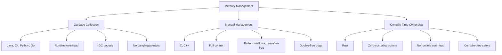
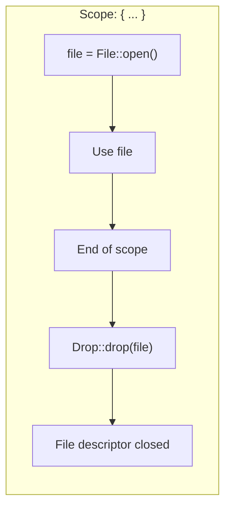

# Chapter 1: Why Rust is Different 🟢

> **What you'll learn:**
> - The three paradigms of memory management: garbage collection, manual allocation, and compile-time ownership
> - Why Rust's approach eliminates entire categories of bugs
> - The role of the Drop trait in Rust's automatic cleanup
> - How Rust's memory model compares to C++, Java, and Go

---

## The Memory Problem

Every program needs memory to store data. The question is: **who cleans up that memory when it's no longer needed?**

This deceptively simple question has shaped programming languages for decades. Different languages have taken different approaches, each with trade-offs that affect safety, performance, and developer experience.

## The Three Paradigms

Let's examine the three major approaches to memory management:



### 1. Garbage Collection (GC)

Languages like Java, C#, Python, and Go use a **garbage collector** that automatically reclaims memory when it's no longer referenced.

**How it works:** The GC periodically scans the heap to find objects that are no longer reachable from any root (like the stack or global variables) and frees them.

**Pros:**
- Developer doesn't need to think about deallocation
- No dangling pointers or double-frees
- Easier to write correct code

**Cons:**
- Runtime overhead (CPU cycles for GC)
- Unpredictable pause times (stop-the-world GC)
- Memory usage can grow unpredictably
- No control over when memory is freed

```java
// Java: GC handles cleanup automatically
public class Example {
    public static void main(String[] args) {
        String s = new String("Hello"); // Memory allocated
        s = null; // Old string becomes eligible for GC
        // GC will eventually clean this up
    }
}
```

### 2. Manual Memory Management

C and C++ require the programmer to explicitly allocate and free memory.

**How it works:** You call `malloc()`/`free()` in C or `new`/`delete` in C++ to manage heap memory manually.

**Pros:**
- Complete control over memory
- Predictable performance (no GC pauses)
- Minimal overhead

**Cons:**
- **Dangling pointers:** Pointing to freed memory
- **Memory leaks:** Forgetting to free memory
- **Double-free:** Freeing the same memory twice
- **Buffer overflows:** Writing past allocated bounds
- **Use-after-free:** Accessing freed memory

```cpp
// C++: Manual memory management - error-prone
class Example {
public:
    static void demo() {
        int* ptr = new int(42); // Allocate on heap
        // ... use ptr ...
        delete ptr; // Must remember to free!
        // WARNING: ptr is now a dangling pointer
        // *ptr = 100; // UNDEFINED BEHAVIOR!
    }
}
```

### 3. Compile-Time Ownership (Rust's Approach)

Rust takes a fundamentally different path: **the compiler analyzes your code at compile time and ensures memory safety without runtime overhead.**

**How it works:** Rust's ownership system enforces rules at compile time that prevent the bugs that GC and manual management struggle with. The borrow checker analyzes every variable's lifetime and reference usage.

**Pros:**
- Zero runtime overhead (like C/C++)
- Memory safety guarantees (like GC)
- No GC pauses
- Precise control over when memory is freed

**Cons:**
- Steeper learning curve
- Sometimes feel overly restrictive
- Cannot express certain unsafe patterns

## Why Rust's Approach Works

The key insight behind Rust's approach is this: **most memory management bugs happen at compile time, not runtime.**

When you write this C++ code:

```cpp
void demo() {
    int* ptr = new int(5);
    delete ptr;
    std::cout << *ptr << std::endl; // Use-after-free!
}
```

The bug exists in your source code—the computer can't distinguish between "I meant to use this after freeing" and "I forgot I freed it." The bug is a **property of your code's structure**, not something that emerges at runtime.

Rust's compiler analyzes the structure of your code and rejects programs that could have these bugs:

```rust
fn demo() {
    let ptr = Box::new(5);
    drop(ptr); // Explicitly drop the box
    // println!("{}", *ptr); // ❌ COMPILER ERROR: value borrowed here after move
}
```

The Rust compiler sees that `ptr` was moved into `drop()`, and any attempt to use `ptr` afterward is a compile-time error. No undefined behavior, no security vulnerability, no debugging session.

## The Drop Trait: Rust's Automatic Cleanup

One of the beautiful aspects of Rust is that cleanup is automatic. When a value goes out of scope, Rust automatically calls its destructor. This is implemented through the `Drop` trait.

```rust
struct CustomStruct {
    data: String,
}

// Implement Drop to define cleanup behavior
impl Drop for CustomStruct {
    fn drop(&mut self) {
        println!("Dropping CustomStruct with data: {}", self.data);
    }
}

fn main() {
    let _s = CustomStruct { data: "hello".to_string() };
    println!("Created the struct");
} // "Dropping CustomStruct..." is printed here automatically
```

**What you write:**
```rust
{
    let file = File::open("data.txt").unwrap();
    // Use the file...
} // File is automatically closed here!
```

**What happens in memory:**


The `Drop` trait is the reason Rust doesn't need `finally` blocks like Java or RAII destructors like C++—cleanup happens automatically at the end of the scope.

## Comparing Memory Models

| Aspect | C/C++ (Manual) | Java/C# (GC) | Rust (Ownership) |
|--------|----------------|--------------|------------------|
| **Runtime overhead** | None | GC pauses | None |
| **Memory safety** | Unsafe | Safe | Safe by default |
| **Control** | Full | Limited | Full |
| **Dangling pointers** | Possible | Impossible | Impossible |
| **Double-free** | Possible | Impossible | Impossible |
| **Use-after-free** | Possible | Impossible | Impossible |
| **Learning curve** | Low | Low | High |
| **Latency predictability** | High | Medium | High |

## The Borrow Checker: Your Friend

The borrow checker is the heart of Rust's memory safety. It enforces rules about how values can be accessed:

1. **Each value has exactly one owner**
2. **When the owner goes out of scope, the value is dropped**
3. **You can have either one mutable reference OR multiple immutable references**

These rules are checked at compile time. If you violate them, the compiler rejects your code—not with a runtime crash, but with a friendly compile-time error.

```rust
fn main() {
    let s1 = String::from("hello");
    let s2 = s1; // s1 is MOVED to s2
    
    // ❌ FAILS: s1 no longer has ownership
    // println!("{}", s1);
    
    // ✅ Works: s2 now owns the string
    println!("{}", s2);
}
```

```rust
fn main() {
    let mut s = String::from("hello");
    
    let r1 = &s; // Immutable borrow
    let r2 = &s; // Another immutable borrow - OK!
    
    // ❌ FAILS: can't borrow mutably while immutably borrowed
    // let r3 = &mut s;
    
    println!("{} and {}", r1, r2);
}
```

The compiler errors might feel frustrating now, but they're protecting you from real bugs that would only manifest at runtime in other languages.

<details>
<summary><strong>🏋️ Exercise: Understanding the Three Paradigms</strong> (click to expand)</summary>

**Challenge:** Write pseudo-code (or actual code in any language you know) demonstrating:

1. A memory leak (in any language)
2. A use-after-free bug (in C/C++)
3. How Rust prevents both of these

<details>
<summary>🔑 Solution</summary>

**1. Memory Leak Example (Python):**
```python
# Python: Creating objects without releasing references
leaked_objects = []
for i in range(1000000):
    # Even though we don't need these, GC can't collect them
    # because they're in the list
    leaked_objects.append({"data": [0] * 1000})
```

**2. Use-After-Free (C++):**
```cpp
int* ptr = new int(42);
delete ptr; // Memory freed
std::cout << *ptr << std::endl; // Use-after-free! Undefined behavior!
```

**3. Rust Prevention:**
```rust
fn main() {
    // Ownership prevents use-after-free
    let ptr = Box::new(42);
    drop(ptr); // Explicitly drop
    // println!("{}", *ptr); // COMPILE ERROR: borrow of moved value
    
    // Ownership + borrow checker prevents memory leaks
    // (cyclic data structures need explicit Rc/Arc)
}
```

The key insight: Rust catches these bugs at compile time because it tracks ownership and lifetime of every value.

</details>
</details>

> **Key Takeaways:**
> - Rust provides memory safety without garbage collection by enforcing ownership rules at compile time
> - The borrow checker analyzes your code's structure to prevent dangling pointers, double-frees, and use-after-free
> - The `Drop` trait provides automatic cleanup when values go out of scope
> - This approach gives you C/C++-level control with Java/C#-level safety

> **See also:**
> - [Chapter 2: Stack, Heap, and Pointers](./ch02-stack-heap-and-pointers.md) - Understanding where data lives in memory
> - [Chapter 3: The Rules of Ownership](./ch03-the-rules-of-ownership.md) - Deep dive into ownership semantics
