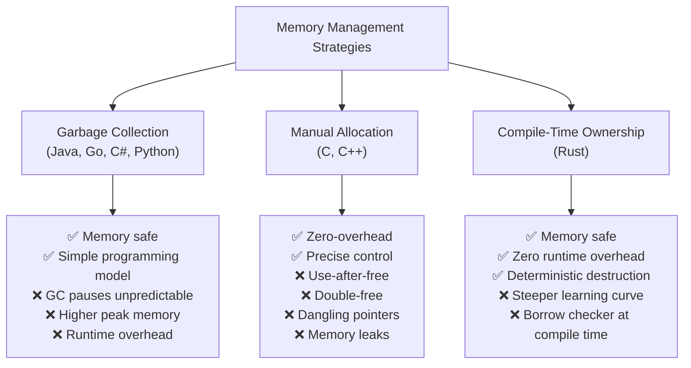

# Chapter 1: Why Rust is Different 🟢

> **What you'll learn:**
> - The three dominant memory management strategies and their fundamental trade-offs
> - Why garbage collectors, while safe, impose latency and throughput costs
> - Why manual memory management in C/C++ is powerful but catastrophically unsafe
> - How Rust's compile-time ownership model achieves both safety *and* performance with zero runtime cost

---

## 1.1 The Memory Management Problem

Every program written in every language faces the same fundamental problem: **memory is finite, and if you allocate it without freeing it, you will run out.** Worse, if you free memory and then try to use it again, your program reads or writes arbitrary bytes — a *use-after-free* bug, the source of the majority of critical security vulnerabilities in software history.

Over six decades of programming language history, three broad strategies have emerged:



Let's examine each strategy in depth, because understanding *why* the alternatives fail is the key to deeply appreciating Rust's design.

---

## 1.2 Garbage Collection: Safety at a Cost

Garbage-collected languages (Java, Go, C#, Python, JavaScript) are safe by design. You never free memory manually — a runtime scanning thread (the GC) identifies unreachable objects and reclaims them.

**The trade-offs are real:**

| Property | GC Languages | Rust |
|---|---|---|
| Memory safety | ✅ Guaranteed | ✅ Guaranteed |
| Peak memory usage | ❌ Higher (GC needs headroom) | ✅ Minimal (freed deterministically) |
| Latency predictability | ❌ Stop-the-world pauses | ✅ Fully deterministic |
| Destructor guarantees | ❌ `finalize()` is unreliable | ✅ `Drop` is guaranteed |
| Runtime overhead | ❌ GC scanning threads | ✅ None |
| Embedded / bare-metal | ❌ Requires runtime | ✅ Fully `no_std`-capable |

**The infamous Go GC example:** Go's GC has improved significantly, but production Go services still show latency spikes of 1–100ms at GC pause points. For real-time systems, network data planes, or audio processing, this is unacceptable. Java's G1/ZGC is better, but requires significant heap tuning.

**The destructor problem:** In Java, `finalize()` is never called deterministically — it may be called eventually, or never. This means resources like file handles, network sockets, and locks cannot be reliably released. The `try-with-resources` pattern was invented to paper over this, but it requires discipline. In Rust, `Drop` is called **exactly when a value goes out of scope** — no exceptions.

---

## 1.3 Manual Memory Management: Power Without Safety

C and C++ give the programmer complete control over memory: `malloc`/`free` in C, `new`/`delete` in C++, and increasingly RAII (Resource Acquisition Is Initialization) in modern C++.

The power is real. So is the danger.

**Common C/C++ memory bugs and their consequences:**

| Bug | Description | Real-World Impact |
|---|---|---|
| Use-after-free | Access memory after it was freed | ~70% of CVEs in browsers (Chrome, Firefox) |
| Double-free | Free memory twice | Heap corruption, arbitrary code execution |
| Buffer overflow | Write past array bounds | Stack smashing, control flow hijacking |
| Dangling pointer | Pointer to freed/moved memory | "Temporal memory safety" violations |
| Memory leak | Allocate without freeing | Service degradation, OOM crashes |
| Data race | Concurrent unsynchronized access | Non-deterministic corruption |

```c
// C: Use-after-free — the compiler accepts this happily
char *buf = malloc(64);
free(buf);
printf("%s\n", buf);  // ❌ Undefined behavior — reads freed memory
                      //    No compiler error. No runtime crash (usually).
                      //    Just quiet corruption.
```

```cpp
// C++: Dangling reference — the compiler often accepts this
std::string& get_name() {
    std::string local = "Alice";
    return local;  // ❌ Returns reference to stack-allocated object
}                  //    Object is destroyed when function returns
                   //    Caller holds a dangling reference
```

Modern C++ has smart pointers (`std::shared_ptr`, `std::unique_ptr`) that help — but they are opt-in conventions, not enforced by the type system. A single `raw pointer` anywhere can invalidate all the safety guarantees.

---

## 1.4 Rust's Approach: Ownership as a Compile-Time Proof

Rust's insight is that **memory safety can be proven at compile time** if every value in a program has a single, well-defined owner at any point in time. The compiler tracks this ownership statically — no runtime scanning, no reference-counting overhead (unless you opt into `Rc`/`Arc`).

The core guarantee is simple:
> **A value is dropped exactly when its owner goes out of scope.**

This is enforced *mechanically*, by the type system, with no exceptions.

```rust
// What you write:
fn main() {
    let s = String::from("hello"); // s owns the String
    println!("{}", s);
}                                  // s goes out of scope here
                                   // Drop is called automatically
                                   // Memory is freed

// What the compiler guarantees happens:
// 1. No memory leak (Drop is called)
// 2. No double-free (only one owner can trigger Drop)
// 3. No use-after-free (the borrow checker prevents access after drop)
```

---

## 1.5 The `Drop` Trait: Deterministic Destruction

`Drop` is the trait that runs cleanup code when a value goes out of scope. It is the Rust equivalent of a C++ destructor — but unlike C++ destructors, **it cannot be called manually** (you can't `value.drop()` — the compiler prevents it to avoid double-frees). It is always called *automatically* at the end of the owning scope.

```rust
struct DatabaseConnection {
    id: u32,
}

impl Drop for DatabaseConnection {
    fn drop(&mut self) {
        println!("Closing connection {}", self.id);
        // In a real impl: flush buffers, send FIN packet, close socket
    }
}

fn main() {
    let conn = DatabaseConnection { id: 42 };
    println!("Using connection {}", conn.id);
} // ← Drop::drop() is called here automatically
  // Output: "Closing connection 42"
```

**Drop order is deterministic and specified:** values are dropped in reverse order of declaration within a scope. Fields are dropped in declaration order after the containing struct. This is a guarantee in Rust's specification — not an implementation detail that might change.

```rust
fn main() {
    let a = DatabaseConnection { id: 1 };
    let b = DatabaseConnection { id: 2 };
    let c = DatabaseConnection { id: 3 };
} // Drops: c (id=3), then b (id=2), then a (id=1)
  // Reverse order of declaration — always.
```

---

## 1.6 What This Means for System Design

The practical engineering consequences of deterministic destruction are profound:

| Resource | GC Language Problem | Rust Solution |
|---|---|---|
| File handles | Must close explicitly or leak | Closed in `Drop` — impossible to leak |
| Network sockets | Finalization is unreliable | Torn down in `Drop` deterministically |
| Mutex guards | Must unlock in `finally` block | Unlocked when guard goes out of scope |
| Memory-mapped files | GC decides when to unmap | Unmapped precisely when owner drops |
| GPU buffers | Complex custom cleanup required | Freed in `Drop` — RAII works perfectly |
| Database transactions | `try/finally` or leaks | Rolled back in `Drop` if not committed |

This is why Rust is so well-suited to systems programming: it is as **deterministic** as C++, but as **safe** as Java.

---

<details>
<summary><strong>🏋️ Exercise: Tracing Drop Order</strong> (click to expand)</summary>

**Challenge:**

Given the following code, predict the exact output *before* running it. Then verify your prediction.

```rust
struct Guard(u32);

impl Drop for Guard {
    fn drop(&mut self) {
        println!("Dropping guard {}", self.0);
    }
}

fn make_guard(id: u32) -> Guard {
    println!("Creating guard {}", id);
    Guard(id)
}

fn process() {
    let a = make_guard(1);
    let b = make_guard(2);
    {
        let c = make_guard(3);
        println!("Inside inner scope");
    } // What drops here?
    let d = make_guard(4);
    println!("End of process");
} // What drops here?

fn main() {
    process();
    println!("After process");
}
```

**Questions:**
1. What is the full output in order?
2. Which guard is dropped first at the end of `process()`?
3. What would change if you added `drop(a);` explicitly before `let d = ...`?

<details>
<summary>🔑 Solution</summary>

```
Creating guard 1
Creating guard 2
Creating guard 3
Inside inner scope
Dropping guard 3   ← c drops when its scope ends
Creating guard 4
End of process
Dropping guard 4   ← reverse order: d drops first
Dropping guard 2   ← then b
Dropping guard 1   ← then a
After process
```

**Explanation:**
- `c` is dropped when the inner `{ }` scope closes — before `d` is even created
- At the end of `process()`, `d`, `b`, and `a` drop in *reverse order of declaration*
- `d` was declared last (after `a` and `b`), so it drops first

**If you add `drop(a);` explicitly:**
```rust
let a = make_guard(1);
let b = make_guard(2);
{
    let c = make_guard(3);
    println!("Inside inner scope");
}
drop(a); // ← Explicitly drop a here. a's memory is freed now.
let d = make_guard(4);
// a is no longer valid here — using 'a' after this is a compile error
println!("End of process");
// Only d and b drop at end of scope (a was already dropped)
```

`std::mem::drop(a)` is just a function that takes ownership and lets it go out of scope. It does not call `Drop` "specially" — it moves `a` into the function, and `a` drops when that function returns.

</details>
</details>

---

> **Key Takeaways**
> - Garbage collectors trade runtime overhead and latency for memory safety
> - Manual memory management trades safety for performance
> - Rust achieves both safety *and* zero-overhead via compile-time ownership tracking
> - `Drop` is called deterministically when a value's owner goes out of scope — no GC pauses, no finalizer uncertainty
> - Every CVE-class bug in C/C++ (use-after-free, double-free, dangling pointers) is prevented by Rust's type system before the program compiles

> **See also:**
> - [Chapter 2: Stack, Heap, and Pointers](ch02-stack-heap-and-pointers.md) — *where* values live and why it matters
> - [Chapter 3: The Rules of Ownership](ch03-rules-of-ownership.md) — the three formal rules that enforce everything above
