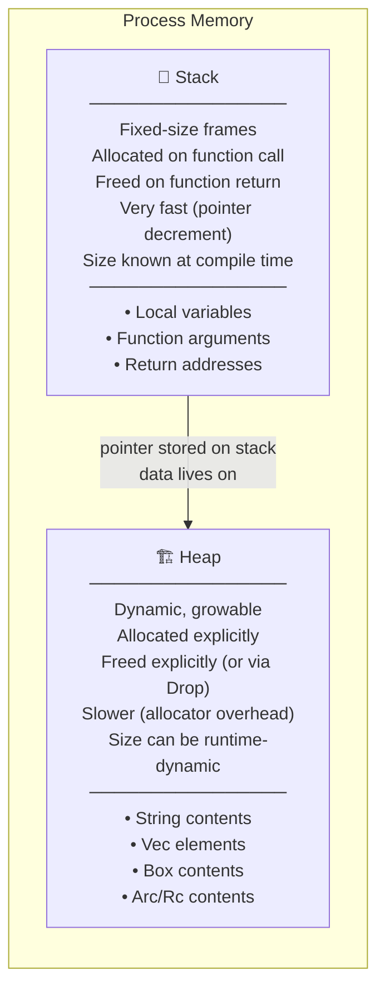
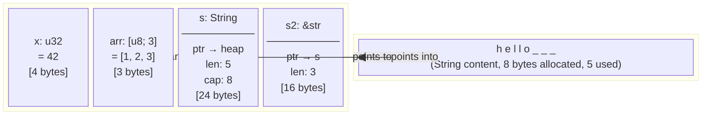
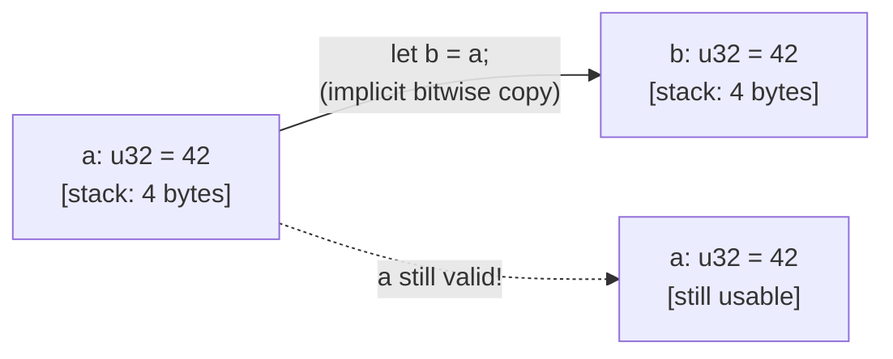
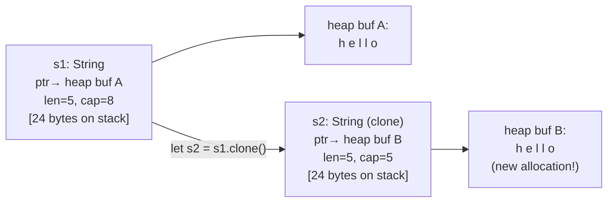

# Chapter 2: Stack, Heap, and Pointers 🟢

> **What you'll learn:**
> - The physical memory model: stack frames, the heap, and how the CPU uses them
> - Why `String` is a heap-allocated struct while `&str` is a pointer into existing memory
> - The critical distinction between `Copy` types (implicitly duplicated) and `Clone` types (explicitly deep-copied)
> - How Rust's type system encodes the difference between owned data and borrowed data

---

## 2.1 Physical Memory: Two Arenas

Every running program works with two distinct memory regions that differ in how they're managed, how fast they are, and what constraints they impose:



### The Stack

The stack is a contiguous region of memory where each function call gets a **stack frame** — a block containing:
- The function's local variables
- The function's arguments
- The return address (where to jump back to)

Stack frames are created and destroyed in LIFO (Last-In, First-Out) order. When a function is called, its frame is pushed. When it returns, its frame is popped. This is *blazing fast* — it's a single register increment/decrement.

**The constraint:** The compiler must know the *size of every stack variable at compile time*. A `u32` is 4 bytes. An `[u8; 64]` (array of 64 bytes) is 64 bytes. The stack doesn't handle "I don't know how many elements this will have until runtime."

### The Heap

The heap is a large, unorganized pool of memory managed by an **allocator** (like `malloc`/`jemalloc`/`mimalloc`). You request a block, the allocator finds a free region and hands you a pointer to it. When you're done, you return it.

**The advantage:** Sizes can be determined at runtime. A `Vec<u8>` can grow from 0 to 1,000,000 elements. A `String` can hold arbitrary text.

**The cost:** Every heap allocation involves the allocator's bookkeeping — typically 50–200 nanoseconds, plus cache pressure from pointer indirection.

---

## 2.2 Stack vs. Heap in Practice

Let's visualize exactly what happens for different Rust types:



```rust
fn main() {
    // Stack-allocated: size known at compile time, no heap involvement
    let x: u32 = 42;
    let arr: [u8; 3] = [1, 2, 3];

    // Heap-allocated: String is a (ptr, len, capacity) triple on the stack
    // The actual bytes "hello" live on the heap
    let s: String = String::from("hello");

    // &str is a (ptr, len) pair on the stack
    // It points INTO existing memory (here: into s on the heap)
    let s2: &str = &s[0..3]; // Points to the 'h', 'e', 'l' bytes in s
}
```

**Memory layout of `String` on a 64-bit system:**
| Field | Size | Description |
|---|---|---|
| `ptr` | 8 bytes | Pointer to the heap buffer |
| `len` | 8 bytes | Number of bytes currently used |
| `capacity` | 8 bytes | Number of bytes allocated on the heap |
| **Total** | **24 bytes** | On the stack — always this size |

The heap buffer is *separate* — its size varies.

**Memory layout of `&str`:**
| Field | Size | Description |
|---|---|---|
| `ptr` | 8 bytes | Pointer to the start of the string data |
| `len` | 8 bytes | Number of bytes in the slice |
| **Total** | **16 bytes** | On the stack — always this size, regardless of string length |

---

## 2.3 `String` vs. `&str`: The Definitive Explanation

This is one of the most common sources of confusion for Rust newcomers.

| | `String` | `&str` |
|---|---|---|
| **Owns** the data | ✅ Yes | ❌ No — borrows it |
| **Lives on** | Stack (struct) + Heap (data) | Stack (slice reference) |
| **Mutable** | ✅ Can grow, shrink, append | ❌ Cannot modify |
| **Can be created without existing data** | ✅ Yes | ❌ Must point to existing bytes |
| **Drop frees heap memory** | ✅ Yes | ❌ No (it doesn't own the data) |
| **Typical use** | Owned text, function return values | Borrowed text, string literals, slices |

```rust
// String literals are &'static str — they point into the program's binary
let literal: &str = "hello world"; // ptr → read-only section of the executable

// String is heap-allocated and owned
let owned: String = String::from("hello world"); // ptr → heap allocation

// You can slice a String to get a &str (borrowing from the String)
let borrowed: &str = &owned[0..5]; // ptr → owned's heap buffer, len=5

// You can convert &str to String (allocates new heap memory — O(n))
let also_owned: String = literal.to_string();
let also_owned2: String = literal.to_owned();
let also_owned3: String = String::from(literal);

// Functions that just read text should accept &str (works for both String and &str)
fn print_text(text: &str) {
    println!("{}", text);
}

print_text("literal");       // ✅ Works — &str
print_text(&owned);          // ✅ Works — String coerces to &str via Deref
print_text(borrowed);        // ✅ Works — already &str
```

**The rule of thumb:** Accept `&str` in function parameters unless you need ownership. Return `String` when you own the result.

---

## 2.4 `Copy` vs. `Clone`: Implicit vs. Explicit Duplication

Rust types fall into two categories based on how they behave when "copied":

### `Copy` Types: Bitwise Duplication, No Heap Involvement

A type is `Copy` if *all its data lives on the stack* and copying its bits is semantically correct. When you assign a `Copy` type or pass it to a function, Rust *silently makes a bitwise copy*. You can still use the original.



```rust
let a: u32 = 42;
let b = a;       // Copy: bitwise duplicate. Both a and b are valid.
println!("{} {}", a, b); // ✅ Prints "42 42"

// Types that implement Copy:
// - All integer types: u8, u16, u32, u64, u128, i8, i16, i32, i64, i128, usize, isize
// - Floating point: f32, f64
// - bool, char
// - References: &T (the pointer is copied, not the data)
// - Arrays and tuples of Copy types: [u32; 3], (u32, bool)
// - Raw pointers: *const T, *mut T
```

**Why `Copy` requires no heap:** If a type owns heap memory, you can't bitwise-copy it — you'd have two owners of the same heap allocation, and both would try to `free()` it on drop. That's a double-free. This is why `String` (which owns heap data) is *not* `Copy`.

### `Clone` Types: Explicit Deep Copy

`Clone` makes a full, independent copy — including any heap allocations. It is always **explicit** (you call `.clone()`) and potentially **expensive**.



```rust
let s1 = String::from("hello");
let s2 = s1.clone(); // Explicit: allocates new heap memory, copies bytes

println!("{} {}", s1, s2); // ✅ Both valid — each owns independent heap memory

// This would NOT compile without .clone():
// let s2 = s1; // ← This MOVES s1, not copies it. See Ch 3.
```

**The design intent of making `Clone` explicit:** Rust forces you to *see* performance costs at the call site. If you write `s.clone()`, you are consciously saying "I know this allocates memory." If you write `s2 = s1`, you are consciously saying "I am transferring ownership — `s1` is gone." Nothing is hidden.

### Summary Table

| Type | `Copy`? | `Clone`? | Assignment behavior |
|---|---|---|---|
| `u32`, `i64`, `bool`, `f64` | ✅ | ✅ | Implicit bitwise copy |
| `&T` (shared reference) | ✅ | ✅ | Copies the pointer |
| `[T; N]` where T: Copy | ✅ | ✅ | Implicit bitwise copy |
| `String` | ❌ | ✅ | *Moves* ownership (see Ch 3) |
| `Vec<T>` | ❌ | ✅ | *Moves* ownership |
| `Box<T>` | ❌ | ✅ (if T: Clone) | *Moves* ownership |
| `Rc<T>`, `Arc<T>` | ❌ | ✅ (increments refcount) | Clones the refcount handle |
| Custom struct with Copy fields | ✅ if you `derive(Copy)` | ✅ if you `derive(Clone)` | Depends |

---

## 2.5 Pointer Indirection and Cache Performance

Understanding the heap matters not just for safety but for **performance**. Heap allocations require pointer indirection — an extra memory dereference. On modern CPUs, a cache miss costs ~100 CPU cycles vs ~1 cycle for a cache hit.

```rust
// ✅ Cache-friendly: all data contiguous on stack
let arr: [u32; 1000] = [0; 1000];
// arr[0], arr[1], ... arr[999] are adjacent in memory → CPU prefetcher loves this

// ❌ Cache-unfriendly: each element is a separate heap allocation
let v: Vec<Box<u32>> = (0..1000).map(|i| Box::new(i)).collect();
// v[0] points to some heap location, v[1] points to another, scattered all over RAM
// Iterating this is ~10-50x slower due to cache misses
```

This is why Rust's zero-cost abstractions matter: `Vec<u32>` stores elements contiguously on the heap (like a C array), while `Vec<Box<u32>>` scatters them. Both compile, but performance differs dramatically.

---

<details>
<summary><strong>🏋️ Exercise: Memory Layout Analysis</strong> (click to expand)</summary>

**Challenge:**

For each of the following variables, answer: (a) Where does the variable itself live — stack or heap? (b) Where does the *data* it represents live? (c) Is it `Copy`?

```rust
let a: u64 = 100;
let b: &u64 = &a;
let c: String = String::from("rust");
let d: &str = "static string";
let e: &str = &c;
let f: Box<u64> = Box::new(99);
let g: Vec<u8> = vec![1, 2, 3];
let h: [u8; 4] = [0, 1, 2, 3];
```

<details>
<summary>🔑 Solution</summary>

| Var | Variable lives on | Data lives on | `Copy`? |
|---|---|---|---|
| `a: u64` | Stack | Stack (u64 IS its data) | ✅ Yes |
| `b: &u64` | Stack (it's a pointer) | Stack (points to `a` on stack) | ✅ Yes (pointer is copied) |
| `c: String` | Stack (ptr+len+cap triple) | **Heap** (the bytes "rust") | ❌ No |
| `d: &str` | Stack (ptr+len pair) | **Static section of binary** ("static string") | ✅ Yes (pointer is copied) |
| `e: &str` | Stack (ptr+len pair) | **Heap** (points into `c`'s heap buffer) | ✅ Yes (pointer is copied) |
| `f: Box<u64>` | Stack (it's a pointer) | **Heap** (the u64 value 99) | ❌ No (unique heap owner) |
| `g: Vec<u8>` | Stack (ptr+len+cap triple) | **Heap** (the bytes 1,2,3) | ❌ No |
| `h: [u8; 4]` | Stack (4 bytes inline) | Stack (array IS its data) | ✅ Yes |

**Key insight:** `&str` and `&u64` are `Copy` because copying a reference just copies the *pointer* — a small fixed-size integer. The data being pointed to is not touched or duplicated. This is why references are so cheap to pass around.

</details>
</details>

---

> **Key Takeaways**
> - The stack holds fixed-size values known at compile time; the heap holds dynamically-sized data
> - `String` is a *struct* (ptr + len + capacity) that *owns* heap-allocated bytes; `&str` is a *pointer* that *borrows* bytes from somewhere else
> - `Copy` types are silently duplicated on assignment (no heap, no cost); `Clone` types require an explicit `.clone()` call to deep-copy
> - Pointer indirection to the heap has cache performance costs — prefer contiguous layouts (`Vec<T>`, `[T; N]`) over scattered heap pointers (`Vec<Box<T>>`) when performance matters

> **See also:**
> - [Chapter 1: Why Rust is Different](ch01-why-rust-is-different.md) — the memory management context
> - [Chapter 3: The Rules of Ownership](ch03-rules-of-ownership.md) — what happens when you assign non-`Copy` values
> - [Chapter 9: Box and the Sized Trait](ch09-box-and-sized.md) — deep dive on heap allocation with `Box<T>`
