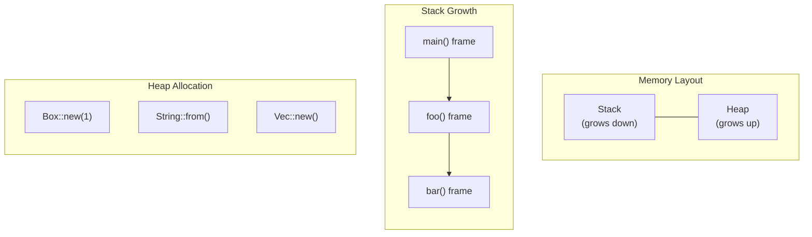
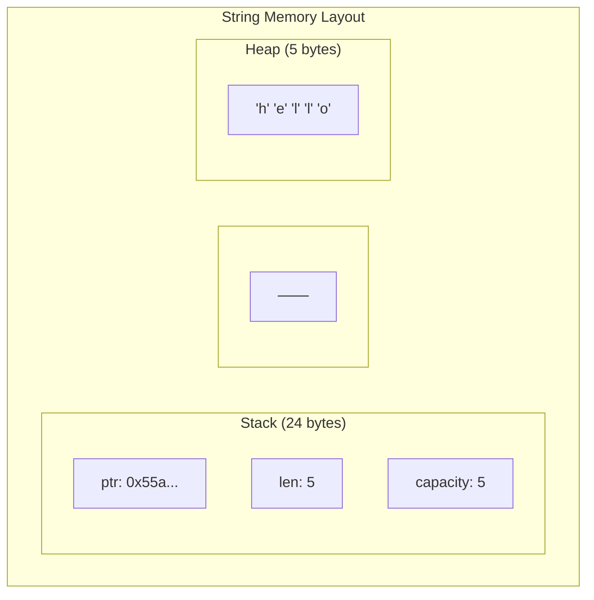
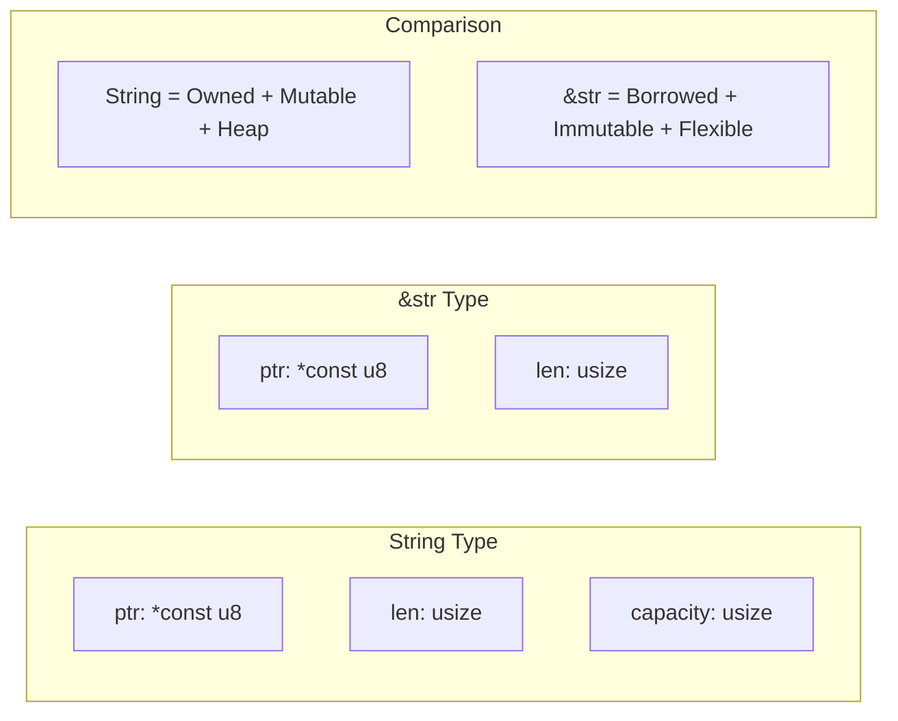
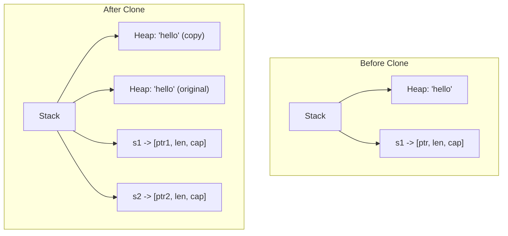
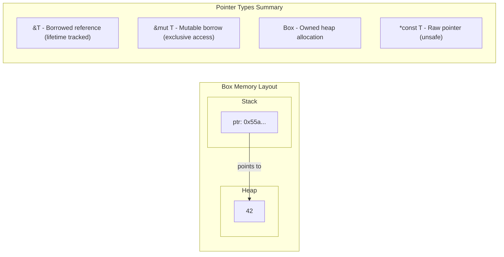

# Chapter 2: Stack, Heap, and Pointers 🟢

> **What you'll learn:**
> - The fundamental difference between stack and heap allocation
> - Why `String` is different from `&str` (stack vs. heap data)
> - The `Copy` trait vs. the `Clone` trait - and why the distinction matters
> - How pointers work in Rust and what makes them safe

---

## Memory 101: The Two Regions

When your program runs, it has access to two main regions of memory: the **stack** and the **heap**. Understanding the difference is crucial to understanding Rust's ownership model.

### The Stack: Fast, Small, LIFO

The stack is a region of memory that grows and shrinks as functions are called. It follows the Last-In-First-Out (LIFO) principle—think of a stack of plates.

**Stack characteristics:**
- Very fast allocation/deallocation
- Small memory footprint (typically 1-8 MB)
- Fixed-size data only (primitives, references, fixed arrays)
- Memory management is automatic (function calls)



### The Heap: Slow, Large, Dynamic

The heap is a larger region of memory for dynamic data—data whose size isn't known at compile time. When you need memory that lives beyond a single function call or has variable size, the heap is where you allocate.

**Heap characteristics:**
- Slower allocation/deallocation
- Large memory footprint (limited only by system)
- Dynamic-size data (strings, vectors, custom structs)
- Manual management (in C/C++) or automatic (in GC languages, but with overhead)

## Stack vs. Heap in Rust

Let's see how Rust handles both:

### Primitive Types (Stack-Only)

Primitive types like `i32`, `bool`, `char`, and fixed-size arrays are stored entirely on the stack:

```rust
fn main() {
    let x: i32 = 42;      // Stored on stack
    let y: f64 = 3.14;    // Stored on stack
    let z: bool = true;   // Stored on stack
    
    // These are Copy types - they're copied, not moved
    let x2 = x;           // x is copied to x2 (both valid)
    println!("{} {}", x, x2); // Both x and x2 are valid!
}
```

###heap Types (Dynamic Size)

Types like `String`, `Vec<T>`, and `Box<T>` store their data on the heap:

```rust
fn main() {
    let s: String = String::from("hello"); // Metadata on stack, data on heap
    
    // Memory layout:
    // Stack: [ptr, len, capacity]  (3 * usize = 24 bytes on 64-bit)
    // Heap: ['h', 'e', 'l', 'l', 'o']  (5 bytes)
    
    println!("{}", s);
}
```



## The Difference Between String and &str

This is one of the most confusing aspects of Rust for beginners. Let me break it down:

### `String` - Owned, Heap-Allocated, Mutable

```rust
fn main() {
    let mut s = String::from("hello"); // String on heap
    s.push_str(" world");              // Can modify it
    println!("{}", s);                 // "hello world"
}
```

**Memory layout:**
- **Stack:** Contains `ptr`, `len`, `capacity`
- **Heap:** Contains the actual characters

### `&str` - Borrowed, Can Point to Anywhere, Immutable

```rust
fn main() {
    let s: &str = "hello"; // String literal - stored in binary!
    
    // Two places &str can refer to:
    // 1. The binary's read-only data section (string literals)
    // 2. A portion of a String (subslicing)
    
    println!("{}", s);
}
```

**Memory layout:**
- **Stack:** Contains `ptr`, `len` (no capacity!)
- **Can point to:** Heap (from String) or read-only section (string literals)



### Why This Matters for Ownership

The key insight: **`String` owns its data** (the drop scheduler will free the heap memory), while **`&str` just borrows a view into existing data** (no drop needed).

```rust
fn main() {
    let owned: String = String::from("hello");  // Owns heap data
    
    let borrowed: &str = &owned;                // Borrows from owned
    
    println!("{} {}", owned, borrowed); // Both work
    
} // owned is dropped, heap memory freed
```

## Copy vs. Clone: The Crucial Distinction

Rust has two traits for creating copies of values: `Copy` and `Clone`. They're different:

### Copy: Implicit, Bitwise Copy (No Work)

Types that implement `Copy` are copied by simply copying their bits. There's no runtime cost, and the original value remains valid.

**Copy types include:** All primitive types (`i32`, `bool`, `char`, etc.), references (`&T`, `&mut T`), tuples of Copy types, arrays of Copy types.

```rust
fn main() {
    let x: i32 = 42;
    let y = x; // Bitwise copy - x is still valid!
    
    println!("x = {}, y = {}", x, y); // Both valid!
}

// What happens in memory:
// Stack: [x: 42] -> copy -> [y: 42]
// No heap allocation, no drop needed for either
```

### Clone: Explicit, Deep Copy (May Allocate)

Types that implement `Clone` can create a deep copy, which may involve heap allocation.

```rust
fn main() {
    let s1 = String::from("hello");
    let s2 = s1.clone(); // Explicit clone - heap data is copied!
    
    // Both s1 and s2 are valid, but point to different heap data
    
    println!("s1 = {}, s2 = {}", s1, s2);
} // Both are dropped (two separate heap allocations)
```



### The Rule: Copy for Primitives, Clone for Complex Types

```rust
// Copy types (cheap, implicit)
let a: i32 = 5;
let b = a; // Copy - no.clone() needed

let c: &i32 = &a;
let d = c; // Copy - reference copy is cheap

// Clone types (may be expensive)
let s = String::from("hello");
let t = s.clone(); // Must explicitly clone - may allocate!

let v = vec![1, 2, 3];
let w = v.clone(); // Must explicitly clone - allocates!
```

### Why Does This Matter?

The difference between `Copy` and `Clone` is foundational to Rust's performance:

1. **Copy is zero-cost:** The compiler generates simple `mov` instructions
2. **Clone is explicit:** You opt into potentially expensive operations
3. **Ownership transfer:** When you move a non-Copy type, you give up ownership

## Pointers in Rust

Rust has several pointer types, each with different semantics:

### References (`&T` and `&mut T`)

The safest pointers—enforced by the borrow checker.

```rust
fn main() {
    let x = 42;
    
    let r: &i32 = &x;      // Immutable reference
    let mr: &mut i32 = &mut x;  // Mutable reference
    
    println!("{}", r);     // Read through reference
    *mr = 100;            // Write through mutable reference
}
```

### Raw Pointers (`*const T` and `*mut T`)

Unsafe, like C pointers. Bypass the borrow checker.

```rust
fn main() {
    let x = 42;
    
    let r: *const i32 = &x; // Immutable raw pointer
    let mr: *mut i32 = &mut x; // Mutable raw pointer
    
    unsafe {
        println!("{}", *r); // Must be in unsafe block!
    }
}
```

### Box<T>: Owned Pointer

`Box<T>` allocates `T` on the heap and owns it.

```rust
fn main() {
    let b = Box::new(42); // Allocate 42 on heap
    
    println!("{}", b);    // Dereference automatically
    
} // Box is dropped, heap memory freed
```



<details>
<summary><strong>🏋️ Exercise: Tracing Memory Layouts</strong> (click to expand)</summary>

**Challenge:** For each code snippet, draw the memory layout (stack and heap) and identify what's on each:

```rust
// 1.
let x = 5;
let y = x;

// 2.
let s1 = String::from("hi");
let s2 = s1;

// 3.
let b = Box::new(100);

// 4.
let arr = [1, 2, 3];
let arr2 = arr;
```

<details>
<summary>🔑 Solution</summary>

**1. `let x = 5; let y = x;`**
```
Stack:
  x: 5 (Copy type - copied, both valid)
  y: 5

Heap: None
```
Both x and y are valid because i32 implements Copy.

**2. `let s1 = String::from("hi"); let s2 = s1;`**
```
Stack:
  s1: [ptr, len=2, cap=2]  ---> Heap: ['h', 'i']
  s2: [ptr, len=2, cap=2]  ---> Heap: ['h', 'i'] (moved, not copied!)
  
Note: Only the metadata is on stack. After move, s1 is invalidated!
```
s1 is moved to s2 - s1 no longer valid.

**3. `let b = Box::new(100);`**
```
Stack:
  b: [ptr]  ---> Heap: 100

Heap: 100 (4 bytes)
```
Box owns the heap allocation.

**4. `let arr = [1, 2, 3]; let arr2 = arr;`**
```
Stack:
  arr:  [1, 2, 3]  (12 bytes for [i32; 3])
  arr2: [1, 2, 3]  (copied - array of Copy types)

Heap: None
```
Arrays of Copy types are also Copy!

</details>
</details>

> **Key Takeaways:**
> - The stack is fast but limited to fixed-size data; the heap is larger but slower
> - `String` owns heap data (metadata on stack); `&str` is a borrowed view
> - `Copy` types are implicitly copied (bitwise); `Clone` types require explicit cloning
> - Understanding stack vs. heap is essential for understanding ownership

> **See also:**
> - [Chapter 1: Why Rust is Different](./ch01-why-rust-is-different.md) - The three paradigms of memory management
> - [Chapter 3: The Rules of Ownership](./ch03-the-rules-of-ownership.md) - How ownership works
