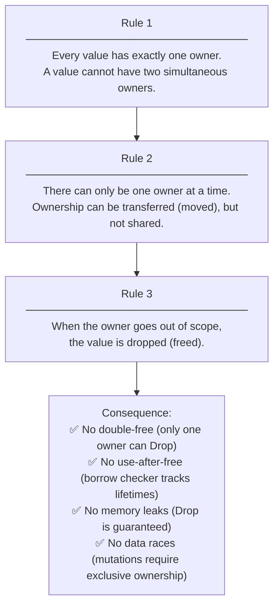
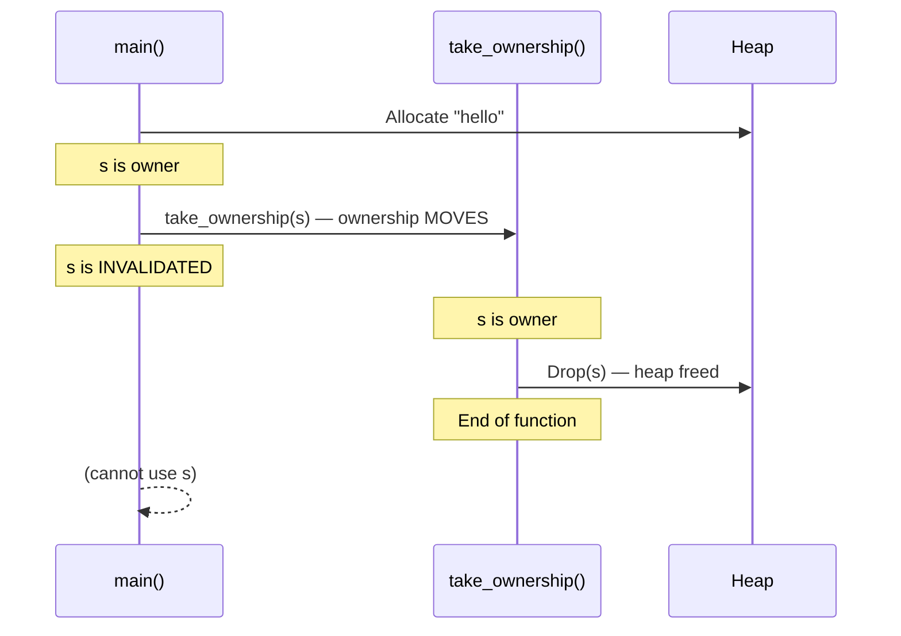

# Chapter 3: The Rules of Ownership 🟢

> **What you'll learn:**
> - The three formal ownership rules that Rust's type system enforces
> - Move semantics: why assigning a non-`Copy` value *transfers* ownership instead of copying
> - Why Rust invalidates variables after a move (and why this is a feature, not a limitation)
> - How ownership flows through function calls and return values

---

## 3.1 The Three Rules

Rust's entire memory safety guarantee rests on three rules. They are not suggestions or best practices — the compiler enforces them *absolutely* with no opt-out (in safe Rust):



These rules sound simple, but they have profound implications for how you write programs. Let's explore each through concrete examples.

---

## 3.2 Rule 1: Every Value Has Exactly One Owner

At any given moment in your program's execution, every value has exactly one *owner* — one piece of code that is responsible for it. When that owner is a variable, the variable owns the value. When that owner is a struct field, the struct owns the value.

```rust
let s = String::from("hello");
// s is the owner of the String.
// "Owner" means: s is responsible for dropping (freeing) this String.
```

Ownership is not about *access* — many parts of your code can *read* a value (via borrows, covered in Ch 4). Ownership is about *responsibility for cleanup*.

---

## 3.3 Rule 2: Ownership Can Be Transferred (Moved)

When you assign a non-`Copy` value to another variable, or pass it to a function, ownership **moves**. The original variable is invalidated — the compiler will refuse to compile code that uses it after the move.

```mermaid
sequenceDiagram
    participant s1 as s1 (owner)
    participant s2 as s2 (new owner)
    participant Heap as Heap Buffer

    s1->>Heap: "hello" (allocated)
    Note over s1: s1 is valid, owns heap memory
    s1->>s2: let s2 = s1; (MOVE)
    Note over s1: ❌ s1 is INVALIDATED
    Note over s2: ✅ s2 is now the owner
    s2->>Heap: Drop on scope exit (freed once)
```

```rust
let s1 = String::from("hello");
let s2 = s1; // s1 is MOVED into s2

// ❌ FAILS: error[E0382]: borrow of moved value: `s1`
//    --> src/main.rs:4:20
//    |
//    | let s1 = String::from("hello");
//    |     -- move occurs because `s1` has type `String`
//    | let s2 = s1;
//    |          -- value moved here
//    | println!("{}", s1);
//    |                ^^ value borrowed here after move
println!("{}", s1);

// ✅ FIX 1: Use s2 (the current owner)
println!("{}", s2); // ✅

// ✅ FIX 2: Clone if you need both
let s1 = String::from("hello");
let s2 = s1.clone(); // Explicit deep copy — both are valid
println!("{} {}", s1, s2); // ✅
```

**Why invalidate `s1` instead of copying?**

Because `String` owns heap memory. If Rust silently copied `s1` to `s2`:
- Both `s1` and `s2` would point to the same heap buffer
- When `s1` drops, the buffer would be freed
- When `s2` drops, the same buffer would be freed *again* → **double-free**

By *moving* and *invalidating*, Rust ensures there is always exactly one owner, and the heap memory is freed exactly once.

**Contrast with C++:** C++ also has move semantics (`std::move`), but they are opt-in. You can accidentally copy a `std::string` without noticing. Rust moves are *the default for non-`Copy` types* — you cannot accidentally copy.

---

## 3.4 Move Semantics in Detail

Let's trace the exact memory state through a move:

```rust
// Before the move:
let s1 = String::from("hello");
// Stack: s1 = { ptr: 0x7f1234, len: 5, cap: 5 }
// Heap @ 0x7f1234: ['h', 'e', 'l', 'l', 'o']

let s2 = s1;
// Stack: s1 = { ptr: 0x7f1234, len: 5, cap: 5 } ← INVALIDATED (compiler tracks this)
// Stack: s2 = { ptr: 0x7f1234, len: 5, cap: 5 } ← s2 now holds the same ptr/len/cap
// Heap @ 0x7f1234: ['h', 'e', 'l', 'l', 'o'] ← unchanged, one heap allocation

// The MOVE copies the stack bytes (ptr, len, cap) into s2 and marks s1 as "moved from"
// It does NOT copy the heap data
// It does NOT change the heap pointer
// When s2 drops, the heap is freed exactly once
```

This is identical to what C++'s move constructor does under the hood — but in Rust, the *compiler* enforces that you cannot use the moved-from value, rather than relying on programmer discipline.

---

## 3.5 Ownership Through Functions

When you pass a non-`Copy` value to a function, ownership *moves into* the function. When the function returns without returning the value, the value is *dropped* at the end of the function.

```rust
fn take_ownership(s: String) {
    println!("Got: {}", s);
} // s is dropped here — heap memory freed

fn main() {
    let s = String::from("hello");
    take_ownership(s); // s is MOVED into the function
    // ❌ FAILS: s is no longer valid here
    // println!("{}", s); // error[E0382]: borrow of moved value: `s`
}
```



**To use a value after passing it to a function, you have three options:**

```rust
// Option 1: Return the value back (ownership transfer round-trip)
fn takes_and_gives_back(s: String) -> String {
    s // ownership moves to caller
}

fn main() {
    let s1 = String::from("hello");
    let s2 = takes_and_gives_back(s1); // s1 moves in, comes back as s2
    println!("{}", s2); // ✅
}

// Option 2: Use a reference (borrowing) — the idiomatic solution for reads
fn just_reads(s: &String) {
    println!("{}", s); // reads but does not take ownership
}

fn main() {
    let s = String::from("hello");
    just_reads(&s); // lend s, keep ownership
    println!("{}", s); // ✅ s is still valid
}

// Option 3: Accept a &str (even better, works for both &String and &str)
fn read_text(text: &str) {
    println!("{}", text);
}
```

Option 2 is the idiomatic choice and leads directly into Chapter 4 (Borrowing).

---

## 3.6 Rule 3: When the Owner Goes Out of Scope, the Value Drops

We saw this in Ch 1 with `Drop`. Let's be precise about what "out of scope" means:

```rust
fn main() {          // scope A begins
    let x = 5;      // x is in scope A

    {                // scope B begins
        let y = String::from("hello"); // y is in scope B
        println!("{}", y);
    }                // scope B ends: y drops here (heap freed)

    // y is not accessible here — it's been dropped
    // x is still accessible
    println!("{}", x);
} // scope A ends: x drops here (x is Copy, so nothing special happens)
```

**Multiple values, compound types:**

```rust
struct Config {
    host: String,   // Config owns host
    port: u16,
}

fn main() {
    let cfg = Config {
        host: String::from("localhost"),
        port: 8080,
    };
} // cfg drops here. Drop order for fields: host drops, then port.
  // host's heap memory is freed. port is a u16 (no heap), nothing to free.
```

**What gets dropped is determined at compile time.** There is no runtime GC bookkeeping.

---

## 3.7 Partial Moves

Rust allows moving out of individual fields of a struct in some contexts. Once a field is moved, the parent struct becomes *partially moved* — you cannot use it as a whole, but you can still use the non-moved fields.

```rust
struct Point {
    x: String, // non-Copy
    y: String, // non-Copy
}

let p = Point {
    x: String::from("north"),
    y: String::from("east"),
};

let x_val = p.x; // Move p.x out of p — p is now partially moved

println!("{}", x_val); // ✅ x_val is valid
println!("{}", p.y);   // ✅ p.y was not moved — still valid

// ❌ FAILS: error[E0382]: partial move occurs because `p.x` has type `String`
// println!("{:?}", p); // Cannot use p as a whole after partial move
```

Partial moves are uncommon and often a sign to restructure, but the compiler handles them correctly.

---

## 3.8 Comparing: Rust vs C++ vs Go

| Operation | C++ | Go | Rust |
|---|---|---|---|
| `a = b` where b is heap-owning | Copy constructor (possible deep copy!) | Value copy (GC manages both) | **Move** — b is invalidated |
| Pass to function | Copy or explicit `std::move()` | Copy (GC manages) | **Move** by default |
| Two variables, same heap data | ❌ Possible: double-free | ✅ GC tracks both refs | ❌ Impossible: only one owner |
| Use after move | ❌ Undefined behavior (no compiler check) | N/A (GC) | ❌ **Compile error** |
| Explicit copy | `obj.clone()` or copy constructor | Copy semantics by default | `obj.clone()` — explicit and visible |

---

<details>
<summary><strong>🏋️ Exercise: Ownership Tracing</strong> (click to expand)</summary>

**Challenge:**

The following code has 4 ownership errors. Find all four, explain what each error is, and provide a fix for each.

```rust
fn concat(a: String, b: String) -> String {
    format!("{}{}", a, b)
}

fn main() {
    let s1 = String::from("Hello, ");
    let s2 = String::from("world!");

    let result = concat(s1, s2);

    // Bug 1:
    println!("s1 was: {}", s1);

    // Bug 2:
    println!("s2 was: {}", s2);

    // Bug 3:
    let r = &result;
    let result2 = result;
    println!("{}", r);

    // Bug 4:
    let v = vec![String::from("a"), String::from("b")];
    let first = v[0];  // trying to move out of vec
    println!("{}", first);
}
```

<details>
<summary>🔑 Solution</summary>

**Bug 1 & 2:** `s1` and `s2` are moved into `concat`. After the call, they are invalid.

```rust
// ❌ Bug 1 & 2: s1 and s2 moved into concat
let result = concat(s1, s2);
println!("s1 was: {}", s1); // error[E0382]: borrow of moved value: `s1`
println!("s2 was: {}", s2); // error[E0382]: borrow of moved value: `s2`

// ✅ Fix: Change concat to take &str (borrow) instead of owned String
fn concat(a: &str, b: &str) -> String {
    format!("{}{}", a, b)
}
// OR: Clone s1 and s2 before passing (less efficient)
let result = concat(s1.clone(), s2.clone());
println!("s1 was: {}", s1); // ✅
println!("s2 was: {}", s2); // ✅
```

**Bug 3:** `r` borrows `result`, then `result` is moved. The borrow `r` becomes dangling.

```rust
// ❌ Bug 3: r borrows result, then result is moved
let r = &result;
let result2 = result; // error[E0505]: cannot move out of `result` because it is borrowed
println!("{}", r);

// ✅ Fix: Either don't borrow before moving, or don't move
let result2 = result; // Move first
println!("{}", result2); // Use the new owner

// OR: Clone to keep both
let result2 = result.clone();
println!("{} {}", result, result2);
```

**Bug 4:** You cannot move out of a `Vec` by index — it would leave the `Vec` in a partially invalid state.

```rust
// ❌ Bug 4: error[E0507]: cannot move out of index of `Vec<String>`
let first = v[0]; // v[0] is a `String`, moving would leave v[0] in invalid state

// ✅ Fix 1: Clone
let first = v[0].clone();

// ✅ Fix 2: Use .into_iter() to consume the Vec, taking owned elements
let mut iter = v.into_iter();
let first = iter.next().unwrap();

// ✅ Fix 3: Borrow instead of move
let first: &String = &v[0]; // borrow, don't move
println!("{}", first); // read-only access
```

</details>
</details>

---

> **Key Takeaways**
> - The three ownership rules are: (1) one owner per value, (2) ownership transfers via move, (3) values drop when the owner goes out of scope
> - Assignment of non-`Copy` types *moves* ownership — the original variable is invalidated by the compiler
> - Moves are cheap: they copy the stack representation of the value (pointer + metadata) without touching heap data
> - Functions consume ownership of non-`Copy` arguments by default; use references (`&T`, `&mut T`) to borrow instead
> - These rules make double-free, use-after-free, and memory leaks structurally impossible in safe Rust

> **See also:**
> - [Chapter 2: Stack, Heap, and Pointers](ch02-stack-heap-and-pointers.md) — why non-`Copy` types can't be silently duplicated
> - [Chapter 4: Borrowing and Aliasing](ch04-borrowing-and-aliasing.md) — how to access values without taking ownership
