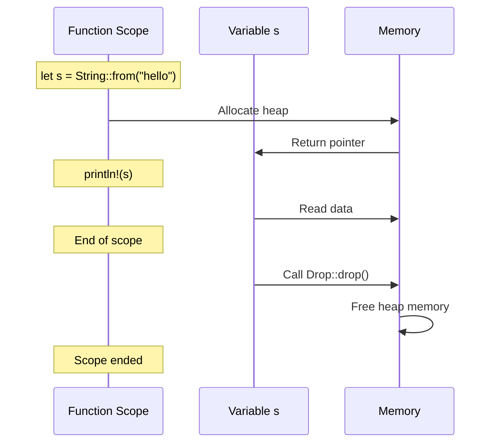
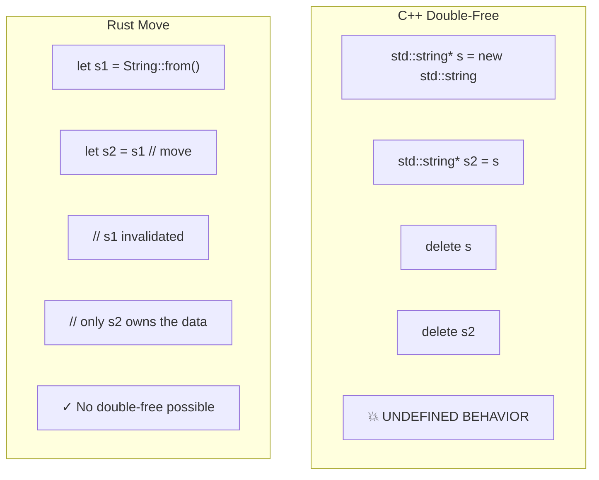

# Chapter 3: The Rules of Ownership 🟢

> **What you'll learn:**
> - The three fundamental rules of ownership in Rust
> - Why Rust moves values instead of deep copying (and why this is a feature, not a bug)
> - How move semantics prevent double-free bugs
> - The difference between moves and copies in practice

---

## The Three Rules

Rust's ownership system is built on three simple rules:

1. **Each value has exactly one owner**
2. **When the owner goes out of scope, the value is dropped**
3. **There can be either one mutable reference OR multiple immutable references** (we'll cover this in Chapter 4)

These rules are enforced at compile time. If you violate them, your code won't compile. This is the key to Rust's memory safety.

## Rule 1: Each Value Has Exactly One Owner

This is the cornerstone of Rust's ownership model. Every piece of data in Rust has exactly one variable that "owns" it.

```rust
fn main() {
    let s = String::from("hello"); // s OWNS the String
    
    // There's no ambiguity about who manages this memory
    // Only s is responsible for dropping it
    
} // s goes out of scope, String is automatically dropped
```

Compare this to C++ where you might have confusion about who owns what:

```cpp
// C++: Who's responsible for freeing this?
void process(std::string* s) {
    // Is the caller still using it? Do I delete it?
}

void demo() {
    std::string* s = new std::string("hello");
    process(s); // Ambiguous ownership!
    // Should I delete s here? Was it deleted in process?
}
```

In Rust, ownership is always clear:

```rust
fn process(s: String) {
    // s now OWNS the string - Rust's type system guarantees
    // that we're the only ones managing this memory
}

fn demo() {
    let s = String::from("hello");
    process(s); // Ownership MOVES to process
    
    // We can't use s here - it's been moved!
}
```

## Rule 2: When the Owner Goes Out of Scope, the Value is Dropped

This is automatic. You don't need to manually free memory. When a variable goes out of scope, Rust calls its `Drop` implementation.

```rust
fn main() {
    {
        let s = String::from("hello");
        println!("{}", s);
    } // s is dropped here - automatic cleanup!
    
    // No memory leak, no use-after-free possible
    
    let x = 5;
} // x is dropped here too (i32 doesn't need cleanup, but the principle applies)
```



### Why Move Instead of Copy?

This is one of the most confusing aspects of Rust for newcomers. Why does this fail?

```rust
fn main() {
    let s1 = String::from("hello");
    let s2 = s1; // What happens here?
    
    // ❌ FAILS: s1 no longer valid after this line
    // println!("{}", s1);
    
    println!("{}", s2); // This works
}
```

The answer: **Rust moves instead of copying for heap-allocated types.**

### Why Moves Are a Feature

You might think this is annoying—you want both `s1` and `s2` to be valid. But moves actually prevent bugs:

1. **No double-free bugs:** Only one variable owns the data, so only one will drop it
2. **No dangling pointers:** When you move, the source is invalidated
3. **Performance:** Moving a pointer is O(1), copying heap data is O(n)

```mermaid
flowchart TB
    subgraph BeforeMove["Before Move: let s1 = String::from(\"hello\")"]
        direction LR
        Stack1["Stack"] --> Heap1["Heap"]
        Stack1 --> S1["s1: [ptr, len, cap]"]
    end
    
    subgraph AfterMove["After Move: let s2 = s1;"]
        direction LR
        Stack2["Stack"] --> Heap2["Heap"]
        Stack2 --> S2a["s1: [INVALIDATED]"]
        Stack2 --> S2b["s2: [ptr, len, cap]"]
        S2b -->|points to| Heap2
    end
    
    subgraph KeyPoint["The key insight"]
        K1["Move = Transfer ownership (cheap!)"]
        K2["Copy = Duplicate data (expensive!)"]
        K3["Rust moves by default, copies only for Copy types"]
    end
```

### What About Copy Types?

Remember from Chapter 2: some types implement `Copy`. For these types, the value is simply copied (bitwise):

```rust
fn main() {
    let x = 5;      // i32 is Copy
    let y = x;      // Both x and y are valid!
    
    println!("{} {}", x, y); // Both work - they're copies
}
```

The rule of thumb: **If a type allocates heap memory, it's not Copy (unless explicitly implemented).**

```rust
// These are Copy (no heap allocation):
let a: i32 = 5;
let b: bool = true;
let c: char = 'x';
let d: (i32, i32) = (1, 2);
let e: &[i32] = &[1, 2, 3]; // Reference - Copy!

// These are NOT Copy (heap allocation):
let s: String = String::new();
let v: Vec<i32> = Vec::new();
let b: Box<i32> = Box::new(5);
```

### Deep Copy: When You Actually Need It

If you want both the original and the copy to be valid, use `.clone()`:

```rust
fn main() {
    let s1 = String::from("hello");
    let s2 = s1.clone(); // Explicit deep copy
    
    // Both s1 and s2 are valid!
    println!("s1 = {}, s2 = {}", s1, s2);
} // Both are dropped (two separate heap allocations)
```

## Move Semantics in Function Calls

When you pass a value to a function, ownership is transferred:

```rust
fn main() {
    let s = String::from("hello");
    
    takes_ownership(s); // s is MOVED into the function
    
    // ❌ FAILS: s is no longer valid
    // println!("{}", s);
    
    let x = 5;
    makes_copy(x); // x is COPIED (i32 is Copy)
    
    // x is still valid!
    println!("{}", x);
}

fn takes_ownership(s: String) {
    println!("{}", s);
} // s is dropped here

fn makes_copy(x: i32) {
    println!("{}", x);
} // x is dropped here (but it was a copy!)
```

### Returning Ownership

You can return ownership from functions:

```rust
fn main() {
    let s = creates_string();
    println!("{}", s);
} // s is dropped

fn creates_string() -> String {
    let s = String::from("hello");
    s // Ownership is returned to the caller
}
```

This is the basis for the "builder pattern" and many idiomatic Rust APIs.

## Moves Prevent Double-Free

This is a critical bug that Rust eliminates:

```cpp
// C++: DANGER - Double-free bug!
void demo() {
    std::string* s = new std::string("hello");
    std::string* s2 = s; // Just copied the pointer!
    
    delete s;  // Freed the memory
    delete s2; // DOUBLE-FREE! Undefined behavior!
}
```

In Rust, this bug is impossible:

```rust
fn main() {
    let s1 = String::from("hello");
    let s2 = s1; // Ownership MOVES to s2
    
    // s1 is now invalid - we CANNOT use it
    
    // There's no way to double-free because only s2
    // owns the memory!
}
```



<details>
<summary><strong>🏋️ Exercise: Ownership in Action</strong> (click to expand)</summary>

**Challenge:** Predict whether each line compiles or fails:

```rust
fn main() {
    let s1 = String::from("hello");
    let s2 = s1;
    println!("{}", s1);      // 1. ?
    
    let x = 42;
    let y = x;
    println!("{} {}", x, y); // 2. ?
    
    let s3 = String::from("world");
    let s4 = s3.clone();
    println!("{} {}", s3, s4); // 3. ?
    
    let mut s5 = String::from("hi");
    let s6 = std::mem::take(&mut s5);
    println!("{} {}", s5, s6); // 4. ?
}
```

<details>
<summary>🔑 Solution</summary>

**1. `println!("{}", s1);` - FAILS**
`s1` was moved to `s2`. After the move, `s1` is invalidated. This is a compile error:
```
error[E0382]: borrow of moved value: `s1`
```

**2. `println!("{} {}", x, y);` - WORKS**
`i32` implements `Copy`, so `x` is copied to `y`. Both remain valid.

**3. `println!("{} {}", s3, s4);` - WORKS**
`.clone()` creates a deep copy. Both `s3` and `s4` own their own heap data.

**4. `println!("{} {}", s5, s6);` - FAILS**
`std::mem::take` replaces `s5` with an empty String (equivalent to `String::new()`), and returns the old value to `s6`. So `s5` is valid (but empty!), not moved. Wait - let me check:
- `std::mem::take` uses `Default::default()` for `String`, which gives empty `""`
- So `s5` IS valid but empty, and `s6` has "hi"

Actually, this DOES work! `take` essentially does:
```rust
let s6 = std::mem::replace(&mut s5, String::new());
```

So both are valid! Let me revise:
- `s5` = empty String (valid!)
- `s6` = "hi" (valid!)

This compiles and prints: " hi"

</details>
</details>

> **Key Takeaways:**
> - Each value has exactly one owner at any given time
> - When the owner goes out of scope, the value is automatically dropped
> - Moving a value transfers ownership - the source becomes invalid
> - Copy types (primitives) are copied, all other types are moved by default
> - Moves prevent double-free bugs and are more efficient than deep copies

> **See also:**
> - [Chapter 2: Stack, Heap, and Pointers](./ch02-stack-heap-and-pointers.md) - Understanding where data lives
> - [Chapter 4: Borrowing and Aliasing](./ch04-borrowing-and-aliasing.md) - The third ownership rule (borrowing)
