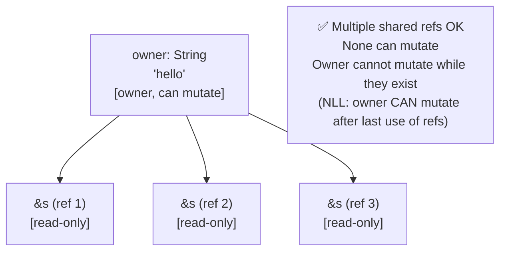
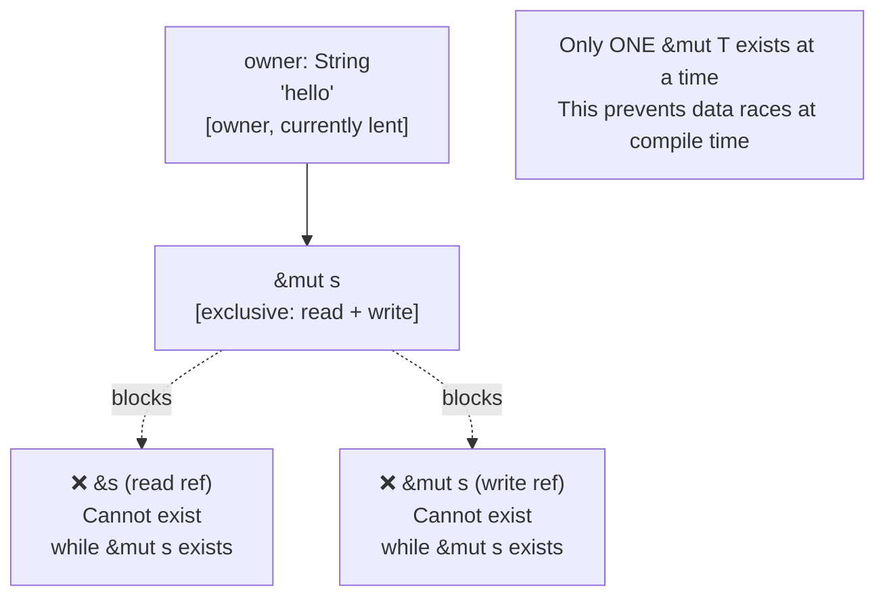

# Chapter 4: Borrowing and Aliasing 🟡

> **What you'll learn:**
> - The two types of borrows: shared (`&T`) and exclusive (`&mut T`) — and why they're mutually exclusive
> - The reader-writer lock model as a mental framework for the borrow checker
> - How multiple simultaneous borrows cause data races — and how Rust prevents them at compile time
> - The aliasing XOR mutability principle that underpins Rust's entire concurrency safety model

---

## 4.1 The Problem: Aliasing + Mutability = Danger

The borrow checker's rules are not arbitrary. They exist to prevent a specific class of bugs called **aliasing violations** — situations where two or more references to the same memory exist and at least one of them can mutate it.

Consider this C++ code:

```cpp
// C++: perfectly valid, perfectly dangerous
std::vector<int> v = {1, 2, 3};
int& first = v[0];    // alias 1: reference to v[0]
v.push_back(4);       // This may REALLOCATE v's internal buffer!
std::cout << first;   // alias 1 is now DANGLING — undefined behavior
```

The `push_back` call may reallocate the vector's internal buffer, invalidating `first`. This is a *use-after-free* through aliasing. The C++ compiler accepts this happily.

Rust's solution is the **aliasing XOR mutability** principle:

> **At any point in time, a value may have either:**
> - **Any number of shared (immutable) references** (`&T`), OR
> - **Exactly one exclusive (mutable) reference** (`&mut T`)
> - **But NEVER both simultaneously.**

---

## 4.2 Shared References: `&T`

A shared reference (`&T`) is a *read-only* borrow. You can have as many as you want simultaneously, because readers cannot interfere with each other.



```rust
fn main() {
    let s = String::from("hello");

    let r1 = &s; // shared reference
    let r2 = &s; // another shared reference — allowed!
    let r3 = &s; // and another — still allowed!

    // All three can read simultaneously
    println!("{} {} {}", r1, r2, r3); // ✅

    // ❌ FAILS: Cannot mutate s while shared references exist
    // s.push_str(" world"); // error[E0596]: cannot borrow `s` as mutable
                             // because it is also borrowed as immutable
}
```

**Shared references are `Copy`:** You can have as many copies of a `&T` reference as you like — each is just a copy of the pointer. They all point to the same data and all have read-only access.

---

## 4.3 Exclusive References: `&mut T`

A mutable (exclusive) reference (`&mut T`) grants *read-write* access. But the exclusivity constraint means: while a `&mut T` exists, **no other reference to the same data may exist** — not even another `&mut T`.



```rust
fn main() {
    let mut s = String::from("hello");

    let r1 = &mut s; // exclusive reference
    r1.push_str(" world");

    // ❌ FAILS: Cannot create a second &mut s while r1 exists
    // let r2 = &mut s; // error[E0499]: cannot borrow `s` as mutable more than once at a time

    // ❌ FAILS: Cannot create a &s while &mut s exists
    // let r3 = &s; // error[E0502]: cannot borrow `s` as immutable because it is also borrowed as mutable

    println!("{}", r1); // ✅
} // r1 drops here; s can be borrowed again
```

---

## 4.4 The Reader-Writer Lock Mental Model

The best mental model for Rust's borrow rules is a **compile-time reader-writer lock (RwLock)**:

| State | Read Lock Holders | Write Lock Holders | What Rust Enforces |
|---|---|---|---|
| No borrows | 0 | 0 | Owner can read or mutate freely |
| Shared borrows active | N (any number) | 0 | Reads only; no mutation by anyone |
| Exclusive borrow active | 0 | 1 (exactly) | One writer; no readers |

In a runtime `RwLock` (like `std::sync::RwLock`), these invariants are enforced with atomic operations at runtime, with possible panics or blocking if violated. Rust's borrow checker enforces the *same* invariants at compile time, with zero runtime cost.

```rust
use std::sync::RwLock;

// This is what RwLock does at RUNTIME:
let lock = RwLock::new(String::from("hello"));
{
    let r1 = lock.read().unwrap(); // acquire read lock
    let r2 = lock.read().unwrap(); // another read lock — allowed
    // lock.write().unwrap(); // ❌ would DEADLOCK — can't write while read locks held
} // read locks released

{
    let w = lock.write().unwrap(); // acquire write lock
    // lock.read().unwrap(); // ❌ would BLOCK — can't read while write lock held
} // write lock released

// Rust's borrow checker does this STATICALLY, with ZERO runtime overhead.
```

---

## 4.5 The Non-Lexical Lifetimes (NLL) Revolution

Pre-Rust-2018, borrows lasted until the *end of the lexical scope* (the `}` brace). This caused many false positives where the borrow checker rejected valid code. The 2018 edition introduced **Non-Lexical Lifetimes (NLL)**, where borrows last only until the *last use*.

```rust
let mut s = String::from("hello");

let r1 = &s;
let r2 = &s;
println!("{} and {}", r1, r2); // ← r1 and r2 are last used HERE (under NLL)
// r1 and r2 are "dead" after their last use, even though the scope hasn't ended

// ✅ This works under NLL (Rust 2018+):
let r3 = &mut s; // OK: r1 and r2 are no longer "live"
println!("{}", r3);

// ❌ This FAILS (r1 is still live because its last use is AFTER r3 is created):
// let r1 = &s;
// let r3 = &mut s; // error: cannot borrow `s` as mutable because it is also borrowed as immutable
// println!("{}", r1); // r1's last use is here — overlaps with r3
```

NLL is one of the most important practical improvements to the borrow checker. Understanding it prevents many "the borrow checker is rejecting valid code" frustrations.

---

## 4.6 Preventing Data Races at Compile Time

The aliasing XOR mutability principle doesn't just prevent memory bugs — it prevents **data races** in concurrent code. A data race occurs when:
1. Two threads access the same memory location
2. At least one access is a write
3. The accesses are not synchronized

Rust's borrow rules make data races *impossible to express in safe code*. A `&mut T` cannot be sent to two threads simultaneously because `&mut T` is not `Copy` (it's an exclusive reference). Shared references `&T` can be sent to multiple threads, but they are read-only, so no race is possible.

```rust
// The reason Arc<Mutex<T>> is the pattern for shared mutable state:
// - Arc provides shared *ownership* across threads (safe because it's atomic refcounting)
// - Mutex provides the *exclusive access* guarantee at runtime (for non-Send types)
// - &T is Sync (can be shared between threads) only when T: Sync
// - &mut T is Send (can be moved between threads) only when T: Send

use std::sync::{Arc, Mutex};
use std::thread;

let data = Arc::new(Mutex::new(vec![1, 2, 3]));

let data_clone = Arc::clone(&data);
let handle = thread::spawn(move || {
    let mut d = data_clone.lock().unwrap();
    d.push(4); // ✅ Exclusive runtime access via Mutex
});

handle.join().unwrap();
println!("{:?}", data.lock().unwrap()); // ✅ Prints [1, 2, 3, 4]
```

---

## 4.7 Borrow Checker Errors You'll See Most

```rust
// Error 1: Two mutable borrows
// ❌ FAILS: error[E0499]
let mut v = vec![1, 2, 3];
let a = &mut v;
let b = &mut v; // cannot borrow `v` as mutable more than once at a time
println!("{:?} {:?}", a, b);

// ✅ FIX: Don't overlap their uses
let mut v = vec![1, 2, 3];
{
    let a = &mut v;
    a.push(4);
} // a's borrow ends here
let b = &mut v; // ✅ Now fine
b.push(5);

// Error 2: Mutable borrow while immutable borrow exists
// ❌ FAILS: error[E0502]
let mut s = String::from("hello");
let r = &s;
s.push_str(" world"); // cannot borrow `s` as mutable because it is also borrowed as immutable
println!("{}", r);

// ✅ FIX: Ensure the immutable borrow's last use comes before the mutation
let mut s = String::from("hello");
let r = &s;
println!("{}", r); // r's last use — borrow ends here (NLL)
s.push_str(" world"); // ✅ No active borrows
```

---

<details>
<summary><strong>🏋️ Exercise: The Aliasing Detective</strong> (click to expand)</summary>

**Challenge:**

Each snippet below contains a borrow-checker violation. For each:
1. Identify the exact error (include the borrow checker error code if you know it)
2. Explain *why* it's a real bug (not just "the compiler rejected it")
3. Provide a fix

```rust
// Snippet A
fn first_last(v: &Vec<i32>) -> (&i32, &i32) {
    let first = &v[0];
    v.push(99); // ← problem
    let last = &v[v.len() - 1];
    (first, last)
}

// Snippet B
struct Counter { count: i32 }
impl Counter {
    fn increment_and_print(&mut self) {
        let r = &self.count; // ← borrow
        self.count += 1;     // ← mutation
        println!("{}", r);
    }
}

// Snippet C
fn main() {
    let mut data = vec![1, 2, 3];
    let first = &data[0];
    data.clear(); // ← problem
    println!("{}", first);
}
```

<details>
<summary>🔑 Solution</summary>

**Snippet A:**
```
error[E0596]: cannot borrow `*v` as mutable, as it is behind a `&` reference
```
- **Why it's a real bug:** `v.push(99)` might reallocate `v`'s buffer. `first` would then be a dangling pointer to the old (freed) buffer.
- **Fix:**
```rust
fn first_last(v: &Vec<i32>) -> (i32, i32) {
    // Return values, not references
    (*v.first().unwrap(), *v.last().unwrap())
}
// Or: remove the push from this function entirely
```

**Snippet B:**
```
error[E0506]: cannot assign to `self.count` because it is borrowed
```
- **Why it's a real bug:** `r` is a reference into `self.count`. If `self.count` were a `String`, mutation could reallocate it, making `r` dangle. Even for `i32`, the borrow rules are consistent regardless of whether the mutation *happens* to be safe.
- **Fix:**
```rust
fn increment_and_print(&mut self) {
    self.count += 1;        // mutate first
    println!("{}", self.count); // read after mutation
}
```

**Snippet C:**
```
error[E0502]: cannot borrow `data` as mutable because it is also borrowed as immutable
```
- **Why it's a real bug:** `data.clear()` deallocates and resets the internal buffer. `first` is a reference into that buffer — after `clear()`, `first` is a dangling pointer.
- **Fix:**
```rust
fn main() {
    let mut data = vec![1, 2, 3];
    let value = data[0]; // Copy the value (i32 is Copy) instead of borrowing
    data.clear();
    println!("{}", value); // ✅ value is independent of data's buffer
}
```

</details>
</details>

---

> **Key Takeaways**
> - Shared references (`&T`): many simultaneous, read-only; mutually exclusive with `&mut T`
> - Exclusive references (`&mut T`): exactly one at a time, read-write; mutually exclusive with all other borrows
> - The borrow checker is a compile-time reader-writer lock — it enforces the same invariants as `RwLock`, for free
> - Non-Lexical Lifetimes (NLL) means borrows end at their *last use*, not at the closing `}` — this greatly reduces false positives
> - Aliasing XOR mutability prevents data races at compile time, not via runtime locks

> **See also:**
> - [Chapter 5: Lifetime Syntax Demystified](ch05-lifetime-syntax-demystified.md) — proving to the compiler that borrows don't outlive their owners
> - [Chapter 8: Interior Mutability](ch08-interior-mutability.md) — the escape hatch when compile-time exclusivity is too restrictive
> - [Chapter 10: Common Borrow Checker Pitfalls](ch10-common-pitfalls.md) — the 9 most common errors and production patterns to fix them
