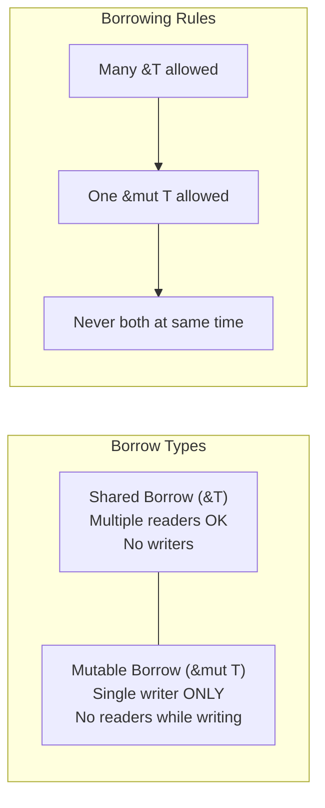
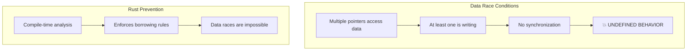

# Chapter 4: Borrowing and Aliasing 🟡

> **What you'll learn:**
> - The difference between `&T` (shared/reading) and `&mut T` (exclusive/write access)
> - The Reader-Writer lock mental model for understanding borrowing
> - Why aliasing + mutation = data races (and how Rust prevents this at compile time)
> - How to use borrowing to share data without transferring ownership

---

## The Third Rule of Ownership

We've established two rules:
1. Each value has exactly one owner
2. When the owner goes out of scope, the value is dropped

The third rule (technically part of borrowing) is:
3. **There can be EITHER one mutable reference OR multiple immutable references, but NOT both simultaneously.**

This rule is what makes Rust's borrow checker so powerful—and sometimes so frustrating. Let's understand why it exists.

## What Is Borrowing?

Borrowing is creating a reference to a value without taking ownership. It's like handing someone your car keys (borrowing) versus selling them your car (ownership transfer).

```rust
fn main() {
    let s = String::from("hello");
    
    // Borrow s - don't take ownership
    let r = &s;
    
    println!("{}", r); // r is a reference to s
    
    // s is still the owner - it will be dropped at end of scope
    println!("{}", s);
}
```

### Two Types of References

```rust
fn main() {
    let mut s = String::from("hello");
    
    // Immutable borrow - can read, cannot modify
    let r1 = &s;
    
    // Mutable borrow - can read AND modify
    let r2 = &mut s;
    
    // Or for short:
    // let r2 = &mut s;
}
```

| Reference Type | Symbol | Can Read? | Can Write? | Aliases Allowed? |
|----------------|--------|-----------|------------|------------------|
| Shared/Immutable | `&T` | Yes | No | Many (`&T`, `&T`, `&T`...) |
| Mutable | `&mut T` | Yes | Yes | Only ONE (`&mut T`) |

## The Reader-Writer Lock Mental Model

The best mental model for understanding borrowing is a **reader-writer lock**:



### Shared Borrow: Many Readers

```rust
fn main() {
    let s = String::from("hello");
    
    // Multiple immutable borrows - OK!
    let r1 = &s;
    let r2 = &s;
    let r3 = &s;
    
    println!("{} {} {}", r1, r2, r3);
    
    // Can also borrow from borrows
    let r4 = &r1;
    println!("{}", r4);
}
```

This is like multiple people reading a book at the same time. No problem!

### Mutable Borrow: Exclusive Access

```rust
fn main() {
    let mut s = String::from("hello");
    
    // Only ONE mutable borrow allowed!
    let r = &mut s;
    
    r.push_str(" world");
    println!("{}", r);
    
    // Cannot create another borrow while r is alive
    // let r2 = &s; // ❌ FAILS: cannot borrow while mutable borrow exists
}
```

This is like giving someone exclusive write access to a document. You can't have anyone else reading or writing at the same time.

### Why The Rule Exists: Data Races

The rule exists to prevent **data races** at compile time. A data race occurs when:

1. Two or more pointers access the same data simultaneously
2. At least one of them is writing
3. There's no synchronization

This is a **fundamental problem** in concurrent programming:

```cpp
// C++: DATA RACE - undefined behavior!
std::vector<int> v;

void writer() {
    for (int i = 0; i < 1000; i++)
        v.push_back(i); // Writing
}

void reader() {
    for (int i = 0; i < 1000; i++)
        v[i]; // Reading while writer might be modifying!
}

// If these run on different threads, BOOM!
```

Rust prevents data races at compile time by enforcing the borrowing rules:

```rust
// Rust: This won't compile - the borrow checker catches it!
fn main() {
    let mut v = vec![1, 2, 3];
    
    let r1 = &v;      // Immutable borrow
    let r2 = &mut v;  // ❌ FAILS: cannot borrow as mutable while immutable borrow exists
    
    println!("{:?} {:?}", r1, r2);
}
```



## Borrowing Without Moving

One of the most common uses of borrowing is to use a value without taking ownership:

```rust
fn main() {
    let s = String::from("hello");
    
    // Pass by reference - s is borrowed, not moved
    print_length(&s);
    
    // s is still valid here!
    println!("{}", s);
}

fn print_length(s: &String) {
    println!("{}", s.len());
}
```

This is fundamentally different from C++:

```cpp
// C++: either copy (expensive) or use pointers/references (complex)
void print_length(const std::string& s) {
    std::cout << s.length() << std::endl;
}

// Caller:
std::string s = "hello";
print_length(s); // No copy, just reference
```

In Rust, references are the *default* way to pass data to functions when you don't want to transfer ownership.

## Borrowing in Data Structures

You can borrow fields from structs:

```rust
struct Person {
    name: String,
    age: u32,
}

fn main() {
    let person = Person {
        name: String::from("Alice"),
        age: 30,
    };
    
    // Borrow fields
    let name: &String = &person.name;
    let age: &u32 = &person.age;
    
    println!("{} is {}", name, age);
    
    // person is still valid!
}
```

### Borrowing and Mutation

```rust
fn main() {
    let mut s = String::from("hello");
    
    // Borrow mutably - can modify through the reference
    let r = &mut s;
    r.push_str(" world");
    
    // Or more explicitly:
    // (*r).push_str(" world"); // Dereference and modify
    
    println!("{}", r);
    
    // s is now "hello world"
}
```

```rust
fn main() {
    let mut s = String::from("hello");
    
    modify(&mut s); // Borrow mutably
    
    println!("{}", s); // "HELLO"
}

fn modify(s: &mut String) {
    s.make_ascii_uppercase();
}
```

## Common Borrowing Patterns

### Pattern 1: Read-Then-Write

A common issue: you want to read a value, then modify it:

```rust
fn main() {
    let mut s = String::from("hello");
    
    // ❌ FAILS: cannot borrow as mutable while immutable borrow exists
    // let r = &s;
    // let m = &mut s;
    // println!("{} {}", r, m);
}
```

Solution: restructure your code to avoid holding the immutable borrow while creating a mutable one:

```rust
fn main() {
    let mut s = String::from("hello");
    
    // Read first
    let len = s.len();
    
    // Then write
    s.push_str(" world");
    
    println!("{} chars + new text", len);
}
```

### Pattern 2: Borrow from Borrowed Data

```rust
fn main() {
    let s = String::from("hello");
    
    // Borrow from borrowed data
    let r: &str = &s[..3]; // "hel"
    println!("{}", r);
}
```

### Pattern 3: Struct Methods That Borrow

```rust
struct Counter {
    count: u32,
}

impl Counter {
    // Immutable borrow - read-only method
    fn get(&self) -> u32 {
        self.count
    }
    
    // Mutable borrow - modifying method
    fn increment(&mut self) {
        self.count += 1;
    }
}

fn main() {
    let mut counter = Counter { count: 0 };
    
    counter.increment();
    counter.increment();
    
    println!("{}", counter.get()); // 2
}
```

<details>
<summary><strong>🏋️ Exercise: Borrowing Practice</strong> (click to expand)</summary>

**Challenge:** Fix the borrow checker errors in this code:

```rust
fn main() {
    let mut data = vec![1, 2, 3, 4, 5];
    
    // Get first element
    let first = &data[0];
    
    // Try to modify the vector
    data.push(6);
    
    println!("First element: {}", first);
}
```

**Why does this fail?**
The immutable borrow (`first = &data[0]`) exists while we try to push to the vector. The push might reallocate the heap memory, invalidating the reference!

<details>
<summary>🔑 Solution</summary>

**The Problem:**
When you push to a Vec, it might need to reallocate (grow) its internal buffer. If that happens, any existing references become invalid (dangling pointers). Rust prevents this at compile time.

**Solution 1: Read the value, then modify**
```rust
fn main() {
    let mut data = vec![1, 2, 3, 4, 5];
    
    // Read the value first
    let first_value = data[0];
    
    // Now we can modify
    data.push(6);
    
    println!("First element: {}", first_value);
}
```

**Solution 2: Modify, then read**
```rust
fn main() {
    let mut data = vec![1, 2, 3, 4, 5];
    
    data.push(6);
    
    // Now safe to borrow
    let first = &data[0];
    println!("First element: {}", first);
}
```

**Solution 3: Use indices instead of references**
```rust
fn main() {
    let mut data = vec![1, 2, 3, 4, 5];
    
    // Use index instead of reference
    let idx = 0;
    data.push(6);
    
    println!("First element: {}", data[idx]);
}
```

The key insight: Rust's borrow checker is protecting you from a real bug (use-after-reallocation) that would cause undefined behavior in C++.

</details>
</details>

> **Key Takeaways:**
> - `&T` (shared reference) allows multiple readers - you can have many immutable references
> - `&mut T` (mutable reference) allows exclusive write access - only one mutable reference at a time
> - You cannot have both immutable and mutable references simultaneously
> - This rule prevents data races at compile time
> - Use borrowing when you want to access data without taking ownership

> **See also:**
> - [Chapter 3: The Rules of Ownership](./ch03-the-rules-of-ownership.md) - The first two ownership rules
> - [Chapter 5: Lifetime Syntax Demystified](./ch05-lifetime-syntax-demystified.md) - Understanding lifetime annotations
