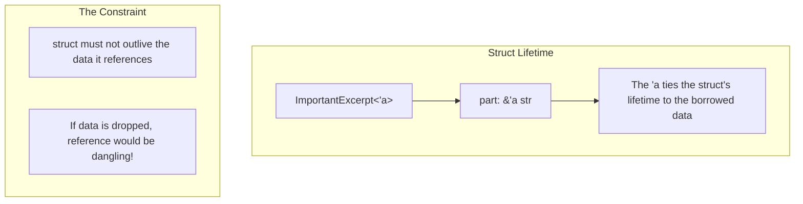
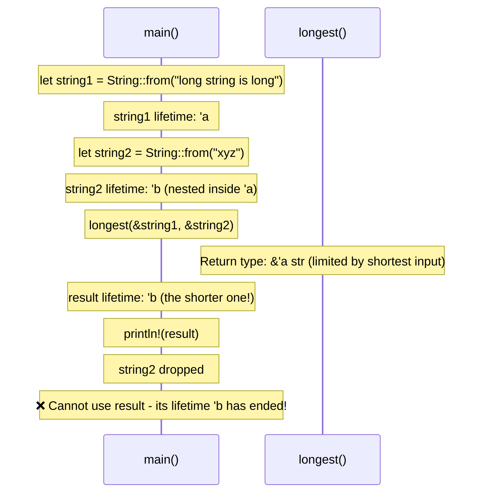

# Chapter 5: Lifetime Syntax Demystified 🟡

> **What you'll learn:**
> - What `'a` actually means (and what it doesn't mean)
> - The crucial insight: lifetimes don't keep values alive, they *prove* values are alive
> - Lifetime elision rules - when you can omit lifetime annotations
> - How to read and write lifetime annotations correctly

---

## The Big Misconception

**Lifetimes do NOT keep values alive.**

This is the most important thing to understand. A lifetime annotation like `'a` doesn't tell Rust "keep this data alive." Instead, it tells the compiler: "This reference is guaranteed to be valid for this scope."

Let me say that again, because it's counter-intuitive:

> **A lifetime is a way of expressing a constraint, not a mechanism for controlling memory.**

The compiler already knows when variables go out of scope. What lifetimes do is let you *express* relationships between scopes so the compiler can verify that your references are valid.

## What Are Lifetimes?

A lifetime is a **scope** - a period of time during which a reference is valid. When you write `&'a str`, you're saying: "This is a reference that will be valid for at least the scope named `'a`."

```rust
fn main() {
    let x = 5;              // x comes into scope
                           // 'a starts here
    
    let r = &x;             // r borrows x
    println!("{}", r);      // r is used
    
                           // 'a ends here
}                          // x goes out of scope
```

```mermaid
flowchart TB
    subgraph Lifetime["Lifetime 'a"]
        direction TB
        L1["let x = 5;" --> "'a starts"]
        L2["let r = &x;"]
        L3["println!(r);"]
        L4["'a ends"]
    end
    
    subgraph Key["The Key Insight"]
        K1["Lifetime 'a = scope during which x is valid"]
        K2["Reference r can only be used within 'a"]
        K3["Compiler checks: r's lifetime fits within x's lifetime"]
    end
```

## Lifetime Annotations in Functions

When you have multiple references in a function, you sometimes need lifetime annotations to express their relationships:

```rust
// Without lifetimes - Rust can't figure it out
// fn longest(x: &str, y: &str) -> &str {
//     if x.len() > y.len() { x } else { y }
// }

fn longest<'a>(x: &'a str, y: &'a str) -> &'a str {
    // The 'a says: the return value will be valid
    // for as long as BOTH x and y are valid
    if x.len() > y.len() { x } else { y }
}
```

### What This Actually Means

```rust
fn longest<'a>(x: &'a str, y: &'a str) -> &'a str
```

Read this as: "There exists some lifetime `'a` such that:
- `x` is a reference valid for `'a`
- `y` is a reference valid for `'a`
- The return value is a reference valid for `'a`"

The compiler will find the smallest `'a` that satisfies all these constraints.

## Lifetime Elision Rules

In practice, you don't write lifetime annotations most of the time. Rust has **lifetime elision rules** that allow the compiler to infer them:

### Rule 1: Each reference parameter gets its own lifetime

```rust
// These are equivalent:
fn foo(x: &str, y: &str) {}
fn foo<'a, 'b>(x: &'a str, y: &'b str) {}
```

### Rule 2: If there's exactly one input lifetime, it's assigned to all output lifetimes

```rust
// These are equivalent:
fn foo(x: &str) -> &str {}
fn foo<'a>(x: &'a str) -> &'a str {}
```

### Rule 3: If there's a `&self` or `&mut self` parameter, its lifetime is assigned to all output lifetimes

```rust
// These are equivalent:
impl String {
    fn as_str(&self) -> &str {}
    fn as_str<'a>(&'a self) -> &'a str {}
}
```

### When You Actually Need Annotations

You need explicit lifetimes when:
1. Multiple references with different lifetimes are returned
2. The relationship between input and output lifetimes isn't clear
3. You're defining structs with references

```rust
// Need explicit annotation: return could come from either input
fn longest<'a>(x: &'a str, y: &'a str) -> &'a str

// Need explicit annotation: multiple different lifetimes
fn first<'a, 'b>(x: &'a str, y: &'b str) -> &'a str // Only x's lifetime matters for return
```

## Lifetime in Structs

When a struct holds a reference, you MUST specify a lifetime:

```rust
// ❌ FAILS: need lifetime annotation
// struct ImportantExcerpt {
//     part: &str,
// }

// ✅ FIX: add lifetime
struct ImportantExcerpt<'a> {
    part: &'a str, // This reference must outlive the struct
}

fn main() {
    let novel = String::from("Call me Ishmael. Some years ago...");
    let first_sentence = novel.split('.').next().unwrap();
    
    let excerpt = ImportantExcerpt {
        part: first_sentence,
    };
    
    println!("{}", excerpt.part);
}
```



## The Static Lifetime

The special lifetime `'static` means the data lives for the entire program:

```rust
// String literals are stored in the binary - they live forever!
let s: &'static str = "hello"; // This reference lives forever

// This is different from:
let s = String::from("hello"); // This will be dropped!
let r = &s; // r is NOT 'static
```

`'static` is often misunderstood. We'll cover this in depth in Chapter 11.

## Visualizing Lifetime Relationships

Let's trace through a concrete example:

```rust
fn main() {
    let string1 = String::from("long string is long");
    
    {
        let string2 = String::from("xyz");
        let result = longest(&string1, &string2);
        println!("The longest is: {}", result);
    } // string2 goes out of scope here
    
    // result's lifetime is tied to string2, so it's invalid here!
    // println!("{}", result); // ❌ FAILS
}
```



## Reading Lifetime Annotations

Here's a guide for reading lifetime syntax:

| Syntax | Reading |
|--------|---------|
| `&'a str` | "Reference to string slice with lifetime 'a" |
| `&'a mut T` | "Mutable reference to T with lifetime 'a" |
| `fn foo<'a>(x: &'a str)` | "Function foo with lifetime parameter 'a" |
| `struct Foo<'a>` | "Struct Foo parameterized by lifetime 'a" |
| `T: 'a` | "Type T must live at least as long as 'a" |
| `&'static str` | "Reference with static (program-long) lifetime" |

<details>
<summary><strong>🏋️ Exercise: Lifetime Annotations</strong> (click to expand)</summary>

**Challenge:** Add appropriate lifetime annotations to these functions:

```rust
// 1. This function returns the longer of two string slices
fn longest(x: &str, y: &str) -> &str {
    if x.len() > y.len() { x } else { y }
}

// 2. This struct holds a reference to a string
struct Config {
    name: &str,
    value: &str,
}
```

<details>
<summary>🔑 Solution</summary>

**1. Function with lifetime:**
```rust
// The 'a lifetime parameter connects inputs to output
fn longest<'a>(x: &'a str, y: &'a str) -> &'a str {
    if x.len() > y.len() { x } else { y }
}
```

**2. Struct with lifetime:**
```rust
struct Config<'a> {
    name: &'a str,
    value: &'a str,
}

// Usage:
fn main() {
    let name = String::from("timeout");
    let config = Config {
        // Note: must use references, not owned strings
        // (unless we add lifetime bounds on String)
        name: &name,
        value: &name,
    };
}
```

Key insight: The lifetime on the struct (`'a`) tells the compiler that the references inside the struct are valid for at least as long as the struct itself.

</details>
</details>

> **Key Takeaways:**
> - Lifetimes don't keep values alive; they *prove* that references are valid
> - Lifetime annotations express relationships between scopes
> - Most of the time, lifetimes are inferred (lifetime elision)
> - Explicit lifetimes are needed when the relationship isn't clear or when storing references in structs
> - `'static` means the data lives for the entire program

> **See also:**
> - [Chapter 4: Borrowing and Aliasing](./ch04-borrowing-and-aliasing.md) - The borrowing rules
> - [Chapter 6: Struct Lifetimes and Self-Referential Nightmares](./ch06-struct-lifetimes-and-self-referential-nightmares.md) - Advanced lifetime patterns
> - [Chapter 11: The 'static Bound vs. 'static Lifetime](./ch11-the-static-bound-vs-static-lifetime.md) - Deep dive on 'static
