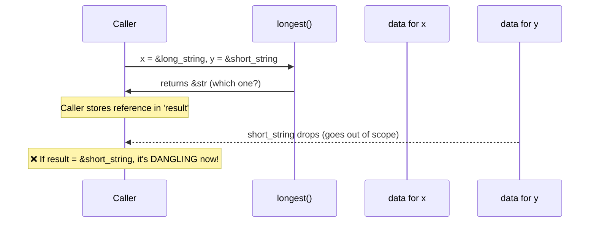
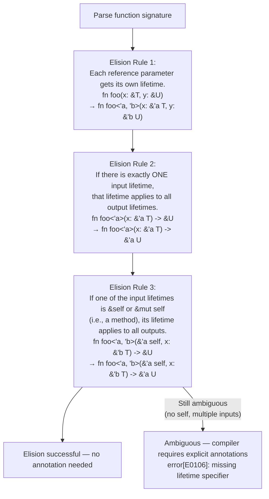

# Chapter 5: Lifetime Syntax Demystified 🟡

> **What you'll learn:**
> - What lifetime annotations *actually mean* — and what they do NOT mean
> - Why lifetime parameters are about *relationships between borrows*, not about duration
> - The three lifetime elision rules that let you omit annotations in 90% of cases
> - How to read and write `'a` annotations confidently, including the critical misconception that `'a` "makes things live longer"

---

## 5.1 The Central Misconception: Lifetimes Are Not Timers

The single biggest source of confusion about lifetime syntax is believing that writing `'a` *extends* how long a value is alive, or *causes* a value to stay in memory. This is completely wrong.

> **Lifetime annotations are constraints on relationships. They prove to the compiler that a reference will not outlive the data it points to. They do not extend the data's lifetime by a single nanosecond.**

Think of them as **contracts**. When you write `fn foo<'a>(x: &'a str) -> &'a str`, you are telling the compiler: "The string slice I return will not live longer than the string slice I received. I promise."

The compiler uses this contract to verify that all call sites uphold it.

---

## 5.2 Why Lifetime Annotations Exist: The Dangling Reference Problem



Here is the exact scenario that requires lifetime annotations:

```rust
// ❌ FAILS: error[E0106]: missing lifetime specifier
fn longest(x: &str, y: &str) -> &str {
    if x.len() > y.len() { x } else { y }
}
// The compiler doesn't know if the returned &str lives as long as x, y, or neither.
// It CANNOT verify callers won't use the returned reference after x or y drops.
```

The compiler raises this error because it cannot determine from the function signature alone:
- Which argument the result "comes from" (and thus must not outlive)
- Whether the result is valid after the caller drops either argument

Adding a lifetime annotation resolves this:

```rust
// ✅ FIX: lifetime annotation tells the compiler the return value lives as long
//         as the SHORTER of x and y (the caller's usage is constrained)
fn longest<'a>(x: &'a str, y: &'a str) -> &'a str {
    if x.len() > y.len() { x } else { y }
}
```

What `'a` means here: "There exists some concrete lifetime `'a`. The function takes two string slices that are both valid for at least `'a`, and returns a string slice that is valid for at most `'a`."

At the call site, the compiler infers `'a` as the *overlap* (intersection) of the lifetimes of the two arguments:

```rust
fn main() {
    let string1 = String::from("long string is long");
    let result;
    {
        let string2 = String::from("xyz");
        result = longest(string1.as_str(), string2.as_str());
        println!("Longest: {}", result); // ✅ result used before string2 drops
    } // string2 drops here
    // ❌ result cannot be used here — it might refer to string2 (which is dropped)
    // println!("Longest: {}", result); // error[E0597]: `string2` does not live long enough
}
```

---

## 5.3 Visualizing Lifetimes as Scopes

The most concrete way to think about lifetimes is as **named scopes**:

```mermaid
gantt
    title Lifetime Scopes (time flows downward)
    dateFormat X
    axisFormat %s

    section string1
    string1 valid ('a start) : 0, 10

    section string2
    string2 valid : 3, 7

    section 'a (overlap)
    Lifetime 'a = overlap : 3, 7

    section result
    result can only be used in 'a : 3, 7
```



```rust
fn main() {
    let string1 = String::from("long string");  // 'a starts here (if 'a = string1's life)
    {
        let string2 = String::from("xyz");       // 'b starts here
        let result = longest(&string1, &string2);
        // 'a (as the compiler resolves it) = min(string1's lifetime, string2's lifetime)
        //                                  = string2's lifetime (shorter)
        println!("{}", result); // ✅ used inside 'b
    } // 'b ends — string2 drops — result is no longer valid
      // (compiler enforces this based on the 'a annotation)
}
```

---

## 5.4 Reading Lifetime Syntax

```rust
// A function with one lifetime parameter:
fn first_word<'a>(s: &'a str) -> &'a str {
//            ^^   ^^            ^^
//            |    |             |
//            |    |             return type lives at most 'a
//            |    input lives at least 'a
//            declare 'a as a lifetime parameter (like a generic type param)
    let bytes = s.as_bytes();
    for (i, &byte) in bytes.iter().enumerate() {
        if byte == b' ' {
            return &s[0..i];
        }
    }
    &s[..]
}

// A struct holding a reference:
struct Important<'a> {
//               ^^
//               The struct cannot outlive the reference it holds
    content: &'a str,
}

// A method on a struct with lifetime:
impl<'a> Important<'a> {
    fn announce(&self, announcement: &str) -> &str {
        // elided: returns a slice that lives as long as &self
        println!("Announcing: {}", announcement);
        self.content
    }
}

// Multiple lifetime parameters:
fn complex<'a, 'b>(x: &'a str, y: &'b str) -> &'a str {
//                  ^^  ^^      ^^  ^^         ^^
// Two independent lifetime parameters.
// Return lives at most 'a (comes from x, not y).
// y's lifetime ('b) is independent — we don't promise anything about it.
    x
}
```

---

## 5.5 Lifetime Elision Rules

In the vast majority of functions, you do not need to write lifetime annotations explicitly. The compiler applies three **lifetime elision rules** in order:



**In practice:**

```rust
// No annotation needed — Rule 1 + Rule 2 apply
fn first_word(s: &str) -> &str {
    // Elided: fn first_word<'a>(s: &'a str) -> &'a str
    &s[..s.find(' ').unwrap_or(s.len())]
}

// No annotation needed — Rule 1 + Rule 3 apply (method with &self)
struct Buffer { data: Vec<u8> }
impl Buffer {
    fn get_slice(&self) -> &[u8] {
        // Elided: fn get_slice<'a>(&'a self) -> &'a [u8]
        &self.data
    }
}

// Annotation REQUIRED — two input references, ambiguous output
fn longer(a: &str, b: &str) -> &str { // ❌ error[E0106]
    if a.len() > b.len() { a } else { b }
}
// Must be:
fn longer<'a>(a: &'a str, b: &'a str) -> &'a str { // ✅
    if a.len() > b.len() { a } else { b }
}
```

**When do you need explicit annotations?**
1. Functions with multiple reference inputs where the output could come from any of them
2. Structs that hold references
3. `impl` blocks on structs that hold references

---

## 5.6 Common Patterns: Lifetime Annotations in Practice

```rust
// Pattern 1: Return a reference to one specific argument
// Use a single 'a for both input and output
fn get_first<'a>(items: &'a [String]) -> &'a String {
    &items[0]
}

// Pattern 2: Function takes references with unrelated lifetimes
// Use separate parameters ('a, 'b) when the output doesn't depend on one of them
fn print_and_return<'a, 'b>(to_return: &'a String, to_print: &'b String) -> &'a String {
    println!("{}", to_print);
    to_return // output lifetime tied to 'a, not 'b
}

// Pattern 3: Lifetime bounds — 'b must outlive 'a
fn inner<'a, 'b: 'a>(outer: &'a str, _inner: &'b str) -> &'a str {
//               ^^^
//               'b: 'a means "'b outlives 'a"
//               This would be needed if inner were stored somewhere that lives 'a
    outer
}

// Pattern 4: Higher-ranked trait bounds (HRTB) — for when the lifetime is in a closure/trait
fn apply<F>(f: F) where F: for<'a> Fn(&'a str) -> &'a str {
//                          ^^^^^^^^
//                          "for any lifetime 'a, F maps &'a str to &'a str"
    let s = String::from("hi");
    println!("{}", f(&s));
}
```

---

<details>
<summary><strong>🏋️ Exercise: Annotating Ambiguous Functions</strong> (click to expand)</summary>

**Challenge:**

Add lifetime annotations to make each function compile. Then explain what the annotations mean in plain English.

```rust
// Function 1: Returns a reference to the first non-empty string slice
fn first_nonempty(a: &str, b: &str) -> &str {
    if !a.is_empty() { a } else { b }
}

// Function 2: Finds a word in a document, returns a reference into the document
fn find_word<'a>(document: &str, word: &str) -> Option<&str> {
    document.find(word).map(|i| &document[i..i + word.len()])
}

// Function 3: A struct that pairs a &str key with a &str value
// (both potentially from different sources)
struct Pair {
    key: &str,
    value: &str,
}

// Function 4: Returns the shorter of two string slices
fn shorter(x: &str, y: &str) -> &str {
    if x.len() < y.len() { x } else { y }
}
```

<details>
<summary>🔑 Solution</summary>

```rust
// Function 1: Both a and b could be returned, so the output lives at most
//             as long as the shorter of a and b. Use a single 'a.
fn first_nonempty<'a>(a: &'a str, b: &'a str) -> &'a str {
    if !a.is_empty() { a } else { b }
}
// Plain English: "The returned slice lives at most as long as the shorter
//                 of a and b."

// Function 2: The returned slice comes from `document`, not `word`.
//             So the output lifetime is tied to `document`, not `word`.
fn find_word<'a>(document: &'a str, word: &str) -> Option<&'a str> {
    document.find(word).map(|i| &document[i..i + word.len()])
}
// Plain English: "The returned slice (if any) points into `document`
//                 and is valid for as long as `document` is."
//                `word` can have any independent lifetime.

// Function 3: Two independent reference lifetimes — they may come from
//             different sources with different lifetimes.
struct Pair<'k, 'v> {
    key: &'k str,
    value: &'v str,
}
// OR if they're always from the same source:
struct PairSame<'a> {
    key: &'a str,
    value: &'a str,
}
// Plain English: "A Pair cannot outlive either its key source or its value source."

// Function 4: Same as Function 1 — either could be returned.
fn shorter<'a>(x: &'a str, y: &'a str) -> &'a str {
    if x.len() < y.len() { x } else { y }
}
// Plain English: "The returned slice is valid for as long as both x and y are."
```

</details>
</details>

---

> **Key Takeaways**
> - Lifetime annotations are **relationship constraints**, not timers. They prove liveness, they don't extend it.
> - `'a` in a function signature means: "I assert that the return reference will not outlive the inputs it came from"
> - The three elision rules cover 90% of functions — only write annotations when the compiler says it's ambiguous
> - A common mistake: thinking `'static` means "global" — it means the reference is valid for the *entire program duration*; it does not mean the data is in static memory (see Chapter 11)
> - Multiple lifetime parameters (`'a, 'b`) are needed when output and input lifetimes are independent

> **See also:**
> - [Chapter 6: Struct Lifetimes](ch06-struct-lifetimes.md) — applying lifetime annotations to structs and methods
> - [Chapter 11: The `'static` Bound vs. `'static` Lifetime](ch11-static-lifetime.md) — the most misunderstood lifetime
