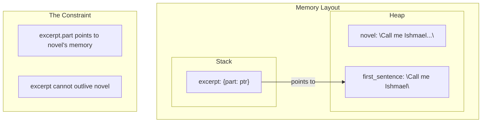
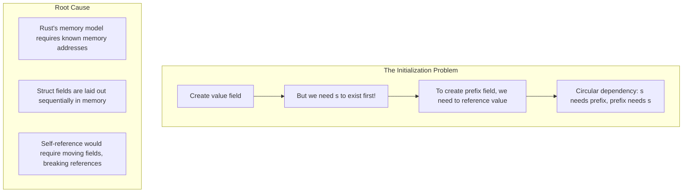

# Chapter 6: Struct Lifetimes and Self-Referential Nightmares 🔴

> **What you'll learn:**
> - How to properly store references in structs
> - Why self-referential structs are fundamentally at odds with Rust's memory model
> - The Pin and Unpin traits and why they matter
> - Practical workarounds for self-referential structs

---

## Storing References in Structs

When you store a reference inside a struct, you're telling the compiler: "This struct borrows data from somewhere else." This requires a lifetime annotation.

```rust
// ✅ Valid: struct stores a reference
struct ImportantExcerpt<'a> {
    part: &'a str,
}

fn main() {
    let novel = String::from("Call me Ishmael. Some years ago...");
    let first_sentence = novel.split('.').next().unwrap();
    
    let excerpt = ImportantExcerpt {
        part: first_sentence,
    };
    
    println!("{}", excerpt.part);
}
```

The lifetime `'a` ensures that the struct cannot outlive the data it references.



## The Self-Referential Nightmare

Here's where things get tricky. What if you want a struct that contains a reference to its own field?

```rust
// ❌ This doesn't work in Rust!
struct SelfRef {
    value: String,
    // We want: a reference to value!
    // prefix: &str, // ERROR: field has incomplete type
}
```

Why doesn't this work? Let's trace through what would need to happen:

```rust
struct SelfRef<'a> {
    value: String,
    prefix: &'a str,
}

fn main() {
    let s = SelfRef {
        value: String::from("hello"),
        prefix: &s.value[0..2], // ❌ Can't do this!
    };
}
```

The problem: **`s` needs to be initialized before we can take a reference to `s.value`, but we can't create `s` until we have the `prefix` field.**



### Why This Fundamentally Doesn't Work

In Rust, struct fields have fixed offsets in memory. When you move a struct, all its fields move together. But if a field points to another field, moving the struct would make the pointer invalid:

```rust
struct BrokenExample {
    data: String,
    slice: &str, // Points to data!
}

fn main() {
    let x = BrokenExample {
        data: String::from("hello"),
        slice: &x.data[0..2], // Can't even write this
    };
    
    // Even if we could create it:
    let y = x; // Move the struct
    // Now y.slice is pointing to x's memory! Dangling pointer!
}
```

```mermaid
flowchart TB
    subgraph MoveProblem["What Happens on Move"]
        direction LR
        M1["Original: {data: \"hello\", slice: &data[0..2]}"] --> M2["After move: {data: \"hello\", slice: &OLD_data[0..2]!]}"]
    end
    
    subgraph RustPhilosophy["Rust's Philosophy"]
        P1["Ownership: each value has exactly one owner"]
        P2["Move semantics: when moved, old value is invalidated"]
        P3["Self-reference violates both principles"]
    end
```

## Solutions for Self-Referential Structs

Since self-referential structs don't work directly, here are the common workarounds:

### Solution 1: Indices Instead of References

Instead of storing references, store indices or offsets:

```rust
struct WordFinder {
    text: String,
    word_start: usize,
    word_len: usize,
}

impl WordFinder {
    fn new(text: &str) -> Self {
        let word = "hello";
        let start = text.find(word).unwrap();
        
        WordFinder {
            text: text.to_string(),
            word_start: start,
            word_len: word.len(),
        }
    }
    
    fn get_word(&self) -> &str {
        &self.text[self.word_start..self.word_start + self.word_len]
    }
}

fn main() {
    let finder = WordFinder::new("Say hello to Rust!");
    println!("{}", finder.get_word()); // "hello"
}
```

### Solution 2: Use Indices with a Struct

Store the owned data and use indices:

```rust
struct TextExcerpt {
    text: String,                    // Owned string
    start: usize,                    // Index where excerpt starts
    end: usize,                      // Index where excerpt ends
}

impl TextExcerpt {
    fn new(text: &str) -> Self {
        let first_sentence = text.split('.').next().unwrap();
        let start = text.find(first_sentence).unwrap();
        let end = start + first_sentence.len();
        
        TextExcerpt {
            text: text.to_string(),
            start,
            end,
        }
    }
    
    fn excerpt(&self) -> &str {
        &self.text[self.start..self.end]
    }
}

fn main() {
    let novel = String::from("Call me Ishmael. Some years ago...");
    let excerpt = TextExcerpt::new(&novel);
    println!("{}", excerpt.excerpt());
}
```

### Solution 3: Use the `ouroboros` or `self_cell` Crate

There are crates that provide self-referential structs:

```rust
// Using ouroboros (external crate)
#[ouroboros::self_referencing]
struct MyStruct {
    value: String,
    #[borrows(value)]
    #[covariant]
    prefix: &'this str,
}

fn main() {
    let s = MyStruct::new(String::from("hello"), |value| {
        &value[0..2]
    });
    
    println!("{}", s.borrow_prefix()); // "he"
}
```

We'll discuss `ouroboros` and similar crates in the production patterns section.

### Solution 4: Avoid Self-Reference Entirely

Often, the best solution is to rethink your design:

```rust
// Instead of self-reference, use methods
struct Parser {
    input: String,
}

impl Parser {
    fn prefix(&self) -> &str {
        &self.input[0..2]
    }
}

// Or use separate structures
struct Prefix {
    value: String,
}

struct Container {
    prefix: Prefix,
    full: String,
}
```

## The Pin and Unpin Traits

For async programming and self-referential scenarios, you might encounter `Pin`:

```rust
// Pin<T> ensures that the pointer's memory cannot be moved
// This is crucial for async/await and self-referential structures

use std::pin::Pin;
use std::marker::PhantomPinned;

struct Unmovable {
    data: String,
    _marker: PhantomPinned, // This type is !Unpin
}

fn pinned_example() {
    let mut unmovable = Unmovable {
        data: String::from("hello"),
        _marker: PhantomPinned,
    };
    
    // Pin it to the heap
    let mut pinned = Box::pin(unmovable);
    
    // pinned cannot be moved after this
    // This allows safe self-references in async contexts
}
```

You don't need to understand `Pin` for basic Rust, but it's important when:
- Working with async/await ( futures use Pin)
- Implementing self-referential structs
- Working with futures that capture local variables

<details>
<summary><strong>🏋️ Exercise: Fix the Broken Self-Reference</strong> (click to expand)</summary>

**Challenge:** Fix this attempt at a self-referential struct by using indices:

```rust
// ❌ This won't compile - can you fix it?
struct Person {
    name: String,
    // We want first_name to be a reference to the first part of name
    // first_name: &str,
}

fn main() {
    let person = Person {
        name: String::from("John Doe"),
        // first_name: ???,
    };
}
```

<details>
<summary>🔑 Solution</summary>

**Solution: Use indices instead of references**

```rust
struct Person {
    name: String,
    first_name_start: usize,
    first_name_len: usize,
}

impl Person {
    fn new(name: &str) -> Self {
        let first_space = name.find(' ').unwrap_or(name.len());
        
        Person {
            name: name.to_string(),
            first_name_start: 0,
            first_name_len: first_space,
        }
    }
    
    fn first_name(&self) -> &str {
        &self.name[self.first_name_start..self.first_name_start + self.first_name_len]
    }
}

fn main() {
    let person = Person::new("John Doe");
    println!("{}", person.first_name()); // "John"
}
```

The key insight: instead of storing a pointer that would break on move, we store indices that remain valid as long as the owned data exists.

</details>
</details>

> **Key Takeaways:**
> - Structs that store references require lifetime annotations
> - Self-referential structs are fundamentally incompatible with Rust's move semantics
> - The solution is to use indices/offsets instead of direct references
> - Crates like `ouroboros` and `self_cell` can help with advanced cases
> - `Pin` is for async/special scenarios, not general self-reference

> **See also:**
> - [Chapter 5: Lifetime Syntax Demystified](./ch05-lifetime-syntax-demystified.md) - Lifetime basics
> - [Chapter 7: Rc and Arc](./ch07-rc-and-arc.md) - Shared ownership alternatives
> - [Chapter 11: The 'static Bound vs. 'static Lifetime](./ch11-the-static-bound-vs-static-lifetime.md) - More on lifetimes
