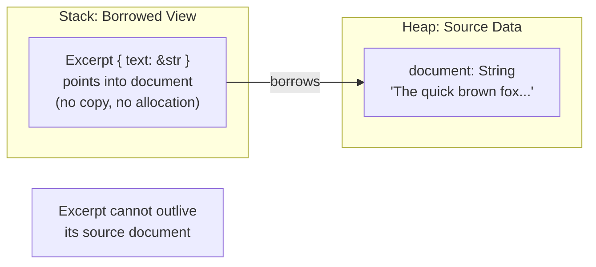

# Chapter 6: Struct Lifetimes and Self-Referential Nightmares 🔴

> **What you'll learn:**
> - How to store references in structs and what lifetime parameters on structs mean
> - The constraint that prevents any struct from outliving the data it borrows
> - Why self-referential structs (structs containing a reference to their own field) are fundamentally at odds with Rust's memory model
> - The standard workarounds: `Arc`, `indices`, and `Pin<Box<T>>`

---

## 6.1 References in Structs: Motivation

Sometimes you want a struct that works with existing data without copying it. For example, a `Parser` that tokenizes a `&str` buffer in-place, a `View` into a slice, or a configuration wrapper that borrows from a larger config document.



---

## 6.2 Lifetime Annotations on Structs

Every struct field that holds a reference *requires* a lifetime annotation. The annotation declares: "an instance of this struct cannot outlive the reference it holds."

```rust
// ❌ FAILS: error[E0106]: missing lifetime specifier
struct Excerpt {
    text: &str, // Which lifetime? Where does this &str come from?
}

// ✅ FIX: Annotate the struct with a lifetime parameter
struct Excerpt<'a> {
    text: &'a str,
}
// "An Excerpt borrows a &str that lives for at least 'a.
//  An Excerpt itself cannot outlive 'a."
```

The constraint is enforced at the construction site:

```rust
fn main() {
    let novel = String::from("The quick brown fox...");
    let first_sentence;
    {
        let i = novel.find('.').unwrap_or(novel.len());
        first_sentence = Excerpt { text: &novel[..i] };
        // Excerpt borrows from `novel`
    }
    // ✅ first_sentence can be used here because `novel` is still alive
    println!("{}", first_sentence.text);
} // novel drops, first_sentence drops (it borrowed from novel, which still lives)

// ---

fn main_fails() {
    let first_sentence;
    {
        let novel = String::from("The quick brown fox...");
        let i = novel.find('.').unwrap_or(novel.len());
        first_sentence = Excerpt { text: &novel[..i] };
    } // novel drops HERE — first_sentence would dangle
    // ❌ error[E0597]: `novel` does not live long enough
    println!("{}", first_sentence.text);
}
```

---

## 6.3 `impl` Blocks on Lifetimed Structs

When writing methods for a struct with lifetime parameters, you must repeat the lifetime in the `impl` block:

```rust
struct Excerpt<'a> {
    text: &'a str,
}

impl<'a> Excerpt<'a> {
    // The method borrows &self. Lifetime elision rule 3 applies:
    // the returned &str lives as long as &self (not as long as 'a explicitly).
    fn text(&self) -> &str {
        self.text
    }

    // Explicit: returning a reference tied to 'a (the borrowed data lifetime)
    fn as_ref(&self) -> &'a str {
        self.text
        // Note: &'a str vs &str (tied to self) is a subtle distinction:
        // - &'a str: lives as long as the source data
        // - &str (elided from &self): lives as long as the Excerpt struct itself
        // They differ if the Excerpt is moved while the caller still holds the ref.
    }

    // A method that takes another reference with its own lifetime
    fn announce_and_return<'b>(&'a self, announcement: &'b str) -> &'a str {
        println!("Attention: {}!", announcement);
        self.text
    }
}
```

---

## 6.4 Multiple Lifetimes in Structs

When a struct borrows from multiple independent sources, it needs multiple lifetime parameters:

```rust
// A join view that references two slices from potentially different backing stores
struct Join<'a, 'b> {
    left: &'a [u32],
    right: &'b [u32],
}

impl<'a, 'b> Join<'a, 'b> {
    fn left_sum(&self) -> u32 {
        self.left.iter().sum()
    }

    fn right_sum(&self) -> u32 {
        self.right.iter().sum()
    }

    fn total_sum(&self) -> u32 {
        self.left_sum() + self.right_sum()
    }
}

fn main() {
    let left = vec![1, 2, 3];
    let sum;
    {
        let right = vec![4, 5, 6];
        let join = Join { left: &left, right: &right };
        sum = join.total_sum(); // ✅ total_sum returns u32, not a reference — no lifetime issue
    } // right drops, join drops — but sum (u32) is fine
    println!("Sum: {}", sum); // ✅
}
```

---

## 6.5 Self-Referential Structs: The Fundamental Problem

A self-referential struct contains a field that points to *another field of the same struct*. This is common in C and C++ for things like intrusive linked lists, async state machines, or parsers that maintain a pointer into their own buffer.

In Rust, self-referential structs are **fundamentally at odds with the ownership model**:

```rust
// ❌ This DOES NOT COMPILE — and the reason is deep
struct SelfRef {
    data: String,
    // ❌ pointer to data within THIS struct
    // But the lifetime of &data is tied to the struct — which doesn't exist yet!
    ptr: &str, // error: lifetime required — but "self" doesn't have a stable address
}
```

**Why is this impossible?** Because Rust values can be *moved*. When a `SelfRef` is moved (e.g., pushed into a `Vec`, returned from a function), its stack location changes. The raw pointer `ptr` would now point to the *old* (invalid) address of `data`. This is a dangling pointer.

```mermaid
sequenceDiagram
    participant Stack1 as Stack Location A
    participant Stack2 as Stack Location B (after move)
    participant Heap as Heap buffer

    Stack1->>Heap: data field owns heap buffer "hello"
    Stack1-->>Stack1: ptr field → &self.data (= Stack Location A)
    Note over Stack1: Struct is moved...
    Stack1->>Stack2: Move: bytes copied to new location
    Stack2->>Heap: data field still owns heap buffer
    Stack2-->>Stack1: ❌ ptr field STILL points to Stack Location A!
                              (old, now-invalid location)
    Note over Stack2: Dangling pointer — use-after-free!
```

---

## 6.6 Solutions for Self-Referential Patterns

### Solution 1: Use Indices Instead of Pointers

The simplest and most idiomatic solution is to store an *index* rather than a *reference*. Indices don't dangle when the containing struct moves.

```rust
// Instead of:
struct BadParser<'a> {
    buffer: String,
    current: &'a str, // ❌ self-referential (ptr into buffer)
}

// Use:
struct Parser {
    buffer: String,
    cursor: usize, // ✅ index into buffer — valid even after moves
}

impl Parser {
    fn current_slice(&self) -> &str {
        &self.buffer[self.cursor..]
    }

    fn advance(&mut self, n: usize) {
        self.cursor = (self.cursor + n).min(self.buffer.len());
    }
}
```

### Solution 2: Separate Owned Data from Borrowed Views

Split the struct into an "owner" and a separate "view" with a lifetime:

```rust
struct OwnedBuffer {
    data: String,
}

struct BufferView<'a> {
    slice: &'a str,
    start: usize,
}

impl OwnedBuffer {
    fn view(&self, start: usize, len: usize) -> BufferView<'_> {
        BufferView {
            slice: &self.data[start..start + len],
            start,
        }
    }
}
```

### Solution 3: `Arc<String>` — Shared Ownership Instead of Borrowing

When a struct needs to "own part of itself" or share data across boundaries, `Arc` shared ownership solves the lifetime problem without self-reference:

```rust
use std::sync::Arc;

struct SharedBuffer {
    data: Arc<String>,
}

struct Slice {
    source: Arc<String>, // keeps the source alive
    start: usize,
    len: usize,
}

impl Slice {
    fn as_str(&self) -> &str {
        &self.source[self.start..self.start + self.len]
    }
}
```

### Solution 4: `Pin<Box<T>>` for Async State Machines

The truly advanced solution — used by the async runtime for coroutine state machines — is `Pin<Box<T>>`. Pinning *prevents a value from being moved*, making self-references safe because the address is now stable.

```rust
use std::pin::Pin;
use std::marker::PhantomPinned;

// A struct that MUST NOT move after construction
struct Pinned {
    data: String,
    self_ptr: *const String, // raw pointer to data — valid only while pinned
    _pinned: PhantomPinned,  // opts out of Unpin — prevents accidental moves
}

impl Pinned {
    fn new(data: String) -> Pin<Box<Self>> {
        let mut boxed = Box::pin(Pinned {
            data,
            self_ptr: std::ptr::null(),
            _pinned: PhantomPinned,
        });
        // SAFETY: we're setting self_ptr to point to our own data field.
        // The struct is pinned (Box::pin), so it will never move.
        // self_ptr will remain valid for the struct's lifetime.
        let ptr = &boxed.data as *const String;
        unsafe {
            boxed.as_mut().get_unchecked_mut().self_ptr = ptr;
        }
        boxed
    }

    fn data_ref(self: Pin<&Self>) -> &str {
        // SAFETY: self_ptr was set to &self.data when the struct was pinned.
        // Since the struct is pinned, self_ptr is still valid.
        unsafe { &*self.self_ptr }
    }
}
```

> **Note:** `Pin` + `unsafe` for self-referential structs is an advanced pattern used primarily by async runtimes and intrusive data structures. For application code, always prefer indices or separate ownership (Solutions 1–3).

---

## 6.7 Comparison: Self-Referential in C++ vs Rust

| Aspect | C++ | Rust (safe) | Rust (unsafe + Pin) |
|---|---|---|---|
| Raw pointer to own field | ✅ Compiles | ❌ Impossible | ✅ With Pin discipline |
| Safe after move | ❌ Dangling pointer (UB) | N/A | ✅ Cannot move if !Unpin |
| Compiler enforcement | ❌ None | ✅ Total | Partial (marked unsafe) |
| Common pattern | Intrusive lists, async | Indices, Arc | Only async state machines |

---

<details>
<summary><strong>🏋️ Exercise: Fixing Lifetimed Structs</strong> (click to expand)</summary>

**Challenge:**

The following struct and function have lifetime-related errors. Fix them with the minimum necessary changes, and explain what each fix means.

```rust
// Part A: Fix the struct definition
struct Config {
    host: &str,           // borrowed from a config file buffer
    port: u16,
    auth_token: &str,     // might come from a different source
}

// Part B: Fix the function
fn make_config(source: &str) -> Config {
    Config {
        host: &source[0..9],
        port: 8080,
        auth_token: "hardcoded-token", // string literal
    }
}

// Part C: This function has a subtle lifetime bug. Find it and explain why it fails.
fn get_token(config: Config) -> &str {
    config.auth_token
}
```

<details>
<summary>🔑 Solution</summary>

**Part A:**
```rust
// Both fields are borrowed — they might come from different lifetimes.
// If host and auth_token always come from the same source, use one 'a.
// If they can come from different sources (e.g., host from file, auth_token from env),
// use two lifetime parameters.

// Option 1: Single lifetime (same source)
struct Config<'a> {
    host: &'a str,
    port: u16,
    auth_token: &'a str,
}

// Option 2: Independent lifetimes
struct Config<'h, 'a> {
    host: &'h str,
    port: u16,
    auth_token: &'a str,
}
```

**Part B:**
```rust
// Using the single-lifetime version:
fn make_config<'a>(source: &'a str) -> Config<'a> {
    Config {
        host: &source[0..9],
        port: 8080,
        auth_token: "hardcoded-token", // &'static str — lives for 'static, satisfies 'a
    }
}
// Explanation: &'static str (string literal) can be used anywhere a &'a str is expected
// because 'static outlives all other lifetimes ('static: 'a for any 'a).
```

**Part C:**
```rust
// This function takes Config by VALUE (not by reference).
// Config<'a> holds a &'a str. When you return &str from this function,
// what lifetime does the returned &str have?
fn get_token(config: Config) -> &str {     // ❌ error[E0106]: missing lifetime specifier
    config.auth_token
}
// The problem: config is moved into the function.
// Even though config.auth_token borrows from outside data (lifetime 'a),
// the compiler sees "config is owned by this function" and can't elide correctly.

// Fix 1: Take by reference
fn get_token<'a>(config: &'a Config<'a>) -> &'a str {
    config.auth_token
}

// Fix 2: Return owned String
fn get_token(config: Config) -> String {
    config.auth_token.to_string()
}

// Fix 3: Use explicit explicit lifetime to separate struct and field lifetimes
fn get_token<'c, 'a>(config: &'c Config<'a>) -> &'a str {
//                    ^^                            ^^
//    Config is borrowed for 'c, but auth_token lives for 'a independent of 'c
//    This allows returning a reference valid beyond the config borrow
    config.auth_token
}
```

</details>
</details>

---

> **Key Takeaways**
> - Every struct field that holds a reference requires a lifetime parameter on the struct
> - The lifetime parameter declares: "this struct cannot outlive the data it borrows"
> - Self-referential structs (containing a reference to their own field) are impossible in safe Rust because moves invalidate the self-pointer
> - The idiomatic solutions are: use indices, separate ownership from views, or use `Arc` for shared ownership
> - `Pin<Box<T>>` enables safe self-referential structs in `unsafe` code — used primarily by async runtimes

> **See also:**
> - [Chapter 5: Lifetime Syntax Demystified](ch05-lifetime-syntax-demystified.md) — the fundamentals of lifetime parameters
> - [Chapter 7: Rc and Arc](ch07-rc-and-arc.md) — shared ownership as an alternative to self-reference
> - [Chapter 9: Box and the Sized Trait](ch09-box-and-sized.md) — heap allocation and `Pin`
