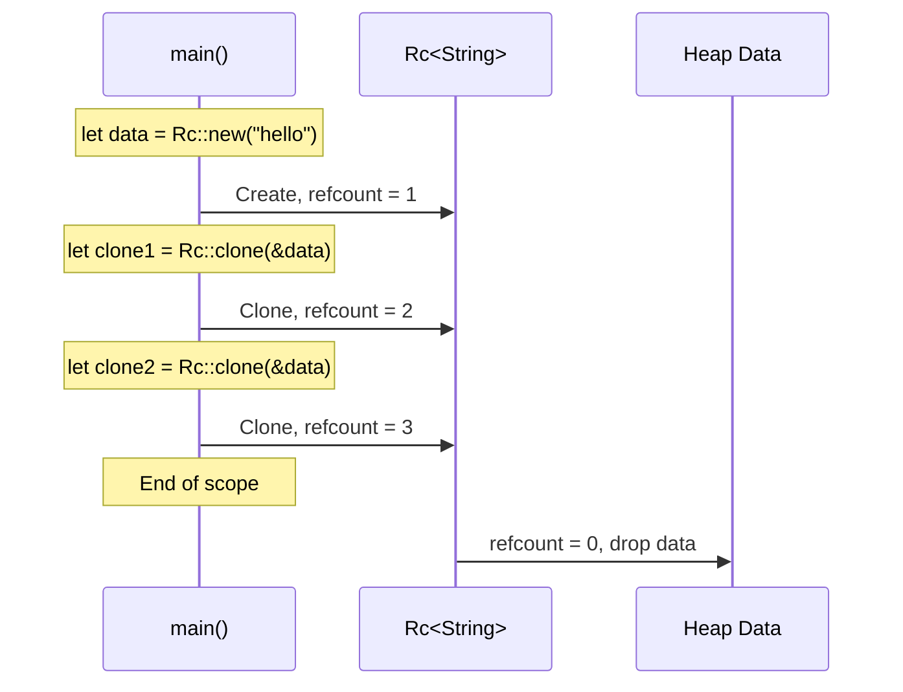
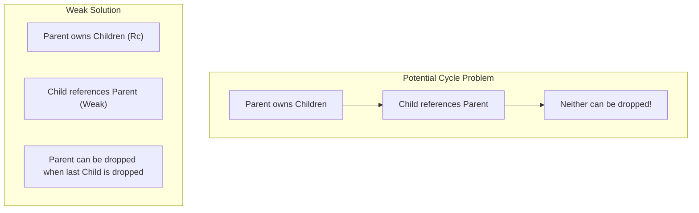

# Chapter 7: Rc and Arc 🟡

> **What you'll learn:**
> - When single ownership isn't enough and you need shared ownership
> - `Rc<T>` - Reference counting for single-threaded scenarios
> - `Arc<T>` - Atomic reference counting for multi-threaded scenarios
> - How to break ownership cycles with `Weak<T>`
> - Memory leaks with reference counting (and how to avoid them)

---

## When Single Ownership Isn't Enough

Rust's ownership model assumes each value has exactly one owner. But what if you need multiple owners?

Consider these scenarios:
- A data structure shared between multiple parts of your application
- A parent node and child nodes that both need to reference each other
- Cache entries that can be shared by multiple consumers

In these cases, you need **shared ownership**. Rust provides this through reference counting (`Rc` and `Arc`).

## Rc<T>: Reference Counting

`Rc<T>` (short for "Reference Counted") allows multiple owners for a value. The data is dropped when the last owner drops it.

```rust
use std::rc::Rc;

fn main() {
    let data = Rc::new(String::from("shared data"));
    
    // Clone creates a new reference, not a deep copy
    let clone1 = Rc::clone(&data);
    let clone2 = Rc::clone(&data);
    
    println!("Reference count: {}", Rc::strong_count(&data)); // 3
    
    // All point to the same data
    println!("{} {} {}", data, clone1, clone2);
    
} // All clones are dropped, data is freed
```

```mermaid
flowchart LR
    subgraph BeforeClone["Before Clone"]
        direction TB
        Heap1["Heap: \"shared data\"<br/>(refcount: 1)"]
        Stack1["Stack"] --> S1["data"]
        S1 --> Heap1
    end
    
    subgraph AfterClones["After Three Clones"]
        direction TB
        Heap2["Heap: \"shared data\"<br/>(refcount: 3)"]
        Stack2["Stack"] --> S2a["data"]
        Stack2 --> S2b["clone1"]
        Stack2 --> S2c["clone2"]
        S2a --> Heap2
        S2b --> Heap2
        S2c --> Heap2
    end
```

### How Rc Works



### Key Characteristics of Rc

1. **Single-threaded only:** `Rc` is not safe for multi-threaded use
2. **Reference counting has overhead:** Every clone increments a counter
3. **Immutable data:** `Rc<T>` gives you shared immutable access by default
4. **Can cause memory leaks:** If you create reference cycles, memory won't be freed

```rust
use std::rc::Rc;

// Use Rc when:
fn single_threaded_shared_data() {
    // Multiple parts of code need to read the same data
    let shared = Rc::new(vec![1, 2, 3]);
    
    let part1 = Rc::clone(&shared);
    let part2 = Rc::clone(&shared);
    
    // Both can read, but neither can modify (without interior mutability)
}

// Don't use Rc when:
fn multi_threaded() {
    // Need Arc for multi-threaded scenarios
    use std::sync::Arc;
    let shared = Arc::new(vec![1, 2, 3]);
}
```

## Arc<T>: Atomic Reference Counting

`Arc<T>` is like `Rc<T>`, but uses atomic operations for thread-safe reference counting:

```rust
use std::sync::Arc;
use std::thread;

fn main() {
    let data = Arc::new(String::from("shared data"));
    
    // Spawn multiple threads that share ownership
    let mut handles = vec![];
    
    for _ in 0..3 {
        let data = Arc::clone(&data);
        let handle = thread::spawn(move || {
            println!("{}", data);
        });
        handles.push(handle);
    }
    
    for handle in handles {
        handle.join().unwrap();
    }
}
```

| Feature | `Rc<T>` | `Arc<T>` |
|---------|---------|----------|
| Thread safe | No | Yes |
| Performance | Faster (no atomics) | Slower (atomic operations) |
| Use case | Single-threaded caches | Multi-threaded sharing |
| Memory overhead | Lower | Higher |

## Weak<T>: Breaking Ownership Cycles

What if you have a parent-child relationship where the child needs to reference the parent, but you don't want to prevent the parent from being dropped?

```rust
use std::rc::{Rc, Weak};
use std::cell::RefCell;

struct Node {
    value: i32,
    // Use Weak to avoid ownership cycle
    parent: RefCell<Weak<Node>>,
    children: RefCell<Vec<Rc<Node>>>,
}

fn main() {
    let parent = Rc::new(Node {
        value: 1,
        parent: RefCell::new(Weak::new()),
        children: RefCell::new(vec![]),
    });
    
    let child = Rc::new(Node {
        value: 2,
        parent: RefCell::new(Rc::downgrade(&parent)),
        children: RefCell::new(vec![]),
    });
    
    // Add child to parent's children
    parent.children.borrow_mut().push(Rc::clone(&child));
    
    // Can access parent from child
    if let Some(p) = child.parent.borrow().upgrade() {
        println!("Child's parent value: {}", p.value);
    }
    
    // Drop parent
    drop(parent);
    
    // Child's parent reference is now None
    println!("Parent still accessible? {}", child.parent.borrow().upgrade().is_none());
}
```

### When to Use Weak

- **Parent-child relationships:** Child has weak reference to parent
- **Caches:** Cache entries can be weakly referenced
- **Observers:** Observer patterns where observers shouldn't prevent observed from being dropped



## Memory Leaks with Rc

`Rc` can cause memory leaks if you create reference cycles:

```rust
use std::rc::Rc;
use std::cell::RefCell;

// Creating a memory leak:
fn memory_leak() {
    let a = Rc::new(RefCell::new(1));
    let b = Rc::new(RefCell::new(2));
    
    // Create cycle: a -> b -> a
    *a.borrow_mut() = Rc::clone(&b);
    *b.borrow_mut() = Rc::clone(&a);
    
    // Neither will ever be dropped!
    // This is a "leak" - intentionally, in some cases
}
```

**The fix:** Use `Weak` to break the cycle:

```rust
use std::rc::{Rc, Weak};
use std::cell::RefCell;

fn no_memory_leak() {
    let a = Rc::new(RefCell::new(1));
    let b = Rc::new(RefCell::new(Weak::new()));
    
    // b weakly references a - no cycle!
    *b.borrow_mut() = Rc::downgrade(&a);
    
    // a can be dropped
    drop(a);
    
    // Trying to upgrade gives None
    println!("Can upgrade? {}", b.borrow().upgrade().is_none());
}
```

<details>
<summary><strong>🏋️ Exercise: Building a Shared Data Structure</strong> (click to expand)</summary>

**Challenge:** Build a simple observer pattern using `Rc` and `Weak`:

```rust
use std::rc::{Rc, Weak};
use std::cell::RefCell;

// Define a Subject that can be observed
struct Subject {
    // TODO: Add state and observers
}

// Define an Observer that watches a Subject  
struct Observer {
    // TODO: Add weak reference to subject
}
```

<details>
<summary>🔑 Solution</summary>

```rust
use std::rc::{Rc, Weak};
use std::cell::RefCell;
use std::fmt::Display;

struct Subject {
    value: i32,
    observers: RefCell<Vec<Weak<Observer>>>,
}

struct Observer {
    subject: RefCell<Weak<Subject>>,
    id: usize,
}

impl Subject {
    fn new(value: i32) -> Rc<Self> {
        Rc::new(Subject {
            value,
            observers: RefCell::new(vec![]),
        })
    }
    
    fn register(&self, observer: Weak<Observer>) {
        self.observers.borrow_mut().push(observer);
    }
    
    fn notify(&self) {
        println!("Subject value changed to: {}", self.value);
        for weak_observer in self.observers.borrow().iter() {
            if let Some(observer) = weak_observer.upgrade() {
                println!("Observer {} got notified!", observer.id);
            }
        }
    }
}

fn main() {
    let subject = Subject::new(10);
    
    let observer1 = Rc::new(Observer {
        subject: RefCell::new(Rc::downgrade(&subject)),
        id: 1,
    });
    
    let observer2 = Rc::new(Observer {
        subject: RefCell::new(Rc::downgrade(&subject)),
        id: 2,
    });
    
    // Register observers
    subject.register(Rc::downgrade(&observer1));
    subject.register(Rc::downgrade(&observer2));
    
    // Change value and notify
    subject.value = 20;
    subject.notify();
    
    // Drop subject
    drop(subject);
    
    // Observers still exist but their subject is gone
    println!("Observer 1 can access subject: {}", 
             observer1.subject.borrow().upgrade().is_some());
}
```

</details>
</details>

> **Key Takeaways:**
> - `Rc<T>` provides shared ownership with reference counting (single-threaded)
> - `Arc<T>` provides thread-safe shared ownership
> - Use `Rc::clone` to create new references (not deep copies)
> - Use `Weak<T>` to avoid ownership cycles
> - Reference counting can cause memory leaks if cycles are created

> **See also:**
> - [Chapter 8: Interior Mutability](./ch08-interior-mutability.md) - Modifying shared data
> - [Chapter 9: Box and Sized Traits](./ch09-box-and-sized-traits.md) - Heap allocation with Box
> - [Chapter 12: Capstone Project](./ch12-capstone-project.md) - Putting it all together
