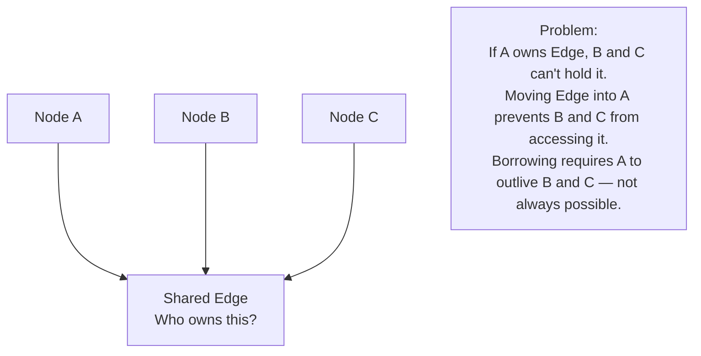
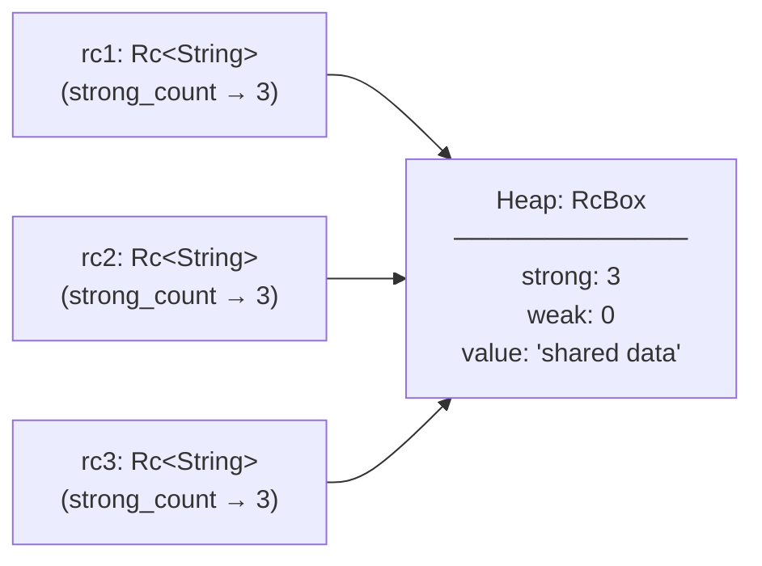
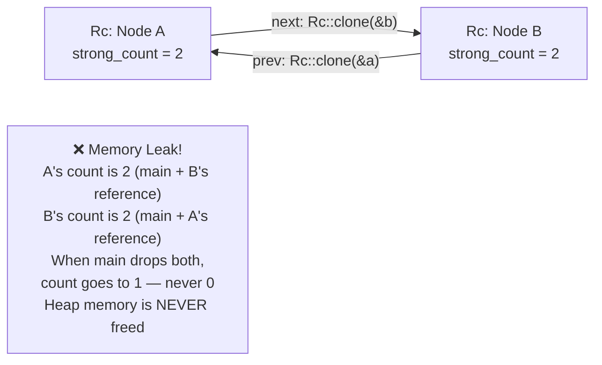
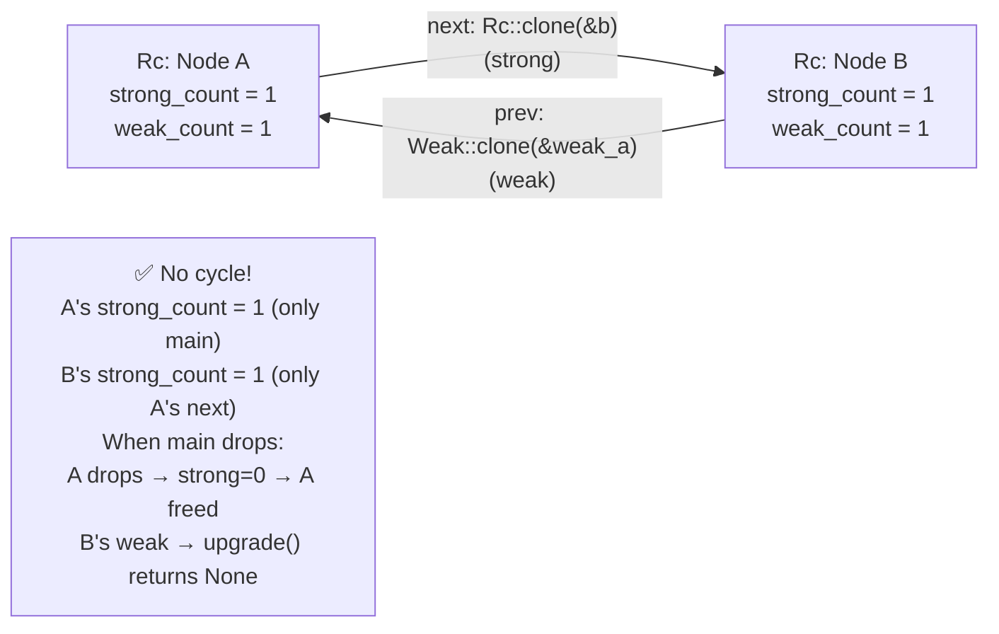

# Chapter 7: Rc and Arc 🟡

> **What you'll learn:**
> - Why single ownership is sometimes insufficient and how reference counting solves it
> - The difference between `Rc<T>` (single-threaded) and `Arc<T>` (thread-safe) and what makes them different under the hood
> - How reference cycles cause memory leaks and how `Weak<T>` breaks them
> - The performance costs of reference counting and when it's worth paying them

---

## 7.1 The Limits of Single Ownership

Rust's ownership model is brilliant for the common case, but some data structures inherently require multiple owners:

- **A graph** where multiple nodes share an edge
- **An observer pattern** where multiple subscribers reference the same event queue
- **A shared configuration** used by many components of a system



The solution is **reference counting**: the shared value stays alive as long as at least one owner is alive. When the last owner drops, the value drops.

---

## 7.2 `Rc<T>`: Reference Counting for Single-Threaded Code

`Rc<T>` (Reference Counted) wraps a value on the heap with a reference count. Each `Rc::clone()` call *increments* the count; each `Drop` *decrements* it. When the count reaches zero, the inner value is freed.



```rust
use std::rc::Rc;

let s = Rc::new(String::from("shared data"));

// Rc::clone() does NOT clone the String — it just increments the reference count
let s2 = Rc::clone(&s);  // strong_count: 2
let s3 = Rc::clone(&s);  // strong_count: 3

println!("Reference count: {}", Rc::strong_count(&s)); // 3
println!("{}", s);  // ✅ All three can read
println!("{}", s2); // ✅
println!("{}", s3); // ✅

drop(s3); // strong_count: 2
drop(s2); // strong_count: 1
// When s drops: strong_count → 0 → String is freed
```

**What `Rc::clone()` costs:** Incrementing a `usize`. That's it. It's O(1) and cheap. Just **never** write `s.clone()` to increment an `Rc` — always write `Rc::clone(&s)` to make the intent obvious to readers.

**What `Rc<T>` does NOT give you:** Mutation. `Rc<T>` provides shared *read-only* access. For shared *mutable* access, combine with `RefCell<T>` (Chapter 8) or `Mutex<T>`.

### `Rc<T>` is `!Send` and `!Sync`

`Rc<T>` uses **non-atomic** reference counting — incrementing the count is not thread-safe. This is intentional because atomic operations are more expensive. The compiler enforces this: `Rc<T>` cannot be sent to another thread.

```rust
use std::rc::Rc;
use std::thread;

let rc = Rc::new(42);

// ❌ FAILS: error[E0277]: `Rc<i32>` cannot be sent between threads safely
thread::spawn(move || {
    println!("{}", rc);
});
```

---

## 7.3 `Arc<T>`: Atomic Reference Counting for Multi-Threaded Code

`Arc<T>` (Atomically Reference Counted) is identical to `Rc<T>` in API, but uses **atomic** operations for the reference count. This makes it safe to share across threads.

```rust
use std::sync::Arc;
use std::thread;

let s = Arc::new(String::from("shared across threads"));

let s_clone = Arc::clone(&s);
let handle = thread::spawn(move || {
    println!("Thread sees: {}", s_clone); // ✅
});

handle.join().unwrap();
println!("Main sees: {}", s); // ✅
```

**The performance difference:**

| Operation | `Rc<T>` | `Arc<T>` |
|---|---|---|
| Clone (refcount increment) | ~1 ns (single instruction) | ~5–20 ns (atomic CAS or fence) |
| Drop (refcount decrement) | ~1 ns | ~5–20 ns |
| Memory layout | `strong: usize, weak: usize` | `strong: AtomicUsize, weak: AtomicUsize` |
| Thread-safe | ❌ No | ✅ Yes |
| Usable for `dyn Trait + Send` | ❌ No | ✅ Yes |

**The rule:** Use `Rc<T>` for single-threaded data structures where performance matters. Use `Arc<T>` when you need to share across thread boundaries.

---

## 7.4 Memory Leaks with Reference Cycles

`Rc<T>` and `Arc<T>` prevent values from being freed *while the count > 0*. This is powerful, but it means **reference cycles** can prevent values from ever being freed:



```rust
use std::rc::Rc;
use std::cell::RefCell;

#[derive(Debug)]
struct Node {
    value: i32,
    next: Option<Rc<RefCell<Node>>>, // forward link
}

fn create_cycle() {
    let a = Rc::new(RefCell::new(Node { value: 1, next: None }));
    let b = Rc::new(RefCell::new(Node { value: 2, next: None }));

    // Create a cycle: a → b → a
    a.borrow_mut().next = Some(Rc::clone(&b));
    b.borrow_mut().next = Some(Rc::clone(&a));

    println!("a strong count: {}", Rc::strong_count(&a)); // 2
    println!("b strong count: {}", Rc::strong_count(&b)); // 2
} // a and b's local Rc handles drop, but counts go to 1 (not 0) — LEAK!
```

---

## 7.5 `Weak<T>`: Breaking Cycles

`Weak<T>` is a *non-owning* reference. It does not increment the strong count, so it cannot form a cycle. To access the value, you must *upgrade* the weak reference — which returns `Option<Rc<T>>` (or `Option<Arc<T>>`), returning `None` if the value has already been freed.



```rust
use std::rc::{Rc, Weak};
use std::cell::RefCell;

#[derive(Debug)]
struct Node {
    value: i32,
    parent: Option<Weak<RefCell<Node>>>, // ← Weak: non-owning, won't form cycle
    children: Vec<Rc<RefCell<Node>>>,    // ← Rc: strong, children are owned
}

fn main() {
    let parent = Rc::new(RefCell::new(Node {
        value: 1,
        parent: None,
        children: vec![],
    }));

    let child = Rc::new(RefCell::new(Node {
        value: 2,
        parent: Some(Rc::downgrade(&parent)), // ← Weak reference to parent
        children: vec![],
    }));

    parent.borrow_mut().children.push(Rc::clone(&child));

    println!("Parent strong count: {}", Rc::strong_count(&parent)); // 1
    println!("Child strong count: {}", Rc::strong_count(&child));   // 2 (parent holds one)

    // Upgrade the weak reference to access the parent:
    if let Some(p) = child.borrow().parent.as_ref().and_then(|w| w.upgrade()) {
        println!("Child's parent value: {}", p.borrow().value); // 1
    }
} // parent drops (strong_count → 0 → freed), child's Weak → upgrade() → None
```

### `Weak` Usage Patterns

| Pattern | Use |
|---|---|
| `parent → children` tree | `children: Vec<Rc<T>>` (owned), `parent: Option<Weak<T>>` (non-owning back-reference) |
| Observer/listener | `listeners: Vec<Weak<dyn Listener>>` — listeners can drop independently |
| Cache | Store `Weak<T>` to cached values; if the value was dropped, recreate it |

---

## 7.6 `Rc<T>` + `RefCell<T>`: The Interior Mutability Combo

For shared *mutable* access in single-threaded code, the standard pattern is `Rc<RefCell<T>>`:

```rust
use std::rc::Rc;
use std::cell::RefCell;

let shared_log: Rc<RefCell<Vec<String>>> = Rc::new(RefCell::new(vec![]));

let log_a = Rc::clone(&shared_log);
let log_b = Rc::clone(&shared_log);

// Both can mutate the shared Vec (runtime borrow checking):
log_a.borrow_mut().push("event from A".to_string()); // ✅
log_b.borrow_mut().push("event from B".to_string()); // ✅

println!("{:?}", shared_log.borrow()); // ["event from A", "event from B"]
```

For multi-threaded code, the equivalent is `Arc<Mutex<T>>` (Chapter 8).

---

<details>
<summary><strong>🏋️ Exercise: Graph with Shared Edges</strong> (click to expand)</summary>

**Challenge:**

Implement a simple directed graph where edges are shared objects. Multiple node pairs can reference the same `Edge`. Use `Rc` for single-threaded ownership. Demonstrate that:
1. Two nodes can share one `Edge` instance
2. The `Edge` is not freed until all nodes referencing it are dropped
3. Adding a back-reference (creating an accidental cycle) causes a leak — detect it with `Rc::strong_count`

```rust
use std::rc::Rc;

struct Edge {
    weight: u32,
    label: String,
}

struct Node {
    id: u32,
    edges: Vec<Rc<Edge>>,
}

// Implement the above and demonstrate the three points
fn main() {
    // Your code here
}
```

<details>
<summary>🔑 Solution</summary>

```rust
use std::rc::Rc;

#[derive(Debug)]
struct Edge {
    weight: u32,
    label: String,
}

impl Drop for Edge {
    fn drop(&mut self) {
        println!("Edge '{}' dropped", self.label);
    }
}

#[derive(Debug)]
struct Node {
    id: u32,
    edges: Vec<Rc<Edge>>,
}

fn main() {
    // 1. Two nodes share one Edge instance
    let edge_ab = Rc::new(Edge { weight: 10, label: "A→B".to_string() });

    let mut node_a = Node { id: 1, edges: vec![] };
    let mut node_b = Node { id: 2, edges: vec![] };

    node_a.edges.push(Rc::clone(&edge_ab)); // node_a references edge_ab
    node_b.edges.push(Rc::clone(&edge_ab)); // node_b references the SAME edge

    println!("edge_ab strong_count: {}", Rc::strong_count(&edge_ab)); // 3 (original + a + b)

    // 2. Edge is not freed until all nodes drop
    drop(node_a);
    println!("After dropping node_a, count: {}", Rc::strong_count(&edge_ab)); // 2
    drop(node_b);
    println!("After dropping node_b, count: {}", Rc::strong_count(&edge_ab)); // 1
    drop(edge_ab);
    // "Edge 'A→B' dropped" — printed here, because count → 0

    // 3. Demonstrating cycle → leak with RefCell
    use std::cell::RefCell;
    #[derive(Debug)]
    struct CyclicNode {
        id: u32,
        next: Option<Rc<RefCell<CyclicNode>>>,
    }

    let n1 = Rc::new(RefCell::new(CyclicNode { id: 1, next: None }));
    let n2 = Rc::new(RefCell::new(CyclicNode { id: 2, next: None }));

    n1.borrow_mut().next = Some(Rc::clone(&n2));
    n2.borrow_mut().next = Some(Rc::clone(&n1)); // cycle!

    println!("n1 strong_count before drop: {}", Rc::strong_count(&n1)); // 2
    println!("n2 strong_count before drop: {}", Rc::strong_count(&n2)); // 2

    drop(n1); // count → 1 (not 0!) — n2 still holds a reference to n1
    drop(n2); // count → 1 (not 0!) — n1 still holds a reference to n2
    // ❌ Neither is freed — memory leak! No "dropped" message printed.
    // Fix: use Weak for one direction of the cycle.
}
```

</details>
</details>

---

> **Key Takeaways**
> - `Rc<T>` enables shared ownership in single-threaded code via non-atomic reference counting
> - `Arc<T>` enables shared ownership across threads via atomic reference counting (~5–20ns overhead per clone/drop)
> - `Rc::clone()` and `Arc::clone()` do NOT copy the data — they increment the refcount; write `Rc::clone(&val)` explicitly
> - Reference cycles with `Rc`/`Arc` cause memory leaks — break cycles with `Weak<T>` for non-owning back-references
> - `Rc<RefCell<T>>` is the pattern for shared mutable access in single-threaded code; `Arc<Mutex<T>>` for multi-threaded

> **See also:**
> - [Chapter 8: Interior Mutability](ch08-interior-mutability.md) — `RefCell`, `Mutex`, and runtime borrow checking
> - [Chapter 12: Capstone Project](ch12-capstone-project.md) — `Arc<Mutex<T>>` in a real system
