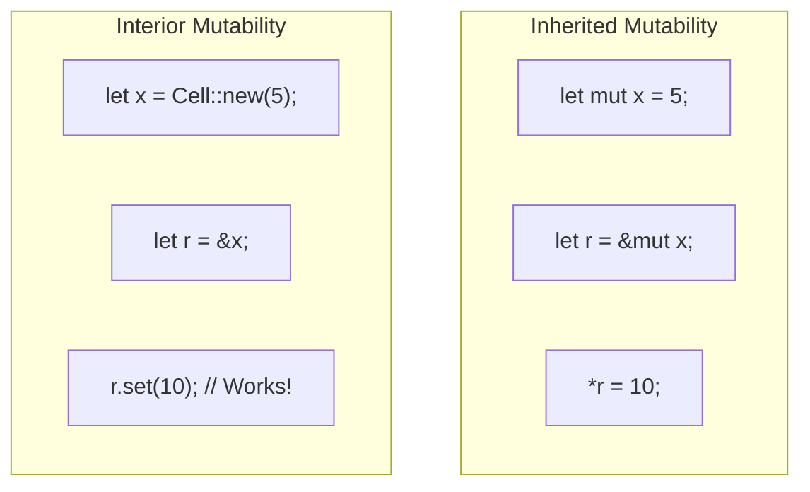
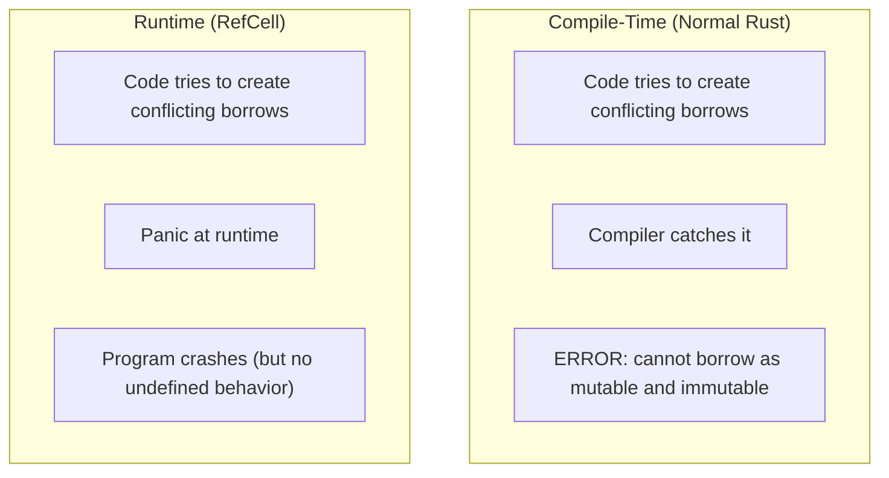
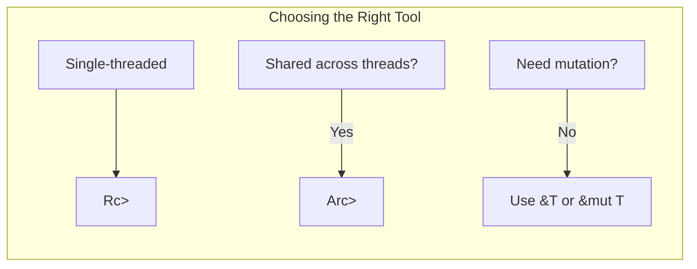

# Chapter 8: Interior Mutability 🔴

> **What you'll learn:**
> - The difference between inherited mutability and interior mutability
> - When and why to use `Cell<T>` and `RefCell<T>`
> - Thread-safe interior mutability with `Mutex<T>` and `RwLock<T>`
> - How to choose between compile-time and runtime borrow checking

---

## Two Types of Mutability

Rust has two fundamentally different types of mutability:

### Inherited Mutability (The Default)

This is Rust's standard mutability: if you have a `&mut T` reference, you can modify the data. The mutability "inherits" from the reference to the value.

```rust
fn main() {
    let mut x = 5;
    
    // x is mutable, so we can modify it
    x = 10;
    
    let r = &mut x;
    *r = 20; // Modify through mutable reference
}
```

### Interior Mutability

This allows modifying data even through a **shared reference** (`&T`). The mutation happens "inside" the wrapper type.

```rust
use std::cell::Cell;

fn main() {
    let x = Cell::new(5);
    
    // Can modify through shared reference!
    let r = &x;
    r.set(10); // Interior mutability
    
    println!("{}", x.get()); // 10
}
```

## Why Interior Mutability Exists

Interior mutability is needed when:
1. You have shared data that needs to be mutated
2. You can't use `&mut` (e.g., multiple parts need access)
3. You're implementing internal caching or memoization
4. You need `Rc<RefCell<T>>` for shared mutable state



## Cell<T>: For Copy Types

`Cell<T>` provides interior mutability for `Copy` types. You can get and set values:

```rust
use std::cell::Cell;

fn main() {
    let cell = Cell::new(5);
    
    // Get value
    println!("{}", cell.get()); // 5
    
    // Set value
    cell.set(10);
    println!("{}", cell.get()); // 10
    
    // Can also use replace
    let old = cell.replace(20);
    println!("old = {}, new = {}", old, cell.get()); // 10, 20
}
```

**Limitations:** Only works with `Copy` types because `get()` returns a copy.

## RefCell<T>: For Non-Copy Types

For non-Copy types, use `RefCell<T>`. It provides runtime borrow checking:

```rust
use std::cell::RefCell;

fn main() {
    let data = RefCell::new(String::from("hello"));
    
    // Borrow immutably (multiple allowed)
    {
        let r = data.borrow();
        println!("{}", r);
    }
    
    // Borrow mutably (exclusive)
    {
        let mut w = data.borrow_mut();
        w.push_str(" world");
    }
    
    println!("{}", data.borrow());
}
```

### The Runtime Borrow Check

`RefCell<T>` enforces borrowing rules at **runtime**, not compile time:

```rust
use std::cell::RefCell;

fn main() {
    let data = RefCell::new(String::from("hello"));
    
    // Mutable borrow
    let mut w = data.borrow_mut();
    
    // ❌ PANICS at runtime: can't borrow while mutable borrow exists
    // let r = data.borrow();
}
```

This is different from compile-time borrow checking:
- Compile-time: Error at compile time, preventing compilation
- Runtime (RefCell): Panic at runtime if rules are violated



## Mutex<T>: Thread-Safe Interior Mutability

For multi-threaded scenarios, use `Mutex<T>` (mutual exclusion):

```rust
use std::sync::Mutex;
use std::thread;

fn main() {
    let counter = Mutex::new(0);
    let mut handles = vec![];
    
    for _ in 0..10 {
        let counter = Mutex::clone(&counter);
        let handle = thread::spawn(move || {
            let mut num = counter.lock().unwrap();
            *num += 1;
        });
        handles.push(handle);
    }
    
    for handle in handles {
        handle.join().unwrap();
    }
    
    println!("{}", *counter.lock().unwrap()); // 10
}
```

| Type | Thread Safe | Borrow Check | Use Case |
|------|-------------|--------------|----------|
| `Cell<T>` | No | Compile-time | Single-threaded, Copy types |
| `RefCell<T>` | No | Runtime | Single-threaded, non-Copy types |
| `Mutex<T>` | Yes | Runtime | Multi-threaded, any type |

## RwLock<T>: Reader-Writer Lock

`RwLock<T>` allows multiple readers OR one writer:

```rust
use std::sync::RwLock;

fn main() {
    let data = RwLock::new(vec![1, 2, 3]);
    
    // Multiple readers OK
    {
        let r1 = data.read().unwrap();
        let r2 = data.read().unwrap();
        println!("{:?} {:?}", r1, r2);
    }
    
    // Writer gets exclusive access
    {
        let mut w = data.write().unwrap();
        w.push(4);
    }
}
```

## Use Cases for Interior Mutability

### 1. Caching/Memoization

```rust
use std::cell::RefCell;
use std::collections::HashMap;

struct Cache {
    map: RefCell<HashMap<String, String>>,
}

impl Cache {
    fn new() -> Self {
        Cache {
            map: RefCell::new(HashMap::new()),
        }
    }
    
    fn get_or_compute(&self, key: &str, compute: impl FnOnce() -> String) -> String {
        // Try to get from cache
        if let Some(value) = self.map.borrow().get(key) {
            return value.clone();
        }
        
        // Compute and cache
        let value = compute();
        self.map.borrow_mut().insert(key.to_string(), value.clone());
        value
    }
}
```

### 2. Shared Mutable State

```rust
use std::sync::{Arc, Mutex};
use std::thread;

// Shared state across threads
fn main() {
    let shared = Arc::new(Mutex::new(0));
    
    let mut handles = vec![];
    for _ in 0..5 {
        let shared = Arc::clone(&shared);
        handles.push(thread::spawn(move || {
            let mut guard = shared.lock().unwrap();
            *guard += 1;
        }));
    }
    
    for h in handles {
        h.join().unwrap();
    }
    
    println!("{}", *shared.lock().unwrap());
}
```

## Choosing Between Compile-Time and Runtime Checking

| Scenario | Solution |
|----------|----------|
| Single-threaded, simple cases | Normal `&mut` references |
| Need shared access to mutable data (single-threaded) | `Rc<RefCell<T>>` |
| Need shared access to mutable data (multi-threaded) | `Arc<Mutex<T>>` or `Arc<RwLock<T>>` |
| Performance-critical, rarely contested | `RwLock<T>` (read-heavy) |
| Must not panic on borrow violation | Consider redesign |



<details>
<summary><strong>🏋️ Exercise: Implementing a Simple Cache</strong> (click to expand)</summary>

**Challenge:** Implement a thread-safe cache using `Arc<Mutex<T>>`:

```rust
use std::sync::{Arc, Mutex};
use std::collections::HashMap;

// TODO: Implement a cache that can be shared across threads
struct Cache {
    // Add fields
}

impl Cache {
    fn new() -> Self {
        // Initialize
    }
    
    fn get_or_insert(&self, key: String, value: i32) -> i32 {
        // Get or insert logic
    }
}
```

<details>
<summary>🔑 Solution</summary>

```rust
use std::sync::{Arc, Mutex};
use std::collections::HashMap;

struct Cache {
    map: Arc<Mutex<HashMap<String, i32>>>,
}

impl Cache {
    fn new() -> Self {
        Cache {
            map: Arc::new(Mutex::new(HashMap::new())),
        }
    }
    
    fn get_or_insert(&self, key: String, value: i32) -> i32 {
        let mut guard = self.map.lock().unwrap();
        
        if let Some(&v) = guard.get(&key) {
            return v;
        }
        
        guard.insert(key, value);
        value
    }
}

fn main() {
    let cache = Arc::new(Cache::new());
    
    // Multiple threads can use the cache
    let cache1 = Arc::clone(&cache);
    let cache2 = Arc::clone(&cache);
    
    let t1 = std::thread::spawn(move || {
        cache1.get_or_insert("foo".to_string(), 100)
    });
    
    let t2 = std::thread::spawn(move || {
        cache2.get_or_insert("bar".to_string(), 200)
    });
    
    println!("foo: {}", t1.join().unwrap());
    println!("bar: {}", t2.join().unwrap());
}
```

The key insight: `Arc<Mutex<T>>` provides shared ownership + thread-safe interior mutability.

</details>
</details>

> **Key Takeaways:**
> - Interior mutability allows mutation through shared references
> - `Cell<T>` works for Copy types, `RefCell<T>` for any type
> - `RefCell<T>` enforces borrowing rules at runtime (panics on violation)
> - `Mutex<T>` and `RwLock<T>` provide thread-safe interior mutability
> - Choose compile-time borrowing when possible, runtime when necessary

> **See also:**
> - [Chapter 7: Rc and Arc](./ch07-rc-and-arc.md) - Shared ownership
> - [Chapter 9: Box and Sized Traits](./ch09-box-and-sized-traits.md) - Heap allocation
> - [Chapter 10: Common Borrow Checker Pitfalls](./ch10-common-borrow-checker-pitfalls.md) - Fixing errors
