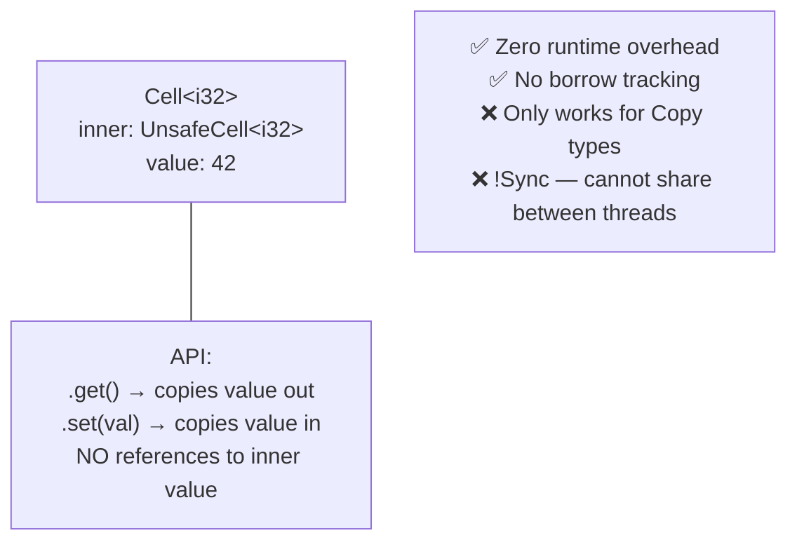
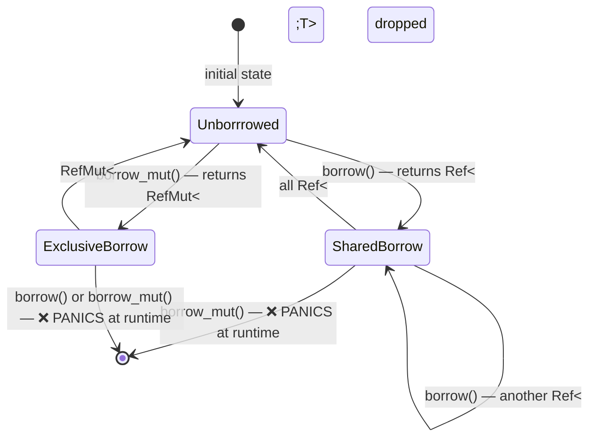
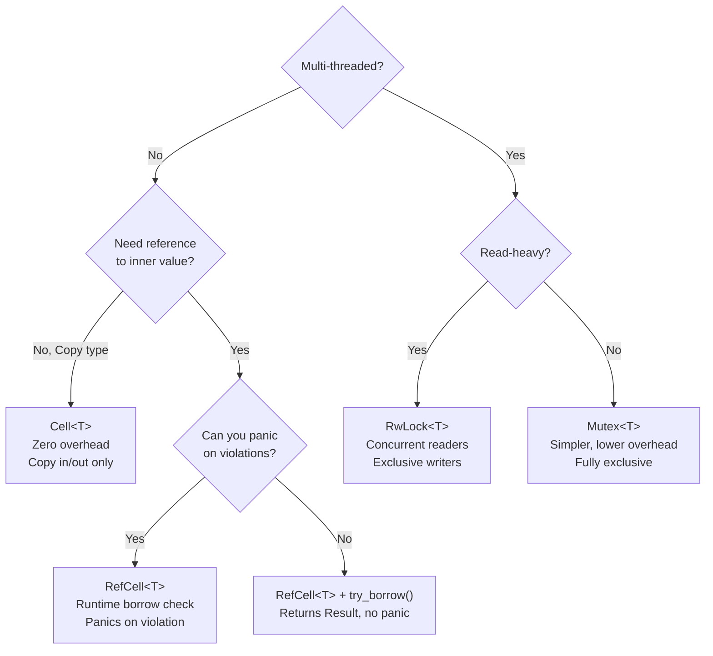

# Chapter 8: Interior Mutability — Cell, RefCell, Mutex 🔴

> **What you'll learn:**
> - The fundamental distinction between **inherited mutability** (controlled by the owner) and **interior mutability** (controlled by the value itself)
> - When and why you need to escape the compile-time borrow checker's constraints
> - The three main interior mutability types: `Cell<T>`, `RefCell<T>`, and `Mutex<T>` — their costs, guarantees, and appropriate use cases
> - How `UnsafeCell<T>` is the foundation of all interior mutability in Rust

---

## 8.1 Inherited Mutability: The Default Model

In Rust's default model, mutability is *inherited* from the outermost owner or borrow:

```rust
let mut v = vec![1, 2, 3]; // v is mutable — declared with `mut`
v.push(4);                  // ✅ mutating v is allowed

let r = &v;                 // r is an immutable borrow
// r.push(5);               // ❌ FAILS: cannot mutate through a shared reference
```

This is "inherited mutability": if you have `&mut T`, you can mutate `T` and all its fields transitively. If you have `&T`, you cannot mutate anything inside `T`. The type itself doesn't decide — the *binding and reference kind* decides.

**The problem:** Sometimes the type itself needs to decide. Consider:
- A `HashMap` that lazily initializes its internal hash function on first insert — even when accessed via `&HashMap`
- A `Mutex<T>` that must update atomic state when locked — even though callers hold `&Mutex<T>`
- A `Logger` that appends to an internal buffer even when passed as `&Logger`
- Shared `Rc<T>` references where you want *any* owner to be able to mutate

These patterns require **interior mutability**: the ability to mutate through a shared `&T` reference.

---

## 8.2 The Foundation: `UnsafeCell<T>`

Interior mutability in Rust is built on one primitive: `UnsafeCell<T>`. This is the *only* type in Rust that is allowed to hold mutable data behind a shared reference — all other approaches are **undefined behavior**.

```rust
use std::cell::UnsafeCell;

// UnsafeCell<T> is the ONLY legal way to mutate through &T
// All interior mutability types (Cell, RefCell, Mutex, RwLock, AtomicUsize...)
// are built on top of UnsafeCell<T>

pub struct MyCell<T> {
    value: UnsafeCell<T>, // the only "magic" — allows &self to yield *mut T
}

impl<T: Copy> MyCell<T> {
    pub fn new(val: T) -> Self {
        MyCell { value: UnsafeCell::new(val) }
    }

    pub fn get(&self) -> T {
        // SAFETY: We only allow Copy types, so reading is always safe.
        // No references to the inner value are held elsewhere (invariant upheld by API).
        unsafe { *self.value.get() }
    }

    pub fn set(&self, val: T) {
        // SAFETY: set() takes &self (not &mut self), but UnsafeCell lets us mutate.
        // We rely on the single-threaded invariant (Cell is !Sync) and Copy bound.
        unsafe { *self.value.get() = val; }
    }
}
```

You will almost never use `UnsafeCell` directly. Instead, Rust's standard library provides three safe abstractions:

---

## 8.3 `Cell<T>`: Zero-Cost Single-Threaded Mutability (Copy types only)

`Cell<T>` allows mutation through `&Cell<T>` (a shared reference) — but only for types that are `Copy`. Its API operates by *copying values in and out*, never yielding a reference to the inner value.



```rust
use std::cell::Cell;

struct Counter {
    count: Cell<u32>, // interior mutable — can be changed via &Counter
}

impl Counter {
    fn new() -> Self {
        Counter { count: Cell::new(0) }
    }

    fn increment(&self) { // &self, not &mut self!
        self.count.set(self.count.get() + 1);
    }

    fn value(&self) -> u32 {
        self.count.get()
    }
}

fn main() {
    let c = Counter::new();
    // Even through a shared reference, we can mutate:
    let r1 = &c;
    let r2 = &c;
    r1.increment(); // ✅
    r2.increment(); // ✅
    println!("{}", c.value()); // 2
}
```

**`Cell<T>` limitations:** Only works for `Copy` types (because it moves values, not references). No references to the interior value can be obtained — only copies come out. For non-`Copy` types or when you need references to the interior, use `RefCell`.

---

## 8.4 `RefCell<T>`: Runtime Borrow Checking

`RefCell<T>` implements the familiar borrow rules — one mutable OR many immutable borrows — but enforces them **at runtime** instead of compile time. If you violate the rules, it panics (or returns `Err` with `try_borrow`/`try_borrow_mut`).



```rust
use std::cell::RefCell;

let data = RefCell::new(vec![1, 2, 3]);

// Shared borrow — returns Ref<Vec<i32>> (like &Vec<i32>)
{
    let r1 = data.borrow();
    let r2 = data.borrow(); // ✅ multiple shared borrows
    println!("{:?} {:?}", r1, r2);
} // r1 and r2 dropped — borrows released

// Exclusive borrow — returns RefMut<Vec<i32>> (like &mut Vec<i32>)
{
    let mut m = data.borrow_mut();
    m.push(4); // ✅ can mutate
}

// ❌ PANICS at runtime: already borrowed as mutable
// let r = data.borrow();
// let m = data.borrow_mut(); // thread 'main' panicked: 'already borrowed: BorrowMutError'

// Use try_borrow / try_borrow_mut for fallible access:
match data.try_borrow_mut() {
    Ok(mut m) => m.push(5),
    Err(_) => println!("Already borrowed!"),
}
```

**When to use `RefCell`:**
1. You need shared mutable access (`Rc<RefCell<T>>`) and the aliasing structure is logically impossible to violate but the compiler can't prove it
2. You're implementing a callback/observer pattern where the observer holds `&self` but needs to update state
3. You know at design-time that only one component will hold a borrow at any given time

**`RefCell` overhead:** Two additional fields (borrow state, similar to an atomic flag), with a runtime check on every `borrow()`/`borrow_mut()` call. Negligible in most applications.

**`RefCell<T>` is `!Sync`:** Like `Cell<T>`, it cannot be shared across threads. For multi-threaded shared mutability, use `Mutex<T>`.

---

## 8.5 `Mutex<T>`: Thread-Safe Interior Mutability

`Mutex<T>` (Mutual Exclusion) is interior mutability for multi-threaded code. It wraps a value and a kernel-level or spin lock. To access the inner value, you `lock()` the mutex — which blocks the thread if another thread holds the lock.

```rust
use std::sync::{Arc, Mutex};
use std::thread;

// Shared state: an Arc<Mutex<T>> can be cloned and sent to multiple threads
let counter = Arc::new(Mutex::new(0u32));

let mut handles = vec![];
for _ in 0..10 {
    let counter = Arc::clone(&counter);
    let handle = thread::spawn(move || {
        let mut c = counter.lock().unwrap();
        // lock() blocks if another thread holds the Mutex
        // lock() returns MutexGuard<u32>, which Derefs to &mut u32
        *c += 1;
        // MutexGuard drops here → lock is released automatically
    });
    handles.push(handle);
}

for h in handles {
    h.join().unwrap();
}

println!("Final count: {}", *counter.lock().unwrap()); // 10
```

**What `lock()` returns:** A `MutexGuard<T>`, which is an RAII lock holder. The lock is *automatically released when the guard drops* — no `unlock()` call needed, and no risk of "forgetting to unlock" (a common bug in C/pthreads).

**Poisoning:** If a thread panics while holding a `MutexGuard`, the `Mutex` is marked as "poisoned". Subsequent `lock()` calls return `Err(PoisonError<...>)`. Use `.unwrap()` to propagate the panic, or `.unwrap_or_else(|e| e.into_inner())` to recover the lock despite the poison.

---

## 8.6 `RwLock<T>`: Multiple Readers OR One Writer

`RwLock<T>` is the thread-safe analogue of `RefCell<T>`'s multiple-readers-OR-one-writer model:

```rust
use std::sync::RwLock;

let lock = RwLock::new(vec![1, 2, 3]);

// Multiple readers simultaneously:
{
    let r1 = lock.read().unwrap();
    let r2 = lock.read().unwrap();
    println!("{:?} {:?}", r1, r2); // ✅
}

// One writer (blocks while readers exist):
{
    let mut w = lock.write().unwrap();
    w.push(4); // ✅
}
```

**`RwLock` vs `Mutex`:**

| | `Mutex<T>` | `RwLock<T>` |
|---|---|---|
| Multiple readers | ❌ (serialized) | ✅ (concurrent) |
| Write access | ✅ (exclusive) | ✅ (exclusive) |
| OS/platform support | Universal | Not always fair (writer starvation possible) |
| Overhead | Lower | Higher (more complex locking protocol) |
| Use when | Mixed read-write, short critical sections | Read-heavy, infrequent writes |

---

## 8.7 Choosing the Right Tool



| Type | Thread-safe | Overhead | Returns reference | Panics on violation |
|---|---|---|---|---|
| `Cell<T>` | ❌ !Sync | Near-zero | ❌ (only copies) | ❌ (impossible) |
| `RefCell<T>` | ❌ !Sync | ~2 flags + runtime check | ✅ `Ref<T>`, `RefMut<T>` | ✅ (or Err) |
| `Mutex<T>` | ✅ Sync | OS lock + syscall | ✅ `MutexGuard<T>` | ✅ (or poisoned Err) |
| `RwLock<T>` | ✅ Sync | OS lock + complex protocol | ✅ `RwLockReadGuard<T>`, `RwLockWriteGuard<T>` | ✅ (or poisoned Err) |
| `Atomic*` | ✅ Sync | ~1–3 ns (atomic instruction) | ❌ (integer operations only) | ❌ |

---

<details>
<summary><strong>🏋️ Exercise: Shared Mutable Log Buffer</strong> (click to expand)</summary>

**Challenge:**

Implement a `SharedLog` that:
1. Can be cloned cheaply and passed to multiple components
2. Each component can append log entries via `&self` (not `&mut self`)
3. Any component can read all log entries via `&self`
4. Works in single-threaded code (so no `Arc<Mutex<...>>` needed for this exercise)

Then demonstrate the same pattern adapted for multi-threaded use.

```rust
// Your implementation here
struct SharedLog { /* ... */ }

impl SharedLog {
    fn new() -> Self { todo!() }
    fn append(&self, entry: &str) { todo!() }
    fn entries(&self) -> Vec<String> { todo!() }
    fn clone_handle(&self) -> Self { todo!() }
}
```

<details>
<summary>🔑 Solution</summary>

```rust
use std::rc::Rc;
use std::cell::RefCell;

// Single-threaded version: Rc<RefCell<T>>
#[derive(Clone)]
struct SharedLog {
    // Rc provides multiple ownership handles
    // RefCell provides interior mutability (append via &self)
    inner: Rc<RefCell<Vec<String>>>,
}

impl SharedLog {
    fn new() -> Self {
        SharedLog {
            inner: Rc::new(RefCell::new(Vec::new())),
        }
    }

    fn append(&self, entry: &str) {
        // borrow_mut() returns RefMut<Vec<String>>
        // Panics if another borrow is active (safe because we're single-threaded
        // and no other borrow spans this call)
        self.inner.borrow_mut().push(entry.to_string());
    }

    fn entries(&self) -> Vec<String> {
        // borrow() returns Ref<Vec<String>>
        self.inner.borrow().clone()
    }

    fn clone_handle(&self) -> Self {
        // Rc::clone only increments the reference count — O(1)
        SharedLog {
            inner: Rc::clone(&self.inner),
        }
    }
}

// Multi-threaded version: Arc<Mutex<T>>
use std::sync::{Arc, Mutex};

#[derive(Clone)]
struct SharedLogThreadSafe {
    inner: Arc<Mutex<Vec<String>>>,
}

impl SharedLogThreadSafe {
    fn new() -> Self {
        SharedLogThreadSafe {
            inner: Arc::new(Mutex::new(Vec::new())),
        }
    }

    fn append(&self, entry: &str) {
        // lock() blocks until the mutex is available
        // MutexGuard released when it drops at end of statement
        self.inner.lock().unwrap().push(entry.to_string());
    }

    fn entries(&self) -> Vec<String> {
        self.inner.lock().unwrap().clone()
    }
}

fn main() {
    let log = SharedLog::new();
    let log2 = log.clone_handle(); // cheap Rc clone

    log.append("Component A: started");
    log2.append("Component B: connected");
    log.append("Component A: processing");

    println!("{:#?}", log.entries());
    // ["Component A: started", "Component B: connected", "Component A: processing"]

    // Multi-threaded:
    use std::thread;
    let tlog = SharedLogThreadSafe::new();
    let tlog2 = tlog.clone();

    let h = thread::spawn(move || {
        tlog2.append("Thread: hello");
    });
    tlog.append("Main: world");
    h.join().unwrap();
    println!("{:#?}", tlog.entries());
}
```

</details>
</details>

---

> **Key Takeaways**
> - **Inherited mutability**: `mut` on a binding controls mutability of the whole tree — the default, zero-overhead model
> - **Interior mutability**: The value itself controls access — needed when shared references must allow mutation
> - `Cell<T>`: zero-cost, single-threaded, `Copy`-only, no runtime checks. Use for simple counters and flags.
> - `RefCell<T>`: single-threaded, full references, runtime borrow checking. Panics on violations. Use with `Rc<RefCell<T>>` for shared mutable graphs/trees.
> - `Mutex<T>`: thread-safe, blocks on lock. Use with `Arc<Mutex<T>>` for cross-thread shared state.
> - `RwLock<T>`: thread-safe, concurrent readers. Use for read-heavy shared state.
> - All interior mutability is built on `UnsafeCell<T>` — never bypass it with raw cast transmutation

> **See also:**
> - [Chapter 7: Rc and Arc](ch07-rc-and-arc.md) — the shared ownership wrappers that pair with interior mutability
> - [Chapter 12: Capstone Project](ch12-capstone-project.md) — `Arc<Mutex<HashMap<...>>>` in a real key-value store
