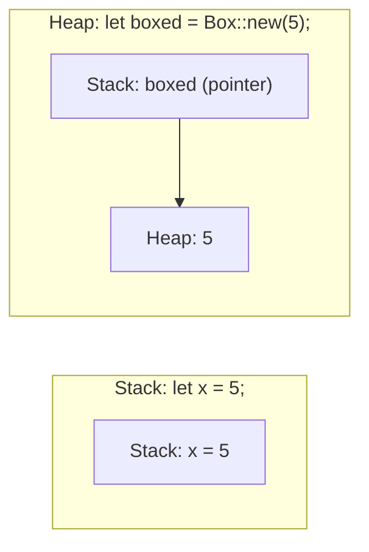
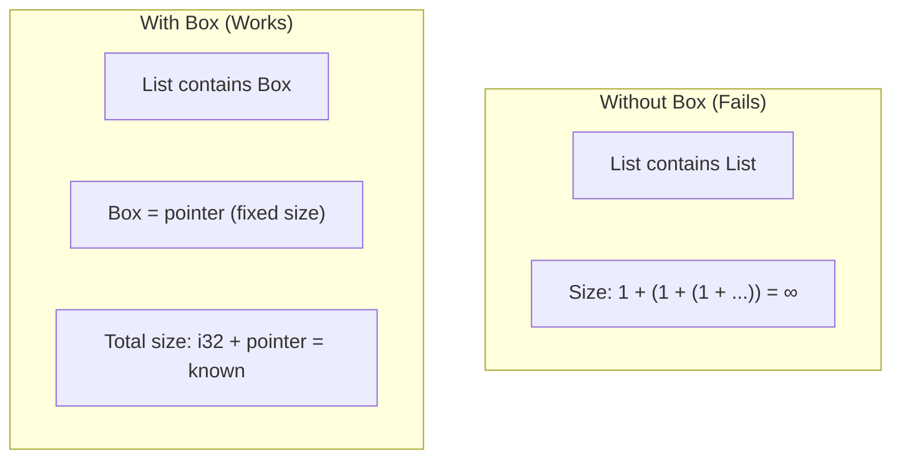
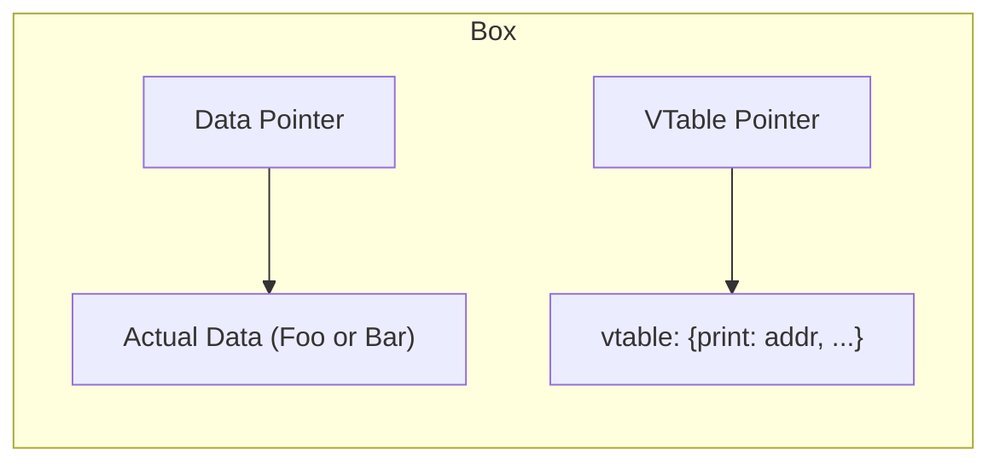
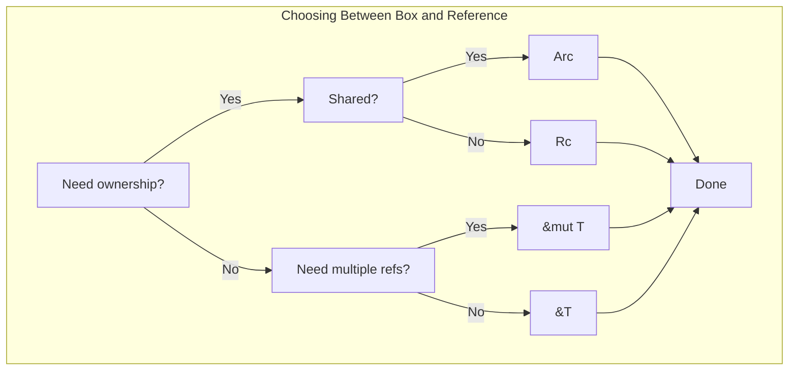

# Chapter 9: Box and Sized Traits 🟡

> **What you'll learn:**
> - When and why to use `Box<T>` for heap allocation
> - The `Sized` trait and why it matters for generics
> - Dynamic dispatch with `dyn Trait` and `Box<dyn Trait>`
> - Recursive types and why they need `Box`
> - How to choose between stack and heap allocation

---

## Box<T>: Heap Allocation

`Box<T>` allocates a value on the heap. It's the simplest way to put data on the heap in Rust.

```rust
fn main() {
    // Stack allocation (default)
    let x = 5;
    
    // Heap allocation with Box
    let boxed = Box::new(5);
    
    println!("Stack: {}, Heap: {}", x, boxed);
}
```

### When to Use Box

1. **Recursive types:** Types that contain themselves (must be sized)
2. **Trait objects:** Dynamic dispatch with `dyn Trait`
3. **Large data:** When you want to move cheap, keep data on heap
4. **Specific ownership:** When you need a value to have a known size at compile time but be moveable



## Recursive Types

A type that contains itself needs `Box` because the compiler needs to know the size at compile time:

```rust
// ❌ FAILS: recursive type has infinite size
// enum List {
//     Cons(i32, List),
//     Nil,
// }

// ✅ FIX: use Box to make it sized
enum List {
    Cons(i32, Box<List>),
    Nil,
}

fn main() {
    let list = List::Cons(
        1,
        Box::new(List::Cons(
            2,
            Box::new(List::Nil),
        )),
    );
}
```

**Why this works:** `Box<List>` is a pointer (fixed size), so the compiler can calculate the size of `List`.



## The Sized Trait

All types in Rust implement `Sized` by default, meaning their size is known at compile time. This is required for stack allocation.

### Unsized Types

Some types don't have a known size at compile time:
- `[T]` (slices) - size depends on runtime length
- `str` (string slices) - size depends on runtime length
- `dyn Trait` - trait objects, size depends on implementing type

These are called **unsized** or **dynamically sized types (DST)**.

### Using Box with Unsized Types

```rust
fn main() {
    // Can't do this - str has no known size
    // let s: str = "hello";
    
    // Can do this - Box<str> is a fat pointer (pointer + length)
    let s: Box<str> = Box::new("hello");
    
    // Can do this - Box<[i32]> is a fat pointer
    let arr: Box<[i32]> = Box::new([1, 2, 3, 4, 5]);
}
```

## Dynamic Dispatch with dyn Trait

When you want to use a trait as a type, but different implementations have different sizes, you need `dyn Trait`:

```rust
trait Printable {
    fn print(&self);
}

struct Foo;
impl Printable for Foo {
    fn print(&self) { println!("Foo"); }
}

struct Bar;
impl Printable for Bar {
    fn print(&self) { println!("Bar"); }
}

fn main() {
    // Static dispatch: compiler knows the type
    let foo = Foo;
    foo.print();
    
    // Dynamic dispatch: type determined at runtime
    let printables: Vec<Box<dyn Printable>> = vec![
        Box::new(Foo),
        Box::new(Bar),
    ];
    
    for p in printables {
        p.print(); // Runtime polymorphism!
    }
}
```

### What is `dyn Trait`?

`dyn Trait` is a **trait object** - a fat pointer containing:
1. Pointer to the data
2. Pointer to the vtable (virtual method table)



### When to Use Box<dyn Trait>

```rust
// Storing different types in a collection
let items: Vec<Box<dyn Serializable>> = vec![
    Box::new(String::from("hello")),
    Box::new(123),
];

// Function that accepts any implementing type
fn print_all(items: &[Box<dyn Printable>]) {
    for item in items {
        item.print();
    }
}

// Async trait returns (Chapter 10)
trait AsyncReader {
    async fn read(&mut self, buf: &mut [u8]) -> Result<usize, Error>;
}
```

## Sized Bounds in Generics

When you write generic functions, the type parameter is implicitly `Sized`:

```rust
// This is implicit:
// fn foo<T: Sized>(x: T) { }

// To allow unsized types:
// fn foo<T: ?Sized>(x: &T) { }  // Note: parameter must be a reference!

fn process<T: ?Sized>(value: &T) {
    // Can work with both sized and unsized types
}
```

```rust
use std::fmt::Debug;

// Generic function works with any sized type
fn print_debug<T: Debug>(x: T) {
    println!("{:?}", x);
}

// Using ?Sized to accept unsized types (must use reference)
fn print_debug_unsized<T: ?Sized>(x: &T) 
where
    T: Debug, 
{
    println!("{:?}", x);
}

fn main() {
    // Works with sized types
    print_debug(42);
    print_debug("hello");
    
    // Works with unsized types
    let slice: &[i32] = &[1, 2, 3];
    print_debug_unsized(slice);
}
```

## Box vs. Reference: When to Use Which

| Scenario | Solution |
|----------|----------|
| Want to own heap data | `Box<T>` |
| Just need to borrow | `&T` or `&mut T` |
| Shared ownership | `Rc<T>` or `Arc<T>` |
| Recursive type | `Box<T>` (required for self-reference) |
| Dynamic dispatch | `Box<dyn Trait>` |
| Trait object (borrowed) | `&dyn Trait` |



<details>
<summary><strong>🏋️ Exercise: Implementing a Linked List</strong> (click to expand)</summary>

**Challenge:** Implement a singly-linked list using `Box`:

```rust
// TODO: Implement a linked list with Box
struct Node {
    value: i32,
    // Add next field
}

// Implement push method
impl Node {
    fn push(&mut self, value: i32) {
        // TODO
    }
}
```

<details>
<summary>🔑 Solution</summary>

```rust
struct Node {
    value: i32,
    next: Option<Box<Node>>,
}

impl Node {
    fn new(value: i32) -> Self {
        Node {
            value,
            next: None,
        }
    }
    
    fn push(&mut self, value: i32) {
        match &mut self.next {
            Some(node) => node.push(value),
            None => {
                self.next = Some(Box::new(Node::new(value)));
            }
        }
    }
    
    fn traverse(&self) {
        println!("{}", self.value);
        if let Some(ref next) = self.next {
            next.traverse();
        }
    }
}

fn main() {
    let mut head = Node::new(1);
    head.push(2);
    head.push(3);
    head.push(4);
    
    head.traverse(); // Prints: 1, 2, 3, 4
}
```

Key insight: `Option<Box<Node>>` allows us to either have a next node (boxed) or have nothing (None). The Box makes the recursive type sized!

</details>
</details>

> **Key Takeaways:**
> - `Box<T>` allocates `T` on the heap and owns it
> - Recursive types need `Box` to be sized (the compiler needs to know total size)
> - Unsized types (`[T]`, `str`, `dyn Trait`) require indirection
> - `Box<dyn Trait>` enables dynamic dispatch (runtime polymorphism)
> - Choose `Box` for ownership, `&`/`&mut` for borrowing

> **See also:**
> - [Chapter 7: Rc and Arc](./ch07-rc-and-arc.md) - Other smart pointers
> - [Chapter 10: Common Borrow Checker Pitfalls](./ch10-common-borrow-checker-pitfalls.md) - Production patterns
> - [Chapter 11: The 'static Bound vs. 'static Lifetime](./ch11-the-static-bound-vs-static-lifetime.md) - Trait bounds
