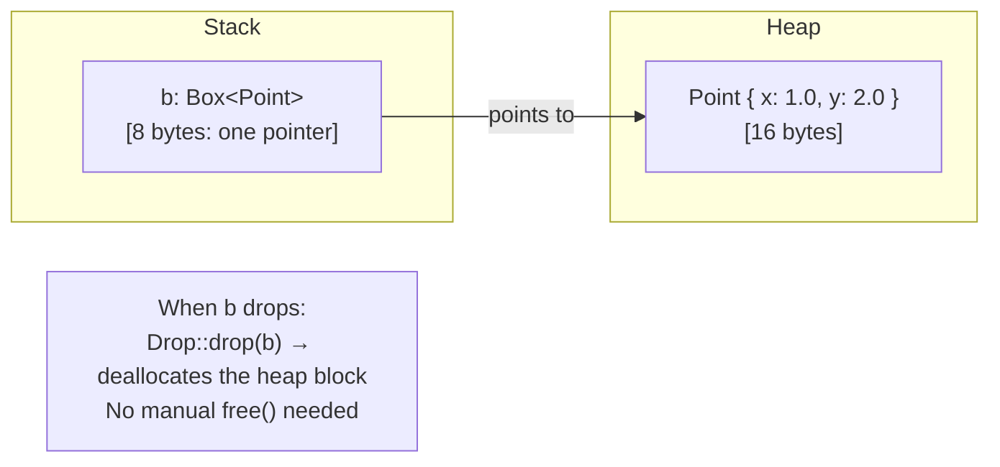
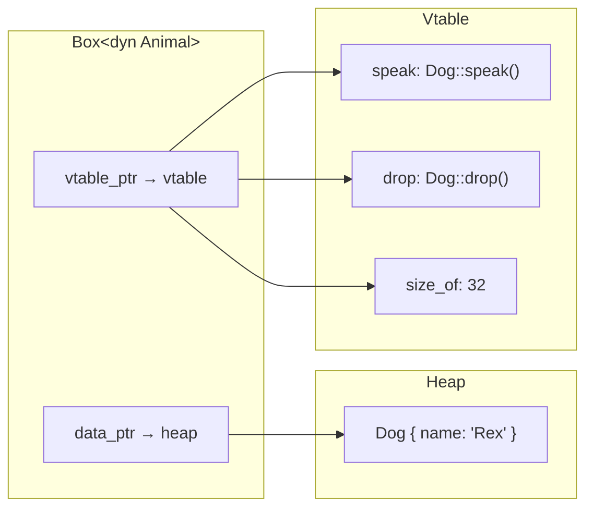

# Chapter 9: Box and the Sized Trait 🟡

> **What you'll learn:**
> - How `Box<T>` provides simple, owned heap allocation with no overhead beyond the allocation itself
> - The `Sized` trait and why unsized types (`dyn Trait`, `[T]`, `str`) must be accessed through pointers
> - How `Box<dyn Trait>` enables dynamic dispatch and runtime polymorphism
> - When to choose `Box<T>` vs `Rc<T>` vs `Arc<T>` vs inlining the value

---

## 9.1 `Box<T>`: The Simplest Heap Allocator

`Box<T>` is a pointer to a heap-allocated value of type `T`. It has exactly one owner (unlike `Rc`/`Arc`), zero reference-counting overhead, and implements `Deref<Target = T>` for transparent access.



```rust
// Simple Box usage
let b = Box::new(Point { x: 1.0, y: 2.0 });

// Deref coercion: you can use b exactly like a Point reference
println!("x = {}", b.x); // ✅ auto-derefs

// *b gives the value (moved out of the Box)
let point: Point = *b; // ✅ moves the Point out of the heap onto the stack
                        // b is now invalid; the heap memory is freed

// Box implements DerefMut too:
let mut b2 = Box::new(vec![1, 2, 3]);
b2.push(4); // ✅ mutates the Vec on the heap
```

**When to use `Box<T>` instead of just `T`:**

| Situation | Reason for `Box<T>` |
|---|---|
| Recursive types (e.g., linked list, tree nodes) | Size of `T` would be infinite without indirection |
| Very large types (>~1KB) being returned from functions | Avoid copying large amounts of stack data |
| Dynamic dispatch (`dyn Trait`) | Trait objects are unsized; must be behind a pointer |
| Heap allocation of `!Unpin` types for `Pin<Box<T>>` | See Chapter 6 and async Rust |
| Transfer of ownership across an FFI boundary | Pass a stable heap address to C code |

---

## 9.2 Recursive Types: The Classic `Box` Use Case

Consider a linked list:

```rust
// ❌ FAILS: error[E0072]: recursive type `List` has infinite size
enum List {
    Cons(i32, List), // ← List contains List contains List contains...
    Nil,
}
// The compiler needs to know the size of List at compile time.
// Since Cons contains another List, the size is: 4 + sizeof(List) = ∞

// ✅ FIX: Use Box to add one level of indirection
// Box<List> has a known, fixed size: one pointer (8 bytes on 64-bit)
enum List {
    Cons(i32, Box<List>),
    Nil,
}

let list = List::Cons(1,
    Box::new(List::Cons(2,
        Box::new(List::Cons(3,
            Box::new(List::Nil))))));
```

The `Box` adds exactly one pointer-dereference of overhead. The list nodes are heap-allocated, as is typical for linked lists in any language.

---

## 9.3 The `Sized` Trait and Unsized Types

In Rust, every type has a *size* known at compile time — measured in bytes. This is the `Sized` trait. Almost every type you write is automatically `Sized`.

But some types are deliberately *not* `Sized`:

| Unsized Type | Description | Fixed-size access |
|---|---|---|
| `str` | UTF-8 string data of unknown length | `&str` (ptr + len) |
| `[T]` | Slice of unknown number of T elements | `&[T]` (ptr + len) |
| `dyn Trait` | A value of unknown concrete type implementing Trait | `&dyn Trait` or `Box<dyn Trait>` (ptr + vtable ptr) |

You cannot have a bare unsized type on the stack — its size is unknown. You must access them through a *fat pointer*: a pointer that carries extra metadata.

```rust
// These compile:
let s: &str = "hello";         // fat pointer: (ptr, len)
let sl: &[i32] = &[1, 2, 3];  // fat pointer: (ptr, len)

// These don't:
// let s: str = *"hello";       // ❌ error[E0277]: `str` doesn't have a size known at compile-time
// let t: dyn Display = ...;    // ❌ same error
```

### `?Sized` Bounds

If you want a generic function or struct to work with *both* sized and unsized types, use the `?Sized` bound — this is "maybe Sized" (opting out of the implicit `Sized` constraint):

```rust
// Default: T must be Sized (implicit bound)
fn print<T: std::fmt::Display>(val: T) { println!("{}", val); }

// With ?Sized: T can be unsized (but must be behind a reference)
fn print_ref<T: std::fmt::Display + ?Sized>(val: &T) { println!("{}", val); }

print_ref("hello world"); // ✅ &str — T = str (unsized)
print_ref(&42u32);        // ✅ &u32 — T = u32 (sized)
print_ref(&[1u32, 2, 3]); // ✅ &[u32] — T = [u32] (unsized)
```

---

## 9.4 `Box<dyn Trait>`: Dynamic Dispatch and Runtime Polymorphism

This is where `Box` shines for object-oriented-style design in Rust. A `Box<dyn Trait>` is a **trait object**: a fat pointer containing:
1. A data pointer to the concrete value on the heap
2. A vtable pointer to the concrete type's method implementations



```rust
trait Animal {
    fn speak(&self);
    fn name(&self) -> &str;
}

struct Dog { name: String }
struct Cat { name: String }

impl Animal for Dog {
    fn speak(&self) { println!("{} says: Woof!", self.name); }
    fn name(&self) -> &str { &self.name }
}

impl Animal for Cat {
    fn speak(&self) { println!("{} says: Meow!", self.name); }
    fn name(&self) -> &str { &self.name }
}

// dyn Animal: we don't know the concrete type at compile time
fn make_sounds(animals: &[Box<dyn Animal>]) {
    for animal in animals {
        animal.speak(); // dispatched through vtable at runtime
    }
}

fn main() {
    let animals: Vec<Box<dyn Animal>> = vec![
        Box::new(Dog { name: "Rex".to_string() }),
        Box::new(Cat { name: "Whiskers".to_string() }),
        Box::new(Dog { name: "Buddy".to_string() }),
    ];

    make_sounds(&animals); // ✅ Polymorphic dispatch
}
```

**`Box<dyn Trait>` vs generics (`impl Trait`):**

| | `Box<dyn Trait>` | `fn foo<T: Trait>(val: T)` / `fn foo(val: impl Trait)` |
|---|---|---|
| Dispatch | Runtime (vtable) | Compile-time (monomorphized) |
| Performance | Slightly slower (indirect call, possible cache miss) | Faster (direct call, inlined) |
| Code size | Smaller (one copy of `make_sounds`) | Larger (one copy per concrete type) |
| Heterogeneous collections | ✅ `Vec<Box<dyn Trait>>` | ❌ All elements must be the same type |
| Trait object safety required | ✅ Yes | ❌ No |
| Returned from function | ✅ `-> Box<dyn Trait>` | ✅ `-> impl Trait` (single concrete type) |

**Object safety:** Not all traits can be made into trait objects. A trait is **object-safe** if:
- Its methods don't have generic type parameters
- Its methods don't use `Self` by value (except in `Box<Self>`)
- It doesn't require `Sized` (no `where Self: Sized`)

```rust
trait Printable: std::fmt::Display {} // object-safe: Display has no generic methods

// ❌ NOT object-safe:
trait Clone2 {
    fn clone2(&self) -> Self; // returns Self — size of Self unknown for dyn
}
// Box<dyn Clone2> is impossible
```

---

## 9.5 `Box<T>` in Practice: When to Pick It

```mermaid
flowchart TD
    Q1{"Do you need\nsingle ownership?"}
    Q1 -->|Yes| Q2{"Does the type\nneed to be on the heap?"}
    Q1 -->|No - shared| SharedOwnership["Use Rc&lt;T&gt; (single-threaded)\nor Arc&lt;T&gt; (multi-threaded)"]

    Q2 -->|No, it's sized and smallish| Stack["Keep it on the stack\n(no Box needed)"]
    Q2 -->|Yes: large, recursive|\nor dyn Trait| Box["Box&lt;T&gt; or Box&lt;dyn Trait&gt;"]

    Box --> Q3{"Need\ndynamic dispatch?"}
    Q3 -->|Yes| DynTrait["Box&lt;dyn Trait&gt;\nRuntime vtable dispatch"]
    Q3 -->|No| ConcreteBox["Box&lt;T&gt;\nOwned heap allocation\nTransparent via Deref"]
```

---

<details>
<summary><strong>🏋️ Exercise: Implementing a Heterogeneous Pipeline</strong> (click to expand)</summary>

**Challenge:**

Design a `Pipeline` that holds a sequence of processing stages. Each stage implements a `Stage` trait with a `process(&self, input: &str) -> String` method. The pipeline applies each stage in order and returns the final result. Stages can be of different concrete types — use `Box<dyn Stage>`.

```rust
trait Stage {
    fn process(&self, input: &str) -> String;
}

struct Pipeline {
    // Your field here
}

impl Pipeline {
    fn new() -> Self { todo!() }
    fn add_stage(mut self, stage: impl Stage + 'static) -> Self { todo!() }
    fn run(&self, input: &str) -> String { todo!() }
}

// Implement at least two Stage types:
// 1. Uppercase: converts input to UPPERCASE
// 2. Trim: trims leading/trailing whitespace
// 3. Prefix(String): prepends a string
```

<details>
<summary>🔑 Solution</summary>

```rust
trait Stage {
    fn process(&self, input: &str) -> String;
}

struct Pipeline {
    stages: Vec<Box<dyn Stage>>,
    // Box<dyn Stage>: each stage can be a different concrete type
    // 'static bound required because we're storing in a Vec
    // (no lifetime parameters to track)
}

impl Pipeline {
    fn new() -> Self {
        Pipeline { stages: Vec::new() }
    }

    fn add_stage(mut self, stage: impl Stage + 'static) -> Self {
        // impl Stage + 'static: the concrete type stays in heap memory via Box
        self.stages.push(Box::new(stage));
        self // builder pattern: returns Self for chaining
    }

    fn run(&self, input: &str) -> String {
        // fold over stages, passing the output of each as input to the next
        self.stages.iter().fold(input.to_string(), |acc, stage| {
            stage.process(&acc)
        })
    }
}

// Stage implementations:
struct Uppercase;
impl Stage for Uppercase {
    fn process(&self, input: &str) -> String {
        input.to_uppercase()
    }
}

struct Trim;
impl Stage for Trim {
    fn process(&self, input: &str) -> String {
        input.trim().to_string()
    }
}

struct Prefix(String);
impl Stage for Prefix {
    fn process(&self, input: &str) -> String {
        format!("{}{}", self.0, input)
    }
}

struct Replace { from: String, to: String }
impl Stage for Replace {
    fn process(&self, input: &str) -> String {
        input.replace(&self.from, &self.to)
    }
}

fn main() {
    let result = Pipeline::new()
        .add_stage(Trim)
        .add_stage(Uppercase)
        .add_stage(Prefix("[LOG] ".to_string()))
        .add_stage(Replace { from: "WORLD".to_string(), to: "RUST".to_string() })
        .run("  hello world  ");

    println!("{}", result);
    // "[LOG] HELLO RUST"

    // The pipeline holds Vec<Box<dyn Stage>>:
    // stages[0] = Box<Trim>
    // stages[1] = Box<Uppercase>
    // stages[2] = Box<Prefix>
    // stages[3] = Box<Replace>
    // Each box points to a different concrete type on the heap.
    // Dispatch through 'process' uses the vtable for each.
}
```

</details>
</details>

---

> **Key Takeaways**
> - `Box<T>` is a single-owner heap pointer: zero runtime overhead beyond the allocation cost, automatic deallocation via `Drop`
> - Recursive types require `Box` to break the infinite-size cycle at compile time
> - Unsized types (`str`, `[T]`, `dyn Trait`) must live behind fat pointers that carry size or vtable metadata
> - `Box<dyn Trait>` enables runtime polymorphism (dynamic dispatch) with a small overhead: one extra indirection through a vtable
> - Use `impl Trait` (generics) when the concrete type is known at compile time; use `dyn Trait` when the type varies at runtime

> **See also:**
> - [Chapter 7: Rc and Arc](ch07-rc-and-arc.md) — when shared ownership is needed instead of single ownership
> - [Chapter 6: Struct Lifetimes](ch06-struct-lifetimes.md) — `Pin<Box<T>>` for self-referential structs
