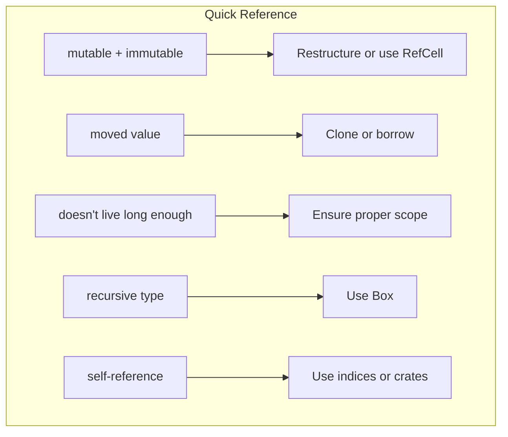

# Chapter 10: Common Borrow Checker Pitfalls 🔴

> **What you'll learn:**
> - The 9 most common borrow checker errors
> - Why each error occurs and how to fix it
> - Production patterns: NLL, splitting borrows, and shadowing
> - Mental models for avoiding these pitfalls

---

## The Big Nine

These are the borrow checker errors you'll encounter most frequently. Let's tackle them one by one.

### Error 1: "Cannot borrow as mutable more than once"

```rust
fn main() {
    let mut s = String::from("hello");
    
    let r1 = &mut s;
    let r2 = &mut s; // ❌ FAILS: can't have two mutable borrows
    
    r1.push_str(" world");
    r2.push_str("!");
}
```

**The problem:** You can't have two mutable references to the same data simultaneously.

**The fix:** Restructure to use one mutable borrow at a time:

```rust
fn main() {
    let mut s = String::from("hello");
    
    {
        let r1 = &mut s;
        r1.push_str(" world");
    } // r1 goes out of scope
    
    {
        let r2 = &mut s;
        r2.push_str("!");
    }
    
    println!("{}", s);
}
```

### Error 2: "Borrowed value does not live long enough"

```rust
fn main() {
    let r;
    {
        let x = 5;
        r = &x; // ❌ FAILS: x doesn't live long enough
    }
    println!("{}", r); // x is dropped, r is dangling!
}
```

**The problem:** The reference outlives the data it points to.

**The fix:** Ensure the reference's lifetime is contained within the data's lifetime:

```rust
fn main() {
    let r;
    let x = 5;
    r = &x; // ✅ OK: x lives as long as r
    
    println!("{}", r);
}
```

### Error 3: "Cannot borrow as immutable while mutable borrow exists"

```rust
fn main() {
    let mut s = String::from("hello");
    
    let r1 = &mut s;
    let r2 = &s; // ❌ FAILS: can't read while r1 is alive
    
    println!("{} {}", r1, r2);
}
```

**The problem:** Can't read (immutable borrow) while there's an active mutable borrow.

**The fix:** Read first, then write:

```rust
fn main() {
    let mut s = String::from("hello");
    
    // Read first
    let r2 = &s;
    println!("First read: {}", r2);
    
    // Then write
    let r1 = &mut s;
    r1.push_str(" world");
    
    println!("{}", s);
}
```

### Error 4: "Use of moved value"

```rust
fn main() {
    let s1 = String::from("hello");
    let s2 = s1; // Move!
    
    println!("{}", s1); // ❌ FAILS: s1 was moved
}
```

**The problem:** You moved a non-Copy type.

**The fix:** Either clone, or don't move:

```rust
fn main() {
    let s1 = String::from("hello");
    let s2 = s1.clone(); // Clone - both valid
    
    println!("{} {}", s1, s2);
}
```

### Error 5: "Cannot move out of"

This happens when trying to move a field out of a borrowed struct:

```rust
struct Person {
    name: String,
}

fn main() {
    let p = Person { name: String::from("Alice") };
    
    let name = p.name; // ❌ FAILS: can't move out of borrowed
}
```

**The fix:** Clone, borrow, or use `take`:

```rust
// Option 1: Clone
let name = p.name.clone();

// Option 2: Borrow
let name = &p.name;

// Option 3: Take (if using Option)
// let name = p.name.take(); // Person now has name: None
```

### Error 6: "Field cannot be returned as part of output"

```rust
struct Container<'a> {
    data: &'a str,
}

fn get_data<'a>(c: &'a Container<'a>) -> &'a str {
    c.data // Works!
}

// But for self-referential:
struct Broken {
    data: String,
    // Can't do this:
    // prefix: &str,
}
```

We've covered this in Chapter 6. Use indices instead.

### Error 7: "Multiple mutable references when one was intended"

```rust
fn main() {
    let mut v = vec![1, 2, 3, 4, 5];
    
    let first = &v[0];
    v.push(6); // ❌ FAILS: cannot push while first borrows
}
```

**The fix:** Use indices or split borrows:

```rust
fn main() {
    let mut v = vec![1, 2, 3, 4, 5];
    
    // Option 1: Use index instead of reference
    let idx = 0;
    v.push(6);
    println!("{}", v[idx]);
    
    // Option 2: Collect values first
    let first = v[0];
    v.push(7);
}
```

### Error 8: "Lifetime mismatch"

```rust
fn foo<'a>(x: &'a str, y: &str) -> &'a str {
    // ❌ FAILS: y's lifetime isn't related to 'a
    if x.len() > y.len() { x } else { y }
}
```

**The fix:** Add lifetime constraints:

```rust
fn foo<'a, 'b>(x: &'a str, y: &'b str) -> &'a str {
    if x.len() > y.len() { x } else { x } // Only return x
}

// Or if you want to return either:
fn longest<'a, 'b>(x: &'a str, y: &'b str) -> &'a str {
    if x.len() > y.len() { x } else { x } // Can only return x
}
```

### Error 9: "Cannot infer type"

```rust
fn main() {
    let v = Vec::new();
    v.push(1); // ❌ FAILS: can't infer type
}
```

**The fix:** Provide type hints:

```rust
fn main() {
    // Option 1: Type annotation
    let v: Vec<i32> = Vec::new();
    v.push(1);
    
    // Option 2: Use turbofish
    let mut v = Vec::<i32>::new();
    v.push(1);
    
    // Option 3: Use vec! macro
    let mut v = vec![];
    v.push(1);
}
```

## Production Patterns

### Pattern 1: Non-Lexical Lifetimes (NLL)

Rust 2018 introduced NLL, which makes borrows end earlier:

```rust
fn main() {
    let mut s = String::from("hello");
    
    let r1 = &s;
    println!("{}", r1); // r1's borrow ends here
    
    let r2 = &mut s; // ✅ Works with NLL: r1's borrow is over
    r2.push_str(" world");
}
```

Before NLL, the immutable borrow would last until the end of scope!

### Pattern 2: Splitting Borrows

Instead of borrowing a whole struct, borrow individual fields:

```rust
struct Point {
    x: i32,
    y: i32,
}

fn main() {
    let mut p = Point { x: 1, y: 2 };
    
    // ❌ FAILS: can't borrow p.x and p.y separately as mutable
    // let rx = &mut p.x;
    // let ry = &mut p.y;
    
    // ✅ FIX: use a temporary
    let (x, y) = (p.x, p.y); // Copy (i32 is Copy)
    p.x = x + 1;
    p.y = y + 1;
}
```

### Pattern 3: Shadowing

You can shadow a variable to effectively "reset" the borrow:

```rust
fn main() {
    let mut s = String::from("hello");
    
    let s = &s; // Shadow with immutable borrow
    println!("{}", s);
    
    // s is now the reference, not the String
    
    let mut s = String::from("world"); // Shadow again with new String
    s.push_str("!");
    println!("{}", s);
}
```

### Pattern 4: RefCell for Internal Mutation

When you need interior mutability:

```rust
use std::cell::RefCell;

struct Container {
    data: RefCell<Vec<i32>>,
}

fn main() {
    let c = Container {
        data: RefCell::new(vec![1, 2, 3]),
    };
    
    // Borrow mutably to modify
    c.data.borrow_mut().push(4);
    
    println!("{:?}", c.data.borrow());
}
```



<details>
<summary><strong>🏋️ Exercise: Fix All the Errors</strong> (click to expand)</summary>

**Challenge:** Fix each error:

```rust
// 1.
let mut v = vec![1, 2, 3];
let first = &v[0];
v.push(4);

// 2.
let s = String::from("hello");
let r = &s;

// 3.
fn foo(x: &mut i32, y: &i32) {}
let mut x = 5;
let y = 10;
foo(&mut x, &y);
```

<details>
<summary>🔑 Solution</summary>

**1. Fix: Use index instead of reference**
```rust
let mut v = vec![1, 2, 3];
let idx = 0; // Store index
v.push(4);
println!("{}", v[idx]); // Use index
```

**2. Fix: Scope the borrow**
```rust
let s = String::from("hello");
{
    let r = &s;
    println!("{}", r);
}
// r is dropped, s is valid again
println!("{}", s);
```

**3. This actually works!**
The issue would be:
```rust
fn foo(x: &mut i32, y: &i32) {}
let mut x = 5;
let y = 10;
foo(&mut x, &y); // This works because y is immutably borrowed
// The mutable borrow ends after foo returns
```

If you need both mutable at the same time:
```rust
fn modify_both(x: &mut i32, y: &mut i32) {
    *x += *y;
}
let mut x = 5;
let mut y = 10;
modify_both(&mut x, &mut y);
```

</details>
</details>

> **Key Takeaways:**
> - The most common errors are around concurrent borrowing and ownership transfer
> - Restructure code to avoid conflicting borrows
> - Use indices instead of references when data might reallocate
> - NLL makes many historical borrow issues no longer problems
> - When in doubt, clone or use interior mutability

> **See also:**
> - [Chapter 4: Borrowing and Aliasing](./ch04-borrowing-and-aliasing.md) - The borrowing rules
> - [Chapter 8: Interior Mutability](./ch08-interior-mutability.md) - RefCell and Mutex
> - [Chapter 11: The 'static Bound vs. 'static Lifetime](./ch11-the-static-bound-vs-static-lifetime.md) - Lifetime bounds
