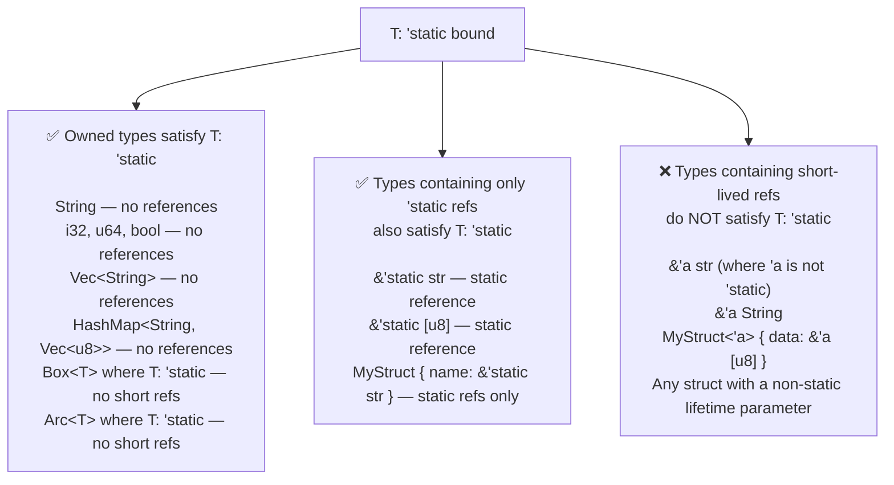

# Chapter 11: The `'static` Bound vs. `'static` Lifetime 🔴

> **What you'll learn:**
> - The precise meaning of `'static` as a *lifetime* (how long a reference is valid)
> - The precise meaning of `'static` as a *trait bound* (`T: 'static`) — which is *completely different*
> - Why `T: 'static` does not mean "T is a global variable" or "T lives forever"
> - The specific contexts where each form appears and how to reason about them correctly

---

## 11.1 The Most Misunderstood Thing in Rust

Survey experienced Rust users and ask: "What does `T: 'static` mean?" A significant fraction will say something like "T must be a static variable" or "T lives for the whole program." Both are wrong.

This misconception causes real friction — especially when working with threads, async code, or dynamic dispatch — because `T: 'static` appears everywhere, and misunderstanding it leads to:
- Unnecessary `Box::leak()` calls
- Unnecessary `Arc<String>` instead of `String`
- Confusion about why `String` satisfies `T: 'static` but `&'a String` doesn't

Let's fix this permanently.

---

## 11.2 `'static` as a Lifetime: The Reference That Never Expires

When used as a lifetime annotation on a *reference*, `'static` means the reference is valid for the *entire duration of the program*. Data with a `'static` lifetime:
- Is typically stored in the program's binary (string literals, constants)
- Never gets freed (either it has no destructor, or it's leaked)
- Outlives all scopes, all threads, all stack frames

```mermaid
gantt
    title 'static vs 'a lifetime comparison
    dateFormat X
    axisFormat %s
    section Program
    Program running : 0, 100
    section 'static
    'static ref valid : 0, 100
    section 'a (some scope)
    'a ref valid : 20, 50
```



```rust
// String literals have type &'static str
let hello: &'static str = "Hello, world!";
// "Hello, world!" is compiled into the binary's read-only data section.
// It lives there for the entire runtime — hence 'static.

// Constants also have 'static lifetime
const MAX_SIZE: usize = 1024;
static LOG_PREFIX: &str = "[LOG]"; // type: &'static str

// Functions can explicitly return 'static references to literals:
fn get_error() -> &'static str {
    "something went wrong" // lives in the binary
}
```

**Creating `'static` references at runtime:**

```rust
// Box::leak: allocate on the heap and intentionally leak it (never freed)
// Returns &'static mut T — the allocation lives until the process exits
let static_string: &'static str = Box::leak(String::from("runtime static").into_boxed_str());
// Use sparingly — this is a deliberate memory leak for static initialization

// Once: a common pattern with lazy_static or std::sync::OnceLock
use std::sync::OnceLock;
static CONFIG: OnceLock<String> = OnceLock::new();
CONFIG.get_or_init(|| "production".to_string());
let s: &'static String = CONFIG.get().unwrap(); // &'static String
```

---

## 11.3 `T: 'static` as a Trait Bound: "Contains No Short-Lived References"

When `'static` appears as a **trait bound** (`T: 'static`), it means something completely different:

> **`T: 'static` means: "T does not contain any references with a non-static lifetime."**

In other words, T is *self-contained*: it either holds no references at all, or only holds references that live for the entire program (`'static` references like string literals).

**This is a constraint on what T *contains*, not on where T *lives* or *how long it lives*.**



---

## 11.4 Concrete Examples of What Satisfies `T: 'static`

```rust
use std::fmt::Debug;

fn require_static<T: 'static + Debug>(val: T) {
    println!("{:?}", val);
}

// ✅ All owned types satisfy T: 'static
require_static(42u32);                           // u32: no references
require_static(String::from("hello"));           // String: no references
require_static(vec![1, 2, 3]);                   // Vec<i32>: no references
require_static(std::collections::HashMap::<String, u32>::new()); // no references

// ✅ 'static references satisfy T: 'static
require_static("hello world");                   // &'static str ✅

// ✅ Structs without lifetime parameters satisfy T: 'static (usually)
#[derive(Debug)]
struct Config {
    host: String,   // owned String — no non-static references
    port: u16,
}
require_static(Config { host: "localhost".to_string(), port: 8080 }); // ✅

// ❌ References with non-static lifetimes do NOT satisfy T: 'static
let local = String::from("local");
// require_static(&local); // ❌ error: `local` does not live long enough
                           // &local has lifetime 'a (the local scope), not 'static

// ❌ Structs holding non-static references do NOT satisfy T: 'static
#[derive(Debug)]
struct Excerpt<'a> {
    text: &'a str,
}
let novel = String::from("foo");
let excerpt = Excerpt { text: &novel };
// require_static(excerpt); // ❌ Excerpt<'_> doesn't satisfy 'static because it holds &novel
```

---

## 11.5 Why `T: 'static` Appears in `thread::spawn` and Async

The most common place you encounter `T: 'static` is with `std::thread::spawn`:

```rust
pub fn spawn<F, T>(f: F) -> JoinHandle<T>
where
    F: FnOnce() -> T,
    F: Send + 'static,  // ← here it is
    T: Send + 'static,
```

Why? Because spawned threads can outlive the function that spawned them. If a thread held a reference `&'a str` where `'a` is the caller's local scope, that reference could become dangling when the caller returns. `F: 'static` prevents this by ensuring the closure doesn't capture any short-lived references.

```rust
use std::thread;

let local = String::from("hello");

// ❌ FAILS: error[E0597]: `local` does not live long enough
let handle = thread::spawn(|| {
    println!("{}", local); // captures &local — 'a is the current scope
});
handle.join().unwrap();
// local might have been dropped before the thread runs!

// ✅ FIX 1: Move the value into the closure (closure owns it)
let local = String::from("hello");
let handle = thread::spawn(move || {
    println!("{}", local); // local is MOVED into the closure — closure owns it
});
handle.join().unwrap();

// ✅ FIX 2: Use Arc to share ownership across thread and caller
use std::sync::Arc;
let local = Arc::new(String::from("hello"));
let local_clone = Arc::clone(&local);
let handle = thread::spawn(move || {
    println!("{}", local_clone); // closure owns an Arc handle
});
handle.join().unwrap();
println!("{}", local); // ✅ Arc is still alive in main
```

---

## 11.6 The Critical Asymmetry: `T: 'static` Does Not Mean `T` Lives Forever

A `T: 'static` value can be **created, used, and dropped** like any other value. The `'static` bound is about what the value *contains* — not about the value's own lifetime.

```rust
fn demonstrate() {
    // String satisfies 'static (contains no non-static refs)
    // But a String created here is dropped at the end of this function:
    let s: String = String::from("hello");
    // s lives for this function's scope — not "forever"
    // But s satisfies T: 'static because s contains no references at all

    process_static(s); // s moved into process_static, dropped there
    // The 'static bound does NOT mean s is immortal
}

fn process_static<T: 'static>(val: T) {
    // val is dropped at the end of this function
    // T: 'static just means val doesn't contain short-lived references
    println!("Processing...");
}
// val dropped here — not "static" in the sense of immortal!
```

**The clearest mental model:**

> `T: 'static` means: "If I store a copy of T anywhere I want — in a thread, in a global, in a `Box::leak` — it will remain valid forever, because T holds no short-lived references that could dangle."

It's about **freedom to store** — not about **actual duration of storage**.

---

## 11.7 Comparison Table: `'static` Lifetime vs `T: 'static` Bound

| | `&'static T` | `T: 'static` |
|---|---|---|
| **What it is** | A reference | A constraint on a generic type |
| **What it means** | This reference is valid forever | T contains no short-lived references |
| **Does it mean T/data lives forever?** | ✅ The data behind the ref lives forever | ❌ T can be created and dropped normally |
| **Satisfied by** | String literals, `Box::leak`, `static` variables | Any owned type (`String`, `Vec`, structs without lifetime params) |
| **Not satisfied by** | References to local variables | `&'a T` where `'a` is not `'static` |
| **Common location** | Return types of functions returning refs to globals | `thread::spawn`, `async` blocks, `Box<dyn Trait + 'static>` |

---

<details>
<summary><strong>🏋️ Exercise: Diagnosing `'static` Errors</strong> (click to expand)</summary>

**Challenge:**

For each snippet, explain:
1. Whether the error involves `&'static T` (reference lifetime) or `T: 'static` (trait bound)
2. The precise reason for the error
3. The minimum-change fix

```rust
// Snippet A
fn get_name() -> &str {
    let s = String::from("Alice");
    &s
}

// Snippet B
use std::thread;
fn spawn_worker(label: &str) {
    thread::spawn(move || {
        println!("Worker: {}", label);
    });
}

// Snippet C
fn store_callback(f: Box<dyn Fn()>) {
    // Stores f — but where? In a static:
    static CALLBACK: std::sync::OnceLock<Box<dyn Fn()>> = std::sync::OnceLock::new();
    CALLBACK.set(f).ok();
}
fn main() {
    let prefix = String::from("hello");
    store_callback(Box::new(move || println!("{}", prefix)));
}
```

<details>
<summary>🔑 Solution</summary>

**Snippet A:** `&'static T` (reference lifetime)
```
error[E0106]: missing lifetime specifier
```
- **Cause:** Returning a reference to a local variable. `s` is dropped when `get_name()` returns. The returned reference would point to freed stack memory.
- **Fix:**
```rust
fn get_name() -> String { String::from("Alice") }    // return owned
// OR
fn get_name() -> &'static str { "Alice" }            // return literal
```

**Snippet B:** `T: 'static` (trait bound on the closure)
```
error[E0597]: `label` does not live long enough
```
- **Cause:** `thread::spawn` requires `F: 'static`. The closure captures `label: &str`, which is a non-static reference. The thread might outlive the caller's `label`.
- **Fix:**
```rust
fn spawn_worker(label: String) {  // take owned String
    thread::spawn(move || {
        println!("Worker: {}", label); // closure owns the String
    });
}
// OR:
fn spawn_worker(label: &'static str) { // require static lifetime
    thread::spawn(move || println!("Worker: {}", label));
}
```

**Snippet C:** `T: 'static` (OnceLock requires stored value to be `'static`)
```
error[E0597]: type annotation requires that `prefix` is borrowed for `'static`
```
- **Cause:** `OnceLock<Box<dyn Fn()>>` implicitly requires `Box<dyn Fn() + 'static>`. The closure captures `prefix: String` via `move`, so the closure *does* own `prefix` — this should work!
  
  Actually, this DOES compile as written because `move || println!("{}", prefix)` captures `prefix` by move, giving the closure owned `String` data. The closure type is `impl Fn() + 'static`. So Snippet C is a trick — it compiles. But if `store_callback` accepted `Box<dyn Fn() + '_>` (a non-static bound), the distinction would matter.

  To demonstrate a real error: replace `move ||` with just `||` — then `prefix` is *borrowed* by the closure, and the closure is `impl Fn() + '_` (non-static) — and `OnceLock::set` would reject it.

```rust
// This FAILS (no move — closure borrows prefix):
store_callback(Box::new(|| println!("{}", prefix))); // ❌ prefix borrowed, not 'static

// ✅ The fix: move to give the closure ownership
store_callback(Box::new(move || println!("{}", prefix))); // ✅ closure owns prefix
```

</details>
</details>

---

> **Key Takeaways**
> - `&'static T` (reference lifetime): the reference is valid for the entire program runtime — the data lives in the binary or was intentionally leaked
> - `T: 'static` (trait bound): T contains no non-static references — T itself can be created and dropped like any normal value
> - `String`, `Vec<T>`, and all other owned types satisfy `T: 'static` — because they contain no references at all
> - `&'a str` does NOT satisfy `T: 'static` unless `'a` is `'static`
> - The reason `thread::spawn` requires `'static` is thread safety — threads can outlive their spawning scope, so captured data must not contain short-lived references

> **See also:**
> - [Chapter 5: Lifetime Syntax Demystified](ch05-lifetime-syntax-demystified.md) — `'a` annotations and what lifetimes mean
> - [Chapter 12: Capstone Project](ch12-capstone-project.md) — `'static` bounds appearing naturally in a multi-threaded system
