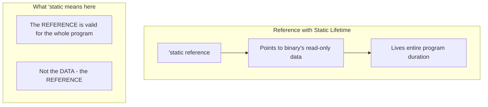
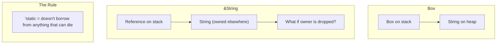
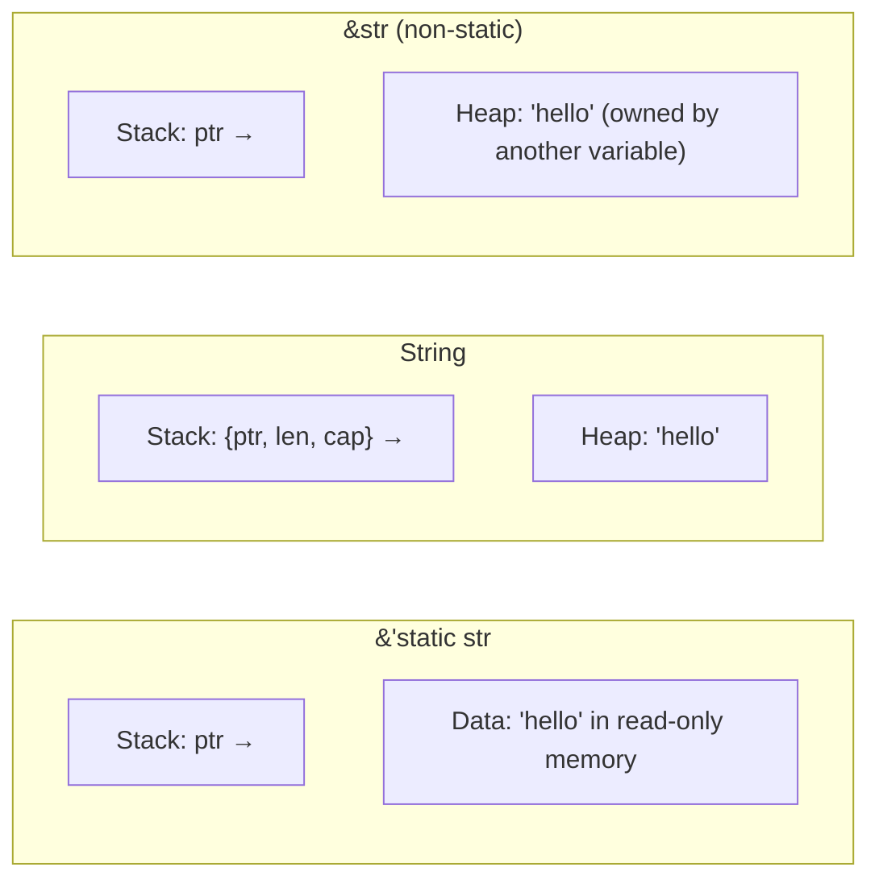

# Chapter 11: The 'static Bound vs. 'static Lifetime 🔴

> **What you'll learn:**
> - The most misunderstood concept in Rust: `'static` as a bound vs. as a lifetime
> - Why `T: 'static` doesn't mean "lives forever"
> - The difference between `&'static T` and `T: 'static`
> - When to use which form in practice

---

## The Confusion

`T: 'static` and `&'static T` look similar but mean completely different things. This confuses even experienced Rust developers.

Let me make it crystal clear:

| Syntax | Meaning |
|--------|---------|
| `&'static T` | A reference that lives for the entire program |
| `T: 'static` | A type bound meaning "T doesn't contain non-'static references" |

These are NOT the same thing.

## Understanding `&'static T`

A reference with the `'static` lifetime points to data that lives forever—typically string literals or static data:

```rust
fn main() {
    // String literals are stored in the binary's read-only section
    let s: &'static str = "hello"; // This string lives forever
    
    // Can be used anywhere, anytime
    fn use_string(s: &'static str) {
        println!("{}", s);
    }
    
    use_string("literal");
    use_string(s);
}
```



## Understanding `T: 'static`

This is a **trait bound** on a type parameter. It means:

> "The type T contains no references with shorter lifetimes"

In other words, `T: 'static` means T is "self-contained"—it doesn't borrow from anywhere.

```rust
// T: 'static bound on a function
fn process<T: 'static>(value: T) {
    // This function can accept any type that doesn't borrow
    // (or has static borrows)
}

// Examples of 'static types:
fn accepts_static<T: 'static>(_: T) {}

fn main() {
    accepts_static(42);           // i32: 'static (primitives)
    accepts_static(String::new()); // String: 'static (owns data)
    accepts_static("hello");       // &str: 'static (literal)
    
    // This would fail:
    // let x = String::from("hello");
    // accepts_static(&x); // &str (borrowing x) is NOT 'static
}
```

## The Key Insight

Here's the critical distinction:

```rust
// ✅ Box<String> implements 'static
// (Box owns the String, no borrowed data)
let owned: Box<String> = Box::new(String::from("hello"));
fn accepts<T: 'static>(_: T) {}
accepts(owned);

// ❌ &String does NOT implement 'static  
// (it borrows from another String)
let borrowed: &String = &String::from("hello");
fn accepts<T: 'static>(_: T) {}
// accepts(borrowed); // ERROR: &String is not 'static
```

### Why?

- `Box<String>` owns its data. It contains no borrowed references.
- `&String` borrows from another `String`. It contains a non-static reference.



## Common Mistake: Confusing the Two

```rust
// ❌ WRONG interpretation:
// "T must live forever"
// 
// ✅ CORRECT interpretation:
// "T doesn't contain borrowed references"

struct Container<T: 'static> {
    data: T, // T must be self-contained (own its data)
}

fn main() {
    // Works: String owns its data
    Container { data: String::from("hello") };
    
    // Won't work: reference might dangle
    // let s = String::from("hello");
    // Container { data: &s }; // ERROR: &str is not 'static
}
```

## When to Use Which

### Use `&'static T` when:
- You're returning a reference that points to static data
- You need a compile-time guarantee the reference is always valid

```rust
fn get_static_message() -> &'static str {
    "This message is baked into the binary"
}
```

### Use `T: 'static` when:
- You're writing generic functions that should accept owned or self-contained types
- You need to store a type that might contain references (to ensure they're static)

```rust
use std::thread;

fn spawn_long_lived<T: 'static + Send>(value: T) -> thread::JoinHandle<T> {
    thread::spawn(move || value)
}
```

This works because:
- `T: 'static` ensures T doesn't borrow from a local scope
- `T: Send` allows moving between threads

## The Static Trait Bound in Practice

The most common use of `T: 'static` is in thread-safe scenarios:

```rust
use std::thread;
use std::time::Duration;

fn main() {
    // This works: owned data is 'static
    let data = String::from("hello");
    let handle = thread::spawn(move || {
        // 'data' is moved into the closure
        // It's now owned by the thread - 'static
        println!("{}", data);
    });
    handle.join().unwrap();
    
    // This might not work if not 'static:
    // let s = String::from("hello");
    // let r = &s;
    // thread::spawn(move || {
    //     println!("{}", r); // ERROR: r borrows s, s won't live in thread
    // });
}
```

## Memory Layout Comparison



## Summary Table

| Syntax | Type | Meaning | Example Use Case |
|--------|------|---------|------------------|
| `&'static str` | Reference | Points to static data | String literals, config |
| `&'static mut str` | Mutable Reference | Mutable static data | Global mutables |
| `T: 'static` | Trait Bound | Type owns its data | Thread-safe generics |
| `impl Trait + 'static` | Impl Trait | Self-contained impl | Async traits |

<details>
<summary><strong>🏋️ Exercise: Static Lifetime Practice</strong> (click to expand)</summary>

**Challenge:** Determine which of these compile and why:

```rust
// 1.
fn foo<T: 'static>(_: T) {}
let x = 42;
foo(x);

// 2.
fn foo<T: 'static>(_: T) {}
let x = String::from("hello");
foo(x);

// 3.
fn foo<T: 'static>(_: T) {}
let s = String::from("hello");
let r = &s;
foo(r);

// 4.
fn foo() -> &'static str {
    let s = String::from("hello");
    &s // Can this be 'static?
}
```

<details>
<summary>🔑 Solution</summary>

**1. `foo(x)` with i32 - WORKS**
`i32` is a primitive, it owns its data, no references. `'static` bound satisfied.

**2. `foo(x)` with String - WORKS**
`String` owns its heap data. No borrowed references. `'static` bound satisfied.

**3. `foo(r)` with &String - FAILS**
`&String` borrows from `s`. Contains a non-static reference. `'static` bound NOT satisfied.

**4. `&s` as return - FAILS**
```rust
fn foo() -> &'static str {
    let s = String::from("hello");
    &s // ❌ Returns reference to dropped stack variable!
}
```
This creates a dangling pointer. The String is dropped when the function returns, but we're trying to return a reference to it.

To fix:
```rust
// Option 1: Return owned String
fn foo() -> String {
    String::from("hello")
}

// Option 2: Return static string
fn foo() -> &'static str {
    "hello"
}
```

</details>
</details>

> **Key Takeaways:**
> - `&'static T` is a reference that lives forever (points to static data)
> - `T: 'static` is a type bound meaning "doesn't contain non-static references"
> - These are fundamentally different concepts
> - Use `&'static` for references to static data
> - Use `T: 'static` for generic bounds that need self-contained types

> **See also:**
> - [Chapter 5: Lifetime Syntax Demystified](./ch05-lifetime-syntax-demystified.md) - Lifetime basics
> - [Chapter 7: Rc and Arc](./ch07-rc-and-arc.md) - Shared ownership
> - [Chapter 12: Capstone Project](./ch12-capstone-project.md) - Putting it all together
