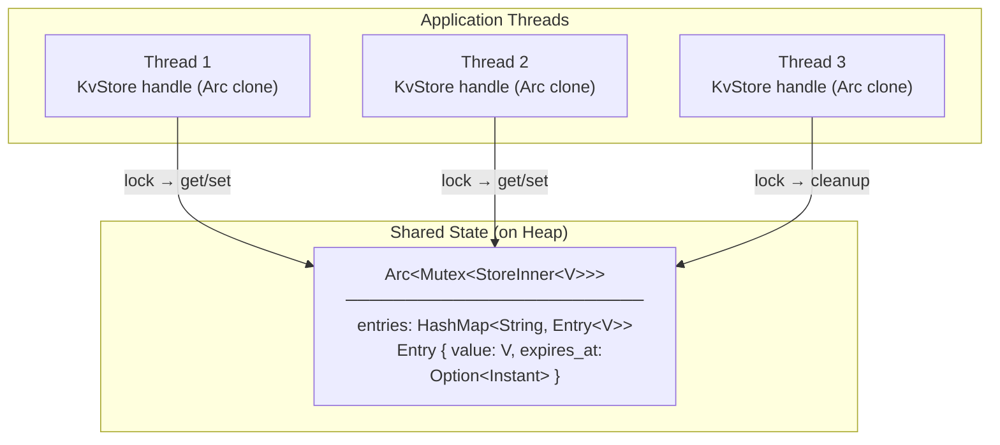
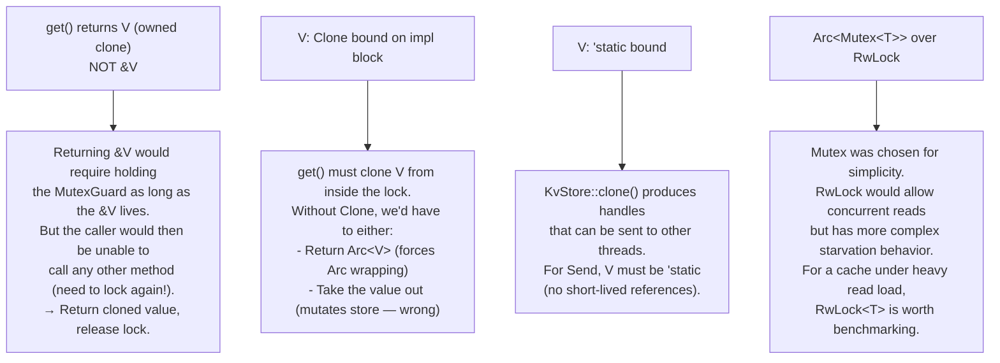

# Chapter 12: Capstone Project — In-Memory Key-Value Store with TTL 🔴

> **What you'll learn:**
> - How to combine `Arc<Mutex<T>>`, owned data, and expiry semantics into a production-grade component
> - Ownership transfer patterns for values retrieved from and inserted into a shared store
> - Thread-safe design with explicit lock-scoping to avoid deadlocks
> - Builder patterns, custom error types, and generic value types

---

## 12.1 Project Specification

We'll build `KvStore<V>` — a thread-safe, in-memory key-value store with time-to-live (TTL) support. It must:

1. Accept any `Clone + Send + Sync + 'static` value type `V`
2. Support `get`, `set`, `set_with_ttl`, `remove`, and `cleanup_expired` operations
3. Be cheaply cloneable — multiple handles to the same store (via `Arc`)
4. Be thread-safe — concurrent reads and writes must not cause data races
5. Return `Option<V>` on get (expired or missing = `None`)
6. Support explicit TTL cleanup and automatic expiry-on-access



---

## 12.2 Data Structures

```rust
use std::collections::HashMap;
use std::sync::{Arc, Mutex};
use std::time::{Duration, Instant};

/// A single entry in the store
struct Entry<V> {
    value: V,
    // None means "no expiry" — lives until explicitly removed
    expires_at: Option<Instant>,
}

impl<V> Entry<V> {
    fn new(value: V) -> Self {
        Entry { value, expires_at: None }
    }

    fn with_ttl(value: V, ttl: Duration) -> Self {
        Entry {
            value,
            expires_at: Some(Instant::now() + ttl),
        }
    }

    fn is_expired(&self) -> bool {
        self.expires_at
            .map(|expires| Instant::now() > expires)
            .unwrap_or(false)
    }
}

/// The inner (non-shared) state — held behind Mutex
struct StoreInner<V> {
    entries: HashMap<String, Entry<V>>,
}

impl<V> StoreInner<V> {
    fn new() -> Self {
        StoreInner {
            entries: HashMap::new(),
        }
    }
}

/// The public handle: cheap to clone, thread-safe
///
/// Cloning KvStore does not copy data — it increments an Arc refcount.
/// All clones share the same underlying store.
#[derive(Clone)]
pub struct KvStore<V> {
    // Arc: shared ownership across clones and threads
    // Mutex: exclusive access for writes, blocking for reads too
    //        (use RwLock if reads vastly outnumber writes)
    inner: Arc<Mutex<StoreInner<V>>>,
}
```

---

## 12.3 Core API Implementation

```rust
#[derive(Debug, PartialEq)]
pub enum KvError {
    LockPoisoned,
    KeyNotFound,
    KeyExpired,
}

impl<V: Clone + Send + 'static> KvStore<V> {
    /// Create a new empty store.
    pub fn new() -> Self {
        KvStore {
            inner: Arc::new(Mutex::new(StoreInner::new())),
        }
    }

    /// Insert a key-value pair with no expiry.
    ///
    /// Ownership: `value` is moved into the store.
    /// Returns the previous value if the key existed, or None.
    pub fn set(&self, key: impl Into<String>, value: V) -> Option<V> {
        // Lock the Mutex — blocks if another thread holds the lock
        // The MutexGuard is dropped at the end of this function (scope)
        let mut inner = self.inner.lock().unwrap();

        inner.entries
            .insert(key.into(), Entry::new(value))
            .filter(|old| !old.is_expired()) // don't return expired values
            .map(|entry| entry.value)        // unwrap the Entry, return just V
    }

    /// Insert with a time-to-live. After `ttl`, get() returns None.
    pub fn set_with_ttl(
        &self,
        key: impl Into<String>,
        value: V,
        ttl: Duration,
    ) -> Option<V> {
        let mut inner = self.inner.lock().unwrap();

        inner.entries
            .insert(key.into(), Entry::with_ttl(value, ttl))
            .filter(|old| !old.is_expired())
            .map(|entry| entry.value)
    }

    /// Retrieve a value by key.
    ///
    /// Returns None if the key doesn't exist OR has expired.
    /// Expired entries are lazily removed on access.
    ///
    /// Note: Returns an owned V (cloned from the store) — not a reference.
    /// Why? Returning &V would require holding the MutexGuard across the return,
    /// which would deadlock on any subsequent lock() call by the same thread.
    pub fn get(&self, key: &str) -> Option<V> {
        let mut inner = self.inner.lock().unwrap();

        match inner.entries.get(key) {
            Some(entry) if entry.is_expired() => {
                // Lazy expiry: remove the expired entry now
                inner.entries.remove(key);
                None
            }
            Some(entry) => Some(entry.value.clone()), // V: Clone required here
            None => None,
        }
    }

    /// Remove a key from the store. Returns the value if it existed and wasn't expired.
    pub fn remove(&self, key: &str) -> Option<V> {
        let mut inner = self.inner.lock().unwrap();

        inner.entries
            .remove(key)
            .filter(|entry| !entry.is_expired())
            .map(|entry| entry.value)
    }

    /// Remove all expired entries. Should be called periodically by a background task.
    pub fn cleanup_expired(&self) -> usize {
        let mut inner = self.inner.lock().unwrap();
        let before = inner.entries.len();
        inner.entries.retain(|_, entry| !entry.is_expired());
        before - inner.entries.len()
    }

    /// Returns the number of entries (including not-yet-lazily-cleaned expired ones).
    pub fn len(&self) -> usize {
        self.inner.lock().unwrap().entries.len()
    }

    /// Returns true if the store contains no entries.
    pub fn is_empty(&self) -> bool {
        self.len() == 0
    }
}
```

---

## 12.4 The Ownership & Lifetime Decisions, Explained

This implementation contains several deliberate ownership decisions worth examining:



---

## 12.5 Builder Pattern Extension

Let's extend with a `KvStoreBuilder` for configuration:

```rust
pub struct KvStoreBuilder<V> {
    initial_capacity: usize,
    cleanup_interval: Option<Duration>,
    _marker: std::marker::PhantomData<V>,
}

impl<V: Clone + Send + 'static> KvStoreBuilder<V> {
    pub fn new() -> Self {
        KvStoreBuilder {
            initial_capacity: 16,
            cleanup_interval: None,
            _marker: std::marker::PhantomData,
        }
    }

    pub fn initial_capacity(mut self, cap: usize) -> Self {
        self.initial_capacity = cap;
        self
    }

    pub fn with_cleanup_interval(mut self, interval: Duration) -> Self {
        self.cleanup_interval = Some(interval);
        self
    }

    pub fn build(self) -> KvStore<V> {
        let store = KvStore {
            inner: Arc::new(Mutex::new(StoreInner {
                entries: HashMap::with_capacity(self.initial_capacity),
            })),
        };

        // Spawn a background cleanup thread if interval was configured
        if let Some(interval) = self.cleanup_interval {
            let store_clone = store.clone(); // cheap Arc clone
            std::thread::spawn(move || {
                // store_clone: KvStore<V> is Send + 'static (V: Send + 'static)
                loop {
                    std::thread::sleep(interval);
                    let cleaned = store_clone.cleanup_expired();
                    if cleaned > 0 {
                        eprintln!("[KvStore] Cleaned up {} expired entries", cleaned);
                    }
                }
            });
        }

        store
    }
}
```

**Key point:** The closure passed to `thread::spawn` contains `store_clone: KvStore<V>`. For `thread::spawn` to accept this:
- `KvStore<V>` must be `Send` — it is, because `Arc<Mutex<StoreInner<V>>>` is `Send` when `V: Send`
- `KvStore<V>` must be `'static` — it is, because `Arc` holds an owned value without borrowed references

The `V: Send + 'static` bounds on the `impl` block are not bureaucracy — they are *exactly what's needed* to satisfy `thread::spawn`.

---

## 12.6 Complete Working Example

```rust
use std::time::Duration;
use std::thread;

fn main() {
    // Build a string store with 5-second cleanup interval
    let store: KvStore<String> = KvStoreBuilder::new()
        .initial_capacity(64)
        .with_cleanup_interval(Duration::from_secs(5))
        .build();

    // Basic operations
    store.set("user:1", "Alice".to_string());
    store.set("user:2", "Bob".to_string());
    store.set_with_ttl("session:abc", "token_xyz".to_string(), Duration::from_millis(100));

    println!("{:?}", store.get("user:1"));   // Some("Alice")
    println!("{:?}", store.get("user:99"));  // None

    // Wait for TTL expiry
    thread::sleep(Duration::from_millis(150));
    println!("{:?}", store.get("session:abc")); // None (expired)

    // Clone the handle — same underlying store
    let store2 = store.clone();
    store2.set("user:3", "Carol".to_string());
    println!("{:?}", store.get("user:3")); // Some("Carol") — visible through original handle

    // Multi-threaded concurrent access
    let handles: Vec<_> = (0..10).map(|i| {
        let store = store.clone(); // each thread gets its own Arc clone
        thread::spawn(move || {
            store.set(format!("thread:{}", i), format!("value-{}", i));
            // Thread-safe: Mutex ensures no data races
        })
    }).collect();

    for h in handles {
        h.join().unwrap();
    }

    println!("Store size after threads: {}", store.len()); // 12+

    // Cleanup
    store.set_with_ttl("temp:1", "x".to_string(), Duration::from_nanos(1));
    thread::sleep(Duration::from_micros(100));
    let removed = store.cleanup_expired();
    println!("Cleaned up {} entries", removed); // 1
}
```

---

## 12.7 Testing the Store

```rust
#[cfg(test)]
mod tests {
    use super::*;
    use std::time::Duration;
    use std::thread;

    #[test]
    fn test_basic_set_get() {
        let store: KvStore<i32> = KvStore::new();
        assert_eq!(store.set("k", 42), None);    // no previous value
        assert_eq!(store.get("k"), Some(42));
        assert_eq!(store.set("k", 99), Some(42)); // returns old value
        assert_eq!(store.get("k"), Some(99));
    }

    #[test]
    fn test_ttl_expiry() {
        let store: KvStore<String> = KvStore::new();
        store.set_with_ttl("key", "value".to_string(), Duration::from_millis(50));
        assert_eq!(store.get("key"), Some("value".to_string()));
        thread::sleep(Duration::from_millis(100));
        assert_eq!(store.get("key"), None); // expired
    }

    #[test]
    fn test_concurrent_access() {
        let store: KvStore<u32> = KvStore::new();
        let mut handles = vec![];

        for i in 0..100 {
            let store = store.clone();
            handles.push(thread::spawn(move || {
                store.set(format!("key:{}", i), i);
            }));
        }

        for h in handles {
            h.join().unwrap();
        }

        // All 100 entries should be present
        assert_eq!(store.len(), 100);
    }

    #[test]
    fn test_cleanup() {
        let store: KvStore<&'static str> = KvStore::new();
        for i in 0..5 {
            store.set_with_ttl(
                format!("temp:{}", i),
                "x",
                Duration::from_millis(10),
            );
        }
        store.set("permanent", "y"); // no TTL

        thread::sleep(Duration::from_millis(50));
        let removed = store.cleanup_expired();
        assert_eq!(removed, 5);
        assert_eq!(store.len(), 1);
        assert_eq!(store.get("permanent"), Some("y"));
    }
}
```

---

<details>
<summary><strong>🏋️ Extensions: Challenge Yourself</strong> (click to expand)</summary>

**These extensions require combining everything learned in this book. Estimated time: 2–4 hours each.**

**Extension 1: `get_or_insert`**

Implement `get_or_insert(&self, key, default_fn: impl Fn() -> V) -> V` — atomically returns the existing value or inserts and returns a newly-computed default. Must acquire the lock exactly once.

**Extension 2: TTL Refresh on Read**

Add a `sliding: bool` field to `Entry` — if slides is `true`, every successful `get()` call resets the TTL timer. This is the "sliding window" TTL pattern used by Redis's `EXPIRE` with reset-on-access.

**Extension 3: Capacity Limits**

Add `max_entries: Option<usize>` to `StoreInner`. When the store is at capacity on `set()`, evict the oldest non-expired entry using a `VecDeque<String>` insertion-order queue alongside the `HashMap`.

**Extension 4: Snapshot / Persistence**

Implement `fn snapshot(&self) -> HashMap<String, V>` — returns all non-expired values as an owned map (useful for serialization). Then implement `fn restore(snapshot: HashMap<String, V>) -> Self`.

**Extension 5: Typed Key Namespace**

Implement a type-safe wrapper using phantom types:
```rust
struct Key<Namespace, V> {
    raw: String,
    _marker: PhantomData<(Namespace, V)>,
}
struct UserNamespace;
let user_key: Key<UserNamespace, String> = Key::new("user:1");
// store.typed_get(user_key) returns Option<String>
// store.typed_set(user_key, "Alice".to_string())
```

<details>
<summary>🔑 Extension 1 Solution: `get_or_insert`</summary>

```rust
impl<V: Clone + Send + 'static> KvStore<V> {
    /// Returns the existing value for the key, or inserts and returns the
    /// result of calling `default_fn`. The lock is held for the entire operation
    /// to ensure atomicity — no other thread can insert between the check and insert.
    pub fn get_or_insert(&self, key: &str, default_fn: impl FnOnce() -> V) -> V {
        let mut inner = self.inner.lock().unwrap();

        // Check existence first, handling expiry
        let is_expired = inner.entries.get(key)
            .map(|e| e.is_expired())
            .unwrap_or(false);

        if is_expired {
            inner.entries.remove(key);
        }

        if let Some(entry) = inner.entries.get(key) {
            // Key exists and is not expired — return clone
            entry.value.clone()
        } else {
            // Key doesn't exist — compute default and insert
            let value = default_fn(); // called while lock is held
            let clone = value.clone(); // clone to return
            inner.entries.insert(key.to_string(), Entry::new(value));
            clone
        }
        // MutexGuard drops here — lock released
    }
}
```

</details>
</details>

---

> **Key Takeaways**
> - `Arc<Mutex<T>>` is the canonical pattern for shared mutable state across threads: `Arc` for shared ownership, `Mutex` for exclusive access
> - The MutexGuard's RAII semantics prevent deadlocks from forgotten unlocks — critical for production systems
> - `get()` returning a clone (rather than a `&V`) avoids holding the lock across user code — a classic deadlock source
> - The `V: Clone + Send + 'static` bounds are not arbitrary: `Clone` for `get()`, `Send` for thread safety, `'static` for `thread::spawn` compatibility
> - Builder patterns work well with move semantics: each `self` method consumes and returns `self`, creating an owned chain

> **See also:**
> - [Chapter 7: Rc and Arc](ch07-rc-and-arc.md) — the foundation of `Arc`
> - [Chapter 8: Interior Mutability](ch08-interior-mutability.md) — `Mutex` and `RwLock`
> - [Chapter 11: The `'static` Bound](ch11-static-lifetime.md) — why `V: 'static` is needed here
> - [Reference Card](ch13-reference-card.md) — quick lookup for when to use which pointer type
