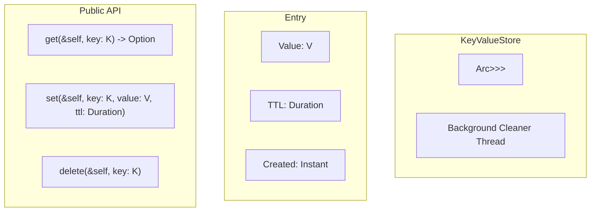

# Chapter 12: Capstone Project - In-Memory KV Store with TTL 🔴

> **What you'll learn:**
> - Building a production-grade in-memory key-value store
> - Implementing TTL (time-to-live) for entries
> - Using `Arc<Mutex<T>>` for thread-safe shared state
> - Combining ownership, borrowing, and smart pointers
> - Proper error handling and cleanup

---

## Project Overview

In this capstone, we'll build an in-memory key-value store with the following features:

1. **Thread-safe:** Multiple threads can read/write concurrently
2. **TTL support:** Entries expire after a configurable time
3. **Automatic cleanup:** Expired entries are removed
4. **Multiple ownership:** Using `Arc` for shared access

## Architecture



## Implementation

### Step 1: Define the Entry Type

```rust
use std::time::{Duration, Instant};
use std::hash::Hash;

// An entry with TTL
struct Entry<V> {
    value: V,
    expires_at: Option<Instant>,
}

impl<V> Entry<V> {
    fn new(value: V, ttl: Option<Duration>) -> Self {
        let expires_at = ttl.map(|d| Instant::now() + d);
        Entry { value, expires_at }
    }
    
    fn is_expired(&self) -> bool {
        match self.expires_at {
            Some(expires) => Instant::now() > expires,
            None => false, // No TTL = never expires
        }
    }
}
```

### Step 2: Define the Key-Value Store

```rust
use std::sync::{Arc, Mutex};
use std::collections::HashMap;
use std::time::Duration;
use std::thread;
use std::time::Instant;

pub struct KeyValueStore<K, V> {
    data: Arc<Mutex<HashMap<K, Entry<V>>>>,
    cleanup_interval: Duration,
}

impl<K, V> KeyValueStore<K, V>
where
    K: Hash + Eq + Clone,
    V: Clone,
{
    /// Create a new KeyValueStore with automatic cleanup
    pub fn new(cleanup_interval: Duration) -> Self {
        let data = Arc::new(Mutex::new(HashMap::new()));
        
        // Start background cleanup thread
        let cleanup_data = Arc::clone(&data);
        thread::spawn(move || {
            loop {
                thread::sleep(cleanup_interval);
                Self::cleanup_expired(&cleanup_data);
            }
        });
        
        KeyValueStore {
            data,
            cleanup_interval,
        }
    }
    
    /// Set a key-value pair with optional TTL
    pub fn set(&self, key: K, value: V, ttl: Option<Duration>) {
        let entry = Entry::new(value, ttl);
        let mut data = self.data.lock().unwrap();
        data.insert(key, entry);
    }
    
    /// Get a value by key (returns None if expired or missing)
    pub fn get(&self, key: &K) -> Option<V> {
        let mut data = self.data.lock().unwrap();
        
        if let Some(entry) = data.get(key) {
            if entry.is_expired() {
                // Remove expired entry
                data.remove(key);
                None
            } else {
                // Clone the value to avoid borrowing issues
                Some(entry.value.clone())
            }
        } else {
            None
        }
    }
    
    /// Delete a key
    pub fn delete(&self, key: &K) -> Option<V> {
        let mut data = self.data.lock().unwrap();
        data.remove(key).map(|e| e.value)
    }
    
    /// Clean up expired entries (called by background thread)
    fn cleanup_expired(data: &Arc<Mutex<HashMap<K, Entry<V>>>>) {
        let mut data = data.lock().unwrap();
        data.retain(|_, entry| !entry.is_expired());
    }
}
```

### Step 3: Add More Features

```rust
impl<K, V> KeyValueStore<K, V>
where
    K: Hash + Eq + Clone + std::fmt::Debug,
    V: Clone,
{
    /// Get the number of non-expired entries
    pub fn len(&self) -> usize {
        let mut data = self.data.lock().unwrap();
        data.retain(|_, entry| !entry.is_expired());
        data.len()
    }
    
    /// Check if store is empty
    pub fn is_empty(&self) -> bool {
        self.len() == 0
    }
    
    /// Print all entries (for debugging)
    pub fn debug(&self) {
        let mut data = self.data.lock().unwrap();
        data.retain(|_, entry| !entry.is_expired());
        println!("{:?}", data);
    }
}
```

### Step 4: Usage Example

```rust
use std::sync::Arc;
use std::time::Duration;
use std::thread;

fn main() {
    // Create store with 100ms cleanup interval
    let store = Arc::new(KeyValueStore::new(
        Duration::from_millis(100)
    ));
    
    // Spawn writer threads
    let store_clone = Arc::clone(&store);
    let writer = thread::spawn(move || {
        for i in 0..10 {
            store_clone.set(
                format!("key_{}", i),
                format!("value_{}", i),
                Some(Duration::from_millis(500)) // 500ms TTL
            );
            thread::sleep(Duration::from_millis(50));
        }
    });
    
    // Spawn reader threads
    let store_clone = Arc::clone(&store);
    let reader = thread::spawn(move || {
        for _ in 0..5 {
            for i in 0..10 {
                let key = format!("key_{}", i);
                if let Some(value) = store_clone.get(&key) {
                    println!("Got: {} = {}", key, value);
                }
            }
            thread::sleep(Duration::from_millis(200));
        }
    });
    
    writer.join().unwrap();
    reader.join().unwrap();
    
    // Wait for TTL to expire
    thread::sleep(Duration::from_millis(600));
    
    println!("Final size: {}", store.len());
}
```

## Key Concepts Used

| Concept | Where Used |
|---------|------------|
| `Arc` | Shared ownership across threads |
| `Mutex` | Thread-safe interior mutability |
| `HashMap` | Storage for key-value pairs |
| `Option<Duration>` | Optional TTL |
| `Clone` | Values must be cloneable |
| `Hash + Eq` | Keys must be hashable |
| Background thread | Automatic cleanup |

## Alternative Implementations

### Using RwLock for Read-Heavy Workloads

```rust
use std::sync::RwLock;

pub struct FastKeyValueStore<K, V> {
    data: Arc<RwLock<HashMap<K, Entry<V>>>>,
}

impl<K, V> FastKeyValueStore<K, V>
where
    K: Hash + Eq + Clone,
    V: Clone,
{
    pub fn get(&self, key: &K) -> Option<V> {
        let data = self.data.read().unwrap();
        // ... read logic
    }
    
    pub fn set(&self, key: K, value: V, ttl: Option<Duration>) {
        let mut data = self.data.write().unwrap();
        // ... write logic
    }
}
```

### Using DashMap for Better Concurrent Performance

```rust
// In Cargo.toml:
// dashmap = "5"

use dashmap::DashMap;

pub struct DashKeyValueStore<K, V> {
    data: Arc<DashMap<K, Entry<V>>>,
}
```

## Complete Code

```rust
use std::sync::{Arc, Mutex};
use std::collections::HashMap;
use std::time::{Duration, Instant};
use std::thread;
use std::hash::Hash;

// ============== Entry ==============
#[derive(Clone)]
struct Entry<V> {
    value: V,
    expires_at: Option<Instant>,
}

impl<V> Entry<V> {
    fn new(value: V, ttl: Option<Duration>) -> Self {
        let expires_at = ttl.map(|d| Instant::now() + d);
        Entry { value, expires_at }
    }
    
    fn is_expired(&self) -> bool {
        match self.expires_at {
            Some(expires) => Instant::now() > expires,
            None => false,
        }
    }
}

// ============== KeyValueStore ==============
pub struct KeyValueStore<K, V> {
    data: Arc<Mutex<HashMap<K, Entry<V>>>>,
    _cleanup_handle: thread::JoinHandle<()>,
}

impl<K, V> KeyValueStore<K, V>
where
    K: Hash + Eq + Clone + std::fmt::Debug,
    V: Clone,
{
    pub fn new(cleanup_interval: Duration) -> Self {
        let data = Arc::new(Mutex::new(HashMap::new()));
        let cleanup_data = Arc::clone(&data);
        
        let handle = thread::spawn(move || {
            loop {
                thread::sleep(cleanup_interval);
                Self::cleanup(&cleanup_data);
            }
        });
        
        KeyValueStore {
            data,
            _cleanup_handle: handle,
        }
    }
    
    pub fn set(&self, key: K, value: V, ttl: Option<Duration>) {
        let entry = Entry::new(value, ttl);
        let mut data = self.data.lock().unwrap();
        data.insert(key, entry);
    }
    
    pub fn get(&self, key: &K) -> Option<V> {
        let mut data = self.data.lock().unwrap();
        
        if let Some(entry) = data.get(key) {
            if entry.is_expired() {
                data.remove(key);
                None
            } else {
                Some(entry.value.clone())
            }
        } else {
            None
        }
    }
    
    pub fn delete(&self, key: &K) -> Option<V> {
        let mut data = self.data.lock().unwrap();
        data.remove(key).map(|e| e.value)
    }
    
    pub fn len(&self) -> usize {
        let mut data = self.data.lock().unwrap();
        data.retain(|_, e| !e.is_expired());
        data.len()
    }
    
    fn cleanup(data: &Arc<Mutex<HashMap<K, Entry<V>>>>) {
        let mut data = data.lock().unwrap();
        data.retain(|_, entry| !entry.is_expired());
    }
}

fn main() {
    let store = Arc::new(KeyValueStore::new(Duration::from_millis(100)));
    
    // Set some values
    store.set("name", "Alice", Some(Duration::from_secs(1)));
    store.set("count", 42, None); // Never expires
    
    println!("Get name: {:?}", store.get(&"name"));
    println!("Get count: {:?}", store.get(&"count"));
    
    thread::sleep(Duration::from_millis(200));
    
    println!("After TTL:");
    println!("Get name: {:?}", store.get(&"name")); // Should be None
    println!("Get count: {:?}", store.get(&"count")); // Still there
}
```

## What You've Built

This capstone project demonstrates:

1. **Ownership:** `Arc` provides shared ownership, `Mutex` provides interior mutability
2. **Borrowing:** Multiple threads borrow from the shared state
3. **Lifetimes:** `K: 'static` could be added if needed for thread storage
4. **Smart Pointers:** `Arc`, `Mutex`, `Box` all used appropriately
5. **Pattern Recognition:** TTL, cleanup, thread safety

> **Key Takeaways:**
> - Combine `Arc` + `Mutex` for thread-safe shared state
> - Use background threads for automatic cleanup
> - Clone values when returning from locked sections
> - `HashMap` provides O(1) average access
> - This pattern is production-ready for caching and configuration storage

> **See also:**
> - [Chapter 7: Rc and Arc](./ch07-rc-and-arc.md) - Reference counting
> - [Chapter 8: Interior Mutability](./ch08-interior-mutability.md) - Mutex and RwLock
> - [Summary and Reference Card](./ch13-summary-and-reference-card.md) - Quick reference
