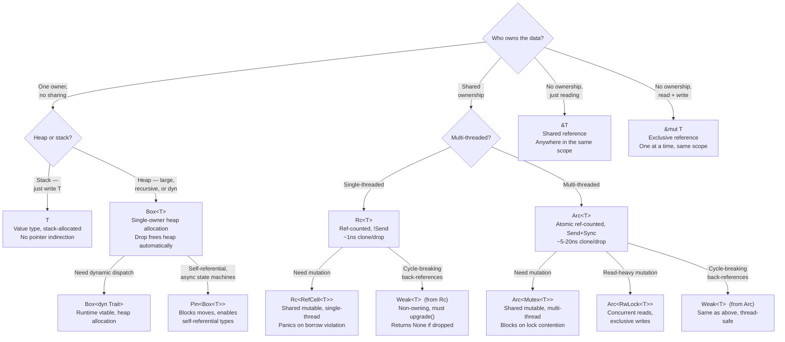

# Appendix: Summary and Reference Card

This appendix is your quick-lookup cheat sheet. Bookmark it. Refer to it when the borrow checker rejects your code and you need to pick the right tool.

---

## A.1 Ownership Quick Reference

| Operation | Result |
|---|---|
| `let b = a;` where `a: T` (T: Copy) | Bitwise copy — both `a` and `b` valid |
| `let b = a;` where `a: T` (T: !Copy) | Move — `a` is invalidated, `b` is the new owner |
| `let b = a.clone();` | Deep copy — both valid, heap re-allocated |
| `fn foo(x: T)` call with `a: T` | Move into function — `a` invalidated unless T: Copy |
| `fn foo(x: &T)` call with `&a` | Immutable borrow — `a` still valid, readable |
| `fn foo(x: &mut T)` call with `&mut a` | Exclusive borrow — `a` cannot be read or mutated concurrently |
| Value goes out of scope | `Drop::drop()` called — heap freed |

---

## A.2 Pointer Type Decision Tree



---

## A.3 Choosing Your Pointer: Summary Table

| Type | Owner | Thread-Safe | Mutability | Overhead | Use For |
|---|---|---|---|---|---|
| `T` (value) | Single | N/A | `mut` binding | Zero | Default — just use the type |
| `&T` | None (borrowed) | ✅ (`T: Sync`) | None | Zero | Read-only access, function params |
| `&mut T` | None (exclusive borrow) | N/A (exclusive) | ✅ | Zero | In-place mutation, function params |
| `Box<T>` | Single | ✅ (`T: Send`) | `mut` binding | Alloc cost | Heap alloc, recursive types, `dyn Trait` |
| `Rc<T>` | Shared | ❌ (`!Send`) | Via `RefCell` | ~1ns per clone/drop | Single-threaded shared graphs/trees |
| `Arc<T>` | Shared | ✅ | Via `Mutex`/`RwLock` | ~5–20ns per clone/drop | Multi-threaded shared state |
| `Weak<T>` | None (non-owning) | Same as Rc/Arc | None | ~ same as Rc/Arc | Back-references, breaking cycles |
| `Cell<T>` | Single | ❌ (`!Sync`) | Interior (Copy only) | ~Zero | Simple flags/counters behind `&self` |
| `RefCell<T>` | Single | ❌ (`!Sync`) | Interior (runtime check) | Runtime check | Shared mutable in single-threaded code |
| `Mutex<T>` | Single (shared via `Arc`) | ✅ | Interior (blocking) | ~OS lock overhead | Single writer, multi-threaded |
| `RwLock<T>` | Single (shared via `Arc`) | ✅ | Interior (concurrent reads) | Higher than `Mutex` | Read-heavy, infrequent writes |
| `AtomicUsize/...` | Single (shared via `Arc`) | ✅ | Interior (atomic ops) | ~1–3ns | Lock-free counters and flags |

---

## A.4 Lifetime Annotation Quick Reference

```rust
// Function: single input, single output from that input (often elided)
fn foo<'a>(x: &'a str) -> &'a str { ... }
// Elided form (same meaning):
fn foo(x: &str) -> &str { ... }

// Function: multiple inputs, output from one specific input
fn foo<'a>(x: &'a str, y: &str) -> &'a str { ... }
// (y's lifetime is independent — don't need to name it)

// Function: multiple inputs, output could come from either
fn foo<'a>(x: &'a str, y: &'a str) -> &'a str { ... }
// 'a = intersection of x's and y's lifetimes

// Struct holding a reference
struct S<'a> { field: &'a str }
// "S cannot outlive the data it borrows"

// impl block on a struct with lifetime
impl<'a> S<'a> { fn get(&self) -> &str { self.field } }

// 'static: the reference is valid for the entire program
fn get_literal() -> &'static str { "I live in the binary" }

// T: 'static: T contains no non-static references
fn spawn_bounded<T: Send + 'static>(val: T) { std::thread::spawn(move || drop(val)); }
// String, i32, Vec<u8>... all satisfy T: 'static
// &'a str (where 'a is not 'static) does NOT
```

---

## A.5 Borrow Checker Error Quick Fixes

| Error Code | Message | Root Cause | Quick Fix |
|---|---|---|---|
| E0382 | use of moved value | Value was moved | Use `clone()`, use `&val`, or restructure |
| E0499 | cannot borrow as mutable more than once | Two `&mut T` overlap | Scope restriction, NLL, split borrows |
| E0502 | cannot borrow — already borrowed as immutable | `&T` and `&mut T` overlap | Let immutable borrow expire before mutating |
| E0505 | cannot move — borrowed | Move while borrow is active | Move after last use of borrow |
| E0506 | cannot assign — borrowed | Assign to value while reference exists | Release borrow first |
| E0507 | cannot move out of borrowed content | Moving from `&T` or `Vec[i]` | `.clone()`, `mem::take()`, `into_iter()` |
| E0515 | cannot return reference to local variable | Returning ref to stack data | Return owned value or take input ref |
| E0597 | does not live long enough | Reference outlives source | Extend source's scope or return owned |

---

## A.6 Common Idioms: Before and After

```rust
// ─────────────────────────────────────────────────────────────────────────────
// IDIOM 1: Pass &str, not String, for read-only text
// ─────────────────────────────────────────────────────────────────────────────
// ❌ Over-constrained:
fn greet(name: String) { println!("Hello, {}", name); }
greet("Alice".to_string()); // unnecessary allocation

// ✅ Idiomatic:
fn greet(name: &str) { println!("Hello, {}", name); }
greet("Alice");             // works with &'static str
greet(&owned_string);       // works with &String via Deref

// ─────────────────────────────────────────────────────────────────────────────
// IDIOM 2: Accept impl Into<String> for maximum flexibility at ownership boundaries
// ─────────────────────────────────────────────────────────────────────────────
fn set_name(name: impl Into<String>) {
    let _name: String = name.into(); // callers can pass &str or String
}
set_name("Alice");                    // &str → String (alloc)
set_name(String::from("Alice"));      // String → String (no-op move)

// ─────────────────────────────────────────────────────────────────────────────
// IDIOM 3: Return Iterator instead of Vec when caller may not need all items
// ─────────────────────────────────────────────────────────────────────────────
// ❌ Allocates always:
fn evens_up_to(n: u32) -> Vec<u32> {
    (0..=n).filter(|x| x % 2 == 0).collect()
}

// ✅ Lazy, caller chooses:
fn evens_up_to(n: u32) -> impl Iterator<Item = u32> {
    (0..=n).filter(move |x| x % 2 == 0)
}
let first_even = evens_up_to(100).next(); // only computes one item

// ─────────────────────────────────────────────────────────────────────────────
// IDIOM 4: Use Entry API for "insert-or-update" operations
// ─────────────────────────────────────────────────────────────────────────────
use std::collections::HashMap;
let mut counts: HashMap<&str, u32> = HashMap::new();

// ❌ Two lookups:
if let Some(c) = counts.get_mut("key") {
    *c += 1;
} else {
    counts.insert("key", 1);
}

// ✅ One lookup via Entry API:
*counts.entry("key").or_insert(0) += 1;

// ─────────────────────────────────────────────────────────────────────────────
// IDIOM 5: Minimize lock scope to avoid deadlocks
// ─────────────────────────────────────────────────────────────────────────────
use std::sync::Mutex;
let lock = Mutex::new(vec![1, 2, 3]);

// ❌ Holds lock for println! (long operation with lock held):
let guard = lock.lock().unwrap();
println!("{:?}", *guard); // lock held during I/O
// (guard dropped here — lock released)

// ✅ Clone the data, release lock, then process:
let data = lock.lock().unwrap().clone(); // lock held only for clone (fast)
println!("{:?}", data); // lock released, no contention

// ─────────────────────────────────────────────────────────────────────────────
// IDIOM 6: Use collect_into / retain for in-place collection modification
// ─────────────────────────────────────────────────────────────────────────────
let mut v = vec![1, 2, 3, 4, 5];

// ❌ Iterate while modifying (compile error):
// for x in &v { if *x % 2 == 0 { v.remove(...); } }

// ✅ retain (in-place filter):
v.retain(|x| x % 2 != 0); // keep only odds: [1, 3, 5]
```

---

## A.7 The Ownership Mental Model: One-Page Summary

```
┌──────────────────────────────────────────────────────────────────────┐
│                    RUST OWNERSHIP IN ONE PAGE                        │
├──────────────────────────────────────────────────────────────────────┤
│                                                                      │
│  Every value has ONE owner at a time.                                │
│  When the owner goes out of scope → Drop is called → memory freed.  │
│                                                                      │
│  ┌─────────────────────────────────────────────────────────────────┐│
│  │  Assignment of non-Copy types = MOVE (not copy)                 ││
│  │  let b = a; → a is INVALID. b is the new owner.                 ││
│  └─────────────────────────────────────────────────────────────────┘│
│                                                                      │
│  ┌──────────────────────────────────┐                               │
│  │         BORROW RULES             │                               │
│  │  At any point in time:           │                               │
│  │  • N shared refs (&T)   OR       │                               │
│  │  • 1 exclusive ref (&mut T)      │                               │
│  │  • NEVER both                    │                               │
│  │  • References must not outlive   │                               │
│  │    the data they point to        │                               │
│  └──────────────────────────────────┘                               │
│                                                                      │
│  ┌────────────────────────────────────────────────────────────────┐ │
│  │  CHOOSE YOUR POINTER                                           │ │
│  │                                                                │ │
│  │  Just a value   → T                                           │ │
│  │  Read-only ref  → &T                                          │ │
│  │  Mutable ref    → &mut T                                      │ │
│  │  Heap, 1 owner  → Box<T>                                      │ │
│  │  Shared, 1 thread → Rc<T>                  + RefCell for mut  │ │
│  │  Shared, N threads → Arc<T>                + Mutex for mut    │ │
│  │  Cycle break    → Weak<T>                                     │ │
│  │  Interior mut   → Cell (Copy), RefCell (safe), Mutex (thread) │ │
│  └────────────────────────────────────────────────────────────────┘ │
│                                                                      │
│  'a lifetime = "this reference is valid for at least this scope"    │
│  T: 'static  = "T contains no non-static references"               │
│  &'static T  = "this reference is valid for the entire program"     │
│                                                                      │
└──────────────────────────────────────────────────────────────────────┘
```

---

## A.8 Further Reading

| Resource | What It Covers |
|---|---|
| [The Rust Reference — Ownership](https://doc.rust-lang.org/reference/memory-model.html) | Formal specification of Rust's memory model |
| [The Rustonomicon](https://doc.rust-lang.org/nomicon/) | Unsafe Rust, raw pointers, `UnsafeCell` internals |
| [Jon Gjengset — Crust of Rust: Lifetime Annotations](https://www.youtube.com/watch?v=rAl-9HwD858) | Deep-dive into lifetime annotations live |
| [Niko Matsakis — How the Borrow Checker Works](https://smallcultfollowing.com/babysteps/blog/2016/04/27/non-lexical-lifetimes-introduction/) | NLL design and motivation |
| [Mara Bos — Rust Atomics and Locks](https://marabos.nl/atomics/) | `Arc`, `Mutex`, atomics from first principles |
| [withoutboats — The Problem of Safe Initialization](https://without.boats/blog/the-problem-of-safe-initialization/) | `Pin`, self-referential types, async state machines |
| [Learn Rust With Entirely Too Many Linked Lists](https://rust-unofficial.github.io/too-many-lists/) | The definitive guide to ownership via linked lists |
| [Polonius — Next-Gen Borrow Checker](https://github.com/rust-lang/polonius) | The future of NLL — "location-based" lifetimes |
