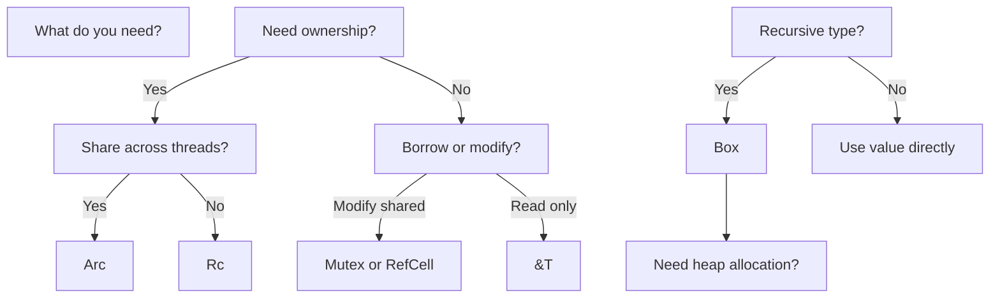
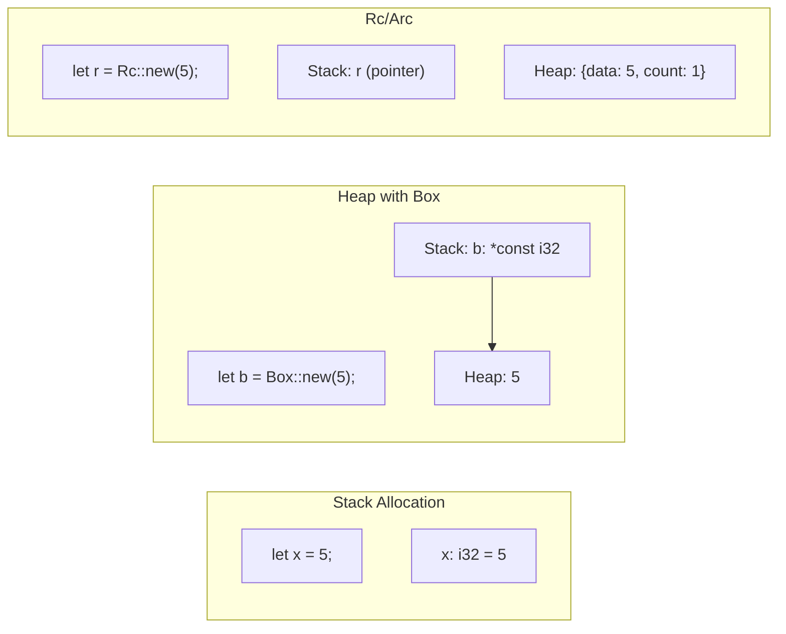

# Appendix: Summary and Reference Card

> **What you'll learn:**
> - Quick reference for all ownership and borrowing concepts
> - When to use each smart pointer type
> - Common patterns in production code

---

## The Three Rules of Ownership

| Rule | Description | Example |
|------|-------------|---------|
| 1 | Each value has exactly one owner | `let s = String::new();` |
| 2 | Owner drop = value drop | `s` dropped at end of scope |
| 3 | One mutable OR many immutable | `&mut` or `&` (not both) |

## Smart Pointer Quick Reference

| Type | Use Case | Thread Safe | Overhead |
|------|----------|-------------|----------|
| `&T` | Borrowing data | No | Zero |
| `&mut T` | Exclusive mutable access | No | Zero |
| `Box<T>` | Heap allocation, recursive types | No | Pointer size |
| `Rc<T>` | Shared ownership (single-thread) | No | Refcount |
| `Arc<T>` | Shared ownership (multi-thread) | Yes | Atomic refcount |
| `Cell<T>` | Interior mutability (Copy types) | No | Inline |
| `RefCell<T>` | Interior mutability (any type) | No | Runtime check |
| `Mutex<T>` | Thread-safe interior mutability | Yes | Runtime lock |
| `RwLock<T>` | Multiple readers / single writer | Yes | Runtime lock |

## When to Use What



## Lifetime Syntax Guide

| Syntax | Meaning | Example |
|--------|---------|---------|
| `&'a T` | Reference with lifetime 'a | `&'a str` |
| `&'a mut T` | Mutable reference with lifetime | `&'a mut String` |
| `T: 'a` | Type bound: T lives at least 'a | `T: 'static` |
| `fn foo<'a>(x: &'a str)` | Lifetime parameter | Connect input/output |
| `struct Foo<'a>` | Struct with lifetime | Store reference |
| `&'static str` | Reference to static data | String literals |
| `T: 'static` | Type bound: no non-static refs | Thread-safe generics |

## Common Error Fixes

| Error | Cause | Fix |
|-------|-------|-----|
| `cannot borrow as mutable more than once` | Two mutable refs at once | Restructure to use one at a time |
| `borrowed value does not live long enough` | Ref outlives data | Ensure ref lifetime within data lifetime |
| `cannot borrow as immutable while mutable` | Read while mutating | Read first, then write |
| `use of moved value` | Moved non-Copy type | Clone or don't move |
| `field cannot be returned` | Self-reference attempt | Use indices or Box |

## Ownership vs Borrowing

| Aspect | Ownership | Borrowing |
|--------|-----------|----------|
| Transfer | `let s2 = s1` (move) | `let s2 = &s1` (borrow) |
| Original valid? | No (if moved) | Yes |
| Destructor | Owner runs Drop | No Drop for borrow |
| Aliasing | Only one owner | Many readers OR one writer |

## Memory Layouts



## Drop Order

```rust
fn main() {
    // Last created = first dropped
    let a = String::from("first");
    let b = String::from("second");
    let c = String::from("third");
    
    // Drop order: c, b, a
}
// Output:
// Dropped third
// Dropped second
// Dropped first
```

## The Borrow Checker in a Nutshell

1. **Every value has ONE owner**
2. **When owner dies, value dies**
3. **While owner is borrowed:**
   - Immutable borrow: many allowed
   - Mutable borrow: only ONE allowed
   - Can't mix them!

## Production Patterns

### Shared State
```rust
use std::sync::{Arc, Mutex};

let state = Arc::new(Mutex::new(SharedData::new()));
```

### Caching
```rust
use std::cell::RefCell;
use std::rc::Rc;

struct Cache {
    map: RefCell<HashMap<K, V>>,
}
```

### Recursive Types
```rust
enum List {
    Cons(i32, Box<List>),
    Nil,
}
```

### Self-Referential (Alternative)
```rust
struct Holder {
    data: String,
    prefix_start: usize,
    prefix_len: usize,
}

impl Holder {
    fn prefix(&self) -> &str {
        &self.data[self.prefix_start..self.prefix_start + self.prefix_len]
    }
}
```

## Final Checklist

Before deploying Rust code with ownership/borrowing:

- [ ] No `Rc` in multi-threaded code (use `Arc`)
- [ ] No `RefCell` in multi-threaded code (use `Mutex`)
- [ ] Consider `'static` bound for thread arguments
- [ ] Watch for reference cycles with `Rc` (use `Weak`)
- [ ] Use `Box` for recursive types
- [ ] Clone when returning from borrowed contexts
- [ ] Test edge cases with empty collections

## Quick Reference: Cheat Sheet

```
╔══════════════════════════════════════════════════════════════════╗
║                     RUST MEMORY CHEAT SHEET                       ║
╠══════════════════════════════════════════════════════════════════╣
║  OWNERSHIP                                                      ║
║  • let s = String::new()     →  s owns String                  ║
║  • let s2 = s                →  s MOVED to s2                   ║
║  • let s2 = s.clone()        →  s COPIED to s2                 ║
╠══════════════════════════════════════════════════════════════════╣
║  BORROWING                                                      ║
║  • let r = &s               →  Shared borrow (read only)        ║
║  • let r = &mut s           →  Mutable borrow (read/write)     ║
║  • Many &s allowed          →  Multiple readers OK              ║
║  • Only one &mut s          →  One writer ONLY                  ║
║  • NO &s + &mut s           →  Can't mix readers and writers    ║
╠══════════════════════════════════════════════════════════════════╣
║  SMART POINTERS                                                ║
║  • Box<T>                  →  Heap allocation                  ║
║  • Rc<T>                   →  Shared ownership (single-thread) ║
║  • Arc<T>                  →  Shared ownership (multi-thread)  ║
║  • RefCell<T>              →  Runtime borrow checking          ║
║  • Mutex<T>                →  Thread-safe interior mutability   ║
╠══════════════════════════════════════════════════════════════════╣
║  LIFETIMES                                                     ║
║  • &str                    →  Reference to string               ║
║  • &'a str                 →  Reference with lifetime 'a        ║
║  • &'static str            →  Reference to static data        ║
║  • T: 'static             →  Type doesn't borrow non-'static  ║
╚══════════════════════════════════════════════════════════════════╝
```

> **See also:**
> - [Chapter 1: Why Rust is Different](./ch01-why-rust-is-different.md) - Memory management paradigms
> - [Chapter 4: Borrowing and Aliasing](./ch04-borrowing-and-aliasing.md) - The borrowing rules
> - [Chapter 7: Rc and Arc](./ch07-rc-and-arc.md) - Shared ownership
> - [Chapter 8: Interior Mutability](./ch08-interior-mutability.md) - Runtime borrowing
