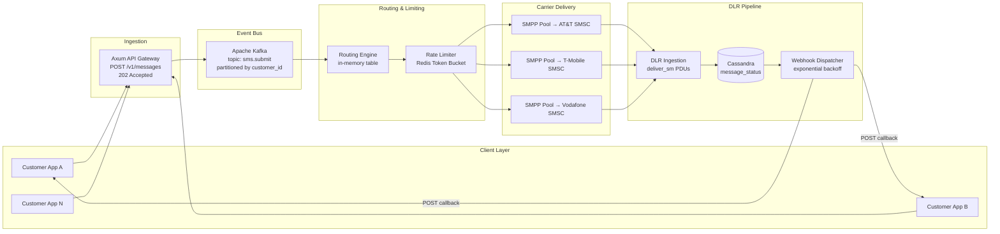
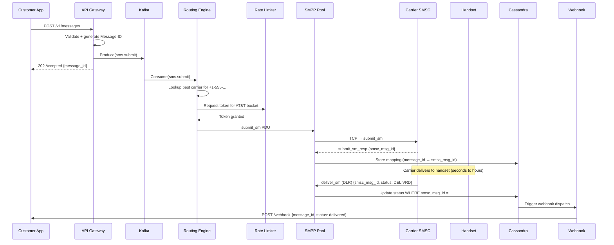

# System Design: The Global Messaging and Routing Gateway

## Speaker Intro

This handbook is written from the perspective of a **Principal Communications Architect** who has designed and operated global SMS/MMS routing gateways handling billions of messages per month across hundreds of telecom carriers. The content draws from first-hand experience building CPaaS (Communications Platform as a Service) infrastructure at the intersection of high-throughput distributed systems, telecom protocol engineering, and carrier compliance.

If you have ever wondered how a single API call from Twilio, MessageBird, or Vonage turns into a text message on someone's phone—traversing routing engines, rate limiters, telecom-grade binary protocols, and asynchronous delivery tracking—this book dismantles the entire pipeline, component by component, in Rust.

## Who This Is For

- **Backend engineers** building notification infrastructure and tired of treating SMS as a "fire-and-forget" HTTP call—you want to understand what happens *after* you POST to `/v1/messages`.
- **Platform engineers at CPaaS companies** (Twilio, Bandwidth, Plivo, Sinch) who need the mental model of how ingestion, routing, rate-limiting, and carrier delivery form one coherent pipeline.
- **Distributed systems engineers** who want a real-world case study in Kafka-driven event pipelines, Redis-based distributed coordination, and Cassandra-scale partitioned storage.
- **Telecom-curious developers** who have heard of SMPP, SMSCs, and DLRs but never had the chance to implement them from scratch.
- **Anyone preparing for Staff+ system design interviews** where "Design an SMS Gateway" is a common prompt—and you want depth beyond whiteboard hand-waving.

## Prerequisites

| Concept | Where to Learn |
|---|---|
| Intermediate Rust (ownership, traits, `async`) | [Async Rust](../async-book/src/SUMMARY.md) |
| HTTP servers with Axum | [Microservices](../microservices-book/src/SUMMARY.md) |
| Kafka / message broker fundamentals | [System Design: Message Broker](../system-design-book/src/SUMMARY.md) |
| Basic Redis and Lua scripting | Redis documentation |
| TCP networking (sockets, connection pooling) | [Tokio Internals](../tokio-internals-book/src/SUMMARY.md) |

## How to Use This Book

| Emoji | Meaning |
|---|---|
| 🟢 | **Architecture** — API design, payload validation, event sourcing |
| 🟡 | **Distributed Queues** — routing tables, rate limiters, carrier queues |
| 🔴 | **Protocol/Telecom** — SMPP binary protocol, DLR reconciliation, carrier compliance |

Each chapter solves **one layer of the messaging pipeline** in sequence. Read them in order—the SMPP chapter assumes the routing engine already selected a carrier, and the webhook chapter assumes DLRs are flowing in from the SMPP layer.

## The Problem We Are Solving

> Design a **global messaging gateway** capable of accepting SMS/MMS requests via a REST API, routing them to the optimal telecom carrier, enforcing per-customer and per-carrier rate limits, delivering messages over the SMPP binary protocol, and tracking delivery status asynchronously—all at a sustained throughput of **50,000 messages per second** with **sub-5ms API response times**.

The system we will build has these non-negotiable requirements:

| Requirement | Target |
|---|---|
| API ingestion latency (p99) | < 5 ms (async `202 Accepted`) |
| Sustained throughput | 50,000 msgs/sec across all carriers |
| Routing decision time | < 1 ms (in-memory table) |
| Rate-limit accuracy | ±1% under distributed contention |
| SMPP connection pool | 500+ persistent TCP binds across carriers |
| DLR reconciliation latency | < 500 ms from carrier receipt to webhook |
| Webhook delivery guarantee | At-least-once with exponential backoff |
| Message durability | Zero loss after `202 Accepted` (Kafka replication) |

## Pacing Guide

| Chapter | Topic | Time | Checkpoint |
|---|---|---|---|
| Ch 0 | Introduction & Problem Statement | 30 min | Understand the end-to-end pipeline |
| Ch 1 | API Gateway & Ingestion | 5–7 hours | Axum endpoint → Kafka producer benchmarked at 50K/sec |
| Ch 2 | Global Routing Engine | 5–7 hours | In-memory routing table with failover and health scoring |
| Ch 3 | Distributed Rate Limiting | 6–8 hours | Redis Lua token bucket passing concurrency tests |
| Ch 4 | SMPP Protocol & Connection Pooling | 8–10 hours | Binary codec + managed connection pool to SMSC simulator |
| Ch 5 | Delivery Receipts & Webhooks | 6–8 hours | DLR → Cassandra → webhook pipeline with backoff |

**Total: ~31–41 hours** of focused study.

## Table of Contents

### Part I: Ingestion & Routing
- **Chapter 1 — The API Gateway and Ingestion 🟢** — Architecting a high-throughput Rust API with Axum that validates requests, generates unique Message-IDs, drops payloads into Kafka, and returns `202 Accepted` before any downstream work begins.
- **Chapter 2 — The Global Routing Engine 🟡** — Building an in-memory routing table that scores carriers by cost, latency, and reliability for every destination prefix. Automatic failover when a primary route degrades.

### Part II: Traffic Control
- **Chapter 3 — Distributed Rate Limiting (Token Buckets) 🟡** — Implementing strict per-customer, per-carrier token-bucket rate limiters using Redis Lua scripts. Queuing excess traffic without dropping messages.

### Part III: Carrier Integration
- **Chapter 4 — The SMPP Protocol and Connection Pooling 🔴** — Deep dive into the SMPP v3.4 binary protocol. Managing persistent TCP connection pools (Binds) to carrier SMSCs. PDU encoding/decoding, windowed submit, and transceiver lifecycle.

### Part IV: Delivery & Observability
- **Chapter 5 — Delivery Receipts and Webhook Dispatch 🔴** — Ingesting asynchronous Delivery Receipts (DLRs) from carriers, reconciling them against the original Message-ID in Cassandra, and dispatching webhooks to customer servers with exponential backoff and HMAC signatures.

## Architecture Overview

## The Lifecycle of a Single Message

To ground the architecture, let's trace one SMS from API call to delivery confirmation:

## Companion Guides

This handbook builds on concepts from several other books in the Rust Training curriculum:

| Book | Relevance |
|---|---|
| [Async Rust](../async-book/src/SUMMARY.md) | Tokio runtime powering every async component |
| [Microservices](../microservices-book/src/SUMMARY.md) | Axum, Tower middleware, structured logging |
| [System Design: Message Broker](../system-design-book/src/SUMMARY.md) | Kafka internals and partition semantics |
| [Distributed Systems](../distributed-systems-book/src/SUMMARY.md) | Consensus, replication, failure detection |
| [Tokio Internals](../tokio-internals-book/src/SUMMARY.md) | The runtime beneath our TCP connection pools |
| [Enterprise Rust](../enterprise-rust-book/src/SUMMARY.md) | OpenTelemetry tracing, security, compliance |
