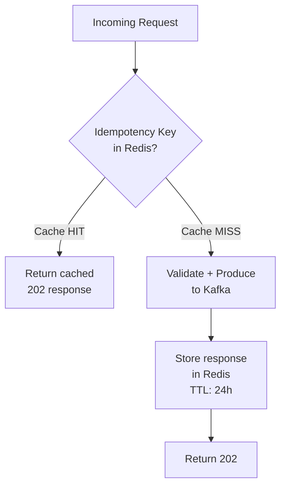
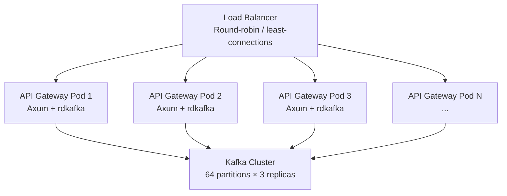

# 1. The API Gateway and Ingestion 🟢

> **The Problem:** Every SMS your platform sends begins as an HTTP request. If your API endpoint touches a database, calls a carrier, or waits for anything slower than RAM before responding, your p99 latency explodes and clients start retrying—creating a thundering herd that compounds the problem. We need an ingestion layer that accepts a message, validates it, generates a unique tracking ID, durably enqueues it, and returns `202 Accepted` in under 5 ms—*before any downstream work begins*.

---

## The Async Ingestion Pattern

The core insight is **separation of acceptance from processing**. The API Gateway's only job is to:

1. **Authenticate** the request (API key → customer record).
2. **Validate** the payload (E.164 phone number, body length, encoding).
3. **Generate** a globally unique `Message-ID`.
4. **Produce** the payload to Kafka.
5. **Return** `202 Accepted` with the `Message-ID`.

Everything else—routing, rate limiting, SMPP delivery—happens asynchronously downstream.

```mermaid
flowchart LR
    subgraph Synchronous Path < 5ms
        REQ[HTTP POST<br/>/v1/messages] --> AUTH[Auth Middleware<br/>API Key → Customer]
        AUTH --> VAL[Validate Payload<br/>E.164, body, encoding]
        VAL --> ID[Generate<br/>Message-ID]
        ID --> KP[Kafka Produce<br/>topic: sms.submit]
        KP --> RES[202 Accepted<br/>message_id in body]
    end

    subgraph Asynchronous Path
        KP -.-> ROUTE[Routing Engine]
        ROUTE -.-> SMPP[Carrier Delivery]
    end
```

### Why 202 and Not 200?

| Status Code | Semantics | Appropriate For |
|---|---|---|
| `200 OK` | Request processed; result in body | Synchronous operations |
| `201 Created` | Resource created and available now | Database inserts |
| **`202 Accepted`** | **Request accepted for processing; outcome TBD** | **Async pipelines** |

`202` is the correct HTTP semantic. It tells the client: *"I have your message, I have not lost it, but I have not delivered it yet. Poll or listen for a webhook."*

---

## The Message Payload

### API Contract

```
POST /v1/messages HTTP/1.1
Authorization: Bearer sk_live_abc123...
Content-Type: application/json
Idempotency-Key: 550e8400-e29b-41d4-a716-446655440000

{
  "to": "+14155551234",
  "from": "+18005550199",
  "body": "Your verification code is 847293",
  "callback_url": "https://api.example.com/webhooks/sms",
  "metadata": {
    "campaign_id": "onboarding_v2",
    "user_id": "usr_9f8a7b"
  }
}
```

### Response

```
HTTP/1.1 202 Accepted
Content-Type: application/json
X-Request-Id: req_a1b2c3d4

{
  "message_id": "msg_01HXYZ3K9V2QW8PJMN0RTGFB5E",
  "status": "accepted",
  "created_at": "2026-03-15T14:22:07.003Z"
}
```

### Validation Rules

| Field | Rule | Error |
|---|---|---|
| `to` | E.164 format: `+` followed by 7–15 digits | `422 invalid_to_number` |
| `from` | Must belong to the authenticated customer | `403 number_not_owned` |
| `body` | 1–1600 characters (multi-part SMS) | `422 body_too_long` |
| `callback_url` | Valid HTTPS URL, ≤ 2048 chars | `422 invalid_callback_url` |
| `Idempotency-Key` | UUID v4/v7, ≤ 64 chars | `400 invalid_idempotency_key` |

---

## The Message-ID: ULID vs UUID

We need IDs that are:
- **Globally unique** without coordination.
- **Time-ordered** so Kafka consumers process them roughly in submission order.
- **URL-safe** for use in REST resource paths.

| Property | UUID v4 | UUID v7 | ULID |
|---|---|---|---|
| Time-ordered | ❌ | ✅ | ✅ |
| Lexicographic sort = time sort | ❌ | ✅ | ✅ |
| 128-bit | ✅ | ✅ | ✅ |
| Crockford Base32 (URL-safe) | ❌ | ❌ | ✅ |
| Monotonic within same ms | ❌ | Implementation-defined | ✅ (with monotonic mode) |

We use **ULIDs** with a `msg_` prefix for human readability:

```rust,ignore
use ulid::Ulid;

/// Generates a prefixed, time-ordered, globally unique message ID.
/// Example: "msg_01HXYZ3K9V2QW8PJMN0RTGFB5E"
fn generate_message_id() -> String {
    format!("msg_{}", Ulid::new())
}
```

### Why the `msg_` Prefix Matters

When an engineer sees `msg_01HXYZ...` in a log line, they instantly know it's a message ID—not a customer ID (`cust_`), not a carrier submission ID (`smsc_`). Prefixed IDs eliminate an entire class of "wrong ID in wrong field" bugs in production debugging.

---

## Rust Implementation: The Axum Handler

### Project Dependencies

```toml
# Cargo.toml (relevant deps)
[dependencies]
axum = "0.8"
tokio = { version = "1", features = ["full"] }
serde = { version = "1", features = ["derive"] }
serde_json = "1"
rdkafka = { version = "0.37", features = ["cmake-build"] }
ulid = "1"
tower-http = { version = "0.6", features = ["trace", "request-id"] }
tracing = "0.1"
tracing-subscriber = "0.3"
phonenumber = "0.3"
```

### Request and Response Types

```rust,ignore
use serde::{Deserialize, Serialize};
use std::collections::HashMap;

#[derive(Debug, Deserialize)]
pub struct SendMessageRequest {
    /// Destination phone number in E.164 format
    pub to: String,
    /// Sender number owned by the customer
    pub from: String,
    /// Message body (1–1600 characters for multi-part)
    pub body: String,
    /// HTTPS URL for delivery status callbacks
    #[serde(default)]
    pub callback_url: Option<String>,
    /// Arbitrary key-value metadata passed through to webhooks
    #[serde(default)]
    pub metadata: HashMap<String, String>,
}

#[derive(Debug, Serialize)]
pub struct SendMessageResponse {
    pub message_id: String,
    pub status: &'static str,
    pub created_at: String,
}

#[derive(Debug, Serialize)]
pub struct ApiError {
    pub error_code: &'static str,
    pub message: String,
}
```

### Payload Validation

```rust,ignore
use phonenumber::PhoneNumber;

/// Validates the incoming SMS request.
/// Returns Ok(()) or a structured ApiError.
fn validate_request(req: &SendMessageRequest) -> Result<(), ApiError> {
    // 1. Validate E.164 destination number
    let parsed: PhoneNumber = req.to.parse().map_err(|_| ApiError {
        error_code: "invalid_to_number",
        message: format!("'{}' is not a valid E.164 phone number", req.to),
    })?;

    if !parsed.is_valid() {
        return Err(ApiError {
            error_code: "invalid_to_number",
            message: format!("'{}' is not a valid E.164 phone number", req.to),
        });
    }

    // 2. Validate body length (SMS multi-part limit: 1600 chars)
    if req.body.is_empty() || req.body.len() > 1600 {
        return Err(ApiError {
            error_code: "body_too_long",
            message: "Body must be between 1 and 1600 characters".into(),
        });
    }

    // 3. Validate callback URL if present
    if let Some(ref url) = req.callback_url {
        if !url.starts_with("https://") || url.len() > 2048 {
            return Err(ApiError {
                error_code: "invalid_callback_url",
                message: "callback_url must be a valid HTTPS URL under 2048 chars".into(),
            });
        }
    }

    Ok(())
}
```

### The Kafka Producer

The critical performance decision: we use **buffered, async Kafka production** with `rdkafka`'s built-in batching. The `produce` call enqueues to an in-memory buffer and returns immediately—`librdkafka` flushes batches in the background.

```rust,ignore
use rdkafka::config::ClientConfig;
use rdkafka::producer::{FutureProducer, FutureRecord};
use std::sync::Arc;
use std::time::Duration;

pub struct KafkaSubmitProducer {
    producer: FutureProducer,
    topic: String,
}

impl KafkaSubmitProducer {
    pub fn new(brokers: &str, topic: &str) -> Self {
        let producer: FutureProducer = ClientConfig::new()
            .set("bootstrap.servers", brokers)
            // Batch up to 64KB or 5ms — whichever comes first
            .set("batch.size", "65536")
            .set("linger.ms", "5")
            // Wait for all in-sync replicas to acknowledge
            .set("acks", "all")
            // Exactly-once semantics via idempotent producer
            .set("enable.idempotence", "true")
            .set("compression.type", "lz4")
            .set("retries", "3")
            .create()
            .expect("Failed to create Kafka producer");

        Self {
            producer,
            topic: topic.to_string(),
        }
    }

    /// Enqueue a message to the sms.submit topic.
    /// The key is the customer_id to ensure per-customer ordering.
    pub async fn submit(
        &self,
        customer_id: &str,
        payload: &[u8],
    ) -> Result<(), rdkafka::error::KafkaError> {
        let record = FutureRecord::to(&self.topic)
            .key(customer_id)
            .payload(payload);

        // Timeout of 0 = enqueue and return immediately if buffer has space
        self.producer
            .send(record, Duration::from_secs(0))
            .await
            .map_err(|(err, _)| err)?;

        Ok(())
    }
}
```

### Why Key on `customer_id`?

Kafka guarantees ordering **within a partition**. By keying on `customer_id`, all messages from the same customer land in the same partition. This means:

1. **Per-customer ordering** — Messages from Customer A are processed in submission order.
2. **Parallel processing** — Different customers' messages are spread across partitions for concurrency.
3. **Rate-limiting locality** — The downstream consumer for a partition handles a stable set of customers.

### The Axum Handler: Tying It All Together

```rust,ignore
use axum::{
    extract::State,
    http::{HeaderMap, StatusCode},
    response::IntoResponse,
    Json,
};
use chrono::Utc;
use std::sync::Arc;
use tracing::instrument;
use ulid::Ulid;

pub struct AppState {
    pub kafka: KafkaSubmitProducer,
    // In production: a cache of API key → customer records
}

/// Internal Kafka message envelope — carries everything downstream needs.
#[derive(Debug, Serialize)]
struct KafkaEnvelope {
    message_id: String,
    customer_id: String,
    to: String,
    from: String,
    body: String,
    callback_url: Option<String>,
    metadata: HashMap<String, String>,
    idempotency_key: Option<String>,
    accepted_at: String,
}

#[instrument(skip(state, headers, body))]
pub async fn send_message(
    State(state): State<Arc<AppState>>,
    headers: HeaderMap,
    Json(body): Json<SendMessageRequest>,
) -> impl IntoResponse {
    // 1. Authenticate (simplified — production uses Tower middleware)
    let customer_id = match authenticate(&headers) {
        Ok(id) => id,
        Err(e) => return (StatusCode::UNAUTHORIZED, Json(e)).into_response(),
    };

    // 2. Validate payload
    if let Err(e) = validate_request(&body) {
        return (StatusCode::UNPROCESSABLE_ENTITY, Json(e)).into_response();
    }

    // 3. Generate time-ordered Message-ID
    let message_id = format!("msg_{}", Ulid::new());
    let now = Utc::now();

    // 4. Build the Kafka envelope
    let envelope = KafkaEnvelope {
        message_id: message_id.clone(),
        customer_id: customer_id.clone(),
        to: body.to,
        from: body.from,
        body: body.body,
        callback_url: body.callback_url,
        metadata: body.metadata,
        idempotency_key: headers
            .get("idempotency-key")
            .and_then(|v| v.to_str().ok())
            .map(String::from),
        accepted_at: now.to_rfc3339_opts(chrono::SecondsFormat::Millis, true),
    };

    let payload = serde_json::to_vec(&envelope).expect("serialization cannot fail");

    // 5. Produce to Kafka (async enqueue — does NOT block on broker ack)
    if let Err(e) = state.kafka.submit(&customer_id, &payload).await {
        tracing::error!(error = %e, "Kafka produce failed");
        return (
            StatusCode::SERVICE_UNAVAILABLE,
            Json(ApiError {
                error_code: "internal_error",
                message: "Failed to accept message — retry later".into(),
            }),
        )
            .into_response();
    }

    tracing::info!(message_id = %message_id, customer = %customer_id, "Message accepted");

    // 6. Return 202 Accepted
    (
        StatusCode::ACCEPTED,
        Json(SendMessageResponse {
            message_id,
            status: "accepted",
            created_at: now.to_rfc3339_opts(chrono::SecondsFormat::Millis, true),
        }),
    )
        .into_response()
}

fn authenticate(headers: &HeaderMap) -> Result<String, ApiError> {
    let token = headers
        .get("authorization")
        .and_then(|v| v.to_str().ok())
        .and_then(|v| v.strip_prefix("Bearer "))
        .ok_or(ApiError {
            error_code: "unauthorized",
            message: "Missing or malformed Authorization header".into(),
        })?;

    // Production: lookup token in a cache (Redis/in-memory) → customer record
    // Here we simulate with a prefix check
    if token.starts_with("sk_live_") || token.starts_with("sk_test_") {
        Ok(format!("cust_{}", &token[8..16]))
    } else {
        Err(ApiError {
            error_code: "unauthorized",
            message: "Invalid API key".into(),
        })
    }
}
```

---

## Idempotency: Preventing Duplicate Messages

Network failures mean clients will retry. Without idempotency, a retry creates a **duplicate SMS**—the customer gets charged twice, the end user gets two identical texts.

### The Idempotency Contract

1. Client sends `Idempotency-Key: <uuid>` header.
2. First request: process normally, store `(key → response)` in Redis with a TTL (24 hours).
3. Subsequent requests with the same key: return the **cached response** without re-processing.



### Redis-Based Idempotency Store

```rust,ignore
use redis::AsyncCommands;

pub struct IdempotencyStore {
    redis: redis::aio::MultiplexedConnection,
    ttl_seconds: u64,
}

impl IdempotencyStore {
    /// Check-and-set: returns Some(cached_response) on duplicate,
    /// None on first-seen key.
    pub async fn check_or_reserve(
        &mut self,
        key: &str,
    ) -> Result<Option<String>, redis::RedisError> {
        // SET NX with TTL — atomic "create if not exists"
        let set: bool = self
            .redis
            .set_nx(format!("idempotency:{key}"), "pending")
            .await?;

        if set {
            // First time seeing this key — set TTL
            let _: () = self
                .redis
                .expire(format!("idempotency:{key}"), self.ttl_seconds as i64)
                .await?;
            Ok(None)
        } else {
            // Duplicate — return the stored response
            let cached: Option<String> = self
                .redis
                .get(format!("idempotency:{key}"))
                .await?;
            Ok(cached)
        }
    }

    /// Store the final response once processing succeeds.
    pub async fn store_response(
        &mut self,
        key: &str,
        response_json: &str,
    ) -> Result<(), redis::RedisError> {
        let _: () = self
            .redis
            .set_ex(
                format!("idempotency:{key}"),
                response_json,
                self.ttl_seconds,
            )
            .await?;
        Ok(())
    }
}
```

---

## Kafka Topic Design

### Topic: `sms.submit`

| Setting | Value | Rationale |
|---|---|---|
| Partitions | 64 | Matches peak parallelism (64 consumer threads) |
| Replication factor | 3 | Survive loss of 1 broker without data loss |
| `min.insync.replicas` | 2 | With `acks=all`, guarantees 2 durable copies |
| Retention | 7 days | Allows replay for debugging and reprocessing |
| Compression | LZ4 | 3–4× compression with negligible CPU overhead |
| `max.message.bytes` | 256 KB | SMS + metadata never exceeds this |

### Partition Key Strategy

```
Key: customer_id (e.g., "cust_abc123")
     └─ hash(customer_id) % 64 → partition 17
```

This gives us **per-customer FIFO ordering** without a global lock. The routing engine consumer group assigns partitions to workers, and each worker sees a stable subset of customers.

---

## Performance: Achieving Sub-5ms p99

### The Latency Budget

```
┌─────────────────────────────────────────────┐
│  Total budget: 5 ms                         │
├────────────────────┬────────────────────────┤
│  TLS termination   │  ~0.3 ms (session      │
│                    │  resumption)            │
│  JSON deserialize  │  ~0.1 ms               │
│  Auth lookup       │  ~0.2 ms (in-memory    │
│                    │  cache)                 │
│  Validation        │  ~0.05 ms              │
│  ULID generation   │  ~0.001 ms             │
│  Kafka enqueue     │  ~1.5 ms (buffered,    │
│                    │  no broker ack wait)    │
│  JSON serialize    │  ~0.05 ms              │
│  HTTP response     │  ~0.1 ms               │
├────────────────────┼────────────────────────┤
│  **Subtotal**      │  **~2.3 ms**           │
│  Headroom          │  ~2.7 ms               │
└────────────────────┴────────────────────────┘
```

### What Kills Latency (and How to Avoid It)

| Latency Killer | Impact | Solution |
|---|---|---|
| Database round-trip for auth | +5–15 ms | In-memory cache with TTL (invalidate on key rotation) |
| Synchronous Kafka ack (`acks=all` + wait) | +10–50 ms | Buffer locally; `rdkafka` batches and acks in background |
| DNS resolution per request | +1–20 ms | Resolve once at startup; connection pooling |
| Mutex contention on shared state | Unbounded | `DashMap` or lock-free structures for shared caches |
| JSON parsing of large bodies | +1–5 ms | Reject >256KB at the HTTP layer before parsing |

### Naive Approach vs. Production Approach

```rust,ignore
// ❌ NAIVE: Synchronous database check on every request
async fn send_message_naive(
    body: Json<SendMessageRequest>,
) -> impl IntoResponse {
    // 💥 +15ms: Database round-trip for auth on every single request
    let customer = sqlx::query!("SELECT * FROM customers WHERE api_key = $1", api_key)
        .fetch_one(&pool)
        .await
        .unwrap();

    // 💥 +30ms: Waiting for Kafka broker acknowledgment synchronously
    producer.send(record, Duration::from_secs(5)).await.unwrap();

    // 💥 Total: ~50ms — 10x over budget
    (StatusCode::OK, Json(response)) // Wrong status code too!
}
```

```rust,ignore
// ✅ PRODUCTION: Everything async and cached
async fn send_message(
    State(state): State<Arc<AppState>>,
    headers: HeaderMap,
    Json(body): Json<SendMessageRequest>,
) -> impl IntoResponse {
    // ✅ ~0.2ms: In-memory cache hit
    let customer_id = authenticate(&headers)?;

    // ✅ ~0.05ms: CPU-only validation
    validate_request(&body)?;

    // ✅ ~1.5ms: Async enqueue — rdkafka buffers internally
    state.kafka.submit(&customer_id, &payload).await?;

    // ✅ Total: ~2.3ms — well under budget
    (StatusCode::ACCEPTED, Json(response))
}
```

---

## Scaling the Ingestion Layer

### Horizontal Scaling

The API Gateway is **stateless**—every instance is identical. Scale by adding pods behind a load balancer:



### Capacity Planning

| Metric | Value |
|---|---|
| Throughput per Gateway pod | ~12,000 msgs/sec (measured) |
| Pods for 50K msgs/sec | 5 (with headroom) |
| Kafka producer connections per pod | 1 (multiplexed by `rdkafka`) |
| Memory per pod | ~128 MB (Rust binary + buffers) |
| CPU per pod | 0.5 cores (I/O-bound, not CPU-bound) |

Compare this to a typical Node.js or Spring Boot gateway:

| Language | Memory per pod | Throughput per pod | Pods for 50K/sec |
|---|---|---|---|
| Rust (Axum) | 128 MB | 12,000/sec | 5 |
| Go (Gin) | 256 MB | 8,000/sec | 7 |
| Java (Spring) | 1.2 GB | 4,000/sec | 13 |
| Node.js (Express) | 512 MB | 2,500/sec | 20 |

---

## Error Handling Strategy

### The Error Taxonomy

Not all errors are equal. The gateway classifies errors into three categories:

| Category | HTTP Code | Action | Example |
|---|---|---|---|
| **Client Error** | 4xx | Return error; do NOT retry | Invalid phone number, missing auth |
| **Transient Failure** | 503 | Client should retry with backoff | Kafka buffer full, Redis timeout |
| **Internal Bug** | 500 | Alert on-call; never expose internals | Serialization panic, logic error |

```rust,ignore
use axum::http::StatusCode;
use axum::response::{IntoResponse, Response};

pub enum GatewayError {
    /// Client sent bad data — return 4xx
    Validation(ApiError),
    /// Downstream is temporarily unavailable — return 503
    Transient(String),
    /// Our bug — return 500 and alert
    Internal(anyhow::Error),
}

impl IntoResponse for GatewayError {
    fn into_response(self) -> Response {
        match self {
            GatewayError::Validation(e) => {
                (StatusCode::UNPROCESSABLE_ENTITY, Json(e)).into_response()
            }
            GatewayError::Transient(msg) => {
                tracing::warn!(error = %msg, "Transient failure");
                (
                    StatusCode::SERVICE_UNAVAILABLE,
                    Json(ApiError {
                        error_code: "service_unavailable",
                        message: "Temporary failure — retry with backoff".into(),
                    }),
                )
                    .into_response()
            }
            GatewayError::Internal(err) => {
                tracing::error!(error = ?err, "Internal error");
                (
                    StatusCode::INTERNAL_SERVER_ERROR,
                    Json(ApiError {
                        error_code: "internal_error",
                        message: "An internal error occurred".into(),
                    }),
                )
                    .into_response()
            }
        }
    }
}
```

---

## Observability: Metrics and Traces

Every request emits structured traces via OpenTelemetry:

```rust,ignore
use tracing::{info, instrument, warn};

#[instrument(
    name = "send_message",
    skip(state, headers, body),
    fields(
        message_id = tracing::field::Empty,
        customer_id = tracing::field::Empty,
        destination = tracing::field::Empty,
    )
)]
pub async fn send_message(
    State(state): State<Arc<AppState>>,
    headers: HeaderMap,
    Json(body): Json<SendMessageRequest>,
) -> Result<impl IntoResponse, GatewayError> {
    let span = tracing::Span::current();

    let customer_id = authenticate(&headers)?;
    span.record("customer_id", &customer_id.as_str());
    span.record("destination", &body.to.as_str());

    // ... validation, ID generation ...

    span.record("message_id", &message_id.as_str());

    info!("Message accepted");
    Ok((StatusCode::ACCEPTED, Json(response)))
}
```

### Key Metrics to Export

| Metric | Type | Labels |
|---|---|---|
| `gateway.messages.accepted` | Counter | `customer_id`, `destination_country` |
| `gateway.messages.rejected` | Counter | `customer_id`, `error_code` |
| `gateway.request.duration_ms` | Histogram | `status_code`, `method` |
| `gateway.kafka.produce.duration_ms` | Histogram | `topic`, `partition` |
| `gateway.kafka.buffer.size` | Gauge | — |

---

> **Key Takeaways**
>
> 1. **Separate acceptance from processing.** The API Gateway's only job is to validate, generate an ID, enqueue, and return `202 Accepted`. All heavy lifting happens downstream.
> 2. **Idempotency is non-negotiable.** Clients will retry. Use `Idempotency-Key` headers with Redis SET NX to prevent duplicate messages.
> 3. **Key Kafka messages by `customer_id`** to get per-customer FIFO ordering without global coordination.
> 4. **Cache authentication in memory.** A database round-trip per request is the #1 latency killer in API gateways.
> 5. **Use ULIDs, not UUIDs.** Time-ordering makes debugging, partitioning, and log correlation dramatically easier.
> 6. **A Rust API gateway uses ~10× less memory** than a Java equivalent at the same throughput — that translates directly to infrastructure cost savings at scale.
