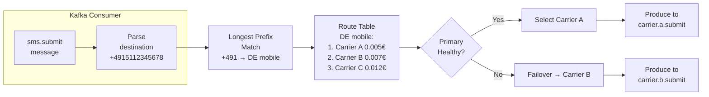
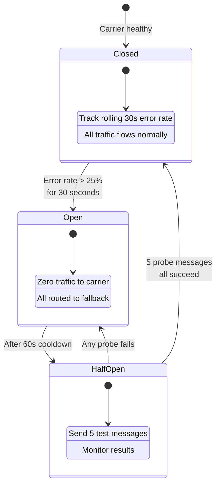
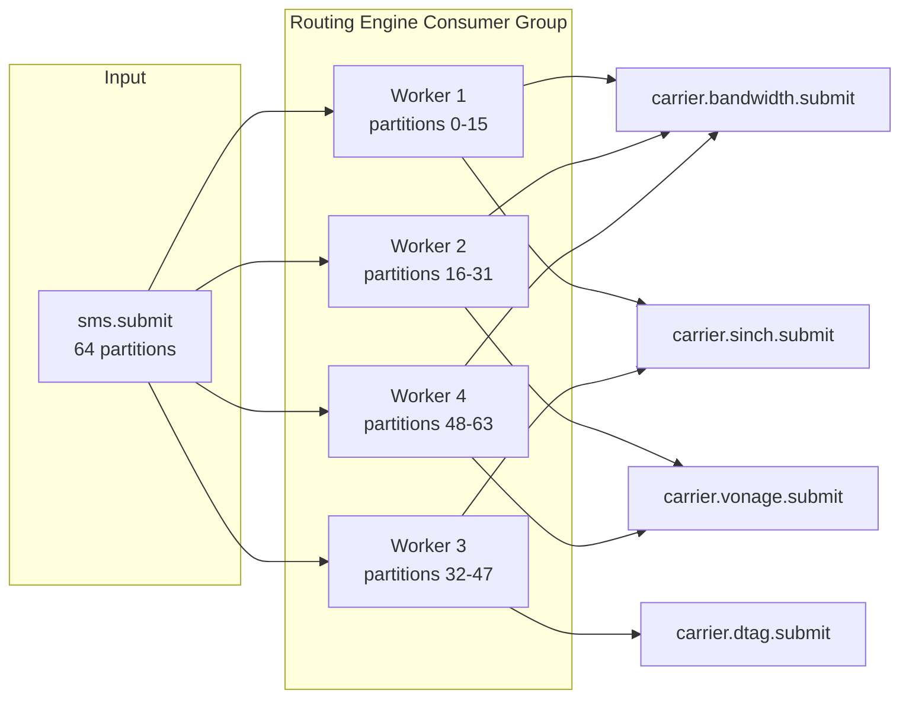

# 2. The Global Routing Engine 🟡

> **The Problem:** Your platform connects to 200+ telecom carriers worldwide. When a customer sends an SMS to `+4915112345678` (a German mobile number), the system must decide—in under 1 millisecond—which carrier to use. The decision depends on cost, reliability, latency, regulatory compliance, and whether the primary carrier is currently degraded. A naive database lookup per message at 50K msgs/sec means 50K queries/sec of avoidable latency. We need an **in-memory routing table** that selects the optimal carrier instantly and fails over transparently.

---

## What Is a Routing Engine?

In telecom, a routing engine is the equivalent of a CDN's edge-routing logic or a payment processor's acquirer-selection layer. It answers one question:

> Given this destination phone number, which carrier (aggregator) should deliver this message **right now**?

The "right now" qualifier is critical. Routing is not static—carrier quality degrades, prices change, regulatory windows open and close. The routing engine must be:

1. **Fast** — sub-millisecond per decision at 50K msgs/sec.
2. **Dynamic** — react to carrier health changes within seconds.
3. **Multi-dimensional** — balance cost, quality, latency, and compliance.
4. **Deterministic under contention** — two routing decisions for the same prefix should not fight.



---

## Anatomy of a Route

Every route in the system maps a **number prefix** to a **prioritized list of carriers**:

```rust,ignore
use std::collections::HashMap;
use std::net::SocketAddr;

/// A single carrier route — one way to deliver a message.
#[derive(Debug, Clone)]
pub struct CarrierRoute {
    /// Unique carrier identifier (e.g., "carrier_sinch_de")
    pub carrier_id: String,
    /// Priority: lower = preferred. 1 is primary, 2 is secondary, etc.
    pub priority: u8,
    /// Cost per message segment in USD
    pub cost_per_segment: f64,
    /// Weight for load balancing among same-priority routes (0.0–1.0)
    pub weight: f64,
    /// Maximum messages per second this carrier accepts for this prefix
    pub max_mps: u32,
    /// SMSC connection address for SMPP delivery
    pub smsc_addr: SocketAddr,
    /// Kafka topic where routed messages are produced
    pub output_topic: String,
    /// Whether this carrier supports MMS for this prefix
    pub supports_mms: bool,
    /// Regulatory: time windows when sending is allowed (UTC)
    pub allowed_hours: Option<(u8, u8)>,
}

/// A routing entry: prefix → ordered list of carrier routes.
#[derive(Debug, Clone)]
pub struct RoutingEntry {
    /// E.164 prefix (e.g., "+491" for German mobile)
    pub prefix: String,
    /// Country code (e.g., "DE")
    pub country_code: String,
    /// Network type (mobile, landline, toll-free, short-code)
    pub network_type: NetworkType,
    /// Routes ordered by priority, then weight
    pub routes: Vec<CarrierRoute>,
}

#[derive(Debug, Clone, PartialEq)]
pub enum NetworkType {
    Mobile,
    Landline,
    TollFree,
    ShortCode,
}
```

### Real-World Routing Table Example

| Prefix | Country | Network | Priority 1 | Cost | Priority 2 | Cost | Priority 3 | Cost |
|---|---|---|---|---|---|---|---|---|
| `+1` | US | Mobile | Bandwidth | $0.004 | Twilio Trunk | $0.006 | Sinch | $0.008 |
| `+44` | UK | Mobile | BT Wholesale | £0.018 | Sinch UK | £0.022 | Vonage | £0.025 |
| `+491` | DE | Mobile | Deutsche Telekom | €0.005 | Sinch DE | €0.007 | Nexmo | €0.012 |
| `+91` | IN | Mobile | Route Mobile | ₹0.12 | Kaleyra | ₹0.15 | Sinch IN | ₹0.18 |
| `+86` | CN | Mobile | China Unicom | ¥0.04 | *blocked* | — | *blocked* | — |

---

## Longest Prefix Match (LPM): The Core Algorithm

Phone number routing uses **Longest Prefix Match**—the same algorithm IP routers use for packet forwarding. Given `+14155551234`:

```
+1415555  → no match
+141555   → no match
+14155    → no match
+1415     → match! (San Francisco area code route)
+141      → match  (but shorter — less specific)
+14       → match  (but shorter)
+1        → match  (US generic — least specific)
```

The longest matching prefix wins: `+1415` routes to a Bay Area-optimized carrier.

### Trie-Based Implementation

A **trie** (prefix tree) gives us O(k) lookup where k is the number of digits—typically 4–7. At 50K lookups/sec, this is negligible.

```rust,ignore
use std::collections::HashMap;

/// A node in the prefix trie. Each digit (0-9, +) is an edge.
#[derive(Debug, Default)]
struct TrieNode {
    children: HashMap<char, Box<TrieNode>>,
    /// If Some, this node represents a complete prefix with routes.
    entry: Option<RoutingEntry>,
}

/// The Longest-Prefix-Match routing table.
pub struct RoutingTable {
    root: TrieNode,
    /// Total number of prefixes loaded
    prefix_count: usize,
}

impl RoutingTable {
    pub fn new() -> Self {
        Self {
            root: TrieNode::default(),
            prefix_count: 0,
        }
    }

    /// Insert a routing entry for a given prefix.
    pub fn insert(&mut self, entry: RoutingEntry) {
        let mut node = &mut self.root;
        for ch in entry.prefix.chars() {
            node = node
                .children
                .entry(ch)
                .or_insert_with(|| Box::new(TrieNode::default()));
        }
        node.entry = Some(entry);
        self.prefix_count += 1;
    }

    /// Find the longest matching prefix for a phone number.
    /// Returns the most specific route available.
    pub fn longest_match(&self, phone_number: &str) -> Option<&RoutingEntry> {
        let mut node = &self.root;
        let mut best_match: Option<&RoutingEntry> = None;

        for ch in phone_number.chars() {
            match node.children.get(&ch) {
                Some(child) => {
                    node = child;
                    if node.entry.is_some() {
                        best_match = node.entry.as_ref();
                    }
                }
                None => break, // No further prefix match possible
            }
        }

        best_match
    }

    /// Number of prefixes in the table.
    pub fn len(&self) -> usize {
        self.prefix_count
    }
}
```

### Performance Characteristics

| Operation | Complexity | At 50K/sec |
|---|---|---|
| Lookup (longest match) | O(k) where k ≤ 15 digits | ~200 ns |
| Insert / update a prefix | O(k) | Background — not on hot path |
| Memory for 10,000 prefixes | ~2–5 MB | Fits in L2 cache |
| Full table rebuild | O(n × k) | ~50 ms for 10K prefixes |

### Why Not a HashMap?

| Approach | Exact Match `+14155551234` | Prefix Match `+1415` → `+14` → `+1` |
|---|---|---|
| `HashMap<String, Route>` | ✅ O(1) | ❌ Requires iterating all shorter prefixes |
| Trie (prefix tree) | ✅ O(k) | ✅ O(k) — naturally finds longest match |
| Sorted Vec + binary search | ✅ O(log n) | ⚠️ O(k × log n) — awkward prefix iteration |

The trie is purpose-built for this workload.

---

## Carrier Health Tracking

A routing table without health awareness is dangerous. Carrier A may be the cheapest, but if it's returning 30% delivery failures, we must failover to Carrier B immediately.

### Health States

```rust,ignore
use std::time::Instant;

#[derive(Debug, Clone, PartialEq)]
pub enum CarrierHealth {
    /// Carrier is operating normally
    Healthy,
    /// Carrier is experiencing elevated errors — reduce traffic
    Degraded {
        error_rate: f64,
        since: Instant,
    },
    /// Carrier is down — route all traffic to fallback
    Down {
        reason: String,
        since: Instant,
    },
    /// Carrier is in maintenance window — do not send
    Maintenance {
        until: Instant,
    },
}
```

### Circuit Breaker Pattern

We implement a **circuit breaker** per carrier that transitions between states based on rolling error rates:



### Rolling Window Error Tracker

```rust,ignore
use std::collections::VecDeque;
use std::time::{Duration, Instant};

/// Tracks success/failure outcomes in a rolling time window.
pub struct RollingErrorTracker {
    /// Ring buffer of (timestamp, was_success)
    window: VecDeque<(Instant, bool)>,
    /// Window duration
    window_size: Duration,
    /// Cached counts
    success_count: u64,
    failure_count: u64,
}

impl RollingErrorTracker {
    pub fn new(window_size: Duration) -> Self {
        Self {
            window: VecDeque::with_capacity(10_000),
            window_size,
            success_count: 0,
            failure_count: 0,
        }
    }

    /// Record an outcome.
    pub fn record(&mut self, success: bool) {
        let now = Instant::now();
        self.evict_expired(now);

        self.window.push_back((now, success));
        if success {
            self.success_count += 1;
        } else {
            self.failure_count += 1;
        }
    }

    /// Current error rate (0.0 – 1.0).
    pub fn error_rate(&mut self) -> f64 {
        self.evict_expired(Instant::now());
        let total = self.success_count + self.failure_count;
        if total == 0 {
            return 0.0;
        }
        self.failure_count as f64 / total as f64
    }

    fn evict_expired(&mut self, now: Instant) {
        while let Some(&(ts, success)) = self.window.front() {
            if now.duration_since(ts) > self.window_size {
                self.window.pop_front();
                if success {
                    self.success_count -= 1;
                } else {
                    self.failure_count -= 1;
                }
            } else {
                break;
            }
        }
    }
}
```

### Circuit Breaker Implementation

```rust,ignore
use std::sync::atomic::{AtomicU64, Ordering};
use std::time::{Duration, Instant};
use tokio::sync::RwLock;

pub struct CircuitBreaker {
    carrier_id: String,
    state: RwLock<BreakerState>,
    tracker: RwLock<RollingErrorTracker>,
    /// Error rate threshold to trip the breaker (e.g., 0.25 = 25%)
    threshold: f64,
    /// How long to stay in Open before transitioning to HalfOpen
    cooldown: Duration,
    /// Number of probe messages in HalfOpen state
    probe_count: u32,
}

enum BreakerState {
    Closed,
    Open { since: Instant },
    HalfOpen { probes_sent: u32, probes_succeeded: u32 },
}

impl CircuitBreaker {
    pub fn new(carrier_id: String, threshold: f64, cooldown: Duration) -> Self {
        Self {
            carrier_id,
            state: RwLock::new(BreakerState::Closed),
            tracker: RwLock::new(RollingErrorTracker::new(Duration::from_secs(30))),
            threshold,
            cooldown,
            probe_count: 5,
        }
    }

    /// Should we allow traffic to this carrier?
    pub async fn allow_request(&self) -> bool {
        let state = self.state.read().await;
        match *state {
            BreakerState::Closed => true,
            BreakerState::Open { since } => {
                // Check if cooldown has elapsed → transition to HalfOpen
                if Instant::now().duration_since(since) >= self.cooldown {
                    drop(state);
                    let mut w = self.state.write().await;
                    *w = BreakerState::HalfOpen {
                        probes_sent: 0,
                        probes_succeeded: 0,
                    };
                    true // Allow the first probe
                } else {
                    false
                }
            }
            BreakerState::HalfOpen { probes_sent, .. } => {
                probes_sent < self.probe_count
            }
        }
    }

    /// Record a delivery outcome from the carrier.
    pub async fn record_outcome(&self, success: bool) {
        let mut tracker = self.tracker.write().await;
        tracker.record(success);
        let error_rate = tracker.error_rate();
        drop(tracker);

        let mut state = self.state.write().await;
        match *state {
            BreakerState::Closed => {
                if error_rate > self.threshold {
                    tracing::warn!(
                        carrier = %self.carrier_id,
                        error_rate = %error_rate,
                        "Circuit breaker OPEN — failing over"
                    );
                    *state = BreakerState::Open { since: Instant::now() };
                }
            }
            BreakerState::HalfOpen {
                ref mut probes_sent,
                ref mut probes_succeeded,
            } => {
                *probes_sent += 1;
                if success {
                    *probes_succeeded += 1;
                }
                if !success {
                    tracing::warn!(carrier = %self.carrier_id, "Probe failed — back to OPEN");
                    *state = BreakerState::Open { since: Instant::now() };
                } else if *probes_succeeded >= self.probe_count {
                    tracing::info!(carrier = %self.carrier_id, "Probes passed — circuit CLOSED");
                    *state = BreakerState::Closed;
                }
            }
            _ => {}
        }
    }
}
```

---

## The Routing Decision: Putting It Together

When a message arrives from Kafka, the routing engine performs these steps:

```rust,ignore
use std::collections::HashMap;
use std::sync::Arc;
use tokio::sync::RwLock;

pub struct RoutingEngine {
    table: Arc<RwLock<RoutingTable>>,
    breakers: Arc<RwLock<HashMap<String, Arc<CircuitBreaker>>>>,
}

impl RoutingEngine {
    /// Select the best carrier for a given destination number.
    pub async fn route(&self, phone_number: &str) -> Result<CarrierRoute, RoutingError> {
        // 1. Longest-prefix match
        let table = self.table.read().await;
        let entry = table
            .longest_match(phone_number)
            .ok_or(RoutingError::NoRouteFound {
                destination: phone_number.to_string(),
            })?;

        // 2. Walk the priority list, skipping unhealthy carriers
        let breakers = self.breakers.read().await;
        for route in &entry.routes {
            if let Some(breaker) = breakers.get(&route.carrier_id) {
                if !breaker.allow_request().await {
                    tracing::debug!(
                        carrier = %route.carrier_id,
                        prefix = %entry.prefix,
                        "Skipping — circuit breaker open"
                    );
                    continue;
                }
            }

            // 3. Check regulatory time window
            if let Some((start_hour, end_hour)) = route.allowed_hours {
                let current_hour = chrono::Utc::now().hour() as u8;
                if current_hour < start_hour || current_hour >= end_hour {
                    tracing::debug!(
                        carrier = %route.carrier_id,
                        "Skipping — outside allowed sending hours"
                    );
                    continue;
                }
            }

            return Ok(route.clone());
        }

        Err(RoutingError::AllCarriersDegraded {
            prefix: entry.prefix.clone(),
        })
    }
}

#[derive(Debug)]
pub enum RoutingError {
    NoRouteFound { destination: String },
    AllCarriersDegraded { prefix: String },
}
```

### The Decision Flow

| Step | Action | Time |
|---|---|---|
| 1 | Longest prefix match in trie | ~200 ns |
| 2 | Check circuit breaker (primary) | ~50 ns |
| 3 | Check regulatory hours | ~10 ns |
| 4 | Return selected carrier | ~5 ns |
| **Total** | | **~265 ns** |

Even with a fallback through all three carriers, the worst case is under 1 μs.

---

## Dynamic Route Reloading

The routing table is not static. Carriers change prices, new prefixes are added, and routes are rebalanced. We need to reload the table without downtime.

### The Dual-Buffer Pattern

Instead of mutating the live routing table (which requires locking every read), we build a new table in the background and **atomically swap** it in:

```mermaid
flowchart TB
    subgraph Background Reload
        DB[(Route<br/>Database)] --> BUILD[Build new<br/>RoutingTable]
        BUILD --> VERIFY[Sanity check:<br/>prefix count ±10%<br/>of previous]
        VERIFY --> SWAP[Arc::swap<br/>atomic pointer<br/>swap]
    end

    subgraph Hot Path — never blocked
        MSG[Incoming<br/>message] --> READ[Read current<br/>table via Arc]
        READ --> LPM_RUN[Longest prefix<br/>match]
    end

    SWAP -.->|New Arc visible<br/>on next read| READ
```

```rust,ignore
use std::sync::Arc;
use tokio::sync::watch;

/// A routing table that can be atomically reloaded.
pub struct ReloadableRoutingTable {
    /// The watch channel holds the current Arc<RoutingTable>.
    /// Readers clone the Arc (cheap). Writers send a new Arc.
    sender: watch::Sender<Arc<RoutingTable>>,
    receiver: watch::Receiver<Arc<RoutingTable>>,
}

impl ReloadableRoutingTable {
    pub fn new(initial: RoutingTable) -> Self {
        let (sender, receiver) = watch::channel(Arc::new(initial));
        Self { sender, receiver }
    }

    /// Get a read handle to the current routing table.
    /// This is lock-free — just an Arc clone.
    pub fn current(&self) -> Arc<RoutingTable> {
        self.receiver.borrow().clone()
    }

    /// Atomically replace the routing table.
    /// All subsequent calls to `current()` will see the new table.
    pub fn reload(&self, new_table: RoutingTable) -> Result<(), ReloadError> {
        let new_count = new_table.len();
        let old_count = self.receiver.borrow().len();

        // Sanity check: reject if prefix count changed by more than 50%
        if old_count > 0 {
            let ratio = new_count as f64 / old_count as f64;
            if ratio < 0.5 || ratio > 1.5 {
                return Err(ReloadError::SuspiciousDelta {
                    old_count,
                    new_count,
                });
            }
        }

        self.sender.send(Arc::new(new_table)).map_err(|_| {
            ReloadError::ChannelClosed
        })?;

        tracing::info!(
            old_prefixes = old_count,
            new_prefixes = new_count,
            "Routing table reloaded"
        );

        Ok(())
    }
}

#[derive(Debug)]
pub enum ReloadError {
    SuspiciousDelta { old_count: usize, new_count: usize },
    ChannelClosed,
}
```

### Background Reload Loop

```rust,ignore
use tokio::time::{interval, Duration};

/// Periodically reload the routing table from the database.
pub async fn route_reload_loop(
    table: Arc<ReloadableRoutingTable>,
    db_pool: sqlx::PgPool,
) {
    let mut tick = interval(Duration::from_secs(30));

    loop {
        tick.tick().await;

        match load_routes_from_db(&db_pool).await {
            Ok(new_table) => {
                if let Err(e) = table.reload(new_table) {
                    tracing::error!(error = ?e, "Route reload rejected");
                }
            }
            Err(e) => {
                tracing::error!(error = ?e, "Failed to load routes from DB");
                // Keep using the existing table — stale is better than empty
            }
        }
    }
}

async fn load_routes_from_db(pool: &sqlx::PgPool) -> Result<RoutingTable, sqlx::Error> {
    let rows = sqlx::query_as!(
        RouteRow,
        r#"
        SELECT prefix, country_code, network_type, carrier_id,
               priority, cost_per_segment, weight, max_mps,
               smsc_host, smsc_port, output_topic,
               supports_mms, allowed_hour_start, allowed_hour_end
        FROM routing_table
        WHERE active = true
        ORDER BY prefix, priority
        "#
    )
    .fetch_all(pool)
    .await?;

    let mut table = RoutingTable::new();
    // Group rows by prefix, build RoutingEntry for each
    let mut current_prefix = String::new();
    let mut current_routes: Vec<CarrierRoute> = Vec::new();

    for row in rows {
        if row.prefix != current_prefix {
            if !current_prefix.is_empty() {
                table.insert(RoutingEntry {
                    prefix: current_prefix.clone(),
                    country_code: row.country_code.clone(),
                    network_type: NetworkType::Mobile, // simplified
                    routes: std::mem::take(&mut current_routes),
                });
            }
            current_prefix = row.prefix.clone();
        }
        current_routes.push(CarrierRoute {
            carrier_id: row.carrier_id,
            priority: row.priority as u8,
            cost_per_segment: row.cost_per_segment,
            weight: row.weight,
            max_mps: row.max_mps as u32,
            smsc_addr: format!("{}:{}", row.smsc_host, row.smsc_port)
                .parse()
                .expect("valid socket addr"),
            output_topic: row.output_topic,
            supports_mms: row.supports_mms,
            allowed_hours: row.allowed_hour_start
                .zip(row.allowed_hour_end)
                .map(|(s, e)| (s as u8, e as u8)),
        });
    }

    // Don't forget the last group
    if !current_prefix.is_empty() && !current_routes.is_empty() {
        table.insert(RoutingEntry {
            prefix: current_prefix,
            country_code: String::new(),
            network_type: NetworkType::Mobile,
            routes: current_routes,
        });
    }

    Ok(table)
}
```

---

## Weighted Load Balancing Among Same-Priority Carriers

Sometimes you have two carriers at the same priority and want to split traffic. For example, send 70% to Carrier A and 30% to Carrier B:

| Carrier | Priority | Weight | Traffic Share |
|---|---|---|---|
| Bandwidth US | 1 | 0.7 | 70% |
| Twilio Trunk | 1 | 0.3 | 30% |
| Sinch US | 2 | 1.0 | Failover only |

### Weighted Random Selection

```rust,ignore
use rand::Rng;

/// Select among routes with the same priority using weighted random.
fn weighted_select(routes: &[CarrierRoute]) -> &CarrierRoute {
    let total_weight: f64 = routes.iter().map(|r| r.weight).sum();
    let mut rng = rand::thread_rng();
    let mut roll = rng.gen_range(0.0..total_weight);

    for route in routes {
        roll -= route.weight;
        if roll <= 0.0 {
            return route;
        }
    }

    // Fallback: return last (should not reach here with valid weights)
    routes.last().expect("routes must not be empty")
}
```

---

## Kafka Integration: Consumer and Producer

The routing engine sits between two Kafka topics:

- **Input:** `sms.submit` — raw messages from the API Gateway.
- **Output:** `carrier.<carrier_id>.submit` — routed messages, one topic per carrier.



### The Routing Worker

```rust,ignore
use rdkafka::consumer::{Consumer, StreamConsumer};
use rdkafka::producer::FutureProducer;
use rdkafka::Message;

pub struct RoutingWorker {
    consumer: StreamConsumer,
    producer: FutureProducer,
    engine: Arc<RoutingEngine>,
}

impl RoutingWorker {
    pub async fn run(&self) {
        use futures::StreamExt;

        let mut stream = self.consumer.stream();

        while let Some(result) = stream.next().await {
            match result {
                Ok(msg) => {
                    if let Some(payload) = msg.payload() {
                        self.process_message(payload).await;
                    }
                    // Commit offset after processing
                    if let Err(e) = self.consumer.commit_message(&msg, rdkafka::consumer::CommitMode::Async) {
                        tracing::error!(error = %e, "Failed to commit offset");
                    }
                }
                Err(e) => {
                    tracing::error!(error = %e, "Kafka consume error");
                }
            }
        }
    }

    async fn process_message(&self, payload: &[u8]) {
        // 1. Deserialize the envelope from ch01
        let envelope: KafkaEnvelope = match serde_json::from_slice(payload) {
            Ok(e) => e,
            Err(e) => {
                tracing::error!(error = %e, "Failed to deserialize message envelope");
                return; // Dead-letter in production
            }
        };

        // 2. Route to best carrier
        let route = match self.engine.route(&envelope.to).await {
            Ok(r) => r,
            Err(RoutingError::NoRouteFound { destination }) => {
                tracing::error!(destination = %destination, "No route found — dead-lettering");
                // Produce to dead-letter topic
                return;
            }
            Err(RoutingError::AllCarriersDegraded { prefix }) => {
                tracing::error!(prefix = %prefix, "All carriers degraded — requeueing with delay");
                // Produce back to sms.submit with a delay header for retry
                return;
            }
        };

        // 3. Enrich envelope with routing decision
        let routed = RoutedEnvelope {
            message_id: envelope.message_id,
            customer_id: envelope.customer_id,
            to: envelope.to,
            from: envelope.from,
            body: envelope.body,
            callback_url: envelope.callback_url,
            metadata: envelope.metadata,
            carrier_id: route.carrier_id.clone(),
            smsc_addr: route.smsc_addr.to_string(),
            cost_per_segment: route.cost_per_segment,
            routed_at: chrono::Utc::now().to_rfc3339(),
        };

        let routed_payload = serde_json::to_vec(&routed).expect("serialization");

        // 4. Produce to carrier-specific topic
        let record = rdkafka::producer::FutureRecord::to(&route.output_topic)
            .key(&routed.customer_id)
            .payload(&routed_payload);

        if let Err((e, _)) = self.producer.send(record, std::time::Duration::from_secs(0)).await {
            tracing::error!(
                error = %e,
                carrier = %route.carrier_id,
                "Failed to produce to carrier topic"
            );
        }
    }
}

#[derive(Debug, serde::Serialize)]
struct RoutedEnvelope {
    message_id: String,
    customer_id: String,
    to: String,
    from: String,
    body: String,
    callback_url: Option<String>,
    metadata: std::collections::HashMap<String, String>,
    carrier_id: String,
    smsc_addr: String,
    cost_per_segment: f64,
    routed_at: String,
}
```

---

## Number Portability: When Prefixes Lie

In many countries, users can **port** their mobile number from one carrier to another. A `+491` prefix might historically mean T-Mobile DE, but the subscriber may have ported to Vodafone. Routing by prefix alone delivers to the wrong carrier.

### The MNP (Mobile Number Portability) Lookup

| Approach | Latency | Cost | Accuracy |
|---|---|---|---|
| Prefix-only routing | 0 ms | Free | ~85% (15% ported numbers misrouted) |
| HLR/MNP lookup (real-time) | 50–200 ms | $0.001–0.005/lookup | ~99.9% |
| Cached MNP database (bulk) | 0 ms (in-memory) | $500–2000/month | ~98% (stale by hours) |
| Hybrid: cache + async HLR | 0 ms (hot) / 100 ms (cold) | Moderate | ~99.5% |

### Hybrid Implementation

```rust,ignore
use std::collections::HashMap;
use tokio::sync::RwLock;

/// MNP cache: maps ported numbers to their actual network.
pub struct MnpCache {
    /// phone_number → actual_carrier_network_id
    cache: RwLock<HashMap<String, String>>,
}

impl MnpCache {
    /// Look up the actual network for a number.
    /// Returns Some(network_id) if the number is ported.
    /// Returns None if unknown (fall back to prefix routing).
    pub async fn lookup(&self, phone_number: &str) -> Option<String> {
        let cache = self.cache.read().await;
        cache.get(phone_number).cloned()
    }

    /// Bulk-load ported number data (called from background job).
    pub async fn bulk_load(&self, entries: HashMap<String, String>) {
        let mut cache = self.cache.write().await;
        *cache = entries;
        tracing::info!(entries = cache.len(), "MNP cache reloaded");
    }
}
```

---

## Cost Optimization: Least-Cost Routing (LCR)

For high-volume senders, even $0.001 per message adds up. **Least-Cost Routing** selects the cheapest carrier that meets quality thresholds:

```rust,ignore
/// Select the cheapest healthy carrier for a destination.
pub async fn least_cost_route(
    entry: &RoutingEntry,
    breakers: &HashMap<String, Arc<CircuitBreaker>>,
    min_success_rate: f64,
) -> Option<&CarrierRoute> {
    let mut candidates: Vec<&CarrierRoute> = Vec::new();

    for route in &entry.routes {
        // Skip carriers with open circuit breakers
        if let Some(breaker) = breakers.get(&route.carrier_id) {
            if !breaker.allow_request().await {
                continue;
            }
        }
        candidates.push(route);
    }

    // Sort by cost (ascending), then by priority as tiebreaker
    candidates.sort_by(|a, b| {
        a.cost_per_segment
            .partial_cmp(&b.cost_per_segment)
            .unwrap_or(std::cmp::Ordering::Equal)
            .then(a.priority.cmp(&b.priority))
    });

    candidates.first().copied()
}
```

### Cost Impact at Scale

| Monthly Volume | Carrier A ($0.004) | Carrier B ($0.006) | Savings with LCR |
|---|---|---|---|
| 10 million | $40,000 | $60,000 | $20,000/mo |
| 100 million | $400,000 | $600,000 | $200,000/mo |
| 1 billion | $4,000,000 | $6,000,000 | $2,000,000/mo |

Even a $0.002 difference per message saves $2M/month at billion-scale.

---

## Observability: Routing Metrics

| Metric | Type | Labels |
|---|---|---|
| `routing.decisions.total` | Counter | `carrier_id`, `prefix`, `country` |
| `routing.decisions.latency_ns` | Histogram | `prefix_length` |
| `routing.failovers.total` | Counter | `from_carrier`, `to_carrier`, `prefix` |
| `routing.no_route.total` | Counter | `destination_prefix` |
| `routing.circuit_breaker.state` | Gauge | `carrier_id` (0=closed, 1=open, 2=half-open) |
| `routing.table.prefix_count` | Gauge | — |
| `routing.table.reload.duration_ms` | Histogram | — |
| `routing.cost.per_message_usd` | Histogram | `carrier_id`, `country` |

---

## Naive vs. Production Routing

```rust,ignore
// ❌ NAIVE: Database lookup per message
async fn route_naive(phone: &str, pool: &PgPool) -> CarrierRoute {
    // 💥 +5ms: Database round-trip for every single message
    let row = sqlx::query!("SELECT * FROM routes WHERE $1 LIKE prefix || '%' ORDER BY length(prefix) DESC LIMIT 1", phone)
        .fetch_one(pool)
        .await
        .unwrap();  // 💥 No fallback if DB is down

    // 💥 No health checking — routes to dead carriers
    // 💥 No circuit breaker — keeps hammering degraded carriers
    CarrierRoute::from(row)
}
```

```rust,ignore
// ✅ PRODUCTION: In-memory trie + circuit breakers + atomic reload
async fn route_production(engine: &RoutingEngine, phone: &str) -> Result<CarrierRoute, RoutingError> {
    // ✅ ~265ns: In-memory trie lookup + health check
    // ✅ Automatic failover to secondary carrier
    // ✅ Circuit breaker prevents hammering degraded carriers
    // ✅ Table reloads atomically every 30 seconds
    engine.route(phone).await
}
```

---

> **Key Takeaways**
>
> 1. **Use a trie for Longest Prefix Match.** It's the same algorithm IP routers use and gives O(k) lookup — under 300 ns for phone number routing at any table size.
> 2. **Routing without health awareness is dangerous.** Implement circuit breakers per carrier that automatically failover when error rates exceed thresholds.
> 3. **Never hit a database on the hot path.** Load the routing table into memory and atomically swap it every 30 seconds using `Arc` + `watch` channels.
> 4. **Number portability breaks prefix routing.** In markets with high porting rates (US, EU), layer an MNP cache on top of prefix routing to avoid 15%+ misrouting.
> 5. **Least-Cost Routing at scale saves millions.** A $0.002/message difference translates to $2M/month at 1 billion messages — routing to the cheapest healthy carrier is a direct revenue impact.
> 6. **Per-carrier Kafka topics** isolate carrier throughput and allow independent rate limiting, connection pooling, and retry policies per carrier in downstream consumers.
