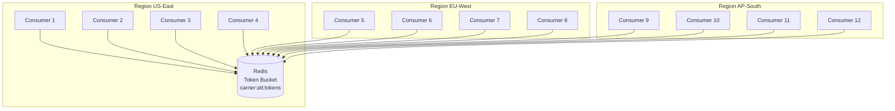
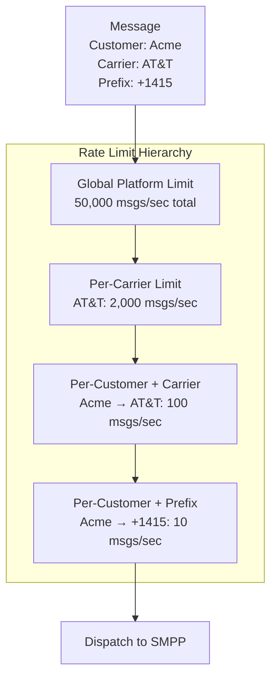
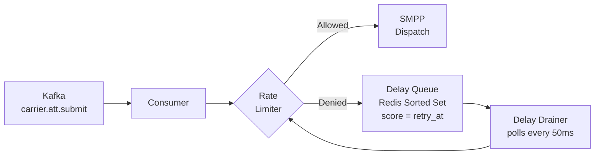
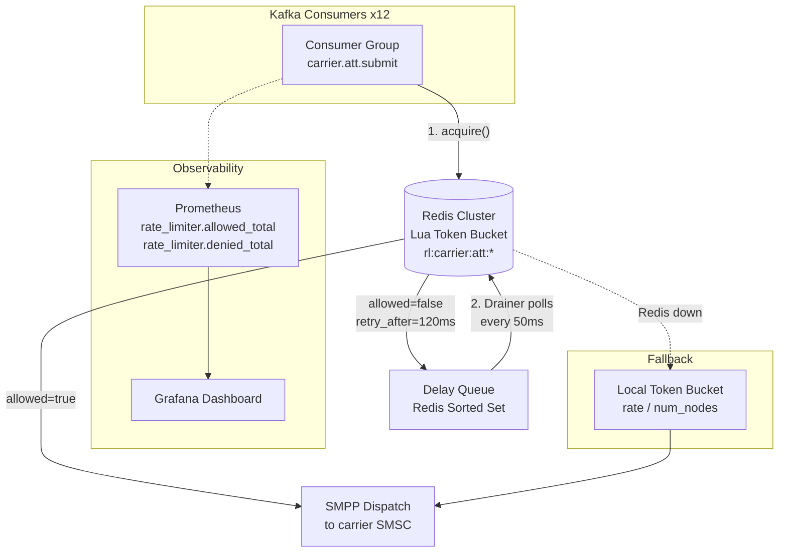

# 3. Distributed Rate Limiting (Token Buckets) 🟡

> **The Problem:** You have 200 carrier connections, each with strict throughput limits. AT&T says 100 msgs/sec. Vodafone says 50 msgs/sec. If you exceed those limits for even a few seconds, carriers throttle you, drop messages silently, or—worst case—*terminate your SMPP bind entirely*. But your routing engine runs on 12 Kafka consumer instances across 3 data centers—all trying to drain the same carrier queue. You need a **distributed, strict rate limiter** that enforces per-carrier, per-customer throughput caps across every node, with zero over-admission, queuing the excess gracefully.

---

## Why Rate Limiting is a First-Class Concern

In most web services, rate limiting is a defensive mechanism—protecting your servers from abusive clients. In a messaging gateway, the polarity is inverted: **rate limiting protects your carrier relationships from your own traffic**.

| Scenario | Web API Rate Limiting | Carrier Rate Limiting |
|---|---|---|
| **Who is protected** | Your servers | The carrier's SMSC |
| **Consequence of violation** | Client gets `429` | Carrier bans your account |
| **Enforcement location** | Edge proxy / API gateway | Deep in the processing pipeline |
| **Tolerance for over-admission** | Some (client retries) | **Zero** (messages dropped or bind killed) |
| **Granularity** | Per API key, per IP | Per carrier, per customer, per prefix |
| **Recovery time** | Instant (next window) | Hours to days (manual re-enablement) |

This asymmetry means our rate limiter must be **strict, not approximate**. A leaky bucket that occasionally admits 102 messages in a 100-msg/sec window is unacceptable.

---

## Rate Limiting Algorithms Compared

Before picking an approach, let's evaluate the landscape:

```mermaid
flowchart TD
    subgraph Algorithms
        FB[Fixed Window] --> |"Simple but bursty<br/>at window edges"| PROB1[2x burst problem]
        SW[Sliding Window Log] --> |"Precise but<br/>memory-intensive"| PROB2[O(n) per check]
        SWC[Sliding Window Counter] --> |"Good balance"| PROB3[Approximation error]
        LB[Leaky Bucket] --> |"Smooth output<br/>queue required"| PROB4[Queue management]
        TB[Token Bucket] --> |"Allows bursts<br/>up to bucket size"| WIN[✓ Best fit for SMPP]
    end

    TB --> |"Distributed via<br/>Redis + Lua"| REDIS[(Redis Cluster)]
```

### Algorithm Comparison

| Algorithm | Burst Handling | Precision | Memory | Distributed Complexity |
|---|---|---|---|---|
| Fixed Window | 2x burst at boundary | Low | O(1) | Low |
| Sliding Window Log | No bursts | Exact | O(n) | High |
| Sliding Window Counter | Smoothed | ~Approximate | O(1) | Medium |
| Leaky Bucket | No bursts (smoothed) | Exact | O(queue) | High |
| **Token Bucket** | **Controlled bursts** | **Exact** | **O(1)** | **Medium** |

We choose the **Token Bucket** because:

1. It allows controlled bursts (a carrier that allows 100 msgs/sec often tolerates 20 messages in a single 50ms burst, as long as the second-level average holds).
2. State is O(1): just `tokens_remaining` and `last_refill_timestamp`.
3. It can be implemented atomically in Redis with a single Lua script.

---

## Token Bucket: The Mental Model

Imagine a bucket that holds a maximum of `B` tokens. Every `1/R` seconds, one token is added (where `R` is the rate). To send a message, you must remove one token. If the bucket is empty, the message is queued.

```
     ┌─── Refill: R tokens/sec ───┐
     │                             │
     ▼                             │
┌──────────┐                       │
│ ●●●●●●●● │  Bucket Capacity: B  │
│ ●●●●●●●● │                      │
│ ●●●○○○○○ │  Current: 18 tokens  │
└────┬─────┘                       │
     │                             │
     ▼ Consume 1 token             │
   ┌───┐                           │
   │MSG│──────────────────────────►│ Timer
   └───┘                           │
                                   │
   If tokens == 0:                 │
   ┌──────┐                        │
   │QUEUED│ → Wait for refill ─────┘
   └──────┘
```

### Formal Definition

```
Token Bucket(rate R, capacity B):

  State:
    tokens:     f64    // current token count
    last_refill: i64   // timestamp of last refill (microseconds)

  acquire(n=1) → (allowed: bool, retry_after_ms: u64):
    now  = current_time_us()
    elapsed = now - last_refill 
    
    // Refill tokens based on elapsed time
    tokens = min(B, tokens + elapsed * R / 1_000_000)
    last_refill = now
    
    if tokens >= n:
      tokens -= n
      return (true, 0)
    else:
      deficit = n - tokens
      wait_us = deficit * 1_000_000 / R
      return (false, wait_us / 1000)
```

---

## The Distributed Problem

A single-node token bucket is trivial. The challenge arises when **12 Kafka consumers across 3 regions** all drain messages destined for the same carrier:



### Why You Can't Use Local Counters

A tempting shortcut: give each consumer a "share" of the rate (100 msgs/sec ÷ 12 consumers ≈ 8 msgs/sec each). This fails spectacularly:

| Problem | Description |
|---|---|
| **Uneven partitioning** | Kafka doesn't distribute AT&T-bound messages evenly across consumers. Consumer 3 might get 80% of AT&T traffic. |
| **Consumer scaling** | Adding or removing consumers requires redistributing shares—a coordination nightmare. |
| **Wasted capacity** | If Consumer 7 has no AT&T traffic, its 8 msgs/sec share is wasted while Consumer 3 is throttled at 8. |
| **Precision** | 100/12 = 8.33... You can't send a third of a message. Integer division means rounding errors accumulate. |

The only correct approach: **centralized token state in Redis, accessed atomically via Lua scripts**.

---

## The Redis Lua Script: Atomic Token Bucket

Redis executes Lua scripts atomically—no other command can interleave. This gives us a distributed mutex without distributed locking overhead.

### The Script

```lua
-- token_bucket.lua
-- KEYS[1] = bucket key (e.g., "rl:carrier:att:customer:cust_123")
-- ARGV[1] = rate (tokens per second)
-- ARGV[2] = capacity (max tokens)
-- ARGV[3] = now (current timestamp in microseconds)
-- ARGV[4] = requested tokens (typically 1)

local key       = KEYS[1]
local rate      = tonumber(ARGV[1])           -- tokens/sec
local capacity  = tonumber(ARGV[2])           -- max burst
local now       = tonumber(ARGV[3])           -- microseconds
local requested = tonumber(ARGV[4]) or 1

-- Load current state or initialize
local bucket = redis.call('HMGET', key, 'tokens', 'last_refill')
local tokens      = tonumber(bucket[1])
local last_refill = tonumber(bucket[2])

-- Initialize on first access
if tokens == nil then
    tokens = capacity
    last_refill = now
end

-- Calculate token refill based on elapsed time
local elapsed = math.max(0, now - last_refill)
local refill  = elapsed * rate / 1000000.0   -- rate is per second, elapsed is μs
tokens = math.min(capacity, tokens + refill)
last_refill = now

-- Try to acquire tokens
if tokens >= requested then
    tokens = tokens - requested
    redis.call('HMSET', key,
        'tokens', tostring(tokens),
        'last_refill', tostring(last_refill))
    -- TTL: auto-expire idle buckets after 2x the refill-to-full duration
    local ttl = math.ceil(capacity / rate * 2)
    redis.call('EXPIRE', key, ttl)
    return {1, 0}  -- {allowed, retry_after_ms}
else
    -- Calculate when enough tokens will be available
    local deficit = requested - tokens
    local wait_us = deficit / rate * 1000000.0
    -- Still update the refill state (tokens may have partially refilled)
    redis.call('HMSET', key,
        'tokens', tostring(tokens),
        'last_refill', tostring(last_refill))
    local ttl = math.ceil(capacity / rate * 2)
    redis.call('EXPIRE', key, ttl)
    return {0, math.ceil(wait_us / 1000)}  -- {denied, retry_after_ms}
end
```

### Why Lua, Not MULTI/EXEC?

| Feature | `MULTI/EXEC` | Lua Script |
|---|---|---|
| Read-then-write atomicity | ❌ Optimistic locking only (WATCH) | ✅ Fully atomic |
| Conditional logic | ❌ No branching | ✅ Full language |
| Network round-trips | 2+ (WATCH, GET, MULTI, SET, EXEC) | 1 (EVALSHA) |
| Retry on contention | Yes (WATCH fails, must retry) | No (always succeeds) |
| Performance at 50K ops/sec | Poor (retries compound) | Excellent |

---

## Rust Implementation

### The Rate Limiter Client

```rust,ignore
use redis::aio::MultiplexedConnection;
use redis::Script;
use std::sync::Arc;
use std::time::{SystemTime, UNIX_EPOCH};

/// Result of a rate limit check.
#[derive(Debug, Clone)]
pub struct RateLimitResult {
    /// Whether the request was allowed.
    pub allowed: bool,
    /// If denied, how many milliseconds to wait before retrying.
    pub retry_after_ms: u64,
}

/// Distributed token bucket rate limiter backed by Redis.
pub struct TokenBucketLimiter {
    conn: MultiplexedConnection,
    script: Arc<Script>,
}

impl TokenBucketLimiter {
    /// Load the Lua script into Redis and return a limiter handle.
    pub async fn new(conn: MultiplexedConnection) -> redis::RedisResult<Self> {
        let lua_source = include_str!("../scripts/token_bucket.lua");
        let script = Arc::new(Script::new(lua_source));
        Ok(Self { conn, script })
    }

    /// Attempt to acquire `count` tokens from the named bucket.
    ///
    /// - `key`: e.g., `"rl:carrier:att:customer:cust_123"`
    /// - `rate`: tokens per second (e.g., 100.0)
    /// - `capacity`: maximum burst size (e.g., 100)
    /// - `count`: tokens to acquire (typically 1)
    pub async fn acquire(
        &mut self,
        key: &str,
        rate: f64,
        capacity: u64,
        count: u64,
    ) -> redis::RedisResult<RateLimitResult> {
        let now_us = SystemTime::now()
            .duration_since(UNIX_EPOCH)
            .expect("clock went backwards")
            .as_micros() as u64;

        let result: (i64, i64) = self
            .script
            .key(key)
            .arg(rate)
            .arg(capacity)
            .arg(now_us)
            .arg(count)
            .invoke_async(&mut self.conn)
            .await?;

        Ok(RateLimitResult {
            allowed: result.0 == 1,
            retry_after_ms: result.1 as u64,
        })
    }
}
```

### Integrating with the Kafka Consumer Pipeline

The rate limiter sits between route selection and SMPP dispatch:

```rust,ignore
use tokio::time::{sleep, Duration};

/// Per-carrier rate limit configuration.
#[derive(Debug, Clone)]
pub struct CarrierRateConfig {
    pub carrier_id: String,
    /// Max messages per second to this carrier.
    pub rate: f64,
    /// Burst capacity (typically == rate for strict limiting).
    pub capacity: u64,
}

/// Process a routed message: apply rate limiting, then dispatch.
async fn process_routed_message(
    limiter: &mut TokenBucketLimiter,
    carrier_cfg: &CarrierRateConfig,
    customer_id: &str,
    message: &RoutedMessage,
) -> Result<(), DispatchError> {
    // Build the rate limit key: per-carrier + per-customer
    let key = format!(
        "rl:carrier:{}:customer:{}",
        carrier_cfg.carrier_id, customer_id
    );

    loop {
        let result = limiter
            .acquire(&key, carrier_cfg.rate, carrier_cfg.capacity, 1)
            .await
            .map_err(DispatchError::Redis)?;

        if result.allowed {
            // Token acquired — dispatch to SMPP
            dispatch_to_carrier(message).await?;
            return Ok(());
        }

        // Rate limited — back-pressure: wait the suggested interval
        tracing::debug!(
            carrier = %carrier_cfg.carrier_id,
            retry_after_ms = result.retry_after_ms,
            "rate limited, sleeping"
        );

        sleep(Duration::from_millis(result.retry_after_ms)).await;
    }
}
```

---

## Hierarchical Rate Limits

A real messaging gateway enforces multiple overlapping limits:



### Implementation: Hierarchical Check

```rust,ignore
/// Rate limit keys checked in order (most global → most specific).
/// ALL must pass for the message to be dispatched.
fn build_rate_limit_chain(
    customer_id: &str,
    carrier_id: &str,
    prefix: &str,
) -> Vec<(String, f64, u64)> {
    // (key, rate, capacity)
    vec![
        // 1. Global platform limit
        (
            "rl:global".to_string(),
            50_000.0,
            50_000,
        ),
        // 2. Per-carrier limit
        (
            format!("rl:carrier:{carrier_id}"),
            2_000.0,
            2_000,
        ),
        // 3. Per-customer per-carrier
        (
            format!("rl:carrier:{carrier_id}:customer:{customer_id}"),
            100.0,
            100,
        ),
        // 4. Per-customer per-prefix
        (
            format!("rl:customer:{customer_id}:prefix:{prefix}"),
            10.0,
            10,
        ),
    ]
}

/// Check all rate limits in the hierarchy. Returns the first denial or Ok.
async fn check_rate_limit_hierarchy(
    limiter: &mut TokenBucketLimiter,
    chain: &[(String, f64, u64)],
) -> Result<RateLimitResult, redis::RedisError> {
    for (key, rate, capacity) in chain {
        let result = limiter.acquire(key, *rate, *capacity, 1).await?;
        if !result.allowed {
            // Denied at this level — don't check lower levels
            return Ok(result);
        }
    }
    Ok(RateLimitResult {
        allowed: true,
        retry_after_ms: 0,
    })
}
```

### The Over-Consumption Problem

There's a subtle bug in hierarchical limiting. If we acquire a token from the global bucket (Level 1) but are then denied at the per-carrier bucket (Level 2), we've **consumed a global token for nothing**. Solutions:

| Approach | Pros | Cons |
|---|---|---|
| **Accept the waste** | Simple | Under extreme contention, global limit is consumed 10-20% too fast |
| **Multi-key Lua script** | Atomic all-or-nothing across keys | All keys must live on the same Redis node (no cluster) |
| **Compensating refund** | Works with clusters | Race window between acquire and refund |
| **Check-then-acquire** | Read all first, then acquire | TOCTOU race—another consumer can slip in |
| **Pipelined CAS loop** | Precise with retries | Complex, higher latency |

The pragmatic choice: **multi-key Lua script** with Redis hash tags to ensure co-location:

```lua
-- hierarchical_token_bucket.lua
-- KEYS[1..N] = bucket keys at each level
-- ARGV layout: [now_us, num_levels, rate1, cap1, rate2, cap2, ...]

local now       = tonumber(ARGV[1])
local num_levels = tonumber(ARGV[2])

-- Phase 1: Compute available tokens at each level (read pass)
local states = {}
for i = 1, num_levels do
    local key  = KEYS[i]
    local rate = tonumber(ARGV[2 + (i-1)*2 + 1])
    local cap  = tonumber(ARGV[2 + (i-1)*2 + 2])
    
    local bucket = redis.call('HMGET', key, 'tokens', 'last_refill')
    local tokens      = tonumber(bucket[1]) or cap
    local last_refill = tonumber(bucket[2]) or now
    
    local elapsed = math.max(0, now - last_refill)
    local refill  = elapsed * rate / 1000000.0
    tokens = math.min(cap, tokens + refill)
    
    states[i] = {key=key, tokens=tokens, rate=rate, cap=cap}
    
    -- If any level would deny, abort early (no tokens consumed)
    if tokens < 1 then
        local deficit = 1 - tokens
        local wait_us = deficit / rate * 1000000.0
        return {0, math.ceil(wait_us / 1000), i}  -- denied, wait, level
    end
end

-- Phase 2: All levels would allow — commit (write pass)
for i = 1, num_levels do
    local s = states[i]
    local new_tokens = s.tokens - 1
    redis.call('HMSET', s.key,
        'tokens', tostring(new_tokens),
        'last_refill', tostring(now))
    local ttl = math.ceil(s.cap / s.rate * 2)
    redis.call('EXPIRE', s.key, ttl)
end

return {1, 0, 0}  -- allowed
```

To ensure all keys land on the same Redis Cluster hash slot, use **hash tags**:

```
rl:{att}:global
rl:{att}:carrier:att
rl:{att}:carrier:att:customer:cust_123
rl:{att}:customer:cust_123:prefix:+1415
```

Redis hashes only the content inside `{}`, so all four keys hash to the slot for `"att"`.

---

## Queuing the Excess: Back-Pressure Architecture

When a message is rate-limited, we can't just drop it. We need a **spill queue** that re-submits messages when capacity becomes available.



### Delay Queue with Redis Sorted Sets

```rust,ignore
use redis::AsyncCommands;

/// Enqueue a rate-limited message for delayed retry.
async fn enqueue_delayed(
    conn: &mut MultiplexedConnection,
    carrier_id: &str,
    message_id: &str,
    payload_json: &str,
    retry_after_ms: u64,
) -> redis::RedisResult<()> {
    let queue_key = format!("delay_queue:carrier:{carrier_id}");
    let retry_at = SystemTime::now()
        .duration_since(UNIX_EPOCH)
        .unwrap()
        .as_millis() as u64
        + retry_after_ms;

    // Store the payload in a separate key (sorted sets only hold member + score)
    let payload_key = format!("msg:{message_id}:payload");
    let _: () = conn.set_ex(&payload_key, payload_json, 3600).await?;

    // Add to sorted set with score = retry_at timestamp
    let _: () = conn
        .zadd(&queue_key, message_id, retry_at as f64)
        .await?;

    Ok(())
}

/// Drain messages that are ready for retry.
async fn drain_delay_queue(
    conn: &mut MultiplexedConnection,
    limiter: &mut TokenBucketLimiter,
    carrier_id: &str,
    batch_size: isize,
) -> redis::RedisResult<Vec<String>> {
    let queue_key = format!("delay_queue:carrier:{carrier_id}");
    let now_ms = SystemTime::now()
        .duration_since(UNIX_EPOCH)
        .unwrap()
        .as_millis() as f64;

    // Fetch messages whose retry_at <= now
    let ready: Vec<(String, f64)> = conn
        .zrangebyscore_limit_withscores(
            &queue_key,
            0.0f64,
            now_ms,
            0,
            batch_size,
        )
        .await?;

    let mut dispatched = Vec::new();

    for (message_id, _score) in &ready {
        // Re-check rate limit before dispatching
        let result = limiter
            .acquire(
                &format!("rl:carrier:{carrier_id}"),
                2000.0,
                2000,
                1,
            )
            .await?;

        if result.allowed {
            // Remove from delay queue and dispatch
            let _: () = conn.zrem(&queue_key, message_id).await?;
            dispatched.push(message_id.clone());
        } else {
            // Still rate-limited — stop draining, try again next cycle
            break;
        }
    }

    Ok(dispatched)
}
```

### The Delay Drainer Loop

```rust,ignore
/// Background task that continuously drains delay queues.
async fn delay_drainer_loop(
    mut conn: MultiplexedConnection,
    mut limiter: TokenBucketLimiter,
    carrier_ids: Vec<String>,
) {
    let mut interval = tokio::time::interval(Duration::from_millis(50));

    loop {
        interval.tick().await;

        for carrier_id in &carrier_ids {
            match drain_delay_queue(&mut conn, &mut limiter, carrier_id, 50)
                .await
            {
                Ok(dispatched) => {
                    if !dispatched.is_empty() {
                        tracing::info!(
                            carrier = %carrier_id,
                            count = dispatched.len(),
                            "drained delayed messages"
                        );
                    }
                }
                Err(e) => {
                    tracing::error!(
                        carrier = %carrier_id,
                        error = %e,
                        "delay queue drain failed"
                    );
                }
            }
        }
    }
}
```

---

## Clock Skew and Time Synchronization

The Lua script receives `now` as an argument from the Rust client. This means **all timing is governed by client clocks**, not the Redis server clock. If two consumers in different regions have skewed clocks, the token math breaks:

```
Consumer A (US-East): clock = 12:00:00.000
Consumer B (EU-West): clock = 12:00:00.150  ← 150ms ahead

Consumer B calls acquire() at its 12:00:00.150.
150ms of tokens are "refilled" that shouldn't exist yet.
Result: over-admission by 150ms × rate tokens.
```

### Mitigation Strategies

| Strategy | Effectiveness | Complexity |
|---|---|---|
| **Use Redis `TIME` inside Lua** | Perfect (single source of truth) | Low |
| NTP with tight sync (chrony) | ~1ms accuracy | Medium |
| Hybrid: client time + server-side bounds check | Good | Medium |

The best approach: **use Redis server time**. Replace the client-provided `now` with `redis.call('TIME')`:

```lua
-- Replace ARGV-based time with Redis server time
local time = redis.call('TIME')
local now = tonumber(time[1]) * 1000000 + tonumber(time[2])  -- microseconds
```

This eliminates clock skew entirely. The trade-off is that the Lua script is no longer purely deterministic (it has a side-effecting `TIME` call), but Redis `TIME` is explicitly allowed inside Lua scripts.

---

## Observability: Rate Limiter Metrics

A rate limiter that you can't observe is a rate limiter that silently drops revenue. Every acquire call should emit metrics:

```rust,ignore
use metrics::{counter, histogram};

/// Instrumented rate limit check.
async fn acquire_instrumented(
    limiter: &mut TokenBucketLimiter,
    key: &str,
    rate: f64,
    capacity: u64,
    carrier_id: &str,
    customer_id: &str,
) -> redis::RedisResult<RateLimitResult> {
    let start = std::time::Instant::now();

    let result = limiter.acquire(key, rate, capacity, 1).await?;

    let elapsed = start.elapsed();

    // Latency of the Redis round-trip
    histogram!(
        "rate_limiter.acquire_duration_ms",
        "carrier" => carrier_id.to_string(),
    )
    .record(elapsed.as_secs_f64() * 1000.0);

    if result.allowed {
        counter!(
            "rate_limiter.allowed_total",
            "carrier" => carrier_id.to_string(),
            "customer" => customer_id.to_string(),
        )
        .increment(1);
    } else {
        counter!(
            "rate_limiter.denied_total",
            "carrier" => carrier_id.to_string(),
            "customer" => customer_id.to_string(),
        )
        .increment(1);

        histogram!(
            "rate_limiter.retry_after_ms",
            "carrier" => carrier_id.to_string(),
        )
        .record(result.retry_after_ms as f64);
    }

    Ok(result)
}
```

### Key Dashboards

| Metric | Alert Threshold | Meaning |
|---|---|---|
| `rate_limiter.denied_total` rate | > 50% of attempts for 5 min | Customer or carrier is persistently saturated |
| `rate_limiter.acquire_duration_ms` p99 | > 5ms | Redis is overloaded or network partition |
| `rate_limiter.retry_after_ms` p99 | > 2000ms | Severe back-pressure; messages aging in delay queue |
| `delay_queue.depth` | > 10,000 for 10 min | Queue is growing faster than it drains |

---

## Failure Modes and Resilience

### What Happens When Redis Is Down?

This is the critical question. If Redis is unavailable, the rate limiter cannot function. You have three options:

| Strategy | Behavior | Risk |
|---|---|---|
| **Fail open** | Allow all traffic | Carrier ban if sustained |
| **Fail closed** | Deny all traffic | Total message outage |
| **Local fallback** | Switch to per-node approximate limiter | Over-admission by ~Nx (N = node count) |

The production-grade approach: **local fallback with degraded limits**.

```rust,ignore
use std::sync::atomic::{AtomicU64, Ordering};
use std::sync::Arc;

/// Local in-memory token bucket for Redis-down fallback.
pub struct LocalTokenBucket {
    tokens: AtomicU64,
    capacity: u64,
    rate: u64,
    last_refill: AtomicU64,
}

impl LocalTokenBucket {
    pub fn new(rate: u64, capacity: u64) -> Self {
        let now = SystemTime::now()
            .duration_since(UNIX_EPOCH)
            .unwrap()
            .as_micros() as u64;
        Self {
            tokens: AtomicU64::new(capacity),
            capacity,
            rate,
            last_refill: AtomicU64::new(now),
        }
    }

    /// Non-blocking acquire. Returns true if a token was available.
    pub fn try_acquire(&self) -> bool {
        self.refill();
        // Attempt to decrement tokens atomically
        loop {
            let current = self.tokens.load(Ordering::Acquire);
            if current == 0 {
                return false;
            }
            if self
                .tokens
                .compare_exchange_weak(
                    current,
                    current - 1,
                    Ordering::AcqRel,
                    Ordering::Acquire,
                )
                .is_ok()
            {
                return true;
            }
        }
    }

    fn refill(&self) {
        let now = SystemTime::now()
            .duration_since(UNIX_EPOCH)
            .unwrap()
            .as_micros() as u64;
        let last = self.last_refill.load(Ordering::Acquire);
        let elapsed = now.saturating_sub(last);
        let new_tokens = elapsed * self.rate / 1_000_000;
        if new_tokens > 0 {
            if self
                .last_refill
                .compare_exchange(
                    last,
                    now,
                    Ordering::AcqRel,
                    Ordering::Acquire,
                )
                .is_ok()
            {
                let current = self.tokens.load(Ordering::Acquire);
                let refilled = std::cmp::min(
                    self.capacity,
                    current.saturating_add(new_tokens),
                );
                self.tokens.store(refilled, Ordering::Release);
            }
        }
    }
}

/// Resilient rate limiter: Redis primary, local fallback.
pub struct ResilientLimiter {
    redis_limiter: TokenBucketLimiter,
    local_fallback: Arc<LocalTokenBucket>,
}

impl ResilientLimiter {
    pub async fn acquire(
        &mut self,
        key: &str,
        rate: f64,
        capacity: u64,
        num_nodes: u64,
    ) -> RateLimitResult {
        // Try Redis first
        match self
            .redis_limiter
            .acquire(key, rate, capacity, 1)
            .await
        {
            Ok(result) => result,
            Err(e) => {
                tracing::warn!(
                    error = %e,
                    "Redis rate limiter unavailable, falling back to local"
                );
                counter!("rate_limiter.redis_fallback_total").increment(1);

                // Local fallback with conservative rate = global_rate / num_nodes
                // This is approximate but prevents carrier ban
                if self.local_fallback.try_acquire() {
                    RateLimitResult {
                        allowed: true,
                        retry_after_ms: 0,
                    }
                } else {
                    RateLimitResult {
                        allowed: false,
                        retry_after_ms: 100,
                    }
                }
            }
        }
    }
}
```

---

## Performance Tuning

### Redis Pipelining for Batch Acquire

When a consumer pulls a batch of 100 messages from Kafka, don't make 100 sequential Redis calls. Use pipelining:

```rust,ignore
use redis::pipe;

/// Acquire tokens for a batch of messages in a single Redis round-trip.
async fn acquire_batch(
    conn: &mut MultiplexedConnection,
    script: &Script,
    messages: &[RoutedMessage],
    rate: f64,
    capacity: u64,
) -> redis::RedisResult<Vec<RateLimitResult>> {
    let now_us = SystemTime::now()
        .duration_since(UNIX_EPOCH)
        .unwrap()
        .as_micros() as u64;

    let mut pipeline = pipe();

    for msg in messages {
        let key = format!(
            "rl:carrier:{}:customer:{}",
            msg.carrier_id, msg.customer_id
        );
        script
            .key(&key)
            .arg(rate)
            .arg(capacity)
            .arg(now_us)
            .arg(1u64)
            .invoke_async(&mut pipeline);
    }

    // All N EVALSHA commands are sent in a single TCP write
    // and results come back in a single TCP read.
    let results: Vec<(i64, i64)> =
        pipeline.query_async(conn).await?;

    Ok(results
        .into_iter()
        .map(|(allowed, retry_after)| RateLimitResult {
            allowed: allowed == 1,
            retry_after_ms: retry_after as u64,
        })
        .collect())
}
```

### Performance Comparison

| Approach | Messages | Redis Calls | Network Round-Trips | Latency |
|---|---|---|---|---|
| Sequential | 100 | 100 | 100 | ~50ms |
| Pipelined | 100 | 100 | **1** | **~1ms** |
| Multi-key Lua | 100 | **1** | **1** | **~0.5ms** |

---

## Testing the Rate Limiter

### Property-Based Testing

The rate limiter must satisfy two invariants:

1. **Never over-admit**: Over any 1-second window, at most `rate` tokens are consumed.
2. **Never under-admit**: If capacity is available, tokens are granted immediately.

```rust,ignore
#[cfg(test)]
mod tests {
    use super::*;
    use tokio::time::{self, Instant};

    /// Verify that the rate limiter never exceeds the configured rate
    /// over a 1-second window.
    #[tokio::test]
    async fn test_strict_rate_enforcement() {
        let client = redis::Client::open("redis://127.0.0.1/").unwrap();
        let conn = client
            .get_multiplexed_async_connection()
            .await
            .unwrap();
        let mut limiter = TokenBucketLimiter::new(conn).await.unwrap();

        let key = "test:rate:strict";
        let rate = 100.0;
        let capacity = 100;

        // Flush the bucket
        let mut conn2 = client
            .get_multiplexed_async_connection()
            .await
            .unwrap();
        let _: () = redis::cmd("DEL")
            .arg(key)
            .query_async(&mut conn2)
            .await
            .unwrap();

        let start = Instant::now();
        let mut allowed_count = 0u64;

        // Try to acquire 200 tokens in rapid succession
        for _ in 0..200 {
            let result =
                limiter.acquire(key, rate, capacity, 1).await.unwrap();
            if result.allowed {
                allowed_count += 1;
            }
        }

        let elapsed = start.elapsed();

        // We should have gotten at most `capacity` tokens immediately
        // (since we're faster than the refill rate)
        assert!(
            allowed_count <= capacity,
            "Over-admitted: got {allowed_count} tokens, max was {capacity}"
        );

        // All 100 tokens should have been granted (bucket starts full)
        assert_eq!(
            allowed_count, capacity,
            "Under-admitted: got {allowed_count}, expected {capacity}"
        );

        println!(
            "Acquired {allowed_count}/{capacity} tokens in {elapsed:?}"
        );
    }

    /// Verify that tokens refill correctly over time.
    #[tokio::test]
    async fn test_token_refill() {
        let client = redis::Client::open("redis://127.0.0.1/").unwrap();
        let conn = client
            .get_multiplexed_async_connection()
            .await
            .unwrap();
        let mut limiter = TokenBucketLimiter::new(conn).await.unwrap();

        let key = "test:rate:refill";
        let rate = 10.0; // 10 tokens/sec
        let capacity = 10;

        // Flush 
        let mut conn2 = client
            .get_multiplexed_async_connection()
            .await
            .unwrap();
        let _: () = redis::cmd("DEL")
            .arg(key)
            .query_async(&mut conn2)
            .await
            .unwrap();

        // Drain all tokens
        for _ in 0..10 {
            limiter.acquire(key, rate, capacity, 1).await.unwrap();
        }

        // Verify next acquire is denied
        let denied = limiter.acquire(key, rate, capacity, 1).await.unwrap();
        assert!(!denied.allowed, "Should be denied after draining");

        // Wait 500ms → should refill ~5 tokens
        time::sleep(Duration::from_millis(500)).await;

        let mut refilled = 0u64;
        for _ in 0..10 {
            let r = limiter.acquire(key, rate, capacity, 1).await.unwrap();
            if r.allowed {
                refilled += 1;
            }
        }

        // Allow ±1 for timing jitter
        assert!(
            (4..=6).contains(&refilled),
            "Expected ~5 refilled tokens, got {refilled}"
        );
    }
}
```

---

## Production Configuration Example

```toml
# rate_limits.toml — Carrier rate limit configuration

[global]
rate = 50000      # msgs/sec platform-wide
capacity = 50000

[carriers.att]
rate = 2000
capacity = 2000
smsc_address = "smpp.att.com:2775"

[carriers.att.customers.cust_acme]
rate = 100        # Acme's contractual limit for AT&T
capacity = 100

[carriers.att.customers.cust_startup]
rate = 20
capacity = 20

[carriers.vodafone_de]
rate = 500
capacity = 500

[carriers.vodafone_de.customers.cust_acme]
rate = 50
capacity = 50

[carriers.twilio_us]
rate = 10000      # Twilio has generous limits
capacity = 10000

[carriers.twilio_us.customers.cust_acme]
rate = 1000
capacity = 1000
```

```rust,ignore
use serde::Deserialize;
use std::collections::HashMap;

#[derive(Debug, Deserialize)]
pub struct RateLimitConfig {
    pub global: BucketConfig,
    pub carriers: HashMap<String, CarrierConfig>,
}

#[derive(Debug, Deserialize)]
pub struct BucketConfig {
    pub rate: u64,
    pub capacity: u64,
}

#[derive(Debug, Deserialize)]
pub struct CarrierConfig {
    pub rate: u64,
    pub capacity: u64,
    pub smsc_address: Option<String>,
    #[serde(default)]
    pub customers: HashMap<String, BucketConfig>,
}

impl RateLimitConfig {
    pub fn load(path: &str) -> Result<Self, Box<dyn std::error::Error>> {
        let content = std::fs::read_to_string(path)?;
        let config: Self = toml::from_str(&content)?;
        Ok(config)
    }

    /// Build the rate limit chain for a specific customer + carrier.
    pub fn build_chain(
        &self,
        customer_id: &str,
        carrier_id: &str,
    ) -> Vec<(String, f64, u64)> {
        let mut chain = vec![(
            "rl:global".to_string(),
            self.global.rate as f64,
            self.global.capacity,
        )];

        if let Some(carrier) = self.carriers.get(carrier_id) {
            chain.push((
                format!("rl:carrier:{carrier_id}"),
                carrier.rate as f64,
                carrier.capacity,
            ));

            if let Some(cust) = carrier.customers.get(customer_id) {
                chain.push((
                    format!(
                        "rl:carrier:{carrier_id}:customer:{customer_id}"
                    ),
                    cust.rate as f64,
                    cust.capacity,
                ));
            }
        }

        chain
    }
}
```

---

## Summary: Token Bucket Rate Limiter Architecture



> **Key Takeaways**
>
> 1. **Strict, not approximate**: Carrier rate limits have zero tolerance for over-admission. Use a token bucket with atomic Redis Lua scripts, not probabilistic approaches.
>
> 2. **Centralized state, distributed consumers**: All 12+ Kafka consumer nodes share token state in Redis. Local rate limiting wastes capacity and violates contracts.
>
> 3. **Hierarchical enforcement**: Real systems enforce overlapping limits (global → carrier → customer → prefix). Use multi-key Lua scripts with hash tags for atomic cross-level checks.
>
> 4. **Queue the excess, don't drop it**: Rate-limited messages go to a delay queue (Redis Sorted Set scored by retry timestamp), drained by a background loop that re-checks the limiter.
>
> 5. **Use server time**: Eliminate clock skew across regions by using `redis.call('TIME')` inside the Lua script instead of client-provided timestamps.
>
> 6. **Fail degraded, not dead**: When Redis is unavailable, fall back to local in-memory token buckets with conservative per-node rates. Monitor `redis_fallback_total` aggressively.
>
> 7. **Pipeline for throughput**: A batch of 100 messages should be one Redis round-trip (pipelining), not 100 sequential calls. This drops latency from ~50ms to ~1ms.
