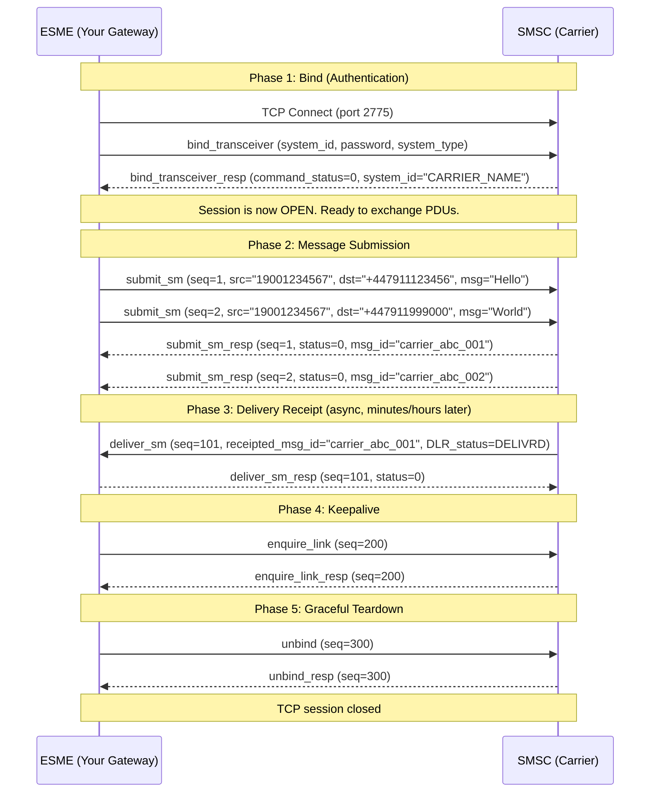
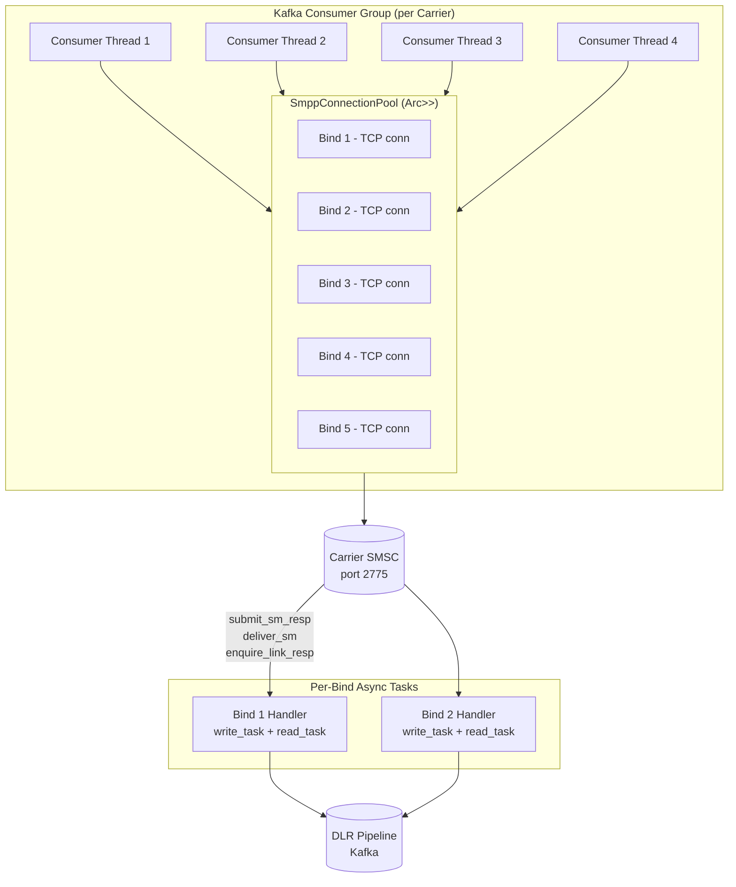
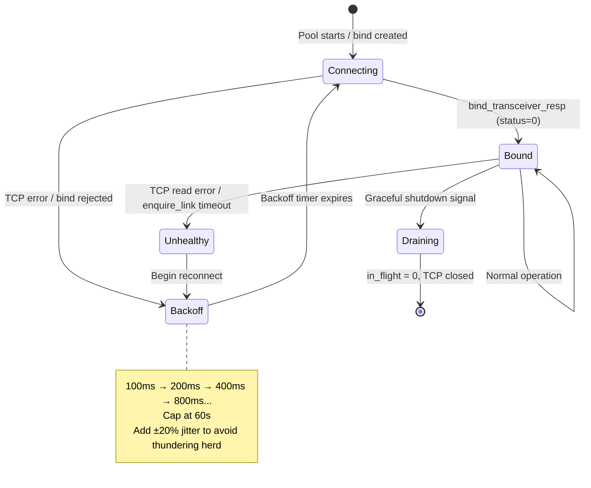
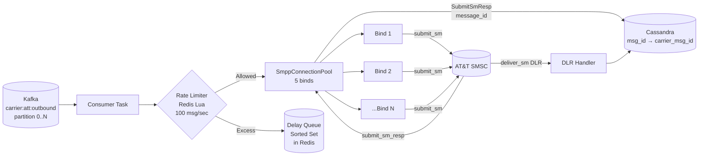

# 4. The SMPP Protocol and Connection Pooling 🔴

> **The Problem:** HTTP is stateless. SMPP is not. Carriers require you to establish a persistent, authenticated TCP session—called a **Bind**—before you can send a single message. Each bind is a scarce resource: a carrier may grant you only 5 simultaneous binds, and each bind can sustain ~300 messages/sec before its internal queue backs up. Your routing engine needs to multiplex thousands of outbound messages per second across a small pool of these precious, stateful TCP connections—without losing a single message if a connection drops, without over-subscribing a carrier's capacity, and without re-authenticating (slow) on every message (very slow).

---

## Why SMPP Exists

Before REST APIs, before JSON, before even HTTP as a message-transport, the telecom world needed a way for applications to submit SMS messages to carrier **SMSCs** (Short Message Service Centers). The result—standardized in 1999—is the **Short Message Peer-to-Peer (SMPP)** protocol.

| Dimension | HTTP/REST (What You Know) | SMPP (What Carriers Use) |
|---|---|---|
| **Connection model** | Stateless, per-request | Stateful, persistent TCP session |
| **Authentication** | Per-request header (`Authorization`) | One-time session `bind_transceiver` PDU |
| **Message framing** | Text-based, newline-delimited | Binary, length-prefixed PDUs |
| **Throughput** | Limited by TLS handshake overhead | Fixed per bind (negotiated) |
| **Reliability ACK** | HTTP 200 OK | `submit_sm_resp` with `message_id` |
| **Async DLR** | Webhook callback | `deliver_sm` PDU on same connection |
| **Version in production** | HTTP/2 or HTTP/3 | SMPP 3.4 (1999), rarely v5.0 |

SMPP 3.4 is ancient by software standards. It is also running on billions of dollars of carrier infrastructure that will not be replaced this decade. Understanding it is non-negotiable for any messaging gateway engineer.

---

## The SMPP PDU Structure

Every SMPP message is a **PDU (Protocol Data Unit)**—a binary packet with a fixed 16-byte header followed by a variable-length body.

```
 0                   1                   2                   3
 0 1 2 3 4 5 6 7 8 9 0 1 2 3 4 5 6 7 8 9 0 1 2 3 4 5 6 7 8 9 0 1
+-+-+-+-+-+-+-+-+-+-+-+-+-+-+-+-+-+-+-+-+-+-+-+-+-+-+-+-+-+-+-+-+
|                       Command Length                           |  4 bytes, total PDU length
+-+-+-+-+-+-+-+-+-+-+-+-+-+-+-+-+-+-+-+-+-+-+-+-+-+-+-+-+-+-+-+-+
|                        Command ID                             |  4 bytes, operation type
+-+-+-+-+-+-+-+-+-+-+-+-+-+-+-+-+-+-+-+-+-+-+-+-+-+-+-+-+-+-+-+-+
|                       Command Status                          |  4 bytes, 0 on request
+-+-+-+-+-+-+-+-+-+-+-+-+-+-+-+-+-+-+-+-+-+-+-+-+-+-+-+-+-+-+-+-+
|                       Sequence Number                         |  4 bytes, request/response correlator
+-+-+-+-+-+-+-+-+-+-+-+-+-+-+-+-+-+-+-+-+-+-+-+-+-+-+-+-+-+-+-+-+
|                    Body (variable length)                     |
|                    C-string fields, TLVs                      |
+-+-+-+-+-+-+-+-+-+-+-+-+-+-+-+-+-+-+-+-+-+-+-+-+-+-+-+-+-+-+-+-+
```

### Core Command IDs

| Command Name | ID (hex) | Direction | Purpose |
|---|---|---|---|
| `bind_transmitter` | `0x00000002` | Client → SMSC | Auth: send-only session |
| `bind_receiver` | `0x00000001` | Client → SMSC | Auth: receive-only session |
| `bind_transceiver` | `0x00000009` | Client → SMSC | Auth: bidirectional (preferred) |
| `bind_transceiver_resp` | `0x80000009` | SMSC → Client | Auth response, session established |
| `submit_sm` | `0x00000004` | Client → SMSC | Submit a message for delivery |
| `submit_sm_resp` | `0x80000004` | SMSC → Client | ACK, includes carrier's `message_id` |
| `deliver_sm` | `0x00000005` | SMSC → Client | Inbound: DLR or MO message |
| `deliver_sm_resp` | `0x80000005` | Client → SMSC | ACK the deliver_sm |
| `enquire_link` | `0x00000015` | Either | Keepalive heartbeat |
| `enquire_link_resp` | `0x80000015` | Either | Heartbeat response |
| `unbind` | `0x00000006` | Either | Graceful session teardown |
| `generic_nack` | `0x80000000` | Either | Generic error response |

> **Key Insight:** The `sequence_number` in the header is the only correlation mechanism. When you send `submit_sm` with `sequence_number = 42`, the SMSC will respond with `submit_sm_resp` with `sequence_number = 42`. Your connection pool must maintain a `HashMap<u32, oneshot::Sender<SubmitSmResp>>` to route responses back to the correct caller.

---

## The Session Lifecycle



The critical property: **the SMSC sends `deliver_sm` PDUs (DLRs) back on the same TCP connection without being asked**. Your connection handler must simultaneously:

1. Write `submit_sm` PDUs from an outbound queue.
2. Read responses to those PDUs and route them via `sequence_number`.
3. Read unsolicited `deliver_sm` PDUs and route them to the DLR processing pipeline.
4. Send periodic `enquire_link` heartbeats (typically every 30 seconds).

This bidirectional, asynchronous nature is why SMPP connections are complex to manage correctly.

---

## Decoding a `submit_sm` PDU in Rust

Let's parse the binary wire format. `submit_sm` body fields are mostly **null-terminated C-strings** (OCTET STRINGs with a `\0` terminator):

```rust
use bytes::{Buf, Bytes};
use std::io;

#[derive(Debug)]
pub struct SmppHeader {
    pub command_length: u32,
    pub command_id: u32,
    pub command_status: u32,
    pub sequence_number: u32,
}

#[derive(Debug)]
pub struct SubmitSm {
    pub header: SmppHeader,
    pub service_type: String,       // C-string, typically ""
    pub source_addr_ton: u8,        // Type of Number
    pub source_addr_npi: u8,        // Numbering Plan Indicator
    pub source_addr: String,        // C-string
    pub dest_addr_ton: u8,
    pub dest_addr_npi: u8,
    pub destination_addr: String,   // C-string
    pub esm_class: u8,              // Message mode flags
    pub protocol_id: u8,
    pub priority_flag: u8,
    pub schedule_delivery_time: String,  // C-string, "" = immediate
    pub validity_period: String,         // C-string, "" = SMSC default
    pub registered_delivery: u8,    // DLR request flags
    pub replace_if_present_flag: u8,
    pub data_coding: u8,            // 0=GSM7bit, 8=UCS2
    pub sm_default_msg_id: u8,
    pub sm_length: u8,
    pub short_message: Vec<u8>,     // Raw bytes (not C-string)
}

fn read_cstring(buf: &mut Bytes) -> io::Result<String> {
    let mut s = Vec::new();
    loop {
        if !buf.has_remaining() {
            return Err(io::Error::new(io::ErrorKind::UnexpectedEof, "cstring not terminated"));
        }
        let b = buf.get_u8();
        if b == 0 {
            break;
        }
        s.push(b);
    }
    String::from_utf8(s).map_err(|e| io::Error::new(io::ErrorKind::InvalidData, e))
}

impl SmppHeader {
    pub fn decode(buf: &mut impl Buf) -> io::Result<Self> {
        if buf.remaining() < 16 {
            return Err(io::Error::new(io::ErrorKind::UnexpectedEof, "header too short"));
        }
        Ok(SmppHeader {
            command_length: buf.get_u32(),
            command_id: buf.get_u32(),
            command_status: buf.get_u32(),
            sequence_number: buf.get_u32(),
        })
    }
}

impl SubmitSm {
    pub fn decode(header: SmppHeader, body: &mut Bytes) -> io::Result<Self> {
        Ok(SubmitSm {
            service_type: read_cstring(body)?,
            source_addr_ton: body.get_u8(),
            source_addr_npi: body.get_u8(),
            source_addr: read_cstring(body)?,
            dest_addr_ton: body.get_u8(),
            dest_addr_npi: body.get_u8(),
            destination_addr: read_cstring(body)?,
            esm_class: body.get_u8(),
            protocol_id: body.get_u8(),
            priority_flag: body.get_u8(),
            schedule_delivery_time: read_cstring(body)?,
            validity_period: read_cstring(body)?,
            registered_delivery: body.get_u8(),
            replace_if_present_flag: body.get_u8(),
            data_coding: body.get_u8(),
            sm_default_msg_id: body.get_u8(),
            sm_length: {
                let len = body.get_u8();
                len
            },
            short_message: {
                let len = body[..].len().min(body.get_u8() as usize);
                // re-read sm_length correctly
                body.copy_to_bytes(len).to_vec()
            },
            header,
        })
    }
}
```

> **Note on data_coding:** `0x00` = GSM 7-bit (160 chars/SMS), `0x08` = UCS-2 (70 chars/SMS). Long messages are split into **multipart SMS** concatenated via the UDH (User Data Header) in `esm_class`. This is a whole chapter on its own—concatenation, SAR (Segmentation and Reassembly), and 6-byte UDH headers are among the most common sources of message corruption bugs.

---

## Encoding `submit_sm` for the Wire

```rust
use bytes::{BufMut, BytesMut};

pub const CMD_SUBMIT_SM: u32 = 0x00000004;

pub struct SubmitSmBuilder {
    sequence_number: u32,
    source_addr: String,
    destination_addr: String,
    message: Vec<u8>,
    data_coding: u8,
    registered_delivery: u8,
}

impl SubmitSmBuilder {
    fn write_cstring(buf: &mut BytesMut, s: &str) {
        buf.put_slice(s.as_bytes());
        buf.put_u8(0); // null terminator
    }

    pub fn encode(&self) -> BytesMut {
        let mut body = BytesMut::with_capacity(256);

        // service_type: ""
        Self::write_cstring(&mut body, "");
        // source_addr_ton, source_addr_npi (1, 1 = International ISDN)
        body.put_u8(1);
        body.put_u8(1);
        Self::write_cstring(&mut body, &self.source_addr);
        // dest_addr_ton, dest_addr_npi
        body.put_u8(1);
        body.put_u8(1);
        Self::write_cstring(&mut body, &self.destination_addr);
        // esm_class, protocol_id, priority_flag
        body.put_u8(0);
        body.put_u8(0);
        body.put_u8(0);
        // schedule_delivery_time, validity_period: "" = defaults
        Self::write_cstring(&mut body, "");
        Self::write_cstring(&mut body, "");
        // registered_delivery: 1 = request DLR
        body.put_u8(self.registered_delivery);
        // replace_if_present_flag
        body.put_u8(0);
        // data_coding
        body.put_u8(self.data_coding);
        // sm_default_msg_id
        body.put_u8(0);
        // sm_length + short_message
        body.put_u8(self.message.len() as u8);
        body.put_slice(&self.message);

        // Prepend header
        let total_len = 16 + body.len() as u32;
        let mut pdu = BytesMut::with_capacity(total_len as usize);
        pdu.put_u32(total_len);
        pdu.put_u32(CMD_SUBMIT_SM);
        pdu.put_u32(0); // command_status = 0 for requests
        pdu.put_u32(self.sequence_number);
        pdu.put(body);
        pdu
    }
}
```

---

## Connection Pool Architecture

A single SMPP bind can sustain roughly 200–400 `submit_sm` PDUs/second before the carrier's internal queue backs up (causing elevated `submit_sm_resp` latency). With a carrier granting 5 simultaneous binds and a peak throughput requirement of 1,500 msg/sec, we need to pool those binds and multiplex across them.



### Pool Design Principles

| Concern | Design Decision |
|---|---|
| **Checkout model** | Round-robin with health check, not random |
| **Bind capacity** | Each bind tracks `in_flight_count` (≤ `window_size`) |
| **Window size** | Negotiated or configured per carrier (typically 10–50) |
| **Reconnect** | Exponential backoff with jitter, isolated per bind |
| **Health check** | `enquire_link` every 30s; bind marked UNHEALTHY after 2 failures |
| **Draining** | On shutdown, wait for all `in_flight` responses before TCP close |

---

## The SmppBind: A Tokio-Based Implementation

Each bind is an independent Tokio task pair: a **write task** reading from an `mpsc` channel and writing PDUs to the TCP socket, and a **read task** reading PDUs from the TCP socket and routing them via `sequence_number`.

```rust
use std::collections::HashMap;
use std::sync::Arc;
use tokio::io::{AsyncReadExt, AsyncWriteExt, BufReader};
use tokio::net::TcpStream;
use tokio::sync::{mpsc, oneshot, Mutex};
use tokio::time::{sleep, Duration, interval};

#[derive(Debug, Clone, PartialEq)]
pub enum BindState {
    Connecting,
    Bound,
    Unhealthy,
    Draining,
}

pub struct SubmitRequest {
    pub pdu_bytes: bytes::Bytes,
    pub sequence_number: u32,
    pub response_tx: oneshot::Sender<SubmitSmResp>,
}

#[derive(Debug)]
pub struct SubmitSmResp {
    pub sequence_number: u32,
    pub command_status: u32,    // 0 = success
    pub message_id: String,     // Carrier's internal message ID
}

pub struct SmppBind {
    pub state: Arc<Mutex<BindState>>,
    pub in_flight: Arc<Mutex<u32>>,
    pub submit_tx: mpsc::Sender<SubmitRequest>,
    pub deliver_tx: mpsc::Sender<DeliverSm>,  // DLR pipeline
}

#[derive(Debug)]
pub struct DeliverSm {
    pub receipted_message_id: String,
    pub message_state: u8,   // 2=DELIVRD, 5=UNDELIV, 6=REJECTD, etc.
    pub network_error_code: Option<[u8; 3]>,
}

impl SmppBind {
    pub async fn connect(
        addr: &str,
        system_id: &str,
        password: &str,
        deliver_tx: mpsc::Sender<DeliverSm>,
    ) -> anyhow::Result<Self> {
        let stream = TcpStream::connect(addr).await?;
        let (reader, mut writer) = stream.into_split();

        // --- Send bind_transceiver ---
        let bind_pdu = build_bind_transceiver_pdu(system_id, password, 1);
        writer.write_all(&bind_pdu).await?;

        // --- Read bind_transceiver_resp ---
        let mut buf_reader = BufReader::new(reader);
        let header = read_header(&mut buf_reader).await?;
        if header.command_id != 0x80000009 || header.command_status != 0 {
            anyhow::bail!("Bind failed: status={}", header.command_status);
        }
        // Drain the body (system_id C-string)
        drain_cstring(&mut buf_reader).await?;

        let state = Arc::new(Mutex::new(BindState::Bound));
        let in_flight = Arc::new(Mutex::new(0u32));
        let (submit_tx, mut submit_rx) = mpsc::channel::<SubmitRequest>(512);

        // Pending responses: seq_number -> oneshot sender
        let pending: Arc<Mutex<HashMap<u32, oneshot::Sender<SubmitSmResp>>>> =
            Arc::new(Mutex::new(HashMap::new()));

        // --- Write Task ---
        let pending_w = pending.clone();
        let in_flight_w = in_flight.clone();
        let state_w = state.clone();
        tokio::spawn(async move {
            while let Some(req) = submit_rx.recv().await {
                if writer.write_all(&req.pdu_bytes).await.is_err() {
                    *state_w.lock().await = BindState::Unhealthy;
                    break;
                }
                *in_flight_w.lock().await += 1;
                pending_w
                    .lock()
                    .await
                    .insert(req.sequence_number, req.response_tx);
            }
        });

        // --- Read Task ---
        let pending_r = pending.clone();
        let in_flight_r = in_flight.clone();
        let state_r = state.clone();
        let deliver_tx_r = deliver_tx.clone();
        tokio::spawn(async move {
            loop {
                let header = match read_header(&mut buf_reader).await {
                    Ok(h) => h,
                    Err(_) => {
                        *state_r.lock().await = BindState::Unhealthy;
                        break;
                    }
                };

                let body_len = header.command_length.saturating_sub(16) as usize;
                let mut body_buf = vec![0u8; body_len];
                if buf_reader.read_exact(&mut body_buf).await.is_err() {
                    *state_r.lock().await = BindState::Unhealthy;
                    break;
                }

                match header.command_id {
                    0x80000004 => {
                        // submit_sm_resp
                        *in_flight_r.lock().await -= 1;
                        let resp = parse_submit_sm_resp(header, &body_buf);
                        if let Some(tx) = pending_r
                            .lock()
                            .await
                            .remove(&resp.sequence_number)
                        {
                            let _ = tx.send(resp);
                        }
                    }
                    0x00000005 => {
                        // deliver_sm (DLR or MO)
                        if let Some(dlr) = parse_deliver_sm(&body_buf) {
                            let _ = deliver_tx_r.send(dlr).await;
                        }
                        // Must respond immediately
                        // (In real code: send deliver_sm_resp back via writer)
                    }
                    0x80000015 => {
                        // enquire_link_resp — heartbeat OK, nothing to do
                    }
                    _ => {
                        // Unknown command — log and continue
                    }
                }
            }
        });

        // --- Heartbeat Task (enquire_link every 30s) ---
        let submit_tx_hb = submit_tx.clone();
        let mut seq = 10_000u32;
        tokio::spawn(async move {
            let mut ticker = interval(Duration::from_secs(30));
            loop {
                ticker.tick().await;
                let pdu = build_enquire_link_pdu(seq);
                seq += 1;
                // Best-effort: if the channel is closed, the bind is gone
                let (tx, _rx) = oneshot::channel();
                let _ = submit_tx_hb
                    .try_send(SubmitRequest {
                        pdu_bytes: pdu.into(),
                        sequence_number: seq,
                        response_tx: tx,
                    });
            }
        });

        Ok(SmppBind {
            state,
            in_flight,
            submit_tx,
            deliver_tx,
        })
    }
}
```

---

## The Connection Pool

```rust
use std::sync::atomic::{AtomicU32, Ordering};

pub struct SmppConnectionPool {
    binds: Vec<Arc<SmppBind>>,
    round_robin_idx: AtomicU32,
    window_size: u32,
}

impl SmppConnectionPool {
    pub async fn new(
        addr: &str,
        system_id: &str,
        password: &str,
        num_binds: usize,
        window_size: u32,
        deliver_tx: mpsc::Sender<DeliverSm>,
    ) -> anyhow::Result<Self> {
        let mut binds = Vec::with_capacity(num_binds);
        for _ in 0..num_binds {
            let bind = SmppBind::connect(addr, system_id, password, deliver_tx.clone()).await?;
            binds.push(Arc::new(bind));
            // Stagger connections to avoid thundering herd on the carrier
            sleep(Duration::from_millis(200)).await;
        }
        Ok(SmppConnectionPool {
            binds,
            round_robin_idx: AtomicU32::new(0),
            window_size,
        })
    }

    /// Select the next healthy, non-saturated bind.
    pub fn acquire(&self) -> Option<Arc<SmppBind>> {
        let n = self.binds.len() as u32;
        for _ in 0..n {
            let idx = self.round_robin_idx.fetch_add(1, Ordering::Relaxed) % n;
            let bind = &self.binds[idx as usize];

            // Check state inline — try_lock to avoid blocking the hot path
            let state_ok = bind
                .state
                .try_lock()
                .map(|s| *s == BindState::Bound)
                .unwrap_or(false);

            let not_saturated = bind
                .in_flight
                .try_lock()
                .map(|n| *n < self.window_size)
                .unwrap_or(false);

            if state_ok && not_saturated {
                return Some(bind.clone());
            }
        }
        None // All binds saturated or unhealthy
    }

    /// Submit a message, returning the carrier's message_id on success.
    pub async fn submit(
        &self,
        sequence_number: u32,
        pdu_bytes: bytes::Bytes,
    ) -> anyhow::Result<SubmitSmResp> {
        let bind = self.acquire().ok_or_else(|| {
            anyhow::anyhow!("No healthy binds available; backpressure required")
        })?;

        let (tx, rx) = oneshot::channel();
        bind.submit_tx
            .send(SubmitRequest {
                pdu_bytes,
                sequence_number,
                response_tx: tx,
            })
            .await
            .map_err(|_| anyhow::anyhow!("Bind write channel closed"))?;

        tokio::time::timeout(Duration::from_secs(30), rx)
            .await
            .map_err(|_| anyhow::anyhow!("submit_sm_resp timeout"))?
            .map_err(|_| anyhow::anyhow!("Bind dropped the response sender"))
    }
}
```

---

## Reconnect Strategy

Carrier connections drop. Networks partition. The SMSC reboots for maintenance. Your pool must handle this without operator intervention.



```rust
pub async fn reconnect_loop(
    addr: String,
    system_id: String,
    password: String,
    bind_slot: Arc<Mutex<Option<Arc<SmppBind>>>>,
    deliver_tx: mpsc::Sender<DeliverSm>,
) {
    let mut backoff_ms = 100u64;
    loop {
        match SmppBind::connect(&addr, &system_id, &password, deliver_tx.clone()).await {
            Ok(new_bind) => {
                tracing::info!("SMPP bind re-established to {}", addr);
                *bind_slot.lock().await = Some(Arc::new(new_bind));
                backoff_ms = 100; // reset
                // Monitor the bind until it goes unhealthy
                loop {
                    sleep(Duration::from_secs(5)).await;
                    let unhealthy = bind_slot
                        .lock()
                        .await
                        .as_ref()
                        .map(|b| {
                            b.state
                                .try_lock()
                                .map(|s| *s == BindState::Unhealthy)
                                .unwrap_or(false)
                        })
                        .unwrap_or(true);
                    if unhealthy {
                        break;
                    }
                }
            }
            Err(e) => {
                tracing::warn!("SMPP bind to {} failed: {}. Retrying in {}ms", addr, e, backoff_ms);
            }
        }

        // Exponential backoff with ±20% jitter
        let jitter = (backoff_ms as f64 * 0.2 * (rand::random::<f64>() - 0.5)) as i64;
        let sleep_ms = (backoff_ms as i64 + jitter).max(50) as u64;
        sleep(Duration::from_millis(sleep_ms)).await;
        backoff_ms = (backoff_ms * 2).min(60_000);
    }
}
```

---

## Handling Multipart SMS (Long Messages)

The `short_message` field in `submit_sm` is capped at **140 bytes** (or 160 GSM7-bit characters). Messages longer than this must be split into segments linked by the **User Data Header (UDH)**.

```
UDH for segment 2 of 3 (GSM 7-bit, reference number 42):

Byte 0: 0x05   – UDH length = 5 bytes follow
Byte 1: 0x00   – Information Element ID: Concatenated short message, 8-bit ref
Byte 2: 0x03   – IE length = 3 bytes
Byte 3: 0x2A   – Reference number (42) — same for all segments
Byte 4: 0x03   – Total segments (3)
Byte 5: 0x02   – This segment number (2)
```

```rust
pub fn split_message_gsm7(text: &str, reference_number: u8) -> Vec<Vec<u8>> {
    // With UDH, each segment is 134 bytes of message (not 160 chars)
    const SEGMENT_SIZE: usize = 134;
    let bytes = gsm7_encode(text); // your GSM7 encoder
    if bytes.len() <= 160 {
        return vec![bytes]; // Single segment, no UDH needed
    }

    bytes
        .chunks(SEGMENT_SIZE)
        .enumerate()
        .map(|(i, chunk)| {
            let total = (bytes.len() + SEGMENT_SIZE - 1) / SEGMENT_SIZE;
            let mut segment = vec![
                0x05, 0x00, 0x03,
                reference_number,
                total as u8,
                (i + 1) as u8,
            ];
            segment.extend_from_slice(chunk);
            segment
        })
        .collect()
}
```

Each segment is sent as a separate `submit_sm` PDU with `esm_class = 0x40` (UDH present). The carrier's SMSC will reassemble them before delivery to the handset—or the handset itself reassembles them if the carrier passes them through.

---

## Wire-Level Observability

Binary protocols are famously difficult to debug. Instrumenting SMPP at the wire level is essential.

| Metric | How to Capture | Alert Threshold |
|---|---|---|
| `submit_sm` sent per bind per sec | `AtomicU64` counter + Prometheus gauge | < 80% of expected throughput |
| `submit_sm_resp` latency (p99) | `Instant` before send → response recv | > 500ms (carrier degraded) |
| In-flight PDUs per bind | `AtomicU32` gauge | > 90% of window_size |
| `submit_sm_resp` error rate | Counter per `command_status` code | > 1% |
| Bind reconnect count | Counter per bind | > 2/hour |
| `enquire_link` timeout count | Counter per bind | > 1 → mark unhealthy |
| DLR `message_state` distribution | Histogram per carrier | `UNDELIV` > 5% |

```rust
// Example: Prometheus metrics with the `metrics` crate
use metrics::{counter, gauge, histogram};

fn record_submit_sent(carrier: &str, bind_id: u8) {
    counter!("smpp_submit_sent_total", "carrier" => carrier.to_owned(), "bind" => bind_id.to_string()).increment(1);
}

fn record_submit_latency(carrier: &str, latency_seconds: f64) {
    histogram!("smpp_submit_latency_seconds", "carrier" => carrier.to_owned())
        .record(latency_seconds);
}

fn record_in_flight(carrier: &str, bind_id: u8, count: f64) {
    gauge!("smpp_in_flight_pdus", "carrier" => carrier.to_owned(), "bind" => bind_id.to_string())
        .set(count);
}
```

---

## Common Failure Modes and Mitigations

| Failure | Symptom | Mitigation |
|---|---|---|
| **SMSC reboot** | TCP RST mid-stream | Detect `Err` on read, trigger reconnect |
| **Silent TCP drop** | `enquire_link` times out after 60s | Send `enquire_link` every 30s; 2 failures → unhealthy |
| **Window overflow** | Carrier drops PDUs without `submit_sm_resp` | Track in-flight vs window_size; backpressure upstream |
| **Sequence collision** | Two PDUs with same `sequence_number` | Use monotonic `AtomicU32::fetch_add` per bind |
| **Malformed C-string** | Panic on `read_cstring` | Length-limit C-strings to 64 chars; return `Err` on violation |
| **Long message reassembly** | Handset shows garbled text | Ensure all segments share same `reference_number` and `esm_class=0x40` |
| **UCS-2 length miscalculation** | Message truncated | UCS-2 chars are 2 bytes; divide char count by 70, not 160 |
| **DLR on wrong bind** | DLR lost | DLRs arrive on whichever bind is active; route via shared DLR channel |
| **Carrier bind limit exceeded** | `bind_transceiver_resp` status `0x0000000D` (ESME already bound) | Respect max bind count; stagger reconnects |

---

## Sequence Number Management

Sequence numbers must be unique within a **bind session** (not globally). They reset when a session rebinds. The simplest correct implementation:

```rust
pub struct SequenceGenerator {
    counter: AtomicU32,
}

impl SequenceGenerator {
    pub fn new() -> Self {
        // Start at 1; 0 is reserved/invalid in some SMSC implementations
        Self { counter: AtomicU32::new(1) }
    }

    pub fn next(&self) -> u32 {
        // Wrap around at u32::MAX, skip 0
        let seq = self.counter.fetch_add(1, Ordering::Relaxed);
        if seq == 0 { self.counter.fetch_add(1, Ordering::Relaxed) } else { seq }
    }
}
```

Per-bind `SequenceGenerator`s ensure sequence numbers never collide within a session, and the `pending` HashMap maps them to response channels.

---

## Integration: Kafka → Rate Limiter → Connection Pool

Putting it all together, the processing pipeline for outbound messages:



The `carrier_msg_id` returned in `submit_sm_resp` is stored in Cassandra alongside the original `Message-ID`. This is the link that makes DLR reconciliation possible in Chapter 5.

---

> **Key Takeaways**
>
> - SMPP is a **stateful, binary, bidirectional** protocol. Treat each bind as a long-lived actor, not a request-response client.
> - The **16-byte header + C-string body** format requires careful framing. Always length-prefix reads; never trust the network to deliver PDU boundaries atomically.
> - **Window size** is the primary backpressure mechanism. Never exceed it; doing so is equivalent to overrunning the carrier's buffer.
> - **Reconnect with jitter**. Thundering herd on a carrier after a network partition is how you get emergency calls to a NOC at 3 AM.
> - **`sequence_number` is the correlation key**. A missing `submit_sm_resp` means either a timeout or a dropped session—both require reconciliation, not silent failure.
> - **DLRs arrive on whichever bind is active**—not necessarily the one that sent the original message. Always route DLRs through a shared channel independent of bind identity.
> - **Multipart SMS is a minefield.** Use well-tested UDH libraries and validate reassembly end-to-end with a real handset before going to production.
