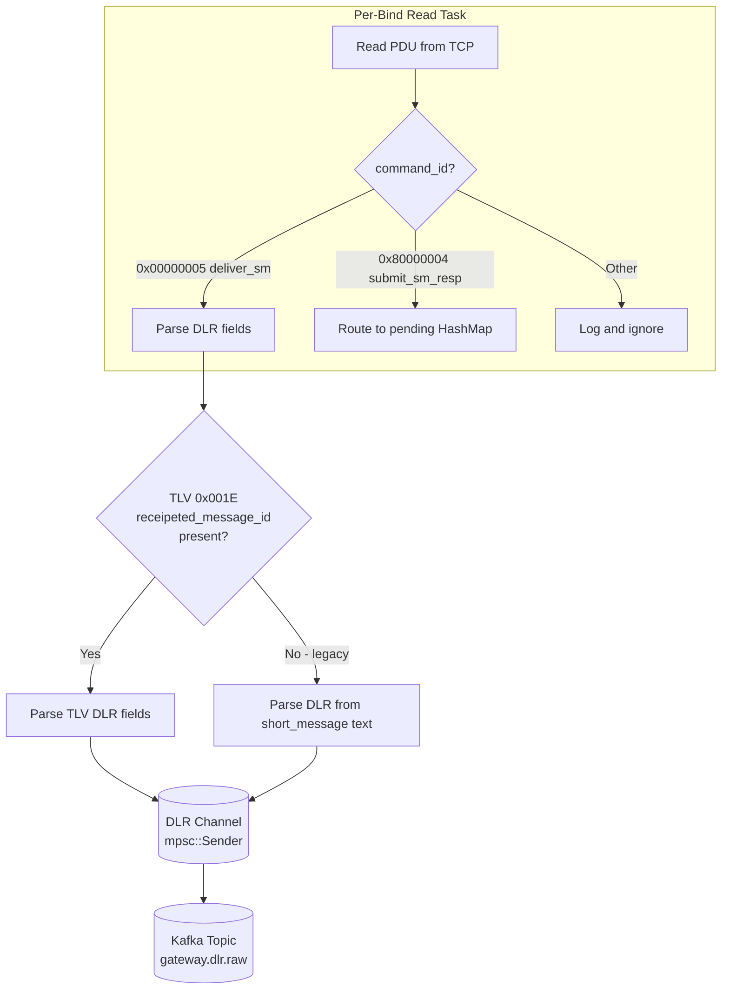
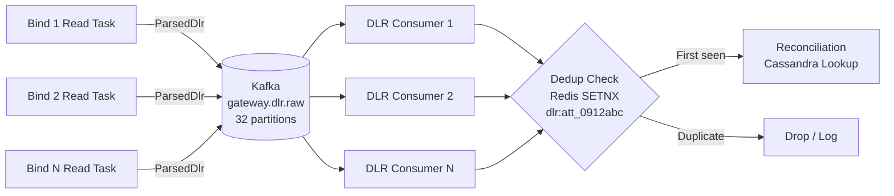
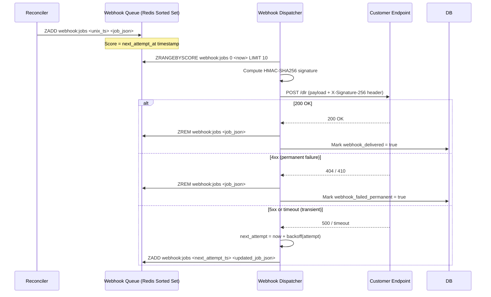
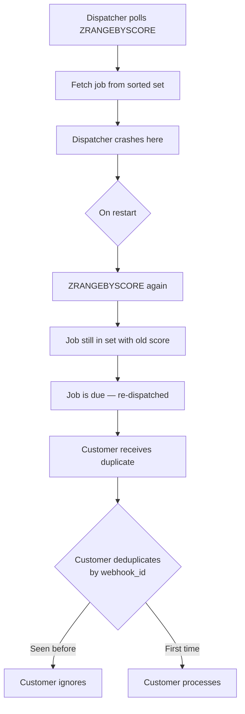
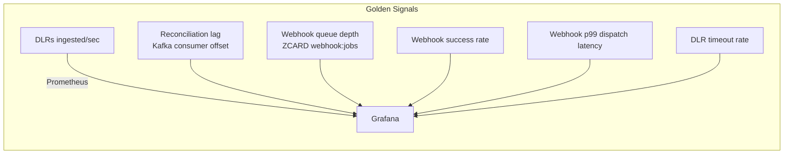
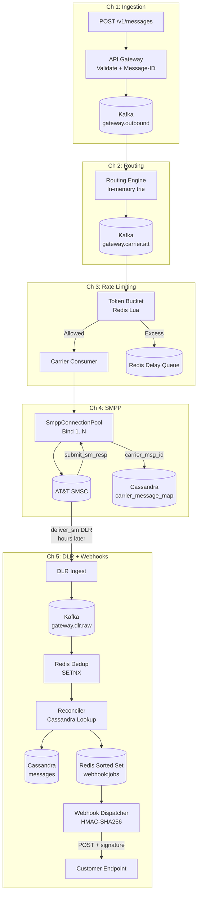

# 5. Delivery Receipts and Webhook Dispatch 🔴

> **The Problem:** Sending a message is half the job. Your customers need to know whether their message was *actually delivered* to a handset—not just accepted by a carrier. Carriers send back **Delivery Receipts (DLRs)** asynchronously: sometimes in 200ms, sometimes in 4 hours, sometimes never. Your system must ingest these DLRs (arriving as `deliver_sm` PDUs on your SMPP binds), reconcile them against the original `Message-ID` using a mapping stored in a highly partitioned database, and then securely dispatch webhook callbacks to customer endpoints—with retry, exponential backoff, signature verification, and idempotency—without duplicating a single notification even if your gateway restarts mid-flight.

---

## The Lifecycle of a Delivery Receipt

Before diving into implementation, understand the full temporal arc:

```
T+0ms      Customer calls POST /v1/messages → API Gateway → Kafka
T+5ms      API returns 202 Accepted { "message_id": "gw_7x9k..." }
T+50ms     Routing Engine picks carrier: AT&T
T+100ms    Rate Limiter: allowed
T+120ms    submit_sm sent over SMPP bind #3 → AT&T SMSC
T+130ms    submit_sm_resp received { carrier_msg_id: "att_0912abc" }
           Cassandra write: gw_7x9k → att_0912abc, status: SUBMITTED

            ... handset may be offline, roaming, SIM full ...

T+2h14m    AT&T SMSC delivers to handset, sends deliver_sm DLR to our gateway
T+2h14m    DLR ingested: receipted_message_id = "att_0912abc", state = DELIVRD
T+2h14m    Cassandra lookup: att_0912abc → gw_7x9k
T+2h14m    Cassandra update: gw_7x9k → status: DELIVERED
T+2h14m    Webhook enqueued to customer endpoint
T+2h14m+100ms  Webhook dispatched: POST https://customer.com/dlr with HMAC-SHA256 signature
T+2h14m+350ms  Customer returns 200 OK → webhook marked delivered
```

This is a **five-stage pipeline**, each with its own failure modes.

---

## Stage 1: DLR Ingestion from SMPP

As established in Chapter 4, DLRs arrive as `deliver_sm` PDUs on whichever SMPP bind is currently active. The DLR content is carried in **TLV (Tag-Length-Value)** optional parameters, not the short message body (despite what some older carriers still do).



### TLV-based DLR Parsing

The authoritative DLR fields in SMPP 3.4 are carried in TLVs. The critical ones:

| TLV Tag | Name | Type | Example |
|---|---|---|---|
| `0x001E` | `receipted_message_id` | C-string | `att_0912abc` |
| `0x0427` | `message_state` | `u8` | `2` = DELIVRD |
| `0x0423` | `network_error_code` | `[u8; 3]` | `[3, 0x00, 0x00]` (GSM, code 0) |

```rust
use bytes::{Buf, Bytes};

#[derive(Debug, Clone)]
pub struct ParsedDlr {
    pub receipted_message_id: String,   // Carrier's message_id from submit_sm_resp
    pub message_state: MessageState,
    pub network_error_code: Option<NetworkErrorCode>,
}

#[derive(Debug, Clone, PartialEq)]
pub enum MessageState {
    Enroute,    // 1
    Delivered,  // 2
    Expired,    // 3
    Deleted,    // 4
    Undeliverable, // 5
    Accepted,   // 6
    Unknown,    // 7
    Rejected,   // 8
    Other(u8),
}

impl From<u8> for MessageState {
    fn from(v: u8) -> Self {
        match v {
            1 => MessageState::Enroute,
            2 => MessageState::Delivered,
            3 => MessageState::Expired,
            4 => MessageState::Deleted,
            5 => MessageState::Undeliverable,
            6 => MessageState::Accepted,
            7 => MessageState::Unknown,
            8 => MessageState::Rejected,
            other => MessageState::Other(other),
        }
    }
}

#[derive(Debug, Clone)]
pub struct NetworkErrorCode {
    pub error_type: u8,  // 1=ANSI-136, 2=IS-95, 3=GSM, 4=PSTN, others
    pub error_code: u16,
}

pub fn parse_deliver_sm_tlvs(body: &[u8]) -> Option<ParsedDlr> {
    let mut buf = Bytes::copy_from_slice(body);
    // Skip fixed fields: service_type, addr TON/NPI, src/dst addrs,
    // esm_class, protocol_id, priority_flag, schedule/validity, registered_delivery,
    // data_coding, sm_default_msg_id, sm_length, short_message
    // (In production: parse the fixed header first, then seek to TLVs)

    let mut receipted_id: Option<String> = None;
    let mut message_state: Option<u8> = None;
    let mut network_error: Option<NetworkErrorCode> = None;

    // Parse TLVs (tag: u16, length: u16, value: [u8; length])
    while buf.remaining() >= 4 {
        let tag = buf.get_u16();
        let len = buf.get_u16() as usize;
        if buf.remaining() < len {
            break;
        }
        let value = buf.copy_to_bytes(len);

        match tag {
            0x001E => {
                // receipted_message_id: C-string (null-terminated or length-delimited)
                let s = value
                    .iter()
                    .take_while(|&&b| b != 0)
                    .cloned()
                    .collect::<Vec<u8>>();
                receipted_id = String::from_utf8(s).ok();
            }
            0x0427 => {
                // message_state: single byte
                if let Some(&b) = value.first() {
                    message_state = Some(b);
                }
            }
            0x0423 => {
                // network_error_code: 3 bytes [error_type, error_code_high, error_code_low]
                if value.len() >= 3 {
                    network_error = Some(NetworkErrorCode {
                        error_type: value[0],
                        error_code: u16::from_be_bytes([value[1], value[2]]),
                    });
                }
            }
            _ => {} // Ignore unknown TLVs
        }
    }

    Some(ParsedDlr {
        receipted_message_id: receipted_id?,
        message_state: message_state.map(MessageState::from).unwrap_or(MessageState::Unknown),
        network_error_code: network_error,
    })
}
```

### Legacy Text-Based DLR Parsing

Some older carriers embed DLR status in the text body of the `deliver_sm` rather than using TLVs. The format is loosely standardized (Kannel-style):

```
id:att_0912abc sub:001 dlvrd:001 submit date:2601011200 done date:2601011214 stat:DELIVRD err:000 text:Hello Wor
```

```rust
use std::collections::HashMap;

pub fn parse_text_dlr(text: &str) -> Option<ParsedDlr> {
    // Build a key→value map from "key:value" pairs separated by spaces
    let map: HashMap<&str, &str> = text
        .split_whitespace()
        .filter_map(|kv| {
            let mut parts = kv.splitn(2, ':');
            Some((parts.next()?, parts.next()?))
        })
        .collect();

    let receipted_id = map.get("id")?.to_string();
    let state_str = map.get("stat").unwrap_or(&"UNKNOWN");
    let message_state = match *state_str {
        "DELIVRD" => MessageState::Delivered,
        "UNDELIV" => MessageState::Undeliverable,
        "EXPIRED" => MessageState::Expired,
        "REJECTD" => MessageState::Rejected,
        _ => MessageState::Unknown,
    };

    Some(ParsedDlr {
        receipted_message_id: receipted_id,
        message_state,
        network_error_code: None,
    })
}
```

> **Warning:** Text-based DLR formats vary wildly between carriers. Build a **carrier-specific parser registry** keyed by `system_id`, and test each carrier's format with real traffic samples before going live.

---

## Stage 2: Kafka Buffer and Deduplication

Raw DLRs flow from the SMPP read tasks into a Kafka topic `gateway.dlr.raw`. This decouples the SMPP layer from the reconciliation layer and provides a durable buffer for DLRs that arrive when the Cassandra cluster is temporarily degraded.



**Why deduplication at this stage?** Carriers occasionally send the same DLR multiple times (network retransmission, or SMSC bugs). A downstream idempotency check is the safety net—Redis is the fast path:

```rust
use redis::AsyncCommands;

pub async fn is_dlr_duplicate(
    redis: &mut redis::aio::MultiplexedConnection,
    carrier_msg_id: &str,
) -> anyhow::Result<bool> {
    // SETNX with a 48-hour TTL: if key already exists, it's a duplicate
    let key = format!("dlr:seen:{}", carrier_msg_id);
    let set: bool = redis
        .set_nx(&key, "1")
        .await?;
    if set {
        // First time: set TTL and return not-duplicate
        redis.expire(&key, 48 * 3600).await?;
        Ok(false)
    } else {
        Ok(true)
    }
}
```

---

## Stage 3: Cassandra Reconciliation

The reconciliation layer answers one question: **given a carrier's `message_id`, what is our internal `Message-ID`, and which customer owns it?**

### Schema Design

```sql
-- Partition by carrier_msg_id for O(1) lookup from DLR flow
CREATE TABLE IF NOT EXISTS messaging.carrier_message_map (
    carrier_id       TEXT,
    carrier_msg_id   TEXT,
    gateway_msg_id   TEXT,
    customer_id      UUID,
    created_at       TIMESTAMP,
    PRIMARY KEY ((carrier_id, carrier_msg_id))
) WITH default_time_to_live = 259200  -- 3 days (DLRs older than 72h are abandoned)
   AND gc_grace_seconds = 86400;

-- Primary message status table, partitioned by customer for their dashboard queries
CREATE TABLE IF NOT EXISTS messaging.messages (
    customer_id      UUID,
    gateway_msg_id   TEXT,
    phone_to         TEXT,
    phone_from       TEXT,
    carrier_id       TEXT,
    carrier_msg_id   TEXT,
    status           TEXT,   -- QUEUED, SUBMITTED, DELIVERED, UNDELIVERED, FAILED
    submitted_at     TIMESTAMP,
    delivered_at     TIMESTAMP,
    error_code       INT,
    webhook_url      TEXT,
    webhook_secret   TEXT,   -- HMAC signing secret (customer-provided, stored encrypted)
    PRIMARY KEY ((customer_id), gateway_msg_id)
) WITH CLUSTERING ORDER BY (gateway_msg_id DESC)
   AND default_time_to_live = 2592000  -- 30 days
   AND gc_grace_seconds = 86400;
```

### Why Cassandra?

| Requirement | Why Cassandra Fits |
|---|---|
| **10B+ rows** | Scales linearly with nodes, no single-table row limit |
| **O(1) lookup by `carrier_msg_id`** | Partition key design = single-node lookup |
| **Write-heavy** (every submit, every DLR) | LSM-tree storage, tunable consistency |
| **Geo-distributed** | Multi-datacenter replication built-in |
| **TTL on old messages** | Native per-row TTL, no cron cleanup jobs |
| **No transactions needed** | Last-write-wins is sufficient for status updates |

### Reconciliation Logic

```rust
use scylla::{Session, CachingSession};

pub struct DlrReconciler {
    db: Arc<CachingSession>,
}

impl DlrReconciler {
    pub async fn reconcile(&self, dlr: ParsedDlr, carrier_id: &str) -> anyhow::Result<WebhookJob> {
        // 1. Look up the carrier_msg_id → gateway_msg_id mapping
        let row = self.db
            .execute(
                "SELECT gateway_msg_id, customer_id \
                 FROM messaging.carrier_message_map \
                 WHERE carrier_id = ? AND carrier_msg_id = ?",
                (carrier_id, &dlr.receipted_message_id),
            )
            .await?
            .first_row_typed::<(String, uuid::Uuid)>()?;

        let (gateway_msg_id, customer_id) = row;

        // 2. Determine final status
        let (status, error_code) = match &dlr.message_state {
            MessageState::Delivered => ("DELIVERED", None),
            MessageState::Undeliverable => (
                "UNDELIVERED",
                dlr.network_error_code.as_ref().map(|e| e.error_code as i32),
            ),
            MessageState::Expired => ("EXPIRED", None),
            MessageState::Rejected => ("REJECTED", None),
            _ => ("UNKNOWN", None),
        };

        // 3. Update message status (LWT not needed; last-write-wins is acceptable
        //    because DLR states are monotonically terminal: once DELIVERED, never changes)
        if let Some(code) = error_code {
            self.db.execute(
                "UPDATE messaging.messages \
                 SET status = ?, delivered_at = toTimestamp(now()), error_code = ? \
                 WHERE customer_id = ? AND gateway_msg_id = ?",
                (status, code, customer_id, &gateway_msg_id),
            ).await?;
        } else {
            self.db.execute(
                "UPDATE messaging.messages \
                 SET status = ?, delivered_at = toTimestamp(now()) \
                 WHERE customer_id = ? AND gateway_msg_id = ?",
                (status, customer_id, &gateway_msg_id),
            ).await?;
        }

        // 4. Fetch webhook details (could be batched or cached per customer)
        let wh_row = self.db
            .execute(
                "SELECT webhook_url, webhook_secret \
                 FROM messaging.messages \
                 WHERE customer_id = ? AND gateway_msg_id = ?",
                (customer_id, &gateway_msg_id),
            )
            .await?
            .first_row_typed::<(String, String)>()?;

        let (webhook_url, webhook_secret) = wh_row;

        Ok(WebhookJob {
            gateway_msg_id,
            customer_id: customer_id.to_string(),
            status: status.to_string(),
            error_code,
            webhook_url,
            webhook_secret,
            attempt: 0,
            next_attempt_at: chrono::Utc::now(),
        })
    }
}
```

---

## Stage 4: Webhook Dispatch

Once we have a `WebhookJob`, we need to deliver an HTTP POST to the customer's webhook endpoint—securely, reliably, and without duplication.



### The Webhook Payload

```json
{
  "message_id": "gw_7x9k4m2p9q",
  "customer_id": "cust_f3a2...",
  "status": "DELIVERED",
  "to": "+447911123456",
  "error_code": null,
  "delivered_at": "2026-04-01T14:32:17.094Z",
  "webhook_id": "wh_a1b2c3d4"
}
```

### HMAC-SHA256 Signature

Security is non-negotiable. Customers need to verify that the webhook came from your gateway, not a malicious third party. Use HMAC-SHA256 signed over the raw request body:

```rust
use hmac::{Hmac, Mac};
use sha2::Sha256;

type HmacSha256 = Hmac<Sha256>;

/// Sign the raw JSON body with the customer's webhook secret.
/// Returns a hex-encoded HMAC-SHA256 signature.
pub fn sign_webhook_payload(secret: &str, body: &[u8]) -> String {
    let mut mac = HmacSha256::new_from_slice(secret.as_bytes())
        .expect("HMAC accepts any key size");
    mac.update(body);
    let result = mac.finalize().into_bytes();
    hex::encode(result)
}

/// Verify a received signature (customer-side verification logic shown for reference).
/// Uses constant-time comparison to prevent timing attacks.
pub fn verify_webhook_signature(secret: &str, body: &[u8], received_sig: &str) -> bool {
    let expected = sign_webhook_payload(secret, body);
    // Constant-time comparison (prevents timing side-channel leaking signature bytes)
    use subtle::ConstantTimeEq;
    expected.as_bytes().ct_eq(received_sig.as_bytes()).into()
}
```

The header sent with every request:
```
X-Signature-256: sha256=a3f4b2c1d9e8f7a6b5c4...
X-Webhook-ID: wh_a1b2c3d4
X-Timestamp: 1743514337
```

Include `X-Timestamp` and verify on the customer side that it's within ±300 seconds of their clock—this prevents replay attacks where an attacker captures a valid webhook and re-sends it later.

---

## Stage 5: Exponential Backoff with Jitter

Retry schedules are the difference between a resilient webhook system and one that thundering-herds a customer's degraded endpoint:

```rust
use std::time::Duration;

pub struct RetryConfig {
    pub initial_delay: Duration,    // 10 seconds
    pub max_delay: Duration,        // 1 hour
    pub max_attempts: u32,          // 18 attempts ≈ ~12 hours total
    pub backoff_multiplier: f64,    // 2.0
    pub jitter_factor: f64,         // 0.25 (±25%)
}

impl RetryConfig {
    pub fn next_delay(&self, attempt: u32) -> Option<Duration> {
        if attempt >= self.max_attempts {
            return None; // Give up
        }
        let base = self.initial_delay.as_secs_f64()
            * self.backoff_multiplier.powi(attempt as i32);
        let capped = base.min(self.max_delay.as_secs_f64());
        let jitter = capped * self.jitter_factor * (rand::random::<f64>() * 2.0 - 1.0);
        Some(Duration::from_secs_f64((capped + jitter).max(1.0)))
    }
}

// Retry schedule with initial=10s, multiplier=2.0, max=3600s:
// Attempt 1:  ~10s
// Attempt 2:  ~20s
// Attempt 3:  ~40s
// Attempt 4:  ~80s
// Attempt 5:  ~160s (~2.7 min)
// Attempt 6:  ~320s (~5.3 min)
// Attempt 7:  ~640s (~10.7 min)
// Attempt 8:  ~1280s (~21 min)
// Attempt 9:  ~2560s (~42 min)
// Attempt 10+: ~3600s (1 hour, capped)
```

---

## The Webhook Dispatcher

```rust
use reqwest::Client;
use serde_json::json;
use std::sync::Arc;

pub struct WebhookJob {
    pub gateway_msg_id: String,
    pub customer_id: String,
    pub status: String,
    pub error_code: Option<i32>,
    pub webhook_url: String,
    pub webhook_secret: String,
    pub attempt: u32,
    pub next_attempt_at: chrono::DateTime<chrono::Utc>,
}

pub struct WebhookDispatcher {
    client: Client,
    redis: Arc<redis::aio::ConnectionManager>,
    db: Arc<CachingSession>,
    retry_config: RetryConfig,
}

impl WebhookDispatcher {
    pub async fn dispatch_loop(&self) {
        loop {
            let jobs = self.poll_due_jobs().await;
            let tasks: Vec<_> = jobs
                .into_iter()
                .map(|job| {
                    let dispatcher = self.clone();
                    tokio::spawn(async move { dispatcher.dispatch_one(job).await })
                })
                .collect();

            for task in tasks {
                let _ = task.await;
            }

            // Poll every 500ms; sleeping avoids busy-loop when queue is empty
            tokio::time::sleep(Duration::from_millis(500)).await;
        }
    }

    async fn poll_due_jobs(&self) -> Vec<WebhookJob> {
        let now = chrono::Utc::now().timestamp();
        let mut conn = self.redis.clone();
        // Atomically pop due jobs (score ≤ now)
        let raw: Vec<String> = redis::cmd("ZRANGEBYSCORE")
            .arg("webhook:jobs")
            .arg(0)
            .arg(now)
            .arg("LIMIT")
            .arg(0)
            .arg(50)
            .query_async(&mut conn)
            .await
            .unwrap_or_default();

        raw.into_iter()
            .filter_map(|s| serde_json::from_str(&s).ok())
            .collect()
    }

    async fn dispatch_one(&self, job: WebhookJob) {
        let payload = json!({
            "message_id": job.gateway_msg_id,
            "customer_id": job.customer_id,
            "status": job.status,
            "error_code": job.error_code,
            "webhook_id": format!("wh_{}", &job.gateway_msg_id[..8]),
        });
        let body_bytes = serde_json::to_vec(&payload).unwrap();
        let signature = sign_webhook_payload(&job.webhook_secret, &body_bytes);
        let timestamp = chrono::Utc::now().timestamp();

        let result = self.client
            .post(&job.webhook_url)
            .header("Content-Type", "application/json")
            .header("X-Signature-256", format!("sha256={}", signature))
            .header("X-Webhook-ID", format!("wh_{}", &job.gateway_msg_id[..8]))
            .header("X-Timestamp", timestamp.to_string())
            .body(body_bytes)
            .timeout(Duration::from_secs(10))
            .send()
            .await;

        match result {
            Ok(resp) if resp.status().is_success() => {
                self.on_success(&job).await;
            }
            Ok(resp) if resp.status().is_client_error() => {
                // 4xx: permanent failure (misconfigured endpoint, 404, 410)
                // Do not retry—alert the customer instead
                self.on_permanent_failure(&job, resp.status().as_u16()).await;
            }
            Ok(resp) => {
                // 5xx or unexpected: transient failure, schedule retry
                tracing::warn!(
                    msg_id = %job.gateway_msg_id,
                    status = resp.status().as_u16(),
                    attempt = job.attempt,
                    "Webhook transient failure"
                );
                self.schedule_retry(job).await;
            }
            Err(e) => {
                tracing::warn!(
                    msg_id = %job.gateway_msg_id,
                    error = %e,
                    attempt = job.attempt,
                    "Webhook dispatch error"
                );
                self.schedule_retry(job).await;
            }
        }
    }

    async fn on_success(&self, job: &WebhookJob) {
        let mut conn = self.redis.clone();
        let job_json = serde_json::to_string(job).unwrap();
        let _: () = redis::cmd("ZREM")
            .arg("webhook:jobs")
            .arg(&job_json)
            .query_async(&mut conn)
            .await
            .unwrap_or(());
        tracing::info!(msg_id = %job.gateway_msg_id, "Webhook delivered");
    }

    async fn on_permanent_failure(&self, job: &WebhookJob, status: u16) {
        let mut conn = self.redis.clone();
        let job_json = serde_json::to_string(job).unwrap();
        let _: () = redis::cmd("ZREM")
            .arg("webhook:jobs")
            .arg(&job_json)
            .query_async(&mut conn)
            .await
            .unwrap_or(());
        tracing::error!(
            msg_id = %job.gateway_msg_id,
            http_status = status,
            "Webhook permanent failure — customer endpoint returned 4xx"
        );
        // In production: emit a customer-facing alert / dashboard event
    }

    async fn schedule_retry(&self, mut job: WebhookJob) {
        job.attempt += 1;
        match self.retry_config.next_delay(job.attempt) {
            None => {
                tracing::error!(
                    msg_id = %job.gateway_msg_id,
                    "Webhook max attempts exceeded — giving up"
                );
                self.on_permanent_failure(&job, 0).await;
            }
            Some(delay) => {
                let next_at = chrono::Utc::now() + chrono::Duration::from_std(delay).unwrap();
                job.next_attempt_at = next_at;
                let score = next_at.timestamp();
                let job_json = serde_json::to_string(&job).unwrap();
                let mut conn = self.redis.clone();
                let _: () = redis::cmd("ZADD")
                    .arg("webhook:jobs")
                    .arg(score)
                    .arg(&job_json)
                    .query_async(&mut conn)
                    .await
                    .unwrap_or(());
            }
        }
    }
}
```

---

## Idempotency: Handling Gateway Restarts Mid-Flight

If the webhook dispatcher crashes after marking a job "in-progress" but before sending the webhook, what happens on restart?

The **Redis Sorted Set** model is naturally idempotent: the job remains in the set with its original score. On restart, the dispatcher picks it up again and re-sends the webhook. The customer's endpoint **must** be idempotent—document this requirement clearly.

For your side, record the `webhook_id` (derived from `gateway_msg_id`) in the webhook payload. If the customer sees duplicate `webhook_id`s, they can safely deduplicate.



> **At-least-once vs. exactly-once:** Redis Sorted Sets give you at-least-once delivery. Exactly-once requires distributed transactions (e.g., Cassandra + Kafka transactions) and is rarely worth the complexity for webhooks. Mandate idempotency on the customer side instead—it's simpler and more robust.

---

## Operational Considerations

### DLR Never Arrives

Some carriers never send a DLR. This is especially common for international routes with multiple aggregators in the chain. Implement a **DLR timeout sweep**:

```rust
pub async fn dlr_timeout_sweep(db: Arc<CachingSession>, timeout: Duration) {
    // Run every 15 minutes
    let cutoff = chrono::Utc::now() - chrono::Duration::from_std(timeout).unwrap();
    // Find all messages still in SUBMITTED status older than the timeout
    // Mark them as UNKNOWN_DLR and optionally dispatch a webhook with status="expired"
    // In Cassandra: use a secondary index on (status, submitted_at)
    // or maintain a separate materialized view for this query
    let _ = db.execute(
        "SELECT customer_id, gateway_msg_id, webhook_url, webhook_secret \
         FROM messaging.messages_by_status \
         WHERE status = 'SUBMITTED' AND submitted_at < ?",
        (cutoff,),
    ).await;
    // ... enqueue timeout webhooks
}
```

### Monitoring the Full Pipeline



| Metric | Normal Range | Alert Threshold |
|---|---|---|
| DLR ingestion rate | Proportional to submit rate | < 50% of submit rate after 10min |
| Reconciliation miss rate | < 0.1% | > 1% (mapping TTL too short?) |
| Webhook queue depth | < 10,000 | > 100,000 (dispatcher fallen behind) |
| Webhook success rate (p1h) | > 95% | < 90% |
| Webhook p99 dispatch latency | < 2s | > 5s |
| DLR timeout rate (no DLR in 4h) | < 2% | > 10% |

---

## Security Checklist

| Risk | Mitigation |
|---|---|
| **SSRF via customer webhook URL** | Validate URL scheme (HTTPS only); block RFC 1918 / loopback addresses; use a dedicated HTTP client with no Proxy support |
| **Replay attack on webhook** | Include `X-Timestamp`; reject requests older than ±300s |
| **Webhook secret exposure in logs** | Never log `webhook_secret`; encrypt at rest in Cassandra using envelope encryption |
| **DLR spoofing** | Validate `deliver_sm` only from authenticated SMPP sessions (the TCP bind is already authenticated) |
| **Webhook endpoint SSRF chain** | Disallow redirect following in the HTTP client |
| **Timing attack on signature verify** | Always use constant-time comparison (`subtle::ConstantTimeEq`) |

```rust
use std::net::IpAddr;
use url::Url;

pub fn validate_webhook_url(raw_url: &str) -> anyhow::Result<Url> {
    let url = Url::parse(raw_url)?;
    anyhow::ensure!(url.scheme() == "https", "Webhook URL must use HTTPS");

    // SSRF guard: block internal/loopback addresses
    if let Some(host) = url.host_str() {
        if let Ok(ip) = host.parse::<IpAddr>() {
            anyhow::ensure!(
                !ip.is_loopback() && !ip.is_unspecified(),
                "Webhook URL must not target loopback addresses"
            );
            // In production: also block RFC 1918 private ranges
            // 10.0.0.0/8, 172.16.0.0/12, 192.168.0.0/16
            if let IpAddr::V4(v4) = ip {
                anyhow::ensure!(
                    !v4.is_private() && !v4.is_link_local(),
                    "Webhook URL must not target private IP ranges"
                );
            }
        }
    }
    Ok(url)
}
```

---

## End-to-End Summary: The Complete Delivery Pipeline



---

> **Key Takeaways**
>
> - **DLRs are asynchronous and unreliable.** Design all downstream systems to handle DLRs arriving minutes, hours, or never. Implement a timeout sweep for messages stuck in `SUBMITTED`.
> - **TLV-based DLR parsing is the standard** for SMPP 3.4, but many carriers still use text-body format. Build a carrier-specific parser registry.
> - **Cassandra is the right database** for DLR reconciliation: partition by `carrier_msg_id` for O(1) lookup, write-heavy workload, multi-DC replication, and native TTL.
> - **Webhooks must be signed** (HMAC-SHA256) and include a timestamp to prevent replay attacks. Validate the URL at registration time to prevent SSRF.
> - **At-least-once is unavoidable** with Redis Sorted Sets. Embrace it: make your webhook `payload` idempotent by including a stable `webhook_id`, and mandate customer-side deduplication.
> - **Exponential backoff with jitter** is essential. Without jitter, a fleet of webhook dispatchers pound a recovering customer endpoint in synchronized waves—exactly what they don't need.
> - **End-to-end observability requires you to track both directions**: outbound (Chapter 1–4) and inbound DLR reconciliation (Chapter 5). The `Message-ID` is the thread that links them all.
