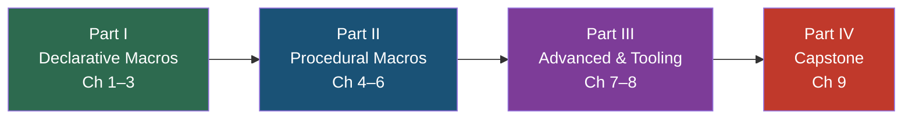

# Rust Metaprogramming: From Declarative Macros to Procedural Code Generation

## Speaker Intro

- Principal Systems Architect with decades of experience in C++, Go, and Rust
- Library author and contributor to open-source macro-heavy crates in the Rust ecosystem
- Background in firmware, operating systems, and compiler infrastructure at Microsoft SCHIE
- Passionate about eliminating boilerplate while preserving type safety and zero-cost abstractions

---

This is a comprehensive deep-dive guide to Rust's metaprogramming facilities. Unlike tutorials that show you `macro_rules!` syntax and move on, this guide builds understanding from first principles — lexing, parsing, token trees, hygiene — then progresses to production-grade procedural macros using `syn`, `quote`, and `proc-macro2`. By the end, you will be able to build macros at the caliber of those found in Tokio, Serde, and Clap.

## Who This Is For

- **Library authors** who want to create ergonomic, derive-driven APIs (like `#[derive(Serialize)]` or `#[derive(Builder)]`)
- **Application developers** tired of writing boilerplate — repetitive trait implementations, accessor methods, conversion impls
- **Systems programmers** from C++ or Go who want to understand Rust's compile-time code generation story compared to C++ templates or `go generate`
- **Anyone who has been bitten by** `error[E0658]: procedural macros cannot be expanded to statements`, mysterious hygiene errors, or "expected TokenStream, found proc_macro::TokenStream"

## Prerequisites

You should be comfortable with:

| Concept | Where to learn it |
|---------|-------------------|
| Ownership, borrowing, lifetimes | [Rust Memory Management](../memory-management-book/src/SUMMARY.md) |
| Traits, generics, `impl Trait`, associated types | [Rust's Type System & Traits](../type-system-traits-book/src/SUMMARY.md) |
| `Result<T, E>` and the `?` operator | [The Rust Programming Language, Ch. 9](https://doc.rust-lang.org/book/ch09-00-error-handling.html) |
| Basic `async`/`await` syntax (for Part III and the capstone) | [Async Rust](../async-book/src/SUMMARY.md) |

No prior macro authoring experience is needed. We start from zero.

## How to Use This Book

**Read linearly the first time.** Parts I–IV build on each other. Each chapter has:

| Symbol | Meaning |
|--------|---------|
| 🟢 | Beginner — foundational concept |
| 🟡 | Intermediate — requires earlier chapters |
| 🔴 | Advanced — deep internals or production patterns |

Every chapter includes:
- A **"What you'll learn"** block at the top
- **Mermaid diagrams** illustrating compilation pipelines, macro expansion, and data flows
- **"What you write" vs. "What the compiler expands it to"** side-by-side code blocks (conceptual `cargo-expand` output)
- Code that **fails** (marked `// ❌ FAILS:`) followed by the **fix** (marked `// ✅ FIX:`)
- An **inline exercise** with a hidden solution
- **Key Takeaways** summarizing the core ideas
- **Cross-references** to related chapters and companion guides

## Pacing Guide

| Chapters | Topic | Suggested Time | Checkpoint |
|----------|-------|----------------|------------|
| 1–3 | Declarative Macros | 4–6 hours | You can write recursive `macro_rules!` using TT-munching, understand hygiene, and export macros across crates |
| 4–6 | Procedural Macros | 6–8 hours | You can parse a `DeriveInput` with `syn`, generate code with `quote!`, and build a working custom derive |
| 7–8 | Advanced Proc Macros | 4–6 hours | You can build attribute macros (like `#[tokio::main]`), emit custom compile errors with span information, and test macros with `trybuild` |
| 9 | Capstone | 4–6 hours | You have built a production-quality `Builder` derive and an `instrument_async` attribute macro from scratch |

**Total: ~18–26 hours** for a thorough first pass.

## Table of Contents

### Part I: Declarative Macros (The Matchers)
1. **`macro_rules!` and AST Matching** 🟢 — Designators, repetition, building `vec![]`
2. **Macro Hygiene and Exporting** 🟡 — Compiler theory of hygiene, `$crate`, `#[macro_export]`
3. **Advanced Declarative Patterns** 🟡 — TT-munching, push-down accumulation, internal rules

### Part II: Procedural Macros (The Compilers)
4. **The Procedural Paradigm and TokenStreams** 🟡 — `proc-macro` crate type, `proc-macro2`, `syn`, `quote`
5. **Parsing with `syn` and Generating with `quote!`** 🟡 — `DeriveInput`, `parse_macro_input!`, `#(#vars)*`
6. **Custom Derive Macros** 🔴 — `#[derive(MyTrait)]`, generics handling, trait bound injection

### Part III: Advanced Proc Macros & Production Tooling
7. **Attribute and Function-Like Macros** 🔴 — `#[my_attr]`, `my_macro!()`, dissecting `#[tokio::main]`
8. **Compile-Time Error Handling and Testing** 🔴 — `syn::Error`, span-accurate errors, `cargo-expand`, `trybuild`

### Part IV: Capstone Project
9. **Capstone: `#[derive(Builder)]` and `#[instrument_async]`** 🔴 — Full production macro implementations

### Appendices
- **Summary and Reference Card** — Cheat sheet for designators, `syn` types, `quote!` syntax

---

> **Companion Guides:** This book is part of the Rust Training series. It explicitly builds on and references:
> - [Async Rust](../async-book/src/SUMMARY.md) — we dissect `#[tokio::main]` and build `#[instrument_async]`
> - [Rust Memory Management](../memory-management-book/src/SUMMARY.md) — macros that generate correct ownership and lifetime annotations
> - [Rust's Type System & Traits](../type-system-traits-book/src/SUMMARY.md) — derive macros that inject trait bounds
> - [Rust Patterns](../rust-patterns-book/src/SUMMARY.md) — the builder pattern, type-state machines generated by macros
> - [Rust Engineering Practices](../engineering-book/src/SUMMARY.md) — CI integration, `cargo-expand`, testing strategies
