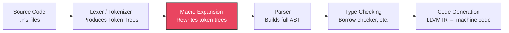

# Chapter 1: `macro_rules!` and AST Matching 🟢

> **What you'll learn:**
> - What macros are in Rust's compilation model and why they operate on token trees, not text
> - The complete set of fragment specifiers (`expr`, `ident`, `ty`, `tt`, etc.) and when to use each
> - Repetition syntax (`$(...)*`, `$(...)+`, `$(...),*`) for variadic macros
> - How to build your own `vec![]` equivalent from scratch

---

## Why Macros? The Boilerplate Problem

Every language eventually confronts the same tension: you want your code to be DRY (Don't Repeat Yourself), but the type system and function signatures impose a fixed shape on what you can abstract. Consider implementing `From<T>` for a dozen wrapper types:

```rust
// You write this twelve times. Each one differs by two identifiers.
impl From<String> for Name {
    fn from(val: String) -> Self {
        Name(val)
    }
}

impl From<u64> for UserId {
    fn from(val: u64) -> Self {
        UserId(val)
    }
}

// ... ten more times ...
```

In C, you'd reach for the preprocessor (`#define`). In C++, you'd reach for templates or `constexpr`. In Go, you'd reach for `go generate`. In Rust, you reach for **macros** — and Rust's macros are fundamentally different from all of these because they operate on the **Abstract Syntax Tree (AST)**, not on raw text.

## The Compilation Pipeline: Where Macros Live

Before we write a single macro, let's understand *where* in the compilation pipeline macro expansion happens:



**Key insight:** Macros run *after* tokenization but *before* full parsing and type checking. This means:

1. Macros see **token trees** (parenthesized groups of tokens), not raw strings
2. Macros **cannot** inspect types — `$x:expr` matches any expression regardless of its type
3. The output of a macro must be **valid Rust tokens** that the parser can then process
4. Macro errors show up as parse errors or type errors *after* expansion

This is fundamentally different from C's preprocessor, which operates on raw text before tokenization.

## Your First Macro: `say_hello!`

```rust
macro_rules! say_hello {
    () => {
        println!("Hello, world!");
    };
}

fn main() {
    say_hello!();
}
```

Let's break down the anatomy:

| Component | Purpose |
|-----------|---------|
| `macro_rules!` | The keyword that declares a declarative macro |
| `say_hello` | The macro's name (invoked as `say_hello!`) |
| `() => { ... }` | A **rule**: pattern on the left, expansion on the right |
| `()` (left side) | The **matcher** — what tokens the invocation must provide |
| `{ println!("Hello, world!"); }` | The **transcriber** — what tokens to produce |

A macro can have **multiple rules**, tried top-to-bottom:

```rust
macro_rules! say_hello {
    () => {
        println!("Hello, world!");
    };
    ($name:expr) => {
        println!("Hello, {}!", $name);
    };
}

fn main() {
    say_hello!();              // "Hello, world!"
    say_hello!("Rustacean");   // "Hello, Rustacean!"
}
```

## Fragment Specifiers: The Macro Type System

The `$name:expr` in the example above uses a **fragment specifier** — it tells the macro matcher what kind of syntactic fragment to capture. Here is the complete table:

| Specifier | Matches | Example Capture | Notes |
|-----------|---------|-----------------|-------|
| `$x:expr` | Any expression | `1 + 2`, `foo()`, `if a { b } else { c }` | Most common. Greedy — consumes as much as possible |
| `$x:ident` | An identifier | `foo`, `MyStruct`, `x` | Does NOT match keywords like `fn` or `let` |
| `$x:ty` | A type | `i32`, `Vec<String>`, `&'a str` | Cannot be followed by most tokens due to ambiguity |
| `$x:pat` | A pattern | `Some(x)`, `1..=5`, `_` | Used in `match` arms, `let` bindings |
| `$x:path` | A path | `std::io::Error`, `crate::MyType` | Includes both type and module paths |
| `$x:stmt` | A statement | `let x = 5`, `x.push(1)` | Includes the trailing semicolon |
| `$x:block` | A block | `{ let x = 1; x + 2 }` | Must include the curly braces |
| `$x:item` | An item | `fn foo() {}`, `struct Bar;` | Top-level declarations |
| `$x:meta` | A meta item | `derive(Debug)`, `cfg(test)` | Used inside attributes |
| `$x:literal` | A literal | `42`, `"hello"`, `true` | Stable since Rust 1.32 |
| `$x:lifetime` | A lifetime | `'a`, `'static` | Includes the leading `'` |
| `$x:vis` | A visibility modifier | `pub`, `pub(crate)`, ε (empty) | Can match nothing — useful for optional `pub` |
| `$x:tt` | A single token tree | Anything: `+`, `(a, b)`, `foo` | The escape hatch — matches any single token or balanced group |

### The Follow-Set Ambiguity Rules

Not every specifier can be followed by every token. The compiler enforces **follow-set restrictions** to keep macro parsing unambiguous:

```rust
// ❌ FAILS: `ty` cannot be followed by `+` (ambiguous with trait bounds)
macro_rules! bad {
    ($t:ty + $rest:expr) => {};
}

// ✅ FIX: Use a separator the compiler doesn't find ambiguous
macro_rules! good {
    ($t:ty, $rest:expr) => {};
}
```

The general rule: `expr` and `stmt` can only be followed by `=>`, `,`, or `;`. The `ty` and `path` specifiers can only be followed by `=>`, `,`, `;`, `=`, `|`, `>`, `>>`, `[`, `{`, `as`, `where`, or a block. When in doubt, use `,` as a separator — it's safe after everything.

## Repetition: Variadic Macros

The real power of `macro_rules!` is **repetition**. The syntax is:

```
$( PATTERN )SEPARATOR QUANTIFIER
```

| Quantifier | Meaning |
|------------|---------|
| `*` | Zero or more |
| `+` | One or more |
| `?` | Zero or one (optional — stabilized in 1.32) |

The separator is optional for `?` and is commonly `,` for `*` and `+`.

### Building `my_vec![]`

Let's build a clone of the standard library's `vec![]` macro:

```rust
macro_rules! my_vec {
    // Rule 1: empty invocation
    () => {
        Vec::new()
    };
    
    // Rule 2: vec![value; count] — repeat a value N times
    ($elem:expr; $count:expr) => {
        vec::from_elem($elem, $count)  // std uses an internal function
    };
    
    // Rule 3: vec![a, b, c, ...] — list of elements
    ($($elem:expr),+ $(,)?) => {
        {
            let mut v = Vec::new();
            $(
                v.push($elem);
            )+
            v
        }
    };
}
```

Let's dissect Rule 3 — the interesting one:

| Token | Meaning |
|-------|---------|
| `$($elem:expr),+` | Match one or more expressions separated by commas |
| `$(,)?` | Optionally allow a trailing comma |
| `$( v.push($elem); )+` | In the transcriber, repeat `v.push(...)` once per captured element |

**What you write:**
```rust
let names = my_vec!["Alice", "Bob", "Charlie",];
```

**What the compiler expands it to** (conceptual `cargo-expand` output):
```rust
let names = {
    let mut v = Vec::new();
    v.push("Alice");
    v.push("Bob");
    v.push("Charlie");
    v
};
```

### Multiple Repetition Variables

When you have multiple captures inside the same repetition group, they must expand together:

```rust
macro_rules! make_pairs {
    ($($key:expr => $value:expr),* $(,)?) => {
        vec![$(($key, $value)),*]
    };
}

fn main() {
    let pairs = make_pairs![
        "name" => "Alice",
        "age" => "30",
    ];
    // Expands to: vec![("name", "Alice"), ("age", "30")]
    assert_eq!(pairs.len(), 2);
}
```

The `$key` and `$value` variables are captured in lockstep — they must have the same number of repetitions.

```rust
// ❌ FAILS: mismatched repetition counts
macro_rules! mismatch {
    ($($a:expr),*; $($b:expr),*) => {
        // This tries to expand $a and $b together, but they were
        // captured in separate groups — their counts may differ
        $( ($a, $b) ),*
    };
}

// ✅ FIX: capture them together
macro_rules! fixed {
    ($($a:expr, $b:expr);* $(;)?) => {
        $( ($a, $b) ),*
    };
}
```

## Invocation Syntax: Parens, Brackets, and Braces

Macros can be invoked with any of three delimiters:

```rust
my_macro!(...);    // Parentheses — requires trailing semicolon in statement position
my_macro![...];    // Brackets — requires trailing semicolon in statement position
my_macro!{...}     // Braces — NO trailing semicolon needed (like a block)
```

Convention:
- `vec![...]` — brackets for "collection literal" feel
- `println!(...)` — parentheses for "function call" feel
- `macro_rules! name { ... }` — braces for "definition" feel

The macro itself sees no difference — it receives the same token trees regardless.

## Multiple Rules and Overloading

Macros try rules **top to bottom** and use the **first match**. This is similar to `match` arms:

```rust
macro_rules! calculate {
    // Most specific first: exactly "add"
    (add $a:expr, $b:expr) => { $a + $b };
    // Then "mul"
    (mul $a:expr, $b:expr) => { $a * $b };
    // Catch-all last
    ($a:expr, $b:expr) => {
        compile_error!("Use `add` or `mul` as the first argument")
    };
}

fn main() {
    let sum = calculate!(add 1, 2);   // 3
    let prod = calculate!(mul 3, 4);  // 12
    // calculate!(1, 2);              // Compile error with helpful message
}
```

> ⚠️ **Order matters.** If you put the catch-all rule first, it would match everything and the specific rules would be unreachable.

## A Practical Example: `impl_display_for_newtype!`

Let's solve the motivating problem from the beginning of this chapter — generating repetitive trait impls:

```rust
macro_rules! impl_display_for_newtype {
    ($($Type:ident($Inner:ty)),+ $(,)?) => {
        $(
            impl std::fmt::Display for $Type {
                fn fmt(&self, f: &mut std::fmt::Formatter<'_>) -> std::fmt::Result {
                    write!(f, "{}", self.0)
                }
            }
        )+
    };
}

struct Name(String);
struct UserId(u64);
struct Email(String);

impl_display_for_newtype!(
    Name(String),
    UserId(u64),
    Email(String),
);

fn main() {
    let name = Name("Alice".into());
    println!("User: {name}");  // "User: Alice"
}
```

**What you write:** 3 lines of macro invocation.  
**What the compiler expands it to:** 3 complete `impl Display` blocks (~30 lines of code).

This is the fundamental value proposition of macros: **write the pattern once, stamp it out N times with zero runtime cost**.

## Debugging Declarative Macros

When your macro doesn't work as expected, these tools help:

| Tool | Purpose | Command |
|------|---------|---------|
| `cargo-expand` | Shows macro expansion output | `cargo expand` or `cargo expand --lib` |
| `trace_macros!` | Prints macro invocations at compile time (nightly) | `#![feature(trace_macros)]` then `trace_macros!(true);` |
| `log_syntax!` | Prints tokens at compile time (nightly) | `#![feature(log_syntax)]` then `log_syntax!($var);` |
| Rust Analyzer | Shows expanded macro inline in IDE | Hover over macro invocation |

For `cargo-expand`, install it once:
```bash
cargo install cargo-expand
```

Then use it to verify your expansion:
```bash
cargo expand          # Expand all macros in the crate
cargo expand ::main   # Expand macros only in fn main
```

---

<details>
<summary><strong>🏋️ Exercise: Build a <code>hash_map!</code> Macro</strong> (click to expand)</summary>

**Challenge:** Write a `hash_map!` macro that creates a `std::collections::HashMap` with an API like:

```rust
let scores = hash_map! {
    "Alice" => 95,
    "Bob" => 87,
    "Charlie" => 92,
};
```

Requirements:
1. Support zero or more key-value pairs
2. Allow a trailing comma
3. Pre-allocate the `HashMap` with the correct capacity (hint: count the pairs)

<details>
<summary>🔑 Solution</summary>

```rust
macro_rules! hash_map {
    // Empty map
    () => {
        ::std::collections::HashMap::new()
    };
    
    // One or more key => value pairs
    ($($key:expr => $value:expr),+ $(,)?) => {
        {
            // We use a nested macro to count the number of pairs.
            // Each pair contributes one `()` to the repetition, and we
            // sum them by replacing each with `1usize +`.
            let capacity = 0usize $(+ { let _ = &$key; 1usize })+;
            let mut map = ::std::collections::HashMap::with_capacity(capacity);
            $(
                map.insert($key, $value);
            )+
            map
        }
    };
}

fn main() {
    let scores = hash_map! {
        "Alice" => 95,
        "Bob" => 87,
        "Charlie" => 92,
    };
    
    assert_eq!(scores.len(), 3);
    assert_eq!(scores["Alice"], 95);
    println!("Scores: {scores:?}");
}
```

**Why `let _ = &$key; 1usize`?** We need to expand `$key` inside the repetition to keep the compiler happy (every captured variable in the repetition group must appear in the expansion). Taking a reference `&$key` evaluates the key expression but discards the result, while the `1usize` is what we actually accumulate for counting. A smarter approach would use a const-evaluable count, but this works for all expression types.

</details>
</details>

---

> **Key Takeaways:**
> - Rust macros operate on **token trees** after lexing but before full parsing — they are hygienic and AST-aware, not textual
> - **Fragment specifiers** (`expr`, `ident`, `ty`, `tt`, etc.) tell the matcher what syntactic category to capture
> - **Repetition** (`$(...)*`, `$(...)+`) is how macros become variadic — captured variables expand in lockstep
> - Rules are tried **top-to-bottom**; put specific patterns first, catch-alls last
> - Use `cargo-expand` to verify what your macro actually generates

> **See also:**
> - [Chapter 2: Macro Hygiene and Exporting](ch02-macro-hygiene-and-exporting.md) — how Rust prevents the naming collisions that plague C macros
> - [Chapter 3: Advanced Declarative Patterns](ch03-advanced-declarative-patterns.md) — TT-munching for complex recursive macros
> - [Rust's Type System & Traits](../type-system-traits-book/src/SUMMARY.md) — the traits you'll commonly generate with macros
