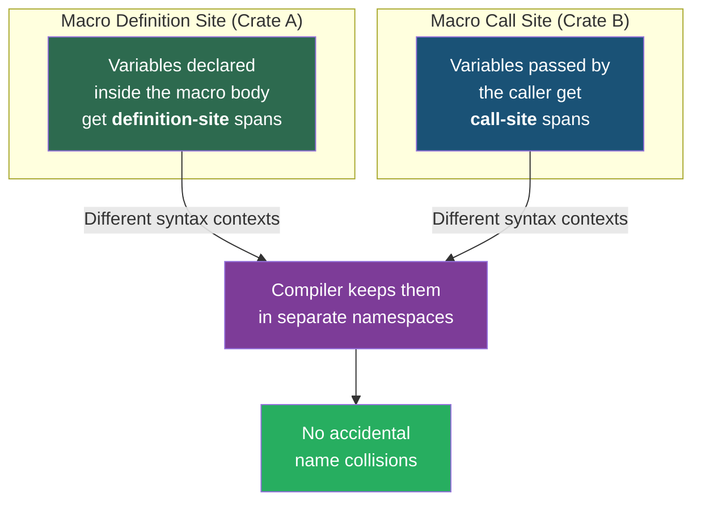

# Chapter 2: Macro Hygiene and Exporting 🟡

> **What you'll learn:**
> - What "macro hygiene" means in compiler theory and why Rust enforces it
> - How Rust prevents variable capture and shadowing bugs that plague C macros
> - The `$crate` meta-variable and why it's essential for cross-crate macros
> - How to export macros with `#[macro_export]` and the scoping rules that govern them

---

## The Problem Hygiene Solves

In C, macros are textual substitution. This leads to infamous bugs:

```c
// C preprocessor — UNHYGIENIC
#define DOUBLE(x) x + x

int result = DOUBLE(3) * 2;
// Expands to: 3 + 3 * 2
// Evaluates to: 3 + 6 = 9  (not 12!)
```

The C programmer's fix is to parenthesize everything: `#define DOUBLE(x) ((x) + (x))`. But even that doesn't save you from variable capture:

```c
// C preprocessor — variable capture bug
#define SWAP(a, b) { int tmp = a; a = b; b = tmp; }

int tmp = 10, y = 20;
SWAP(tmp, y);
// Expands to: { int tmp = tmp; tmp = y; y = tmp; }
// The macro's `tmp` shadows the caller's `tmp` — silent wrong behavior!
```

Rust's macro system was designed from the ground up to prevent **both** of these classes of bugs.

## How Rust Hygiene Works



Every identifier produced by a macro carries a **syntax context** (also called a **span**) that records either:

1. **Definition site** — the location where the macro was *defined*
2. **Call site** — the location where the macro was *invoked*

Two identifiers with the same text but different syntax contexts are treated as **different names** by the compiler. This is what "hygiene" means.

### Demonstration: Variables Can't Leak

```rust
macro_rules! make_var {
    () => {
        // This `x` has the macro's definition-site syntax context
        let x = 42;
    };
}

fn main() {
    make_var!();
    
    // ❌ FAILS: `x` at this call site is a DIFFERENT `x` than the one
    //           defined inside the macro
    // println!("{x}");
    // error[E0425]: cannot find value `x` in this scope
}
```

The `x` created by the macro lives in the macro's syntax context. The `x` you're trying to use in `main` lives in `main`'s syntax context. They are invisible to each other.

### How to Intentionally Share Names

If you *want* the macro to create a variable that the caller can use, pass the name in as an `ident`:

```rust
macro_rules! make_var {
    ($name:ident, $value:expr) => {
        // $name carries the CALLER's syntax context — it was part of the invocation
        let $name = $value;
    };
}

fn main() {
    make_var!(x, 42);
    
    // ✅ Works: `x` was provided by the caller, so it has call-site context
    println!("{x}"); // 42
}
```

**Rule of thumb:** Identifiers captured via `$name:ident` from the invocation have **call-site** context. Identifiers written directly in the macro body have **definition-site** context.

## The Limits of `macro_rules!` Hygiene

Rust's declarative macros are **partially hygienic**. Here's the nuance:

| Category | Hygienic? | Example |
|----------|-----------|---------|
| Local variables (`let` bindings) | ✅ Yes | `let x = ...` inside macro can't conflict with caller's `x` |
| Generic type parameters | ✅ Yes | `<T>` inside macro won't clash with caller's `T` |
| Items (functions, structs, traits) | ❌ No | `fn helper()` inside a macro IS visible at the call site |
| Paths to external crates | ❌ No | `use serde::Serialize` depends on caller having `serde` in scope |

That last point — paths — is the biggest practical headache, and it's why `$crate` exists.

## The `$crate` Meta-Variable

When your macro references items from its own crate, you can't use bare paths because *the caller* might be in a different crate:

```rust
// In crate `my_lib`

pub fn internal_helper() -> &'static str {
    "from my_lib"
}

// ❌ FAILS when used from another crate:
macro_rules! bad_macro {
    () => {
        // `internal_helper` is resolved at the CALL SITE
        // The caller's crate doesn't have this function!
        internal_helper()
    };
}

// ✅ FIX: Use $crate to anchor the path to the defining crate
macro_rules! good_macro {
    () => {
        $crate::internal_helper()
    };
}
```

`$crate` is a special meta-variable that the compiler expands to:
- The crate name (e.g., `my_lib`) when the macro is used from an external crate
- `crate` when the macro is used from within the same crate

### `$crate` with Traits and Types

Always qualify paths in macro output with `$crate` if they reference your crate's items:

```rust
// In crate `my_lib`

pub trait MyTrait {
    fn describe(&self) -> String;
}

#[macro_export]
macro_rules! impl_my_trait {
    ($Type:ty, $desc:expr) => {
        impl $crate::MyTrait for $Type {
            fn describe(&self) -> String {
                String::from($desc)
            }
        }
    };
}
```

### Referencing Third-Party Crates from Macros

`$crate` only refers to the crate where the macro is defined. For third-party dependencies (like `serde` or `tokio`), the standard pattern is to **re-export** them:

```rust
// In your crate's lib.rs
// Re-export so macros can reference it via $crate
#[doc(hidden)]
pub use serde as _serde;  // Convention: underscore prefix for hidden re-exports

#[macro_export]
macro_rules! my_serialize_macro {
    ($Type:ty) => {
        // Uses the re-export, NOT a bare `serde` path
        impl $crate::_serde::Serialize for $Type {
            // ...
        }
    };
}
```

This is exactly the pattern that `serde_derive` and many other crates use internally.

## Exporting Macros: `#[macro_export]` and Scoping

### The `#[macro_export]` Attribute

By default, `macro_rules!` macros are only visible in the module where they're defined (and child modules). To make a macro available to other crates:

```rust
// In my_lib/src/lib.rs

#[macro_export]
macro_rules! public_macro {
    () => { println!("I'm available everywhere!") };
}
```

**Critical gotcha:** `#[macro_export]` always places the macro at the **crate root**, regardless of which module it's defined in.

```rust
// In my_lib/src/utils/helpers.rs
#[macro_export]
macro_rules! helper_macro {
    () => {};
}

// Even though it's defined in `utils::helpers`, callers import it as:
// use my_lib::helper_macro;
// NOT: use my_lib::utils::helpers::helper_macro;  ← This doesn't work!
```

### Module Scoping Without `#[macro_export]`

Within a single crate, macros have special scoping rules that differ from regular items:

```rust
// Macros are available AFTER their definition in textual order

fn too_early() {
    // ❌ FAILS: `my_macro` hasn't been defined yet (textual ordering)
    // my_macro!();
}

macro_rules! my_macro {
    () => { 42 };
}

fn just_right() {
    // ✅ Works: defined above in textual order
    let val = my_macro!();
    assert_eq!(val, 42);
}
```

### Using `#[macro_use]` on Modules

To make a macro visible to sibling modules without `#[macro_export]`, annotate the module:

```rust
// src/lib.rs

#[macro_use]
mod macros;  // All macros defined in `macros` are now visible in this module

mod foo;     // Can use macros from `macros` module
```

> ⚠️ `#[macro_use]` on `extern crate` still works but is considered legacy. Prefer `use my_crate::my_macro;` with `#[macro_export]` instead.

## Hygiene in Practice: A Real-World Example

Let's build a macro that demonstrates both the power and the limits of hygiene:

```rust
/// A macro that creates a scoped timer for benchmarking blocks of code.
/// Demonstrates hygiene: internal variables don't leak to the caller.
macro_rules! time_it {
    ($label:expr, $body:block) => {{
        // These variables have definition-site context — they're invisible
        // to the code in $body, even if $body uses the same names
        let start = ::std::time::Instant::now();
        let result = $body;
        let elapsed = start.elapsed();
        println!("{}: {:?}", $label, elapsed);
        result
    }};
}

fn main() {
    // The caller can have their own `start` and `elapsed` — no conflict
    let start = "initial";
    let elapsed = 0u32;
    
    let answer = time_it!("computation", {
        // This `start` is the CALLER's `start`, not the macro's
        println!("caller's start = {start}");
        println!("caller's elapsed = {elapsed}");
        42
    });
    
    assert_eq!(answer, 42);
}
```

**What you write:**
```rust
let answer = time_it!("computation", { 42 });
```

**What the compiler expands it to** (conceptual `cargo-expand`):
```rust
let answer = {
    let start_0 = ::std::time::Instant::now();  // macro's `start` (different context)
    let result_0 = { 42 };
    let elapsed_0 = start_0.elapsed();           // macro's `elapsed` (different context)
    println!("{}: {:?}", "computation", elapsed_0);
    result_0
};
```

The compiler doesn't literally rename to `start_0` — it uses syntax contexts internally — but the effect is the same: no name collisions.

## Comparison: Hygiene in Declarative vs. Procedural Macros

| Aspect | Declarative (`macro_rules!`) | Procedural (proc-macro) |
|--------|------------------------------|-------------------------|
| Variable hygiene | ✅ Automatic | ❌ Manual — you control spans |
| Item hygiene | ❌ Items leak to call site | ❌ Items leak to call site |
| `$crate` support | ✅ Built-in | ❌ Must use workarounds |
| Span control | Limited | Full control via `proc_macro2::Span` |

We'll revisit this table in Chapter 4 when we introduce procedural macros and discover why span management becomes your responsibility.

---

<details>
<summary><strong>🏋️ Exercise: The Hygiene Puzzle</strong> (click to expand)</summary>

**Challenge:** Predict the output of this program. Then run it to verify.

```rust
macro_rules! create_counter {
    () => {
        let mut count = 0;
        count += 1;
    };
}

macro_rules! use_counter {
    ($name:ident) => {
        $name += 1;
        println!("counter = {}", $name);
    };
}

fn main() {
    let mut count = 100;
    
    create_counter!();  // Does this modify `count`?
    
    println!("count = {count}");  // What prints?
    
    use_counter!(count);  // What prints?
}
```

Questions:
1. What does `count = {count}` print?
2. What does `use_counter!` print?
3. Why are the answers different?

<details>
<summary>🔑 Solution</summary>

```rust
macro_rules! create_counter {
    () => {
        // `count` here has DEFINITION-SITE context.
        // It's a DIFFERENT variable from the caller's `count`.
        let mut count = 0;
        count += 1;
        // This `count` = 1, but it's invisible to main.
    };
}

macro_rules! use_counter {
    ($name:ident) => {
        // `$name` has CALL-SITE context — it IS the caller's variable.
        $name += 1;
        println!("counter = {}", $name);
    };
}

fn main() {
    let mut count = 100;
    
    create_counter!();
    // The macro created its OWN `count` (= 1).
    // main's `count` is still 100.
    
    println!("count = {count}");
    // Prints: count = 100
    
    use_counter!(count);
    // `count` was passed as $name:ident — call-site context.
    // It modifies main's `count`: 100 + 1 = 101.
    // Prints: counter = 101
}
```

**Answers:**
1. `count = 100` — `create_counter!()` creates a *different* variable named `count` in the macro's syntax context
2. `counter = 101` — `use_counter!` receives `count` as an `ident` from the call site, so it refers to main's `count`
3. The difference is **syntax context**: identifiers written in the macro body get definition-site context (hygienic), while identifiers passed in via `$name:ident` get call-site context (transparent)

</details>
</details>

---

> **Key Takeaways:**
> - **Hygiene** prevents accidental name collisions by tagging identifiers with their syntax context (definition-site vs. call-site)
> - Variables declared inside a macro body are **invisible** to the caller — this prevents the entire class of variable-capture bugs found in C macros
> - `$crate` is essential for cross-crate macros — it anchors paths to the defining crate regardless of where the macro is invoked
> - `#[macro_export]` places macros at the **crate root**, not at the module where they're defined
> - Re-export third-party crates as `#[doc(hidden)] pub use dep as _dep;` so your macros can reference them portably

> **See also:**
> - [Chapter 1: `macro_rules!` and AST Matching](ch01-macro-rules-and-ast-matching.md) — the foundation this chapter builds on
> - [Chapter 3: Advanced Declarative Patterns](ch03-advanced-declarative-patterns.md) — TT-munching and internal rules that depend on hygiene understanding
> - [Chapter 4: The Procedural Paradigm and TokenStreams](ch04-procedural-paradigm-and-tokenstreams.md) — where hygiene becomes manual and you control spans directly
