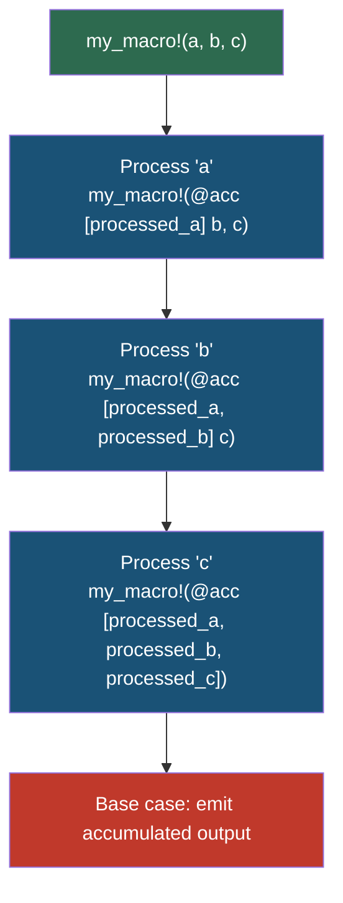

# Chapter 3: Advanced Declarative Patterns 🟡

> **What you'll learn:**
> - **TT-munching** (Token Tree munching) — processing tokens one at a time via recursive macro calls
> - **Push-down accumulation** — building up output across recursive calls using an accumulator
> - **Internal rules** (`@internal` convention) — organizing complex macros with private helper arms
> - When declarative macros hit their limits and procedural macros become necessary

---

## The Recursion Mindset

In Chapters 1 and 2, every macro expanded in a single step: match a pattern, produce output. But many real-world macros need to process their input iteratively — consuming tokens one by one, making decisions, and accumulating output.

Since `macro_rules!` doesn't have loops or mutable state, we achieve this through **recursion**: the macro calls *itself* with a modified token list.



## TT-Munching: Consuming Tokens One at a Time

**TT-munching** (Token Tree munching) is the fundamental pattern. A TT-muncher:

1. Matches the first token(s) from the input
2. Processes them
3. Recursively calls itself with the **remaining** tokens
4. Has a base case for when the input is empty

### Example: Counting Expressions

```rust
macro_rules! count_exprs {
    // Base case: no expressions → count is 0
    () => { 0usize };
    
    // Single expression → count is 1
    ($one:expr) => { 1usize };
    
    // Recursive case: process head, recurse on tail
    ($head:expr, $($tail:expr),+) => {
        1usize + count_exprs!($($tail),+)
    };
}

fn main() {
    let c = count_exprs!(1, "two", 3.0, vec![4]);
    assert_eq!(c, 4);
}
```

**Expansion trace:**
```
count_exprs!(1, "two", 3.0, vec![4])
→ 1 + count_exprs!("two", 3.0, vec![4])
→ 1 + 1 + count_exprs!(3.0, vec![4])
→ 1 + 1 + 1 + count_exprs!(vec![4])
→ 1 + 1 + 1 + 1
→ 4
```

> ⚠️ **Recursion limits:** Rust has a default macro recursion limit of 128. For deeply recursive macros, add `#![recursion_limit = "256"]` (or higher) at the crate root. But if you're hitting the limit, consider whether a procedural macro would be more appropriate.

### TT-Munching with Token Trees

The real power comes when you use `$tt:tt` — the universal matcher that captures any single token or balanced group:

```rust
/// Replace all occurrences of `old` with `new` in a sequence of tokens
macro_rules! replace_ident {
    // Base case: nothing left
    (@replace $old:ident => $new:ident ;) => {};
    
    // Found the target identifier — replace it, continue
    (@replace $old:ident => $new:ident ; $old2:ident $($rest:tt)*) => {
        // We can't pattern-match `$old2 == $old` directly.
        // This is a limitation — see the note below.
        $new $($rest)*
    };
    
    // Non-matching token — pass through, continue
    (@replace $old:ident => $new:ident ; $other:tt $($rest:tt)*) => {
        $other replace_ident!(@replace $old => $new ; $($rest)*)
    };
}
```

> ⚠️ **Limitation:** `macro_rules!` cannot compare two captured identifiers for equality. You can't write "if `$a == $b`". This is one of the key reasons procedural macros exist — they can perform arbitrary comparisons on tokens.

## Push-Down Accumulation

TT-munching processes input left-to-right, but sometimes you need to **build up** output across multiple recursive steps. The pattern is to carry an accumulator — a token group that grows with each step:

```rust
/// Convert a comma-separated list of `key: value` pairs into
/// individual `let` bindings
macro_rules! let_bindings {
    // Entry point: start with empty accumulator []
    ($($input:tt)*) => {
        let_bindings!(@acc [] $($input)*)
    };
    
    // Base case: no more input, emit everything in the accumulator
    (@acc [$($acc:tt)*]) => {
        $($acc)*
    };
    
    // Recursive case: consume one `name: value,` and add a `let` to the accumulator
    (@acc [$($acc:tt)*] $name:ident : $value:expr, $($rest:tt)*) => {
        let_bindings!(@acc [
            $($acc)*
            let $name = $value;
        ] $($rest)*)
    };
    
    // Final pair (no trailing comma)
    (@acc [$($acc:tt)*] $name:ident : $value:expr) => {
        let_bindings!(@acc [
            $($acc)*
            let $name = $value;
        ])
    };
}

fn main() {
    let_bindings! {
        x: 10,
        y: 20,
        name: "Alice",
    }
    
    println!("{x} {y} {name}");
    // Output: 10 20 Alice
}
```

The accumulator `[$($acc:tt)*]` is carried in square brackets (which form a single token tree). Each recursive step appends to it. The base case emits the accumulated tokens.

**Expansion trace:**
```
let_bindings!(x: 10, y: 20, name: "Alice",)
→ let_bindings!(@acc [] x: 10, y: 20, name: "Alice",)
→ let_bindings!(@acc [let x = 10;] y: 20, name: "Alice",)
→ let_bindings!(@acc [let x = 10; let y = 20;] name: "Alice",)
→ let_bindings!(@acc [let x = 10; let y = 20; let name = "Alice";])
→ let x = 10; let y = 20; let name = "Alice";
```

## Internal Rules: The `@` Convention

You may have noticed the `@acc` prefix in the examples above. This is the conventional way to create **internal rules** — macro arms that are implementation details, not part of the public API:

```rust
macro_rules! my_macro {
    // === Public API ===
    
    // The user calls these:
    ($($input:tt)*) => {
        my_macro!(@internal_parse [] $($input)*)
    };
    
    // === Internal Rules ===
    
    // These are never called by users directly.
    // The `@` prefix is a convention — it's just an identifier that
    // users are unlikely to pass as input.
    
    (@internal_parse [$($acc:tt)*]) => {
        // base case
    };
    
    (@internal_parse [$($acc:tt)*] $head:tt $($rest:tt)*) => {
        // recursive case
    };
}
```

Why `@`? It's an arbitrary choice that the Rust community has standardized on. The `@` symbol is a valid token but rarely appears in user code, so it effectively namespaces the internal arms.

### Organizing Large Macros

For complex macros, internal rules keep the public API clean:

```rust
macro_rules! define_error_enum {
    // Public entry point: just the variants
    ( $vis:vis enum $Name:ident { $($variant:ident => $msg:literal),* $(,)? } ) => {
        // Step 1: Define the enum
        define_error_enum!(@define_enum $vis $Name [$($variant)*]);
        // Step 2: Implement Display
        define_error_enum!(@impl_display $Name [$($variant => $msg)*]);
        // Step 3: Implement std::error::Error
        define_error_enum!(@impl_error $Name);
    };
    
    (@define_enum $vis:vis $Name:ident [$($variant:ident)*]) => {
        #[derive(Debug, Clone, PartialEq, Eq)]
        $vis enum $Name {
            $($variant),*
        }
    };
    
    (@impl_display $Name:ident [$($variant:ident => $msg:literal)*]) => {
        impl ::std::fmt::Display for $Name {
            fn fmt(&self, f: &mut ::std::fmt::Formatter<'_>) -> ::std::fmt::Result {
                match self {
                    $(Self::$variant => write!(f, $msg)),*
                }
            }
        }
    };
    
    (@impl_error $Name:ident) => {
        impl ::std::error::Error for $Name {}
    };
}

// Usage:
define_error_enum! {
    pub enum AppError {
        NotFound => "resource not found",
        Unauthorized => "authentication required",
        RateLimited => "too many requests",
    }
}

fn main() {
    let err = AppError::NotFound;
    println!("{err}"); // "resource not found"
}
```

**What you write:** 6 lines of macro invocation.  
**What the compiler expands it to:** An enum definition, a `Display` impl, and an `Error` impl (~25 lines).

## Advanced Pattern: Callback/Continuation Macros

Sometimes one macro needs to feed its output into another macro. The pattern is to accept a "callback" macro name:

```rust
/// Count items, then call $callback with the count
macro_rules! count_and_call {
    // Entry point
    ($callback:ident; $($items:tt)*) => {
        count_and_call!(@count $callback; 0usize; $($items)*)
    };
    
    // Base case: all items consumed, invoke callback with the count
    (@count $callback:ident; $count:expr;) => {
        $callback!($count)
    };
    
    // Recursive case: increment count, consume one item
    (@count $callback:ident; $count:expr; $_head:tt $($rest:tt)*) => {
        count_and_call!(@count $callback; $count + 1usize; $($rest)*)
    };
}

macro_rules! create_array {
    ($size:expr) => {
        [0u8; $size]
    };
}

fn main() {
    // count_and_call counts 3 items, then calls create_array!(3)
    let arr = count_and_call!(create_array; a b c);
    assert_eq!(arr.len(), 3);
}
```

This pattern is used in production crates when one macro needs to compute something (like a count) that another macro needs as a concrete value.

## When Declarative Macros Hit Their Limits

After mastering TT-munching and push-down accumulation, you'll encounter problems that `macro_rules!` simply **cannot** solve:

| Limitation | Example | Solution |
|-----------|---------|----------|
| Cannot compare identifiers | "if field name equals `id`, add special handling" | Procedural macro |
| Cannot inspect types | "if field is `Option<T>`, generate different code" | Procedural macro |
| Cannot generate new identifiers | "create `get_<field>()` from field name" | Procedural macro with `format_ident!` |
| Cannot access file system | "read a schema file and generate structs" | Procedural macro |
| Cannot produce multiple top-level items from a derive | "generate companion struct + impl" | Procedural macro |
| Recursion depth | Complex inputs with hundreds of fields | Procedural macro (iterates, not recurses) |

```rust
// ❌ IMPOSSIBLE with macro_rules!:
// Generate getter methods named after struct fields
macro_rules! getters {
    ($name:ident { $($field:ident : $ty:ty),* }) => {
        impl $name {
            $(
                // We want fn get_$field() — but we can't
                // concatenate identifiers in macro_rules!
                // There's no `paste!` built-in (though the
                // `paste` crate hacks around it)
                pub fn $field(&self) -> &$ty {
                    &self.$field
                }
            )*
        }
    };
}
```

The `paste` crate provides a workaround for identifier concatenation, but once you find yourself fighting `macro_rules!` limitations, it's time to graduate to **procedural macros** — the subject of Part II.

## Real-World Case Study: `bitflags!`

The `bitflags` crate is one of the most downloaded crates on crates.io and it's entirely built with `macro_rules!`. It demonstrates every pattern we've covered:

```rust
// Conceptual simplified bitflags (the real crate is more elaborate)
macro_rules! bitflags {
    (
        $(#[$outer:meta])*
        $vis:vis struct $BitFlags:ident: $T:ty {
            $(
                $(#[$inner:meta])*
                const $Flag:ident = $value:expr;
            )*
        }
    ) => {
        $(#[$outer])*
        #[derive(Clone, Copy, PartialEq, Eq, Hash)]
        $vis struct $BitFlags($T);
        
        impl $BitFlags {
            $(
                $(#[$inner])*
                pub const $Flag: Self = Self($value);
            )*
            
            pub const fn empty() -> Self { Self(0) }
            pub const fn all() -> Self { Self(0 $(| $value)*) }
            pub const fn bits(&self) -> $T { self.0 }
            pub const fn contains(&self, other: Self) -> bool {
                (self.0 & other.0) == other.0
            }
        }
        
        impl ::std::ops::BitOr for $BitFlags {
            type Output = Self;
            fn bitor(self, rhs: Self) -> Self { Self(self.0 | rhs.0) }
        }
        
        impl ::std::ops::BitAnd for $BitFlags {
            type Output = Self;
            fn bitand(self, rhs: Self) -> Self { Self(self.0 & rhs.0) }
        }
        
        impl ::std::fmt::Debug for $BitFlags {
            fn fmt(&self, f: &mut ::std::fmt::Formatter<'_>) -> ::std::fmt::Result {
                let mut first = true;
                $(
                    if self.contains(Self::$Flag) {
                        if !first { write!(f, " | ")?; }
                        write!(f, stringify!($Flag))?;
                        first = false;
                    }
                )*
                if first {
                    write!(f, "(empty)")?;
                }
                Ok(())
            }
        }
    };
}

bitflags! {
    pub struct Permissions: u32 {
        const READ    = 0b0001;
        const WRITE   = 0b0010;
        const EXECUTE = 0b0100;
    }
}

fn main() {
    let rw = Permissions::READ | Permissions::WRITE;
    println!("{:?}", rw);                         // "READ | WRITE"
    println!("can read: {}", rw.contains(Permissions::READ));   // "can read: true"
    println!("can exec: {}", rw.contains(Permissions::EXECUTE)); // "can exec: false"
}
```

This demonstrates:
- **Meta-variable capturing** (`#[$outer:meta]`, `$vis:vis`) for forwarding attributes and visibility
- **Repetition** over the flag definitions
- **Multiple generated items** (struct, impl block, trait impls) from a single invocation
- **`stringify!`** to turn an identifier into a string literal at compile time

---

<details>
<summary><strong>🏋️ Exercise: Build a <code>enum_str!</code> Macro with TT-Munching</strong> (click to expand)</summary>

**Challenge:** Write an `enum_str!` macro that:

1. Defines an enum with the given variants
2. Implements a `fn as_str(&self) -> &'static str` method that returns the variant name as a string
3. Implements `FromStr` that parses a string back to the enum variant

```rust
enum_str! {
    pub enum Color {
        Red,
        Green,
        Blue,
    }
}

fn main() {
    let c = Color::Red;
    assert_eq!(c.as_str(), "Red");
    
    let parsed: Color = "Blue".parse().unwrap();
    assert_eq!(parsed, Color::Blue);
    
    assert!("Purple".parse::<Color>().is_err());
}
```

Hint: Use `stringify!($variant)` to convert identifiers to string literals. Use `@impl_from_str` as an internal rule.

<details>
<summary>🔑 Solution</summary>

```rust
macro_rules! enum_str {
    (
        $(#[$meta:meta])*
        $vis:vis enum $Name:ident {
            $($Variant:ident),* $(,)?
        }
    ) => {
        // Step 1: Define the enum with common derives
        $(#[$meta])*
        #[derive(Debug, Clone, Copy, PartialEq, Eq)]
        $vis enum $Name {
            $($Variant),*
        }
        
        // Step 2: Implement as_str()
        impl $Name {
            /// Returns the variant name as a string slice.
            pub fn as_str(&self) -> &'static str {
                match self {
                    // stringify! turns the identifier into a &'static str
                    // at compile time — zero runtime cost
                    $(Self::$Variant => stringify!($Variant)),*
                }
            }
        }
        
        // Step 3: Implement Display (delegates to as_str)
        impl ::std::fmt::Display for $Name {
            fn fmt(&self, f: &mut ::std::fmt::Formatter<'_>) -> ::std::fmt::Result {
                f.write_str(self.as_str())
            }
        }
        
        // Step 4: Implement FromStr
        impl ::std::str::FromStr for $Name {
            type Err = String;
            
            fn from_str(s: &str) -> ::std::result::Result<Self, Self::Err> {
                match s {
                    // Each variant name (as a string) maps back
                    // to the enum variant
                    $(stringify!($Variant) => Ok(Self::$Variant),)*
                    
                    // Unknown string → error with helpful message
                    other => Err(format!(
                        "unknown variant '{}', expected one of: {}",
                        other,
                        // Build the list of valid variants
                        [$(stringify!($Variant)),*].join(", ")
                    )),
                }
            }
        }
    };
}

enum_str! {
    pub enum Color {
        Red,
        Green,
        Blue,
    }
}

fn main() {
    let c = Color::Red;
    assert_eq!(c.as_str(), "Red");
    println!("Color: {c}");  // "Color: Red"
    
    let parsed: Color = "Blue".parse().unwrap();
    assert_eq!(parsed, Color::Blue);
    
    let err = "Purple".parse::<Color>();
    println!("Error: {}", err.unwrap_err());
    // "Error: unknown variant 'Purple', expected one of: Red, Green, Blue"
}
```

**Note:** This macro doesn't use TT-munching because the problem is well-suited to simple repetition. TT-munching would be needed if we had to handle per-variant attributes like `#[rename = "red"]` which require inspecting each variant individually. The point is: **choose the simplest technique that gets the job done**.

</details>
</details>

---

> **Key Takeaways:**
> - **TT-munching** processes tokens one by one via recursion — it's the `macro_rules!` equivalent of a loop
> - **Push-down accumulation** carries an accumulator through recursive steps, building output incrementally
> - **Internal rules** using `@name` prefixes keep the macro's public API clean while organizing complex logic
> - Declarative macros **cannot** compare identifiers, inspect types, generate new identifiers, or access external data
> - When you hit these limits, it's time for **procedural macros** (Part II)
> - Real-world crates like `bitflags` show that `macro_rules!` can still build powerful, widely-used abstractions

> **See also:**
> - [Chapter 1: `macro_rules!` and AST Matching](ch01-macro-rules-and-ast-matching.md) — revisit designators and repetition if the recursion patterns feel unfamiliar
> - [Chapter 4: The Procedural Paradigm and TokenStreams](ch04-procedural-paradigm-and-tokenstreams.md) — the next step when `macro_rules!` isn't enough
> - [Rust Patterns](../rust-patterns-book/src/SUMMARY.md) — advanced patterns that benefit from macro generation
