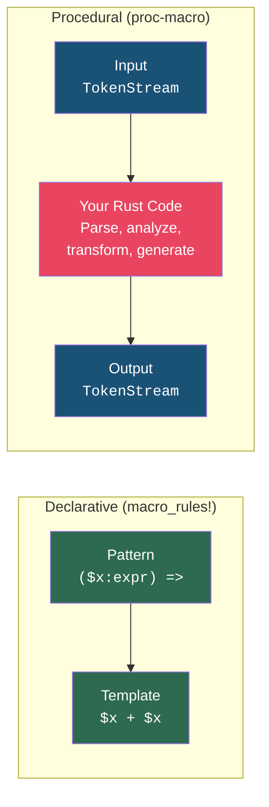
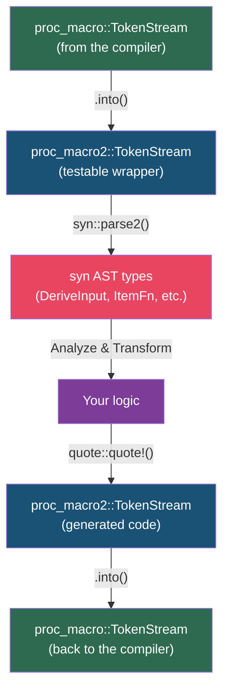

# Chapter 4: The Procedural Paradigm and TokenStreams 🟡

> **What you'll learn:**
> - Why procedural macros are a fundamentally different paradigm from `macro_rules!`
> - The `proc-macro` crate type and its compilation model constraints
> - The three kinds of procedural macros: derive, attribute, and function-like
> - The holy trinity of proc-macro development: `proc-macro2`, `syn`, and `quote`
> - How `TokenStream` works and the difference between `proc_macro::TokenStream` and `proc_macro2::TokenStream`

---

## The Paradigm Shift

In Part I, we learned declarative macros: you write **patterns** on the left and **templates** on the right. The compiler does the matching and substitution.

Procedural macros are completely different. Instead of declaring patterns, you write **a Rust function** that:

1. Receives a stream of tokens as input
2. Executes arbitrary Rust code to analyze and transform those tokens
3. Returns a new stream of tokens as output

In other words: **you are writing a compiler plugin**. Your macro is a Rust program that runs *at compile time* and whose output becomes part of the compiled program.



| Aspect | Declarative (`macro_rules!`) | Procedural (proc-macro) |
|--------|------------------------------|-------------------------|
| Runs | Pattern matching engine | Arbitrary Rust code |
| Input | Token trees via matchers | `TokenStream` |
| Output | Template with interpolation | `TokenStream` |
| Can inspect types? | ❌ No | ❌ No (still pre-type-checking) |
| Can compare identifiers? | ❌ No | ✅ Yes — they're strings |
| Can generate new identifiers? | ❌ No | ✅ Yes — `format_ident!` |
| Can call external code? | ❌ No | ✅ Yes — file I/O, network, anything |
| Hygiene | Automatic | Manual (you control spans) |
| Crate type | Regular crate | Special `proc-macro` crate |

## The `proc-macro` Crate Constraint

Here's the most important structural rule of procedural macros:

> **A procedural macro must live in its own crate with `crate-type = "proc-macro"` in `Cargo.toml`.**

This is a compiler-enforced constraint. You cannot define a proc-macro in the same crate that uses it. The typical pattern is a two-crate setup:

```
my-library/
├── Cargo.toml           # The "facade" crate users depend on
├── src/
│   └── lib.rs           # Re-exports the derive + normal code
│
└── my-library-derive/
    ├── Cargo.toml       # proc-macro = true
    └── src/
        └── lib.rs       # The actual macro implementation
```

**The facade crate's `Cargo.toml`:**
```toml
[package]
name = "my-library"

[dependencies]
my-library-derive = { path = "./my-library-derive" }
```

**The derive crate's `Cargo.toml`:**
```toml
[package]
name = "my-library-derive"

[lib]
proc-macro = true

[dependencies]
syn = { version = "2", features = ["full"] }
quote = "1"
proc-macro2 = "1"
```

**Why the separate crate?** Proc-macro crates are compiled and **executed by the compiler** during compilation of downstream crates. They run in a special sandbox. The compiler needs to load them as dynamic libraries (`.so`/`.dylib`/`.dll`), which requires a distinct compilation unit. This is not an arbitrary limitation — it's a consequence of the compilation model.

## The Three Kinds of Procedural Macros

```rust
// 1. DERIVE MACRO — adds to an item without modifying it
// Used as: #[derive(MyTrait)]
#[proc_macro_derive(MyTrait)]
pub fn my_trait_derive(input: TokenStream) -> TokenStream {
    // `input` is the struct/enum definition
    // Return ADDITIONAL code (trait impl) — the original item is preserved
    todo!()
}

// 2. ATTRIBUTE MACRO — receives the item AND can replace it entirely
// Used as: #[my_attr(args)]
#[proc_macro_attribute]
pub fn my_attr(attr: TokenStream, item: TokenStream) -> TokenStream {
    // `attr` is the arguments: `args` in `#[my_attr(args)]`
    // `item` is the annotated item (fn, struct, etc.)
    // Return the REPLACEMENT for the item — you must re-emit it (possibly modified)
    todo!()
}

// 3. FUNCTION-LIKE MACRO — arbitrary invocation syntax
// Used as: my_macro!(anything here)
#[proc_macro]
pub fn my_macro(input: TokenStream) -> TokenStream {
    // `input` is whatever tokens the user put inside the parentheses
    // Return arbitrary code
    todo!()
}
```

| Kind | Annotation | Input(s) | Output semantics |
|------|-----------|----------|------------------|
| Derive | `#[proc_macro_derive(Name)]` | The annotated item | **Appended** to the item |
| Attribute | `#[proc_macro_attribute]` | (attr args, annotated item) | **Replaces** the item |
| Function-like | `#[proc_macro]` | The invocation body | **Replaces** the invocation |

The critical difference between derive and attribute macros is what happens to the original item:
- **Derive**: The original struct/enum is *always preserved*. Your macro only emits additional code that gets appended after it.
- **Attribute**: The original item is consumed. If you want it to remain, you must re-emit it in your output.

## Understanding `TokenStream`

A `TokenStream` is a sequence of **token trees**. It's the currency of procedural macros — you receive them, you produce them.

```rust
// Conceptually, a TokenStream is like:
enum TokenTree {
    Ident(Ident),           // `foo`, `MyStruct`, `async`
    Punct(Punct),           // `+`, `::`, `#`
    Literal(Literal),       // `42`, `"hello"`, `3.14`
    Group(Delimiter, TokenStream), // (...), [...], {...}
}
```

### The Two `TokenStream` Types

There are **two** crates that provide `TokenStream`:

| Crate | Type | Usable in | Purpose |
|-------|------|-----------|---------|
| `proc_macro` (std) | `proc_macro::TokenStream` | Only inside proc-macro functions | The "real" token stream the compiler works with |
| `proc_macro2` | `proc_macro2::TokenStream` | Anywhere, including tests | A wrapper that can be used in unit tests and helper libraries |

This is why the ecosystem standardized on `proc_macro2`: you can't unit-test functions that take `proc_macro::TokenStream` because that type only exists during compilation. But `proc_macro2::TokenStream` works everywhere.

The conversion between them is trivial:

```rust
use proc_macro::TokenStream;  // The "real" one
use proc_macro2::TokenStream as TokenStream2;  // The testable one

#[proc_macro_derive(MyTrait)]
pub fn my_derive(input: TokenStream) -> TokenStream {
    // Convert to proc_macro2 for syn/quote compatibility
    let input2: TokenStream2 = input.into();
    
    // ... do work with syn and quote using TokenStream2 ...
    let output: TokenStream2 = quote::quote! { /* ... */ };
    
    // Convert back to proc_macro for the compiler
    output.into()
}
```

In practice, `syn::parse_macro_input!` and `quote::quote!` handle these conversions automatically.

## The Holy Trinity: `proc-macro2`, `syn`, `quote`

These three crates form the foundation of virtually every procedural macro in the Rust ecosystem:



### `proc-macro2`: The Foundation Layer

Provides `TokenStream`, `TokenTree`, `Ident`, `Punct`, `Literal`, `Span`, and `Group` types that mirror `proc_macro`'s types but work outside of proc-macro context. You rarely use it directly — `syn` and `quote` use it internally.

### `syn`: The Parser

`syn` parses a `TokenStream` into a structured **Abstract Syntax Tree** (AST). Instead of manually walking through tokens, you get typed Rust data structures:

```rust
use syn::{parse_macro_input, DeriveInput};

#[proc_macro_derive(MyTrait)]
pub fn my_derive(input: proc_macro::TokenStream) -> proc_macro::TokenStream {
    // This one line converts a flat token stream into a structured AST
    let ast = parse_macro_input!(input as DeriveInput);
    
    // Now you can access:
    // ast.ident     — the struct/enum name
    // ast.generics  — generic parameters <T, U>
    // ast.data      — the struct fields or enum variants
    // ast.attrs     — #[...] attributes on the item
    
    todo!()
}
```

### `quote`: The Code Generator

`quote` provides the `quote!` macro that turns Rust-like syntax back into a `TokenStream`. You can interpolate variables with `#var`:

```rust
use quote::quote;
use syn::Ident;

let name = Ident::new("MyStruct", proc_macro2::Span::call_site());
let field_count = 3usize;

let output = quote! {
    impl #name {
        pub fn field_count() -> usize {
            #field_count
        }
    }
};

// `output` is a proc_macro2::TokenStream containing:
// impl MyStruct {
//     pub fn field_count() -> usize {
//         3usize
//     }
// }
```

## A Minimal Working Example

Let's build the simplest possible derive macro to see all the pieces together.

**Step 1: Create the crate structure**
```bash
cargo new my-lib
cd my-lib
cargo new my-lib-derive --lib
```

**Step 2: Configure `my-lib-derive/Cargo.toml`**
```toml
[package]
name = "my-lib-derive"
version = "0.1.0"
edition = "2021"

[lib]
proc-macro = true

[dependencies]
syn = { version = "2", features = ["full"] }
quote = "1"
proc-macro2 = "1"
```

**Step 3: Write the macro in `my-lib-derive/src/lib.rs`**
```rust
use proc_macro::TokenStream;
use quote::quote;
use syn::{parse_macro_input, DeriveInput};

/// Derive macro that implements a `describe()` method returning the type name.
#[proc_macro_derive(Describe)]
pub fn describe_derive(input: TokenStream) -> TokenStream {
    // Parse the input token stream into a DeriveInput AST
    let ast = parse_macro_input!(input as DeriveInput);
    
    // Extract the struct/enum name
    let name = &ast.ident;
    
    // Convert the name to a string for the runtime message
    let name_str = name.to_string();
    
    // Generate the implementation
    let expanded = quote! {
        impl #name {
            pub fn describe() -> &'static str {
                #name_str
            }
        }
    };
    
    // Convert proc_macro2::TokenStream → proc_macro::TokenStream
    expanded.into()
}
```

**Step 4: Use it in `my-lib/src/main.rs`**
```rust
use my_lib_derive::Describe;

#[derive(Describe)]
struct Sensor {
    id: u32,
    reading: f64,
}

fn main() {
    println!("Type: {}", Sensor::describe());
    // Output: "Type: Sensor"
}
```

**What you write:** `#[derive(Describe)]` — one line.  
**What the compiler expands it to:**
```rust
impl Sensor {
    pub fn describe() -> &'static str {
        "Sensor"
    }
}
```

## Spans: Why They Matter

Every token in a `TokenStream` has a **span** — metadata that records where in the source code the token came from. Spans are crucial for:

1. **Error messages** — When the compiler reports an error in macro-generated code, the span determines which line the error points to
2. **Hygiene** — In proc macros, *you* control the span, which means *you* are responsible for hygiene

```rust
use proc_macro2::Span;

// call_site() — tokens act as if the USER wrote them (at the macro invocation)
let ident = Ident::new("my_var", Span::call_site());

// mixed_site() — closest to macro_rules! hygiene (definition-site for locals)
let ident = Ident::new("my_var", Span::mixed_site());
```

| Span | Behavior | Use when |
|------|----------|----------|
| `Span::call_site()` | Token appears to come from where the macro was invoked | You want generated identifiers to be visible to surrounding code |
| `Span::mixed_site()` | Behaves like `macro_rules!` hygiene | You want local variables to be hygienic |

We'll use spans extensively in Chapters 6–8 for proper error reporting.

---

<details>
<summary><strong>🏋️ Exercise: Set Up a Proc-Macro Workspace</strong> (click to expand)</summary>

**Challenge:** Create a workspace with:
1. A `hello-derive` proc-macro crate that implements `#[derive(HelloWorld)]`
2. A `hello-app` binary crate that uses it
3. The derive macro should generate an `fn hello_world()` method that prints `"Hello from <TypeName>!"`

Test it by running:
```rust
#[derive(HelloWorld)]
struct Greeter;

fn main() {
    Greeter::hello_world();
    // Should print: "Hello from Greeter!"
}
```

<details>
<summary>🔑 Solution</summary>

**Directory structure:**
```
hello-workspace/
├── Cargo.toml
├── hello-derive/
│   ├── Cargo.toml
│   └── src/
│       └── lib.rs
└── hello-app/
    ├── Cargo.toml
    └── src/
        └── main.rs
```

**Workspace `Cargo.toml`:**
```toml
[workspace]
members = ["hello-derive", "hello-app"]
```

**`hello-derive/Cargo.toml`:**
```toml
[package]
name = "hello-derive"
version = "0.1.0"
edition = "2021"

[lib]
proc-macro = true

[dependencies]
syn = { version = "2", features = ["full"] }
quote = "1"
proc-macro2 = "1"
```

**`hello-derive/src/lib.rs`:**
```rust
use proc_macro::TokenStream;
use quote::quote;
use syn::{parse_macro_input, DeriveInput};

/// Generates a `hello_world()` associated function that prints a greeting.
///
/// # Example
///
/// ```
/// #[derive(HelloWorld)]
/// struct Greeter;
///
/// Greeter::hello_world(); // prints "Hello from Greeter!"
/// ```
#[proc_macro_derive(HelloWorld)]
pub fn hello_world_derive(input: TokenStream) -> TokenStream {
    // Parse the input into a DeriveInput AST node.
    // DeriveInput gives us the name, generics, and data of the
    // struct or enum we're deriving on.
    let ast = parse_macro_input!(input as DeriveInput);
    
    // Extract the type name as an Ident
    let name = &ast.ident;
    
    // Convert to a string literal for runtime printing
    let name_str = name.to_string();
    
    // Generate the implementation using quote!
    // #name interpolates the Ident — it becomes the actual type name
    // #name_str interpolates the String — it becomes a string literal
    let expanded = quote! {
        impl #name {
            pub fn hello_world() {
                println!("Hello from {}!", #name_str);
            }
        }
    };
    
    // Convert from proc_macro2::TokenStream to proc_macro::TokenStream
    expanded.into()
}
```

**`hello-app/Cargo.toml`:**
```toml
[package]
name = "hello-app"
version = "0.1.0"
edition = "2021"

[dependencies]
hello-derive = { path = "../hello-derive" }
```

**`hello-app/src/main.rs`:**
```rust
use hello_derive::HelloWorld;

#[derive(HelloWorld)]
struct Greeter;

#[derive(HelloWorld)]
struct Database;

fn main() {
    Greeter::hello_world();   // "Hello from Greeter!"
    Database::hello_world();  // "Hello from Database!"
}
```

Run with:
```bash
cd hello-workspace && cargo run -p hello-app
```

</details>
</details>

---

> **Key Takeaways:**
> - Procedural macros are **Rust programs that run at compile time** — they receive and produce `TokenStream` values
> - They must live in a **separate crate** with `proc-macro = true` in `Cargo.toml`
> - The three kinds are **derive** (appends code), **attribute** (replaces code), and **function-like** (arbitrary generation)
> - The **holy trinity** is `proc-macro2` (testable token types), `syn` (parsing), and `quote` (code generation)
> - Use `proc_macro2::TokenStream` in helper functions for testability; convert to/from `proc_macro::TokenStream` only at the boundary
> - **Spans** control error reporting and hygiene — you are now responsible for both

> **See also:**
> - [Chapter 5: Parsing with `syn` and Generating with `quote!`](ch05-parsing-with-syn-and-generating-with-quote.md) — deep dive into the AST navigation tools
> - [Chapter 3: Advanced Declarative Patterns](ch03-advanced-declarative-patterns.md) — revisit the limits that motivated proc macros
> - [Rust Engineering Practices](../engineering-book/src/SUMMARY.md) — workspace layout and CI configuration for macro crates
