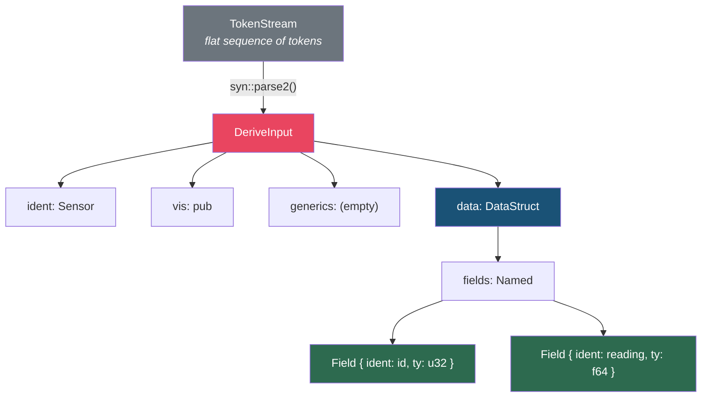

# Chapter 5: Parsing with `syn` and Generating with `quote!` 🟡

> **What you'll learn:**
> - How `syn` transforms a flat `TokenStream` into a navigable AST with `DeriveInput`, `ItemFn`, and other types
> - How to traverse struct fields, enum variants, generics, and attributes using `syn`'s data model
> - How `quote!` interpolates variables, iterates over collections, and generates syntactically valid code
> - The `format_ident!` macro for programmatically creating new identifiers (something `macro_rules!` cannot do)

---

## From Token Soup to Structured Data

A `TokenStream` is a flat sequence of tokens — no structure, no meaning. Think of it as a sentence with words but no grammar:

```
pub struct Sensor { id : u32 , reading : f64 , }
```

`syn` **parses** this flat stream into a tree-shaped AST that mirrors Rust's grammar:



## The `DeriveInput` Type

`DeriveInput` is the starting point for every derive macro. It represents the struct, enum, or union being derived on:

```rust
// Simplified — the real type has more fields
pub struct DeriveInput {
    pub attrs: Vec<Attribute>,    // #[...] attributes on the item
    pub vis: Visibility,          // pub, pub(crate), etc.
    pub ident: Ident,             // The type name
    pub generics: Generics,       // <T, U> where T: Clone
    pub data: Data,               // Struct fields, enum variants, or union fields
}

pub enum Data {
    Struct(DataStruct),
    Enum(DataEnum),
    Union(DataUnion),
}
```

### Navigating Struct Fields

For a struct, the fields live inside `Data::Struct`:

```rust
use syn::{parse_macro_input, DeriveInput, Data, Fields};

#[proc_macro_derive(Inspect)]
pub fn inspect_derive(input: proc_macro::TokenStream) -> proc_macro::TokenStream {
    let ast = parse_macro_input!(input as DeriveInput);
    let name = &ast.ident;
    
    // Extract named fields (like `struct Foo { x: i32 }`)
    let fields = match &ast.data {
        Data::Struct(data) => match &data.fields {
            Fields::Named(fields) => &fields.named,
            Fields::Unnamed(fields) => &fields.unnamed,
            Fields::Unit => {
                // Unit struct: `struct Foo;`
                return quote::quote! {
                    impl #name {
                        pub fn inspect(&self) -> String {
                            format!("{} (unit struct)", stringify!(#name))
                        }
                    }
                }.into();
            }
        },
        Data::Enum(_) => panic!("Inspect is not implemented for enums"),
        Data::Union(_) => panic!("Inspect is not implemented for unions"),
    };
    
    // `fields` is now a Punctuated<Field, Comma>
    // Each Field has:
    //   field.ident  — Option<Ident> (None for tuple structs)
    //   field.ty     — Type
    //   field.attrs  — Vec<Attribute>
    //   field.vis    — Visibility
    
    // ... generate code using these fields ...
    todo!()
}
```

### The Field Type in Detail

```rust
// syn::Field (simplified)
pub struct Field {
    pub attrs: Vec<Attribute>,  // #[serde(rename = "...")] etc.
    pub vis: Visibility,        // pub, pub(crate), etc.
    pub ident: Option<Ident>,   // Named structs: Some("field_name")
                                // Tuple structs: None
    pub ty: Type,               // The field's type: i32, Vec<String>, etc.
}
```

### Navigating Enum Variants

For enums, the variants live inside `Data::Enum`:

```rust
match &ast.data {
    Data::Enum(data) => {
        for variant in &data.variants {
            let variant_name = &variant.ident;
            
            match &variant.fields {
                Fields::Named(fields) => {
                    // Struct variant: Variant { x: i32, y: i32 }
                }
                Fields::Unnamed(fields) => {
                    // Tuple variant: Variant(i32, i32)
                }
                Fields::Unit => {
                    // Unit variant: Variant
                }
            }
        }
    }
    _ => {}
}
```

## The `quote!` Macro: Code Generation

`quote!` takes Rust-like syntax and produces a `proc_macro2::TokenStream`. It supports interpolation with `#`:

### Basic Interpolation

```rust
use quote::quote;
use syn::Ident;
use proc_macro2::Span;

let struct_name = Ident::new("MyStruct", Span::call_site());
let field_name = Ident::new("value", Span::call_site());
let field_type = Ident::new("i32", Span::call_site());

let tokens = quote! {
    struct #struct_name {
        #field_name: #field_type,
    }
};
// Produces: struct MyStruct { value: i32, }
```

### Repetition with `#(...)*`

The most powerful feature: iterate over collections inside `quote!`:

```rust
use quote::quote;

let field_names = vec![
    Ident::new("x", Span::call_site()),
    Ident::new("y", Span::call_site()),
    Ident::new("z", Span::call_site()),
];

let field_types = vec![
    quote! { f64 },
    quote! { f64 },
    quote! { f64 },
];

let tokens = quote! {
    struct Point {
        // #(...)* iterates over the zipped collections
        #(pub #field_names: #field_types,)*
    }
};
// Produces:
// struct Point {
//     pub x: f64,
//     pub y: f64,
//     pub z: f64,
// }
```

### Repetition Syntax Reference

| `quote!` Syntax | Meaning |
|-----------------|---------|
| `#var` | Interpolate a single value |
| `#(#var)*` | Repeat — no separator |
| `#(#var),*` | Repeat with comma separator |
| `#(#var);*` | Repeat with semicolon separator |
| `#(#key: #value),*` | Repeat multiple variables in lockstep |

### What Types Can Be Interpolated?

Any type that implements `quote::ToTokens` can be interpolated. This includes:

| Type | Interpolates as |
|------|----------------|
| `Ident` | An identifier token |
| `proc_macro2::TokenStream` | Raw tokens |
| `&str`, `String` | ❌ Does NOT work — use `Literal::string()` or `#name_str` where `name_str` is a string variable that quote auto-wraps |
| `usize`, `i32`, etc. | A literal number |
| `bool` | `true` or `false` |
| `syn::Type` | A type expression |
| `syn::Expr` | An expression |

> ⚠️ **Common mistake:** Trying to interpolate a `String` as a string literal. `quote!` interpolates `String` as an identifier, not a quoted string. Use `syn::LitStr` or build a literal explicitly:

```rust
// ❌ FAILS: String is interpolated as tokens, not as "quoted text"
let msg = String::from("hello");
let bad = quote! { println!(#msg); };
// Produces: println!(hello);  — `hello` as an identifier, not a string!

// ✅ FIX: Use a string variable that quote recognizes
let msg = "hello"; // &str works as a literal in some contexts
let good = quote! { println!("{}", #msg); };

// ✅ FIX (explicit): Build a string literal
let msg = syn::LitStr::new("hello", Span::call_site());
let good = quote! { println!("{}", #msg); };
// Produces: println!("{}", "hello");
```

## `format_ident!`: Generating New Identifiers

This is the killer feature that `macro_rules!` doesn't have — creating identifiers programmatically:

```rust
use quote::format_ident;

let field = Ident::new("name", Span::call_site());

// Create getter/setter names
let getter = format_ident!("get_{}", field);  // get_name
let setter = format_ident!("set_{}", field);  // set_name
let with   = format_ident!("with_{}", field); // with_name

let tokens = quote! {
    pub fn #getter(&self) -> &str {
        &self.#field
    }
    
    pub fn #setter(&mut self, val: String) {
        self.#field = val;
    }
    
    pub fn #with(mut self, val: String) -> Self {
        self.#field = val;
        self
    }
};
```

This is how crates like `getset`, `derive_builder`, and `typed-builder` generate their fluent APIs.

## Putting It All Together: An Auto-Debug Derive

Let's build a complete derive macro that generates a custom `Debug` implementation showing field names and types:

```rust
// In your derive crate's lib.rs
use proc_macro::TokenStream;
use quote::quote;
use syn::{parse_macro_input, DeriveInput, Data, Fields};

#[proc_macro_derive(AutoDebug)]
pub fn auto_debug_derive(input: TokenStream) -> TokenStream {
    let ast = parse_macro_input!(input as DeriveInput);
    let name = &ast.ident;
    let name_str = name.to_string();
    
    let field_debugs = match &ast.data {
        Data::Struct(data) => match &data.fields {
            Fields::Named(fields) => {
                let debug_fields = fields.named.iter().map(|f| {
                    let field_name = f.ident.as_ref().unwrap();
                    let field_name_str = field_name.to_string();
                    quote! {
                        .field(#field_name_str, &self.#field_name)
                    }
                });
                quote! {
                    f.debug_struct(#name_str)
                        #(#debug_fields)*
                        .finish()
                }
            }
            Fields::Unnamed(fields) => {
                let debug_fields = fields.unnamed.iter().enumerate().map(|(i, _)| {
                    let index = syn::Index::from(i);
                    quote! {
                        .field(&self.#index)
                    }
                });
                quote! {
                    f.debug_tuple(#name_str)
                        #(#debug_fields)*
                        .finish()
                }
            }
            Fields::Unit => {
                quote! {
                    f.write_str(#name_str)
                }
            }
        },
        _ => panic!("AutoDebug only supports structs"),
    };
    
    let expanded = quote! {
        impl ::std::fmt::Debug for #name {
            fn fmt(&self, f: &mut ::std::fmt::Formatter<'_>) -> ::std::fmt::Result {
                #field_debugs
            }
        }
    };
    
    expanded.into()
}
```

**What you write:**
```rust
#[derive(AutoDebug)]
struct Config {
    host: String,
    port: u16,
    verbose: bool,
}
```

**What the compiler expands it to:**
```rust
impl ::std::fmt::Debug for Config {
    fn fmt(&self, f: &mut ::std::fmt::Formatter<'_>) -> ::std::fmt::Result {
        f.debug_struct("Config")
            .field("host", &self.host)
            .field("port", &self.port)
            .field("verbose", &self.verbose)
            .finish()
    }
}
```

## Common `syn` Types Quick Reference

| `syn` Type | Represents | Example Source |
|-----------|-----------|----------------|
| `DeriveInput` | A struct/enum/union with derives | `#[derive(X)] struct Foo { ... }` |
| `ItemFn` | A function definition | `fn foo(x: i32) -> bool { ... }` |
| `ItemStruct` | A struct definition | `struct Bar(i32);` |
| `ItemEnum` | An enum definition | `enum Color { Red, Blue }` |
| `Type` | Any type expression | `Vec<String>`, `&'a mut [u8]` |
| `Expr` | Any expression | `x + 1`, `foo()`, `if a { b } else { c }` |
| `Pat` | A pattern | `Some(x)`, `(a, b)`, `_` |
| `Path` | A path | `std::io::Error`, `crate::MyType` |
| `Generics` | Generic parameters | `<T: Clone, U>` |
| `WhereClause` | A where clause | `where T: Debug + Clone` |
| `Attribute` | An attribute | `#[serde(rename = "foo")]` |

### Parsing Custom Syntax

`syn` isn't limited to standard Rust syntax. You can define your own grammar by implementing the `Parse` trait:

```rust
use syn::parse::{Parse, ParseStream};
use syn::{Ident, Token, Expr, Result};

// Custom syntax: `name => value`
struct KeyValue {
    key: Ident,
    value: Expr,
}

impl Parse for KeyValue {
    fn parse(input: ParseStream) -> Result<Self> {
        let key: Ident = input.parse()?;     // Parse an identifier
        input.parse::<Token![=>]>()?;          // Parse the `=>` token
        let value: Expr = input.parse()?;      // Parse an expression
        Ok(KeyValue { key, value })
    }
}

// Usage in a proc macro:
// my_macro!(host => "localhost")
// syn::parse_macro_input!(input as KeyValue)
```

---

<details>
<summary><strong>🏋️ Exercise: Build a <code>#[derive(Getters)]</code> Macro</strong> (click to expand)</summary>

**Challenge:** Create a derive macro that generates getter methods for all **public** fields of a struct:

```rust
#[derive(Getters)]
struct User {
    pub name: String,
    pub age: u32,
    password_hash: String,  // private — no getter generated
}

fn main() {
    let user = User {
        name: "Alice".into(),
        age: 30,
        password_hash: "abc123".into(),
    };
    
    assert_eq!(user.name(), &"Alice".to_string());
    assert_eq!(user.age(), &30);
    // user.password_hash() ← should NOT exist
}
```

Requirements:
1. Only generate getters for `pub` fields
2. Getters return `&FieldType` (a reference)
3. Getter name is `fn field_name(&self) -> &FieldType`

<details>
<summary>🔑 Solution</summary>

```rust
use proc_macro::TokenStream;
use quote::quote;
use syn::{parse_macro_input, DeriveInput, Data, Fields, Visibility};

#[proc_macro_derive(Getters)]
pub fn getters_derive(input: TokenStream) -> TokenStream {
    let ast = parse_macro_input!(input as DeriveInput);
    let name = &ast.ident;
    
    // Extract named struct fields
    let fields = match &ast.data {
        Data::Struct(data) => match &data.fields {
            Fields::Named(fields) => &fields.named,
            _ => panic!("Getters only supports structs with named fields"),
        },
        _ => panic!("Getters only supports structs"),
    };
    
    // Generate a getter for each PUBLIC field
    let getters = fields.iter().filter_map(|field| {
        // Check if the field is pub
        match &field.vis {
            Visibility::Public(_) => {
                // Field is public — generate a getter
                let field_name = field.ident.as_ref()?;
                let field_type = &field.ty;
                
                Some(quote! {
                    /// Auto-generated getter for the `#field_name` field.
                    pub fn #field_name(&self) -> &#field_type {
                        &self.#field_name
                    }
                })
            }
            _ => None, // Private or restricted — skip
        }
    });
    
    let expanded = quote! {
        impl #name {
            #(#getters)*
        }
    };
    
    expanded.into()
}
```

**Expansion for `User`:**
```rust
impl User {
    pub fn name(&self) -> &String {
        &self.name
    }
    pub fn age(&self) -> &u32 {
        &self.age
    }
    // No getter for password_hash — it's private
}
```

**Key design decisions:**
- We use `filter_map` to both filter (only pub fields) and map (generate getter code) in one pass
- The getter returns a reference to avoid cloning — this is the standard Rust convention
- We use `field.ident.as_ref()?` because `ident` is `Option<Ident>` (None for tuple struct fields)

</details>
</details>

---

> **Key Takeaways:**
> - `syn` parses a `TokenStream` into a typed AST — `DeriveInput` for derives, `ItemFn` for functions, etc.
> - Navigate struct fields via `ast.data` → `Data::Struct` → `DataStruct.fields` → individual `Field` objects with `ident`, `ty`, and `vis`
> - `quote!` generates code with `#var` interpolation and `#(#collection)*` repetition — think of it as a template engine for Rust code
> - `format_ident!` creates new identifiers programmatically — the crucial capability `macro_rules!` lacks
> - Implement `syn::parse::Parse` to define custom syntax for function-like macros
> - Always use fully-qualified paths (`::std::fmt::Debug`) in generated code to avoid import issues at the call site

> **See also:**
> - [Chapter 4: The Procedural Paradigm and TokenStreams](ch04-procedural-paradigm-and-tokenstreams.md) — how we got here from `macro_rules!`
> - [Chapter 6: Custom Derive Macros](ch06-custom-derive-macros.md) — handling generics, where clauses, and complex real-world derives
> - [Rust's Type System & Traits](../type-system-traits-book/src/SUMMARY.md) — the traits you'll implement in derive macros
