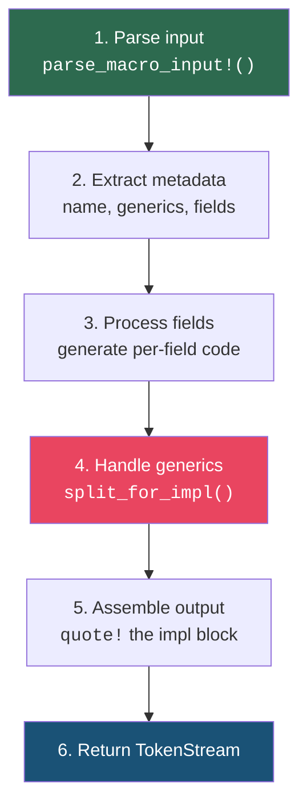

# Chapter 6: Custom Derive Macros 🔴

> **What you'll learn:**
> - How to build a complete `#[derive(MyTrait)]` macro that generates trait implementations
> - How to correctly handle generic type parameters (`<T, U>`) and where clauses
> - How to parse custom helper attributes (like `#[my_attr(skip)]`) inside a derive macro
> - The `split_for_impl` pattern — the single most important function for derive macros

---

## The Anatomy of a Production Derive Macro

Every derive macro follows the same high-level pattern:



Step 4 — handling generics — is where most derive macros go wrong. Let's build up to it methodically.

## A Complete Example: `#[derive(Summary)]`

Let's implement a trait that generates a human-readable summary of any struct:

### The Trait Definition (in the facade crate)

```rust
// my-lib/src/lib.rs
pub use my_lib_derive::Summary;

pub trait Summary {
    fn summary(&self) -> String;
}
```

### The Derive Macro (in the proc-macro crate)

```rust
// my-lib-derive/src/lib.rs
use proc_macro::TokenStream;
use quote::quote;
use syn::{parse_macro_input, DeriveInput, Data, Fields};

#[proc_macro_derive(Summary)]
pub fn summary_derive(input: TokenStream) -> TokenStream {
    let ast = parse_macro_input!(input as DeriveInput);
    impl_summary(&ast)
        .unwrap_or_else(|err| err.to_compile_error())
        .into()
}

fn impl_summary(ast: &DeriveInput) -> syn::Result<proc_macro2::TokenStream> {
    let name = &ast.ident;
    let name_str = name.to_string();
    
    let field_summaries = match &ast.data {
        Data::Struct(data) => match &data.fields {
            Fields::Named(fields) => {
                let parts: Vec<_> = fields.named.iter().map(|f| {
                    let field_name = f.ident.as_ref().unwrap();
                    let field_str = field_name.to_string();
                    quote! {
                        parts.push(format!("{}: {:?}", #field_str, &self.#field_name));
                    }
                }).collect();
                quote! { #(#parts)* }
            }
            Fields::Unnamed(fields) => {
                let parts: Vec<_> = fields.unnamed.iter().enumerate().map(|(i, _)| {
                    let index = syn::Index::from(i);
                    let i_str = i.to_string();
                    quote! {
                        parts.push(format!("{}: {:?}", #i_str, &self.#index));
                    }
                }).collect();
                quote! { #(#parts)* }
            }
            Fields::Unit => quote! {},
        },
        Data::Enum(_) => {
            return Err(syn::Error::new_spanned(
                &ast.ident,
                "Summary can only be derived for structs",
            ));
        }
        Data::Union(_) => {
            return Err(syn::Error::new_spanned(
                &ast.ident,
                "Summary can only be derived for structs",
            ));
        }
    };
    
    // For now, no generics handling — we'll fix this below
    Ok(quote! {
        impl Summary for #name {
            fn summary(&self) -> String {
                let mut parts = Vec::new();
                #field_summaries
                format!("{} {{ {} }}", #name_str, parts.join(", "))
            }
        }
    })
}
```

**What you write:**
```rust
#[derive(Summary)]
struct Sensor {
    id: u32,
    label: String,
    reading: f64,
}
```

**What the compiler expands it to:**
```rust
impl Summary for Sensor {
    fn summary(&self) -> String {
        let mut parts = Vec::new();
        parts.push(format!("{}: {:?}", "id", &self.id));
        parts.push(format!("{}: {:?}", "label", &self.label));
        parts.push(format!("{}: {:?}", "reading", &self.reading));
        format!("{} {{ {} }}", "Sensor", parts.join(", "))
    }
}
```

## The Generics Problem

The macro above works for `Sensor` but breaks immediately for generic types:

```rust
#[derive(Summary)]
struct Pair<T, U> {
    first: T,
    second: U,
}
```

Our naive `impl Summary for #name` expands to `impl Summary for Pair` — missing the generic parameters entirely. We need to generate:

```rust
impl<T: Debug, U: Debug> Summary for Pair<T, U> {
    // ...
}
```

This requires three things:
1. The `impl<T: Debug, U: Debug>` — generic parameter declarations with added bounds
2. The `Pair<T, U>` — the type with its generic arguments
3. A `where` clause (if the original struct has one)

### `split_for_impl`: The Essential Function

`syn::Generics` provides `split_for_impl()` which returns exactly the three pieces you need:

```rust
let (impl_generics, ty_generics, where_clause) = ast.generics.split_for_impl();

// For `struct Pair<T, U> where T: Clone`:
// impl_generics = <T, U>
// ty_generics   = <T, U>
// where_clause  = Some(where T: Clone)
```

You plug them directly into `quote!`:

```rust
quote! {
    impl #impl_generics Summary for #name #ty_generics #where_clause {
        fn summary(&self) -> String {
            todo!()
        }
    }
}
```

### Adding Trait Bounds

Our `Summary` trait uses `{:?}` formatting, which requires `Debug`. We need to add `T: Debug` bounds for every generic parameter. There are two strategies:

**Strategy 1: Add bounds to the where clause (recommended)**

```rust
fn impl_summary(ast: &DeriveInput) -> syn::Result<proc_macro2::TokenStream> {
    let name = &ast.ident;
    let name_str = name.to_string();
    
    // Clone generics so we can modify them
    let mut generics = ast.generics.clone();
    
    // Add `T: Debug` bound for every type parameter
    for param in &mut generics.type_params_mut() {
        param.bounds.push(syn::parse_quote!(::std::fmt::Debug));
    }
    
    let (impl_generics, ty_generics, where_clause) = generics.split_for_impl();
    
    // ... generate field summaries as before ...
    # let field_summaries = quote::quote! {};
    
    Ok(quote! {
        impl #impl_generics Summary for #name #ty_generics #where_clause {
            fn summary(&self) -> String {
                let mut parts = Vec::new();
                #field_summaries
                format!("{} {{ {} }}", #name_str, parts.join(", "))
            }
        }
    })
}
```

**Strategy 2: Add bounds to the where clause explicitly**

```rust
// Alternative approach using where clause
let mut generics = ast.generics.clone();

let where_clause = generics.make_where_clause();
for param in ast.generics.type_params() {
    let ident = &param.ident;
    where_clause
        .predicates
        .push(syn::parse_quote!(#ident: ::std::fmt::Debug));
}
```

### Which Strategy Should You Use?

| Strategy | Pros | Cons |
|----------|------|------|
| Modify type params | Simple, concise | Can conflict with existing bounds |
| Modify where clause | Never conflicts, explicit | More verbose |
| Per-field bounds (Serde style) | Most precise — only bounds on fields that need it | Complex to implement |

The Serde approach (Strategy 3) is the most sophisticated. Instead of bounding every type parameter, it only adds bounds for the types that actually appear in fields:

```rust
// Serde-style: only bound the types that appear in fields
// For `struct Wrapper<T, U> { inner: T }`:
// Only adds `T: Serialize`, NOT `U: Serialize`
```

This matters because `U` might not implement `Serialize` and shouldn't need to — it's not used in any field. Implementing this correctly is beyond our scope here, but the `serde` source code is the canonical reference.

## Custom Helper Attributes

Derive macros can define **helper attributes** that users put on individual fields:

```rust
#[proc_macro_derive(Summary, attributes(summary))]
//                           ^^^^^^^^^^^^^^^^^ helper attribute
pub fn summary_derive(input: TokenStream) -> TokenStream {
    // ...
}
```

Now users can write:

```rust
#[derive(Summary)]
struct User {
    name: String,
    
    #[summary(skip)]          // Skip this field in the summary
    password_hash: String,
    
    #[summary(rename = "e-mail")]  // Use a custom name
    email: String,
}
```

### Parsing Helper Attributes

To process these, check each field's `attrs`:

```rust
fn should_skip(field: &syn::Field) -> bool {
    for attr in &field.attrs {
        // Check if this attribute's path is `summary`
        if attr.path().is_ident("summary") {
            // Parse the attribute arguments
            let nested = attr.parse_args_with(
                syn::punctuated::Punctuated::<syn::Meta, syn::Token![,]>::parse_terminated
            );
            if let Ok(nested) = nested {
                for meta in &nested {
                    if meta.path().is_ident("skip") {
                        return true;
                    }
                }
            }
        }
    }
    false
}

fn get_rename(field: &syn::Field) -> Option<String> {
    for attr in &field.attrs {
        if attr.path().is_ident("summary") {
            let nested = attr.parse_args_with(
                syn::punctuated::Punctuated::<syn::Meta, syn::Token![,]>::parse_terminated
            );
            if let Ok(nested) = nested {
                for meta in &nested {
                    if let syn::Meta::NameValue(nv) = meta {
                        if nv.path.is_ident("rename") {
                            if let syn::Expr::Lit(syn::ExprLit {
                                lit: syn::Lit::Str(lit_str),
                                ..
                            }) = &nv.value
                            {
                                return Some(lit_str.value());
                            }
                        }
                    }
                }
            }
        }
    }
    None
}
```

Then use them when generating per-field code:

```rust
let parts: Vec<_> = fields.named.iter().filter_map(|f| {
    // Skip fields marked with #[summary(skip)]
    if should_skip(f) {
        return None;
    }
    
    let field_name = f.ident.as_ref().unwrap();
    let display_name = get_rename(f)
        .unwrap_or_else(|| field_name.to_string());
    
    Some(quote! {
        parts.push(format!("{}: {:?}", #display_name, &self.#field_name));
    })
}).collect();
```

## Derive for Enums

Many derives need to handle enums too. The pattern uses `match self { ... }` with a generated arm per variant:

```rust
fn impl_summary_for_enum(
    name: &Ident,
    data: &syn::DataEnum,
) -> proc_macro2::TokenStream {
    let match_arms = data.variants.iter().map(|variant| {
        let variant_name = &variant.ident;
        let variant_str = variant_name.to_string();
        
        match &variant.fields {
            Fields::Unit => {
                quote! {
                    Self::#variant_name => #variant_str.to_string()
                }
            }
            Fields::Unnamed(fields) => {
                // Generate pattern: Self::Variant(f0, f1, ...)
                let field_patterns: Vec<_> = (0..fields.unnamed.len())
                    .map(|i| format_ident!("f{}", i))
                    .collect();
                let field_debugs: Vec<_> = field_patterns.iter().map(|fp| {
                    quote! { format!("{:?}", #fp) }
                }).collect();
                
                quote! {
                    Self::#variant_name(#(#field_patterns),*) => {
                        format!("{}({})", #variant_str,
                            vec![#(#field_debugs),*].join(", "))
                    }
                }
            }
            Fields::Named(fields) => {
                let field_names: Vec<_> = fields.named.iter()
                    .map(|f| f.ident.as_ref().unwrap())
                    .collect();
                let field_strs: Vec<_> = field_names.iter()
                    .map(|n| n.to_string())
                    .collect();
                
                quote! {
                    Self::#variant_name { #(#field_names),* } => {
                        let mut parts = Vec::new();
                        #(
                            parts.push(format!("{}: {:?}", #field_strs, #field_names));
                        )*
                        format!("{} {{ {} }}", #variant_str, parts.join(", "))
                    }
                }
            }
        }
    });
    
    quote! {
        match self {
            #(#match_arms),*
        }
    }
}
```

```rust
use quote::format_ident;
use syn::{Fields, Ident};
```

## Common Pitfalls and Fixes

### Pitfall 1: Forgetting `.into()` Conversions

```rust
// ❌ FAILS: quote! returns proc_macro2::TokenStream,
//           but the function returns proc_macro::TokenStream
#[proc_macro_derive(MyTrait)]
pub fn my_derive(input: TokenStream) -> TokenStream {
    let ast = parse_macro_input!(input as DeriveInput);
    quote! { /* ... */ }
    // error: expected `proc_macro::TokenStream`, found `proc_macro2::TokenStream`
}

// ✅ FIX: Add .into()
#[proc_macro_derive(MyTrait)]
pub fn my_derive(input: TokenStream) -> TokenStream {
    let ast = parse_macro_input!(input as DeriveInput);
    quote! { /* ... */ }.into()
}
```

### Pitfall 2: Missing Generic Parameters

```rust
// ❌ FAILS for generic structs:
quote! {
    impl MyTrait for #name {
        // Missing generic params on `impl` and type
    }
}

// ✅ FIX: Always use split_for_impl
let (impl_generics, ty_generics, where_clause) = ast.generics.split_for_impl();
quote! {
    impl #impl_generics MyTrait for #name #ty_generics #where_clause {
        // Correct for all types
    }
}
```

### Pitfall 3: Unqualified Paths in Generated Code

```rust
// ❌ FAILS if the caller doesn't have `use std::fmt::Debug` in scope:
quote! {
    impl Debug for #name { ... }
}

// ✅ FIX: Always use fully-qualified paths:
quote! {
    impl ::std::fmt::Debug for #name { ... }
}
```

### Pitfall 4: Conflicting Impl Methods

```rust
// ❌ FAILS if the user already has an `impl` block for the type:
quote! {
    impl #name {
        pub fn describe() -> &'static str { ... }
    }
}
// error: duplicate definitions with name `describe`

// ✅ FIX: Use a trait to namespace the methods:
quote! {
    impl MyTrait for #name {
        fn describe() -> &'static str { ... }
    }
}
```

---

<details>
<summary><strong>🏋️ Exercise: Build a <code>#[derive(IntoMap)]</code> Macro</strong> (click to expand)</summary>

**Challenge:** Create a derive macro that converts a struct into a `HashMap<String, String>`:

```rust
use std::collections::HashMap;

#[derive(IntoMap)]
struct Config {
    host: String,
    port: u16,
    debug: bool,
}

fn main() {
    let config = Config {
        host: "localhost".into(),
        port: 8080,
        debug: true,
    };
    
    let map: HashMap<String, String> = config.into_map();
    assert_eq!(map["host"], "localhost");
    assert_eq!(map["port"], "8080");
    assert_eq!(map["debug"], "true");
}
```

Requirements:
1. Handle generic structs: `struct Wrapper<T: ToString> { value: T }`
2. Use `ToString` to convert field values
3. Add appropriate trait bounds using `split_for_impl`

<details>
<summary>🔑 Solution</summary>

```rust
use proc_macro::TokenStream;
use quote::quote;
use syn::{parse_macro_input, DeriveInput, Data, Fields};

#[proc_macro_derive(IntoMap)]
pub fn into_map_derive(input: TokenStream) -> TokenStream {
    let ast = parse_macro_input!(input as DeriveInput);
    
    impl_into_map(&ast)
        .unwrap_or_else(|err| err.to_compile_error())
        .into()
}

fn impl_into_map(ast: &DeriveInput) -> syn::Result<proc_macro2::TokenStream> {
    let name = &ast.ident;
    
    // Extract named fields
    let fields = match &ast.data {
        Data::Struct(data) => match &data.fields {
            Fields::Named(fields) => &fields.named,
            _ => return Err(syn::Error::new_spanned(
                &ast.ident,
                "IntoMap only supports structs with named fields",
            )),
        },
        _ => return Err(syn::Error::new_spanned(
            &ast.ident,
            "IntoMap only supports structs",
        )),
    };
    
    // Count fields for HashMap capacity
    let field_count = fields.len();
    
    // Generate insert statements for each field
    let inserts = fields.iter().map(|f| {
        let field_name = f.ident.as_ref().unwrap();
        let field_str = field_name.to_string();
        quote! {
            // Use ToString trait to convert each field to a String
            map.insert(
                ::std::string::String::from(#field_str),
                ::std::string::ToString::to_string(&self.#field_name),
            );
        }
    });
    
    // Handle generics — add ToString bound to all type parameters
    // because any generic field needs to be convertible
    let mut generics = ast.generics.clone();
    for param in generics.type_params_mut() {
        param.bounds.push(syn::parse_quote!(::std::string::ToString));
    }
    let (impl_generics, ty_generics, where_clause) = generics.split_for_impl();
    
    Ok(quote! {
        impl #impl_generics #name #ty_generics #where_clause {
            /// Converts this struct into a HashMap<String, String>,
            /// using ToString for each field's value.
            pub fn into_map(&self) -> ::std::collections::HashMap<
                ::std::string::String,
                ::std::string::String,
            > {
                let mut map = ::std::collections::HashMap::with_capacity(#field_count);
                #(#inserts)*
                map
            }
        }
    })
}
```

**Key design decisions:**
- We add `ToString` bounds to **all** type parameters. A more precise approach would only bound parameters that appear in field types.
- We use fully-qualified paths (`::std::collections::HashMap`, `::std::string::ToString`) to avoid import issues.
- We pre-allocate the `HashMap` with `with_capacity(field_count)` — a small optimization that demonstrates using compile-time information.
- We return `syn::Result` from the helper function and use `unwrap_or_else(|err| err.to_compile_error())` to produce nice error messages instead of panicking.

</details>
</details>

---

> **Key Takeaways:**
> - **`split_for_impl()`** is the most important function in derive macro development — always use it to correctly handle generics
> - Add trait bounds to generic parameters when your generated code requires them (`Debug`, `Clone`, `ToString`, etc.)
> - Use **helper attributes** (`#[proc_macro_derive(Name, attributes(helper))]`) to let users customize per-field behavior
> - Always use **fully-qualified paths** (`::std::fmt::Debug`) in generated code
> - Return `syn::Result` from helper functions and convert errors with `.to_compile_error()` for user-friendly error messages
> - Handle all three struct kinds (named, unnamed, unit) and consider enum support from the start

> **See also:**
> - [Chapter 5: Parsing with `syn` and Generating with `quote!`](ch05-parsing-with-syn-and-generating-with-quote.md) — the building blocks used throughout this chapter
> - [Chapter 7: Attribute and Function-Like Macros](ch07-attribute-and-function-like-macros.md) — the other macro kinds that can *modify* items
> - [Chapter 8: Compile-Time Error Handling and Testing](ch08-compile-time-error-handling-and-testing.md) — producing beautiful span-accurate errors
> - [Rust's Type System & Traits](../type-system-traits-book/src/SUMMARY.md) — understanding the trait system that derive macros generate code for
