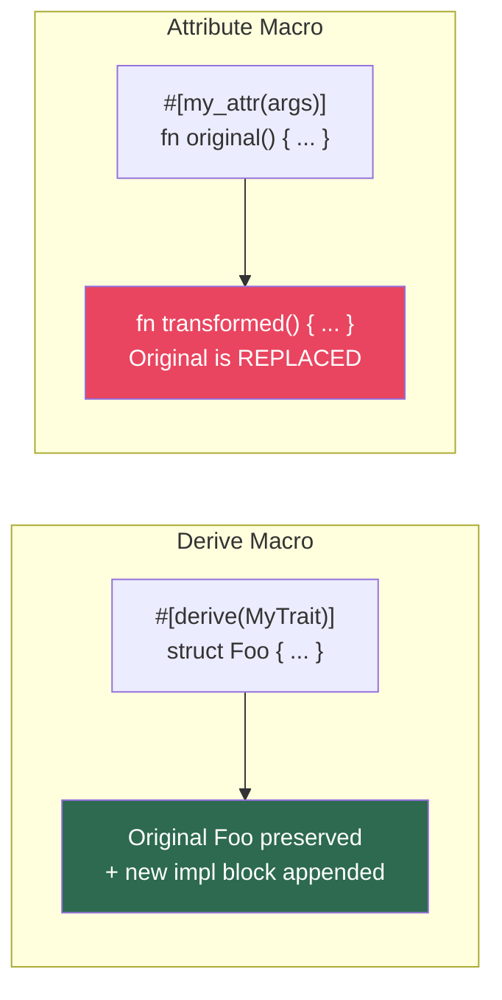
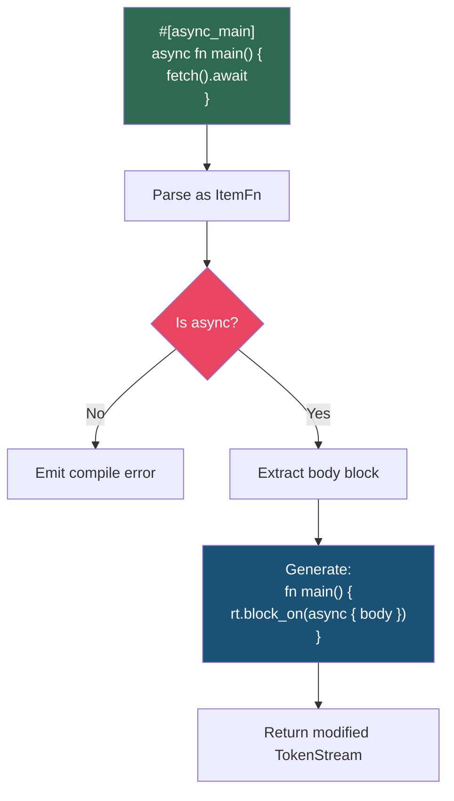

# Chapter 7: Attribute and Function-Like Macros 🔴

> **What you'll learn:**
> - How attribute macros (`#[my_attr]`) differ from derives — they **replace** the annotated item rather than appending to it
> - How function-like macros (`my_macro!(...)`) provide the most flexible invocation syntax
> - A complete dissection of how `#[tokio::main]` works under the hood, connecting to the [Async Rust](../async-book/src/SUMMARY.md) companion guide
> - How to parse custom attribute arguments and modify function signatures

---

## Attribute Macros vs. Derive Macros

The most important difference:

| Aspect | Derive Macro | Attribute Macro |
|--------|-------------|----------------|
| Input | The annotated item | (attribute args, annotated item) — **two** inputs |
| Output | Additional code **appended** | Code that **replaces** the original item |
| Original item | Always preserved | Consumed — must be re-emitted if you want to keep it |
| Can modify the item? | ❌ No | ✅ Yes — you can rewrite it entirely |
| Applies to | `struct`, `enum`, `union` only | Anything: `fn`, `struct`, `mod`, `impl`, expressions... |



## Building an Attribute Macro

The signature has two `TokenStream` parameters:

```rust
use proc_macro::TokenStream;

#[proc_macro_attribute]
pub fn my_attr(attr: TokenStream, item: TokenStream) -> TokenStream {
    // `attr` = the arguments inside the attribute: `args` in #[my_attr(args)]
    // `item` = the annotated item (fn, struct, etc.)
    // Return = the REPLACEMENT for the item
    todo!()
}
```

### Example: `#[log_calls]`

An attribute macro that wraps function bodies with entry/exit logging:

```rust
use proc_macro::TokenStream;
use quote::quote;
use syn::{parse_macro_input, ItemFn};

#[proc_macro_attribute]
pub fn log_calls(_attr: TokenStream, item: TokenStream) -> TokenStream {
    // Parse the annotated item as a function
    let input_fn = parse_macro_input!(item as ItemFn);
    
    let fn_name = &input_fn.sig.ident;
    let fn_name_str = fn_name.to_string();
    let fn_vis = &input_fn.vis;
    let fn_sig = &input_fn.sig;
    let fn_block = &input_fn.block;
    
    let expanded = quote! {
        #fn_vis #fn_sig {
            println!("[ENTER] {}", #fn_name_str);
            let __result = (|| #fn_block)();
            println!("[EXIT]  {}", #fn_name_str);
            __result
        }
    };
    
    expanded.into()
}
```

**What you write:**
```rust
#[log_calls]
fn process_data(input: &str) -> usize {
    input.len()
}
```

**What the compiler expands it to:**
```rust
fn process_data(input: &str) -> usize {
    println!("[ENTER] {}", "process_data");
    let __result = (|| {
        input.len()
    })();
    println!("[EXIT]  {}", "process_data");
    __result
}
```

> ⚠️ **Critical reminder:** The original function is **consumed**. If you return just `quote! {}`, the function disappears entirely. You must re-emit the function (modified or not) in your output.

## Parsing Attribute Arguments

Attributes can carry arguments that configure behavior:

```rust
#[log_calls(level = "debug", prefix = "API")]
fn handle_request() { ... }
```

Parse these using a custom struct implementing `syn::parse::Parse`:

```rust
use syn::parse::{Parse, ParseStream};
use syn::{Ident, LitStr, Token};

struct LogCallsArgs {
    level: Option<String>,
    prefix: Option<String>,
}

impl Parse for LogCallsArgs {
    fn parse(input: ParseStream) -> syn::Result<Self> {
        let mut level = None;
        let mut prefix = None;
        
        while !input.is_empty() {
            let key: Ident = input.parse()?;
            input.parse::<Token![=]>()?;
            let value: LitStr = input.parse()?;
            
            match key.to_string().as_str() {
                "level" => level = Some(value.value()),
                "prefix" => prefix = Some(value.value()),
                other => {
                    return Err(syn::Error::new(
                        key.span(),
                        format!("unknown parameter `{other}`"),
                    ));
                }
            }
            
            // Consume trailing comma if present
            if !input.is_empty() {
                input.parse::<Token![,]>()?;
            }
        }
        
        Ok(LogCallsArgs { level, prefix })
    }
}

#[proc_macro_attribute]
pub fn log_calls(attr: TokenStream, item: TokenStream) -> TokenStream {
    let args = parse_macro_input!(attr as LogCallsArgs);
    let input_fn = parse_macro_input!(item as ItemFn);
    
    let prefix = args.prefix.unwrap_or_default();
    let fn_name_str = format!("{}{}", 
        if prefix.is_empty() { String::new() } else { format!("[{prefix}] ") },
        input_fn.sig.ident
    );
    
    // ... generate based on args ...
    todo!()
}
```

## Deep Dive: How `#[tokio::main]` Works

This is where metaprogramming meets async Rust. If you've used Tokio, you've written:

```rust
#[tokio::main]
async fn main() {
    println!("Hello from async!");
}
```

Let's dissect what this attribute macro actually does.

### The Transformation

`#[tokio::main]` transforms an `async fn main` into a synchronous `fn main` that sets up the Tokio runtime:

**What you write:**
```rust
#[tokio::main]
async fn main() {
    let data = fetch_data().await;
    process(data).await;
}
```

**What the compiler expands it to** (`cargo expand`):
```rust
fn main() {
    // The async body becomes a future that the runtime drives to completion
    tokio::runtime::Builder::new_multi_thread()
        .enable_all()
        .build()
        .expect("Failed building the Runtime")
        .block_on(async {
            let data = fetch_data().await;
            process(data).await;
        })
}
```

### Building Our Own `#[async_main]`

Let's implement a simplified version to understand the mechanics:

```rust
use proc_macro::TokenStream;
use quote::quote;
use syn::{parse_macro_input, ItemFn};

/// A simplified version of #[tokio::main] for educational purposes.
///
/// Transforms:
///   #[async_main]
///   async fn main() { body }
/// Into:
///   fn main() { tokio::runtime::Runtime::new().unwrap().block_on(async { body }) }
#[proc_macro_attribute]
pub fn async_main(_attr: TokenStream, item: TokenStream) -> TokenStream {
    let input_fn = parse_macro_input!(item as ItemFn);
    
    // Validate: must be async
    if input_fn.sig.asyncness.is_none() {
        return syn::Error::new_spanned(
            &input_fn.sig.fn_token,
            "#[async_main] can only be applied to async functions",
        )
        .to_compile_error()
        .into();
    }
    
    // Validate: should be `main` (or at least warn)
    if input_fn.sig.ident != "main" {
        return syn::Error::new_spanned(
            &input_fn.sig.ident,
            "#[async_main] is intended for `main` functions",
        )
        .to_compile_error()
        .into();
    }
    
    // Validate: no arguments
    if !input_fn.sig.inputs.is_empty() {
        return syn::Error::new_spanned(
            &input_fn.sig.inputs,
            "#[async_main] function cannot accept arguments",
        )
        .to_compile_error()
        .into();
    }
    
    let body = &input_fn.block;
    let vis = &input_fn.vis;
    let attrs = &input_fn.attrs;
    
    // The key transformation: remove `async`, wrap body in block_on
    let expanded = quote! {
        #(#attrs)*
        #vis fn main() {
            // Build a multi-threaded runtime (like tokio::main does by default)
            let rt = ::tokio::runtime::Builder::new_multi_thread()
                .enable_all()
                .build()
                .expect("Failed to build Tokio runtime");
            
            // The async block captures the original function body
            rt.block_on(async #body);
        }
    };
    
    expanded.into()
}
```



### What About `#[tokio::main(flavor = "current_thread")]`?

The real `#[tokio::main]` supports configuration via attribute arguments:

```rust
#[tokio::main(flavor = "current_thread", worker_threads = 2)]
async fn main() { ... }
```

This uses the same attribute argument parsing pattern we showed earlier — the `attr` `TokenStream` contains `flavor = "current_thread", worker_threads = 2`, which gets parsed into a configuration struct that determines which runtime builder to use.

## Function-Like Procedural Macros

Function-like macros look like regular macro invocations (`my_macro!(...)`) but are implemented as proc-macros:

```rust
#[proc_macro]
pub fn my_macro(input: TokenStream) -> TokenStream {
    // `input` is everything between the delimiters
    // Return the generated code
    todo!()
}

// Usage:
my_macro!(anything you want here);
```

### When to Use Function-Like vs. Declarative

| Use function-like proc-macro when... | Use `macro_rules!` when... |
|---------------------------------------|---------------------------|
| You need to parse complex, non-Rust syntax | Standard Rust-like syntax suffices |
| You need to compare or generate identifiers | Simple repetition and pattern matching works |
| You need external data (files, env vars) | No external dependencies |
| You need detailed error reporting with spans | Basic error checking is enough |

### Example: `sql!` — A Compile-Time SQL Validator

```rust
use proc_macro::TokenStream;
use quote::quote;
use syn::{parse_macro_input, LitStr};

#[proc_macro]
pub fn sql(input: TokenStream) -> TokenStream {
    // Parse the input as a string literal
    let query = parse_macro_input!(input as LitStr);
    let query_str = query.value();
    
    // Validate the SQL at compile time (simplified)
    if !query_str.trim().to_uppercase().starts_with("SELECT")
        && !query_str.trim().to_uppercase().starts_with("INSERT")
        && !query_str.trim().to_uppercase().starts_with("UPDATE")
        && !query_str.trim().to_uppercase().starts_with("DELETE")
    {
        return syn::Error::new(
            query.span(),
            "SQL query must start with SELECT, INSERT, UPDATE, or DELETE",
        )
        .to_compile_error()
        .into();
    }
    
    // Warn about potential SQL injection if we see string concatenation
    if query_str.contains("\" +") || query_str.contains("+ \"") {
        return syn::Error::new(
            query.span(),
            "Potential SQL injection: use parameterized queries instead of string concatenation",
        )
        .to_compile_error()
        .into();
    }
    
    // Return the validated query as a &'static str
    quote! {
        #query_str
    }
    .into()
}
```

**Usage:**
```rust
// ✅ Compiles
let q = sql!("SELECT * FROM users WHERE id = $1");

// ❌ Compile error: "SQL query must start with SELECT, INSERT, UPDATE, or DELETE"
// let q = sql!("DROP TABLE users");
```

### Example: `routes!` — A DSL for HTTP Routing

Function-like macros shine when you want a **domain-specific language** (DSL):

```rust
use proc_macro::TokenStream;
use quote::{quote, format_ident};
use syn::parse::{Parse, ParseStream};
use syn::{Ident, LitStr, Token, Result};

struct Route {
    method: Ident,      // GET, POST, etc.
    path: LitStr,       // "/api/users"
    handler: Ident,     // handler_function_name
}

struct Routes {
    routes: Vec<Route>,
}

impl Parse for Route {
    fn parse(input: ParseStream) -> Result<Self> {
        let method: Ident = input.parse()?;
        let path: LitStr = input.parse()?;
        input.parse::<Token![=>]>()?;
        let handler: Ident = input.parse()?;
        Ok(Route { method, path, handler })
    }
}

impl Parse for Routes {
    fn parse(input: ParseStream) -> Result<Self> {
        let mut routes = Vec::new();
        while !input.is_empty() {
            routes.push(input.parse()?);
            if !input.is_empty() {
                input.parse::<Token![,]>()?;
            }
        }
        Ok(Routes { routes })
    }
}

#[proc_macro]
pub fn routes(input: TokenStream) -> TokenStream {
    let parsed = syn::parse_macro_input!(input as Routes);
    
    let route_registrations = parsed.routes.iter().map(|route| {
        let method = format_ident!("{}", route.method.to_string().to_lowercase());
        let path = &route.path;
        let handler = &route.handler;
        quote! {
            router.#method(#path, #handler)
        }
    });
    
    quote! {
        {
            let mut router = Router::new();
            #(let router = #route_registrations;)*
            router
        }
    }
    .into()
}
```

**Usage:**
```rust
let app = routes! {
    GET  "/api/users"     => list_users,
    POST "/api/users"     => create_user,
    GET  "/api/users/:id" => get_user,
};
```

## Attribute Macros on Non-Function Items

Attribute macros aren't limited to functions — they can annotate anything:

```rust
/// An attribute macro that adds Debug, Clone, and Serialize derives
/// to any struct or enum automatically.
#[proc_macro_attribute]
pub fn model(_attr: TokenStream, item: TokenStream) -> TokenStream {
    let mut input = parse_macro_input!(item as DeriveInput);
    
    // We can modify the item's attributes before re-emitting it
    // Add #[derive(Debug, Clone, serde::Serialize, serde::Deserialize)]
    let expanded = quote! {
        #[derive(Debug, Clone, ::serde::Serialize, ::serde::Deserialize)]
        #input
    };
    
    expanded.into()
}

// Usage:
#[model]
pub struct User {
    name: String,
    age: u32,
}
// Expands with all four derives added automatically
```

---

<details>
<summary><strong>🏋️ Exercise: Build a <code>#[timed]</code> Attribute Macro</strong> (click to expand)</summary>

**Challenge:** Create an attribute macro `#[timed]` that:

1. Works on both sync and async functions
2. Measures the execution time and prints it
3. Preserves the original function signature (return type, visibility, etc.)
4. For async functions, the timer should include the `.await` time

```rust
#[timed]
fn fibonacci(n: u32) -> u32 {
    if n <= 1 { return n; }
    fibonacci(n - 1) + fibonacci(n - 2)
}

#[timed]
async fn fetch_data(url: &str) -> Result<String, reqwest::Error> {
    reqwest::get(url).await?.text().await
}

fn main() {
    let result = fibonacci(30);
    // Prints: "fibonacci completed in 12.34ms"
}
```

<details>
<summary>🔑 Solution</summary>

```rust
use proc_macro::TokenStream;
use quote::quote;
use syn::{parse_macro_input, ItemFn};

#[proc_macro_attribute]
pub fn timed(_attr: TokenStream, item: TokenStream) -> TokenStream {
    let input_fn = parse_macro_input!(item as ItemFn);
    
    let fn_vis = &input_fn.vis;
    let fn_name = &input_fn.sig.ident;
    let fn_name_str = fn_name.to_string();
    let fn_generics = &input_fn.sig.generics;
    let fn_inputs = &input_fn.sig.inputs;
    let fn_output = &input_fn.sig.output;
    let fn_body = &input_fn.block;
    let fn_attrs = &input_fn.attrs;
    let fn_where = &input_fn.sig.generics.where_clause;
    
    let expanded = if input_fn.sig.asyncness.is_some() {
        // ASYNC version: wrap the async block
        quote! {
            #(#fn_attrs)*
            #fn_vis async fn #fn_name #fn_generics (#fn_inputs) #fn_output
            #fn_where
            {
                let __start = ::std::time::Instant::now();
                // The original body is async, so it can contain .await
                let __result = async #fn_body .await;
                let __elapsed = __start.elapsed();
                ::std::eprintln!(
                    "{} completed in {:.2?}",
                    #fn_name_str,
                    __elapsed,
                );
                __result
            }
        }
    } else {
        // SYNC version: wrap in a closure
        quote! {
            #(#fn_attrs)*
            #fn_vis fn #fn_name #fn_generics (#fn_inputs) #fn_output
            #fn_where
            {
                let __start = ::std::time::Instant::now();
                let __result = (|| #fn_body)();
                let __elapsed = __start.elapsed();
                ::std::eprintln!(
                    "{} completed in {:.2?}",
                    #fn_name_str,
                    __elapsed,
                );
                __result
            }
        }
    };
    
    expanded.into()
}
```

**Key design decisions:**
- We check `input_fn.sig.asyncness` to determine if the function is async
- For async functions, we wrap the body in `async { body }.await` — this preserves the ability to use `.await` inside
- For sync functions, we use a closure `(|| body)()` to capture the body as a single expression
- We use `__` prefixed variable names to minimize (though not eliminate — remember, proc macros don't have full hygiene) collision risk
- We use `::std::time::Instant` with full path qualification
- We print to `stderr` via `eprintln!` so it doesn't interfere with stdout

**Note on hygiene:** Since procedural macros don't have automatic hygiene like `macro_rules!`, our `__start`, `__result`, and `__elapsed` variables *can* potentially conflict with user code. For production use, you'd use `Span::mixed_site()` or generate unique identifiers with `format_ident!("__timed_start_{}", ...)`.

</details>
</details>

---

> **Key Takeaways:**
> - Attribute macros **replace** the annotated item — you must re-emit it if you want it to survive
> - They receive **two** `TokenStream` inputs: the attribute arguments and the annotated item
> - Function-like proc macros provide maximum flexibility for **DSLs** and custom syntax
> - `#[tokio::main]` is a real-world attribute macro that transforms `async fn main()` into a sync function wrapping `runtime.block_on()`
> - Always validate your inputs (is it async? is it `main`?) and emit clear `syn::Error` messages
> - Use the `Parse` trait to define grammars for custom attribute arguments and DSL syntax

> **See also:**
> - [Chapter 6: Custom Derive Macros](ch06-custom-derive-macros.md) — derive macros that append code without modifying the original item
> - [Chapter 8: Compile-Time Error Handling and Testing](ch08-compile-time-error-handling-and-testing.md) — making your attribute macros produce beautiful error messages
> - [Async Rust: Executors and Runtimes](../async-book/src/ch07-executors-and-runtimes.md) — how the runtime that `#[tokio::main]` creates actually works
> - [Chapter 9: Capstone](ch09-capstone-builder-and-instrument-async.md) — building `#[instrument_async]`, a production attribute macro
