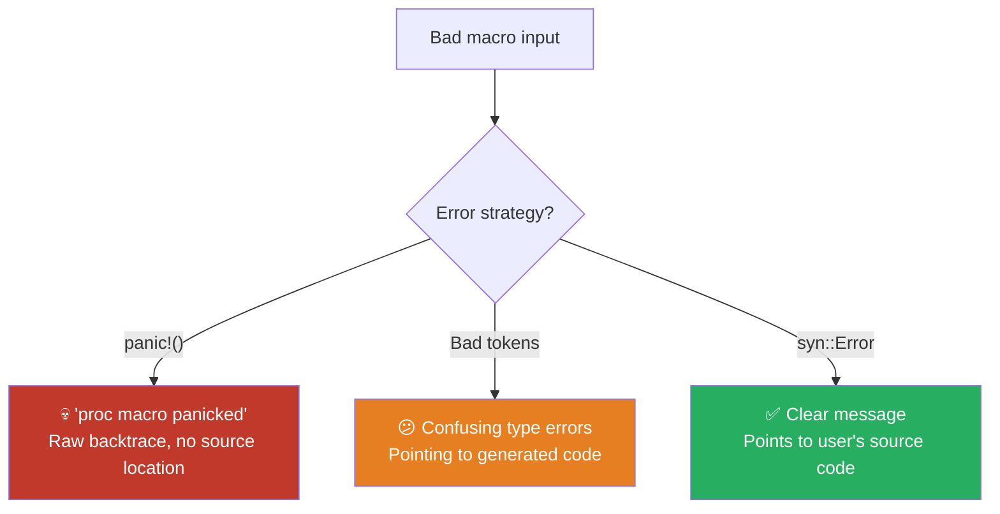

# Chapter 8: Compile-Time Error Handling and Testing 🔴

> **What you'll learn:**
> - How to emit **span-accurate** compiler errors using `syn::Error` that point to the exact token causing the problem
> - The difference between `panic!` in a proc-macro (terrible UX) and proper error propagation (great UX)
> - How to use `cargo-expand` for debugging macro output during development
> - How to use `trybuild` for regression-testing macro error messages in CI

---

## Why Error Quality Matters

A procedural macro runs at compile time. When it encounters bad input, it has three choices:

1. **`panic!`** — The macro crashes. The user sees `proc macro panicked` and a raw backtrace. Terrible UX.
2. **Return garbage tokens** — The compiler tries to parse the output, fails, and produces confusing errors that point to *generated* code the user never wrote. Worse.
3. **Emit targeted `syn::Error` messages** — The compiler shows a clear error message pointing to the exact token in the user's source that caused the problem. This is what production macros must do.



## `syn::Error`: The Right Way

`syn::Error` carries:
- A **message**: what went wrong
- A **span**: where in the source code to point the error

```rust
use syn::Error;
use proc_macro2::Span;

// Error pointing to a specific token
let err = Error::new(some_ident.span(), "expected a type, not an expression");

// Error pointing to the entire item being derived
let err = Error::new_spanned(&ast.ident, "MyDerive only works on structs");

// Convert to a TokenStream that the compiler will interpret as an error
let compile_error: proc_macro2::TokenStream = err.to_compile_error();
// This produces: compile_error!("expected a type, not an expression");
// with the span set to point to the correct source location.
```

### The `to_compile_error()` Pattern

The standard pattern in production macros:

```rust
#[proc_macro_derive(MyTrait)]
pub fn my_derive(input: proc_macro::TokenStream) -> proc_macro::TokenStream {
    let ast = parse_macro_input!(input as DeriveInput);
    
    // Delegate to a helper that returns syn::Result
    impl_my_trait(&ast)
        .unwrap_or_else(|err| err.to_compile_error())
        .into()
}

// Helper returns syn::Result<TokenStream2> so we can use `?`
fn impl_my_trait(ast: &DeriveInput) -> syn::Result<proc_macro2::TokenStream> {
    // Use `?` freely — errors propagate with their spans
    let fields = match &ast.data {
        Data::Struct(data) => match &data.fields {
            Fields::Named(fields) => &fields.named,
            other => {
                return Err(Error::new_spanned(
                    other,
                    "MyTrait can only be derived for structs with named fields",
                ));
            }
        },
        other => {
            return Err(Error::new_spanned(
                &ast.ident,
                "MyTrait can only be derived for structs, not enums or unions",
            ));
        }
    };
    
    // Validate individual fields
    for field in fields {
        if field.ident.as_ref().unwrap().to_string().starts_with('_') {
            return Err(Error::new_spanned(
                field.ident.as_ref().unwrap(),
                "MyTrait does not support fields starting with underscore",
            ));
        }
    }
    
    // Generate code...
    Ok(quote::quote! { /* ... */ })
}
```

### Accumulating Multiple Errors

Sometimes you want to report **all** errors, not just the first one. Use `syn::Error::combine`:

```rust
fn validate_fields(fields: &syn::FieldsNamed) -> syn::Result<()> {
    let mut errors: Option<syn::Error> = None;
    
    for field in &fields.named {
        let name = field.ident.as_ref().unwrap();
        
        // Check: no fields starting with underscore
        if name.to_string().starts_with('_') {
            let err = syn::Error::new_spanned(
                name,
                format!("field `{name}` cannot start with underscore"),
            );
            match &mut errors {
                Some(existing) => existing.combine(err),
                None => errors = Some(err),
            }
        }
        
        // Check: no fields named "reserved"
        if name == "reserved" {
            let err = syn::Error::new_spanned(
                name,
                "`reserved` is not allowed as a field name",
            );
            match &mut errors {
                Some(existing) => existing.combine(err),
                None => errors = Some(err),
            }
        }
    }
    
    match errors {
        Some(err) => Err(err),
        None => Ok(()),
    }
}
```

When multiple errors are combined, `to_compile_error()` emits multiple `compile_error!` invocations, and the compiler displays **all of them** at once:

```
error: field `_internal` cannot start with underscore
  --> src/main.rs:4:5
   |
4  |     _internal: String,
   |     ^^^^^^^^^

error: `reserved` is not allowed as a field name
  --> src/main.rs:5:5
   |
5  |     reserved: u32,
   |     ^^^^^^^^
```

## Comparing Error Approaches

```rust
// ❌ BAD: panic! — user sees raw backtrace
#[proc_macro_derive(MyTrait)]
pub fn bad_derive(input: TokenStream) -> TokenStream {
    let ast = parse_macro_input!(input as DeriveInput);
    if let Data::Enum(_) = &ast.data {
        panic!("MyTrait doesn't work on enums!");
        // User sees:
        // error: proc macro panicked
        //   --> src/main.rs:1:10
        //   |
        // 1 | #[derive(MyTrait)]
        //   |          ^^^^^^^
        //   = help: message: MyTrait doesn't work on enums!
    }
    todo!()
}

// ❌ BAD: compile_error! without proper span
#[proc_macro_derive(MyTrait)]
pub fn mediocre_derive(input: TokenStream) -> TokenStream {
    let ast = parse_macro_input!(input as DeriveInput);
    if let Data::Enum(_) = &ast.data {
        return quote::quote! {
            compile_error!("MyTrait doesn't work on enums");
        }.into();
        // Error points to the derive attribute, not the enum keyword
    }
    todo!()
}

// ✅ GOOD: syn::Error with precise span
#[proc_macro_derive(MyTrait)]
pub fn good_derive(input: TokenStream) -> TokenStream {
    let ast = parse_macro_input!(input as DeriveInput);
    impl_my_trait(&ast)
        .unwrap_or_else(|e| e.to_compile_error())
        .into()
}

fn impl_my_trait(ast: &DeriveInput) -> syn::Result<proc_macro2::TokenStream> {
    if let Data::Enum(data) = &ast.data {
        return Err(syn::Error::new_spanned(
            data.enum_token,  // Points to the `enum` keyword itself!
            "MyTrait can only be derived for structs",
        ));
        // Error points to EXACTLY the `enum` keyword in the user's code
    }
    Ok(quote::quote! { /* ... */ })
}
```

## Debugging with `cargo-expand`

`cargo-expand` is the most important tool for macro development. It shows you exactly what your macro produces:

### Installation

```bash
cargo install cargo-expand
# Requires nightly Rust:
rustup install nightly
```

### Usage

```bash
# Expand all macros in the crate
cargo +nightly expand

# Expand macros in a specific file/module
cargo +nightly expand --lib

# Expand a specific item
cargo +nightly expand main

# Expand with syntax highlighting using prettyplease
cargo +nightly expand --theme=GitHub
```

### Example Workflow

When your derive macro produces a confusing type error, run `cargo expand` to see the generated code:

```bash
$ cargo +nightly expand

// ... lots of output ...

impl Summary for Config {
    fn summary(&self) -> String {
        let mut parts = Vec::new();
        // Oops! This is what the macro generated. The bug is obvious now:
        parts.push(format!("{}: {:?}", "port", &self.port));
        //                   ^^^^^^^^^^^^^ We used {:?} but port is u16,
        //                                 which doesn't implement Debug
        //                                 if the user forgot #[derive(Debug)]
        format!("{} {{ {} }}", "Config", parts.join(", "))
    }
}
```

### IDE Integration

Most IDEs with Rust Analyzer support inline macro expansion:

- **VS Code**: Hover over a macro invocation and choose "Expand Macro"
- **IntelliJ Rust**: Ctrl+Click on a macro invocation to see expansion
- **Neovim (rust-analyzer)**: `:RustLsp expandMacro`

## Testing with `trybuild`

`trybuild` is a testing framework designed specifically for proc-macros. It compiles test cases and compares the compiler output against expected `.stderr` snapshots.

### Setup

```toml
# In your proc-macro crate's Cargo.toml
[dev-dependencies]
trybuild = "1"
```

### Test Structure

```
my-derive/
├── tests/
│   ├── compile_tests.rs       # The test runner
│   └── ui/
│       ├── happy_path.rs      # Should compile successfully
│       ├── wrong_type.rs      # Should produce a specific error
│       └── wrong_type.stderr  # Expected error output
```

### The Test Runner

```rust
// tests/compile_tests.rs
#[test]
fn compile_tests() {
    let t = trybuild::TestCases::new();
    
    // These should compile successfully
    t.pass("tests/ui/happy_path.rs");
    t.pass("tests/ui/with_generics.rs");
    
    // These should fail with specific error messages
    t.compile_fail("tests/ui/wrong_type.rs");
    t.compile_fail("tests/ui/missing_field.rs");
    t.compile_fail("tests/ui/enum_not_supported.rs");
}
```

### Test Case: Happy Path

```rust
// tests/ui/happy_path.rs
use my_derive::MyTrait;

#[derive(MyTrait)]
struct Config {
    host: String,
    port: u16,
}

fn main() {
    let c = Config { host: "localhost".into(), port: 8080 };
    // Just verify it compiles and the generated method exists
    let _ = c.summary();
}
```

### Test Case: Expected Failure

```rust
// tests/ui/enum_not_supported.rs
use my_derive::MyTrait;

#[derive(MyTrait)]
enum Color {
    Red,
    Blue,
}

fn main() {}
```

### Generating Expected `.stderr` Files

The first time you run `trybuild`, it will fail for `compile_fail` tests because the `.stderr` files don't exist yet. Set the environment variable to auto-generate them:

```bash
TRYBUILD=overwrite cargo test
```

This creates `.stderr` files like:

```
// tests/ui/enum_not_supported.stderr
error: MyTrait can only be derived for structs
 --> tests/ui/enum_not_supported.rs:4:6
  |
4 | enum Color {
  |      ^^^^^
```

On subsequent test runs, `trybuild` checks that the actual compiler output matches the snapshot. If you change your error messages, re-run with `TRYBUILD=overwrite` to update.

### CI Integration

Add to your CI pipeline:

```yaml
# .github/workflows/test.yml
- name: Test proc-macro error messages
  run: cargo test -p my-derive
```

## Best Practices Summary

| Practice | Why |
|----------|-----|
| Always return `syn::Result` from helper functions | Enables `?` operator for clean error propagation |
| Use `new_spanned()` over `new()` when possible | Points errors to the specific token in user code |
| Accumulate errors with `Error::combine()` | Report all problems at once, not one at a time |
| Never `panic!` in a proc-macro | Panic shows a backtrace, not a helpful message |
| Use `cargo-expand` during development | See exactly what your macro generates |
| Use `trybuild` in CI | Prevent error message regressions |
| Test the happy path *and* error paths | Both can break |

---

<details>
<summary><strong>🏋️ Exercise: Add Validation and Tests to a Derive Macro</strong> (click to expand)</summary>

**Challenge:** Take the `Summary` derive macro from Chapter 6 and:

1. Add validation that rejects enums and unions with helpful, span-accurate errors
2. Add a `#[summary(skip)]` attribute that skips a field, and an error if `#[summary(unknown)]` is used
3. Write `trybuild` tests for:
   - Happy path: struct with named fields
   - Error: applied to an enum
   - Error: unknown helper attribute argument

<details>
<summary>🔑 Solution</summary>

**The improved macro with validation:**

```rust
use proc_macro::TokenStream;
use quote::quote;
use syn::{parse_macro_input, DeriveInput, Data, Fields, Error};

#[proc_macro_derive(Summary, attributes(summary))]
pub fn summary_derive(input: TokenStream) -> TokenStream {
    let ast = parse_macro_input!(input as DeriveInput);
    impl_summary(&ast)
        .unwrap_or_else(|err| err.to_compile_error())
        .into()
}

fn impl_summary(ast: &DeriveInput) -> syn::Result<proc_macro2::TokenStream> {
    let name = &ast.ident;
    let name_str = name.to_string();
    
    // Validate: only structs
    let fields = match &ast.data {
        Data::Struct(data) => match &data.fields {
            Fields::Named(fields) => &fields.named,
            Fields::Unnamed(_) => {
                return Err(Error::new_spanned(
                    name,
                    "Summary requires named fields; tuple structs are not supported",
                ));
            }
            Fields::Unit => {
                return Err(Error::new_spanned(
                    name,
                    "Summary requires fields; unit structs have nothing to summarize",
                ));
            }
        },
        Data::Enum(data) => {
            return Err(Error::new_spanned(
                data.enum_token,
                "Summary can only be derived for structs, not enums.\n\
                 Hint: Consider implementing Summary manually for enums.",
            ));
        }
        Data::Union(data) => {
            return Err(Error::new_spanned(
                data.union_token,
                "Summary cannot be derived for unions",
            ));
        }
    };
    
    // Process fields, respecting #[summary(skip)] and validating attributes
    let mut errors: Option<Error> = None;
    let mut field_parts = Vec::new();
    
    for field in fields {
        let field_name = field.ident.as_ref().unwrap();
        let field_str = field_name.to_string();
        let mut skip = false;
        
        // Check for #[summary(...)] attributes
        for attr in &field.attrs {
            if attr.path().is_ident("summary") {
                let nested = attr.parse_args_with(
                    syn::punctuated::Punctuated::<syn::Meta, syn::Token![,]>::parse_terminated
                )?;
                
                for meta in &nested {
                    if meta.path().is_ident("skip") {
                        skip = true;
                    } else {
                        // Unknown attribute — accumulate error
                        let err = Error::new_spanned(
                            meta,
                            format!(
                                "unknown summary attribute `{}`; expected `skip`",
                                meta.path().get_ident()
                                    .map(|i| i.to_string())
                                    .unwrap_or_else(|| "?".into())
                            ),
                        );
                        match &mut errors {
                            Some(existing) => existing.combine(err),
                            None => errors = Some(err),
                        }
                    }
                }
            }
        }
        
        if !skip {
            field_parts.push(quote! {
                parts.push(format!("{}: {:?}", #field_str, &self.#field_name));
            });
        }
    }
    
    // Return accumulated errors if any
    if let Some(err) = errors {
        return Err(err);
    }
    
    // Handle generics
    let mut generics = ast.generics.clone();
    for param in generics.type_params_mut() {
        param.bounds.push(syn::parse_quote!(::std::fmt::Debug));
    }
    let (impl_generics, ty_generics, where_clause) = generics.split_for_impl();
    
    Ok(quote! {
        impl #impl_generics Summary for #name #ty_generics #where_clause {
            fn summary(&self) -> ::std::string::String {
                let mut parts = ::std::vec::Vec::new();
                #(#field_parts)*
                format!("{} {{ {} }}", #name_str, parts.join(", "))
            }
        }
    })
}
```

**Test file: `tests/compile_tests.rs`:**
```rust
#[test]
fn compile_tests() {
    let t = trybuild::TestCases::new();
    t.pass("tests/ui/happy_struct.rs");
    t.compile_fail("tests/ui/enum_rejected.rs");
    t.compile_fail("tests/ui/unknown_attr.rs");
}
```

**Test file: `tests/ui/happy_struct.rs`:**
```rust
use my_lib::Summary;

pub trait Summary {
    fn summary(&self) -> String;
}

#[derive(Summary)]
struct Config {
    host: String,
    port: u16,
    #[summary(skip)]
    secret: String,
}

fn main() {}
```

**Test file: `tests/ui/enum_rejected.rs`:**
```rust
use my_lib::Summary;

#[derive(Summary)]
enum Color {
    Red,
    Blue,
}

fn main() {}
```

**Expected: `tests/ui/enum_rejected.stderr`:**
```
error: Summary can only be derived for structs, not enums.
       Hint: Consider implementing Summary manually for enums.
 --> tests/ui/enum_rejected.rs:4:1
  |
4 | enum Color {
  | ^^^^
```

**Test file: `tests/ui/unknown_attr.rs`:**
```rust
use my_lib::Summary;

#[derive(Summary)]
struct Foo {
    #[summary(unknown_option)]
    name: String,
}

fn main() {}
```

**Expected: `tests/ui/unknown_attr.stderr`:**
```
error: unknown summary attribute `unknown_option`; expected `skip`
 --> tests/ui/unknown_attr.rs:5:15
  |
5 |     #[summary(unknown_option)]
  |               ^^^^^^^^^^^^^^
```

</details>
</details>

---

> **Key Takeaways:**
> - **Never `panic!`** in a proc-macro — always use `syn::Error` with `to_compile_error()` for user-friendly diagnostics
> - `syn::Error::new_spanned()` creates errors that point to the **exact token** in the user's source code
> - Use `Error::combine()` to **accumulate and report all errors** at once instead of stopping at the first one
> - `cargo-expand` (on nightly) is essential for **debugging** — it shows exactly what tokens your macro produces
> - `trybuild` provides **snapshot testing** for macro error messages, catching regressions in CI
> - Structure your macro as `pub fn entry(input) -> TokenStream` + `fn helper(ast) -> syn::Result<TokenStream2>` for clean error propagation

> **See also:**
> - [Chapter 6: Custom Derive Macros](ch06-custom-derive-macros.md) — the derives that need this error handling
> - [Chapter 7: Attribute and Function-Like Macros](ch07-attribute-and-function-like-macros.md) — attribute macros with validation
> - [Chapter 9: Capstone](ch09-capstone-builder-and-instrument-async.md) — applies all these practices in a production-grade project
> - [Rust Engineering Practices](../engineering-book/src/SUMMARY.md) — CI/CD pipeline configuration for macro crates
