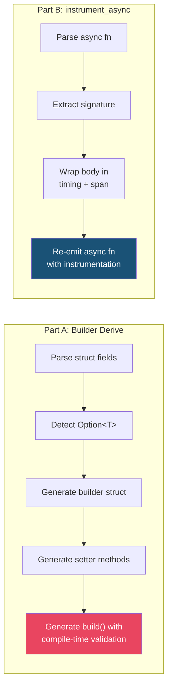

# Chapter 9: Capstone: `#[derive(Builder)]` and `#[instrument_async]` 🔴

> **What you'll learn:**
> - How to build a production-quality **Builder derive macro** that handles `Option<T>`, generates a fluent API, and emits custom compile-time errors for missing required fields
> - How to build an **`#[instrument_async]` attribute macro** that wraps any async function in an execution timer and logging span
> - How to combine every technique from Chapters 1–8 into complete, tested, real-world macros
> - The design trade-offs that distinguish a hobby macro from a production-grade one

---

## Overview

This capstone has two parts, each representing a different macro paradigm:

| Part | Macro Kind | Key Techniques |
|------|-----------|----------------|
| **Part A:** `#[derive(Builder)]` | Derive macro | Generic handling, `Option<T>` detection, fluent API generation, `format_ident!`, compile-time required-field validation |
| **Part B:** `#[instrument_async]` | Attribute macro | AST rewriting, async function transformation, lifetime preservation, injecting instrumentation logic |



---

# Part A: `#[derive(Builder)]`

## Design Goals

We want users to write:

```rust
#[derive(Builder)]
struct Command {
    executable: String,
    args: Vec<String>,
    env: Option<Vec<String>>,   // Optional — defaults to None
    current_dir: Option<String>, // Optional — defaults to None
}
```

And get a fluent builder API:

```rust
fn main() {
    let cmd = Command::builder()
        .executable("rustc".into())
        .args(vec!["--edition".into(), "2021".into()])
        .env(vec!["PATH=/usr/bin".into()])
        // current_dir not set — it's Option, so it defaults to None
        .build()
        .unwrap();
    
    assert_eq!(cmd.executable, "rustc");
    assert_eq!(cmd.current_dir, None);
}
```

With compile-time-quality errors:

```rust
let cmd = Command::builder()
    // Forgot .executable()!
    .args(vec![])
    .build();
// Error: "missing required field `executable`"
```

## Step 1: The Generated Builder Struct

For each field `name: Type`, the builder stores `Option<Type>`. For fields that are already `Option<T>`, the builder stores `Option<T>` (not `Option<Option<T>>`).

```rust
// Generated from #[derive(Builder)] on Command:
struct CommandBuilder {
    executable: Option<String>,
    args: Option<Vec<String>>,
    env: Option<Vec<String>>,       // Not Option<Option<...>> — we detect this
    current_dir: Option<String>,    // Same — already Optional
}
```

## Step 2: Detecting `Option<T>`

This is the trickiest part. We need to inspect the `syn::Type` and determine if it's `Option<T>`, then extract the inner `T`:

```rust
use syn::{Type, PathArguments, GenericArgument};

/// If the type is `Option<T>`, return `Some(T)`. Otherwise return `None`.
fn extract_option_inner(ty: &Type) -> Option<&Type> {
    // We're looking for a path type like `Option<T>` or `std::option::Option<T>`
    let Type::Path(type_path) = ty else {
        return None;
    };
    
    // Get the last segment of the path (handles both `Option` and `std::option::Option`)
    let segment = type_path.path.segments.last()?;
    
    // Check if the segment name is "Option"
    if segment.ident != "Option" {
        return None;
    }
    
    // Extract the angle-bracket arguments: <T>
    let PathArguments::AngleBracketed(args) = &segment.arguments else {
        return None;
    };
    
    // There should be exactly one generic argument
    if args.args.len() != 1 {
        return None;
    }
    
    // It should be a type argument (not a lifetime or const)
    let GenericArgument::Type(inner) = args.args.first()? else {
        return None;
    };
    
    Some(inner)
}
```

> ⚠️ **Limitation:** This checks for the literal name `Option` in the path. It won't recognize aliased imports like `use std::option::Option as Opt;`. This is a known trade-off that even Serde accepts — supporting every possible alias is impractical at the token level since macros run before type resolution.

## Step 3: The Complete Derive Macro

```rust
use proc_macro::TokenStream;
use quote::{quote, format_ident};
use syn::{
    parse_macro_input, DeriveInput, Data, Fields, Error, Type,
    PathArguments, GenericArgument,
};

#[proc_macro_derive(Builder)]
pub fn builder_derive(input: TokenStream) -> TokenStream {
    let ast = parse_macro_input!(input as DeriveInput);
    impl_builder(&ast)
        .unwrap_or_else(|err| err.to_compile_error())
        .into()
}

fn extract_option_inner(ty: &Type) -> Option<&Type> {
    let Type::Path(type_path) = ty else { return None };
    let segment = type_path.path.segments.last()?;
    if segment.ident != "Option" { return None }
    let PathArguments::AngleBracketed(args) = &segment.arguments else { return None };
    if args.args.len() != 1 { return None }
    let GenericArgument::Type(inner) = args.args.first()? else { return None };
    Some(inner)
}

fn impl_builder(ast: &DeriveInput) -> syn::Result<proc_macro2::TokenStream> {
    let name = &ast.ident;
    let builder_name = format_ident!("{}Builder", name);
    
    // Only support named structs
    let fields = match &ast.data {
        Data::Struct(data) => match &data.fields {
            Fields::Named(fields) => &fields.named,
            _ => return Err(Error::new_spanned(
                name, "Builder only supports structs with named fields",
            )),
        },
        _ => return Err(Error::new_spanned(
            name, "Builder can only be derived for structs",
        )),
    };
    
    // Classify each field as required or optional
    struct FieldInfo<'a> {
        name: &'a syn::Ident,
        ty: &'a Type,
        is_option: bool,
        inner_ty: Option<&'a Type>,
    }
    
    let field_infos: Vec<_> = fields.iter().map(|f| {
        let name = f.ident.as_ref().unwrap();
        let ty = &f.ty;
        let inner = extract_option_inner(ty);
        FieldInfo {
            name,
            ty,
            is_option: inner.is_some(),
            inner_ty: inner,
        }
    }).collect();
    
    // --- Generate builder struct fields ---
    // All fields are Option<T> in the builder.
    // For original Option<T> fields, we store Option<T> (not Option<Option<T>>).
    let builder_fields = field_infos.iter().map(|fi| {
        let name = fi.name;
        if fi.is_option {
            let ty = fi.ty; // Already Option<T>
            quote! { #name: #ty }
        } else {
            let ty = fi.ty;
            quote! { #name: ::std::option::Option<#ty> }
        }
    });
    
    // --- Generate builder struct initialization (all None) ---
    let builder_inits = field_infos.iter().map(|fi| {
        let name = fi.name;
        quote! { #name: ::std::option::Option::None }
    });
    
    // --- Generate setter methods ---
    let setters = field_infos.iter().map(|fi| {
        let name = fi.name;
        if fi.is_option {
            // For Option<T> fields, the setter takes T (not Option<T>)
            let inner = fi.inner_ty.unwrap();
            quote! {
                pub fn #name(mut self, value: #inner) -> Self {
                    self.#name = ::std::option::Option::Some(value);
                    self
                }
            }
        } else {
            let ty = fi.ty;
            quote! {
                pub fn #name(mut self, value: #ty) -> Self {
                    self.#name = ::std::option::Option::Some(value);
                    self
                }
            }
        }
    });
    
    // --- Generate build() body ---
    // Required fields (non-Option): return error if None
    // Optional fields: default to None
    let build_fields = field_infos.iter().map(|fi| {
        let name = fi.name;
        let name_str = name.to_string();
        if fi.is_option {
            // Optional: just move the value (it's already Option<T>)
            quote! {
                #name: self.#name
            }
        } else {
            // Required: unwrap or return error
            quote! {
                #name: self.#name.ok_or_else(|| {
                    ::std::string::String::from(
                        concat!("missing required field `", #name_str, "`")
                    )
                })?
            }
        }
    });
    
    // --- Assemble everything ---
    Ok(quote! {
        /// Auto-generated builder for [`#name`].
        pub struct #builder_name {
            #(#builder_fields,)*
        }
        
        impl #name {
            /// Creates a new builder with all fields set to `None`.
            pub fn builder() -> #builder_name {
                #builder_name {
                    #(#builder_inits,)*
                }
            }
        }
        
        impl #builder_name {
            #(#setters)*
            
            /// Consumes the builder, returning the constructed value.
            ///
            /// Returns `Err` if any required (non-`Option`) field has not been set.
            pub fn build(self) -> ::std::result::Result<#name, ::std::string::String> {
                ::std::result::Result::Ok(#name {
                    #(#build_fields,)*
                })
            }
        }
    })
}
```

### What Gets Generated

**What you write:**
```rust
#[derive(Builder)]
struct Command {
    executable: String,
    args: Vec<String>,
    env: Option<Vec<String>>,
    current_dir: Option<String>,
}
```

**What the compiler expands it to** (`cargo expand`):

```rust
pub struct CommandBuilder {
    executable: Option<String>,
    args: Option<Vec<String>>,
    env: Option<Vec<String>>,        // Note: NOT Option<Option<Vec<String>>>
    current_dir: Option<String>,     // Note: NOT Option<Option<String>>
}

impl Command {
    pub fn builder() -> CommandBuilder {
        CommandBuilder {
            executable: None,
            args: None,
            env: None,
            current_dir: None,
        }
    }
}

impl CommandBuilder {
    pub fn executable(mut self, value: String) -> Self {
        self.executable = Some(value);
        self
    }
    
    pub fn args(mut self, value: Vec<String>) -> Self {
        self.args = Some(value);
        self
    }
    
    // For Option fields, the setter takes the INNER type
    pub fn env(mut self, value: Vec<String>) -> Self {
        self.env = Some(value);
        self
    }
    
    pub fn current_dir(mut self, value: String) -> Self {
        self.current_dir = Some(value);
        self
    }
    
    pub fn build(self) -> Result<Command, String> {
        Ok(Command {
            executable: self.executable
                .ok_or_else(|| String::from("missing required field `executable`"))?,
            args: self.args
                .ok_or_else(|| String::from("missing required field `args`"))?,
            env: self.env,           // Optional — just passes through as Option<T>
            current_dir: self.current_dir, // Optional — just passes through
        })
    }
}
```

---

# Part B: `#[instrument_async]`

## Design Goals

We want to build an attribute macro that instruments any `async fn` with timing and a logging span:

```rust
#[instrument_async]
async fn fetch_user(user_id: u64) -> Result<User, DbError> {
    let conn = pool.get().await?;
    conn.query_one("SELECT * FROM users WHERE id = $1", &[&user_id]).await
}
```

This should expand to:

```rust
async fn fetch_user(user_id: u64) -> Result<User, DbError> {
    let __span_name = "fetch_user";
    let __start = ::std::time::Instant::now();
    ::std::eprintln!("[ENTER] {}", __span_name);
    
    let __result = async {
        let conn = pool.get().await?;
        conn.query_one("SELECT * FROM users WHERE id = $1", &[&user_id]).await
    }.await;
    
    let __elapsed = __start.elapsed();
    ::std::eprintln!("[EXIT]  {} ({:?})", __span_name, __elapsed);
    __result
}
```

## Key Challenges

| Challenge | Solution |
|-----------|----------|
| Preserving the `async` keyword | Remove it from the outer fn, use `async {}` block inside |
| Preserving lifetimes on parameters | Don't modify the signature — only change the body |
| Preserving the return type | The inner async block must have the same return type |
| Working with `?` operator | The async block must propagate errors correctly |

## The Implementation

```rust
use proc_macro::TokenStream;
use quote::quote;
use syn::{parse_macro_input, ItemFn, Error};

#[proc_macro_attribute]
pub fn instrument_async(_attr: TokenStream, item: TokenStream) -> TokenStream {
    let input_fn = parse_macro_input!(item as ItemFn);
    
    impl_instrument_async(input_fn)
        .unwrap_or_else(|err| err.to_compile_error())
        .into()
}

fn impl_instrument_async(input_fn: ItemFn) -> syn::Result<proc_macro2::TokenStream> {
    // Validate: must be async
    if input_fn.sig.asyncness.is_none() {
        return Err(Error::new_spanned(
            &input_fn.sig.fn_token,
            "#[instrument_async] can only be applied to async functions. \
             Did you forget the `async` keyword?",
        ));
    }
    
    let vis = &input_fn.vis;
    let sig = &input_fn.sig;
    let attrs = &input_fn.attrs;
    let body = &input_fn.block;
    let fn_name_str = sig.ident.to_string();
    
    // We preserve the ENTIRE original signature (including `async`).
    // This is important because:
    // 1. It keeps lifetime elision working correctly
    // 2. It preserves any #[must_use] or other attributes
    // 3. It means the function's public API is unchanged
    //
    // We only modify the BODY by wrapping it in timing instrumentation.
    
    let expanded = quote! {
        #(#attrs)*
        #vis #sig {
            // Capture the function name for logging
            let __instrument_span = #fn_name_str;
            let __instrument_start = ::std::time::Instant::now();
            
            ::std::eprintln!("[ENTER] {}", __instrument_span);
            
            // Wrap the original body in an async block.
            // This preserves all `.await` points and `?` operators.
            // We use a labeled block to handle early returns correctly.
            let __instrument_result = async move #body .await;
            
            let __instrument_elapsed = __instrument_start.elapsed();
            ::std::eprintln!(
                "[EXIT]  {} ({:?})",
                __instrument_span,
                __instrument_elapsed,
            );
            
            __instrument_result
        }
    };
    
    Ok(expanded)
}
```

### Handling Edge Cases

**Early returns with `?`:**

The `async move #body` approach handles `?` correctly because the async block evaluates the body as a single expression, and `?` propagates within that expression. The result is captured in `__instrument_result`.

**Functions that return `impl Future` or are not `async` themselves:**

Our macro explicitly checks for `asyncness` and rejects non-async functions with a helpful error. A more advanced version could also support `fn foo() -> impl Future<Output = T>` by detecting that pattern.

**Lifetime edge case:**

By preserving the original `sig` verbatim (including `async`), we don't need to worry about lifetime desugaring. The compiler handles `async fn foo<'a>(x: &'a str) -> &'a str` correctly because we're not rewriting the signature — only the body.

## Part B: Enhanced Version with Custom Attributes

Let's extend `instrument_async` to accept configuration:

```rust
#[instrument_async(name = "db_fetch", level = "debug")]
async fn fetch_user(id: u64) -> Result<User, Error> {
    // ...
}
```

```rust
use syn::parse::{Parse, ParseStream};
use syn::{Ident, LitStr, Token};

struct InstrumentArgs {
    name: Option<String>,
    level: Option<String>,
}

impl Parse for InstrumentArgs {
    fn parse(input: ParseStream) -> syn::Result<Self> {
        let mut name = None;
        let mut level = None;
        
        while !input.is_empty() {
            let key: Ident = input.parse()?;
            input.parse::<Token![=]>()?;
            let value: LitStr = input.parse()?;
            
            match key.to_string().as_str() {
                "name" => name = Some(value.value()),
                "level" => level = Some(value.value()),
                other => {
                    return Err(syn::Error::new(
                        key.span(),
                        format!(
                            "unknown parameter `{other}`. \
                             Expected `name` or `level`."
                        ),
                    ));
                }
            }
            
            if !input.is_empty() {
                input.parse::<Token![,]>()?;
            }
        }
        
        Ok(InstrumentArgs { name, level })
    }
}

#[proc_macro_attribute]
pub fn instrument_async(attr: TokenStream, item: TokenStream) -> TokenStream {
    let args = parse_macro_input!(attr as InstrumentArgs);
    let input_fn = parse_macro_input!(item as ItemFn);
    
    impl_instrument_async_with_args(args, input_fn)
        .unwrap_or_else(|err| err.to_compile_error())
        .into()
}

fn impl_instrument_async_with_args(
    args: InstrumentArgs,
    input_fn: ItemFn,
) -> syn::Result<proc_macro2::TokenStream> {
    if input_fn.sig.asyncness.is_none() {
        return Err(Error::new_spanned(
            &input_fn.sig.fn_token,
            "#[instrument_async] can only be applied to async functions",
        ));
    }
    
    let vis = &input_fn.vis;
    let sig = &input_fn.sig;
    let attrs = &input_fn.attrs;
    let body = &input_fn.block;
    
    // Use custom name if provided, otherwise use the function name
    let span_name = args.name.unwrap_or_else(|| sig.ident.to_string());
    
    // Use custom log level (for demonstration — real impl would use a logging crate)
    let level = args.level.unwrap_or_else(|| "info".into());
    let enter_msg = format!("[{}][ENTER] {}", level.to_uppercase(), span_name);
    let exit_msg_prefix = format!("[{}][EXIT]  {} ", level.to_uppercase(), span_name);
    
    let expanded = quote! {
        #(#attrs)*
        #vis #sig {
            let __instrument_start = ::std::time::Instant::now();
            ::std::eprintln!(#enter_msg);
            
            let __instrument_result = async move #body .await;
            
            let __instrument_elapsed = __instrument_start.elapsed();
            ::std::eprintln!(
                "{}({:?})",
                #exit_msg_prefix,
                __instrument_elapsed,
            );
            
            __instrument_result
        }
    };
    
    Ok(expanded)
}
```

## Testing the Capstone

### Builder Tests

```rust
#[cfg(test)]
mod tests {
    use super::*;
    
    #[derive(Builder, Debug, PartialEq)]
    struct Command {
        executable: String,
        args: Vec<String>,
        env: Option<Vec<String>>,
        current_dir: Option<String>,
    }
    
    #[test]
    fn build_with_all_fields() {
        let cmd = Command::builder()
            .executable("rustc".into())
            .args(vec!["main.rs".into()])
            .env(vec!["PATH=/usr/bin".into()])
            .current_dir("/tmp".into())
            .build()
            .unwrap();
        
        assert_eq!(cmd.executable, "rustc");
        assert_eq!(cmd.current_dir, Some("/tmp".into()));
    }
    
    #[test]
    fn build_with_optional_fields_omitted() {
        let cmd = Command::builder()
            .executable("ls".into())
            .args(vec!["-la".into()])
            .build()
            .unwrap();
        
        assert_eq!(cmd.env, None);
        assert_eq!(cmd.current_dir, None);
    }
    
    #[test]
    fn build_missing_required_field() {
        let result = Command::builder()
            .args(vec![])
            .build();
        
        assert!(result.is_err());
        assert_eq!(
            result.unwrap_err(),
            "missing required field `executable`"
        );
    }
}
```

### Trybuild Tests for Builder

```rust
// tests/ui/builder_on_enum.rs
use my_macros::Builder;

#[derive(Builder)]
enum Nope {
    A,
    B,
}

fn main() {}
```

```
// tests/ui/builder_on_enum.stderr
error: Builder can only be derived for structs
 --> tests/ui/builder_on_enum.rs:4:6
  |
4 | enum Nope {
  |      ^^^^
```

### Instrument Async Tests

```rust
// tests/ui/instrument_sync_rejected.rs
use my_macros::instrument_async;

#[instrument_async]
fn not_async() -> u32 {
    42
}

fn main() {}
```

```
// tests/ui/instrument_sync_rejected.stderr
error: #[instrument_async] can only be applied to async functions. Did you forget the `async` keyword?
 --> tests/ui/instrument_sync_rejected.rs:4:1
  |
4 | fn not_async() -> u32 {
  | ^^
```

## Design Decisions Recap

| Decision | Trade-off | Our Choice |
|----------|-----------|-----------|
| `Option<T>` detection | Doesn't work with type aliases | Accept the limitation (like Serde) |
| Builder error type | `String` vs custom error enum | `String` for simplicity; production code might use a custom type |
| Setter takes `self` vs `&mut self` | `self` for chaining, `&mut self` for reuse | `self` (fluent builder pattern) |
| instrument_async body wrapping | `async move block` vs signature rewrite | `async move block` — simpler, preserves lifetimes |
| Log output | `eprintln!` vs `tracing` integration | `eprintln!` for zero-dependency demo |

---

<details>
<summary><strong>🏋️ Exercise: Extend the Builder with <code>#[builder(default = ...)]</code></strong> (click to expand)</summary>

**Challenge:** Extend the Builder derive to support a `#[builder(default = value)]` attribute on fields:

```rust
#[derive(Builder)]
struct Config {
    host: String,
    
    #[builder(default = 8080)]
    port: u16,
    
    #[builder(default = false)]
    verbose: bool,
}

fn main() {
    let config = Config::builder()
        .host("localhost".into())
        // port and verbose not set — use defaults
        .build()
        .unwrap();
    
    assert_eq!(config.port, 8080);
    assert_eq!(config.verbose, false);
}
```

Fields with `#[builder(default = value)]` are treated like `Option` fields — they don't cause an error if unset, but instead use the provided default value.

<details>
<summary>🔑 Solution</summary>

```rust
use syn::{Expr, Meta};

/// Check for #[builder(default = expr)] and return the default expression
fn get_builder_default(field: &syn::Field) -> syn::Result<Option<Expr>> {
    for attr in &field.attrs {
        if attr.path().is_ident("builder") {
            let nested = attr.parse_args_with(
                syn::punctuated::Punctuated::<Meta, syn::Token![,]>::parse_terminated
            )?;
            
            for meta in &nested {
                if let Meta::NameValue(nv) = meta {
                    if nv.path.is_ident("default") {
                        return Ok(Some(nv.value.clone()));
                    } else {
                        return Err(syn::Error::new_spanned(
                            &nv.path,
                            format!(
                                "unknown builder attribute `{}`; expected `default`",
                                nv.path.get_ident()
                                    .map(|i| i.to_string())
                                    .unwrap_or_default()
                            ),
                        ));
                    }
                }
            }
        }
    }
    Ok(None)
}

// In the build() method generation, modify the field handling:
fn generate_build_field(
    fi: &FieldInfo,
    default_expr: &Option<Expr>,
) -> proc_macro2::TokenStream {
    let name = fi.name;
    let name_str = name.to_string();
    
    if fi.is_option {
        // Option<T> — pass through as-is
        quote! { #name: self.#name }
    } else if let Some(default) = default_expr {
        // Has a default value — use it if not set
        quote! {
            #name: self.#name.unwrap_or_else(|| #default)
        }
    } else {
        // Required — error if not set
        quote! {
            #name: self.#name.ok_or_else(|| {
                ::std::string::String::from(
                    concat!("missing required field `", #name_str, "`")
                )
            })?
        }
    }
}
```

**Key insight:** The `default = expr` is parsed as a `syn::Expr`, which means it can be any Rust expression — a literal, a function call, a constant, etc. We interpolate it directly into the `unwrap_or_else` closure, so it's evaluated lazily (only when the field wasn't set).

**Full integration:** You'd add `#[proc_macro_derive(Builder, attributes(builder))]` to register the helper attribute, then call `get_builder_default()` for each field during processing. Fields with defaults are treated as "soft-optional" — they don't require the user to call the setter, but they produce a concrete value (not `Option`) in the built struct.

</details>
</details>

---

> **Key Takeaways:**
> - The **Builder pattern** is a showcase for derive macros: `format_ident!` for naming, `Option<T>` detection for ergonomics, and `syn::Error` for required-field validation
> - **Attribute macros on async functions** require careful handling: preserve the original signature, wrap only the body, use `async move { body }.await` to maintain `?` compatibility
> - Production macros combine **parsing** (syn), **generation** (quote), **error handling** (syn::Error), and **testing** (trybuild) into a cohesive package
> - Always make design trade-offs explicit: document what your macro handles and what it doesn't (e.g., type aliases, complex generics)
> - The techniques from Chapters 1–8 combine here: procedural parsing, `split_for_impl` for generics, span-accurate errors, and CI-friendly testing

> **See also:**
> - [Chapter 6: Custom Derive Macros](ch06-custom-derive-macros.md) — the generic handling foundations used in the Builder
> - [Chapter 7: Attribute and Function-Like Macros](ch07-attribute-and-function-like-macros.md) — the `#[tokio::main]` dissection that inspired `instrument_async`
> - [Chapter 8: Compile-Time Error Handling and Testing](ch08-compile-time-error-handling-and-testing.md) — the testing strategies applied here
> - [Async Rust](../async-book/src/SUMMARY.md) — understanding why `async move { body }.await` preserves the runtime semantics
> - [Appendix: Reference Card](appendix-reference-card.md) — quick lookup for all `syn` types and `quote!` patterns used in this chapter
