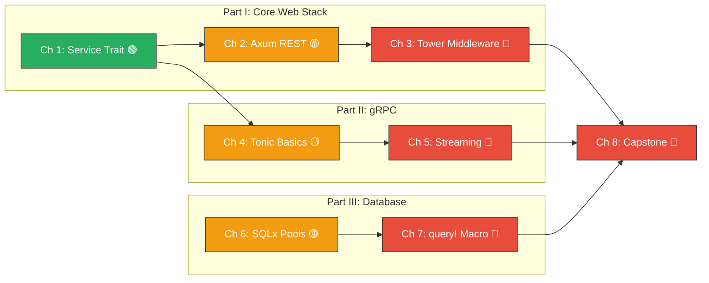

# Rust Microservices: Axum, Tonic, Tower, and SQLx

## Speaker Intro

I'm a Principal Backend Systems Architect who has spent over fifteen years designing, building, and operating high-throughput distributed systems — first in Java and Go microservice fleets processing millions of requests per second, and for the last several years in Rust. I've migrated production services from Spring Boot and Go's `net/http` to Axum and Tonic, debugged connection pool starvation at 3 AM, optimized gRPC streaming pipelines that moved terabytes of data per hour, and built internal platform frameworks consumed by dozens of teams.

This guide is the onboarding curriculum I wish I had when I made the leap. It doesn't teach you Rust syntax — it teaches you how to build *real backend systems* in Rust, the ones that serve traffic, talk to databases, enforce contracts through gRPC schemas, and survive production.

---

## Who This Is For

This guide is for **backend engineers** who are:

- **Spring Boot / Express / Go developers** who want to build REST and gRPC microservices in Rust but are overwhelmed by the ecosystem fragmentation (Actix vs. Axum, Diesel vs. SQLx, Reqwest vs. Hyper).
- **Rust developers** who can write CLI tools and libraries but have never built a production web service with connection pooling, structured logging, and graceful shutdown.
- **Platform/Infrastructure engineers** who need to understand the Tower middleware abstraction to write cross-cutting concerns (auth, rate-limiting, telemetry) that compose across Axum and Tonic.
- **Tech leads** evaluating Rust for backend services and need a clear picture of the production-readiness of the `Axum + Tonic + SQLx` stack.

You should already be comfortable with:

| Concept | Where to Learn |
|---------|---------------|
| `async`/`.await`, Futures, Tokio runtime | [Async Rust: From Futures to Production](../async-book/src/SUMMARY.md) |
| Traits, generics, associated types | [Rust's Type System & Traits](../type-system-traits-book/src/SUMMARY.md) |
| Ownership, borrowing, lifetimes | [Rust Memory Management](../memory-management-book/src/SUMMARY.md) |
| `Arc`, `Mutex`, channels | [Concurrency in Rust](../concurrency-book/src/SUMMARY.md) |
| Cargo workspaces, basic tooling | [Ecosystem, Tooling & Profiling](../tooling-profiling-book/src/SUMMARY.md) |

If you haven't written an `async fn` yet, start with the Async Rust book. This guide assumes you understand `Pin`, `Poll`, and why Tokio exists.

---

## How to Use This Book

| Emoji | Meaning |
|-------|---------|
| 🟢 | **Foundational** — first principles every backend Rust dev must internalize |
| 🟡 | **Applied** — hands-on patterns requiring judgment and production awareness |
| 🔴 | **Advanced** — deep internals, multiplexing, compile-time verification |

Every chapter follows the same structure:

1. **What you'll learn** — 3–4 concrete outcomes.
2. **The Naive/Brittle Way vs. The Production Rust Way** — side-by-side code showing what breaks under load and how to fix it.
3. **Production Hazard callouts** — code that compiles but fails at runtime, marked with `// ⚠️ PRODUCTION HAZARD:`.
4. **Exercise** — a hands-on challenge with a hidden, heavily-commented solution.
5. **Key Takeaways** — the 3–4 sentences you'd put in a post-incident review.

---

## Pacing Guide

| Chapters | Topic | Time | Checkpoint |
|----------|-------|------|------------|
| Ch 1 | Hyper, Tower, and the Service Trait | 2–3 hours | Can you implement a raw `tower::Service` by hand? |
| Ch 2 | RESTful APIs with Axum | 3–4 hours | Can you build a CRUD API with extractors and shared state? |
| Ch 3 | Tower Middleware and Telemetry | 3–4 hours | Can you compose a `ServiceBuilder` with tracing, timeout, and rate-limiting? |
| Ch 4 | Protobufs and Tonic | 2–3 hours | Can you define a `.proto` and generate a working Rust client and server? |
| Ch 5 | Bidirectional Streaming | 3–4 hours | Can you build a server-streaming and bidirectional-streaming gRPC service? |
| Ch 6 | SQLx Fundamentals | 2–3 hours | Can you configure a `PgPool` and run migrations programmatically? |
| Ch 7 | Compile-Time Queries | 3–4 hours | Can you use `sqlx::query!` with transactions and nullable columns? |
| Ch 8 | Capstone | 6–8 hours | Can you build a polyglot microservice serving REST + gRPC on one port? |

**Total: 24–33 hours** for the full curriculum, or ~4–5 days of focused study.

---

## Table of Contents

### Part I: The Core Web Stack (Axum & Tower)

The Rust web ecosystem is built on a small number of powerful abstractions. Understanding them from the bottom up — starting with Hyper's connection handling and Tower's `Service` trait — gives you the ability to debug, extend, and optimize anything built on top.

- **Chapter 1: Hyper, Tower, and the `Service` Trait 🟢** — The bedrock. Understanding `Service<Request> -> Future<Response>`, how Hyper turns TCP connections into typed HTTP, and why Axum and Tonic are just Tower services.
- **Chapter 2: RESTful APIs with Axum 🟡** — Routing, Handlers, Extractors (`Path`, `Query`, `Json`). State management with `Arc<AppState>` and `FromRef`. Returning idiomatic `IntoResponse` types.
- **Chapter 3: Tower Middleware and Telemetry 🔴** — `ServiceBuilder`, `Layer`, and composable middleware. Adding Timeout, Rate Limiting, CORS, and request-level `tracing` spans.

### Part II: High-Performance RPC (Tonic & gRPC)

REST is not enough. For internal service-to-service communication, gRPC provides schema-enforced contracts, efficient binary serialization, and streaming. Tonic brings gRPC to Rust with zero-cost abstractions over Tower.

- **Chapter 4: Protobufs and Tonic Basics 🟡** — Defining `.proto` contracts. Using `tonic-build` in `build.rs`. Implementing generated server traits and writing type-safe clients.
- **Chapter 5: Bidirectional Streaming and Channels 🔴** — Server-side, client-side, and full-duplex streaming. Wiring Tokio `mpsc` channels into `tonic::Streaming` with backpressure.

### Part III: The Database Layer (SQLx)

Every microservice needs a database. SQLx is unique in the Rust ecosystem: it's fully async, pure Rust, and verifies your SQL *at compile time* against a real database. No ORM magic, no runtime surprises.

- **Chapter 6: Async Databases and SQLx 🟡** — Why SQLx is a query engine, not an ORM. Connection pooling, `PgPool` configuration, and programmatic migrations.
- **Chapter 7: Compile-Time Checked Queries 🔴** — The `query!` macro, type mapping, `Option<T>` for nullable columns, and transaction scoping.

### Part IV: Production Architecture & Capstone

- **Chapter 8: Capstone: The Unified Polyglot Microservice 🔴** — Build a production service that exposes REST (Axum) and gRPC (Tonic) on the same port, sharing a single `PgPool` and Tower middleware stack.

### Appendices

- **Appendix A: Microservices Reference Card** — Cheat sheets for Axum extractors, SQLx macros, Tower layers, and HTTP status code mappings.

---

---

## Companion Guides

This book is designed to be read alongside:

- [**Async Rust: From Futures to Production**](../async-book/src/SUMMARY.md) — for deep Tokio internals, cancellation safety, and structured concurrency.
- [**Rust Architecture & Design Patterns**](../architecture-book/src/SUMMARY.md) — for Hexagonal Architecture, the Repository pattern, and domain-driven design in Rust.
- [**Rust API Design & Error Architecture**](../api-design-book/src/SUMMARY.md) — for designing clean public APIs and structured error types.
- [**Enterprise Rust: OpenTelemetry, Security, and Supply Chain Hygiene**](../enterprise-rust-book/src/SUMMARY.md) — for production observability beyond what Chapter 3 covers.
- [**Rust Ecosystem, Tooling & Profiling**](../tooling-profiling-book/src/SUMMARY.md) — for benchmarking, fuzzing, and CI/CD pipelines.

Let's begin.
