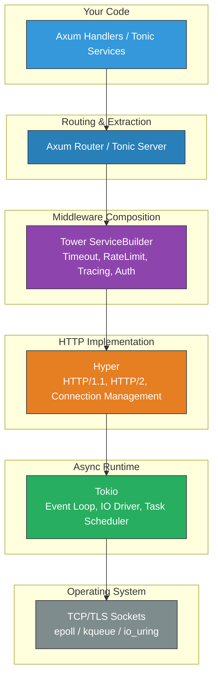
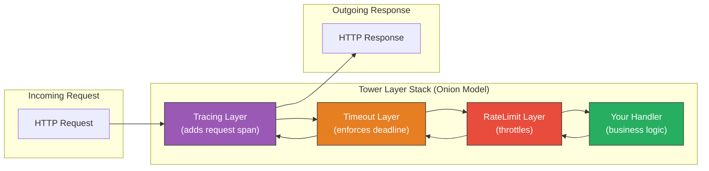

# 1. Hyper, Tower, and the `Service` Trait 🟢

> **What you'll learn:**
> - The `tower::Service` trait — the single abstraction that powers Axum, Tonic, and most of the Rust web ecosystem.
> - How Hyper turns raw TCP byte streams into typed `http::Request` / `http::Response` objects.
> - Why Axum handlers, Tonic gRPC services, and Tower middleware all implement the same `Service` trait — and what that uniformity buys you.
> - How to implement a raw `Service` by hand, so you never treat the framework as a black box.

**Cross-references:** This chapter provides the foundation for Axum routing in [Chapter 2](ch02-restful-apis-with-axum.md) and Tower middleware composition in [Chapter 3](ch03-tower-middleware-and-telemetry.md).

---

## The Architecture of the Rust Web Stack

Before writing a single line of Axum code, you need to understand the layered architecture beneath it. Unlike Go's `net/http` or Node's Express — which are monolithic frameworks — Rust's web stack is a *composition of independent crates*, each doing one thing well.



| Layer | Crate | Responsibility |
|-------|-------|---------------|
| Runtime | `tokio` | Async task scheduling, I/O driver, timers |
| HTTP Protocol | `hyper` | HTTP/1.1 and HTTP/2 parsing, connection management |
| Service Abstraction | `tower` | The `Service` trait, middleware composition, `ServiceBuilder` |
| Web Framework | `axum` | Routing, extractors, handlers — a thin layer over Tower |
| gRPC Framework | `tonic` | Protobuf codegen, gRPC client/server — also a Tower service |

The key insight: **Axum is not a web framework in the traditional sense. It is a routing layer that converts Tower services into ergonomic handler functions.** Tonic is the same idea for gRPC. Both are thin wrappers around Tower, which is itself just one trait.

---

## The `tower::Service` Trait: First Principles

Everything starts here. The `Service` trait is, conceptually, the simplest abstraction in the entire stack:

```rust
// Simplified from tower::Service
pub trait Service<Request> {
    type Response;
    type Error;
    type Future: Future<Output = Result<Self::Response, Self::Error>>;

    /// Check if the service is ready to accept a request.
    fn poll_ready(&mut self, cx: &mut Context<'_>) -> Poll<Result<(), Self::Error>>;

    /// Process the request and return a future that resolves to a response.
    fn call(&mut self, req: Request) -> Self::Future;
}
```

That's it. A `Service` is anything that:
1. Takes a `Request`.
2. Returns a `Future` that resolves to `Result<Response, Error>`.
3. Can signal backpressure via `poll_ready`.

### Why This Matters

If you come from Go, think of `Service` as the `http.Handler` interface — but generic over *any* request type, not just HTTP. If you come from Java, it's like a `Function<Request, CompletableFuture<Response>>` that also supports backpressure.

| Ecosystem | Equivalent Abstraction |
|-----------|----------------------|
| Go | `http.Handler` interface |
| Java/Spring | `WebFilter` / `HandlerFunction` |
| Node/Express | `(req, res, next) => ...` middleware |
| Rust/Tower | `Service<Request>` trait |

The critical difference: Tower's `Service` is a *compile-time* abstraction. There is no virtual dispatch, no runtime reflection. The compiler monomorphizes each middleware stack into a single, inlined function. This is why Rust web servers can match or beat C++ performance.

---

## Implementing a Raw Service by Hand

Let's strip away all framework magic and build a service from scratch. This is intentionally verbose — you'll never write production code this way, but understanding it makes everything else click.

### The Naive Way: A Closure-Based "Server"

```rust
use std::convert::Infallible;
use std::net::SocketAddr;
use tokio::net::TcpListener;
use tokio::io::{AsyncReadExt, AsyncWriteExt};

#[tokio::main]
async fn main() {
    let listener = TcpListener::bind("0.0.0.0:3000").await.unwrap();
    println!("Listening on :3000");

    loop {
        let (mut socket, _addr) = listener.accept().await.unwrap();
        tokio::spawn(async move {
            let mut buf = [0u8; 1024];
            let _ = socket.read(&mut buf).await;

            // ⚠️ PRODUCTION HAZARD: Raw byte manipulation, no HTTP parsing,
            // no content-length, no keep-alive, no error handling.
            let response = "HTTP/1.1 200 OK\r\nContent-Length: 13\r\n\r\nHello, World!";
            let _ = socket.write_all(response.as_bytes()).await;
        });
    }
}
```

This "works" for a demo, but it:
- Doesn't parse HTTP (headers, methods, paths — all ignored).
- Has no middleware hooks (no logging, no auth, no timeouts).
- Will silently corrupt responses under HTTP/1.1 keep-alive.
- Is impossible to unit test without opening a real socket.

### The Production Way: A Hand-Written Tower Service

```rust
use std::convert::Infallible;
use std::future::Future;
use std::pin::Pin;
use std::task::{Context, Poll};
use http::{Request, Response};
use http_body_util::Full;
use bytes::Bytes;

// ✅ FIX: Implement the Tower Service trait directly.
// This is what Axum *generates* for each handler function.
#[derive(Clone)]
struct HelloService;

impl tower::Service<Request<hyper::body::Incoming>> for HelloService {
    type Response = Response<Full<Bytes>>;
    type Error = Infallible;
    type Future = Pin<Box<dyn Future<Output = Result<Self::Response, Self::Error>> + Send>>;

    fn poll_ready(&mut self, _cx: &mut Context<'_>) -> Poll<Result<(), Self::Error>> {
        // This service is always ready — no backpressure.
        Poll::Ready(Ok(()))
    }

    fn call(&mut self, _req: Request<hyper::body::Incoming>) -> Self::Future {
        Box::pin(async {
            let response = Response::builder()
                .status(200)
                .header("content-type", "text/plain")
                .body(Full::new(Bytes::from("Hello, World!")))
                .unwrap();
            Ok(response)
        })
    }
}
```

This is a proper Tower `Service`. It:
- Works with typed `http::Request` / `http::Response` objects.
- Can be wrapped in *any* Tower middleware (timeout, tracing, auth).
- Can be tested by constructing a `Request` in memory — no sockets needed.
- Can be served by Hyper directly.

### Serving It with Hyper

```rust
use hyper::server::conn::http1;
use hyper_util::rt::TokioIo;
use tokio::net::TcpListener;

#[tokio::main]
async fn main() -> Result<(), Box<dyn std::error::Error>> {
    let listener = TcpListener::bind("0.0.0.0:3000").await?;
    println!("Listening on :3000");

    loop {
        let (stream, _addr) = listener.accept().await?;
        let io = TokioIo::new(stream);

        tokio::spawn(async move {
            // Hyper takes our Tower Service and handles HTTP/1.1 framing,
            // keep-alive, chunked encoding, etc.
            if let Err(e) = http1::Builder::new()
                .serve_connection(io, HelloService)
                .await
            {
                eprintln!("Connection error: {e}");
            }
        });
    }
}
```

---

## How Hyper Fits In

Hyper is the HTTP engine. It does two things:

1. **Parses raw TCP bytes into `http::Request` objects** — handling HTTP/1.1 framing, chunked transfer encoding, and HTTP/2 multiplexing.
2. **Serializes `http::Response` objects back to bytes** — including content-length calculation and connection management.

Hyper does *not* do routing, extraction, or middleware. That's Tower and Axum's job.

### Hyper 1.x vs. 0.14

A common source of confusion: Hyper 1.0 was a major rewrite that removed the built-in server. You now compose Hyper yourself:

| Feature | Hyper 0.14 | Hyper 1.x |
|---------|-----------|-----------|
| Built-in `Server::bind()` | ✅ Yes | ❌ Removed |
| Body type | `hyper::Body` | Trait-based (`http_body::Body`) |
| `tower::Service` integration | Implicit | Explicit via `hyper_util` |
| Connection handling | Automatic | Manual (you call `serve_connection`) |
| HTTP/2 | Built-in | Separate `http2::Builder` |

Axum 0.7+ uses Hyper 1.x internally, so you rarely interact with Hyper directly. But when you need to customize connection handling (e.g., for the capstone's protocol multiplexer), you'll work at this layer.

---

## The Tower Stack: Layers and Services

Tower introduces one more critical concept: **Layers**. A `Layer` wraps an existing `Service` to add behavior:

```rust
// Conceptually:
pub trait Layer<S> {
    type Service;
    fn layer(&self, inner: S) -> Self::Service;
}
```

A `Layer` takes a service `S` and returns a *new* service that wraps it. This is the onion model:



Each layer gets to:
1. **Inspect/modify the request** before passing it inward.
2. **Inspect/modify the response** on the way back out.
3. **Short-circuit** (e.g., rate limiter returns 429 without calling the inner service).

### Composing Layers with `ServiceBuilder`

```rust
use tower::ServiceBuilder;
use tower_http::timeout::TimeoutLayer;
use tower_http::cors::CorsLayer;
use std::time::Duration;

let service = ServiceBuilder::new()
    // Outermost layer — applied first on request, last on response
    .layer(TimeoutLayer::new(Duration::from_secs(30)))
    // Middle layer
    .layer(CorsLayer::permissive())
    // Innermost — the actual handler
    .service(HelloService);
```

This returns a *single type* — a nested `Timeout<Cors<HelloService>>` — that the compiler monomorphizes and inlines. Zero runtime overhead.

---

## Why Axum and Tonic Are "Just" Services

Now the punchline. When you write an Axum handler:

```rust
async fn hello() -> &'static str {
    "Hello, World!"
}

let app = axum::Router::new()
    .route("/", axum::routing::get(hello));
```

Axum compiles `hello` into a `Service<Request<Body>>` behind the scenes. The `Router` itself implements `Service`. You can wrap it with any Tower layer:

```rust
let app = axum::Router::new()
    .route("/", axum::routing::get(hello))
    .layer(TimeoutLayer::new(Duration::from_secs(30)));
```

Tonic does the exact same thing for gRPC:

```rust
let grpc_service = tonic::transport::Server::builder()
    .layer(TimeoutLayer::new(Duration::from_secs(30)))  // Same Tower layer!
    .add_service(my_grpc_service);
```

**The same `TimeoutLayer` works on both Axum and Tonic** because both are Tower services. This is the power of the abstraction: write middleware once, apply everywhere.

---

## Comparison: Web Framework Architectures

| Feature | Express (Node) | Spring Boot (Java) | Go `net/http` | Axum (Rust) |
|---------|---------------|-------------------|--------------|-------------|
| Middleware model | Runtime chain | Bean proxies (AOP) | `HandlerFunc` wrapping | Compile-time `Service` composition |
| Type safety | None | Partial (reflection) | Partial (interfaces) | Full (generics + traits) |
| Overhead per middleware | Virtual dispatch + closure | Reflection + proxy | Interface dispatch | Zero (monomorphized) |
| Backpressure support | No | No | No | Yes (`poll_ready`) |
| Shared middleware across protocols | No | Partial (filters) | No | Yes (Tower) |

---

<details>
<summary><strong>🏋️ Exercise: Build a Timing Middleware from Scratch</strong> (click to expand)</summary>

**Challenge:** Implement a Tower `Layer` and `Service` that measures the time each request takes and prints it to stdout. Then wrap the `HelloService` from this chapter with your timing middleware and serve it with Hyper.

**Requirements:**
1. Create a `TimingLayer` struct that implements `tower::Layer<S>`.
2. Create a `TimingService<S>` struct that wraps an inner service and implements `tower::Service`.
3. In `call()`, record `Instant::now()` before calling the inner service, and print the elapsed time after the response future completes.
4. Serve the composed service on port 3000.

<details>
<summary>🔑 Solution</summary>

```rust
use std::future::Future;
use std::pin::Pin;
use std::task::{Context, Poll};
use std::time::Instant;
use tower::{Layer, Service};

// ── Step 1: Define the Layer ───────────────────────────────────────
// A Layer is a factory: it takes an inner service and wraps it.
#[derive(Clone)]
struct TimingLayer;

impl<S> Layer<S> for TimingLayer {
    type Service = TimingService<S>;

    fn layer(&self, inner: S) -> Self::Service {
        TimingService { inner }
    }
}

// ── Step 2: Define the Service wrapper ─────────────────────────────
// This struct holds the inner service. It implements Service by
// delegating to the inner service and measuring elapsed time.
#[derive(Clone)]
struct TimingService<S> {
    inner: S,
}

impl<S, ReqBody> Service<http::Request<ReqBody>> for TimingService<S>
where
    // The inner service must handle the same request type.
    S: Service<http::Request<ReqBody>> + Clone + Send + 'static,
    S::Future: Send + 'static,
    S::Response: Send + 'static,
    S::Error: Send + std::fmt::Debug + 'static,
    ReqBody: Send + 'static,
{
    type Response = S::Response;
    type Error = S::Error;
    type Future = Pin<Box<dyn Future<Output = Result<Self::Response, Self::Error>> + Send>>;

    fn poll_ready(&mut self, cx: &mut Context<'_>) -> Poll<Result<(), Self::Error>> {
        // Delegate backpressure to the inner service.
        self.inner.poll_ready(cx)
    }

    fn call(&mut self, req: http::Request<ReqBody>) -> Self::Future {
        // Clone the inner service because `call` takes `&mut self`
        // but we need to move it into the async block.
        // This is a common Tower pattern — services must be Clone.
        let mut inner = self.inner.clone();
        // Swap so `self` retains the "ready" clone.
        std::mem::swap(&mut self.inner, &mut inner);

        Box::pin(async move {
            let start = Instant::now();
            let method = req.method().clone();
            let uri = req.uri().clone();

            // Call the inner service and await its response.
            let result = inner.call(req).await;

            let elapsed = start.elapsed();
            match &result {
                Ok(_) => println!("{method} {uri} — {elapsed:?} (OK)"),
                Err(e) => println!("{method} {uri} — {elapsed:?} (ERR: {e:?})"),
            }

            result
        })
    }
}

// ── Step 3: Compose and serve ──────────────────────────────────────
// (Uses HelloService from earlier in this chapter)
#[tokio::main]
async fn main() -> Result<(), Box<dyn std::error::Error>> {
    use hyper::server::conn::http1;
    use hyper_util::rt::TokioIo;
    use tokio::net::TcpListener;
    use tower::ServiceBuilder;

    // Compose: TimingLayer wraps HelloService
    let service = ServiceBuilder::new()
        .layer(TimingLayer)
        .service(HelloService);

    let listener = TcpListener::bind("0.0.0.0:3000").await?;
    println!("Listening on :3000");

    loop {
        let (stream, _addr) = listener.accept().await?;
        let io = TokioIo::new(stream);
        let svc = service.clone();

        tokio::spawn(async move {
            if let Err(e) = http1::Builder::new()
                .serve_connection(io, hyper::service::service_fn(move |req| {
                    let mut svc = svc.clone();
                    async move { svc.call(req).await }
                }))
                .await
            {
                eprintln!("Connection error: {e}");
            }
        });
    }
}
```

**Key observations:**
- The `clone + swap` pattern in `call()` is idiomatic Tower. Since `call(&mut self)` takes a mutable reference, but the future must own the service, you clone and swap.
- The timing middleware is completely protocol-agnostic — it works with HTTP, gRPC, or any request type.
- The compiler monomorphizes `TimingService<HelloService>` into a single type with no virtual dispatch.

</details>
</details>

---

> **Key Takeaways**
> - The Rust web stack is layered: **Tokio** (runtime) → **Hyper** (HTTP) → **Tower** (`Service` trait) → **Axum/Tonic** (ergonomic wrappers).
> - `tower::Service<Request>` is the single abstraction: take a request, return a future of a response. Everything — handlers, routers, middleware — is a service.
> - Layers wrap services to add cross-cutting behavior. They compose at *compile time* via `ServiceBuilder`, yielding zero-overhead middleware stacks.
> - Axum and Tonic both produce Tower services, which means **you write middleware once and apply it to both REST and gRPC**.
> - Understanding this layer lets you debug framework behavior, write custom middleware, and build the capstone multiplexer in Chapter 8.

---

> **See also:**
> - [Chapter 2: RESTful APIs with Axum](ch02-restful-apis-with-axum.md) — builds on this foundation to add routing and extraction.
> - [Chapter 3: Tower Middleware and Telemetry](ch03-tower-middleware-and-telemetry.md) — deep-dive into production middleware composition.
> - [Async Rust: From Futures to Production](../async-book/src/SUMMARY.md) — for the `Future`, `Poll`, and Tokio runtime internals beneath `Service`.
