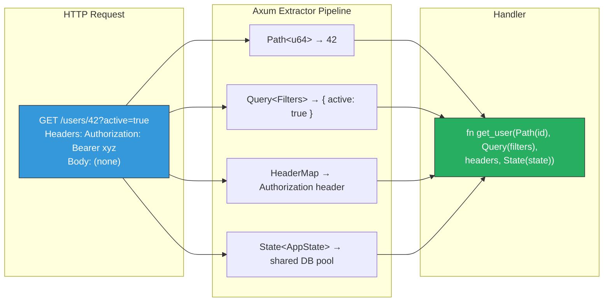

# 2. RESTful APIs with Axum 🟡

> **What you'll learn:**
> - How Axum's `Router`, handlers, and extractors map to the Tower `Service` trait you learned in Chapter 1.
> - The full extractor ecosystem: `Path`, `Query`, `Json`, `State`, `Extension`, and custom extractors via `FromRequest` / `FromRequestParts`.
> - Idiomatic shared state management using `Arc<AppState>` with the `FromRef` trait — and why naive `Mutex` state is a production hazard.
> - How to return rich, typed responses using `IntoResponse`, including custom error types that produce proper HTTP status codes.

**Cross-references:** This chapter builds on the `Service` trait from [Chapter 1](ch01-hyper-tower-service-trait.md) and sets up the middleware stack in [Chapter 3](ch03-tower-middleware-and-telemetry.md).

---

## From `Service` to Handler Functions

In Chapter 1, you implemented `tower::Service` by hand — verbose, but foundational. Axum's genius is that it lets you write *plain async functions* and automatically compiles them into Tower services.

```rust
// Chapter 1: Raw Tower Service (educational, not production)
impl Service<Request<Body>> for HelloService {
    type Response = Response<Full<Bytes>>;
    // ... 20+ lines of boilerplate
}

// Chapter 2: Axum handler (production)
async fn hello() -> &'static str {
    "Hello, World!"
}
```

Both compile to the same thing: a `Service<Request>`. Axum uses Rust's trait system to desugar the second form into the first at compile time. There is zero runtime overhead.

---

## Routing

Axum's `Router` is a trie-based path matcher that maps HTTP methods and paths to handlers:

```rust
use axum::{
    routing::{get, post, put, delete},
    Router,
};

let app = Router::new()
    .route("/health", get(health_check))
    .route("/api/users", get(list_users).post(create_user))
    .route("/api/users/{id}", get(get_user).put(update_user).delete(delete_user))
    .route("/api/users/{id}/posts", get(list_user_posts));
```

### Route Syntax

| Pattern | Example Match | Extractor |
|---------|-------------|-----------|
| `/literal` | `/health` | None |
| `/{param}` | `/users/42` | `Path<(String,)>` or `Path<u64>` |
| `/{*wildcard}` | `/files/a/b/c.txt` | `Path<String>` |
| Nested | `.nest("/api", api_router())` | Prefix stripping |

### Method Routing

```rust
use axum::routing::{get, post, put, delete, any};

// Single method
.route("/items", get(list_items))

// Multiple methods on the same path
.route("/items", get(list_items).post(create_item))

// Catch-all method (useful for CORS preflight)
.route("/webhook", any(handle_webhook))
```

### Router Composition with `nest` and `merge`

For large applications, split routes into modules:

```rust
fn user_routes() -> Router<AppState> {
    Router::new()
        .route("/", get(list_users).post(create_user))
        .route("/{id}", get(get_user).put(update_user).delete(delete_user))
}

fn post_routes() -> Router<AppState> {
    Router::new()
        .route("/", get(list_posts).post(create_post))
        .route("/{id}", get(get_post))
}

// Compose with `nest` — adds a path prefix
let app = Router::new()
    .nest("/api/users", user_routes())
    .nest("/api/posts", post_routes())
    .route("/health", get(health_check));

// Or with `merge` — no prefix, just combines routes
let app = Router::new()
    .merge(user_routes())
    .merge(post_routes());
```

---

## Extractors: The Type-Safe Request Parser

Extractors are Axum's killer feature. They use the type system to parse request data *before* your handler runs. If extraction fails, the handler is never called — the user gets an automatic error response.



### Core Extractors

| Extractor | Source | Example |
|-----------|--------|---------|
| `Path<T>` | URL path segments | `Path(id): Path<u64>` |
| `Query<T>` | URL query string | `Query(params): Query<Pagination>` |
| `Json<T>` | Request body (JSON) | `Json(body): Json<CreateUser>` |
| `State<T>` | Application state | `State(pool): State<PgPool>` |
| `HeaderMap` | All headers | `headers: HeaderMap` |
| `TypedHeader<T>` | Specific typed header | `TypedHeader(auth): TypedHeader<Authorization<Bearer>>` |
| `Extension<T>` | Per-request extensions | `Extension(user): Extension<AuthenticatedUser>` |
| `RawBody` | Unparsed body bytes | `body: RawBody` |

### Order Matters: Body Extractors Must Be Last

Axum has a critical rule: **extractors that consume the request body must be the last argument.** This is because the body is a stream that can only be read once.

```rust
// ✅ CORRECT: Json<T> is last because it consumes the body.
async fn create_user(
    State(pool): State<PgPool>,
    Path(org_id): Path<u64>,
    Json(payload): Json<CreateUserRequest>,
) -> impl IntoResponse {
    // ...
}

// ⚠️ PRODUCTION HAZARD: Won't compile! Json is not last.
// async fn create_user(
//     Json(payload): Json<CreateUserRequest>,
//     State(pool): State<PgPool>,  // ERROR: body already consumed
// ) -> impl IntoResponse { ... }
```

### Typed Path Parameters

Use `serde::Deserialize` for structured path extraction:

```rust
use serde::Deserialize;

#[derive(Deserialize)]
struct UserPath {
    org_id: u64,
    user_id: u64,
}

async fn get_org_user(
    Path(path): Path<UserPath>,
) -> impl IntoResponse {
    format!("Org: {}, User: {}", path.org_id, path.user_id)
}

// Route: /orgs/{org_id}/users/{user_id}
```

### Query Parameters with Defaults

```rust
#[derive(Deserialize)]
struct Pagination {
    #[serde(default = "default_page")]
    page: u32,
    #[serde(default = "default_per_page")]
    per_page: u32,
}

fn default_page() -> u32 { 1 }
fn default_per_page() -> u32 { 20 }

async fn list_users(
    Query(pagination): Query<Pagination>,
) -> impl IntoResponse {
    // GET /users → page=1, per_page=20
    // GET /users?page=3 → page=3, per_page=20
    // GET /users?page=2&per_page=50 → page=2, per_page=50
    format!("Page {} ({} per page)", pagination.page, pagination.per_page)
}
```

---

## State Management

Every real application needs shared state: database pools, configuration, caches. Axum provides two patterns, and choosing the wrong one is one of the most common production mistakes.

### The Naive Way: `Extension` with Manual Arc

```rust
use std::sync::Arc;
use tokio::sync::Mutex;

struct AppState {
    // ⚠️ PRODUCTION HAZARD: Mutex around the entire state.
    // Every request serializes through this lock.
    counter: Mutex<u64>,
    db_pool: PgPool,
}

let shared_state = Arc::new(AppState {
    counter: Mutex::new(0),
    db_pool: pool,
});

let app = Router::new()
    .route("/count", get(get_count))
    // ⚠️ PRODUCTION HAZARD: Extension<T> is untyped —
    // if you forget to add it, you get a runtime 500, not a compile error.
    .layer(axum::Extension(shared_state));

async fn get_count(
    Extension(state): Extension<Arc<AppState>>,
) -> impl IntoResponse {
    let count = state.counter.lock().await;
    format!("Count: {count}")
}
```

Problems:
1. `Extension<T>` is untyped — missing it causes a **runtime panic**, not a compile error.
2. `Mutex<u64>` serializes all requests through a single lock.

### The Production Way: `State` with `FromRef`

```rust
use axum::extract::{FromRef, State};
use std::sync::atomic::{AtomicU64, Ordering};
use std::sync::Arc;

// ✅ FIX: Use atomic operations for the counter, no Mutex needed.
#[derive(Clone)]
struct AppState {
    counter: Arc<AtomicU64>,
    db_pool: PgPool,
}

// ✅ FIX: FromRef lets you extract sub-fields of AppState directly.
impl FromRef<AppState> for PgPool {
    fn from_ref(state: &AppState) -> Self {
        state.db_pool.clone()
    }
}

let state = AppState {
    counter: Arc::new(AtomicU64::new(0)),
    db_pool: pool,
};

// ✅ FIX: .with_state() provides compile-time guarantees.
// If a handler extracts State<PgPool> but the router doesn't provide
// an AppState with a FromRef<PgPool> impl, it won't compile.
let app = Router::new()
    .route("/count", get(get_count))
    .route("/users", get(list_users))
    .with_state(state);

// Extract the full AppState
async fn get_count(State(state): State<AppState>) -> impl IntoResponse {
    let count = state.counter.fetch_add(1, Ordering::Relaxed);
    format!("Count: {count}")
}

// Or extract just the PgPool sub-state (via FromRef)
async fn list_users(State(pool): State<PgPool>) -> impl IntoResponse {
    // Direct access to the pool without going through AppState.
    // This is cleaner and makes handler dependencies explicit.
    todo!()
}
```

| Pattern | Type Safety | Failure Mode | When to Use |
|---------|------------|-------------|-------------|
| `Extension<T>` | Runtime | 500 Internal Server Error | Middleware-injected data (auth user) |
| `State<T>` + `FromRef` | Compile time | Doesn't compile | Application-wide shared state |

---

## Responses: `IntoResponse`

Any type that implements `IntoResponse` can be returned from a handler. Axum provides implementations for common types:

| Return Type | HTTP Status | Content-Type |
|------------|-------------|-------------|
| `&str` / `String` | 200 | `text/plain` |
| `Json<T>` | 200 | `application/json` |
| `(StatusCode, impl IntoResponse)` | Custom | Varies |
| `Result<T, E>` where both implement `IntoResponse` | Varies | Varies |
| `StatusCode` alone | That status | Empty body |
| `Html<String>` | 200 | `text/html` |
| `Redirect` | 301/302/307/308 | Empty body |

### Custom Error Responses

The naive approach returns strings:

```rust
// ⚠️ PRODUCTION HAZARD: Leaks internal details to clients.
// No structured error format. Status code is always 200 or 500.
async fn get_user(Path(id): Path<u64>) -> Result<String, String> {
    let user = find_user(id).map_err(|e| format!("DB Error: {e}"))?;
    Ok(format!("{user:?}"))
}
```

The production approach uses a custom error type:

```rust
use axum::response::{IntoResponse, Response};
use axum::http::StatusCode;
use axum::Json;
use serde::Serialize;

// ✅ FIX: Structured error type with proper HTTP semantics.
enum AppError {
    NotFound(String),
    BadRequest(String),
    Internal(anyhow::Error),
}

#[derive(Serialize)]
struct ErrorResponse {
    error: String,
    #[serde(skip_serializing_if = "Option::is_none")]
    detail: Option<String>,
}

impl IntoResponse for AppError {
    fn into_response(self) -> Response {
        let (status, error, detail) = match self {
            AppError::NotFound(msg) => (StatusCode::NOT_FOUND, "not_found", Some(msg)),
            AppError::BadRequest(msg) => (StatusCode::BAD_REQUEST, "bad_request", Some(msg)),
            AppError::Internal(err) => {
                // ✅ FIX: Log the real error server-side, return opaque message to client.
                tracing::error!(?err, "Internal server error");
                (StatusCode::INTERNAL_SERVER_ERROR, "internal_error", None)
            }
        };

        let body = ErrorResponse {
            error: error.to_string(),
            detail,
        };

        (status, Json(body)).into_response()
    }
}

// Now handlers return Result<impl IntoResponse, AppError>
async fn get_user(
    State(pool): State<PgPool>,
    Path(id): Path<u64>,
) -> Result<Json<User>, AppError> {
    let user = sqlx::query_as!(User, "SELECT * FROM users WHERE id = $1", id as i64)
        .fetch_optional(&pool)
        .await
        .map_err(|e| AppError::Internal(e.into()))?
        .ok_or_else(|| AppError::NotFound(format!("User {id} not found")))?;

    Ok(Json(user))
}
```

---

## Complete Application Skeleton

Putting it all together — a production-shaped Axum application:

```rust
use axum::{
    extract::{FromRef, Path, Query, State},
    http::StatusCode,
    response::{IntoResponse, Json},
    routing::{get, post},
    Router,
};
use serde::{Deserialize, Serialize};
use sqlx::PgPool;
use std::sync::Arc;
use std::sync::atomic::{AtomicU64, Ordering};
use tokio::net::TcpListener;

// ── Domain Types ───────────────────────────────────────────────────
#[derive(Serialize, sqlx::FromRow)]
struct User {
    id: i64,
    name: String,
    email: String,
}

#[derive(Deserialize)]
struct CreateUserRequest {
    name: String,
    email: String,
}

#[derive(Deserialize)]
struct Pagination {
    #[serde(default = "default_page")]
    page: u32,
    #[serde(default = "default_per_page")]
    per_page: u32,
}
fn default_page() -> u32 { 1 }
fn default_per_page() -> u32 { 20 }

// ── Application State ──────────────────────────────────────────────
#[derive(Clone)]
struct AppState {
    db: PgPool,
    request_count: Arc<AtomicU64>,
}

// Allow handlers to extract PgPool directly from AppState
impl FromRef<AppState> for PgPool {
    fn from_ref(state: &AppState) -> Self {
        state.db.clone()
    }
}

// ── Handlers ───────────────────────────────────────────────────────
async fn health() -> StatusCode {
    StatusCode::OK
}

async fn list_users(
    State(pool): State<PgPool>,
    Query(pagination): Query<Pagination>,
) -> Result<Json<Vec<User>>, AppError> {
    let offset = ((pagination.page - 1) * pagination.per_page) as i64;
    let limit = pagination.per_page as i64;

    let users = sqlx::query_as!(
        User,
        "SELECT id, name, email FROM users ORDER BY id LIMIT $1 OFFSET $2",
        limit,
        offset
    )
    .fetch_all(&pool)
    .await
    .map_err(|e| AppError::Internal(e.into()))?;

    Ok(Json(users))
}

async fn create_user(
    State(pool): State<PgPool>,
    Json(payload): Json<CreateUserRequest>,
) -> Result<(StatusCode, Json<User>), AppError> {
    let user = sqlx::query_as!(
        User,
        "INSERT INTO users (name, email) VALUES ($1, $2) RETURNING id, name, email",
        payload.name,
        payload.email
    )
    .fetch_one(&pool)
    .await
    .map_err(|e| AppError::Internal(e.into()))?;

    Ok((StatusCode::CREATED, Json(user)))
}

// ── Error Type (from above) ────────────────────────────────────────
// (AppError and IntoResponse impl from the error section)
# enum AppError { NotFound(String), BadRequest(String), Internal(anyhow::Error) }
# impl IntoResponse for AppError { fn into_response(self) -> axum::response::Response { todo!() } }

// ── Main ───────────────────────────────────────────────────────────
#[tokio::main]
async fn main() -> anyhow::Result<()> {
    // Initialize tracing (see Chapter 3 for full setup)
    tracing_subscriber::fmt::init();

    // Connect to the database (see Chapter 6 for pool configuration)
    let pool = PgPool::connect(&std::env::var("DATABASE_URL")?).await?;

    let state = AppState {
        db: pool,
        request_count: Arc::new(AtomicU64::new(0)),
    };

    let app = Router::new()
        .route("/health", get(health))
        .route("/api/users", get(list_users).post(create_user))
        .with_state(state);

    let listener = TcpListener::bind("0.0.0.0:3000").await?;
    tracing::info!("Listening on :3000");
    axum::serve(listener, app).await?;

    Ok(())
}
```

---

<details>
<summary><strong>🏋️ Exercise: Build a CRUD API with Validation</strong> (click to expand)</summary>

**Challenge:** Extend the application skeleton above to add:

1. A `PUT /api/users/{id}` endpoint that updates a user's name and email.
2. A `DELETE /api/users/{id}` endpoint that returns `204 No Content`.
3. Input validation: reject `CreateUserRequest` if `name` is empty or `email` doesn't contain `@`.
4. A custom `Json` extractor rejection that returns your `AppError` format instead of Axum's default.

<details>
<summary>🔑 Solution</summary>

```rust
use axum::{
    extract::{rejection::JsonRejection, FromRequest, Path, Request, State},
    http::StatusCode,
    response::{IntoResponse, Json as AxumJson, Response},
    routing::{delete, get, post, put},
    Router,
};
use serde::{de::DeserializeOwned, Deserialize, Serialize};
use sqlx::PgPool;

// ── Custom JSON extractor that converts rejection to AppError ──────
//
// Axum's default Json extractor returns its own error format.
// We override it to use our AppError type for consistent responses.
struct ValidatedJson<T>(pub T);

#[axum::async_trait]
impl<S, T> FromRequest<S> for ValidatedJson<T>
where
    T: DeserializeOwned,
    S: Send + Sync,
{
    type Rejection = AppError;

    async fn from_request(req: Request, state: &S) -> Result<Self, Self::Rejection> {
        // Delegate to Axum's Json extractor
        let AxumJson(value) = AxumJson::<T>::from_request(req, state)
            .await
            .map_err(|rejection: JsonRejection| {
                // Convert Axum's rejection into our error type
                AppError::BadRequest(format!("Invalid JSON: {rejection}"))
            })?;
        Ok(ValidatedJson(value))
    }
}

// ── Validation ─────────────────────────────────────────────────────
#[derive(Deserialize)]
struct CreateUserRequest {
    name: String,
    email: String,
}

impl CreateUserRequest {
    fn validate(&self) -> Result<(), AppError> {
        if self.name.trim().is_empty() {
            return Err(AppError::BadRequest("Name cannot be empty".into()));
        }
        if !self.email.contains('@') {
            return Err(AppError::BadRequest("Email must contain @".into()));
        }
        Ok(())
    }
}

// ── Update handler ─────────────────────────────────────────────────
async fn update_user(
    State(pool): State<PgPool>,
    Path(id): Path<i64>,
    ValidatedJson(payload): ValidatedJson<CreateUserRequest>,
) -> Result<AxumJson<User>, AppError> {
    // Validate before touching the database
    payload.validate()?;

    let user = sqlx::query_as!(
        User,
        r#"
        UPDATE users SET name = $1, email = $2
        WHERE id = $3
        RETURNING id, name, email
        "#,
        payload.name,
        payload.email,
        id
    )
    .fetch_optional(&pool)
    .await
    .map_err(|e| AppError::Internal(e.into()))?
    .ok_or_else(|| AppError::NotFound(format!("User {id} not found")))?;

    Ok(AxumJson(user))
}

// ── Delete handler ─────────────────────────────────────────────────
async fn delete_user(
    State(pool): State<PgPool>,
    Path(id): Path<i64>,
) -> Result<StatusCode, AppError> {
    let result = sqlx::query!("DELETE FROM users WHERE id = $1", id)
        .execute(&pool)
        .await
        .map_err(|e| AppError::Internal(e.into()))?;

    if result.rows_affected() == 0 {
        Err(AppError::NotFound(format!("User {id} not found")))
    } else {
        // 204 No Content — successful deletion with no response body
        Ok(StatusCode::NO_CONTENT)
    }
}

// ── Updated Router ─────────────────────────────────────────────────
fn app(state: AppState) -> Router {
    Router::new()
        .route("/health", get(health))
        .route("/api/users", get(list_users).post(create_user_validated))
        .route(
            "/api/users/{id}",
            get(get_user).put(update_user).delete(delete_user),
        )
        .with_state(state)
}

async fn create_user_validated(
    State(pool): State<PgPool>,
    ValidatedJson(payload): ValidatedJson<CreateUserRequest>,
) -> Result<(StatusCode, AxumJson<User>), AppError> {
    // Validate first
    payload.validate()?;

    let user = sqlx::query_as!(
        User,
        "INSERT INTO users (name, email) VALUES ($1, $2) RETURNING id, name, email",
        payload.name,
        payload.email
    )
    .fetch_one(&pool)
    .await
    .map_err(|e| AppError::Internal(e.into()))?;

    Ok((StatusCode::CREATED, AxumJson(user)))
}
```

**Key points:**
- `ValidatedJson<T>` is a custom extractor that wraps Axum's `Json<T>` and converts its rejection into our `AppError`.
- Validation is explicit: we call `payload.validate()` in the handler. No magic annotations.
- `DELETE` returns `StatusCode::NO_CONTENT` (204) — the HTTP-correct response for successful deletion with no body.
- The `fetch_optional` + `ok_or_else` pattern is idiomatic for "find or 404" queries.

</details>
</details>

---

> **Key Takeaways**
> - Axum handlers are plain `async fn`s that Axum compiles into Tower `Service` implementations at zero runtime cost.
> - Extractors (`Path`, `Query`, `Json`, `State`) parse request data through the type system — invalid requests never reach your handler.
> - Use `State<T>` with `FromRef` for shared application state (compile-time checked), not `Extension<T>` (runtime checked).
> - Implement `IntoResponse` on a custom error enum to control HTTP status codes and response bodies — never leak internal errors to clients.
> - Body-consuming extractors (`Json`, `RawBody`) must always be the **last** handler argument.

---

> **See also:**
> - [Chapter 1: Hyper, Tower, and the Service Trait](ch01-hyper-tower-service-trait.md) — the foundation this chapter builds on.
> - [Chapter 3: Tower Middleware and Telemetry](ch03-tower-middleware-and-telemetry.md) — adding cross-cutting concerns to this REST API.
> - [Chapter 6: Async Databases and SQLx](ch06-async-databases-and-sqlx.md) — proper `PgPool` configuration for the database calls shown here.
> - [Rust API Design & Error Architecture](../api-design-book/src/SUMMARY.md) — for deeper error type design patterns.
