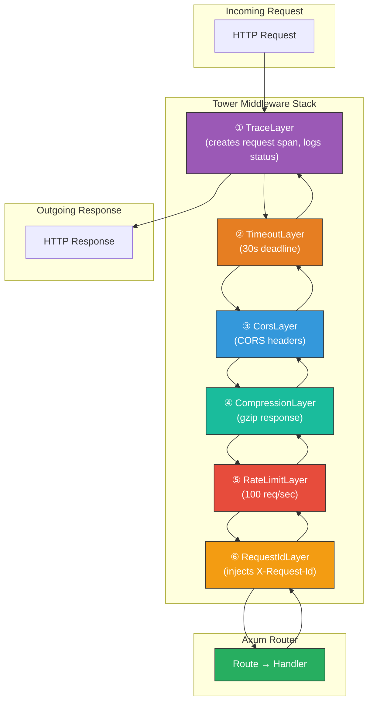

# 3. Tower Middleware and Telemetry 🔴

> **What you'll learn:**
> - How to compose production middleware stacks using `tower::ServiceBuilder` — understanding the order of layer application.
> - The standard Tower middleware catalog: Timeout, Rate Limiting, Concurrency Limiting, CORS, and Compression.
> - How to integrate structured logging and distributed tracing with `tracing`, `tracing-subscriber`, and `tower-http`'s `TraceLayer`.
> - How to write a *custom* Tower layer for cross-cutting concerns like request ID injection or JWT authentication.

**Cross-references:** This chapter builds on the `Service` and `Layer` concepts from [Chapter 1](ch01-hyper-tower-service-trait.md) and applies them to the Axum routes from [Chapter 2](ch02-restful-apis-with-axum.md). For production observability beyond this chapter, see [Enterprise Rust: OpenTelemetry](../enterprise-rust-book/src/SUMMARY.md).

---

## The Middleware Stack in Production

A production microservice never runs bare handlers. Every request must flow through layers of cross-cutting infrastructure: timeouts, rate limiting, CORS, compression, request tracing, and authentication. In the Spring Boot world, these are `@Bean` filters and AOP proxies. In Go, they're `http.Handler` wrappers. In Rust, they're Tower layers.



**Layer order matters.** Layers are applied *outside-in*: the first layer in `ServiceBuilder` is the *outermost* — it sees the raw request first and the final response last.

---

## `ServiceBuilder`: Composing Layers

`tower::ServiceBuilder` chains layers into a single middleware stack:

```rust
use axum::Router;
use tower::ServiceBuilder;
use tower_http::{
    compression::CompressionLayer,
    cors::CorsLayer,
    timeout::TimeoutLayer,
    trace::TraceLayer,
};
use std::time::Duration;

let middleware = ServiceBuilder::new()
    // ① Outermost: Tracing — wraps everything, sees total request time
    .layer(TraceLayer::new_for_http())
    // ② Timeout — if the inner stack takes > 30s, returns 408
    .layer(TimeoutLayer::new(Duration::from_secs(30)))
    // ③ CORS — adds Access-Control-* headers
    .layer(CorsLayer::permissive())
    // ④ Innermost: Compression — compresses the response body
    .layer(CompressionLayer::new());

let app = Router::new()
    .route("/api/users", get(list_users))
    .layer(middleware)
    .with_state(state);
```

### Understanding Layer Order

A common mistake is putting `TraceLayer` after `TimeoutLayer`. This means timeouts are not logged:

```rust
// ⚠️ PRODUCTION HAZARD: Timeout happens OUTSIDE tracing.
// When a request times out, the trace span is never closed properly.
let bad_middleware = ServiceBuilder::new()
    .layer(TimeoutLayer::new(Duration::from_secs(30))) // Outer
    .layer(TraceLayer::new_for_http());                 // Inner

// ✅ FIX: Tracing is outermost — it captures everything, including timeouts.
let good_middleware = ServiceBuilder::new()
    .layer(TraceLayer::new_for_http())                  // Outer
    .layer(TimeoutLayer::new(Duration::from_secs(30))); // Inner
```

| Layer Position | Behavior |
|---------------|----------|
| Outermost (first in `ServiceBuilder`) | Sees raw request, final response, total time |
| Innermost (last in `ServiceBuilder`) | Sees processed request, raw handler response |

---

## Standard Tower/tower-http Layers

### Timeout

Prevents runaway handlers from holding connections forever:

```rust
use tower_http::timeout::TimeoutLayer;
use std::time::Duration;

// Returns HTTP 408 Request Timeout if the inner service takes too long
.layer(TimeoutLayer::new(Duration::from_secs(30)))
```

### CORS

Essential for browser-facing APIs:

```rust
use tower_http::cors::{CorsLayer, Any};
use http::Method;

// Permissive (dev only — allows everything)
.layer(CorsLayer::permissive())

// Production CORS — explicit allowlist
.layer(
    CorsLayer::new()
        .allow_origin(["https://app.example.com".parse().unwrap()])
        .allow_methods([Method::GET, Method::POST, Method::PUT, Method::DELETE])
        .allow_headers(Any)
        .max_age(Duration::from_secs(3600))
)
```

### Rate Limiting

Protect backend resources from abuse:

```rust
use tower::limit::RateLimitLayer;
use std::time::Duration;

// Allow 100 requests per second
.layer(RateLimitLayer::new(100, Duration::from_secs(1)))
```

### Concurrency Limiting

Protect against too many in-flight requests (different from rate limiting):

```rust
use tower::limit::ConcurrencyLimitLayer;

// Allow at most 250 concurrent in-flight requests
.layer(ConcurrencyLimitLayer::new(250))
```

| Concern | Layer | What It Controls |
|---------|-------|-----------------|
| Total time | `TimeoutLayer` | Max duration per request |
| Requests per second | `RateLimitLayer` | Throughput cap |
| In-flight concurrency | `ConcurrencyLimitLayer` | Max simultaneous handling |
| Response size | `CompressionLayer` | gzip/br compression |
| Browser policy | `CorsLayer` | Cross-origin access |

### Compression

```rust
use tower_http::compression::CompressionLayer;

// Automatically compresses responses when the client sends Accept-Encoding
.layer(CompressionLayer::new())
```

---

## Structured Logging and Distributed Tracing

### The `tracing` Ecosystem

Rust's `tracing` crate is not a logging library — it is a *structured, span-based diagnostics system*. Think of it as the Rust equivalent of OpenTelemetry's tracing API.

| Concept | `tracing` | Traditional Logging |
|---------|----------|-------------------|
| Unit of work | `Span` (has duration, parent, fields) | Log line (single point in time) |
| Structured data | Fields (`request.id = "abc"`) | String interpolation |
| Hierarchical | Spans nest (request → db query → row parse) | Flat |
| Asynchronous | Spans work across `.await` boundaries | Broken by async |

### Setting Up `tracing-subscriber`

```rust
use tracing_subscriber::{layer::SubscriberExt, util::SubscriberInitExt, EnvFilter};

fn init_tracing() {
    tracing_subscriber::registry()
        // Filter by RUST_LOG env var, defaulting to info
        .with(
            EnvFilter::try_from_default_env()
                .unwrap_or_else(|_| EnvFilter::new("info,tower_http=debug,sqlx=warn")),
        )
        // Format: JSON in production, pretty in development
        .with(
            tracing_subscriber::fmt::layer()
                .json()                    // Machine-readable JSON output
                .with_target(true)         // Include module path
                .with_thread_ids(true)     // Include thread ID
                .with_span_list(true)      // Include parent spans
        )
        .init();
}
```

### `TraceLayer` for Request-Level Spans

`tower_http::trace::TraceLayer` is the bridge between Tower middleware and `tracing`:

```rust
use tower_http::trace::{TraceLayer, DefaultMakeSpan, DefaultOnResponse};
use tracing::Level;

let trace_layer = TraceLayer::new_for_http()
    .make_span_with(DefaultMakeSpan::new().level(Level::INFO))
    .on_response(DefaultOnResponse::new().level(Level::INFO));

// Every request automatically gets a span like:
// INFO request{method=GET uri=/api/users version=HTTP/1.1}: tower_http::trace: started
// INFO request{method=GET uri=/api/users version=HTTP/1.1}: tower_http::trace: finished status=200 latency=3ms
```

### Custom Span Fields

For richer tracing, override the span creation:

```rust
use axum::extract::MatchedPath;
use tower_http::trace::TraceLayer;

let trace_layer = TraceLayer::new_for_http()
    .make_span_with(|request: &http::Request<_>| {
        // Extract the matched route template (e.g., "/users/{id}" not "/users/42")
        let matched_path = request
            .extensions()
            .get::<MatchedPath>()
            .map(|p| p.as_str().to_owned())
            .unwrap_or_else(|| request.uri().path().to_owned());

        tracing::info_span!(
            "http_request",
            method = %request.method(),
            path = %matched_path,
            // These fields will be filled in later by the response handler
            status = tracing::field::Empty,
            latency_ms = tracing::field::Empty,
        )
    })
    .on_response(|response: &http::Response<_>, latency: Duration, span: &tracing::Span| {
        span.record("status", response.status().as_u16());
        span.record("latency_ms", latency.as_millis());
        tracing::info!("response sent");
    });
```

---

## Writing Custom Middleware

Sometimes the standard layers aren't enough. Here's how to write custom middleware for two common use cases.

### Use Case 1: Request ID Injection

Every request needs a unique ID for tracing across services:

```rust
use axum::{
    http::{Request, HeaderValue},
    middleware::{self, Next},
    response::Response,
};
use uuid::Uuid;

// Axum's middleware::from_fn is the ergonomic way to write middleware.
// It's syntactic sugar over Tower's Layer/Service pattern from Chapter 1.
async fn inject_request_id(
    mut request: Request<axum::body::Body>,
    next: Next,
) -> Response {
    // Generate a unique request ID
    let request_id = Uuid::new_v4().to_string();

    // Insert into request extensions (available to handlers via Extension<RequestId>)
    request.extensions_mut().insert(RequestId(request_id.clone()));

    // Also set it as a response header for client-side correlation
    let mut response = next.run(request).await;
    response.headers_mut().insert(
        "x-request-id",
        HeaderValue::from_str(&request_id).unwrap(),
    );

    response
}

#[derive(Clone)]
struct RequestId(String);

// Register as middleware
let app = Router::new()
    .route("/api/users", get(list_users))
    .layer(middleware::from_fn(inject_request_id));
```

### Use Case 2: JWT Authentication Middleware

```rust
use axum::{
    extract::Request,
    http::StatusCode,
    middleware::Next,
    response::{IntoResponse, Response},
};

#[derive(Clone, Debug)]
struct AuthenticatedUser {
    user_id: String,
    roles: Vec<String>,
}

async fn require_auth(
    mut request: Request,
    next: Next,
) -> Result<Response, StatusCode> {
    // Extract the Authorization header
    let auth_header = request
        .headers()
        .get("authorization")
        .and_then(|v| v.to_str().ok())
        .ok_or(StatusCode::UNAUTHORIZED)?;

    // Validate the Bearer token
    let token = auth_header
        .strip_prefix("Bearer ")
        .ok_or(StatusCode::UNAUTHORIZED)?;

    // Verify the JWT (your actual verification logic here)
    let user = verify_jwt(token)
        .map_err(|_| StatusCode::UNAUTHORIZED)?;

    // Inject the authenticated user into request extensions.
    // Handlers can extract it with Extension<AuthenticatedUser>.
    request.extensions_mut().insert(user);

    Ok(next.run(request).await)
}

// Apply only to protected routes
let app = Router::new()
    .route("/api/public", get(public_handler))
    .route(
        "/api/protected",
        get(protected_handler)
            .layer(middleware::from_fn(require_auth)),
    );

// Or apply to an entire router group
let protected = Router::new()
    .route("/users", get(list_users))
    .route("/admin", get(admin_panel))
    .layer(middleware::from_fn(require_auth));

let app = Router::new()
    .route("/health", get(health))
    .nest("/api", protected);
```

---

## Axum-Specific vs. Tower-Generic Middleware

| Approach | Syntax | Works With Tonic? | Use When |
|----------|--------|-------------------|----------|
| `axum::middleware::from_fn` | `async fn(Request, Next) -> Response` | ❌ Axum only | Simple, handler-like middleware |
| `tower::Layer` + `tower::Service` | Implement traits (Ch 1 pattern) | ✅ Both Axum & Tonic | Reusable across protocols |
| `tower_http` layers | Pre-built layers | ✅ Both | Standard concerns (timeout, CORS, tracing) |

**Rule of thumb:** If your middleware only applies to HTTP routes in Axum, use `from_fn` for ergonomics. If it must work on *both* Axum and Tonic (like in the Chapter 8 capstone), implement it as a Tower layer.

---

## Complete Production Middleware Stack

```rust
use axum::{middleware, Router, routing::get};
use tower::ServiceBuilder;
use tower_http::{
    compression::CompressionLayer,
    cors::{CorsLayer, Any},
    timeout::TimeoutLayer,
    trace::{TraceLayer, DefaultMakeSpan, DefaultOnResponse},
};
use std::time::Duration;
use tracing::Level;

fn build_router(state: AppState) -> Router {
    // Tower-generic middleware (works with Tonic too)
    let tower_middleware = ServiceBuilder::new()
        .layer(
            TraceLayer::new_for_http()
                .make_span_with(DefaultMakeSpan::new().level(Level::INFO))
                .on_response(DefaultOnResponse::new().level(Level::INFO)),
        )
        .layer(TimeoutLayer::new(Duration::from_secs(30)))
        .layer(CompressionLayer::new());

    // Axum-specific middleware
    let axum_middleware = middleware::from_fn(inject_request_id);

    Router::new()
        // Public routes
        .route("/health", get(health))
        // Protected routes with auth
        .nest("/api", api_routes())
        // Axum middleware (applied to all routes above)
        .layer(axum_middleware)
        // Tower middleware (applied outermost)
        .layer(tower_middleware)
        // CORS (outermost — must handle preflight before auth)
        .layer(
            CorsLayer::new()
                .allow_origin(Any)
                .allow_methods(Any)
                .allow_headers(Any),
        )
        .with_state(state)
}
```

---

<details>
<summary><strong>🏋️ Exercise: Build a Rate-Limited API with Per-Route Telemetry</strong> (click to expand)</summary>

**Challenge:** Build an Axum application with the following requirements:

1. **Global middleware stack:** `TraceLayer` → `TimeoutLayer(10s)` → `CompressionLayer`.
2. **A `/api/public` route** that returns `"Hello, public!"` with no rate limiting.
3. **A `/api/limited` route** that is rate-limited to 5 requests per 10 seconds (applied only to this route).
4. **A custom on-response handler** for `TraceLayer` that logs the response status code, latency in milliseconds, and the matched route pattern.
5. **Verify** that the 6th rapid request to `/api/limited` returns HTTP 429 Too Many Requests.

<details>
<summary>🔑 Solution</summary>

```rust
use axum::{extract::MatchedPath, routing::get, Router};
use std::time::Duration;
use tower::ServiceBuilder;
use tower_http::{
    compression::CompressionLayer,
    timeout::TimeoutLayer,
    trace::TraceLayer,
};
use tracing::Level;

#[tokio::main]
async fn main() {
    // ── Initialize tracing ─────────────────────────────────────────
    tracing_subscriber::registry()
        .with(tracing_subscriber::EnvFilter::new("info,tower_http=debug"))
        .with(tracing_subscriber::fmt::layer().compact())
        .init();

    // ── Global middleware stack ─────────────────────────────────────
    // Applied to ALL routes. Layer order: outermost first.
    let global_middleware = ServiceBuilder::new()
        // ① TraceLayer (outermost) — sees everything including timeouts
        .layer(
            TraceLayer::new_for_http()
                .make_span_with(|req: &http::Request<_>| {
                    let path = req
                        .extensions()
                        .get::<MatchedPath>()
                        .map(|p| p.as_str().to_owned())
                        .unwrap_or_else(|| req.uri().path().to_owned());
                    tracing::info_span!(
                        "http",
                        method = %req.method(),
                        path = %path,
                        status = tracing::field::Empty,
                        latency_ms = tracing::field::Empty,
                    )
                })
                .on_response(
                    |res: &http::Response<_>, latency: Duration, span: &tracing::Span| {
                        // Record status and latency into the span fields
                        span.record("status", res.status().as_u16());
                        span.record("latency_ms", latency.as_millis() as u64);
                        tracing::info!(
                            status = res.status().as_u16(),
                            latency_ms = latency.as_millis() as u64,
                            "response"
                        );
                    },
                ),
        )
        // ② Timeout (next) — 10 second deadline
        .layer(TimeoutLayer::new(Duration::from_secs(10)))
        // ③ Compression (innermost of global stack)
        .layer(CompressionLayer::new());

    // ── Per-route rate limit ───────────────────────────────────────
    // Applied ONLY to /api/limited, not to /api/public.
    // 5 requests per 10 seconds.
    let rate_limit = tower::limit::RateLimitLayer::new(5, Duration::from_secs(10));

    // ── Build the router ───────────────────────────────────────────
    let app = Router::new()
        .route("/api/public", get(|| async { "Hello, public!" }))
        .route(
            "/api/limited",
            get(|| async { "Hello, limited!" })
                // Per-route middleware: rate limit only this endpoint
                .layer(rate_limit),
        )
        // Global middleware wraps everything
        .layer(global_middleware);

    // ── Serve ──────────────────────────────────────────────────────
    let listener = tokio::net::TcpListener::bind("0.0.0.0:3000").await.unwrap();
    tracing::info!("Listening on :3000");
    axum::serve(listener, app).await.unwrap();
}

// ── Verification ───────────────────────────────────────────────────
// Run: for i in $(seq 1 7); do curl -w "%{http_code}\n" -s -o /dev/null http://localhost:3000/api/limited; done
//
// Expected output:
//   200    (request 1)
//   200    (request 2)
//   200    (request 3)
//   200    (request 4)
//   200    (request 5)
//   429    (request 6 — rate limited!)
//   429    (request 7 — still rate limited)
//
// Meanwhile, /api/public always returns 200 regardless of how many times you hit it.
```

**Key points:**
- Global middleware is applied with `Router::layer()` — it wraps all routes.
- Per-route middleware is applied with `MethodRouter::layer()` (on the `get()` call) — it wraps only that handler.
- `TraceLayer` uses `MatchedPath` to log the route *template* (`/api/limited`) not the concrete path, which is critical for metrics aggregation.
- The `on_response` closure records fields into the existing span, enabling both structured logs and potential export to Jaeger/Zipkin.

</details>
</details>

---

> **Key Takeaways**
> - **Layer order matters**: the first layer in `ServiceBuilder` is the outermost wrap. Put `TraceLayer` first to capture everything, including timeouts.
> - **`tower-http`** provides battle-tested layers: `TimeoutLayer`, `CorsLayer`, `CompressionLayer`, `TraceLayer`. Prefer these over hand-rolling.
> - **`tracing`** is a structured, span-based diagnostics system — not a logger. It works across `.await` boundaries and supports OpenTelemetry export.
> - Use `axum::middleware::from_fn` for simple, HTTP-only middleware. Use `tower::Layer` implementations for middleware that must work across both Axum and Tonic.
> - Per-route middleware is applied via `MethodRouter::layer()`; global middleware via `Router::layer()`.

---

> **See also:**
> - [Chapter 1: Hyper, Tower, and the Service Trait](ch01-hyper-tower-service-trait.md) — the Layer/Service theory this chapter applies.
> - [Chapter 8: Capstone](ch08-capstone-unified-polyglot-microservice.md) — where Tower middleware is shared across Axum and Tonic on the same port.
> - [Enterprise Rust: OpenTelemetry](../enterprise-rust-book/src/SUMMARY.md) — for full distributed tracing pipelines with Jaeger and Prometheus.
> - [Async Rust: Cancellation Safety](../async-book/src/SUMMARY.md) — for understanding how `TimeoutLayer` cancels futures.
